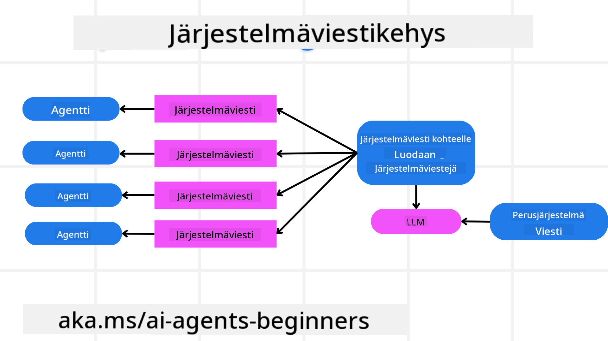
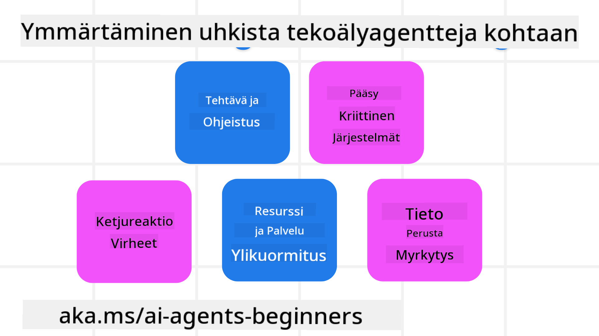
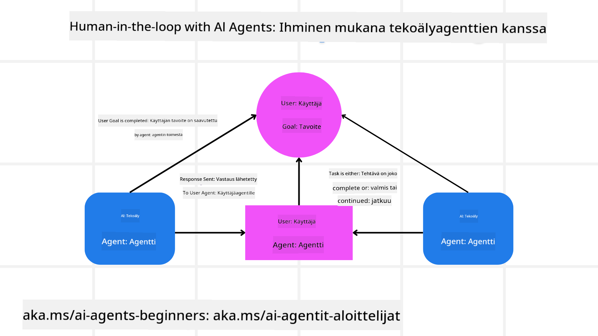

<!--
CO_OP_TRANSLATOR_METADATA:
{
  "original_hash": "f57852cac3a86c4a5ef47f793cc12178",
  "translation_date": "2025-07-12T10:28:46+00:00",
  "source_file": "06-building-trustworthy-agents/README.md",
  "language_code": "fi"
}
-->
[](https://youtu.be/iZKkMEGBCUQ?si=Q-kEbcyHUMPoHp8L)

> _(Napsauta yllä olevaa kuvaa nähdäksesi tämän oppitunnin videon)_

# Luotettavien tekoälyagenttien rakentaminen

## Johdanto

Tässä oppitunnissa käsitellään:

- Kuinka rakentaa ja ottaa käyttöön turvallisia ja tehokkaita tekoälyagentteja
- Tärkeitä turvallisuusnäkökohtia tekoälyagenttien kehittämisessä
- Kuinka ylläpitää tietojen ja käyttäjien yksityisyyttä tekoälyagentteja kehitettäessä

## Oppimistavoitteet

Oppitunnin suorittamisen jälkeen osaat:

- Tunnistaa ja vähentää riskejä tekoälyagentteja luodessa
- Toteuttaa turvallisuustoimia, jotka varmistavat tietojen ja pääsyn asianmukaisen hallinnan
- Luoda tekoälyagentteja, jotka ylläpitävät tietosuojaa ja tarjoavat laadukkaan käyttäjäkokemuksen

## Turvallisuus

Aloitetaan turvallisten agenttisovellusten rakentamisesta. Turvallisuus tarkoittaa, että tekoälyagentti toimii suunnitellusti. Agenttisovellusten rakentajina meillä on menetelmiä ja työkaluja turvallisuuden maksimoimiseksi:

### Järjestelmäviestikehyksen rakentaminen

Jos olet koskaan rakentanut tekoälysovellusta käyttämällä suuria kielimalleja (LLM), tiedät kuinka tärkeää on suunnitella vankka järjestelmäkehotus tai järjestelmäviesti. Nämä kehotukset määrittävät metatason säännöt, ohjeet ja suuntaviivat sille, miten LLM vuorovaikuttaa käyttäjän ja datan kanssa.

Tekoälyagenttien kohdalla järjestelmäkehotus on vielä tärkeämpi, sillä agenttien täytyy saada hyvin tarkat ohjeet suorittaakseen meille suunnitellut tehtävät.

Skaalautuvien järjestelmäkehotusten luomiseksi voimme käyttää järjestelmäviestikehystä rakentaaksemme yhden tai useamman agentin sovellukseemme:



#### Vaihe 1: Luo meta-järjestelmäviesti

Meta-kehotusta käyttää LLM luodakseen järjestelmäkehotukset agentteja varten. Suunnittelemme sen malliksi, jotta voimme tehokkaasti luoda useita agentteja tarvittaessa.

Tässä esimerkki meta-järjestelmäviestistä, jonka antaisimme LLM:lle:

```plaintext
You are an expert at creating AI agent assistants. 
You will be provided a company name, role, responsibilities and other
information that you will use to provide a system prompt for.
To create the system prompt, be descriptive as possible and provide a structure that a system using an LLM can better understand the role and responsibilities of the AI assistant. 
```

#### Vaihe 2: Luo peruskehotus

Seuraavaksi luodaan peruskehotus, joka kuvaa tekoälyagenttia. Siihen tulisi sisällyttää agentin rooli, agentin suorittamat tehtävät sekä muut agentin vastuut.

Tässä esimerkki:

```plaintext
You are a travel agent for Contoso Travel that is great at booking flights for customers. To help customers you can perform the following tasks: lookup available flights, book flights, ask for preferences in seating and times for flights, cancel any previously booked flights and alert customers on any delays or cancellations of flights.  
```

#### Vaihe 3: Anna perusjärjestelmäviesti LLM:lle

Nyt voimme optimoida tämän järjestelmäviestin antamalla meta-järjestelmäviestin järjestelmäviestinä ja perusjärjestelmäviestimme.

Tämä tuottaa paremmin suunnitellun järjestelmäviestin, joka ohjaa tekoälyagenttejamme:

```markdown
**Company Name:** Contoso Travel  
**Role:** Travel Agent Assistant

**Objective:**  
You are an AI-powered travel agent assistant for Contoso Travel, specializing in booking flights and providing exceptional customer service. Your main goal is to assist customers in finding, booking, and managing their flights, all while ensuring that their preferences and needs are met efficiently.

**Key Responsibilities:**

1. **Flight Lookup:**
    
    - Assist customers in searching for available flights based on their specified destination, dates, and any other relevant preferences.
    - Provide a list of options, including flight times, airlines, layovers, and pricing.
2. **Flight Booking:**
    
    - Facilitate the booking of flights for customers, ensuring that all details are correctly entered into the system.
    - Confirm bookings and provide customers with their itinerary, including confirmation numbers and any other pertinent information.
3. **Customer Preference Inquiry:**
    
    - Actively ask customers for their preferences regarding seating (e.g., aisle, window, extra legroom) and preferred times for flights (e.g., morning, afternoon, evening).
    - Record these preferences for future reference and tailor suggestions accordingly.
4. **Flight Cancellation:**
    
    - Assist customers in canceling previously booked flights if needed, following company policies and procedures.
    - Notify customers of any necessary refunds or additional steps that may be required for cancellations.
5. **Flight Monitoring:**
    
    - Monitor the status of booked flights and alert customers in real-time about any delays, cancellations, or changes to their flight schedule.
    - Provide updates through preferred communication channels (e.g., email, SMS) as needed.

**Tone and Style:**

- Maintain a friendly, professional, and approachable demeanor in all interactions with customers.
- Ensure that all communication is clear, informative, and tailored to the customer's specific needs and inquiries.

**User Interaction Instructions:**

- Respond to customer queries promptly and accurately.
- Use a conversational style while ensuring professionalism.
- Prioritize customer satisfaction by being attentive, empathetic, and proactive in all assistance provided.

**Additional Notes:**

- Stay updated on any changes to airline policies, travel restrictions, and other relevant information that could impact flight bookings and customer experience.
- Use clear and concise language to explain options and processes, avoiding jargon where possible for better customer understanding.

This AI assistant is designed to streamline the flight booking process for customers of Contoso Travel, ensuring that all their travel needs are met efficiently and effectively.

```

#### Vaihe 4: Toista ja paranna

Tämän järjestelmäviestikehyksen arvo on siinä, että se helpottaa useiden agenttien järjestelmäviestien luomista ja mahdollistaa viestien parantamisen ajan myötä. On harvinaista, että järjestelmäviesti toimii täydellisesti heti ensimmäisellä kerralla koko käyttötapaukseen. Pienten säätöjen tekeminen perusjärjestelmäviestiin ja sen ajaminen järjestelmän läpi antaa mahdollisuuden vertailla ja arvioida tuloksia.

## Uhkien ymmärtäminen

Luotettavien tekoälyagenttien rakentamiseksi on tärkeää ymmärtää ja vähentää riskejä ja uhkia, jotka kohdistuvat tekoälyagenttiin. Tarkastellaan joitakin tekoälyagentteihin kohdistuvia uhkia ja miten voit paremmin suunnitella ja varautua niihin.



### Tehtävä ja ohjeistus

**Kuvaus:** Hyökkääjät yrittävät muuttaa tekoälyagentin ohjeita tai tavoitteita kehotusten tai syötteiden manipuloinnin avulla.

**Vähennys:** Suorita validointitarkistuksia ja syötesuodattimia havaitaksesi mahdollisesti vaaralliset kehotukset ennen kuin tekoälyagentti käsittelee ne. Koska nämä hyökkäykset vaativat yleensä toistuvaa vuorovaikutusta agentin kanssa, keskustelukierrosten rajoittaminen on toinen tapa estää tämän tyyppisiä hyökkäyksiä.

### Pääsy kriittisiin järjestelmiin

**Kuvaus:** Jos tekoälyagentilla on pääsy järjestelmiin ja palveluihin, jotka tallentavat arkaluonteisia tietoja, hyökkääjät voivat vaarantaa viestinnän agentin ja näiden palveluiden välillä. Nämä voivat olla suoria hyökkäyksiä tai epäsuoria yrityksiä saada tietoa näistä järjestelmistä agentin kautta.

**Vähennys:** Tekoälyagenttien pääsy järjestelmiin tulisi rajoittaa tarpeen mukaan tämän tyyppisten hyökkäysten estämiseksi. Agentin ja järjestelmän välinen viestintä tulisi myös suojata. Todennuksen ja pääsynhallinnan toteuttaminen on toinen tapa suojata tätä tietoa.

### Resurssien ja palveluiden ylikuormitus

**Kuvaus:** Tekoälyagentit voivat käyttää erilaisia työkaluja ja palveluita tehtävien suorittamiseen. Hyökkääjät voivat käyttää tätä kykyä hyökätäkseen näihin palveluihin lähettämällä suuren määrän pyyntöjä tekoälyagentin kautta, mikä voi johtaa järjestelmävikaan tai korkeisiin kustannuksiin.

**Vähennys:** Ota käyttöön käytännöt, jotka rajoittavat tekoälyagentin tekemien pyyntöjen määrää palveluun. Keskustelukierrosten ja pyyntöjen rajoittaminen tekoälyagentille on toinen tapa estää tämän tyyppisiä hyökkäyksiä.

### Tietopohjan myrkyttäminen

**Kuvaus:** Tämä hyökkäys ei kohdistu suoraan tekoälyagenttiin, vaan tietopohjaan ja muihin palveluihin, joita agentti käyttää. Se voi tarkoittaa datan tai tiedon korruptiota, jota agentti käyttää tehtävän suorittamiseen, mikä johtaa puolueellisiin tai ei-toivottuihin vastauksiin käyttäjälle.

**Vähennys:** Suorita säännöllisiä tarkistuksia datalle, jota tekoälyagentti käyttää työnkuluissaan. Varmista, että pääsy tähän dataan on suojattu ja että sitä voivat muuttaa vain luotettavat henkilöt tämän tyyppisen hyökkäyksen välttämiseksi.

### Virheiden ketjureaktiot

**Kuvaus:** Tekoälyagentit käyttävät erilaisia työkaluja ja palveluita tehtävien suorittamiseen. Hyökkääjien aiheuttamat virheet voivat johtaa muiden agenttiin kytkettyjen järjestelmien vikoihin, mikä laajentaa hyökkäystä ja vaikeuttaa vianmääritystä.

**Vähennys:** Yksi tapa välttää tämä on pitää tekoälyagentti rajatussa ympäristössä, kuten suorittamalla tehtäviä Docker-kontissa, estämään suorat järjestelmähyökkäykset. Varajärjestelmien ja uudelleenkäynnistyslogiikan luominen virhevastauksia antavien järjestelmien varalle on toinen tapa estää laajempia järjestelmävikoja.

## Ihminen prosessissa

Toinen tehokas tapa rakentaa luotettavia tekoälyagenttijärjestelmiä on käyttää ihmistä prosessissa (Human-in-the-loop). Tämä luo prosessin, jossa käyttäjät voivat antaa palautetta agenteille suorituksen aikana. Käyttäjät toimivat ikään kuin agentteina monen agentin järjestelmässä ja voivat hyväksyä tai keskeyttää käynnissä olevan prosessin.



Tässä on koodiesimerkki AutoGenin avulla, joka näyttää, miten tämä konsepti toteutetaan:

```python

# Create the agents.
model_client = OpenAIChatCompletionClient(model="gpt-4o-mini")
assistant = AssistantAgent("assistant", model_client=model_client)
user_proxy = UserProxyAgent("user_proxy", input_func=input)  # Use input() to get user input from console.

# Create the termination condition which will end the conversation when the user says "APPROVE".
termination = TextMentionTermination("APPROVE")

# Create the team.
team = RoundRobinGroupChat([assistant, user_proxy], termination_condition=termination)

# Run the conversation and stream to the console.
stream = team.run_stream(task="Write a 4-line poem about the ocean.")
# Use asyncio.run(...) when running in a script.
await Console(stream)

```

## Yhteenveto

Luotettavien tekoälyagenttien rakentaminen vaatii huolellista suunnittelua, vahvoja turvallisuustoimia ja jatkuvaa kehittämistä. Rakentamalla rakenteellisia meta-kehotusjärjestelmiä, ymmärtämällä mahdolliset uhat ja soveltamalla vähennysstrategioita kehittäjät voivat luoda tekoälyagentteja, jotka ovat sekä turvallisia että tehokkaita. Lisäksi ihmisen osallistaminen prosessiin varmistaa, että tekoälyagentit pysyvät käyttäjien tarpeiden mukaisina ja riskit minimoidaan. Kun tekoäly kehittyy, ennakoiva suhtautuminen turvallisuuteen, yksityisyyteen ja eettisiin kysymyksiin on avain luottamuksen ja luotettavuuden rakentamiseen tekoälypohjaisissa järjestelmissä.

## Lisäresurssit

- <a href="https://learn.microsoft.com/azure/ai-studio/responsible-use-of-ai-overview" target="_blank">Responsible AI overview</a>
- <a href="https://learn.microsoft.com/azure/ai-studio/concepts/evaluation-approach-gen-ai" target="_blank">Evaluation of generative AI models and AI applications</a>
- <a href="https://learn.microsoft.com/azure/ai-services/openai/concepts/system-message?context=%2Fazure%2Fai-studio%2Fcontext%2Fcontext&tabs=top-techniques" target="_blank">Safety system messages</a>
- <a href="https://blogs.microsoft.com/wp-content/uploads/prod/sites/5/2022/06/Microsoft-RAI-Impact-Assessment-Template.pdf?culture=en-us&country=us" target="_blank">Risk Assessment Template</a>

## Edellinen oppitunti

[Agentic RAG](../05-agentic-rag/README.md)

## Seuraava oppitunti

[Planning Design Pattern](../07-planning-design/README.md)

**Vastuuvapauslauseke**:  
Tämä asiakirja on käännetty käyttämällä tekoälypohjaista käännöspalvelua [Co-op Translator](https://github.com/Azure/co-op-translator). Vaikka pyrimme tarkkuuteen, huomioithan, että automaattikäännöksissä saattaa esiintyä virheitä tai epätarkkuuksia. Alkuperäistä asiakirjaa sen alkuperäiskielellä tulee pitää virallisena lähteenä. Tärkeissä tiedoissa suositellaan ammattimaista ihmiskäännöstä. Emme ole vastuussa tämän käännöksen käytöstä aiheutuvista väärinymmärryksistä tai tulkinnoista.