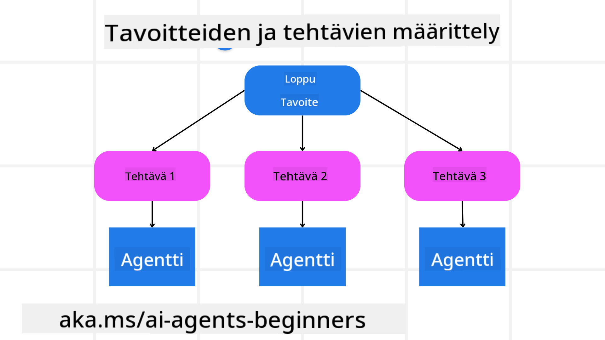

<!--
CO_OP_TRANSLATOR_METADATA:
{
  "original_hash": "a28d30590704ea13b6a08d4793cf9c2b",
  "translation_date": "2025-08-29T17:18:10+00:00",
  "source_file": "07-planning-design/README.md",
  "language_code": "fi"
}
-->

> _(Klikkaa yllä olevaa kuvaa katsoaksesi tämän oppitunnin videon)_

# Suunnittelun suunnittelu

## Johdanto

Tässä oppitunnissa käsitellään:

* Selkeän kokonaisvaltaisen tavoitteen määrittelyä ja monimutkaisen tehtävän pilkkomista hallittaviin osiin.
* Rakenteellisen ulostulon hyödyntämistä luotettavampien ja koneellisesti luettavien vastausten saamiseksi.
* Tapahtumapohjaisen lähestymistavan soveltamista dynaamisten tehtävien ja odottamattomien syötteiden käsittelyyn.

## Oppimistavoitteet

Tämän oppitunnin jälkeen ymmärrät:

* Kuinka tunnistaa ja asettaa tekoälyagentille kokonaisvaltainen tavoite, jotta se tietää selkeästi, mitä sen tulee saavuttaa.
* Kuinka pilkkoa monimutkainen tehtävä hallittaviin osatehtäviin ja järjestää ne loogiseen järjestykseen.
* Kuinka varustaa agentit oikeilla työkaluilla (esim. hakutyökalut tai data-analyysityökalut), päättää milloin ja miten niitä käytetään, ja käsitellä odottamattomia tilanteita.
* Kuinka arvioida osatehtävien tuloksia, mitata suorituskykyä ja iteratiivisesti parantaa lopputulosta.

## Kokonaisvaltaisen tavoitteen määrittely ja tehtävän pilkkominen

Useimmat tosielämän tehtävät ovat liian monimutkaisia ratkaistavaksi yhdellä askeleella. Tekoälyagentti tarvitsee tiiviin tavoitteen ohjaamaan sen suunnittelua ja toimia. Esimerkiksi tavoite:

    "Luo 3 päivän matkasuunnitelma."

Vaikka tavoite on yksinkertainen ilmaista, se vaatii silti tarkennusta. Mitä selkeämpi tavoite, sitä paremmin agentti (ja mahdolliset ihmiskollegat) voivat keskittyä oikean lopputuloksen saavuttamiseen, kuten kattavan matkasuunnitelman luomiseen, joka sisältää lentovaihtoehdot, hotellisuositukset ja aktiviteettiehdotukset.

### Tehtävän pilkkominen

Suurista tai monimutkaisista tehtävistä tulee hallittavampia, kun ne jaetaan pienempiin, tavoitekeskeisiin osatehtäviin. Esimerkiksi matkasuunnitelman tapauksessa tavoite voidaan pilkkoa seuraavasti:

* Lentojen varaaminen
* Hotellin varaaminen
* Auton vuokraus
* Henkilökohtainen räätälöinti

Jokainen osatehtävä voidaan sitten antaa omistautuneille agenteille tai prosesseille. Yksi agentti voi erikoistua etsimään parhaita lentotarjouksia, toinen keskittyy hotellivarauksiin ja niin edelleen. Koordinoiva tai "alavirran" agentti voi sitten koota nämä tulokset yhdeksi yhtenäiseksi matkasuunnitelmaksi loppukäyttäjälle.

Tämä modulaarinen lähestymistapa mahdollistaa myös asteittaiset parannukset. Esimerkiksi voit lisätä erikoistuneita agentteja ruokasuosituksia tai paikallisia aktiviteettiehdotuksia varten ja hioa matkasuunnitelmaa ajan myötä.

### Rakenteellinen ulostulo

Laajat kielimallit (LLM:t) voivat tuottaa rakenteellista ulostuloa (esim. JSON), joka on helpompi jäsentää ja käsitellä alavirran agenteille tai palveluille. Tämä on erityisen hyödyllistä monen agentin kontekstissa, jossa tehtäviä voidaan suorittaa suunnittelun ulostulon vastaanottamisen jälkeen. Katso tämä

---

**Vastuuvapauslauseke**:  
Tämä asiakirja on käännetty käyttämällä tekoälypohjaista käännöspalvelua [Co-op Translator](https://github.com/Azure/co-op-translator). Vaikka pyrimme tarkkuuteen, huomioithan, että automaattiset käännökset voivat sisältää virheitä tai epätarkkuuksia. Alkuperäistä asiakirjaa sen alkuperäisellä kielellä tulee pitää ensisijaisena lähteenä. Kriittisen tiedon osalta suositellaan ammattimaista ihmiskääntämistä. Emme ole vastuussa väärinkäsityksistä tai virhetulkinnoista, jotka johtuvat tämän käännöksen käytöstä.