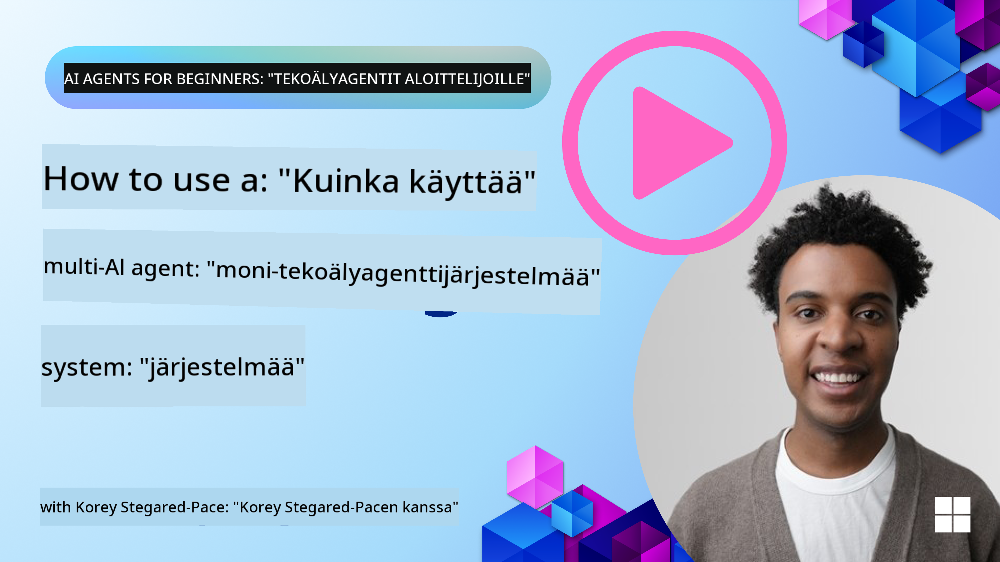
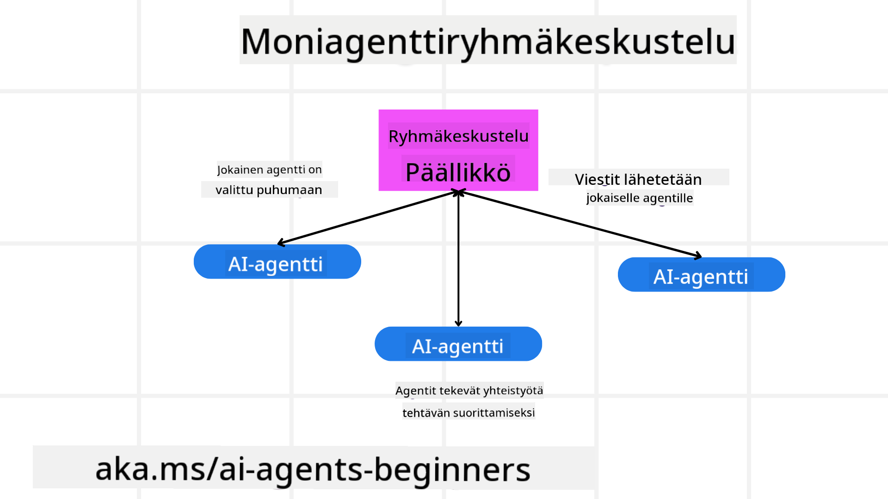
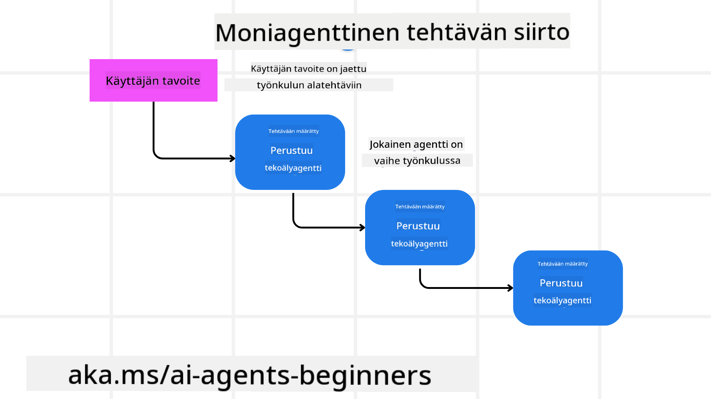
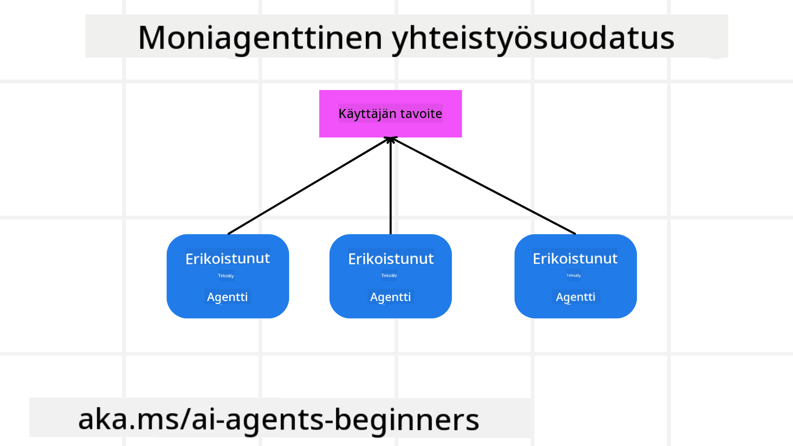

<!--
CO_OP_TRANSLATOR_METADATA:
{
  "original_hash": "c692a8975d7d5b99575a553de1c5e8a7",
  "translation_date": "2025-07-12T11:15:39+00:00",
  "source_file": "08-multi-agent/README.md",
  "language_code": "fi"
}
-->

> _(Napsauta yllä olevaa kuvaa nähdäksesi tämän oppitunnin videon)_

# Moniagenttisuunnittelumallit

Heti kun aloitat projektin, joka sisältää useita agenteja, sinun täytyy ottaa huomioon moniagenttisuunnittelumalli. Aluksi ei välttämättä ole täysin selvää, milloin siirtyä moniagenttijärjestelmään ja mitkä ovat sen edut.

## Johdanto

Tässä oppitunnissa pyrimme vastaamaan seuraaviin kysymyksiin:

- Millaisissa tilanteissa moniagenttijärjestelmät ovat käyttökelpoisia?
- Mitkä ovat moniagenttijärjestelmän edut verrattuna siihen, että yksi agentti hoitaisi useita tehtäviä?
- Mitkä ovat moniagenttisuunnittelumallin toteutuksen peruselementit?
- Miten voimme saada näkyvyyden siihen, miten useat agentit ovat vuorovaikutuksessa keskenään?

## Oppimistavoitteet

Tämän oppitunnin jälkeen sinun tulisi osata:

- Tunnistaa tilanteet, joissa moniagenttijärjestelmät ovat soveltuvia
- Ymmärtää moniagenttijärjestelmän edut verrattuna yksittäiseen agenttiin
- Hallita moniagenttisuunnittelumallin toteutuksen peruselementit

Mikä on laajempi kokonaiskuva?

*Moniagentit ovat suunnittelumalli, joka mahdollistaa useiden agenttien yhteistyön yhteisen tavoitteen saavuttamiseksi*.

Tätä mallia käytetään laajasti eri aloilla, kuten robotiikassa, autonomisissa järjestelmissä ja hajautetussa laskennassa.

## Tilanteet, joissa moniagentit ovat käyttökelpoisia

Missä tilanteissa moniagenttijärjestelmät ovat hyödyllisiä? Vastaus on, että moniagenttien käyttö on hyödyllistä monissa tilanteissa, erityisesti seuraavissa tapauksissa:

- **Suuret työkuormat**: Suuret työkuormat voidaan jakaa pienempiin tehtäviin ja jakaa eri agenteille, mikä mahdollistaa rinnakkaisen käsittelyn ja nopeamman valmistumisen. Esimerkkinä tästä on suuri datankäsittelytehtävä.
- **Monimutkaiset tehtävät**: Monimutkaiset tehtävät, kuten suuret työkuormat, voidaan pilkkoa pienempiin osatehtäviin ja jakaa eri agenteille, jotka erikoistuvat tiettyihin tehtävän osa-alueisiin. Hyvä esimerkki tästä on autonomiset ajoneuvot, joissa eri agentit hoitavat navigaatiota, esteiden havaitsemista ja viestintää muiden ajoneuvojen kanssa.
- **Monipuolinen asiantuntemus**: Eri agenteilla voi olla erilaisia erikoisosaamisia, mikä mahdollistaa tehtävän eri osa-alueiden tehokkaamman hoitamisen kuin yhdellä agentilla. Tähän sopii hyvin terveydenhuolto, jossa agentit voivat hoitaa diagnostiikkaa, hoitosuunnitelmia ja potilaan seurantaa.

## Moniagenttien käytön edut verrattuna yksittäiseen agenttiin

Yksittäinen agenttijärjestelmä voi toimia hyvin yksinkertaisissa tehtävissä, mutta monimutkaisemmissa tehtävissä moniagenttijärjestelmä tarjoaa useita etuja:

- **Erikoistuminen**: Jokainen agentti voi erikoistua tiettyyn tehtävään. Yksittäisen agentin puutteena on erikoistumisen puute, jolloin agentti yrittää hoitaa kaikkea, mutta saattaa hämmentyä monimutkaisissa tehtävissä. Se saattaa esimerkiksi päätyä tekemään tehtävän, johon se ei ole parhaiten soveltuva.
- **Skaalautuvuus**: Järjestelmän laajentaminen on helpompaa lisäämällä agentteja kuin kuormittamalla yhtä agenttia liikaa.
- **Vikasietoisuus**: Jos yksi agentti epäonnistuu, muut voivat jatkaa toimintaansa, mikä takaa järjestelmän luotettavuuden.

Otetaan esimerkki: varataan käyttäjälle matka. Yksittäinen agenttijärjestelmä joutuisi hoitamaan kaikki matkanvarauksen vaiheet, lentojen etsimisestä hotellien ja vuokra-autojen varaamiseen. Tämän toteuttamiseksi agentilla pitäisi olla työkalut kaikkien näiden tehtävien hoitamiseen, mikä voisi johtaa monimutkaiseen ja vaikeasti ylläpidettävään järjestelmään. Moniagenttijärjestelmässä eri agentit voisivat erikoistua lentojen etsimiseen, hotellien varaamiseen ja vuokra-autojen hoitamiseen. Tämä tekisi järjestelmästä modulaarisemman, helpommin ylläpidettävän ja skaalautuvan.

Vertaa tätä matkatoimistoon, joka toimii perheyrityksenä verrattuna matkatoimistoon, joka toimii franchising-periaatteella. Perheyrityksessä yksi agentti hoitaisi kaikki matkanvarauksen vaiheet, kun taas franchisingissa eri agentit hoitaisivat eri osat prosessista.

## Moniagenttisuunnittelumallin toteutuksen peruselementit

Ennen kuin voit toteuttaa moniagenttisuunnittelumallin, sinun täytyy ymmärtää mallin peruselementit.

Tehdään tämä konkreettisemmaksi katsomalla jälleen esimerkkiä käyttäjän matkan varaamisesta. Tässä tapauksessa peruselementteihin kuuluvat:

- **Agenttien välinen viestintä**: Lentojen etsintään, hotellien ja vuokra-autojen varaamiseen erikoistuneiden agenttien täytyy kommunikoida ja jakaa tietoa käyttäjän mieltymyksistä ja rajoitteista. Sinun täytyy päättää, mitä protokollia ja menetelmiä käytetään tähän viestintään. Konkreettisesti tämä tarkoittaa, että lentojen etsintään erikoistunut agentti kommunikoi hotellivarausagentin kanssa varmistaakseen, että hotelli on varattu samoille päiville kuin lento. Tämä tarkoittaa, että agenttien täytyy jakaa tietoa käyttäjän matkustuspäivistä, eli sinun täytyy päättää *mitkä agentit jakavat tietoa ja miten*.
- **Koordinointimekanismit**: Agenttien täytyy koordinoida toimintaansa varmistaakseen, että käyttäjän mieltymykset ja rajoitteet täyttyvät. Käyttäjän mieltymys voi olla esimerkiksi hotelli lähellä lentokenttää, kun taas rajoite voi olla, että vuokra-autot ovat saatavilla vain lentokentältä. Tämä tarkoittaa, että hotellivarausagentin täytyy koordinoida vuokra-autojen varaamiseen erikoistuneen agentin kanssa varmistaakseen, että käyttäjän mieltymykset ja rajoitteet täyttyvät. Sinun täytyy siis päättää *miten agentit koordinoivat toimintaansa*.
- **Agenttien arkkitehtuuri**: Agenttien täytyy sisältää sisäinen rakenne päätöksentekoa ja oppimista varten käyttäjän kanssa käydyistä vuorovaikutuksista. Tämä tarkoittaa, että lentojen etsintään erikoistuneella agentilla täytyy olla sisäinen rakenne, joka mahdollistaa päätösten tekemisen siitä, mitä lentoja suositellaan käyttäjälle. Sinun täytyy päättää *miten agentit tekevät päätöksiä ja oppivat vuorovaikutuksistaan käyttäjän kanssa*. Esimerkkinä agentin oppimisesta voisi olla, että lentojen etsintään erikoistunut agentti käyttää koneoppimismallia suositellakseen lentoja käyttäjän aiempien mieltymysten perusteella.
- **Näkyvyys moniagenttien vuorovaikutukseen**: Sinun täytyy saada näkyvyys siihen, miten useat agentit ovat vuorovaikutuksessa keskenään. Tämä tarkoittaa, että tarvitset työkaluja ja menetelmiä agenttien toimintojen ja vuorovaikutusten seuraamiseen. Tämä voi olla esimerkiksi lokitus- ja valvontatyökaluja, visualisointityökaluja ja suorituskykymittareita.
- **Moniagenttimallit**: Moniagenttijärjestelmiä voidaan toteuttaa eri malleilla, kuten keskitetty, hajautettu ja hybridiarkkitehtuurit. Sinun täytyy päättää, mikä malli sopii parhaiten käyttötarkoitukseesi.
- **Ihminen mukana prosessissa**: Useimmissa tapauksissa ihmisen rooli on mukana, ja sinun täytyy ohjeistaa agentteja, milloin pyytää ihmisen väliintuloa. Tämä voi olla esimerkiksi käyttäjän pyyntö tietystä hotellista tai lennosta, jota agentit eivät ole suositelleet, tai vahvistuksen pyytäminen ennen lennon tai hotellin varaamista.

## Näkyvyys moniagenttien vuorovaikutukseen

On tärkeää, että sinulla on näkyvyys siihen, miten useat agentit ovat vuorovaikutuksessa keskenään. Tämä näkyvyys on olennaista virheiden korjaamiseksi, optimoinniksi ja koko järjestelmän tehokkuuden varmistamiseksi. Saavuttaaksesi tämän, tarvitset työkaluja ja menetelmiä agenttien toimintojen ja vuorovaikutusten seuraamiseen. Tämä voi olla lokitus- ja valvontatyökaluja, visualisointityökaluja ja suorituskykymittareita.

Esimerkiksi käyttäjän matkan varaamisen tapauksessa voitaisiin käyttää hallintapaneelia, joka näyttää kunkin agentin tilan, käyttäjän mieltymykset ja rajoitteet sekä agenttien väliset vuorovaikutukset. Tämä hallintapaneeli voisi näyttää käyttäjän matkustuspäivät, lentojen suositukset lentojen etsintään erikoistuneelta agentilta, hotellien suositukset hotellivarausagentilta ja vuokra-autojen suositukset vuokra-autojen varaamiseen erikoistuneelta agentilta. Tämä antaisi selkeän kuvan siitä, miten agentit ovat vuorovaikutuksessa ja täyttyvätkö käyttäjän mieltymykset ja rajoitteet.

Katsotaanpa näitä osa-alueita tarkemmin.

- **Lokitus- ja valvontatyökalut**: Haluat kirjata ylös jokaisen agentin tekemän toimenpiteen. Lokimerkintä voisi sisältää tiedot agentista, joka suoritti toimenpiteen, tehdystä toimenpiteestä, ajankohdasta ja toimenpiteen tuloksesta. Näitä tietoja voidaan käyttää virheiden korjaamiseen, optimointiin ja muuhun.
- **Visualisointityökalut**: Visualisointityökalut auttavat näkemään agenttien väliset vuorovaikutukset intuitiivisemmin. Esimerkiksi voitaisiin käyttää kaaviota, joka näyttää tiedon kulun agenttien välillä. Tämä voi auttaa tunnistamaan pullonkauloja, tehottomuuksia ja muita järjestelmän ongelmia.
- **Suorituskykymittarit**: Suorituskykymittarit auttavat seuraamaan moniagenttijärjestelmän tehokkuutta. Voit esimerkiksi mitata tehtävän suorittamiseen kulunutta aikaa, suoritettujen tehtävien määrää aikayksikköä kohden ja agenttien antamien suositusten tarkkuutta. Näiden tietojen avulla voit tunnistaa parannuskohteita ja optimoida järjestelmää.

## Moniagenttimallit

Tutustutaan konkreettisiin malleihin, joita voimme käyttää moniagenttisovellusten luomiseen. Tässä muutamia mielenkiintoisia malleja, joita kannattaa harkita:

### Ryhmäkeskustelu

Tämä malli on hyödyllinen, kun haluat luoda ryhmäkeskustelusovelluksen, jossa useat agentit voivat kommunikoida keskenään. Tyypillisiä käyttötapauksia ovat tiimityö, asiakastuki ja sosiaalinen verkostoituminen.

Tässä mallissa kukin agentti edustaa käyttäjää ryhmäkeskustelussa, ja viestit vaihdetaan agenttien välillä viestintäprotokollaa käyttäen. Agentit voivat lähettää viestejä ryhmäkeskusteluun, vastaanottaa viestejä ja vastata muiden agenttien viesteihin.

Tämä malli voidaan toteuttaa keskitetyn arkkitehtuurin avulla, jossa kaikki viestit kulkevat keskuspalvelimen kautta, tai hajautetun arkkitehtuurin avulla, jossa viestit vaihdetaan suoraan agenttien välillä.

### Tehtävien siirto

Tämä malli on hyödyllinen, kun haluat luoda sovelluksen, jossa useat agentit voivat siirtää tehtäviä toisilleen.

Tyypillisiä käyttötapauksia ovat asiakastuki, tehtävien hallinta ja työnkulun automaatio.

Tässä mallissa kukin agentti edustaa tehtävää tai vaihetta työnkulussa, ja agentit voivat siirtää tehtäviä toisille agenttien ennalta määriteltyjen sääntöjen perusteella.

### Yhteistyöhaku

Tämä malli on hyödyllinen, kun haluat luoda sovelluksen, jossa useat agentit voivat tehdä yhteistyötä suositusten antamiseksi käyttäjille.

Miksi haluaisit useiden agenttien tekevän yhteistyötä? Koska jokaisella agentilla voi olla erilainen asiantuntemus, ja ne voivat osallistua suositusprosessiin eri tavoin.

Otetaan esimerkki, jossa käyttäjä haluaa suosituksen parhaasta osakkeesta osakemarkkinoilla.

- **Toimialan asiantuntija**: Yksi agentti voisi olla asiantuntija tietyllä toimialalla.
- **Tekninen analyysi**: Toinen agentti voisi olla teknisen analyysin asiantuntija.
- **Fundamenttianalyysi**: Kolmas agentti voisi olla fundamenttianalyysin asiantuntija. Yhteistyössä nämä agentit voivat tarjota käyttäjälle kattavamman suosituksen.

## Tapaus: Hyvityksen käsittelyprosessi

Kuvitellaan tilanne, jossa asiakas yrittää saada hyvityksen tuotteesta. Tässä prosessissa voi olla mukana useita agentteja, mutta jaetaan ne prosessikohtaisiin agenteihin ja yleisiin agenteihin, joita voidaan käyttää muissakin prosesseissa.

**Hyvitysprosessiin liittyvät agentit**:

Seuraavat agentit voivat olla mukana hyvitysprosessissa:

- **Asiakasagentti**: Tämä agentti edustaa asiakasta ja vastaa hyvitysprosessin aloittamisesta.
- **Myyjäagentti**: Tämä agentti edustaa myyjää ja vastaa hyvityksen käsittelystä.
- **Maksuagentti**: Tämä agentti vastaa maksuprosessista ja asiakkaan maksun hyvittämisestä.
- **Ratkaisuagentti**: Tämä agentti vastaa ongelmien ratkaisemisesta hyvitysprosessin aikana.
- **Säädöstenmukaisuusagentti**: Tämä agentti varmistaa, että hyvitysprosessi noudattaa säädöksiä ja käytäntöjä.

**Yleiset agentit**:

Näitä agenteja voidaan käyttää myös muissa liiketoiminnan osissa.

- **Toimitusagentti**: Tämä agentti vastaa tuotteen palauttamisesta myyjälle. Tätä agenttia voidaan käyttää sekä hyvitysprosessissa että yleisessä tuotetoimituksessa esimerkiksi ostotilanteessa.
- **Palauteagentti**: Tämä agentti vastaa asiakkaan palautteen keräämisestä. Palautetta voidaan kerätä milloin tahansa, ei pelkästään hyvitysprosessin aikana.
- **Eskalointiantti**: Tämä agentti vastaa ongelmien eskaloinnista korkeammalle tukitasolle. Tätä agenttia voi käyttää missä tahansa prosessissa, jossa tarvitaan ongelman eskalointia.
- **Ilmoitusagentti**: Tämä agentti vastaa ilmoitusten lähettämisestä asiakkaalle hyvitysprosessin eri vaiheissa.
- **Analytiikkaagentti**: Tämä agentti vastaa hyvitysprosessiin liittyvän datan analysoinnista.
- **Auditointiantti**: Tämä agentti vastaa hyvitysprosessin auditoinnista varmistaakseen, että prosessi toteutetaan oikein.
- **Raportointiantti**: Tämä agentti vastaa raporttien laatimisesta hyvitysprosessista.
- **Tietämyksenantti**: Tämä agentti ylläpitää tietopankkia hyvitysprosessiin liittyvistä tiedoista. Tämä agentti voi olla asiantunteva sekä hyvityksissä että muissa liiketoiminnan osa-alueissa.
- **Turvaagentti**: Tämä agentti vastaa hyvitysprosessin turvallisuudesta.
- **Laatuagentti**: Tämä agentti vastaa hyvitysprosessin laadun varmistamisesta.

Edellä mainittuja agenteja on melko paljon, sekä hyvitysprosessiin liittyviä että yleisiä agentteja, joita voidaan käyttää muissa liiketoiminnan osissa. Toivottavasti tämä antaa sinulle käsityksen siitä, miten voit päättää, mitä agentteja käyttää moniagenttijärjestelmässäsi.

## Tehtävä
## Edellinen oppitunti

[Suunnittelun suunnittelu](../07-planning-design/README.md)

## Seuraava oppitunti

[Metakognitio tekoälyagenttien kanssa](../09-metacognition/README.md)

**Vastuuvapauslauseke**:  
Tämä asiakirja on käännetty käyttämällä tekoälypohjaista käännöspalvelua [Co-op Translator](https://github.com/Azure/co-op-translator). Vaikka pyrimme tarkkuuteen, huomioithan, että automaattikäännöksissä saattaa esiintyä virheitä tai epätarkkuuksia. Alkuperäistä asiakirjaa sen alkuperäiskielellä tulee pitää virallisena lähteenä. Tärkeissä tiedoissa suositellaan ammattimaista ihmiskäännöstä. Emme ole vastuussa tämän käännöksen käytöstä aiheutuvista väärinymmärryksistä tai tulkinnoista.