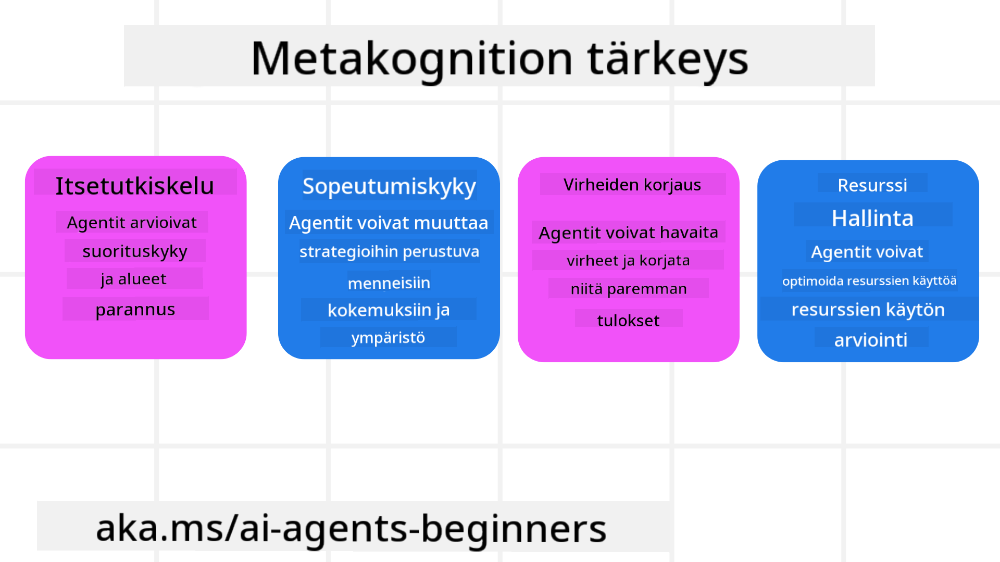
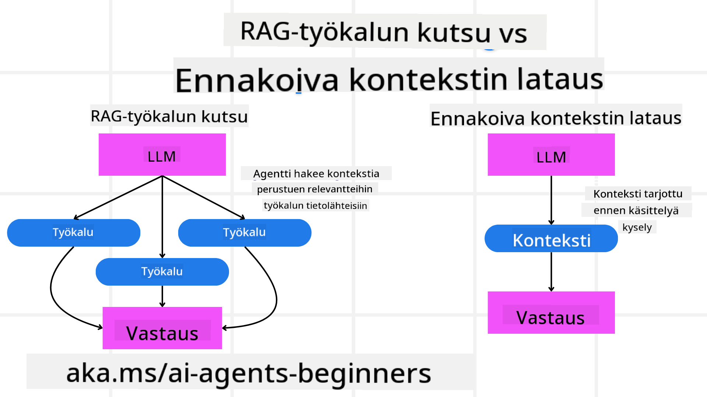

<!--
CO_OP_TRANSLATOR_METADATA:
{
  "original_hash": "8cbf460468c802c7994aa62e0e0779c9",
  "translation_date": "2025-07-12T12:50:10+00:00",
  "source_file": "09-metacognition/README.md",
  "language_code": "fi"
}
-->
[](https://youtu.be/His9R6gw6Ec?si=3_RMb8VprNvdLRhX)

> _(Napsauta yllä olevaa kuvaa nähdäksesi tämän oppitunnin videon)_
# Metakognitio tekoälyagenttien toiminnassa

## Johdanto

Tervetuloa oppitunnille, joka käsittelee metakognitiota tekoälyagenteissa! Tämä luku on suunnattu aloittelijoille, jotka ovat kiinnostuneita siitä, miten tekoälyagentit voivat pohtia omia ajatteluprosessejaan. Oppitunnin lopussa ymmärrät keskeiset käsitteet ja saat käytännön esimerkkejä metakognition soveltamisesta tekoälyagenttien suunnittelussa.

## Oppimistavoitteet

Oppitunnin suorittamisen jälkeen osaat:

1. Ymmärtää päättelysilmukoiden vaikutukset agenttien määrittelyissä.
2. Käyttää suunnittelu- ja arviointitekniikoita itsekorjaavien agenttien tukemiseksi.
3. Luoda omia agentteja, jotka pystyvät käsittelemään koodia tehtävien suorittamiseksi.

## Johdatus metakognitioon

Metakognitio tarkoittaa korkeamman tason kognitiivisia prosesseja, joissa pohditaan omaa ajattelua. Tekoälyagenteille tämä tarkoittaa kykyä arvioida ja säätää toimintaansa itseymmärryksen ja aiempien kokemusten perusteella. Metakognitio eli "ajattelu ajattelusta" on tärkeä käsite agenttipohjaisten tekoälyjärjestelmien kehityksessä. Se tarkoittaa, että tekoälyjärjestelmät ovat tietoisia omista sisäisistä prosesseistaan ja pystyvät seuraamaan, säätelemään ja mukauttamaan käyttäytymistään sen mukaisesti. Samalla tavalla kuin me arvioimme tilannetta tai tarkastelemme ongelmaa. Tämä itseymmärrys auttaa tekoälyjärjestelmiä tekemään parempia päätöksiä, tunnistamaan virheitä ja parantamaan suorituskykyään ajan myötä – palaten näin Turingin testiin ja keskusteluun siitä, ottavatko tekoälyt vallan.

Agenttipohjaisissa tekoälyjärjestelmissä metakognitio voi auttaa ratkaisemaan useita haasteita, kuten:
- Läpinäkyvyys: Varmistaa, että tekoälyjärjestelmät pystyvät selittämään päättelynsä ja päätöksensä.
- Päättely: Parantaa tekoälyjärjestelmien kykyä yhdistellä tietoa ja tehdä järkeviä päätöksiä.
- Sopeutuminen: Mahdollistaa tekoälyjärjestelmien mukautumisen uusiin ympäristöihin ja muuttuviin olosuhteisiin.
- Havainnointi: Parantaa tekoälyjärjestelmien tarkkuutta ympäristöstään kerätyn datan tunnistamisessa ja tulkinnassa.

### Mikä on metakognitio?

Metakognitio eli "ajattelu ajattelusta" on korkeamman tason kognitiivinen prosessi, joka sisältää itseymmärryksen ja oman ajattelun säätelyn. Tekoälyn maailmassa metakognitio antaa agenteille mahdollisuuden arvioida ja mukauttaa strategioitaan ja toimintaansa, mikä parantaa ongelmanratkaisu- ja päätöksentekokykyä. Ymmärtämällä metakognition voit suunnitella tekoälyagentteja, jotka ovat paitsi älykkäämpiä myös joustavampia ja tehokkaampia. Aidossa metakognitiossa tekoäly perustelee eksplisiittisesti omaa päättelyään.

Esimerkki: ”Priorisoin halvemmat lennot, koska… saatan jäädä paitsi suorista lennoista, joten tarkistan uudelleen.”
Seuraa, miten tai miksi se valitsi tietyn reitin.
- Huomaa, että se teki virheitä, koska luotti liikaa käyttäjän viime kerralla antamiin mieltymyksiin, joten se muuttaa päätöksentekostrategiaansa, ei pelkästään lopullista suositusta.
- Tunnistaa kaavoja, kuten ”Aina kun käyttäjä mainitsee ’liian ruuhkaista’, minun ei pitäisi vain poistaa tiettyjä nähtävyyksiä, vaan myös pohtia, että tapani valita ’top-nähtävyydet’ on virheellinen, jos aina järjestän ne suosion mukaan.”

### Metakognition merkitys tekoälyagenteissa

Metakognitiolla on keskeinen rooli tekoälyagenttien suunnittelussa monesta syystä:



- Itsetutkiskelu: Agentit voivat arvioida omaa suoriutumistaan ja tunnistaa kehityskohteita.
- Sopeutumiskyky: Agentit voivat muuttaa strategioitaan aiempien kokemusten ja muuttuvien olosuhteiden perusteella.
- Virheiden korjaus: Agentit voivat havaita ja korjata virheitä itsenäisesti, mikä johtaa tarkempiin tuloksiin.
- Resurssien hallinta: Agentit voivat optimoida resurssien, kuten ajan ja laskentatehon, käyttöä suunnittelemalla ja arvioimalla toimintaansa.

## Tekoälyagentin osat

Ennen metakognitiivisiin prosesseihin sukeltamista on tärkeää ymmärtää tekoälyagentin perusosat. Tekoälyagentti koostuu tyypillisesti:

- Persoona: Agentin persoonallisuus ja ominaisuudet, jotka määrittävät sen vuorovaikutuksen käyttäjien kanssa.
- Työkalut: Agentin suorittamat kyvyt ja toiminnot.
- Taidot: Agentin hallussa oleva tieto ja asiantuntemus.

Nämä osat toimivat yhdessä muodostaen "asiantuntijayksikön", joka pystyy suorittamaan tiettyjä tehtäviä.

**Esimerkki**:
Ajattele matka-agenttia, joka ei pelkästään suunnittele lomasi, vaan myös mukauttaa reittiään reaaliaikaisen datan ja aiempien asiakkaiden kokemusten perusteella.

### Esimerkki: Metakognitio matka-agenttipalvelussa

Kuvittele, että suunnittelet tekoälyllä toimivaa matka-agenttipalvelua. Tämä agentti, "Travel Agent", auttaa käyttäjiä lomien suunnittelussa. Metakognition sisällyttämiseksi Travel Agentin täytyy arvioida ja säätää toimintaansa itseymmärryksen ja aiempien kokemusten perusteella. Näin metakognitio voisi toimia:

#### Nykyinen tehtävä

Nykyinen tehtävä on auttaa käyttäjää suunnittelemaan matka Pariisiin.

#### Tehtävän suorittamisen vaiheet

1. **Käyttäjän mieltymysten kerääminen**: Kysy käyttäjältä matkustuspäivät, budjetti, kiinnostuksen kohteet (esim. museot, ruoka, ostokset) ja erityisvaatimukset.
2. **Tiedon hakeminen**: Etsi lento-, majoitus-, nähtävyys- ja ravintolavaihtoehtoja, jotka vastaavat käyttäjän mieltymyksiä.
3. **Suositusten laatiminen**: Tarjoa henkilökohtainen matkasuunnitelma, joka sisältää lentotiedot, hotellivaraukset ja ehdotetut aktiviteetit.
4. **Palautteen perusteella säätäminen**: Kysy käyttäjältä palautetta suosituksista ja tee tarvittavat muutokset.

#### Tarvittavat resurssit

- Pääsy lento- ja hotellivarauksia sisältäviin tietokantoihin.
- Tietoa Pariisin nähtävyyksistä ja ravintoloista.
- Käyttäjäpalautteet aiemmista vuorovaikutuksista.

#### Kokemus ja itsetutkiskelu

Travel Agent käyttää metakognitiota arvioidakseen suoriutumistaan ja oppiakseen aiemmista kokemuksista. Esimerkiksi:

1. **Käyttäjäpalautteen analysointi**: Travel Agent tarkastelee käyttäjäpalautetta selvittääkseen, mitkä suositukset otettiin hyvin vastaan ja mitkä eivät. Se mukauttaa tulevia ehdotuksiaan tämän perusteella.
2. **Sopeutumiskyky**: Jos käyttäjä on aiemmin maininnut, ettei pidä ruuhkaisista paikoista, Travel Agent välttää suosittelemasta suosittuja nähtävyyksiä ruuhka-aikoina.
3. **Virheiden korjaus**: Jos Travel Agent teki virheen aiemmassa varauksessa, kuten ehdotti täyteen varattua hotellia, se oppii tarkistamaan saatavuuden huolellisemmin ennen suositusten antamista.

#### Käytännön kehittäjäesimerkki

Tässä on yksinkertaistettu esimerkki Travel Agentin koodista, jossa metakognitio on otettu huomioon:

```python
class Travel_Agent:
    def __init__(self):
        self.user_preferences = {}
        self.experience_data = []

    def gather_preferences(self, preferences):
        self.user_preferences = preferences

    def retrieve_information(self):
        # Search for flights, hotels, and attractions based on preferences
        flights = search_flights(self.user_preferences)
        hotels = search_hotels(self.user_preferences)
        attractions = search_attractions(self.user_preferences)
        return flights, hotels, attractions

    def generate_recommendations(self):
        flights, hotels, attractions = self.retrieve_information()
        itinerary = create_itinerary(flights, hotels, attractions)
        return itinerary

    def adjust_based_on_feedback(self, feedback):
        self.experience_data.append(feedback)
        # Analyze feedback and adjust future recommendations
        self.user_preferences = adjust_preferences(self.user_preferences, feedback)

# Example usage
travel_agent = Travel_Agent()
preferences = {
    "destination": "Paris",
    "dates": "2025-04-01 to 2025-04-10",
    "budget": "moderate",
    "interests": ["museums", "cuisine"]
}
travel_agent.gather_preferences(preferences)
itinerary = travel_agent.generate_recommendations()
print("Suggested Itinerary:", itinerary)
feedback = {"liked": ["Louvre Museum"], "disliked": ["Eiffel Tower (too crowded)"]}
travel_agent.adjust_based_on_feedback(feedback)
```

#### Miksi metakognitio on tärkeää

- **Itsetutkiskelu**: Agentit voivat analysoida suoriutumistaan ja tunnistaa kehityskohteita.
- **Sopeutumiskyky**: Agentit voivat muuttaa strategioitaan palautteen ja muuttuvien olosuhteiden perusteella.
- **Virheiden korjaus**: Agentit voivat havaita ja korjata virheitä itsenäisesti.
- **Resurssien hallinta**: Agentit voivat optimoida resurssien, kuten ajan ja laskentatehon, käyttöä.

Metakognition avulla Travel Agent voi tarjota henkilökohtaisempia ja tarkempia matkasuosituksia, mikä parantaa käyttäjäkokemusta.

---

## 2. Suunnittelu agenteissa

Suunnittelu on keskeinen osa tekoälyagenttien toimintaa. Se tarkoittaa tavoitteeseen johtavien vaiheiden hahmottamista ottaen huomioon nykytilanne, resurssit ja mahdolliset esteet.

### Suunnittelun osat

- **Nykyinen tehtävä**: Määrittele tehtävä selkeästi.
- **Tehtävän suorittamisen vaiheet**: Jaa tehtävä hallittaviin osiin.
- **Tarvittavat resurssit**: Tunnista tarvittavat resurssit.
- **Kokemus**: Hyödynnä aiempia kokemuksia suunnittelussa.

**Esimerkki**:
Tässä ovat vaiheet, joita Travel Agent tarvitsee auttaakseen käyttäjää suunnittelemaan matkan tehokkaasti:

### Vaiheet Travel Agentille

1. **Käyttäjän mieltymysten kerääminen**
   - Kysy käyttäjältä tietoja matkustuspäivistä, budjetista, kiinnostuksen kohteista ja erityisvaatimuksista.
   - Esimerkkejä: "Milloin aiot matkustaa?" "Mikä on budjettisi?" "Mitä aktiviteetteja haluat lomallasi tehdä?"

2. **Tiedon hakeminen**
   - Etsi käyttäjän mieltymyksiä vastaavia matkavaihtoehtoja.
   - **Lennot**: Etsi saatavilla olevia lentoja käyttäjän budjetin ja matkustuspäivien mukaan.
   - **Majoitus**: Etsi hotelleja tai vuokra-asuntoja, jotka vastaavat käyttäjän sijainti-, hinta- ja mukavuusvaatimuksia.
   - **Nähtävyydet ja ravintolat**: Tunnista suosittuja nähtävyyksiä, aktiviteetteja ja ruokapaikkoja, jotka sopivat käyttäjän kiinnostuksen kohteisiin.

3. **Suositusten laatiminen**
   - Koosta haetusta tiedosta henkilökohtainen matkasuunnitelma.
   - Tarjoa tiedot lento- ja hotellivaihtoehdoista sekä ehdotetuista aktiviteeteista, räätälöiden suositukset käyttäjän mieltymysten mukaan.

4. **Matkasuunnitelman esittäminen käyttäjälle**
   - Jaa ehdotettu matkasuunnitelma käyttäjän tarkasteltavaksi.
   - Esimerkki: "Tässä on ehdotus matkasuunnitelmaksi Pariisiin. Se sisältää lentotiedot, hotellivaraukset sekä listan suositelluista aktiviteeteista ja ravintoloista. Kerro mielipiteesi!"

5. **Palautteen kerääminen**
   - Kysy käyttäjältä palautetta ehdotetusta matkasuunnitelmasta.
   - Esimerkkejä: "Pidätkö lentovaihtoehdoista?" "Sopiiko hotelli tarpeisiisi?" "Haluatko lisätä tai poistaa aktiviteetteja?"

6. **Palautteen perusteella säätäminen**
   - Muokkaa matkasuunnitelmaa käyttäjän palautteen mukaan.
   - Tee tarvittavat muutokset lento-, majoitus- ja aktiviteettisuosituksiin, jotta ne vastaavat paremmin käyttäjän mieltymyksiä.

7. **Lopullinen vahvistus**
   - Esitä päivitetty matkasuunnitelma käyttäjälle lopullista vahvistusta varten.
   - Esimerkki: "Olen tehnyt muutokset palautteesi perusteella. Tässä päivitetty suunnitelma. Onko kaikki kunnossa?"

8. **Varausten tekeminen ja vahvistaminen**
   - Kun käyttäjä hyväksyy suunnitelman, tee varaukset lennoista, majoituksesta ja mahdollisista aktiviteeteista.
   - Lähetä vahvistustiedot käyttäjälle.

9. **Jatkuva tuki**
   - Ole käytettävissä auttamaan käyttäjää muutoksissa tai lisäpyynnöissä ennen matkaa ja matkan aikana.
   - Esimerkki: "Jos tarvitset apua matkan aikana, ota rohkeasti yhteyttä!"

### Esimerkkikeskustelu

```python
class Travel_Agent:
    def __init__(self):
        self.user_preferences = {}
        self.experience_data = []

    def gather_preferences(self, preferences):
        self.user_preferences = preferences

    def retrieve_information(self):
        flights = search_flights(self.user_preferences)
        hotels = search_hotels(self.user_preferences)
        attractions = search_attractions(self.user_preferences)
        return flights, hotels, attractions

    def generate_recommendations(self):
        flights, hotels, attractions = self.retrieve_information()
        itinerary = create_itinerary(flights, hotels, attractions)
        return itinerary

    def adjust_based_on_feedback(self, feedback):
        self.experience_data.append(feedback)
        self.user_preferences = adjust_preferences(self.user_preferences, feedback)

# Example usage within a booing request
travel_agent = Travel_Agent()
preferences = {
    "destination": "Paris",
    "dates": "2025-04-01 to 2025-04-10",
    "budget": "moderate",
    "interests": ["museums", "cuisine"]
}
travel_agent.gather_preferences(preferences)
itinerary = travel_agent.generate_recommendations()
print("Suggested Itinerary:", itinerary)
feedback = {"liked": ["Louvre Museum"], "disliked": ["Eiffel Tower (too crowded)"]}
travel_agent.adjust_based_on_feedback(feedback)
```

## 3. Korjaava RAG-järjestelmä

Aloitetaan ymmärtämällä ero RAG-työkalun ja ennakoivan kontekstin latauksen välillä.



### Retrieval-Augmented Generation (RAG)

RAG yhdistää hakujärjestelmän ja generatiivisen mallin. Kun kysely tehdään, hakujärjestelmä hakee asiaankuuluvia dokumentteja tai tietoja ulkoisesta lähteestä, ja nämä haetut tiedot lisätään generatiivisen mallin syötteeseen. Tämä auttaa mallia tuottamaan tarkempia ja kontekstuaalisesti relevantteja vastauksia.

RAG-järjestelmässä agentti hakee tietoa tietokannasta ja käyttää sitä sopivien vastausten tai toimintojen luomiseen.

### Korjaava RAG-lähestymistapa

Korjaava RAG keskittyy käyttämään RAG-tekniikoita virheiden korjaamiseen ja tekoälyagenttien tarkkuuden parantamiseen. Tämä sisältää:

1. **Kehote-tekniikka**: Käytetään erityisiä kehotteita ohjaamaan agenttia hakemaan relevanttia tietoa.
2. **Työkalu**: Toteutetaan algoritmeja ja mekanismeja, jotka mahdollistavat agentin arvioida haetun tiedon merkityksellisyyttä ja tuottaa tarkkoja vastauksia.
3. **Arviointi**: Jatkuva agentin suorituskyvyn arviointi ja säätöjen tekeminen tarkkuuden ja tehokkuuden parantamiseksi.

#### Esimerkki: Korjaava RAG hakukoneagentissa

Kuvitellaan hakukoneagentti, joka hakee tietoa verkosta vastatakseen käyttäjän kyselyihin. Korjaava RAG voisi sisältää:

1. **Kehote-tekniikka**: Muodostaa hakukyselyt käyttäjän syötteen perusteella.
2. **Työkalu**: Käyttää luonnollisen kielen käsittelyä ja koneoppimisalgoritmeja hakutulosten lajitteluun ja suodattamiseen.
3. **Arviointi**: Analysoi käyttäjäpalautetta virheiden tunnistamiseksi ja korjaamiseksi haetussa tiedossa.

### Korjaava RAG Travel Agentissa

Korjaava RAG (Retrieval-Augmented Generation) parantaa tekoälyn kykyä hakea ja tuottaa tietoa samalla korjaten virheitä. Katsotaan, miten Travel Agent voi hyödyntää korjaavaa RAG-lähestymistapaa tarjotakseen tarkempia ja osuvampia matkasuosituksia.

Tämä sisältää:

- **Kehote-tekniikka:** Käytetään erityisiä kehotteita ohjaamaan agenttia hakemaan relevanttia tietoa.
- **Työkalu:** Toteutetaan algoritmeja ja mekanismeja, jotka mahdollistavat agentin arvioida haetun tiedon merkityksellisyyttä ja tuottaa tarkkoja vastauksia.
- **Arviointi:** Jatkuva agentin suorituskyvyn arviointi ja säätöjen tekeminen tarkkuuden ja tehokkuuden parantamiseksi.

#### Vaiheet korjaavan RAG:n toteuttamiseksi Travel Agentissa

1. **Alkuperäinen käyttäjävuorovaikutus**
   - Travel Agent kerää käyttäjän alkuperäiset mieltymykset, kuten kohteen, matkustuspäivät, budjetin ja kiinnostuksen kohteet.
   - Esimerkki:

     ```python
     preferences = {
         "destination": "Paris",
         "dates": "2025-04-01 to 2025-04-10",
         "budget": "moderate",
         "interests": ["museums", "cuisine"]
     }
     ```

2. **Tiedon haku**
   - Travel Agent hakee tietoa lennoista, majoituksista, nähtävyyksistä ja ravintoloista käyttäjän mieltymysten perusteella.
   - Esimerkki:

     ```python
     flights = search_flights(preferences)
     hotels = search_hotels(preferences)
     attractions = search_attractions(preferences)
     ```

3. **Alkuperäisten suositusten luominen**
   - Travel Agent käyttää haettua tiet
### Ennakoiva kontekstin lataus

Ennakoiva kontekstin lataus tarkoittaa olennaisen kontekstin tai taustatiedon lataamista malliin ennen kyselyn käsittelyä. Tämä tarkoittaa, että mallilla on pääsy tähän tietoon alusta alkaen, mikä auttaa sitä tuottamaan paremmin informoituja vastauksia ilman, että sen tarvitsee hakea lisätietoja prosessin aikana.

Tässä on yksinkertaistettu esimerkki siitä, miltä ennakoiva kontekstin lataus voisi näyttää matkatoimiston sovelluksessa Pythonilla:

```python
class TravelAgent:
    def __init__(self):
        # Pre-load popular destinations and their information
        self.context = {
            "Paris": {"country": "France", "currency": "Euro", "language": "French", "attractions": ["Eiffel Tower", "Louvre Museum"]},
            "Tokyo": {"country": "Japan", "currency": "Yen", "language": "Japanese", "attractions": ["Tokyo Tower", "Shibuya Crossing"]},
            "New York": {"country": "USA", "currency": "Dollar", "language": "English", "attractions": ["Statue of Liberty", "Times Square"]},
            "Sydney": {"country": "Australia", "currency": "Dollar", "language": "English", "attractions": ["Sydney Opera House", "Bondi Beach"]}
        }

    def get_destination_info(self, destination):
        # Fetch destination information from pre-loaded context
        info = self.context.get(destination)
        if info:
            return f"{destination}:\nCountry: {info['country']}\nCurrency: {info['currency']}\nLanguage: {info['language']}\nAttractions: {', '.join(info['attractions'])}"
        else:
            return f"Sorry, we don't have information on {destination}."

# Example usage
travel_agent = TravelAgent()
print(travel_agent.get_destination_info("Paris"))
print(travel_agent.get_destination_info("Tokyo"))
```

#### Selitys

1. **Alustus (`__init__`-metodi)**: `TravelAgent`-luokka lataa etukäteen sanakirjan, joka sisältää tietoa suosituista matkakohteista, kuten Pariisi, Tokio, New York ja Sydney. Tämä sanakirja sisältää tietoja kuten maa, valuutta, kieli ja tärkeimmät nähtävyydet kullekin kohteelle.

2. **Tiedon hakeminen (`get_destination_info`-metodi)**: Kun käyttäjä kysyy tietoa tietystä kohteesta, `get_destination_info`-metodi hakee asiaankuuluvat tiedot ennakkoon ladatusta kontekstisanakirjasta.

Lataamalla kontekstin etukäteen matkatoimiston sovellus voi vastata käyttäjän kyselyihin nopeasti ilman, että sen tarvitsee hakea tietoja ulkoisesta lähteestä reaaliajassa. Tämä tekee sovelluksesta tehokkaamman ja nopeamman.

### Suunnitelman käynnistäminen tavoitteella ennen iterointia

Suunnitelman käynnistäminen tavoitteella tarkoittaa, että aloitetaan selkeällä päämäärällä tai tavoitellulla lopputuloksella mielessä. Määrittelemällä tavoite etukäteen malli voi käyttää sitä ohjenuorana koko iterointiprosessin ajan. Tämä auttaa varmistamaan, että jokainen iteraatio vie lähemmäs haluttua lopputulosta, tehden prosessista tehokkaamman ja fokusoidumman.

Tässä on esimerkki siitä, miten voit käynnistää matkasuunnitelman tavoitteella ennen iterointia matkatoimiston sovelluksessa Pythonilla:

### Tilanne

Matkatoimisto haluaa suunnitella räätälöidyn loman asiakkaalle. Tavoitteena on luoda matkareitti, joka maksimoi asiakkaan tyytyväisyyden heidän mieltymystensä ja budjettinsa perusteella.

### Vaiheet

1. Määrittele asiakkaan mieltymykset ja budjetti.
2. Käynnistä alkuperäinen suunnitelma näiden mieltymysten pohjalta.
3. Iteroi suunnitelmaa parantaen sitä asiakkaan tyytyväisyyden optimoimiseksi.

#### Python-koodi

```python
class TravelAgent:
    def __init__(self, destinations):
        self.destinations = destinations

    def bootstrap_plan(self, preferences, budget):
        plan = []
        total_cost = 0

        for destination in self.destinations:
            if total_cost + destination['cost'] <= budget and self.match_preferences(destination, preferences):
                plan.append(destination)
                total_cost += destination['cost']

        return plan

    def match_preferences(self, destination, preferences):
        for key, value in preferences.items():
            if destination.get(key) != value:
                return False
        return True

    def iterate_plan(self, plan, preferences, budget):
        for i in range(len(plan)):
            for destination in self.destinations:
                if destination not in plan and self.match_preferences(destination, preferences) and self.calculate_cost(plan, destination) <= budget:
                    plan[i] = destination
                    break
        return plan

    def calculate_cost(self, plan, new_destination):
        return sum(destination['cost'] for destination in plan) + new_destination['cost']

# Example usage
destinations = [
    {"name": "Paris", "cost": 1000, "activity": "sightseeing"},
    {"name": "Tokyo", "cost": 1200, "activity": "shopping"},
    {"name": "New York", "cost": 900, "activity": "sightseeing"},
    {"name": "Sydney", "cost": 1100, "activity": "beach"},
]

preferences = {"activity": "sightseeing"}
budget = 2000

travel_agent = TravelAgent(destinations)
initial_plan = travel_agent.bootstrap_plan(preferences, budget)
print("Initial Plan:", initial_plan)

refined_plan = travel_agent.iterate_plan(initial_plan, preferences, budget)
print("Refined Plan:", refined_plan)
```

#### Koodin selitys

1. **Alustus (`__init__`-metodi)**: `TravelAgent`-luokka alustetaan listalla mahdollisista matkakohteista, joilla on ominaisuuksia kuten nimi, kustannus ja aktiviteettityyppi.

2. **Suunnitelman käynnistäminen (`bootstrap_plan`-metodi)**: Tämä metodi luo alkuperäisen matkasuunnitelman asiakkaan mieltymysten ja budjetin perusteella. Se käy läpi kohdelistan ja lisää kohteet suunnitelmaan, jos ne vastaavat asiakkaan mieltymyksiä ja mahtuvat budjettiin.

3. **Mieltymysten vastaavuus (`match_preferences`-metodi)**: Tämä metodi tarkistaa, vastaako kohde asiakkaan mieltymyksiä.

4. **Suunnitelman iterointi (`iterate_plan`-metodi)**: Tämä metodi parantaa alkuperäistä suunnitelmaa yrittämällä korvata jokaisen kohteen paremmalla vaihtoehdolla ottaen huomioon asiakkaan mieltymykset ja budjettirajoitukset.

5. **Kustannuksen laskeminen (`calculate_cost`-metodi)**: Tämä metodi laskee nykyisen suunnitelman kokonaiskustannuksen, mukaan lukien mahdollinen uusi kohde.

#### Esimerkkikäyttö

- **Alkuperäinen suunnitelma**: Matkatoimisto luo alkuperäisen suunnitelman asiakkaan mieltymysten (nähtävyydet) ja 2000 dollarin budjetin perusteella.
- **Paranneltu suunnitelma**: Matkatoimisto iteroi suunnitelmaa optimoiden asiakkaan mieltymyksiä ja budjettia.

Käynnistämällä suunnitelman selkeällä tavoitteella (esim. asiakkaan tyytyväisyyden maksimointi) ja iterointia hyödyntämällä matkatoimisto voi luoda räätälöidyn ja optimoidun matkareitin asiakkaalle. Tämä varmistaa, että matkasuunnitelma vastaa asiakkaan mieltymyksiä ja budjettia alusta alkaen ja paranee jokaisella iteraatiolla.

### LLM:n hyödyntäminen uudelleenjärjestelyssä ja pisteytyksessä

Suuret kielimallit (LLM) voidaan käyttää uudelleenjärjestelyyn ja pisteytykseen arvioimalla haettujen dokumenttien tai tuotettujen vastausten merkityksellisyyttä ja laatua. Näin se toimii:

**Haku:** Alkuperäinen hakuvaihe hakee joukon ehdokasdokumentteja tai vastauksia kyselyn perusteella.

**Uudelleenjärjestely:** LLM arvioi nämä ehdokkaat ja järjestää ne uudelleen niiden merkityksellisyyden ja laadun perusteella. Tämä varmistaa, että kaikkein relevantimmat ja laadukkaimmat tiedot esitetään ensin.

**Pisteytys:** LLM antaa pisteitä jokaiselle ehdokkaalle, jotka heijastavat niiden merkityksellisyyttä ja laatua. Tämä auttaa valitsemaan parhaan vastauksen tai dokumentin käyttäjälle.

Hyödyntämällä LLM:ää uudelleenjärjestelyssä ja pisteytyksessä järjestelmä voi tarjota tarkempaa ja kontekstuaalisesti relevantimpaa tietoa, parantaen käyttäjäkokemusta.

Tässä on esimerkki siitä, miten matkatoimisto voisi käyttää suurta kielimallia (LLM) uudelleenjärjestelyyn ja pisteytykseen matkakohteiden osalta käyttäjän mieltymysten perusteella Pythonilla:

#### Tilanne – Matkustus mieltymysten mukaan

Matkatoimisto haluaa suositella parhaita matkakohteita asiakkaalle heidän mieltymystensä perusteella. LLM auttaa uudelleenjärjestelyssä ja pisteytyksessä, jotta kaikkein relevantimmat vaihtoehdot tulevat esiin.

#### Vaiheet:

1. Kerää käyttäjän mieltymykset.
2. Hae lista mahdollisista matkakohteista.
3. Käytä LLM:ää uudelleenjärjestelyyn ja pisteytykseen käyttäjän mieltymysten perusteella.

Näin voit päivittää aiemman esimerkin käyttämään Azure OpenAI -palveluita:

#### Vaatimukset

1. Sinulla tulee olla Azure-tilaus.
2. Luo Azure OpenAI -resurssi ja hanki API-avain.

#### Esimerkkikoodi Pythonilla

```python
import requests
import json

class TravelAgent:
    def __init__(self, destinations):
        self.destinations = destinations

    def get_recommendations(self, preferences, api_key, endpoint):
        # Generate a prompt for the Azure OpenAI
        prompt = self.generate_prompt(preferences)
        
        # Define headers and payload for the request
        headers = {
            'Content-Type': 'application/json',
            'Authorization': f'Bearer {api_key}'
        }
        payload = {
            "prompt": prompt,
            "max_tokens": 150,
            "temperature": 0.7
        }
        
        # Call the Azure OpenAI API to get the re-ranked and scored destinations
        response = requests.post(endpoint, headers=headers, json=payload)
        response_data = response.json()
        
        # Extract and return the recommendations
        recommendations = response_data['choices'][0]['text'].strip().split('\n')
        return recommendations

    def generate_prompt(self, preferences):
        prompt = "Here are the travel destinations ranked and scored based on the following user preferences:\n"
        for key, value in preferences.items():
            prompt += f"{key}: {value}\n"
        prompt += "\nDestinations:\n"
        for destination in self.destinations:
            prompt += f"- {destination['name']}: {destination['description']}\n"
        return prompt

# Example usage
destinations = [
    {"name": "Paris", "description": "City of lights, known for its art, fashion, and culture."},
    {"name": "Tokyo", "description": "Vibrant city, famous for its modernity and traditional temples."},
    {"name": "New York", "description": "The city that never sleeps, with iconic landmarks and diverse culture."},
    {"name": "Sydney", "description": "Beautiful harbour city, known for its opera house and stunning beaches."},
]

preferences = {"activity": "sightseeing", "culture": "diverse"}
api_key = 'your_azure_openai_api_key'
endpoint = 'https://your-endpoint.com/openai/deployments/your-deployment-name/completions?api-version=2022-12-01'

travel_agent = TravelAgent(destinations)
recommendations = travel_agent.get_recommendations(preferences, api_key, endpoint)
print("Recommended Destinations:")
for rec in recommendations:
    print(rec)
```

#### Koodin selitys – Preference Booker

1. **Alustus**: `TravelAgent`-luokka alustetaan listalla mahdollisista matkakohteista, joilla on ominaisuuksia kuten nimi ja kuvaus.

2. **Suositusten hakeminen (`get_recommendations`-metodi)**: Tämä metodi luo kehotteen Azure OpenAI -palvelulle käyttäjän mieltymysten perusteella ja tekee HTTP POST -pyynnön Azure OpenAI API:lle saadakseen uudelleenjärjestellyt ja pisteytetyt kohteet.

3. **Kehotteen luominen (`generate_prompt`-metodi)**: Tämä metodi rakentaa kehotteen Azure OpenAI:lle, joka sisältää käyttäjän mieltymykset ja kohdelistan. Kehote ohjaa mallia uudelleenjärjestelemään ja pisteyttämään kohteet annettujen mieltymysten perusteella.

4. **API-kutsu**: `requests`-kirjastoa käytetään tekemään HTTP POST -pyyntö Azure OpenAI API -päätepisteeseen. Vastaus sisältää uudelleenjärjestellyt ja pisteytetyt kohteet.

5. **Esimerkkikäyttö**: Matkatoimisto kerää käyttäjän mieltymykset (esim. kiinnostus nähtävyyksiin ja monipuoliseen kulttuuriin) ja käyttää Azure OpenAI -palvelua saadakseen uudelleenjärjestellyt ja pisteytetyt suositukset matkakohteista.

Muista korvata `your_azure_openai_api_key` omalla Azure OpenAI API -avaimellasi ja `https://your-endpoint.com/...` omalla Azure OpenAI -käyttöönoton päätepisteen URL-osoitteella.

Hyödyntämällä LLM:ää uudelleenjärjestelyssä ja pisteytyksessä matkatoimisto voi tarjota asiakkaille henkilökohtaisempia ja relevantimpia matkasuosituksia, parantaen heidän kokonaiskokemustaan.

### RAG: Kehote-tekniikka vs Työkalu

Retrieval-Augmented Generation (RAG) voi olla sekä kehotetekniikka että työkalu tekoälyagenttien kehityksessä. Erottelun ymmärtäminen auttaa hyödyntämään RAG:ia tehokkaammin projekteissasi.

#### RAG kehotetekniikkana

**Mikä se on?**

- Kehotetekniikkana RAG tarkoittaa erityisten kyselyjen tai kehotteiden muodostamista, jotka ohjaavat olennaisen tiedon hakua suuresta tietokannasta tai kokoelmasta. Tätä tietoa käytetään sitten vastausten tai toimintojen tuottamiseen.

**Miten se toimii:**

1. **Kehotteen muodostaminen**: Luo hyvin jäsenneltyjä kehotteita tai kyselyjä tehtävän tai käyttäjän syötteen perusteella.
2. **Tiedon haku**: Käytä kehotteita etsiäksesi relevanttia dataa olemassa olevasta tietokannasta tai datasetistä.
3. **Vastauksen generointi**: Yhdistä haettu tieto generatiivisten tekoälymallien kanssa tuottaaksesi kattavan ja johdonmukaisen vastauksen.

**Esimerkki matkatoimistossa**:

- Käyttäjän syöte: "Haluan vierailla museoissa Pariisissa."
- Kehote: "Etsi Pariisin parhaat museot."
- Haettu tieto: Tietoja Louvre-museosta, Musée d'Orsaysta jne.
- Tuotettu vastaus: "Tässä on joitakin Pariisin parhaista museoista: Louvre, Musée d'Orsay ja Centre Pompidou."

#### RAG työkaluna

**Mikä se on?**

- Työkaluna RAG on integroitu järjestelmä, joka automatisoi hakuprosessin ja generoinnin, tehden kehittäjien työstä helpompaa ilman, että heidän tarvitsee käsin laatia kehotteita jokaista kyselyä varten.

**Miten se toimii:**

1. **Integrointi**: Upota RAG tekoälyagentin arkkitehtuuriin, jolloin se hoitaa automaattisesti haun ja generoinnin.
2. **Automaatio**: Työkalu hallinnoi koko prosessin käyttäjän syötteestä lopullisen vastauksen tuottamiseen ilman erillisiä kehotteita.
3. **Tehokkuus**: Parantaa agentin suorituskykyä virtaviivaistamalla hakua ja generointia, mahdollistaen nopeammat ja tarkemmat vastaukset.

**Esimerkki matkatoimistossa**:

- Käyttäjän syöte: "Haluan vierailla museoissa Pariisissa."
- RAG-työkalu: Hakee automaattisesti tietoa museoista ja tuottaa vastauksen.
- Tuotettu vastaus: "Tässä on joitakin Pariisin parhaista museoista: Louvre, Musée d'Orsay ja Centre Pompidou."

### Vertailu

| Näkökulma              | Kehotetekniikka                                         | Työkalu                                               |
|------------------------|---------------------------------------------------------|-------------------------------------------------------|
| **Manuaalinen vs Automaattinen** | Kehotteiden manuaalinen laatiminen jokaista kyselyä varten. | Automaattinen haku- ja generointiprosessi.            |
| **Hallinta**            | Tarjoaa enemmän kontrollia hakuprosessiin.              | Virtaviivaistaa ja automatisoi haun ja generoinnin.   |
| **Joustavuus**          | Mahdollistaa räätälöidyt kehotteet tarpeen mukaan.       | Tehokkaampi suurissa käyttöönotossa.                   |
| **Monimutkaisuus**      | Vaatii kehotteiden laatimista ja hienosäätöä.           | Helpompi integroida tekoälyagentin arkkitehtuuriin.   |

### Käytännön esimerkit

**Kehotetekniikan esimerkki:**

```python
def search_museums_in_paris():
    prompt = "Find top museums in Paris"
    search_results = search_web(prompt)
    return search_results

museums = search_museums_in_paris()
print("Top Museums in Paris:", museums)
```

**Työkalun esimerkki:**

```python
class Travel_Agent:
    def __init__(self):
        self.rag_tool = RAGTool()

    def get_museums_in_paris(self):
        user_input = "I want to visit museums in Paris."
        response = self.rag_tool.retrieve_and_generate(user_input)
        return response

travel_agent = Travel_Agent()
museums = travel_agent.get_museums_in_paris()
print("Top Museums in Paris:", museums)
```

### Merkityksellisyyden arviointi

Merkityksellisyyden arviointi on keskeinen osa tekoälyagentin suorituskykyä. Se varmistaa, että agentin hakema ja tuottama tieto on sopivaa, tarkkaa ja hyödyllistä käyttäjälle. Tarkastellaan, miten merkityksellisyyttä arvioidaan tekoälyagenteissa, mukaan lukien käytännön esimerkit ja menetelmät.

#### Keskeiset käsitteet merkityksellisyyden arvioinnissa

1. **Kontekstin ymmärtäminen**:
   - Agentin tulee ymmärtää käyttäjän kyselyn konteksti hakeakseen ja tuottaakseen relevanttia tietoa.
   - Esimerkki: Jos käyttäjä kysyy "Parhaat ravintolat Pariisissa", agentin tulisi ottaa huomioon käyttäjän mieltymykset, kuten ruokatyypit ja budjetti.

2. **Tarkkuus**:
   - Agentin tarjoaman tiedon tulee olla faktuaalisesti oikeaa ja ajan tasalla.
   - Esimerkki: Suositella avoinna olevia ravintoloita, joilla on hyvät arvostelut, ei vanhentuneita tai suljettuja vaihtoehtoja.

3. **Käyttäjän tarkoitus**:
   - Agentin tulee päätellä käyttäjän tarkoitus kyselyn takana tarjotakseen kaikkein relevantimman tiedon.
   - Esimerkki: Jos käyttäjä kysyy "edulliset hotellit", agentin tulisi priorisoida edulliset vaihtoehdot.

4. **Palautejärjestelmä**:
   - Jatkuva käyttäjäpalautteen kerääminen ja analysointi auttaa agenttia parantamaan merkityksellisyyden arviointia.
   - Esimerkki: Käyttäjäarvioiden ja palautteen hyödyntäminen aiemmista suosituksista tulevien vastausten parantamiseksi.

#### Käytännön menetelmät merkityksellisyyden arviointiin

1. **Merkityksellisyyspisteytys**:
   - Annetaan jokaiselle haetulle kohteelle pisteet sen perusteella, kuinka hyvin se vastaa käyttäjän kyselyä ja mieltymyksiä.
   - Esimerkki:

     ```python
     def relevance_score(item, query):
         score = 0
         if item['category'] in query['interests']:
             score += 1
         if item['price'] <= query['budget']:
             score += 1
         if item['location'] == query['destination']:
             score += 1
         return score
     ```

2. **Suodatus ja lajittelu**:
   - Suodatetaan pois epäolennaiset kohteet ja järjestetään jäljelle jääneet merkityksellisyyspisteiden mukaan.
   - Esimerkki:

     ```python
     def filter_and_rank(items, query):
         ranked_items = sorted(items, key=lambda item: relevance_score(item, query), reverse=True)
         return ranked_items[:10]  # Return top 10 relevant items
     ```

3. **Luonnollisen kielen käsittely (NLP)**:
   - Käytetään NLP-tekniikoita ymmärtämään käyttäjän kysely ja hakemaan relevanttia tietoa.
   - Esimerkki:

     ```python
     def process_query(query):
         # Use NLP to extract key information from the user's query
         processed_query = nlp(query)
         return processed_query
     ```

4. **Käyttäjäpalautteen integrointi**:
   - Kerätään käyttäjäpalautetta annetuista suosituksista ja käytetään sitä tulevien merkityksellisyyksien arvioinnin säätämiseen.
   - Esimerkki:

     ```python
     def adjust_based_on_feedback(feedback, items):
         for item in items:
             if item['name'] in feedback['liked']:
                 item['relevance'] += 1
             if item['name'] in feedback['disliked']:
                 item['relevance'] -= 1
         return items
     ```

#### Esimerkki: Merkityksellisyyden arviointi matkatoimistossa

Tässä on käytännön esimerkki siitä, miten Travel Agent voi arvioida matkasuositusten merkityksellisyyttä:

```python
class Travel_Agent:
    def __init__(self):
        self.user_preferences = {}
        self.experience_data = []

    def gather_preferences(self, preferences):
        self.user_preferences = preferences

    def retrieve_information(self):
        flights = search_flights(self.user_preferences)
        hotels = search_hotels(self.user_preferences)
        attractions = search_attractions(self.user_preferences)
        return flights, hotels, attractions

    def generate_recommendations(self):
        flights, hotels, attractions = self.retrieve_information()
        ranked_hotels = self.filter_and_rank(hotels, self.user_preferences)
        itinerary = create_itinerary(flights, ranked_hotels, attractions)
        return itinerary

    def filter_and_rank(self, items, query):
        ranked_items = sorted(items, key=lambda item: self.relevance_score(item, query), reverse=True)
        return ranked_items[:10]  # Return top 10 relevant items

    def relevance_score(self, item, query):
        score = 0
        if item['category'] in query['interests']:
            score += 1
        if item['price'] <= query['budget']:
            score += 1
        if item['location'] == query['destination']:
            score += 1
        return score

    def adjust_based_on_feedback(self, feedback, items):
        for item in items:
            if item['name'] in feedback['liked']:
                item['relevance'] += 1
            if item['name'] in feedback['disliked']:
                item['relevance'] -= 1
        return items

# Example usage
travel_agent = Travel_Agent()
preferences = {
    "destination": "Paris",
    "dates": "2025-04-01 to 2025-04-10",
    "budget": "moderate",
    "interests": ["museums", "cuisine"]
}
travel_agent.gather_preferences(preferences)
itinerary = travel_agent.generate_recommendations()
print("Suggested Itinerary:", itinerary)
feedback = {"liked": ["Louvre Museum"], "disliked": ["Eiffel Tower (too crowded)"]}
updated_items = travel_agent.adjust_based_on_feedback(feedback, itinerary['hotels'])
print("Updated Itinerary with Feedback:", updated_items)
```

### Hakeminen tarkoituksen mukaan

Hakeminen tarkoituksen mukaan tarkoittaa käyttäjän kyselyn taustalla olevan tarkoituksen tai tavoitteen ymmärtämistä ja tulkitsemista, jotta voidaan hakea ja tuottaa kaikkein relevantimpaa ja hyödyllisintä tietoa. Tämä lähestymistapa menee pelkkien avainsanojen vastaavuuden yli ja keskittyy käyttäjän todellisten tarpeiden ja kontekstin ymmärtämiseen.

#### Keskeiset käsitteet hakemisessa tarkoituksen mukaan

1. **Käyttäjän tarkoituksen ymmärtäminen**:
   - Käyttäjän tarkoitus voidaan jakaa kolmeen päätyyppiin: informatiivinen, navigointiin liittyvä ja transaktionaalinen.
     - **Informatiivinen tarkoitus**: Käyttäjä etsii tietoa aiheesta (esim. "Mitkä ovat Pariisin parhaat museot?").
     - **Navigointitarkoitus**: Käyttäjä haluaa siirtyä tietylle verkkosivulle tai sivulle (esim. "Louvre-museon virallinen sivusto").
     - **Transaktionaalinen tarkoitus**: Käyttäjä haluaa tehdä toimenpiteen, kuten varata lennon tai tehdä ostoksen (esim. "Varaa lento Pariisiin").

2. **Kontekstin ymmärtäminen**:
   - Käyttäjän kyselyn kontekstin analysointi auttaa tunnistamaan tarkoituksen tarkasti. Tämä sisältää aiemmat vuorovaikutukset, käyttäjän mieltymykset ja nykyisen kyselyn yksityiskoh
#### Käytännön esimerkki: Hakeminen tarkoituksen mukaan matkatoimistossa

Käytetään Travel Agentia esimerkkinä, jotta nähdään, miten hakeminen tarkoituksen mukaan voidaan toteuttaa.

1. **Käyttäjän mieltymysten kerääminen**

   ```python
   class Travel_Agent:
       def __init__(self):
           self.user_preferences = {}

       def gather_preferences(self, preferences):
           self.user_preferences = preferences
   ```

2. **Käyttäjän tarkoituksen ymmärtäminen**

   ```python
   def identify_intent(query):
       if "book" in query or "purchase" in query:
           return "transactional"
       elif "website" in query or "official" in query:
           return "navigational"
       else:
           return "informational"
   ```

3. **Kontekstin huomioiminen**

   ```python
   def analyze_context(query, user_history):
       # Combine current query with user history to understand context
       context = {
           "current_query": query,
           "user_history": user_history
       }
       return context
   ```

4. **Hakeminen ja tulosten personointi**

   ```python
   def search_with_intent(query, preferences, user_history):
       intent = identify_intent(query)
       context = analyze_context(query, user_history)
       if intent == "informational":
           search_results = search_information(query, preferences)
       elif intent == "navigational":
           search_results = search_navigation(query)
       elif intent == "transactional":
           search_results = search_transaction(query, preferences)
       personalized_results = personalize_results(search_results, user_history)
       return personalized_results

   def search_information(query, preferences):
       # Example search logic for informational intent
       results = search_web(f"best {preferences['interests']} in {preferences['destination']}")
       return results

   def search_navigation(query):
       # Example search logic for navigational intent
       results = search_web(query)
       return results

   def search_transaction(query, preferences):
       # Example search logic for transactional intent
       results = search_web(f"book {query} to {preferences['destination']}")
       return results

   def personalize_results(results, user_history):
       # Example personalization logic
       personalized = [result for result in results if result not in user_history]
       return personalized[:10]  # Return top 10 personalized results
   ```

5. **Esimerkkikäyttö**

   ```python
   travel_agent = Travel_Agent()
   preferences = {
       "destination": "Paris",
       "interests": ["museums", "cuisine"]
   }
   travel_agent.gather_preferences(preferences)
   user_history = ["Louvre Museum website", "Book flight to Paris"]
   query = "best museums in Paris"
   results = search_with_intent(query, preferences, user_history)
   print("Search Results:", results)
   ```

---

## 4. Koodin generointi työkaluna

Koodia generoivat agentit käyttävät tekoälymalleja kirjoittaakseen ja suorittaakseen koodia, ratkaisten monimutkaisia ongelmia ja automatisoiden tehtäviä.

### Koodia generoivat agentit

Koodia generoivat agentit hyödyntävät generatiivisia tekoälymalleja koodin kirjoittamiseen ja suorittamiseen. Nämä agentit voivat ratkaista monimutkaisia ongelmia, automatisoida tehtäviä ja tarjota arvokkaita oivalluksia generoimalla ja suorittamalla koodia eri ohjelmointikielillä.

#### Käytännön sovellukset

1. **Automaattinen koodin generointi**: Luo koodinpätkiä tiettyihin tehtäviin, kuten data-analyysiin, web-scrapaukseen tai koneoppimiseen.
2. **SQL RAG-menetelmänä**: Käytä SQL-kyselyjä tietojen hakemiseen ja käsittelyyn tietokannoista.
3. **Ongelmanratkaisu**: Luo ja suorita koodia ratkaistaksesi tiettyjä ongelmia, kuten algoritmien optimointia tai datan analysointia.

#### Esimerkki: Koodia generoiva agentti data-analyysiin

Kuvitellaan, että suunnittelet koodia generoivaa agenttia. Näin se voisi toimia:

1. **Tehtävä**: Analysoida datasetti tunnistaakseen trendejä ja malleja.
2. **Vaiheet**:
   - Ladata datasetti data-analyysityökaluun.
   - Generoida SQL-kyselyjä datan suodattamiseen ja ryhmittelyyn.
   - Suorittaa kyselyt ja hakea tulokset.
   - Käyttää tuloksia visualisointien ja oivallusten luomiseen.
3. **Tarvittavat resurssit**: Pääsy datasettiin, data-analyysityökalut ja SQL-osaaminen.
4. **Kokemus**: Hyödyntää aiempia analyysituloksia parantaakseen tulevien analyysien tarkkuutta ja merkityksellisyyttä.

### Esimerkki: Koodia generoiva agentti Travel Agentille

Tässä esimerkissä suunnittelemme koodia generoivan agentin, Travel Agentin, joka auttaa käyttäjiä matkasuunnitelmien tekemisessä generoimalla ja suorittamalla koodia. Tämä agentti voi hoitaa tehtäviä, kuten matkavaihtoehtojen hakemista, tulosten suodattamista ja matkasuunnitelman kokoamista generatiivisen tekoälyn avulla.

#### Koodia generoivan agentin yleiskuvaus

1. **Käyttäjän mieltymysten kerääminen**: Kerää käyttäjän syötteitä, kuten kohde, matkustuspäivät, budjetti ja kiinnostuksen kohteet.
2. **Koodin generointi datan hakemiseen**: Luo koodinpätkiä lentojen, hotellien ja nähtävyyksien tietojen hakemiseen.
3. **Generoidun koodin suorittaminen**: Suorittaa generoidun koodin reaaliaikaisen tiedon hakemiseksi.
4. **Matkasuunnitelman luominen**: Kokoaa haetut tiedot henkilökohtaiseksi matkasuunnitelmaksi.
5. **Palautteen perusteella säätäminen**: Ottaa vastaan käyttäjäpalautetta ja generoi tarvittaessa koodin uudelleen tulosten parantamiseksi.

#### Vaiheittainen toteutus

1. **Käyttäjän mieltymysten kerääminen**

   ```python
   class Travel_Agent:
       def __init__(self):
           self.user_preferences = {}

       def gather_preferences(self, preferences):
           self.user_preferences = preferences
   ```

2. **Koodin generointi datan hakemiseen**

   ```python
   def generate_code_to_fetch_data(preferences):
       # Example: Generate code to search for flights based on user preferences
       code = f"""
       def search_flights():
           import requests
           response = requests.get('https://api.example.com/flights', params={preferences})
           return response.json()
       """
       return code

   def generate_code_to_fetch_hotels(preferences):
       # Example: Generate code to search for hotels
       code = f"""
       def search_hotels():
           import requests
           response = requests.get('https://api.example.com/hotels', params={preferences})
           return response.json()
       """
       return code
   ```

3. **Generoidun koodin suorittaminen**

   ```python
   def execute_code(code):
       # Execute the generated code using exec
       exec(code)
       result = locals()
       return result

   travel_agent = Travel_Agent()
   preferences = {
       "destination": "Paris",
       "dates": "2025-04-01 to 2025-04-10",
       "budget": "moderate",
       "interests": ["museums", "cuisine"]
   }
   travel_agent.gather_preferences(preferences)
   
   flight_code = generate_code_to_fetch_data(preferences)
   hotel_code = generate_code_to_fetch_hotels(preferences)
   
   flights = execute_code(flight_code)
   hotels = execute_code(hotel_code)

   print("Flight Options:", flights)
   print("Hotel Options:", hotels)
   ```

4. **Matkasuunnitelman luominen**

   ```python
   def generate_itinerary(flights, hotels, attractions):
       itinerary = {
           "flights": flights,
           "hotels": hotels,
           "attractions": attractions
       }
       return itinerary

   attractions = search_attractions(preferences)
   itinerary = generate_itinerary(flights, hotels, attractions)
   print("Suggested Itinerary:", itinerary)
   ```

5. **Palautteen perusteella säätäminen**

   ```python
   def adjust_based_on_feedback(feedback, preferences):
       # Adjust preferences based on user feedback
       if "liked" in feedback:
           preferences["favorites"] = feedback["liked"]
       if "disliked" in feedback:
           preferences["avoid"] = feedback["disliked"]
       return preferences

   feedback = {"liked": ["Louvre Museum"], "disliked": ["Eiffel Tower (too crowded)"]}
   updated_preferences = adjust_based_on_feedback(feedback, preferences)
   
   # Regenerate and execute code with updated preferences
   updated_flight_code = generate_code_to_fetch_data(updated_preferences)
   updated_hotel_code = generate_code_to_fetch_hotels(updated_preferences)
   
   updated_flights = execute_code(updated_flight_code)
   updated_hotels = execute_code(updated_hotel_code)
   
   updated_itinerary = generate_itinerary(updated_flights, updated_hotels, attractions)
   print("Updated Itinerary:", updated_itinerary)
   ```

### Ympäristötietoisuuden ja päättelyn hyödyntäminen

Taulun skeeman perusteella voidaan parantaa kyselyjen generointiprosessia hyödyntämällä ympäristötietoisuutta ja päättelyä.

Tässä esimerkki siitä, miten tämä voidaan tehdä:

1. **Skeeman ymmärtäminen**: Järjestelmä ymmärtää taulun skeeman ja käyttää tätä tietoa kyselyjen perustana.
2. **Palautteen perusteella säätäminen**: Järjestelmä säätää käyttäjän mieltymyksiä palautteen perusteella ja päättää, mitkä kentät skeemassa pitää päivittää.
3. **Kyselyjen generointi ja suorittaminen**: Järjestelmä generoi ja suorittaa kyselyjä päivitettyjen mieltymysten perusteella lentojen ja hotellien tietojen hakemiseksi.

Tässä päivitetty Python-koodiesimerkki, joka sisältää nämä käsitteet:

```python
def adjust_based_on_feedback(feedback, preferences, schema):
    # Adjust preferences based on user feedback
    if "liked" in feedback:
        preferences["favorites"] = feedback["liked"]
    if "disliked" in feedback:
        preferences["avoid"] = feedback["disliked"]
    # Reasoning based on schema to adjust other related preferences
    for field in schema:
        if field in preferences:
            preferences[field] = adjust_based_on_environment(feedback, field, schema)
    return preferences

def adjust_based_on_environment(feedback, field, schema):
    # Custom logic to adjust preferences based on schema and feedback
    if field in feedback["liked"]:
        return schema[field]["positive_adjustment"]
    elif field in feedback["disliked"]:
        return schema[field]["negative_adjustment"]
    return schema[field]["default"]

def generate_code_to_fetch_data(preferences):
    # Generate code to fetch flight data based on updated preferences
    return f"fetch_flights(preferences={preferences})"

def generate_code_to_fetch_hotels(preferences):
    # Generate code to fetch hotel data based on updated preferences
    return f"fetch_hotels(preferences={preferences})"

def execute_code(code):
    # Simulate execution of code and return mock data
    return {"data": f"Executed: {code}"}

def generate_itinerary(flights, hotels, attractions):
    # Generate itinerary based on flights, hotels, and attractions
    return {"flights": flights, "hotels": hotels, "attractions": attractions}

# Example schema
schema = {
    "favorites": {"positive_adjustment": "increase", "negative_adjustment": "decrease", "default": "neutral"},
    "avoid": {"positive_adjustment": "decrease", "negative_adjustment": "increase", "default": "neutral"}
}

# Example usage
preferences = {"favorites": "sightseeing", "avoid": "crowded places"}
feedback = {"liked": ["Louvre Museum"], "disliked": ["Eiffel Tower (too crowded)"]}
updated_preferences = adjust_based_on_feedback(feedback, preferences, schema)

# Regenerate and execute code with updated preferences
updated_flight_code = generate_code_to_fetch_data(updated_preferences)
updated_hotel_code = generate_code_to_fetch_hotels(updated_preferences)

updated_flights = execute_code(updated_flight_code)
updated_hotels = execute_code(updated_hotel_code)

updated_itinerary = generate_itinerary(updated_flights, updated_hotels, feedback["liked"])
print("Updated Itinerary:", updated_itinerary)
```

#### Selitys – Varaaminen palautteen perusteella

1. **Skeematietoisuus**: `schema`-sanakirja määrittelee, miten mieltymyksiä säädetään palautteen perusteella. Se sisältää kenttiä kuten `favorites` ja `avoid` sekä niihin liittyvät säädöt.
2. **Mieltymysten säätäminen (`adjust_based_on_feedback`-metodi)**: Tämä metodi säätää mieltymyksiä käyttäjäpalautteen ja skeeman perusteella.
3. **Ympäristöperusteiset säädöt (`adjust_based_on_environment`-metodi)**: Tämä metodi mukauttaa säädöt skeeman ja palautteen perusteella.
4. **Kyselyjen generointi ja suorittaminen**: Järjestelmä generoi koodin päivitettyjen lentojen ja hotellien tietojen hakemiseksi ja simuloi näiden kyselyjen suorittamista.
5. **Matkasuunnitelman luominen**: Järjestelmä luo päivitetyn matkasuunnitelman uusien lentojen, hotellien ja nähtävyyksien tietojen perusteella.

Tekemällä järjestelmästä ympäristötietoisen ja päättelykykyisen skeeman pohjalta, se pystyy generoimaan tarkempia ja merkityksellisempiä kyselyjä, mikä johtaa parempiin matkasuosituksiin ja henkilökohtaisempaan käyttäjäkokemukseen.

### SQL:n käyttäminen Retrieval-Augmented Generation (RAG) -menetelmänä

SQL (Structured Query Language) on tehokas työkalu tietokantojen käsittelyyn. Kun SQL:ää käytetään osana Retrieval-Augmented Generation (RAG) -lähestymistapaa, se voi hakea relevanttia dataa tietokannoista tekoälyagenttien vastausten tai toimintojen tueksi. Tarkastellaan, miten SQL:ää voidaan hyödyntää RAG-menetelmänä Travel Agentin yhteydessä.

#### Keskeiset käsitteet

1. **Tietokantayhteys**:
   - SQL:llä haetaan tietokannoista tietoa, käsitellään ja muokataan dataa.
   - Esimerkki: Lentojen, hotellien ja nähtävyyksien tietojen hakeminen matkailutietokannasta.

2. **Integrointi RAG:iin**:
   - SQL-kyselyt generoidaan käyttäjän syötteen ja mieltymysten perusteella.
   - Haettu data käytetään personoitujen suositusten tai toimintojen luomiseen.

3. **Dynaaminen kyselyjen generointi**:
   - Tekoälyagentti luo dynaamisia SQL-kyselyjä kontekstin ja käyttäjän tarpeiden mukaan.
   - Esimerkki: SQL-kyselyjen räätälöinti suodattamaan tuloksia budjetin, päivämäärien ja kiinnostuksen kohteiden mukaan.

#### Sovellukset

- **Automaattinen koodin generointi**: Luo koodinpätkiä tiettyihin tehtäviin.
- **SQL RAG-menetelmänä**: Käytä SQL-kyselyjä datan käsittelyyn.
- **Ongelmanratkaisu**: Luo ja suorita koodia ongelmien ratkaisemiseksi.

**Esimerkki**: Data-analyysiantti:

1. **Tehtävä**: Analysoida datasetti trendien löytämiseksi.
2. **Vaiheet**:
   - Ladata datasetti.
   - Generoida SQL-kyselyjä datan suodattamiseen.
   - Suorittaa kyselyt ja hakea tulokset.
   - Luoda visualisointeja ja oivalluksia.
3. **Resurssit**: Datasetin pääsy, SQL-osaaminen.
4. **Kokemus**: Hyödyntää aiempia tuloksia tulevien analyysien parantamiseksi.

#### Käytännön esimerkki: SQL:n käyttö Travel Agentissa

1. **Käyttäjän mieltymysten kerääminen**

   ```python
   class Travel_Agent:
       def __init__(self):
           self.user_preferences = {}

       def gather_preferences(self, preferences):
           self.user_preferences = preferences
   ```

2. **SQL-kyselyjen generointi**

   ```python
   def generate_sql_query(table, preferences):
       query = f"SELECT * FROM {table} WHERE "
       conditions = []
       for key, value in preferences.items():
           conditions.append(f"{key}='{value}'")
       query += " AND ".join(conditions)
       return query
   ```

3. **SQL-kyselyjen suorittaminen**

   ```python
   import sqlite3

   def execute_sql_query(query, database="travel.db"):
       connection = sqlite3.connect(database)
       cursor = connection.cursor()
       cursor.execute(query)
       results = cursor.fetchall()
       connection.close()
       return results
   ```

4. **Suositusten generointi**

   ```python
   def generate_recommendations(preferences):
       flight_query = generate_sql_query("flights", preferences)
       hotel_query = generate_sql_query("hotels", preferences)
       attraction_query = generate_sql_query("attractions", preferences)
       
       flights = execute_sql_query(flight_query)
       hotels = execute_sql_query(hotel_query)
       attractions = execute_sql_query(attraction_query)
       
       itinerary = {
           "flights": flights,
           "hotels": hotels,
           "attractions": attractions
       }
       return itinerary

   travel_agent = Travel_Agent()
   preferences = {
       "destination": "Paris",
       "dates": "2025-04-01 to 2025-04-10",
       "budget": "moderate",
       "interests": ["museums", "cuisine"]
   }
   travel_agent.gather_preferences(preferences)
   itinerary = generate_recommendations(preferences)
   print("Suggested Itinerary:", itinerary)
   ```

#### Esimerkkikyselyt SQL:llä

1. **Lentokysely**

   ```sql
   SELECT * FROM flights WHERE destination='Paris' AND dates='2025-04-01 to 2025-04-10' AND budget='moderate';
   ```

2. **Hotellikysely**

   ```sql
   SELECT * FROM hotels WHERE destination='Paris' AND budget='moderate';
   ```

3. **Nähtävyyskysely**

   ```sql
   SELECT * FROM attractions WHERE destination='Paris' AND interests='museums, cuisine';
   ```

Hyödyntämällä SQL:ää osana Retrieval-Augmented Generation (RAG) -menetelmää, tekoälyagentit kuten Travel Agent voivat dynaamisesti hakea ja käyttää relevanttia dataa tarjotakseen tarkkoja ja henkilökohtaisia suosituksia.

### Esimerkki metakognitiosta

Näytetään metakognition toteutus luomalla yksinkertainen agentti, joka *reflektoi päätöksentekoprosessiaan* ongelman ratkaisemisen aikana. Tässä esimerkissä rakennamme järjestelmän, jossa agentti yrittää optimoida hotellivalinnan, mutta arvioi omaa päättelyään ja säätää strategiaansa virheiden tai epäoptimaalisten valintojen jälkeen.

Simuloimme tätä yksinkertaisella esimerkillä, jossa agentti valitsee hotellit hinnan ja laadun yhdistelmän perusteella, mutta "reflektoi" päätöksiään ja säätää niitä tarpeen mukaan.

#### Miten tämä havainnollistaa metakognitiota:

1. **Alkuperäinen päätös**: Agentti valitsee halvimman hotellin ymmärtämättä laadun vaikutusta.
2. **Reflektio ja arviointi**: Alkuvalinnan jälkeen agentti tarkistaa käyttäjäpalautteen perusteella, oliko hotelli huono valinta. Jos laatu oli liian alhainen, agentti reflektoi päättelyään.
3. **Strategian säätäminen**: Agentti muuttaa strategiaansa reflektiosta oppimalla, siirtyen "halvin" valinnasta "korkein laatu" -valintaan, parantaen päätöksentekoa tulevissa valinnoissa.

Tässä esimerkki:

```python
class HotelRecommendationAgent:
    def __init__(self):
        self.previous_choices = []  # Stores the hotels chosen previously
        self.corrected_choices = []  # Stores the corrected choices
        self.recommendation_strategies = ['cheapest', 'highest_quality']  # Available strategies

    def recommend_hotel(self, hotels, strategy):
        """
        Recommend a hotel based on the chosen strategy.
        The strategy can either be 'cheapest' or 'highest_quality'.
        """
        if strategy == 'cheapest':
            recommended = min(hotels, key=lambda x: x['price'])
        elif strategy == 'highest_quality':
            recommended = max(hotels, key=lambda x: x['quality'])
        else:
            recommended = None
        self.previous_choices.append((strategy, recommended))
        return recommended

    def reflect_on_choice(self):
        """
        Reflect on the last choice made and decide if the agent should adjust its strategy.
        The agent considers if the previous choice led to a poor outcome.
        """
        if not self.previous_choices:
            return "No choices made yet."

        last_choice_strategy, last_choice = self.previous_choices[-1]
        # Let's assume we have some user feedback that tells us whether the last choice was good or not
        user_feedback = self.get_user_feedback(last_choice)

        if user_feedback == "bad":
            # Adjust strategy if the previous choice was unsatisfactory
            new_strategy = 'highest_quality' if last_choice_strategy == 'cheapest' else 'cheapest'
            self.corrected_choices.append((new_strategy, last_choice))
            return f"Reflecting on choice. Adjusting strategy to {new_strategy}."
        else:
            return "The choice was good. No need to adjust."

    def get_user_feedback(self, hotel):
        """
        Simulate user feedback based on hotel attributes.
        For simplicity, assume if the hotel is too cheap, the feedback is "bad".
        If the hotel has quality less than 7, feedback is "bad".
        """
        if hotel['price'] < 100 or hotel['quality'] < 7:
            return "bad"
        return "good"

# Simulate a list of hotels (price and quality)
hotels = [
    {'name': 'Budget Inn', 'price': 80, 'quality': 6},
    {'name': 'Comfort Suites', 'price': 120, 'quality': 8},
    {'name': 'Luxury Stay', 'price': 200, 'quality': 9}
]

# Create an agent
agent = HotelRecommendationAgent()

# Step 1: The agent recommends a hotel using the "cheapest" strategy
recommended_hotel = agent.recommend_hotel(hotels, 'cheapest')
print(f"Recommended hotel (cheapest): {recommended_hotel['name']}")

# Step 2: The agent reflects on the choice and adjusts strategy if necessary
reflection_result = agent.reflect_on_choice()
print(reflection_result)

# Step 3: The agent recommends again, this time using the adjusted strategy
adjusted_recommendation = agent.recommend_hotel(hotels, 'highest_quality')
print(f"Adjusted hotel recommendation (highest_quality): {adjusted_recommendation['name']}")
```

#### Agenttien metakognitiiviset kyvyt

Keskeistä on agentin kyky:
- Arvioida aiempia valintojaan ja päätöksentekoprosessiaan.
- Säätää strategiaansa tämän reflektioprosessin perusteella eli metakognitiota käytännössä.

Tämä on yksinkertainen muoto metakognitiosta, jossa järjestelmä pystyy mukauttamaan päättelyään sisäisen palautteen perusteella.

### Yhteenveto

Metakognitio on tehokas työkalu, joka voi merkittävästi parantaa tekoälyagenttien kyvykkyyksiä. Sisällyttämällä metakognitiiviset prosessit voit suunnitella agentteja, jotka ovat älykkäämpiä, sopeutuvampia ja tehokkaampia. Käytä lisäresursseja tutustuaksesi syvällisemmin metakognition kiehtovaan maailmaan tekoälyagenteissa.

## Edellinen oppitunti

[Multi-Agent Design Pattern](../08-multi-agent/README.md)

## Seuraava oppitunti

[AI Agents in Production](../10-ai-agents-production/README.md)

**Vastuuvapauslauseke**:  
Tämä asiakirja on käännetty käyttämällä tekoälypohjaista käännöspalvelua [Co-op Translator](https://github.com/Azure/co-op-translator). Vaikka pyrimme tarkkuuteen, huomioithan, että automaattikäännöksissä saattaa esiintyä virheitä tai epätarkkuuksia. Alkuperäistä asiakirjaa sen alkuperäiskielellä tulee pitää virallisena lähteenä. Tärkeissä asioissa suositellaan ammattimaista ihmiskäännöstä. Emme ole vastuussa tämän käännöksen käytöstä aiheutuvista väärinymmärryksistä tai tulkinnoista.