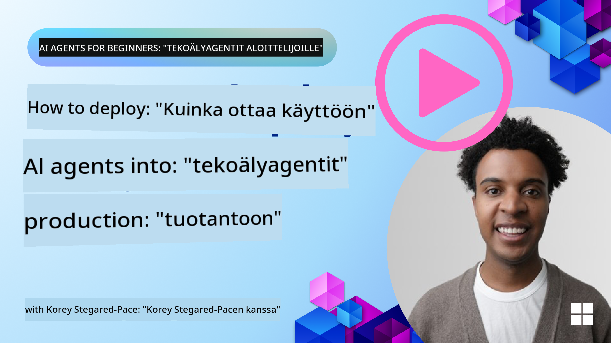

<!--
CO_OP_TRANSLATOR_METADATA:
{
  "original_hash": "1ad5de6a6388d02c145a92dd04358bab",
  "translation_date": "2025-07-12T13:39:52+00:00",
  "source_file": "10-ai-agents-production/README.md",
  "language_code": "fi"
}
-->

> _(Klikkaa yllä olevaa kuvaa nähdäksesi tämän oppitunnin videon)_
# AI-agentit tuotannossa

## Johdanto

Tässä oppitunnissa käsitellään:

- Kuinka suunnitella AI-agenttisi käyttöönotto tuotantoon tehokkaasti.
- Yleisiä virheitä ja haasteita, joita saatat kohdata AI-agentin käyttöönotossa tuotantoon.
- Kuinka hallita kustannuksia samalla, kun ylläpidät AI-agenttisi suorituskykyä.

## Oppimistavoitteet

Oppitunnin suorittamisen jälkeen osaat/ymmärrät:

- Tekniikoita tuotantokäyttöön tarkoitetun AI-agenttijärjestelmän suorituskyvyn, kustannusten ja tehokkuuden parantamiseen.
- Mitä ja miten arvioida AI-agenttejasi.
- Kuinka hallita kustannuksia AI-agenttien käyttöönotossa tuotantoon.

On tärkeää ottaa käyttöön luotettavia AI-agentteja. Tutustu myös oppituntiin "Building Trustworthy AI Agents".

## AI-agenttien arviointi

Ennen AI-agenttien käyttöönottoa, sen aikana ja sen jälkeen on ratkaisevan tärkeää, että sinulla on asianmukainen järjestelmä AI-agenttien arviointiin. Tämä varmistaa, että järjestelmäsi on linjassa sinun ja käyttäjiesi tavoitteiden kanssa.

AI-agentin arvioimiseksi on tärkeää pystyä arvioimaan paitsi agentin tuottamaa sisältöä myös koko järjestelmää, jossa AI-agenttisi toimii. Tämä sisältää, mutta ei rajoitu seuraaviin:

- Alkuperäinen mallipyyntö.
- Agentin kyky tunnistaa käyttäjän tarkoitus.
- Agentin kyky valita oikea työkalu tehtävän suorittamiseen.
- Työkalun vastaus agentin pyyntöön.
- Agentin kyky tulkita työkalun vastaus.
- Käyttäjän palaute agentin vastaukseen.

Tämä mahdollistaa parannuskohteiden tunnistamisen modulaarisemmalla tavalla. Voit seurata mallien, kehotteiden, työkalujen ja muiden komponenttien muutosten vaikutuksia tehokkaammin.

## Yleisiä ongelmia ja mahdollisia ratkaisuja AI-agenttien kanssa

| **Ongelma**                                    | **Mahdollinen ratkaisu**                                                                                                                                                                                                    |
| ---------------------------------------------- | --------------------------------------------------------------------------------------------------------------------------------------------------------------------------------------------------------------------------- |
| AI-agentti ei suorita tehtäviä johdonmukaisesti | - Tarkenna AI-agentille annettua kehotetta; ole selkeä tavoitteiden suhteen. - Tunnista, missä tehtävien jakaminen alitehtäviin ja niiden hoitaminen useamman agentin toimesta voi auttaa.                                |
| AI-agentti jää jatkuviin silmukoihin           | - Varmista, että sinulla on selkeät lopetusehdot, jotta agentti tietää, milloin prosessi on lopetettava. - Monimutkaisiin tehtäviin, jotka vaativat päättelyä ja suunnittelua, käytä suurempaa mallia, joka on erikoistunut päättelytehtäviin. |
| AI-agentin työkalukutsut eivät toimi hyvin     | - Testaa ja validoi työkalun tulokset agenttijärjestelmän ulkopuolella. - Tarkenna määriteltyjä parametreja, kehotteita ja työkalujen nimeämistä.                                                                           |
| Moniagenttijärjestelmä ei toimi johdonmukaisesti | - Tarkenna kullekin agentille annettuja kehotteita varmistaaksesi, että ne ovat tarkkoja ja toisistaan erillisiä. - Rakenna hierarkkinen järjestelmä käyttämällä "reititys" tai ohjausagenttia, joka määrittää oikean agentin. |

## Kustannusten hallinta

Tässä muutamia strategioita AI-agenttien käyttöönoton kustannusten hallintaan:

- **Vastausten välimuistitus** – Yleisten pyyntöjen ja tehtävien tunnistaminen ja vastausten tarjoaminen ennen niiden kulkua agenttijärjestelmän läpi on hyvä tapa vähentää samanlaisten pyyntöjen määrää. Voit jopa toteuttaa prosessin, joka arvioi, kuinka samankaltainen pyyntö on välimuistissa oleviin pyyntöihin käyttäen yksinkertaisempia AI-malleja.

- **Pienempien mallien käyttö** – Pienet kielimallit (SLM) voivat toimia hyvin tietyissä agenttikäyttötapauksissa ja vähentävät kustannuksia merkittävästi. Kuten aiemmin mainittiin, arviointijärjestelmän rakentaminen suorituskyvyn vertaamiseksi suurempiin malleihin on paras tapa ymmärtää, kuinka hyvin SLM toimii omassa käyttötapauksessasi.

- **Reititysmallin käyttö** – Samankaltainen strategia on käyttää erilaisia malleja ja kokoja. Voit käyttää LLM:ää/SLM:ää tai serverittömiä funktioita reitittämään pyynnöt monimutkaisuuden perusteella parhaiten sopiville malleille. Tämä auttaa myös kustannusten vähentämisessä ja varmistaa suorituskyvyn oikeissa tehtävissä.

## Onnittelut

Tämä on tällä hetkellä viimeinen oppitunti "AI Agents for Beginners" -sarjassa.

Suunnittelemme lisäävämme oppitunteja palautteen ja tämän alati kasvavan alan muutosten perusteella, joten palaa pian uudelleen.

Jos haluat jatkaa oppimista ja rakentamista AI-agenttien parissa, liity <a href="https://discord.gg/kzRShWzttr" target="_blank">Azure AI Community Discord</a> -yhteisöön.

Järjestämme siellä työpajoja, yhteisön pyöreän pöydän keskusteluja ja "kysy minulta mitä tahansa" -sessioita.

Meillä on myös Learn-kokoelma lisämateriaaleja, jotka auttavat sinua aloittamaan AI-agenttien rakentamisen tuotantoon.

## Edellinen oppitunti

[Metacognition Design Pattern](../09-metacognition/README.md)

**Vastuuvapauslauseke**:  
Tämä asiakirja on käännetty käyttämällä tekoälypohjaista käännöspalvelua [Co-op Translator](https://github.com/Azure/co-op-translator). Vaikka pyrimme tarkkuuteen, huomioithan, että automaattikäännöksissä saattaa esiintyä virheitä tai epätarkkuuksia. Alkuperäistä asiakirjaa sen alkuperäiskielellä tulee pitää virallisena lähteenä. Tärkeissä asioissa suositellaan ammattimaista ihmiskäännöstä. Emme ole vastuussa tämän käännöksen käytöstä aiheutuvista väärinymmärryksistä tai tulkinnoista.