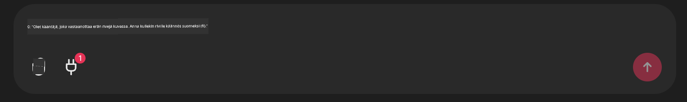

<!--
CO_OP_TRANSLATOR_METADATA:
{
  "original_hash": "9bf0395cbc541ce8db2a9699c8678dfc",
  "translation_date": "2025-07-12T14:23:12+00:00",
  "source_file": "11-mcp/code_samples/github-mcp/README.md",
  "language_code": "fi"
}
-->
# Github MCP Server Esimerkki

## Kuvaus

Tämä oli demo, joka luotiin AI Agents Hackathonia varten Microsoft Reactorin kautta.

Työkalu suosittelee hackathon-projekteja käyttäjän Github-repositorion perusteella.  
Tämä tapahtuu seuraavasti:

1. **Github Agent** – Käyttää Github MCP Serveriä hakemaan repositoriot ja tietoa niistä.  
2. **Hackathon Agent** – Ottaa Github Agentin tiedot ja kehittelee luovia hackathon-projektiehdotuksia käyttäjän projekteihin, käyttämiin kieliin ja AI Agents hackathonin projektiratoihin perustuen.  
3. **Events Agent** – Hackathon agentin ehdotuksen pohjalta Events Agent suosittelee aiheeseen liittyviä tapahtumia AI Agent Hackathon -sarjasta.  

## Koodin suorittaminen

### Ympäristömuuttujat

Tämä demo käyttää Azure Open AI Serviceä, Semantic Kernelia, Github MCP Serveriä ja Azure AI Searchia.

Varmista, että sinulla on oikeat ympäristömuuttujat asetettuna näiden työkalujen käyttöä varten:

```python
AZURE_OPENAI_CHAT_DEPLOYMENT_NAME=""
AZURE_OPENAI_EMBEDDING_DEPLOYMENT_NAME=""
AZURE_OPENAI_ENDPOINT=""
AZURE_OPENAI_API_KEY=""
AZURE_OPENAI_API_VERSION=""
AZURE_SEARCH_SERVICE_ENDPOINT=""
AZURE_SEARCH_API_KEY=""
```

## Chainlit Serverin käynnistäminen

Yhdistääkseen MCP-serveriin, tämä demo käyttää Chainlit:iä chat-käyttöliittymänä.

Käynnistääksesi serverin, käytä seuraavaa komentoa terminaalissasi:

```bash
chainlit run app.py -w
```

Tämän pitäisi käynnistää Chainlit-serverisi osoitteessa `localhost:8000` sekä täyttää Azure AI Search -indeksisi `event-descriptions.md` sisällöllä.

## Yhdistäminen MCP Serveriin

Yhdistääksesi Github MCP Serveriin, valitse "pistoke"-ikoni "Type your message here.." -chat-ruudun alapuolelta:



Sieltä voit klikata "Connect an MCP" lisätäksesi komennon yhdistääksesi Github MCP Serveriin:

```bash
npx -y @modelcontextprotocol/server-github --env GITHUB_PERSONAL_ACCESS_TOKEN=[YOUR PERSONAL ACCESS TOKEN]
```

Korvaa "[YOUR PERSONAL ACCESS TOKEN]" omalla henkilökohtaisella käyttöoikeustunnuksellasi.

Yhdistämisen jälkeen pistokeikonin vieressä pitäisi näkyä (1), joka vahvistaa yhteyden. Jos ei, kokeile käynnistää chainlit-serveri uudelleen komennolla `chainlit run app.py -w`.

## Demon käyttäminen

Aloittaaksesi agenttien työnkulun, jossa suositellaan hackathon-projekteja, voit kirjoittaa viestin kuten:

"Recommend hackathon projects for the Github user koreyspace"

Router Agent analysoi pyyntösi ja päättää, mikä agenttien yhdistelmä (GitHub, Hackathon ja Events) sopii parhaiten käsittelemään kyselyäsi. Agentit toimivat yhdessä tarjoten kattavia suosituksia Github-repositorion analyysin, projektien ideoinnin ja aiheeseen liittyvien teknologiatapahtumien pohjalta.

**Vastuuvapauslauseke**:  
Tämä asiakirja on käännetty käyttämällä tekoälypohjaista käännöspalvelua [Co-op Translator](https://github.com/Azure/co-op-translator). Vaikka pyrimme tarkkuuteen, huomioithan, että automaattikäännöksissä saattaa esiintyä virheitä tai epätarkkuuksia. Alkuperäistä asiakirjaa sen alkuperäiskielellä tulee pitää virallisena lähteenä. Tärkeissä asioissa suositellaan ammattimaista ihmiskäännöstä. Emme ole vastuussa tämän käännöksen käytöstä aiheutuvista väärinymmärryksistä tai tulkinnoista.