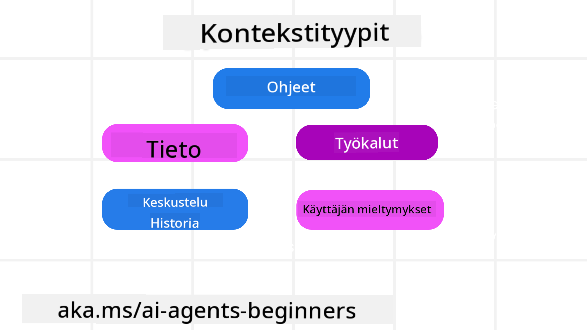
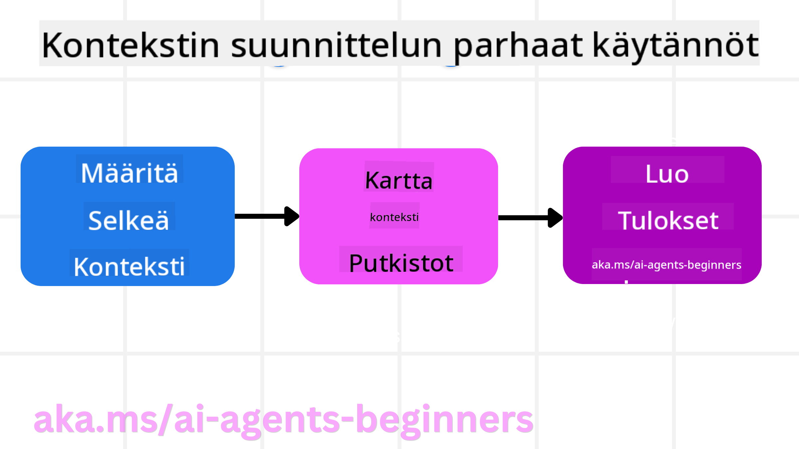

<!--
CO_OP_TRANSLATOR_METADATA:
{
  "original_hash": "cb7e50f471905ce6fdb92a30269a7a98",
  "translation_date": "2025-09-04T10:12:35+00:00",
  "source_file": "12-context-engineering/README.md",
  "language_code": "fi"
}
-->
# Kontekstisuunnittelu tekoälyagenteille

> _(Klikkaa yllä olevaa kuvaa katsoaksesi tämän oppitunnin videon)_

On tärkeää ymmärtää, kuinka monimutkainen sovellus on, johon rakennat tekoälyagenttia, jotta siitä tulee luotettava. Meidän on rakennettava tekoälyagentteja, jotka hallitsevat tietoa tehokkaasti ja vastaavat monimutkaisiin tarpeisiin pelkän kehotesuunnittelun sijaan.

Tässä oppitunnissa tarkastelemme, mitä kontekstisuunnittelu on ja mikä sen rooli on tekoälyagenttien rakentamisessa.

## Johdanto

Tässä oppitunnissa käsitellään:

• **Mitä kontekstisuunnittelu on** ja miksi se eroaa kehotesuunnittelusta.

• **Strategioita tehokkaaseen kontekstisuunnitteluun**, mukaan lukien tiedon kirjoittaminen, valitseminen, tiivistäminen ja eristäminen.

• **Yleisiä kontekstivirheitä**, jotka voivat haitata tekoälyagenttia, ja kuinka ne korjataan.

## Oppimistavoitteet

Tämän oppitunnin jälkeen osaat:

• **Määritellä kontekstisuunnittelun** ja erottaa sen kehotesuunnittelusta.

• **Tunnistaa kontekstin keskeiset osat** suurten kielimallien (LLM) sovelluksissa.

• **Soveltaa strategioita kontekstin kirjoittamiseen, valitsemiseen, tiivistämiseen ja eristämiseen** agentin suorituskyvyn parantamiseksi.

• **Tunnistaa yleiset kontekstivirheet**, kuten myrkytys, häiriö, sekaannus ja ristiriita, sekä toteuttaa niiden lieventämistekniikat.

## Mitä on kontekstisuunnittelu?

Tekoälyagenteille konteksti ohjaa tekoälyagentin suunnittelua tiettyjen toimien suorittamiseksi. Kontekstisuunnittelu tarkoittaa käytäntöä, jossa varmistetaan, että tekoälyagentilla on oikeat tiedot tehtävän seuraavan vaiheen suorittamiseksi. Kontekstin ikkuna on kooltaan rajallinen, joten agenttien rakentajina meidän on luotava järjestelmiä ja prosesseja tiedon lisäämisen, poistamisen ja tiivistämisen hallitsemiseksi kontekstin ikkunassa.

### Kehotesuunnittelu vs. Kontekstisuunnittelu

Kehotesuunnittelu keskittyy yhteen staattiseen ohjejoukkoon, jolla ohjataan tekoälyagentteja tehokkaasti sääntöjen avulla. Kontekstisuunnittelu puolestaan käsittelee dynaamista tietojoukkoa, mukaan lukien alkuperäinen kehotus, varmistaakseen, että tekoälyagentilla on tarvittavat tiedot ajan myötä. Kontekstisuunnittelun pääidea on tehdä tästä prosessista toistettava ja luotettava.

### Kontekstin tyypit

On tärkeää muistaa, että konteksti ei ole vain yksi asia. Tekoälyagentin tarvitsemat tiedot voivat tulla monista eri lähteistä, ja meidän tehtävämme on varmistaa, että agentilla on pääsy näihin lähteisiin:

Tekoälyagentin hallittavaksi tarvittavat kontekstityypit voivat sisältää:

• **Ohjeet:** Nämä ovat agentin "säännöt" – kehotteet, järjestelmäviestit, muutaman esimerkin avulla annetut ohjeet (näytetään tekoälylle, miten jokin tehdään) ja kuvaus käytettävissä olevista työkaluista. Tämä on alue, jossa kehotesuunnittelu yhdistyy kontekstisuunnitteluun.

• **Tieto:** Tämä kattaa faktat, tietokannoista haetut tiedot tai agentin keräämät pitkäaikaiset muistot. Tämä sisältää Retrieval Augmented Generation (RAG) -järjestelmän integroinnin, jos agentin on päästävä käsiksi erilaisiin tietovarastoihin ja tietokantoihin.

• **Työkalut:** Näihin kuuluvat ulkoisten toimintojen, API:iden ja MCP-palvelimien määritelmät, joita agentti voi kutsua, sekä palaute (tulokset), jonka se saa niitä käyttäessään.

• **Keskusteluhistoria:** Käyttäjän kanssa käyty jatkuva vuoropuhelu. Ajan myötä nämä keskustelut pitenevät ja monimutkaistuvat, mikä tarkoittaa, että ne vievät enemmän tilaa kontekstin ikkunassa.

• **Käyttäjän mieltymykset:** Tiedot, jotka on opittu käyttäjän mieltymyksistä ajan myötä. Näitä voidaan käyttää avainpäätösten tekemisessä käyttäjän auttamiseksi.

## Strategiat tehokkaaseen kontekstisuunnitteluun

### Suunnittelustrategiat

Hyvä kontekstisuunnittelu alkaa hyvästä suunnittelusta. Tässä on lähestymistapa, joka auttaa sinua miettimään, kuinka soveltaa kontekstisuunnittelun käsitettä:

1. **Määrittele selkeät tulokset** – Tekoälyagentille annettavien tehtävien tulokset tulisi määritellä selkeästi. Vastaa kysymykseen: "Miltä maailma näyttää, kun tekoälyagentti on suorittanut tehtävänsä?" Toisin sanoen, mikä muutos, tieto tai vastaus käyttäjällä pitäisi olla vuorovaikutuksen jälkeen.

2. **Kartta konteksti** – Kun olet määritellyt tekoälyagentin tulokset, sinun on vastattava kysymykseen: "Mitä tietoja tekoälyagentti tarvitsee suorittaakseen tämän tehtävän?" Näin voit alkaa kartoittaa, mistä tiedot löytyvät.

3. **Luo kontekstiputket** – Kun tiedät, mistä tiedot löytyvät, sinun on vastattava kysymykseen: "Miten agentti saa nämä tiedot?" Tämä voidaan tehdä monin tavoin, kuten RAG:n, MCP-palvelimien ja muiden työkalujen avulla.

### Käytännön strategiat

Suunnittelu on tärkeää, mutta kun tiedot alkavat virrata agentin kontekstin ikkunaan, meidän on käytettävä käytännön strategioita niiden hallitsemiseksi:

#### Kontekstin hallinta

Vaikka osa tiedoista lisätään kontekstin ikkunaan automaattisesti, kontekstisuunnittelu tarkoittaa aktiivisempaa roolia näiden tietojen hallinnassa, mikä voidaan tehdä muutamalla strategialla:

1. **Agentin muistikirja**  
Tämä mahdollistaa tekoälyagentin tekemään muistiinpanoja nykyisen tehtävän ja käyttäjän vuorovaikutusten kannalta olennaisista tiedoista yhden istunnon aikana. Tämä tulisi säilyttää kontekstin ikkunan ulkopuolella tiedostossa tai ajonaikaisessa objektissa, jonka agentti voi myöhemmin hakea tämän istunnon aikana tarvittaessa.

2. **Muistot**  
Muistikirjat ovat hyviä hallitsemaan tietoja yhden istunnon kontekstin ikkunan ulkopuolella. Muistot mahdollistavat agenttien tallentaa ja hakea olennaisia tietoja useiden istuntojen aikana. Tämä voi sisältää tiivistelmiä, käyttäjän mieltymyksiä ja palautetta tulevien parannusten tueksi.

3. **Kontekstin tiivistäminen**  
Kun kontekstin ikkuna kasvaa ja lähestyy rajaansa, voidaan käyttää tekniikoita, kuten tiivistämistä ja karsimista. Tämä tarkoittaa joko vain olennaisimpien tietojen säilyttämistä tai vanhempien viestien poistamista.

4. **Moniagenttijärjestelmät**  
Moniagenttijärjestelmän kehittäminen on eräänlaista kontekstisuunnittelua, koska jokaisella agentilla on oma kontekstin ikkunansa. Se, miten tämä konteksti jaetaan ja siirretään eri agenteille, on toinen asia, joka on suunniteltava näitä järjestelmiä rakennettaessa.

5. **Hiekkalaatikkoympäristöt**  
Jos agentin täytyy suorittaa koodia tai käsitellä suuria tietomääriä asiakirjassa, tämä voi viedä suuren määrän tokeneita tulosten käsittelyyn. Sen sijaan, että kaikki tämä tallennettaisiin kontekstin ikkunaan, agentti voi käyttää hiekkalaatikkoympäristöä, joka pystyy suorittamaan tämän koodin ja lukemaan vain tulokset ja muut olennaiset tiedot.

6. **Ajonaikaiset tilaobjektit**  
Tämä tehdään luomalla tietokontteja hallitsemaan tilanteita, joissa agentin täytyy päästä käsiksi tiettyihin tietoihin. Monimutkaisessa tehtävässä tämä mahdollistaisi agentin tallentaa kunkin osatehtävän tulokset vaihe vaiheelta, jolloin konteksti pysyy yhteydessä vain kyseiseen osatehtävään.

### Esimerkki kontekstisuunnittelusta

Oletetaan, että haluamme tekoälyagentin **"Varaa minulle matka Pariisiin."**

• Yksinkertainen agentti, joka käyttää vain kehotesuunnittelua, saattaisi vastata: **"Selvä, milloin haluaisit lähteä Pariisiin?"**. Se käsitteli vain suoran kysymyksesi sillä hetkellä, kun käyttäjä kysyi.

• Agentti, joka käyttää tässä käsiteltyjä kontekstisuunnittelustrategioita, tekisi paljon enemmän. Ennen kuin se edes vastaisi, sen järjestelmä voisi:

  ◦ **Tarkistaa kalenterisi** vapaiden päivien löytämiseksi (reaaliaikainen tiedonhaku).

 ◦ **Muistaa aiemmat matkustustottumuksesi** (pitkäaikaisesta muistista), kuten suosimasi lentoyhtiön, budjetin tai sen, pidätkö suorista lennoista.

 ◦ **Tunnistaa käytettävissä olevat työkalut** lentojen ja hotellien varaamiseen.

- Tämän jälkeen esimerkkivastaus voisi olla: "Hei [Nimesi]! Näen, että olet vapaa lokakuun ensimmäisellä viikolla. Etsinkö suoria lentoja Pariisiin [Suosimasi lentoyhtiö] -yhtiöllä tavanomaisen budjettisi [Budjetti] mukaisesti?" Tämä rikkaampi, kontekstia hyödyntävä vastaus osoittaa kontekstisuunnittelun voiman.

## Yleiset kontekstivirheet

### Kontekstin myrkytys

**Mitä se on:** Kun harha (LLM:n tuottama virheellinen tieto) tai virhe pääsee kontekstiin ja siihen viitataan toistuvasti, mikä saa agentin tavoittelemaan mahdottomia päämääriä tai kehittämään järjettömiä strategioita.

**Mitä tehdä:** Ota käyttöön **kontekstin validointi** ja **karanteeni**. Vahvista tiedot ennen niiden lisäämistä pitkäaikaiseen muistiin. Jos mahdollinen myrkytys havaitaan, aloita uudet kontekstiketjut estääksesi virheellisen tiedon leviämisen.

**Esimerkki matkan varaamisesta:** Agenttisi kuvittelee olemassa olevan **suoran lennon pieneltä paikalliselta lentokentältä kaukaiseen kansainväliseen kaupunkiin**, vaikka kyseinen lentokenttä ei tarjoa kansainvälisiä lentoja. Tämä olematon lentotieto tallennetaan kontekstiin. Myöhemmin, kun pyydät agenttia varaamaan lennon, se yrittää jatkuvasti löytää lippuja tälle mahdottomalle reitille, mikä johtaa toistuviin virheisiin.

**Ratkaisu:** Ota käyttöön vaihe, joka **vahvistaa lentojen olemassaolon ja reitit reaaliaikaisen API:n avulla** _ennen_ kuin lentotiedot lisätään agentin työskentelykontekstiin. Jos validointi epäonnistuu, virheelliset tiedot "eristetään" eikä niitä käytetä enää.

### Kontekstin häiriö

**Mitä se on:** Kun konteksti kasvaa niin suureksi, että malli keskittyy liikaa kertyneeseen historiaan sen sijaan, että käyttäisi koulutuksen aikana oppimaansa, mikä johtaa toistuviin tai hyödyttömiin toimiin. Mallit voivat alkaa tehdä virheitä jo ennen kuin kontekstin ikkuna täyttyy.

**Mitä tehdä:** Käytä **kontekstin tiivistämistä**. Tiivistä kertyneet tiedot säännöllisesti lyhyemmiksi tiivistelmiksi, säilyttäen tärkeät yksityiskohdat ja poistaen tarpeettoman historian. Tämä auttaa "nollaamaan" keskittymisen.

**Esimerkki matkan varaamisesta:** Olet keskustellut pitkään eri unelmakohteista, mukaan lukien yksityiskohtainen kertomus kahden vuoden takaisesta reppureissustasi. Kun lopulta pyydät **"etsi minulle halpa lento ensi kuulle"**, agentti jää kiinni vanhoihin, epäolennaisiin yksityiskohtiin ja kyselee jatkuvasti reppureissuvälineistäsi tai aiemmista reiteistäsi, unohtaen nykyisen pyyntösi.

**Ratkaisu:** Tietyn määrän vuorojen jälkeen tai kun konteksti kasvaa liian suureksi, agentin tulisi **tiivistää viimeisimmät ja olennaisimmat osat keskustelusta** – keskittyen nykyisiin matkustuspäiviisi ja kohteeseesi – ja käyttää tätä tiivistettyä yhteenvetoa seuraavassa LLM-kutsussa, hyläten vähemmän olennaisen historiallisen keskustelun.

### Kontekstin sekaannus

**Mitä se on:** Kun tarpeeton konteksti, usein liian monien käytettävissä olevien työkalujen muodossa, saa mallin tuottamaan huonoja vastauksia tai kutsumaan epäolennaisia työkaluja. Pienemmät mallit ovat erityisen alttiita tälle.

**Mitä tehdä:** Ota käyttöön **työkalujen hallinta** RAG-tekniikoilla. Tallenna työkalujen kuvaukset vektoripohjaiseen tietokantaan ja valitse _vain_ tehtävään liittyvimmät työkalut. Tutkimukset osoittavat, että työkalujen valinta kannattaa rajoittaa alle 30:een.

**Esimerkki matkan varaamisesta:** Agentillasi on käytössään kymmeniä työkaluja: `book_flight`, `book_hotel`, `rent_car`, `find_tours`, `currency_converter`, `weather_forecast`, `restaurant_reservations` jne. Pyydät, **"Mikä on paras tapa liikkua Pariisissa?"** Työkalujen suuren määrän vuoksi agentti sekoaa ja yrittää kutsua `book_flight`-työkalua _Pariisin sisällä_ tai `rent_car`-työkalua, vaikka suosit julkista liikennettä, koska työkalujen kuvaukset voivat olla päällekkäisiä tai agentti ei yksinkertaisesti osaa valita parasta.

**Ratkaisu:** Käytä **RAG-tekniikkaa työkalujen kuvauksissa**. Kun kysyt liikkumisesta Pariisissa, järjestelmä hakee dynaamisesti _vain_ relevantit työkalut, kuten `rent_car` tai `public_transport_info`, kyselysi perusteella ja esittää LLM:lle rajatun "työkalupaketin".

### Kontekstin ristiriita

**Mitä se on:** Kun kontekstissa on ristiriitaisia tietoja, mikä johtaa epäjohdonmukaiseen päättelyyn tai huonoihin lopputuloksiin. Tämä tapahtuu usein, kun tiedot saapuvat vaiheittain ja aikaisemmat, virheelliset oletukset jäävät kontekstiin.

**Mitä tehdä:** Käytä **kontekstin karsimista** ja **tiedon ulkoistamista**. Karsiminen tarkoittaa vanhentuneiden tai ristiriitaisten tietojen poistamista, kun uusia tietoja saapuu. Ulkoistaminen antaa mallille erillisen "muistikirjan", jossa se voi käsitellä tietoja ilman, että pääkonteksti sotkeutuu.

**Esimerkki matkan varaamisesta:** Aluksi kerrot agentillesi, **"Haluan lentää turistiluokassa."** Myöhemmin keskustelussa muutat mielesi ja sanot, **"Itse asiassa, tälle matkalle mennään bisnesluokassa."** Jos molemmat ohjeet jäävät kontekstiin, agentti saattaa saada ristiriitaisia hakutuloksia tai sekoittua siitä, kumpaa mieltymystä priorisoida.

**Ratkaisu:** Ota käyttöön **kontekstin karsiminen**. Kun uusi ohje on ristiriidassa vanhan kanssa, vanhempi ohje poistetaan tai se korvataan eksplisiittisesti kontekstissa. Vaihtoehtoisesti agentti voi käyttää **muistikirjaa** ristiriitaisten mieltymysten sovittamiseen ennen päätöksentekoa, varmistaen, että vain lopullinen, johdonmukainen ohje ohjaa sen toimia.

## Onko sinulla lisää kysymyksiä kontekstisuunnittelusta?

Liity [Azure AI Foundry Discordiin](https://aka.ms/ai-agents/discord) tavat

---

**Vastuuvapauslauseke**:  
Tämä asiakirja on käännetty käyttämällä tekoälypohjaista käännöspalvelua [Co-op Translator](https://github.com/Azure/co-op-translator). Pyrimme tarkkuuteen, mutta huomioithan, että automaattiset käännökset voivat sisältää virheitä tai epätarkkuuksia. Alkuperäistä asiakirjaa sen alkuperäisellä kielellä tulee pitää ensisijaisena lähteenä. Kriittisen tiedon osalta suositellaan ammattimaista ihmiskääntämistä. Emme ole vastuussa tämän käännöksen käytöstä aiheutuvista väärinkäsityksistä tai virhetulkinnoista.