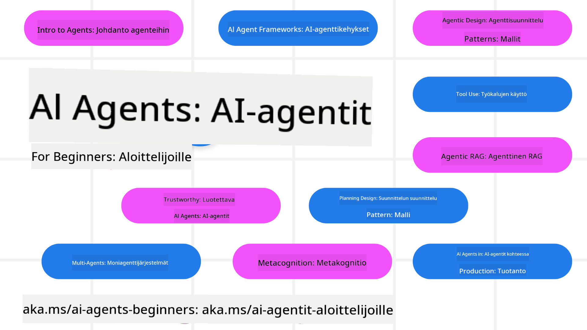

<!--
CO_OP_TRANSLATOR_METADATA:
{
  "original_hash": "6b07046397366e6f6f4524c9ddeba1e1",
  "translation_date": "2025-07-12T14:54:15+00:00",
  "source_file": "README.md",
  "language_code": "fi"
}
-->
# AI-agentit aloittelijoille – Kurssi

## 11 oppituntia, jotka opettavat kaiken tarvittavan AI-agenttien rakentamisen aloittamiseen

  
  
  
  

### 🌐 Monikielinen tuki

#### Tuettu GitHub Actionin kautta (automaattinen ja aina ajan tasalla)

[Ranska](../fr/README.md) | [Espanja](../es/README.md) | [Saksa](../de/README.md) | [Venäjä](../ru/README.md) | [Arabia](../ar/README.md) | [Persia (Farsi)](../fa/README.md) | [Urdu](../ur/README.md) | [Kiina (yksinkertaistettu)](../zh/README.md) | [Kiina (perinteinen, Macao)](../mo/README.md) | [Kiina (perinteinen, Hongkong)](../hk/README.md) | [Kiina (perinteinen, Taiwan)](../tw/README.md) | [Japani](../ja/README.md) | [Korea](../ko/README.md) | [Hindi](../hi/README.md) | [Bengali](../bn/README.md) | [Marathi](../mr/README.md) | [Nepali](../ne/README.md) | [Punjabi (Gurmukhi)](../pa/README.md) | [Portugali (Portugali)](../pt/README.md) | [Portugali (Brasilia)](../br/README.md) | [Italia](../it/README.md) | [Puola](../pl/README.md) | [Turkki](../tr/README.md) | [Kreikka](../el/README.md) | [Thai](../th/README.md) | [Ruotsi](../sv/README.md) | [Tanska](../da/README.md) | [Norja](../no/README.md) | [Suomi](./README.md) | [Hollanti](../nl/README.md) | [Heprea](../he/README.md) | [Vietnam](../vi/README.md) | [Indonesia](../id/README.md) | [Malaiji](../ms/README.md) | [Tagalog (Filipino)](../tl/README.md) | [Swahili](../sw/README.md) | [Unkari](../hu/README.md) | [Tšekki](../cs/README.md) | [Slovakki](../sk/README.md) | [Romania](../ro/README.md) | [Bulgaria](../bg/README.md) | [Serbia (kyrillinen)](../sr/README.md) | [Kroatia](../hr/README.md) | [Sloveeni](../sl/README.md) | [Ukraina](../uk/README.md) | [Burma (Myanmar)](../my/README.md)

**Jos haluat lisätä tukikieliä, ne löytyvät [täältä](https://github.com/Azure/co-op-translator/blob/main/getting_started/supported-languages.md)**

  
  

## 🌱 Aloittaminen

Tässä kurssissa on 11 oppituntia, jotka kattavat AI-agenttien rakentamisen perusteet. Jokainen oppitunti käsittelee omaa aihettaan, joten voit aloittaa mistä tahansa!

Kurssilla on monikielinen tuki. Katso [saatavilla olevat kielet tästä](../..).

Jos rakennat Generative AI -malleilla ensimmäistä kertaa, tutustu [Generative AI For Beginners](https://aka.ms/genai-beginners) -kurssiin, jossa on 21 oppituntia GenAI:n käytöstä.

Älä unohda [tähtiä (🌟) tälle repositoriolle](https://docs.github.com/en/get-started/exploring-projects-on-github/saving-repositories-with-stars?WT.mc_id=academic-105485-koreyst) ja [forkkaa tämä repo](https://github.com/microsoft/ai-agents-for-beginners/fork) ajaaksesi koodia.

### Mitä tarvitset

Jokaisessa oppitunnissa on mukana koodiesimerkkejä, jotka löytyvät code_samples-kansiosta. Voit [forkata tämän repositorion](https://github.com/microsoft/ai-agents-for-beginners/fork) luodaksesi oman kopiosi.

Näissä harjoituksissa käytetyt koodiesimerkit hyödyntävät Azure AI Foundrya ja GitHub Model Catalogseja kielimallien kanssa työskentelyyn:

- [Github Models](https://aka.ms/ai-agents-beginners/github-models) – Ilmainen / Rajoitettu  
- [Azure AI Foundry](https://aka.ms/ai-agents-beginners/ai-foundry) – Tarvitset Azure-tilin

Kurssi käyttää myös seuraavia Microsoftin AI-agenttikehyksiä ja palveluita:

- [Azure AI Agent Service](https://aka.ms/ai-agents-beginners/ai-agent-service)  
- [Semantic Kernel](https://aka.ms/ai-agents-beginners/semantic-kernel)  
- [AutoGen](https://aka.ms/ai-agents/autogen)

Lisätietoja kurssin koodin ajamisesta löytyy [Course Setup](./00-course-setup/README.md) -osiosta.

## 🙏 Haluatko auttaa?

Onko sinulla ehdotuksia tai oletko löytänyt kirjoitus- tai koodivirheitä? [Luo issue](https://github.com/microsoft/ai-agents-for-beginners/issues?WT.mc_id=academic-105485-koreyst) tai [tee pull request](https://github.com/microsoft/ai-agents-for-beginners/pulls?WT.mc_id=academic-105485-koreyst).

Jos jäit jumiin tai sinulla on kysyttävää AI-agenttien rakentamisesta, liity [Azure AI Foundry Community Discordiin](https://discord.gg/kzRShWzttr).

Jos sinulla on palautetta tuotteesta tai kohtaat virheitä rakentamisen aikana, käy [Azure AI Foundry Developer Forumissa](https://aka.ms/azureaifoundry/forum).

## 📂 Jokainen oppitunti sisältää

- Kirjallisen oppitunnin README-tiedostossa ja lyhyen videon  
- Python-koodiesimerkkejä, jotka tukevat Azure AI Foundrya ja Github-malleja (ilmainen)  
- Linkkejä lisäresursseihin oppimisen jatkamiseksi

## 🗃️ Oppitunnit

| **Oppitunti**                             | **Teksti & Koodi**                                  | **Video**                                                  | **Lisäoppiminen**                                                                      |
|------------------------------------------|----------------------------------------------------|------------------------------------------------------------|----------------------------------------------------------------------------------------|
| Johdatus AI-agentteihin ja käyttötapauksiin | [Linkki](./01-intro-to-ai-agents/README.md)         | [Video](https://youtu.be/3zgm60bXmQk?si=z8QygFvYQv-9WtO1)  | [Linkki](https://aka.ms/ai-agents-beginners/collection?WT.mc_id=academic-105485-koreyst) |
| AI-agenttikehysten tutkiminen            | [Linkki](./02-explore-agentic-frameworks/README.md) | [Video](https://youtu.be/ODwF-EZo_O8?si=Vawth4hzVaHv-u0H)  | [Linkki](https://aka.ms/ai-agents-beginners/collection?WT.mc_id=academic-105485-koreyst) |
| AI-agenttien suunnittelumallit           | [Linkki](./03-agentic-design-patterns/README.md)    | [Video](https://youtu.be/m9lM8qqoOEA?si=BIzHwzstTPL8o9GF)  | [Linkki](https://aka.ms/ai-agents-beginners/collection?WT.mc_id=academic-105485-koreyst) |
| Työkalujen käyttömalli                   | [Linkki](./04-tool-use/README.md)                   | [Video](https://youtu.be/vieRiPRx-gI?si=2z6O2Xu2cu_Jz46N)  | [Linkki](https://aka.ms/ai-agents-beginners/collection?WT.mc_id=academic-105485-koreyst) |
| Agenttinen RAG                          | [Linkki](./05-agentic-rag/README.md)                | [Video](https://youtu.be/WcjAARvdL7I?si=gKPWsQpKiIlDH9A3)  | [Linkki](https://aka.ms/ai-agents-beginners/collection?WT.mc_id=academic-105485-koreyst) |
| Luotettavien AI-agenttien rakentaminen  | [Linkki](./06-building-trustworthy-agents/README.md) | [Video](https://youtu.be/iZKkMEGBCUQ?si=jZjpiMnGFOE9L8OK)  | [Linkki](https://aka.ms/ai-agents-beginners/collection?WT.mc_id=academic-105485-koreyst) |
| Suunnittelumalli                        | [Linkki](./07-planning-design/README.md)            | [Video](https://youtu.be/kPfJ2BrBCMY?si=6SC_iv_E5-mzucnC)  | [Linkki](https://aka.ms/ai-agents-beginners/collection?WT.mc_id=academic-105485-koreyst) |
| Moni-agenttinen suunnittelumalli         | [Linkki](./08-multi-agent/README.md)                | [Video](https://youtu.be/V6HpE9hZEx0?si=rMgDhEu7wXo2uo6g)  | [Linkki](https://aka.ms/ai-agents-beginners/collection?WT.mc_id=academic-105485-koreyst) |
| Metakognitiivinen suunnittelumalli       | [Linkki](./09-metacognition/README.md)              | [Video](https://youtu.be/His9R6gw6Ec?si=8gck6vvdSNCt6OcF)  | [Linkki](https://aka.ms/ai-agents-beginners/collection?WT.mc_id=academic-105485-koreyst) |
| AI-agentit tuotannossa                   | [Linkki](./10-ai-agents-production/README.md)       | [Video](https://youtu.be/l4TP6IyJxmQ?si=31dnhexRo6yLRJDl)  | [Linkki](https://aka.ms/ai-agents-beginners/collection?WT.mc_id=academic-105485-koreyst) |
| AI-agentit MCP:n kanssa                  | [Linkki](./11-mcp/README.md)                        |                                                            | [Linkki](https://aka.ms/mcp-for-beginners)                                              |

## 🎒 Muut kurssit

Tiimimme tuottaa myös muita kursseja! Tutustu:
- [**UUSI** Model Context Protocol (MCP) Aloittelijoille](https://github.com/microsoft/mcp-for-beginners?WT.mc_id=academic-105485-koreyst)
- [Generatiivinen tekoäly aloittelijoille .NETillä](https://github.com/microsoft/Generative-AI-for-beginners-dotnet?WT.mc_id=academic-105485-koreyst)
- [Generatiivinen tekoäly aloittelijoille](https://github.com/microsoft/generative-ai-for-beginners?WT.mc_id=academic-105485-koreyst)
- [Koneoppiminen aloittelijoille](https://aka.ms/ml-beginners?WT.mc_id=academic-105485-koreyst)
- [Data-analytiikka aloittelijoille](https://aka.ms/datascience-beginners?WT.mc_id=academic-105485-koreyst)
- [Tekoäly aloittelijoille](https://aka.ms/ai-beginners?WT.mc_id=academic-105485-koreyst)
- [Kyberturvallisuus aloittelijoille](https://github.com/microsoft/Security-101??WT.mc_id=academic-96948-sayoung)
- [Verkkokehitys aloittelijoille](https://aka.ms/webdev-beginners?WT.mc_id=academic-105485-koreyst)
- [IoT aloittelijoille](https://aka.ms/iot-beginners?WT.mc_id=academic-105485-koreyst)
- [XR-kehitys aloittelijoille](https://github.com/microsoft/xr-development-for-beginners?WT.mc_id=academic-105485-koreyst)
- [GitHub Copilotin hallinta tekoälypariohjelmointiin](https://aka.ms/GitHubCopilotAI?WT.mc_id=academic-105485-koreyst)
- [GitHub Copilotin hallinta C#/.NET-kehittäjille](https://github.com/microsoft/mastering-github-copilot-for-dotnet-csharp-developers?WT.mc_id=academic-105485-koreyst)
- [Valitse oma Copilot-seikkailusi](https://github.com/microsoft/CopilotAdventures?WT.mc_id=academic-105485-koreyst)

## 🌟 Yhteisön kiitokset

Kiitos [Shivam Goyalille](https://www.linkedin.com/in/shivam2003/) tärkeistä koodiesimerkeistä, jotka havainnollistavat Agentic RAG:ia.

## Osallistuminen

Tämä projekti toivottaa tervetulleiksi panokset ja ehdotukset. Useimmat panokset edellyttävät, että hyväksyt
Contributor License Agreementin (CLA), jossa vahvistat, että sinulla on oikeus ja että myönnät meille
oikeudet käyttää panostasi. Lisätietoja löytyy osoitteesta
<https://cla.opensource.microsoft.com>.

Kun lähetät pull requestin, CLA-botti tarkistaa automaattisesti, tarvitsetko CLA:n ja merkitsee PR:n asianmukaisesti (esim. tilantarkistus, kommentti). Noudata vain botin antamia ohjeita. Tämä riittää tekemään vain kerran kaikissa CLA:ta käyttävissä repositorioissa.

Tämä projekti on ottanut käyttöön [Microsoftin avoimen lähdekoodin käytännesäännöt](https://opensource.microsoft.com/codeofconduct/).
Lisätietoja löytyy [Käytännesääntöjen UKK:sta](https://opensource.microsoft.com/codeofconduct/faq/) tai ota yhteyttä osoitteeseen [opencode@microsoft.com](mailto:opencode@microsoft.com) lisäkysymyksiä tai kommentteja varten.

## Tavara- ja palvelumerkit

Tämä projekti saattaa sisältää tavara- tai palvelumerkkejä projekteille, tuotteille tai palveluille. Microsoftin tavara- ja palvelumerkkien käyttö on sallittua ja sen on noudatettava
[Microsoftin tavara- ja brändiohjeita](https://www.microsoft.com/legal/intellectualproperty/trademarks/usage/general).
Microsoftin tavara- ja palvelumerkkien käyttö muokatuissa versioissa ei saa aiheuttaa sekaannusta tai antaa vaikutelmaa Microsoftin sponsoroimasta.
Kolmansien osapuolten tavara- ja palvelumerkkien käyttö on näiden osapuolten sääntöjen alaista.

**Vastuuvapauslauseke**:  
Tämä asiakirja on käännetty käyttämällä tekoälypohjaista käännöspalvelua [Co-op Translator](https://github.com/Azure/co-op-translator). Vaikka pyrimme tarkkuuteen, huomioithan, että automaattikäännöksissä saattaa esiintyä virheitä tai epätarkkuuksia. Alkuperäistä asiakirjaa sen alkuperäiskielellä tulee pitää virallisena lähteenä. Tärkeissä asioissa suositellaan ammattimaista ihmiskäännöstä. Emme ole vastuussa tämän käännöksen käytöstä aiheutuvista väärinymmärryksistä tai tulkinnoista.