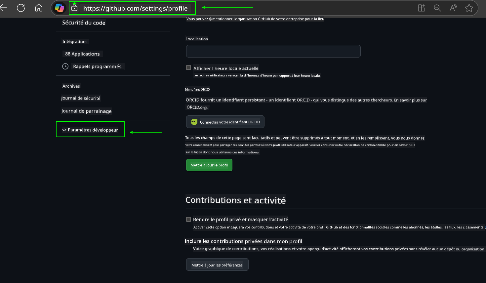
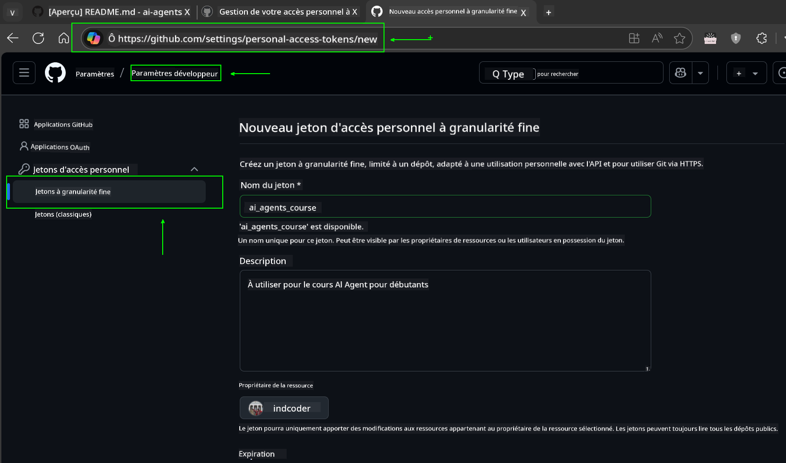
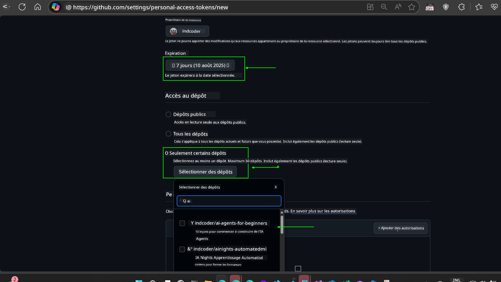
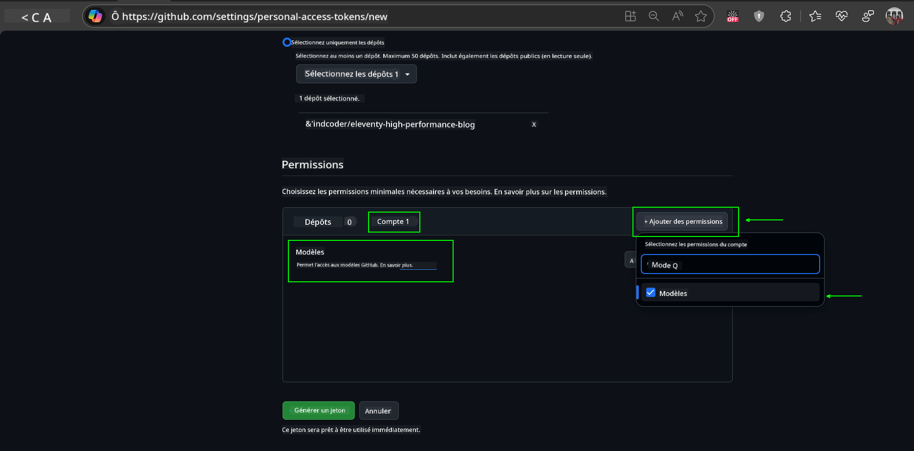
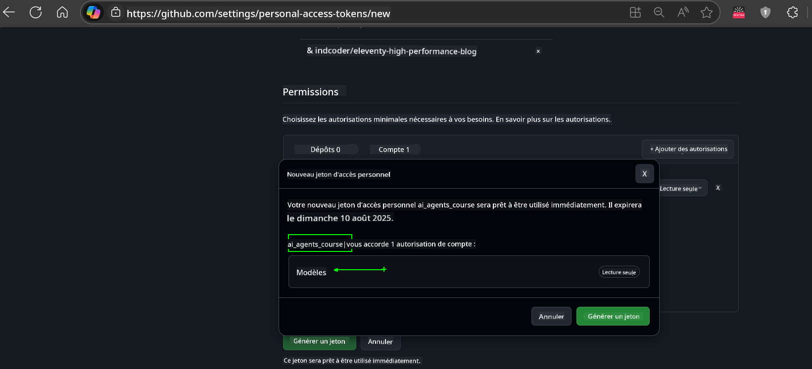
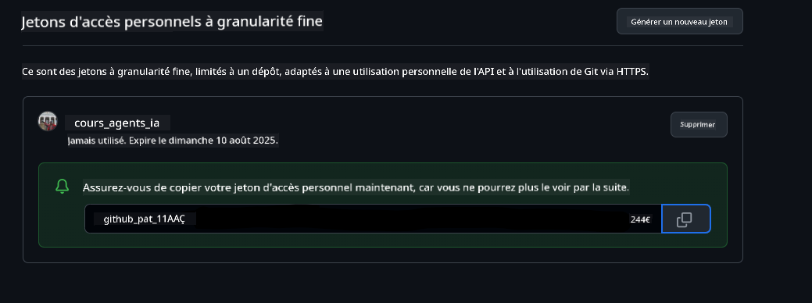
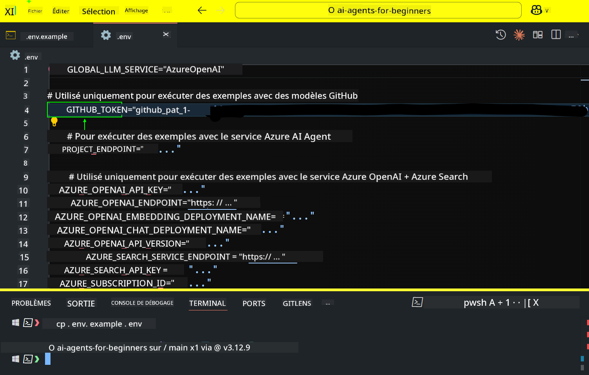

<!--
CO_OP_TRANSLATOR_METADATA:
{
  "original_hash": "c55b973b1562abf5aadf6a4028265ac5",
  "translation_date": "2025-08-28T09:43:07+00:00",
  "source_file": "00-course-setup/README.md",
  "language_code": "fr"
}
-->
# Configuration du cours

## Introduction

Cette leçon explique comment exécuter les exemples de code de ce cours.

## Rejoignez d'autres apprenants et obtenez de l'aide

Avant de commencer à cloner votre dépôt, rejoignez le [canal Discord AI Agents For Beginners](https://aka.ms/ai-agents/discord) pour obtenir de l'aide sur la configuration, poser des questions sur le cours ou entrer en contact avec d'autres apprenants.

## Cloner ou forker ce dépôt

Pour commencer, veuillez cloner ou forker le dépôt GitHub. Cela vous permettra de créer votre propre version du matériel du cours afin de pouvoir exécuter, tester et modifier le code !

Cela peut être fait en cliquant sur le lien pour 

Vous devriez maintenant avoir votre propre version forkée de ce cours au lien suivant :


## Exécution du code

Ce cours propose une série de notebooks Jupyter que vous pouvez exécuter pour acquérir une expérience pratique dans la création d'agents d'IA.

Les exemples de code utilisent :

**Requiert un compte GitHub - Gratuit** :

1) Framework Semantic Kernel Agent + GitHub Models Marketplace. Étiqueté comme (semantic-kernel.ipynb)
2) Framework AutoGen + GitHub Models Marketplace. Étiqueté comme (autogen.ipynb)

**Requiert un abonnement Azure** :
3) Azure AI Foundry + Azure AI Agent Service. Étiqueté comme (azureaiagent.ipynb)

Nous vous encourageons à essayer les trois types d'exemples pour voir lequel fonctionne le mieux pour vous.

L'option que vous choisissez déterminera les étapes de configuration que vous devez suivre ci-dessous :

## Prérequis

- Python 3.12+
  - **NOTE** : Si vous n'avez pas Python 3.12 installé, assurez-vous de l'installer. Ensuite, créez votre environnement virtuel (venv) en utilisant python3.12 pour garantir que les bonnes versions sont installées à partir du fichier requirements.txt.
- Un compte GitHub - Pour accéder au GitHub Models Marketplace
- Un abonnement Azure - Pour accéder à Azure AI Foundry
- Un compte Azure AI Foundry - Pour accéder au service Azure AI Agent

Nous avons inclus un fichier `requirements.txt` à la racine de ce dépôt contenant tous les packages Python nécessaires pour exécuter les exemples de code.

Vous pouvez les installer en exécutant la commande suivante dans votre terminal à la racine du dépôt :

```bash
pip install -r requirements.txt
```
Nous recommandons de créer un environnement virtuel Python pour éviter tout conflit ou problème.

## Configuration de VSCode
Assurez-vous d'utiliser la bonne version de Python dans VSCode.


## Configuration pour les exemples utilisant les modèles GitHub 

### Étape 1 : Récupérez votre jeton d'accès personnel GitHub (PAT)

Ce cours utilise le GitHub Models Marketplace, qui offre un accès gratuit à des modèles de langage étendu (LLMs) que vous utiliserez pour créer des agents d'IA.

Pour utiliser les modèles GitHub, vous devrez créer un [jeton d'accès personnel GitHub](https://docs.github.com/en/authentication/keeping-your-account-and-data-secure/managing-your-personal-access-tokens).

Cela peut être fait en accédant à votre compte GitHub.

Veuillez suivre le [principe du moindre privilège](https://docs.github.com/en/get-started/learning-to-code/storing-your-secrets-safely) lors de la création de votre jeton. Cela signifie que vous ne devez donner au jeton que les permissions nécessaires pour exécuter les exemples de code de ce cours.

1. Sélectionnez l'option `Fine-grained tokens` sur le côté gauche de votre écran en accédant aux **Paramètres du développeur**.
   

    Ensuite, sélectionnez `Generate new token`.

    

2. Entrez un nom descriptif pour votre jeton qui reflète son objectif, afin qu'il soit facile à identifier plus tard.

    🔐 Recommandation de durée du jeton

    Durée recommandée : 30 jours  
    Pour une posture plus sécurisée, vous pouvez opter pour une période plus courte, comme 7 jours 🛡️  
    C'est une excellente façon de se fixer un objectif personnel et de terminer le cours tout en maintenant votre élan d'apprentissage 🚀.

    

3. Limitez la portée du jeton à votre fork de ce dépôt.

    

4. Restreignez les permissions du jeton : Sous l'onglet **Permissions**, cliquez sur le bouton "+ Add permissions". Un menu déroulant apparaîtra. Recherchez **Models** et cochez la case correspondante.
    

5. Vérifiez les permissions requises avant de générer le jeton. 

6. Avant de générer le jeton, assurez-vous d'être prêt à le stocker dans un endroit sécurisé comme un gestionnaire de mots de passe, car il ne sera plus affiché après sa création. 

Copiez votre nouveau jeton que vous venez de créer. Vous allez maintenant l'ajouter à votre fichier `.env` inclus dans ce cours.

### Étape 2 : Créez votre fichier `.env`

Pour créer votre fichier `.env`, exécutez la commande suivante dans votre terminal.

```bash
cp .env.example .env
```

Cela copiera le fichier exemple et créera un fichier `.env` dans votre répertoire où vous remplirez les valeurs des variables d'environnement.

Avec votre jeton copié, ouvrez le fichier `.env` dans votre éditeur de texte préféré et collez votre jeton dans le champ `GITHUB_TOKEN`.


Vous devriez maintenant être en mesure d'exécuter les exemples de code de ce cours.

## Configuration pour les exemples utilisant Azure AI Foundry et Azure AI Agent Service

### Étape 1 : Récupérez votre point de terminaison de projet Azure

Suivez les étapes pour créer un hub et un projet dans Azure AI Foundry ici : [Vue d'ensemble des ressources du hub](https://learn.microsoft.com/en-us/azure/ai-foundry/concepts/ai-resources)

Une fois que vous avez créé votre projet, vous devrez récupérer la chaîne de connexion pour votre projet.

Cela peut être fait en accédant à la page **Vue d'ensemble** de votre projet dans le portail Azure AI Foundry.


### Étape 2 : Créez votre fichier `.env`

Pour créer votre fichier `.env`, exécutez la commande suivante dans votre terminal.

```bash
cp .env.example .env
```

Cela copiera le fichier exemple et créera un fichier `.env` dans votre répertoire où vous remplirez les valeurs des variables d'environnement.

Avec votre jeton copié, ouvrez le fichier `.env` dans votre éditeur de texte préféré et collez votre jeton dans le champ `PROJECT_ENDPOINT`.

### Étape 3 : Connectez-vous à Azure

En tant que bonne pratique de sécurité, nous utiliserons [l'authentification sans clé](https://learn.microsoft.com/azure/developer/ai/keyless-connections?tabs=csharp%2Cazure-cli?WT.mc_id=academic-105485-koreyst) pour nous authentifier auprès d'Azure OpenAI avec Microsoft Entra ID.

Ensuite, ouvrez un terminal et exécutez `az login --use-device-code` pour vous connecter à votre compte Azure.

Une fois connecté, sélectionnez votre abonnement dans le terminal.

## Variables d'environnement supplémentaires - Azure Search et Azure OpenAI 

Pour la leçon Agentic RAG - Leçon 5 - il existe des exemples qui utilisent Azure Search et Azure OpenAI.

Si vous souhaitez exécuter ces exemples, vous devrez ajouter les variables d'environnement suivantes à votre fichier `.env` :

### Page Vue d'ensemble (Projet)

- `AZURE_SUBSCRIPTION_ID` - Consultez les **Détails du projet** sur la page **Vue d'ensemble** de votre projet.

- `AZURE_AI_PROJECT_NAME` - Regardez en haut de la page **Vue d'ensemble** de votre projet.

- `AZURE_OPENAI_SERVICE` - Trouvez cela dans l'onglet **Capacités incluses** pour **Azure OpenAI Service** sur la page **Vue d'ensemble**.

### Centre de gestion

- `AZURE_OPENAI_RESOURCE_GROUP` - Accédez aux **Propriétés du projet** sur la page **Vue d'ensemble** du **Centre de gestion**.

- `GLOBAL_LLM_SERVICE` - Sous **Ressources connectées**, trouvez le nom de connexion des **Services Azure AI**. Si non listé, vérifiez le **portail Azure** sous votre groupe de ressources pour le nom de la ressource des services AI.

### Page Modèles + Points de terminaison

- `AZURE_OPENAI_EMBEDDING_DEPLOYMENT_NAME` - Sélectionnez votre modèle d'intégration (par ex., `text-embedding-ada-002`) et notez le **Nom du déploiement** à partir des détails du modèle.

- `AZURE_OPENAI_CHAT_DEPLOYMENT_NAME` - Sélectionnez votre modèle de chat (par ex., `gpt-4o-mini`) et notez le **Nom du déploiement** à partir des détails du modèle.

### Portail Azure

- `AZURE_OPENAI_ENDPOINT` - Recherchez **Services Azure AI**, cliquez dessus, puis accédez à **Gestion des ressources**, **Clés et point de terminaison**, faites défiler jusqu'aux "Points de terminaison Azure OpenAI", et copiez celui qui indique "APIs de langage".

- `AZURE_OPENAI_API_KEY` - À partir du même écran, copiez la CLÉ 1 ou la CLÉ 2.

- `AZURE_SEARCH_SERVICE_ENDPOINT` - Trouvez votre ressource **Azure AI Search**, cliquez dessus, et consultez **Vue d'ensemble**.

- `AZURE_SEARCH_API_KEY` - Ensuite, accédez à **Paramètres** puis **Clés** pour copier la clé administrateur principale ou secondaire.

### Page externe

- `AZURE_OPENAI_API_VERSION` - Visitez la page [Cycle de vie des versions API](https://learn.microsoft.com/en-us/azure/ai-services/openai/api-version-deprecation#latest-ga-api-release) sous **Dernière version GA de l'API**.

### Configuration de l'authentification sans clé

Plutôt que de coder en dur vos identifiants, nous utiliserons une connexion sans clé avec Azure OpenAI. Pour ce faire, nous importerons `DefaultAzureCredential` et appellerons ensuite la fonction `DefaultAzureCredential` pour obtenir l'identifiant.

```python
from azure.identity import DefaultAzureCredential, InteractiveBrowserCredential
```

## Vous êtes bloqué ?

Si vous rencontrez des problèmes pour exécuter cette configuration, rejoignez notre 

## Leçon suivante

Vous êtes maintenant prêt à exécuter le code de ce cours. Bonne découverte du monde des agents d'IA !

[Introduction aux agents d'IA et cas d'utilisation des agents](../01-intro-to-ai-agents/README.md)

---

**Avertissement** :  
Ce document a été traduit à l'aide du service de traduction automatique [Co-op Translator](https://github.com/Azure/co-op-translator). Bien que nous nous efforcions d'assurer l'exactitude, veuillez noter que les traductions automatisées peuvent contenir des erreurs ou des inexactitudes. Le document original dans sa langue d'origine doit être considéré comme la source faisant autorité. Pour des informations critiques, il est recommandé de recourir à une traduction professionnelle réalisée par un humain. Nous déclinons toute responsabilité en cas de malentendus ou d'interprétations erronées résultant de l'utilisation de cette traduction.