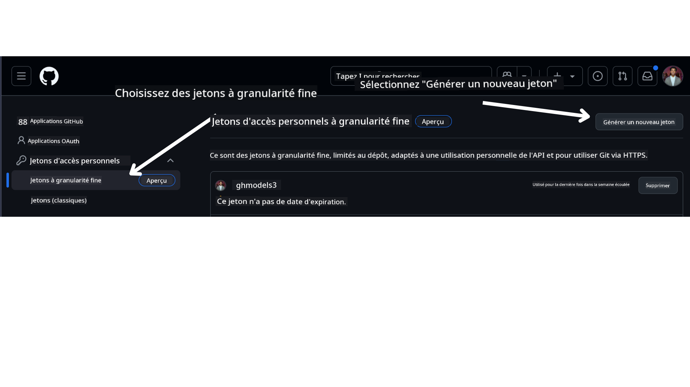

<!--
CO_OP_TRANSLATOR_METADATA:
{
  "original_hash": "76945069b52a49cd0432ae3e0b0ba22e",
  "translation_date": "2025-07-12T07:41:53+00:00",
  "source_file": "00-course-setup/README.md",
  "language_code": "fr"
}
-->
dans votre compte GitHub.

Sélectionnez l'option `Fine-grained tokens` sur le côté gauche de votre écran.

Puis sélectionnez `Generate new token`.



Vous serez invité à entrer un nom pour votre token, à choisir la date d'expiration (Recommandé : 30 jours), et à sélectionner les permissions pour votre token (Dépôts publics).

Il est également nécessaire de modifier les permissions de ce token : Permissions -> Models -> Autorise l'accès aux modèles GitHub

Copiez votre nouveau token que vous venez de créer. Vous allez maintenant l'ajouter à votre fichier `.env` inclus dans ce cours.

### Étape 2 : Créez votre fichier `.env`

Pour créer votre fichier `.env`, exécutez la commande suivante dans votre terminal.

```bash
cp .env.example .env
```

Cela copiera le fichier exemple et créera un fichier `.env` dans votre répertoire où vous pourrez remplir les valeurs des variables d'environnement.

Avec votre token copié, ouvrez le fichier `.env` dans votre éditeur de texte préféré et collez votre token dans le champ `GITHUB_TOKEN`.

Vous devriez maintenant pouvoir exécuter les exemples de code de ce cours.

## Configuration pour les exemples utilisant Azure AI Foundry et Azure AI Agent Service

### Étape 1 : Récupérez le point de terminaison de votre projet Azure

Suivez les étapes pour créer un hub et un projet dans Azure AI Foundry disponibles ici : [Présentation des ressources du hub](https://learn.microsoft.com/en-us/azure/ai-foundry/concepts/ai-resources)

Une fois votre projet créé, vous devrez récupérer la chaîne de connexion de votre projet.

Cela peut être fait en allant sur la page **Overview** de votre projet dans le portail Azure AI Foundry.


### Étape 2 : Créez votre fichier `.env`

Pour créer votre fichier `.env`, exécutez la commande suivante dans votre terminal.

```bash
cp .env.example .env
```

Cela copiera le fichier exemple et créera un fichier `.env` dans votre répertoire où vous pourrez remplir les valeurs des variables d'environnement.

Avec votre token copié, ouvrez le fichier `.env` dans votre éditeur de texte préféré et collez votre token dans le champ `PROJECT_ENDPOINT`.

### Étape 3 : Connectez-vous à Azure

Par mesure de sécurité, nous utiliserons [l'authentification sans clé](https://learn.microsoft.com/azure/developer/ai/keyless-connections?tabs=csharp%2Cazure-cli?WT.mc_id=academic-105485-koreyst) pour s'authentifier auprès d'Azure OpenAI avec Microsoft Entra ID. Avant cela, vous devez d'abord installer l'**Azure CLI** selon les [instructions d'installation](https://learn.microsoft.com/cli/azure/install-azure-cli?WT.mc_id=academic-105485-koreyst) adaptées à votre système d'exploitation.

Ensuite, ouvrez un terminal et exécutez `az login --use-device-code` pour vous connecter à votre compte Azure.

Une fois connecté, sélectionnez votre abonnement dans le terminal.

## Variables d'environnement supplémentaires - Azure Search et Azure OpenAI

Pour la leçon Agentic RAG - Leçon 5 - il existe des exemples qui utilisent Azure Search et Azure OpenAI.

Si vous souhaitez exécuter ces exemples, vous devrez ajouter les variables d'environnement suivantes à votre fichier `.env` :

### Page de présentation (Projet)

- `AZURE_SUBSCRIPTION_ID` - Consultez les **Détails du projet** sur la page **Overview** de votre projet.

- `AZURE_AI_PROJECT_NAME` - Regardez en haut de la page **Overview** de votre projet.

- `AZURE_OPENAI_SERVICE` - Trouvez ceci dans l'onglet **Included capabilities** pour **Azure OpenAI Service** sur la page **Overview**.

### Centre de gestion

- `AZURE_OPENAI_RESOURCE_GROUP` - Allez dans les **Propriétés du projet** sur la page **Overview** du **Centre de gestion**.

- `GLOBAL_LLM_SERVICE` - Sous **Ressources connectées**, trouvez le nom de la connexion **Azure AI Services**. Si non listé, vérifiez dans le **portail Azure** sous votre groupe de ressources pour le nom de la ressource AI Services.

### Page Modèles + Points de terminaison

- `AZURE_OPENAI_EMBEDDING_DEPLOYMENT_NAME` - Sélectionnez votre modèle d'embedding (ex. `text-embedding-ada-002`) et notez le **Nom du déploiement** dans les détails du modèle.

- `AZURE_OPENAI_CHAT_DEPLOYMENT_NAME` - Sélectionnez votre modèle de chat (ex. `gpt-4o-mini`) et notez le **Nom du déploiement** dans les détails du modèle.

### Portail Azure

- `AZURE_OPENAI_ENDPOINT` - Cherchez **Azure AI services**, cliquez dessus, puis allez dans **Gestion des ressources**, **Clés et point de terminaison**, descendez jusqu'aux "Points de terminaison Azure OpenAI" et copiez celui qui indique "Language APIs".

- `AZURE_OPENAI_API_KEY` - Depuis le même écran, copiez la CLÉ 1 ou la CLÉ 2.

- `AZURE_SEARCH_SERVICE_ENDPOINT` - Trouvez votre ressource **Azure AI Search**, cliquez dessus, et consultez la page **Overview**.

- `AZURE_SEARCH_API_KEY` - Ensuite, allez dans **Paramètres** puis **Clés** pour copier la clé d'administration principale ou secondaire.

### Page Web externe

- `AZURE_OPENAI_API_VERSION` - Visitez la page [Cycle de vie des versions API](https://learn.microsoft.com/en-us/azure/ai-services/openai/api-version-deprecation#latest-ga-api-release) sous **Dernière version GA de l'API**.

### Configuration de l'authentification sans clé

Plutôt que de coder en dur vos identifiants, nous utiliserons une connexion sans clé avec Azure OpenAI. Pour cela, nous importerons `DefaultAzureCredential` et appellerons ensuite la fonction `DefaultAzureCredential` pour obtenir les identifiants.

```python
from azure.identity import DefaultAzureCredential, InteractiveBrowserCredential
```

## Bloqué quelque part ?

Si vous rencontrez des problèmes pour configurer cet environnement, rejoignez notre

ou

.

## Leçon suivante

Vous êtes maintenant prêt à exécuter le code de ce cours. Bon apprentissage dans le monde des Agents IA !

[Introduction aux Agents IA et cas d'utilisation des Agents](../01-intro-to-ai-agents/README.md)

**Avertissement** :  
Ce document a été traduit à l’aide du service de traduction automatique [Co-op Translator](https://github.com/Azure/co-op-translator). Bien que nous nous efforcions d’assurer l’exactitude, veuillez noter que les traductions automatiques peuvent contenir des erreurs ou des inexactitudes. Le document original dans sa langue d’origine doit être considéré comme la source faisant foi. Pour les informations critiques, une traduction professionnelle réalisée par un humain est recommandée. Nous déclinons toute responsabilité en cas de malentendus ou de mauvaises interprétations résultant de l’utilisation de cette traduction.