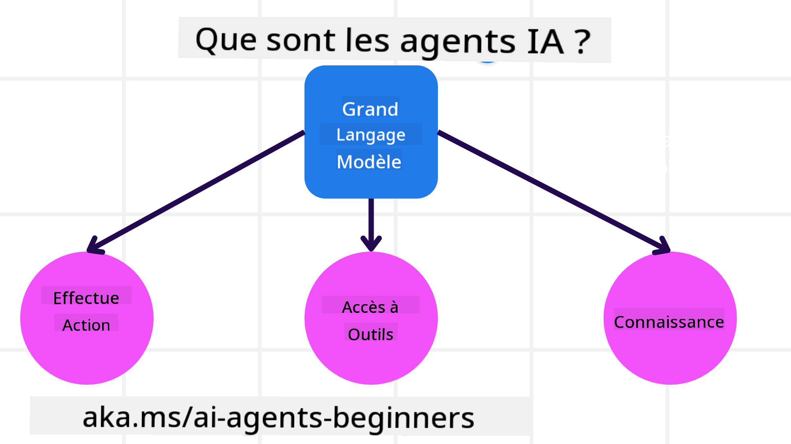
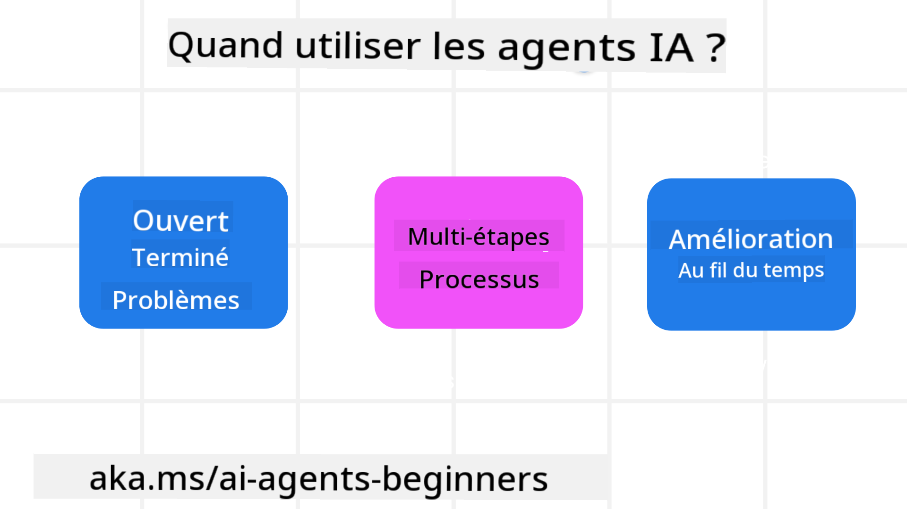

<!--
CO_OP_TRANSLATOR_METADATA:
{
  "original_hash": "1e40fe956ff79462a02a17080b125041",
  "translation_date": "2025-08-28T09:37:03+00:00",
  "source_file": "01-intro-to-ai-agents/README.md",
  "language_code": "fr"
}
-->

> _(Cliquez sur l'image ci-dessus pour visionner la vidéo de cette leçon)_

# Introduction aux agents IA et cas d'utilisation des agents

Bienvenue dans le cours "Agents IA pour débutants" ! Ce cours offre des connaissances fondamentales et des exemples pratiques pour créer des agents IA.

Rejoignez le [Azure AI Foundry Discord](https://aka.ms/ai-agents/discord) pour rencontrer d'autres apprenants et créateurs d'agents IA, et poser toutes vos questions sur ce cours.

Pour commencer ce cours, nous allons mieux comprendre ce que sont les agents IA et comment les utiliser dans les applications et les flux de travail que nous développons.

## Introduction

Cette leçon couvre :

- Qu'est-ce qu'un agent IA et quels sont les différents types d'agents ?
- Quels cas d'utilisation conviennent le mieux aux agents IA et comment peuvent-ils nous aider ?
- Quels sont les éléments de base à prendre en compte lors de la conception de solutions basées sur des agents ?

## Objectifs d'apprentissage

Après avoir terminé cette leçon, vous devriez être capable de :

- Comprendre les concepts des agents IA et en quoi ils diffèrent des autres solutions IA.
- Utiliser les agents IA de manière efficace.
- Concevoir des solutions basées sur des agents de manière productive pour les utilisateurs et les clients.

## Définir les agents IA et les types d'agents IA

### Qu'est-ce qu'un agent IA ?

Les agents IA sont des **systèmes** qui permettent aux **modèles de langage étendus (LLMs)** de **réaliser des actions** en étendant leurs capacités grâce à l'accès à des **outils** et des **connaissances**.

Décomposons cette définition en parties plus petites :

- **Système** - Il est important de considérer les agents non pas comme un simple composant, mais comme un système composé de plusieurs éléments. À un niveau basique, les composants d'un agent IA sont :
  - **Environnement** - L'espace défini où l'agent IA opère. Par exemple, si nous avons un agent de réservation de voyages, l'environnement pourrait être le système de réservation utilisé par l'agent pour accomplir ses tâches.
  - **Capteurs** - Les environnements fournissent des informations et des retours. Les agents IA utilisent des capteurs pour recueillir et interpréter ces informations sur l'état actuel de l'environnement. Dans l'exemple de l'agent de réservation de voyages, le système de réservation peut fournir des informations telles que la disponibilité des hôtels ou les prix des vols.
  - **Actionneurs** - Une fois que l'agent IA reçoit l'état actuel de l'environnement, il détermine l'action à effectuer pour modifier cet environnement. Pour l'agent de réservation de voyages, cela pourrait être de réserver une chambre disponible pour l'utilisateur.

**Modèles de langage étendus** - Le concept d'agents existait avant la création des LLMs. L'avantage de construire des agents IA avec des LLMs réside dans leur capacité à interpréter le langage humain et les données. Cette capacité permet aux LLMs d'interpréter les informations environnementales et de définir un plan pour modifier l'environnement.

**Réaliser des actions** - En dehors des systèmes d'agents IA, les LLMs sont limités à des situations où l'action consiste à générer du contenu ou des informations en fonction de la demande de l'utilisateur. Dans les systèmes d'agents IA, les LLMs peuvent accomplir des tâches en interprétant la demande de l'utilisateur et en utilisant les outils disponibles dans leur environnement.

**Accès aux outils** - Les outils auxquels le LLM a accès sont définis par 1) l'environnement dans lequel il opère et 2) le développeur de l'agent IA. Dans notre exemple d'agent de voyage, les outils de l'agent sont limités par les opérations disponibles dans le système de réservation, et/ou le développeur peut limiter l'accès de l'agent aux outils liés aux vols.

**Mémoire + Connaissances** - La mémoire peut être à court terme dans le contexte de la conversation entre l'utilisateur et l'agent. À long terme, en dehors des informations fournies par l'environnement, les agents IA peuvent également récupérer des connaissances provenant d'autres systèmes, services, outils, et même d'autres agents. Dans l'exemple de l'agent de voyage, ces connaissances pourraient inclure les préférences de voyage de l'utilisateur stockées dans une base de données client.

### Les différents types d'agents

Maintenant que nous avons une définition générale des agents IA, examinons certains types spécifiques d'agents et comment ils pourraient être appliqués à un agent de réservation de voyages.

| **Type d'agent**              | **Description**                                                                                                                       | **Exemple**                                                                                                                                                                                                                   |
| ----------------------------- | ------------------------------------------------------------------------------------------------------------------------------------- | ----------------------------------------------------------------------------------------------------------------------------------------------------------------------------------------------------------------------------- |
| **Agents réflexes simples**   | Effectuent des actions immédiates basées sur des règles prédéfinies.                                                                  | L'agent de voyage interprète le contexte d'un email et transfère les plaintes liées aux voyages au service client.                                                                                                            |
| **Agents réflexes basés sur un modèle** | Effectuent des actions basées sur un modèle du monde et les changements apportés à ce modèle.                                      | L'agent de voyage priorise les itinéraires avec des changements significatifs de prix en se basant sur l'accès à des données historiques de tarification.                                                                     |
| **Agents basés sur des objectifs** | Créent des plans pour atteindre des objectifs spécifiques en interprétant l'objectif et en déterminant les actions nécessaires pour y parvenir. | L'agent de voyage organise un trajet en déterminant les arrangements nécessaires (voiture, transport public, vols) depuis le lieu actuel jusqu'à la destination.                                                              |
| **Agents basés sur l'utilité** | Prennent en compte les préférences et évaluent les compromis numériquement pour déterminer comment atteindre les objectifs.            | L'agent de voyage maximise l'utilité en évaluant la commodité par rapport au coût lors de la réservation de voyages.                                                                                                         |
| **Agents apprenants**         | S'améliorent avec le temps en répondant aux retours et en ajustant leurs actions en conséquence.                                       | L'agent de voyage s'améliore en utilisant les retours des clients issus des enquêtes post-voyage pour ajuster les futures réservations.                                                                                      |
| **Agents hiérarchiques**      | Comportent plusieurs agents dans un système en tiers, où les agents de niveau supérieur divisent les tâches en sous-tâches pour les agents de niveau inférieur. | L'agent de voyage annule un voyage en divisant la tâche en sous-tâches (par exemple, annuler des réservations spécifiques) et en demandant aux agents de niveau inférieur de les accomplir, tout en rapportant au niveau supérieur. |
| **Systèmes multi-agents (MAS)** | Les agents accomplissent des tâches de manière indépendante, soit de manière coopérative, soit compétitive.                          | Coopératif : Plusieurs agents réservent des services spécifiques tels que des hôtels, des vols et des divertissements. Compétitif : Plusieurs agents gèrent et se disputent un calendrier de réservation d'hôtel partagé pour réserver des clients. |

## Quand utiliser les agents IA

Dans la section précédente, nous avons utilisé le cas d'utilisation de l'agent de voyage pour expliquer comment les différents types d'agents peuvent être utilisés dans divers scénarios de réservation de voyages. Nous continuerons à utiliser cette application tout au long du cours.

Examinons les types de cas d'utilisation pour lesquels les agents IA sont les mieux adaptés :

- **Problèmes ouverts** - Permettre au LLM de déterminer les étapes nécessaires pour accomplir une tâche, car cela ne peut pas toujours être codé en dur dans un flux de travail.
- **Processus en plusieurs étapes** - Tâches nécessitant un niveau de complexité où l'agent IA doit utiliser des outils ou des informations sur plusieurs interactions au lieu d'une récupération en une seule fois.
- **Amélioration au fil du temps** - Tâches où l'agent peut s'améliorer avec le temps en recevant des retours de son environnement ou des utilisateurs afin de fournir une meilleure utilité.

Nous abordons davantage les considérations liées à l'utilisation des agents IA dans la leçon sur la création d'agents IA fiables.

## Bases des solutions basées sur des agents

### Développement d'agents

La première étape pour concevoir un système d'agent IA est de définir les outils, actions et comportements. Dans ce cours, nous nous concentrons sur l'utilisation du **service Azure AI Agent** pour définir nos agents. Il offre des fonctionnalités telles que :

- La sélection de modèles ouverts tels que OpenAI, Mistral et Llama
- L'utilisation de données sous licence via des fournisseurs comme Tripadvisor
- L'utilisation d'outils standardisés OpenAPI 3.0

### Modèles basés sur des agents

La communication avec les LLMs se fait via des invites. Étant donné la nature semi-autonome des agents IA, il n'est pas toujours possible ou nécessaire de reformuler manuellement l'invite après un changement dans l'environnement. Nous utilisons des **modèles basés sur des agents** qui permettent de formuler des invites au LLM sur plusieurs étapes de manière plus évolutive.

Ce cours est divisé en plusieurs modèles basés sur des agents populaires.

### Cadres basés sur des agents

Les cadres basés sur des agents permettent aux développeurs de mettre en œuvre des modèles basés sur des agents via du code. Ces cadres offrent des modèles, des plugins et des outils pour une meilleure collaboration entre agents IA. Ces avantages permettent une meilleure observabilité et un dépannage des systèmes d'agents IA.

Dans ce cours, nous explorerons le cadre AutoGen basé sur la recherche et le cadre Agent prêt pour la production de Semantic Kernel.

### Vous avez d'autres questions sur les agents IA ?

Rejoignez le [Azure AI Foundry Discord](https://aka.ms/ai-agents/discord) pour rencontrer d'autres apprenants, assister à des heures de bureau et obtenir des réponses à vos questions sur les agents IA.

## Leçon précédente

[Configuration du cours](../00-course-setup/README.md)

## Leçon suivante

[Explorer les cadres basés sur des agents](../02-explore-agentic-frameworks/README.md)

---

**Avertissement** :  
Ce document a été traduit à l'aide du service de traduction automatique [Co-op Translator](https://github.com/Azure/co-op-translator). Bien que nous nous efforcions d'assurer l'exactitude, veuillez noter que les traductions automatisées peuvent contenir des erreurs ou des inexactitudes. Le document original dans sa langue d'origine doit être considéré comme la source faisant autorité. Pour des informations critiques, il est recommandé de faire appel à une traduction humaine professionnelle. Nous déclinons toute responsabilité en cas de malentendus ou d'interprétations erronées résultant de l'utilisation de cette traduction.