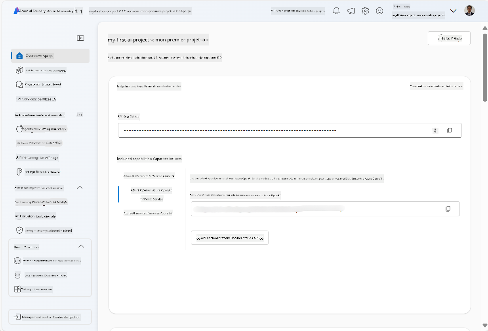
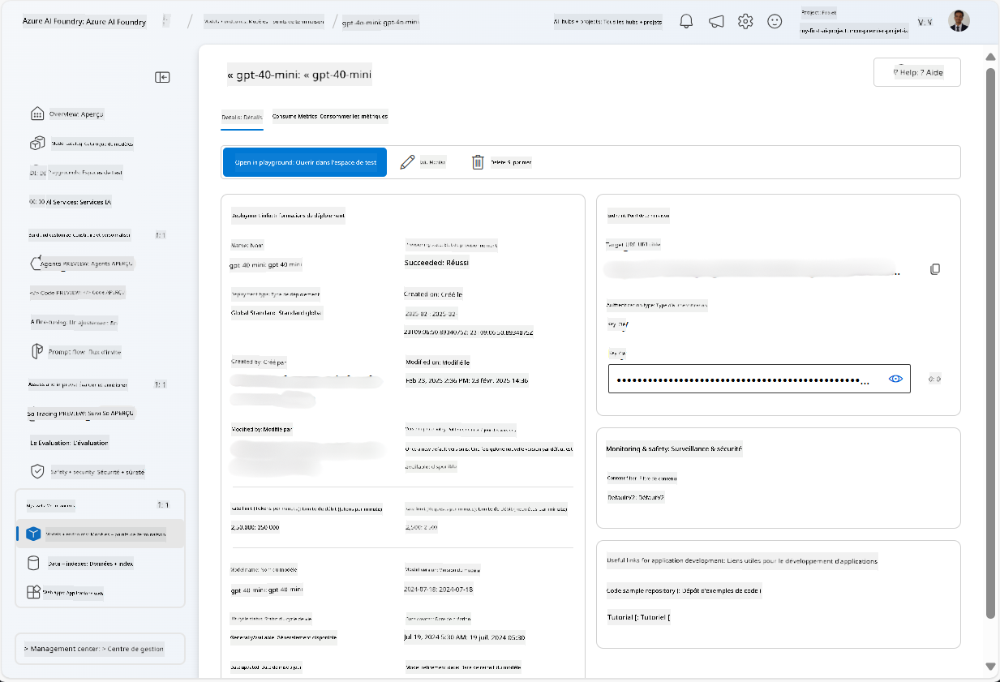
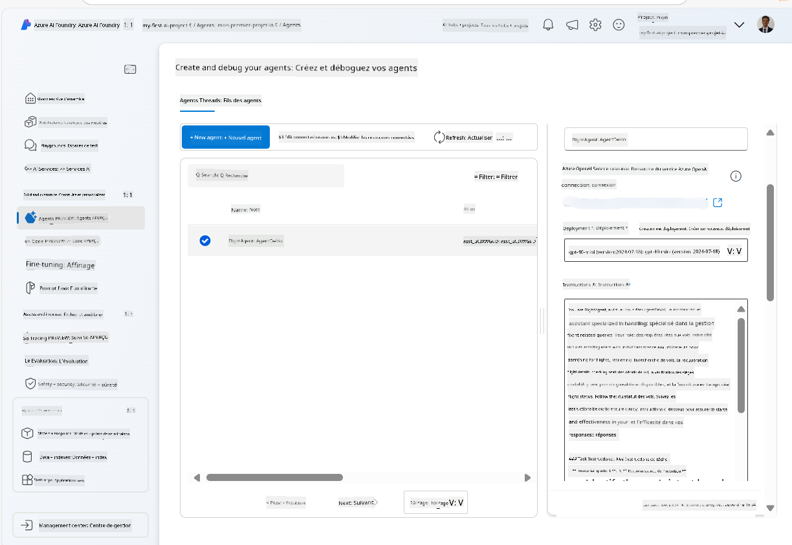
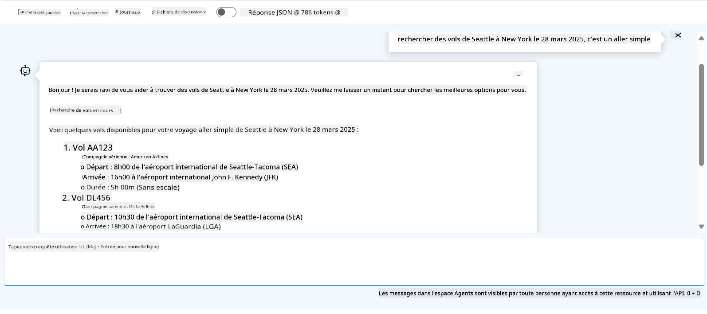

<!--
CO_OP_TRANSLATOR_METADATA:
{
  "original_hash": "7e92870dc0843e13d4dabc620c09d2d9",
  "translation_date": "2025-07-12T08:14:34+00:00",
  "source_file": "02-explore-agentic-frameworks/azure-ai-foundry-agent-creation.md",
  "language_code": "fr"
}
-->
# Développement du service Azure AI Agent

Dans cet exercice, vous utilisez les outils du service Azure AI Agent dans le [portail Azure AI Foundry](https://ai.azure.com/?WT.mc_id=academic-105485-koreyst) pour créer un agent de réservation de vols. Cet agent pourra interagir avec les utilisateurs et fournir des informations sur les vols.

## Prérequis

Pour réaliser cet exercice, vous avez besoin de :
1. Un compte Azure avec un abonnement actif. [Créez un compte gratuitement](https://azure.microsoft.com/free/?WT.mc_id=academic-105485-koreyst).
2. Les autorisations nécessaires pour créer un hub Azure AI Foundry ou qu’un hub soit créé pour vous.
    - Si votre rôle est Contributeur ou Propriétaire, vous pouvez suivre les étapes de ce tutoriel.

## Créer un hub Azure AI Foundry

> **Note :** Azure AI Foundry était auparavant connu sous le nom d’Azure AI Studio.

1. Suivez ces instructions du billet de blog [Azure AI Foundry](https://learn.microsoft.com/en-us/azure/ai-studio/?WT.mc_id=academic-105485-koreyst) pour créer un hub Azure AI Foundry.
2. Une fois votre projet créé, fermez les conseils affichés et consultez la page du projet dans le portail Azure AI Foundry, qui devrait ressembler à l’image suivante :

    

## Déployer un modèle

1. Dans le volet de gauche de votre projet, dans la section **My assets**, sélectionnez la page **Models + endpoints**.
2. Sur la page **Models + endpoints**, dans l’onglet **Model deployments**, dans le menu **+ Deploy model**, choisissez **Deploy base model**.
3. Recherchez le modèle `gpt-4o-mini` dans la liste, puis sélectionnez-le et confirmez.

    > **Note** : Réduire le TPM permet d’éviter de dépasser le quota disponible dans l’abonnement que vous utilisez.

    

## Créer un agent

Maintenant que vous avez déployé un modèle, vous pouvez créer un agent. Un agent est un modèle d’IA conversationnelle qui peut interagir avec les utilisateurs.

1. Dans le volet de gauche de votre projet, dans la section **Build & Customize**, sélectionnez la page **Agents**.
2. Cliquez sur **+ Create agent** pour créer un nouvel agent. Dans la boîte de dialogue **Agent Setup** :
    - Saisissez un nom pour l’agent, par exemple `FlightAgent`.
    - Assurez-vous que le déploiement du modèle `gpt-4o-mini` que vous avez créé précédemment est sélectionné.
    - Définissez les **Instructions** selon le prompt que vous souhaitez que l’agent suive. Voici un exemple :
    ```
    You are FlightAgent, a virtual assistant specialized in handling flight-related queries. Your role includes assisting users with searching for flights, retrieving flight details, checking seat availability, and providing real-time flight status. Follow the instructions below to ensure clarity and effectiveness in your responses:

    ### Task Instructions:
    1. **Recognizing Intent**:
       - Identify the user's intent based on their request, focusing on one of the following categories:
         - Searching for flights
         - Retrieving flight details using a flight ID
         - Checking seat availability for a specified flight
         - Providing real-time flight status using a flight number
       - If the intent is unclear, politely ask users to clarify or provide more details.
        
    2. **Processing Requests**:
        - Depending on the identified intent, perform the required task:
        - For flight searches: Request details such as origin, destination, departure date, and optionally return date.
        - For flight details: Request a valid flight ID.
        - For seat availability: Request the flight ID and date and validate inputs.
        - For flight status: Request a valid flight number.
        - Perform validations on provided data (e.g., formats of dates, flight numbers, or IDs). If the information is incomplete or invalid, return a friendly request for clarification.

    3. **Generating Responses**:
    - Use a tone that is friendly, concise, and supportive.
    - Provide clear and actionable suggestions based on the output of each task.
    - If no data is found or an error occurs, explain it to the user gently and offer alternative actions (e.g., refine search, try another query).
    
    ```
> [!NOTE]
> Pour un prompt détaillé, vous pouvez consulter [ce dépôt](https://github.com/ShivamGoyal03/RoamMind) pour plus d’informations.
    
> De plus, vous pouvez ajouter une **Base de connaissances** et des **Actions** pour améliorer les capacités de l’agent à fournir plus d’informations et à effectuer des tâches automatisées selon les demandes des utilisateurs. Pour cet exercice, vous pouvez passer ces étapes.
    


3. Pour créer un nouvel agent multi-IA, cliquez simplement sur **New Agent**. L’agent nouvellement créé s’affichera alors sur la page Agents.

## Tester l’agent

Après avoir créé l’agent, vous pouvez le tester pour voir comment il répond aux requêtes des utilisateurs dans le playground du portail Azure AI Foundry.

1. En haut du volet **Setup** de votre agent, sélectionnez **Try in playground**.
2. Dans le volet **Playground**, vous pouvez interagir avec l’agent en tapant des requêtes dans la fenêtre de chat. Par exemple, vous pouvez demander à l’agent de rechercher des vols de Seattle à New York le 28.

    > **Note** : L’agent peut ne pas fournir de réponses précises, car aucune donnée en temps réel n’est utilisée dans cet exercice. L’objectif est de tester la capacité de l’agent à comprendre et répondre aux requêtes des utilisateurs selon les instructions fournies.

    

3. Après avoir testé l’agent, vous pouvez le personnaliser davantage en ajoutant plus d’intentions, de données d’entraînement et d’actions pour améliorer ses capacités.

## Nettoyer les ressources

Une fois que vous avez terminé de tester l’agent, vous pouvez le supprimer pour éviter des coûts supplémentaires.
1. Ouvrez le [portail Azure](https://portal.azure.com) et consultez le contenu du groupe de ressources où vous avez déployé les ressources du hub utilisées dans cet exercice.
2. Dans la barre d’outils, sélectionnez **Delete resource group**.
3. Saisissez le nom du groupe de ressources et confirmez la suppression.

## Ressources

- [Documentation Azure AI Foundry](https://learn.microsoft.com/en-us/azure/ai-studio/?WT.mc_id=academic-105485-koreyst)
- [Portail Azure AI Foundry](https://ai.azure.com/?WT.mc_id=academic-105485-koreyst)
- [Premiers pas avec Azure AI Studio](https://techcommunity.microsoft.com/blog/educatordeveloperblog/getting-started-with-azure-ai-studio/4095602?WT.mc_id=academic-105485-koreyst)
- [Fondamentaux des agents IA sur Azure](https://learn.microsoft.com/en-us/training/modules/ai-agent-fundamentals/?WT.mc_id=academic-105485-koreyst)
- [Azure AI Discord](https://aka.ms/AzureAI/Discord)

**Avertissement** :  
Ce document a été traduit à l’aide du service de traduction automatique [Co-op Translator](https://github.com/Azure/co-op-translator). Bien que nous nous efforcions d’assurer l’exactitude, veuillez noter que les traductions automatiques peuvent contenir des erreurs ou des inexactitudes. Le document original dans sa langue d’origine doit être considéré comme la source faisant foi. Pour les informations critiques, une traduction professionnelle réalisée par un humain est recommandée. Nous déclinons toute responsabilité en cas de malentendus ou de mauvaises interprétations résultant de l’utilisation de cette traduction.