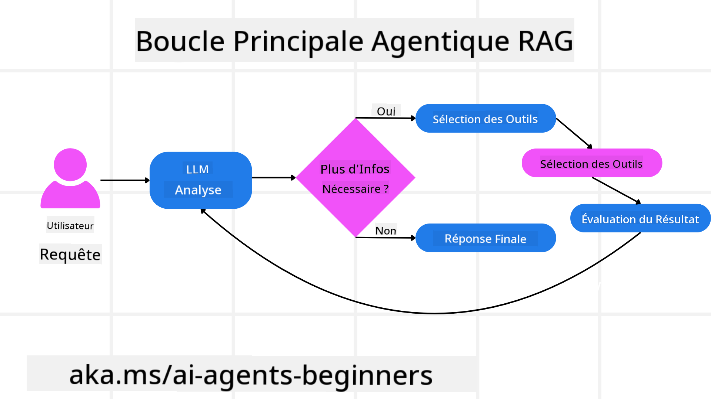
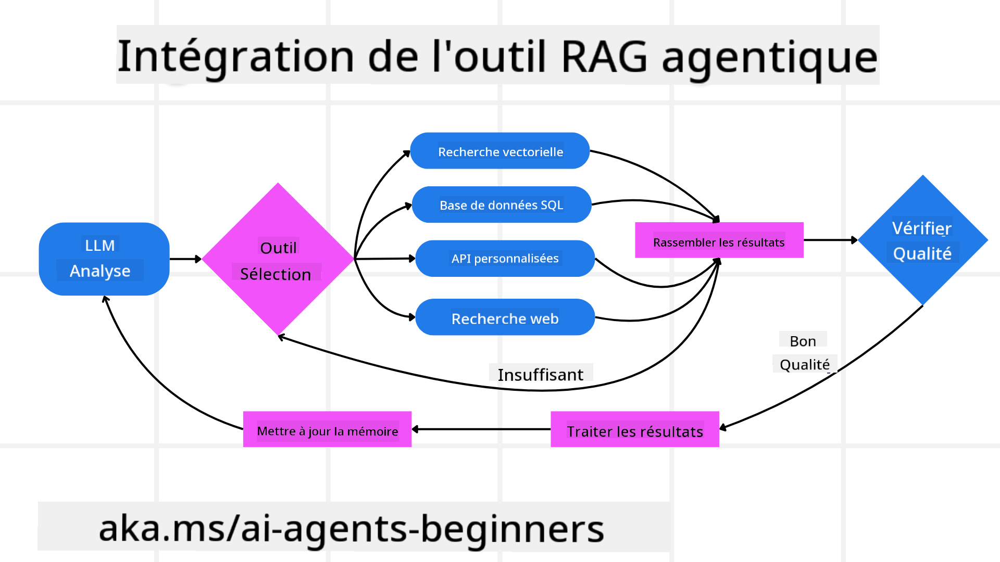
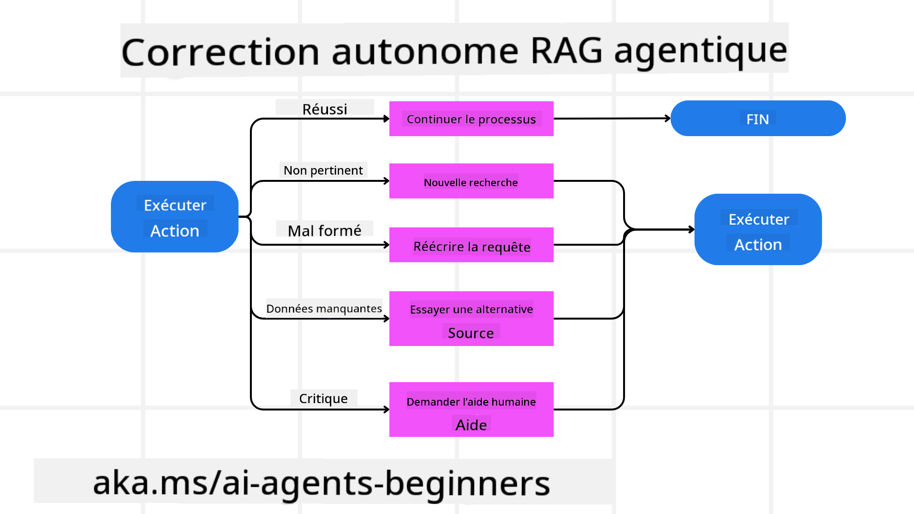
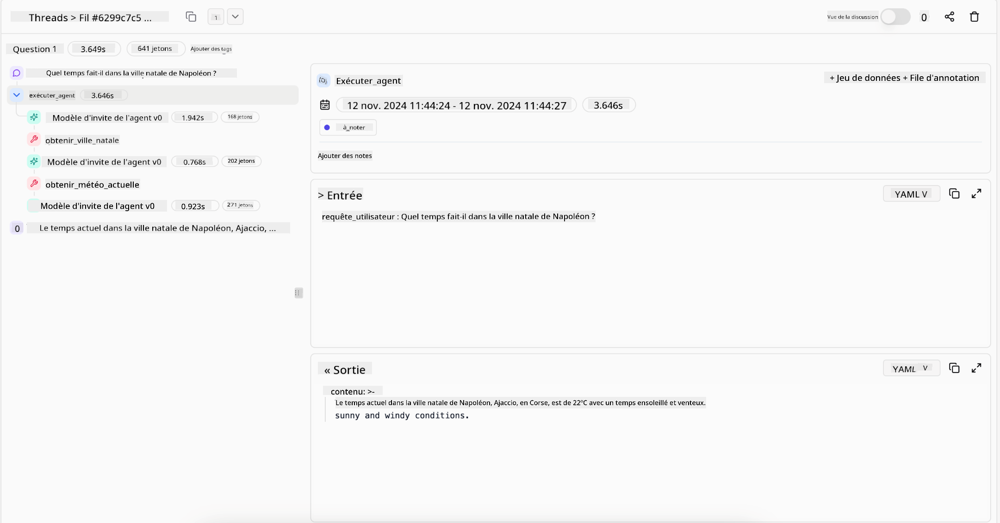

<!--
CO_OP_TRANSLATOR_METADATA:
{
  "original_hash": "d2f04b783b9e1253100329afd698f8ff",
  "translation_date": "2025-08-28T09:45:19+00:00",
  "source_file": "05-agentic-rag/README.md",
  "language_code": "fr"
}
-->

> _(Cliquez sur l'image ci-dessus pour voir la vidéo de cette leçon)_

# Agentic RAG

Cette leçon offre une vue d'ensemble complète de l'Agentic Retrieval-Augmented Generation (Agentic RAG), un paradigme émergent de l'IA où les grands modèles de langage (LLMs) planifient de manière autonome leurs prochaines étapes tout en récupérant des informations provenant de sources externes. Contrairement aux modèles statiques de récupération puis lecture, Agentic RAG implique des appels itératifs au LLM, entrecoupés d'appels à des outils ou fonctions et de sorties structurées. Le système évalue les résultats, affine les requêtes, invoque des outils supplémentaires si nécessaire, et poursuit ce cycle jusqu'à ce qu'une solution satisfaisante soit obtenue.

## Introduction

Cette leçon couvrira :

- **Comprendre Agentic RAG :** Découvrez ce paradigme émergent de l'IA où les grands modèles de langage (LLMs) planifient de manière autonome leurs prochaines étapes tout en récupérant des informations provenant de sources externes.
- **Saisir le style itératif Maker-Checker :** Comprenez le cycle d'appels itératifs au LLM, entrecoupés d'appels à des outils ou fonctions et de sorties structurées, conçu pour améliorer la précision et gérer les requêtes malformées.
- **Explorer les applications pratiques :** Identifiez les scénarios où Agentic RAG excelle, tels que les environnements axés sur la précision, les interactions complexes avec des bases de données et les flux de travail étendus.

## Objectifs d'apprentissage

Après avoir terminé cette leçon, vous saurez comment/comprendre :

- **Comprendre Agentic RAG :** Découvrez ce paradigme émergent de l'IA où les grands modèles de langage (LLMs) planifient de manière autonome leurs prochaines étapes tout en récupérant des informations provenant de sources externes.
- **Style itératif Maker-Checker :** Saisissez le concept d'un cycle d'appels itératifs au LLM, entrecoupés d'appels à des outils ou fonctions et de sorties structurées, conçu pour améliorer la précision et gérer les requêtes malformées.
- **Appropriation du processus de raisonnement :** Comprenez la capacité du système à s'approprier son processus de raisonnement, en prenant des décisions sur la manière d'aborder les problèmes sans dépendre de chemins prédéfinis.
- **Flux de travail :** Comprenez comment un modèle agentique décide de manière autonome de récupérer des rapports sur les tendances du marché, d'identifier des données sur les concurrents, de corréler des métriques internes de ventes, de synthétiser les résultats et d'évaluer la stratégie.
- **Boucles itératives, intégration d'outils et mémoire :** Découvrez la dépendance du système à un modèle d'interaction en boucle, en maintenant l'état et la mémoire à travers les étapes pour éviter les boucles répétitives et prendre des décisions éclairées.
- **Gestion des modes d'échec et auto-correction :** Explorez les mécanismes robustes d'auto-correction du système, y compris l'itération et la re-requête, l'utilisation d'outils de diagnostic et le recours à la supervision humaine.
- **Limites de l'autonomie :** Comprenez les limites d'Agentic RAG, en mettant l'accent sur l'autonomie spécifique au domaine, la dépendance à l'infrastructure et le respect des garde-fous.
- **Cas d'utilisation pratiques et valeur :** Identifiez les scénarios où Agentic RAG excelle, tels que les environnements axés sur la précision, les interactions complexes avec des bases de données et les flux de travail étendus.
- **Gouvernance, transparence et confiance :** Découvrez l'importance de la gouvernance et de la transparence, y compris le raisonnement explicable, le contrôle des biais et la supervision humaine.

## Qu'est-ce qu'Agentic RAG ?

Agentic Retrieval-Augmented Generation (Agentic RAG) est un paradigme émergent de l'IA où les grands modèles de langage (LLMs) planifient de manière autonome leurs prochaines étapes tout en récupérant des informations provenant de sources externes. Contrairement aux modèles statiques de récupération puis lecture, Agentic RAG implique des appels itératifs au LLM, entrecoupés d'appels à des outils ou fonctions et de sorties structurées. Le système évalue les résultats, affine les requêtes, invoque des outils supplémentaires si nécessaire, et poursuit ce cycle jusqu'à ce qu'une solution satisfaisante soit obtenue.

Le système s'approprie activement son processus de raisonnement, réécrit les requêtes échouées, choisit différentes méthodes de récupération et intègre plusieurs outils—tels que la recherche vectorielle dans Azure AI Search, des bases de données SQL ou des API personnalisées—avant de finaliser sa réponse. La qualité distinctive d'un système agentique est sa capacité à s'approprier son processus de raisonnement. Les implémentations traditionnelles de RAG reposent sur des chemins prédéfinis, mais un système agentique détermine de manière autonome la séquence des étapes en fonction de la qualité des informations qu'il trouve.

## Définir Agentic Retrieval-Augmented Generation (Agentic RAG)

Agentic Retrieval-Augmented Generation (Agentic RAG) est un paradigme émergent dans le développement de l'IA où les LLMs ne se contentent pas de récupérer des informations provenant de sources de données externes, mais planifient également leurs prochaines étapes de manière autonome. Contrairement aux modèles statiques de récupération puis lecture ou aux séquences de prompts soigneusement scriptées, Agentic RAG implique un cycle d'appels itératifs au LLM, entrecoupés d'appels à des outils ou fonctions et de sorties structurées. À chaque étape, le système évalue les résultats obtenus, décide s'il doit affiner ses requêtes, invoque des outils supplémentaires si nécessaire, et poursuit ce cycle jusqu'à ce qu'il atteigne une solution satisfaisante.

Ce style itératif “maker-checker” est conçu pour améliorer la précision, gérer les requêtes malformées vers des bases de données structurées (par exemple NL2SQL), et garantir des résultats équilibrés et de haute qualité. Plutôt que de s'appuyer uniquement sur des chaînes de prompts soigneusement conçues, le système s'approprie activement son processus de raisonnement. Il peut réécrire des requêtes échouées, choisir différentes méthodes de récupération et intégrer plusieurs outils—tels que la recherche vectorielle dans Azure AI Search, des bases de données SQL ou des API personnalisées—avant de finaliser sa réponse. Cela élimine le besoin de cadres d'orchestration excessivement complexes. À la place, une boucle relativement simple de “appel LLM → utilisation d'outil → appel LLM → …” peut produire des sorties sophistiquées et bien fondées.

## Appropriation du processus de raisonnement

La qualité distinctive qui rend un système “agentique” est sa capacité à s'approprier son processus de raisonnement. Les implémentations traditionnelles de RAG dépendent souvent des humains pour prédéfinir un chemin pour le modèle : une chaîne de pensée qui décrit quoi récupérer et quand. Mais lorsqu'un système est véritablement agentique, il décide en interne comment aborder le problème. Il ne se contente pas d'exécuter un script ; il détermine de manière autonome la séquence des étapes en fonction de la qualité des informations qu'il trouve.

Par exemple, s'il est demandé de créer une stratégie de lancement de produit, il ne se repose pas uniquement sur un prompt qui détaille tout le flux de travail de recherche et de prise de décision. À la place, le modèle agentique décide de manière autonome de :

1. Récupérer des rapports sur les tendances actuelles du marché en utilisant Bing Web Grounding.
2. Identifier des données pertinentes sur les concurrents en utilisant Azure AI Search.
3. Corréler des métriques internes historiques de ventes en utilisant Azure SQL Database.
4. Synthétiser les résultats dans une stratégie cohérente orchestrée via Azure OpenAI Service.
5. Évaluer la stratégie pour détecter des lacunes ou incohérences, en lançant une nouvelle série de récupérations si nécessaire.

Toutes ces étapes—affiner les requêtes, choisir les sources, itérer jusqu'à être “satisfait” de la réponse—sont décidées par le modèle, et non prédéfinies par un humain.

## Boucles itératives, intégration d'outils et mémoire

Un système agentique repose sur un modèle d'interaction en boucle :

- **Appel initial :** L'objectif de l'utilisateur (alias prompt utilisateur) est présenté au LLM.
- **Invocation d'outils :** Si le modèle identifie des informations manquantes ou des instructions ambiguës, il sélectionne un outil ou une méthode de récupération—comme une requête de base de données vectorielle (par exemple recherche hybride Azure AI Search sur des données privées) ou un appel SQL structuré—pour rassembler plus de contexte.
- **Évaluation et affinage :** Après avoir examiné les données retournées, le modèle décide si les informations sont suffisantes. Sinon, il affine la requête, essaie un outil différent ou ajuste son approche.
- **Répéter jusqu'à satisfaction :** Ce cycle continue jusqu'à ce que le modèle détermine qu'il dispose de suffisamment de clarté et de preuves pour fournir une réponse finale bien raisonnée.
- **Mémoire et état :** Comme le système maintient l'état et la mémoire à travers les étapes, il peut se rappeler des tentatives précédentes et de leurs résultats, évitant les boucles répétitives et prenant des décisions plus éclairées au fur et à mesure.

Avec le temps, cela crée un sentiment de compréhension évolutive, permettant au modèle de naviguer dans des tâches complexes et multi-étapes sans nécessiter une intervention humaine constante ou une reformulation du prompt.

## Gestion des modes d'échec et auto-correction

L'autonomie d'Agentic RAG implique également des mécanismes robustes d'auto-correction. Lorsque le système rencontre des impasses—comme récupérer des documents non pertinents ou rencontrer des requêtes malformées—il peut :

- **Itérer et re-requêter :** Au lieu de fournir des réponses de faible valeur, le modèle tente de nouvelles stratégies de recherche, réécrit des requêtes de base de données ou examine des ensembles de données alternatifs.
- **Utiliser des outils de diagnostic :** Le système peut invoquer des fonctions supplémentaires conçues pour l'aider à déboguer ses étapes de raisonnement ou confirmer la précision des données récupérées. Des outils comme Azure AI Tracing seront importants pour permettre une observabilité et un suivi robustes.
- **Recourir à la supervision humaine :** Pour les scénarios critiques ou échouant de manière répétée, le modèle peut signaler une incertitude et demander une orientation humaine. Une fois que l'humain fournit un retour correctif, le modèle peut intégrer cette leçon pour l'avenir.

Cette approche itérative et dynamique permet au modèle de s'améliorer continuellement, garantissant qu'il ne s'agit pas seulement d'un système à usage unique, mais d'un système qui apprend de ses erreurs au cours d'une session donnée.

## Limites de l'autonomie

Malgré son autonomie dans une tâche, Agentic RAG n'est pas analogue à une intelligence artificielle générale. Ses capacités “agentiques” sont limitées aux outils, sources de données et politiques fournies par les développeurs humains. Il ne peut pas inventer ses propres outils ni sortir des limites du domaine qui lui ont été fixées. À la place, il excelle dans l'orchestration dynamique des ressources disponibles.

Les différences clés par rapport à des formes d'IA plus avancées incluent :

1. **Autonomie spécifique au domaine :** Les systèmes Agentic RAG sont axés sur l'atteinte d'objectifs définis par l'utilisateur dans un domaine connu, en employant des stratégies telles que la réécriture de requêtes ou la sélection d'outils pour améliorer les résultats.
2. **Dépendance à l'infrastructure :** Les capacités du système dépendent des outils et des données intégrés par les développeurs. Il ne peut pas dépasser ces limites sans intervention humaine.
3. **Respect des garde-fous :** Les directives éthiques, les règles de conformité et les politiques commerciales restent très importantes. La liberté de l'agent est toujours contrainte par des mesures de sécurité et des mécanismes de supervision (espérons-le ?).

## Cas d'utilisation pratiques et valeur

Agentic RAG excelle dans les scénarios nécessitant un raffinement itératif et une précision :

1. **Environnements axés sur la précision :** Dans les vérifications de conformité, l'analyse réglementaire ou la recherche juridique, le modèle agentique peut vérifier les faits à plusieurs reprises, consulter plusieurs sources et réécrire des requêtes jusqu'à produire une réponse soigneusement vérifiée.
2. **Interactions complexes avec des bases de données :** Lorsqu'il s'agit de données structurées où les requêtes échouent souvent ou nécessitent des ajustements, le système peut affiner ses requêtes de manière autonome en utilisant Azure SQL ou Microsoft Fabric OneLake, garantissant que la récupération finale correspond à l'intention de l'utilisateur.
3. **Flux de travail étendus :** Les sessions de longue durée peuvent évoluer à mesure que de nouvelles informations apparaissent. Agentic RAG peut intégrer continuellement de nouvelles données, modifiant ses stratégies à mesure qu'il en apprend davantage sur l'espace problématique.

## Gouvernance, transparence et confiance

À mesure que ces systèmes deviennent plus autonomes dans leur raisonnement, la gouvernance et la transparence sont cruciales :

- **Raisonnement explicable :** Le modèle peut fournir une trace d'audit des requêtes qu'il a effectuées, des sources qu'il a consultées et des étapes de raisonnement qu'il a suivies pour arriver à sa conclusion. Des outils comme Azure AI Content Safety et Azure AI Tracing / GenAIOps peuvent aider à maintenir la transparence et à atténuer les risques.
- **Contrôle des biais et récupération équilibrée :** Les développeurs peuvent ajuster les stratégies de récupération pour garantir que des sources de données équilibrées et représentatives sont prises en compte, et auditer régulièrement les sorties pour détecter des biais ou des modèles déséquilibrés en utilisant des modèles personnalisés pour des organisations avancées de science des données avec Azure Machine Learning.
- **Supervision humaine et conformité :** Pour les tâches sensibles, la révision humaine reste essentielle. Agentic RAG ne remplace pas le jugement humain dans les décisions critiques—il l'augmente en fournissant des options plus soigneusement vérifiées.

Disposer d'outils qui fournissent un enregistrement clair des actions est essentiel. Sans eux, déboguer un processus multi-étapes peut être très difficile. Voir l'exemple suivant de Literal AI (entreprise derrière Chainlit) pour une exécution d'agent :

## Conclusion

Agentic RAG représente une évolution naturelle dans la manière dont les systèmes d'IA gèrent des tâches complexes et intensives en données. En adoptant un modèle d'interaction en boucle, en sélectionnant des outils de manière autonome et en affinant les requêtes jusqu'à obtenir un résultat de haute qualité, le système dépasse le suivi statique des prompts pour devenir un décideur plus adaptatif et conscient du contexte. Bien qu'il reste limité par les infrastructures définies par les humains et les directives éthiques, ces capacités agentiques permettent des interactions IA plus riches, dynamiques et, en fin de compte, plus utiles pour les entreprises et les utilisateurs finaux.

### Vous avez d'autres questions sur Agentic RAG ?

Rejoignez le [Discord Azure AI Foundry](https://aka.ms/ai-agents/discord) pour rencontrer d'autres apprenants, assister à des heures de bureau et obtenir des réponses à vos questions sur les agents IA.

## Ressources supplémentaires

-
<a href="https://learn.microsoft.com/training/modules/use-own-data-azure-openai" target="_blank">
Implémenter la génération augmentée par récupération (RAG) avec Azure OpenAI Service : Apprenez à utiliser vos propres données avec Azure OpenAI Service. Ce module Microsoft Learn fournit un guide complet sur la mise en œuvre de RAG.  
- <a href="https://learn.microsoft.com/azure/ai-studio/concepts/evaluation-approach-gen-ai" target="_blank">Évaluation des applications d'IA générative avec Azure AI Foundry : Cet article traite de l'évaluation et de la comparaison des modèles sur des ensembles de données publics, y compris les applications d'IA agentique et les architectures RAG</a>  
- <a href="https://weaviate.io/blog/what-is-agentic-rag" target="_blank">Qu'est-ce que l'Agentic RAG | Weaviate</a>  
- <a href="https://ragaboutit.com/agentic-rag-a-complete-guide-to-agent-based-retrieval-augmented-generation/" target="_blank">Agentic RAG : Un guide complet sur la génération augmentée par récupération basée sur des agents – Actualités sur la génération RAG</a>  
- <a href="https://huggingface.co/learn/cookbook/agent_rag" target="_blank">Agentic RAG : boostez votre RAG avec la reformulation de requêtes et l'auto-interrogation ! Hugging Face Open-Source AI Cookbook</a>  
- <a href="https://youtu.be/aQ4yQXeB1Ss?si=2HUqBzHoeB5tR04U" target="_blank">Ajouter des couches agentiques à RAG</a>  
- <a href="https://www.youtube.com/watch?v=zeAyuLc_f3Q&t=244s" target="_blank">L'avenir des assistants de connaissances : Jerry Liu</a>  
- <a href="https://www.youtube.com/watch?v=AOSjiXP1jmQ" target="_blank">Comment construire des systèmes Agentic RAG</a>  
- <a href="https://ignite.microsoft.com/sessions/BRK102?source=sessions" target="_blank">Utiliser Azure AI Foundry Agent Service pour faire évoluer vos agents IA</a>  

### Articles académiques

- <a href="https://arxiv.org/abs/2303.17651" target="_blank">2303.17651 Self-Refine : Raffinement itératif avec auto-feedback</a>  
- <a href="https://arxiv.org/abs/2303.11366" target="_blank">2303.11366 Reflexion : Agents linguistiques avec apprentissage par renforcement verbal</a>  
- <a href="https://arxiv.org/abs/2305.11738" target="_blank">2305.11738 CRITIC : Les grands modèles de langage peuvent s'auto-corriger avec une critique interactive basée sur des outils</a>  
- <a href="https://arxiv.org/abs/2501.09136" target="_blank">2501.09136 Agentic Retrieval-Augmented Generation : Une enquête sur l'Agentic RAG</a>  

## Leçon précédente

[Modèle de conception pour l'utilisation d'outils](../04-tool-use/README.md)  

## Leçon suivante

[Construire des agents IA fiables](../06-building-trustworthy-agents/README.md)  

---

**Avertissement** :  
Ce document a été traduit à l'aide du service de traduction automatique [Co-op Translator](https://github.com/Azure/co-op-translator). Bien que nous nous efforcions d'assurer l'exactitude, veuillez noter que les traductions automatisées peuvent contenir des erreurs ou des inexactitudes. Le document original dans sa langue d'origine doit être considéré comme la source faisant autorité. Pour des informations critiques, il est recommandé de faire appel à une traduction professionnelle humaine. Nous déclinons toute responsabilité en cas de malentendus ou d'interprétations erronées résultant de l'utilisation de cette traduction.