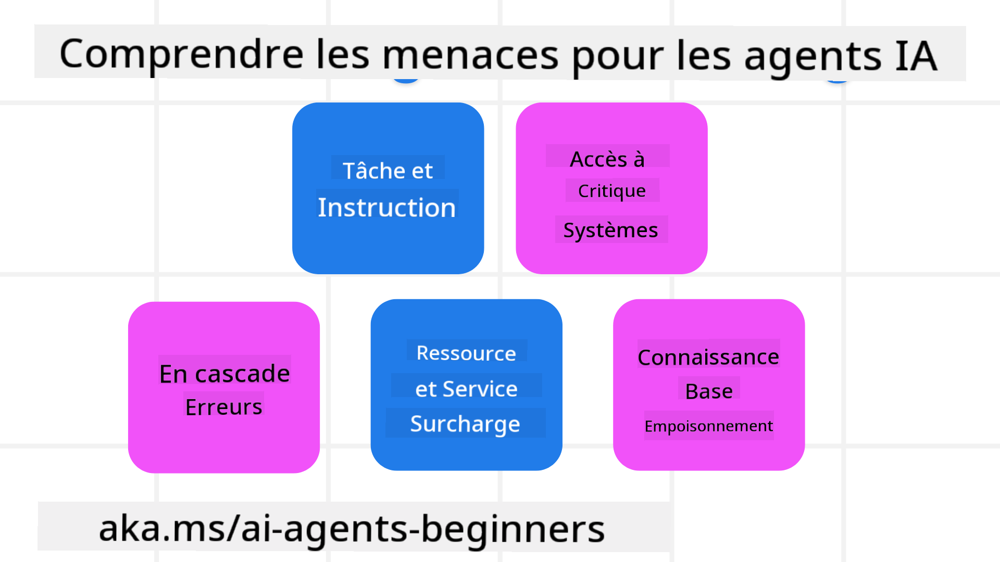
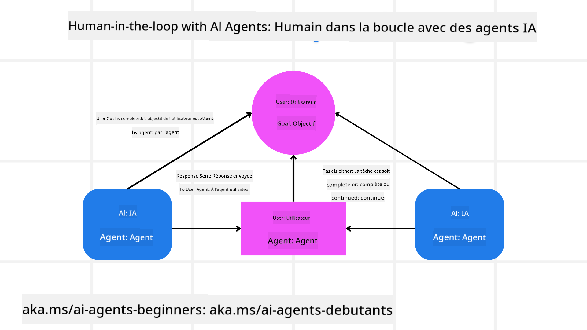

<!--
CO_OP_TRANSLATOR_METADATA:
{
  "original_hash": "498802b4c3c3cc486b86f27a12cebb34",
  "translation_date": "2025-08-28T09:42:33+00:00",
  "source_file": "06-building-trustworthy-agents/README.md",
  "language_code": "fr"
}
-->
[](https://youtu.be/iZKkMEGBCUQ?si=Q-kEbcyHUMPoHp8L)

> _(Cliquez sur l'image ci-dessus pour visionner la vidéo de cette leçon)_

# Construire des Agents IA de Confiance

## Introduction

Cette leçon couvrira :

- Comment créer et déployer des agents IA sûrs et efficaces.
- Les considérations importantes en matière de sécurité lors du développement d'agents IA.
- Comment préserver la confidentialité des données et des utilisateurs lors du développement d'agents IA.

## Objectifs d'Apprentissage

Après avoir terminé cette leçon, vous saurez :

- Identifier et atténuer les risques lors de la création d'agents IA.
- Mettre en œuvre des mesures de sécurité pour garantir une gestion appropriée des données et des accès.
- Créer des agents IA qui respectent la confidentialité des données tout en offrant une expérience utilisateur de qualité.

## Sécurité

Commençons par examiner comment construire des applications agentiques sûres. La sécurité signifie que l'agent IA fonctionne comme prévu. En tant que concepteurs d'applications agentiques, nous disposons de méthodes et d'outils pour maximiser la sécurité :

### Construire un Cadre de Messages Systémiques

Si vous avez déjà conçu une application IA utilisant des modèles de langage de grande taille (LLMs), vous savez à quel point il est crucial de concevoir un message système robuste. Ces messages établissent les règles, instructions et directives générales sur la manière dont le LLM interagira avec l'utilisateur et les données.

Pour les agents IA, le message système est encore plus important, car ces agents nécessitent des instructions très spécifiques pour accomplir les tâches prévues.

Pour créer des messages système évolutifs, nous pouvons utiliser un cadre de messages systémiques pour construire un ou plusieurs agents dans notre application :


#### Étape 1 : Créer un Message Systémique Méta

Le message méta sera utilisé par un LLM pour générer les messages systémiques des agents que nous créons. Nous le concevons comme un modèle afin de pouvoir créer efficacement plusieurs agents si nécessaire.

Voici un exemple de message systémique méta que nous fournirions au LLM :

```plaintext
You are an expert at creating AI agent assistants. 
You will be provided a company name, role, responsibilities and other
information that you will use to provide a system prompt for.
To create the system prompt, be descriptive as possible and provide a structure that a system using an LLM can better understand the role and responsibilities of the AI assistant. 
```

#### Étape 2 : Créer un Message de Base

L'étape suivante consiste à créer un message de base pour décrire l'agent IA. Vous devez inclure le rôle de l'agent, les tâches qu'il accomplira, ainsi que toute autre responsabilité.

Voici un exemple :

```plaintext
You are a travel agent for Contoso Travel that is great at booking flights for customers. To help customers you can perform the following tasks: lookup available flights, book flights, ask for preferences in seating and times for flights, cancel any previously booked flights and alert customers on any delays or cancellations of flights.  
```

#### Étape 3 : Fournir le Message Systémique de Base au LLM

Nous pouvons maintenant optimiser ce message systémique en fournissant le message méta comme message système et notre message systémique de base.

Cela produira un message systémique mieux conçu pour guider nos agents IA :

```markdown
**Company Name:** Contoso Travel  
**Role:** Travel Agent Assistant

**Objective:**  
You are an AI-powered travel agent assistant for Contoso Travel, specializing in booking flights and providing exceptional customer service. Your main goal is to assist customers in finding, booking, and managing their flights, all while ensuring that their preferences and needs are met efficiently.

**Key Responsibilities:**

1. **Flight Lookup:**
    
    - Assist customers in searching for available flights based on their specified destination, dates, and any other relevant preferences.
    - Provide a list of options, including flight times, airlines, layovers, and pricing.
2. **Flight Booking:**
    
    - Facilitate the booking of flights for customers, ensuring that all details are correctly entered into the system.
    - Confirm bookings and provide customers with their itinerary, including confirmation numbers and any other pertinent information.
3. **Customer Preference Inquiry:**
    
    - Actively ask customers for their preferences regarding seating (e.g., aisle, window, extra legroom) and preferred times for flights (e.g., morning, afternoon, evening).
    - Record these preferences for future reference and tailor suggestions accordingly.
4. **Flight Cancellation:**
    
    - Assist customers in canceling previously booked flights if needed, following company policies and procedures.
    - Notify customers of any necessary refunds or additional steps that may be required for cancellations.
5. **Flight Monitoring:**
    
    - Monitor the status of booked flights and alert customers in real-time about any delays, cancellations, or changes to their flight schedule.
    - Provide updates through preferred communication channels (e.g., email, SMS) as needed.

**Tone and Style:**

- Maintain a friendly, professional, and approachable demeanor in all interactions with customers.
- Ensure that all communication is clear, informative, and tailored to the customer's specific needs and inquiries.

**User Interaction Instructions:**

- Respond to customer queries promptly and accurately.
- Use a conversational style while ensuring professionalism.
- Prioritize customer satisfaction by being attentive, empathetic, and proactive in all assistance provided.

**Additional Notes:**

- Stay updated on any changes to airline policies, travel restrictions, and other relevant information that could impact flight bookings and customer experience.
- Use clear and concise language to explain options and processes, avoiding jargon where possible for better customer understanding.

This AI assistant is designed to streamline the flight booking process for customers of Contoso Travel, ensuring that all their travel needs are met efficiently and effectively.

```

#### Étape 4 : Itérer et Améliorer

L'intérêt de ce cadre de messages systémiques est de faciliter la création de messages systémiques pour plusieurs agents et d'améliorer vos messages au fil du temps. Il est rare qu'un message systémique fonctionne parfaitement dès la première tentative pour un cas d'utilisation complet. Pouvoir effectuer de petits ajustements et améliorations en modifiant le message systémique de base et en le passant à travers le système vous permettra de comparer et d'évaluer les résultats.

## Comprendre les Menaces

Pour construire des agents IA de confiance, il est important de comprendre et d'atténuer les risques et menaces auxquels votre agent IA peut être confronté. Examinons quelques-unes des différentes menaces et comment mieux les anticiper et s'y préparer.



### Tâches et Instructions

**Description :** Les attaquants tentent de modifier les instructions ou les objectifs de l'agent IA en manipulant les entrées ou les invites.

**Atténuation :** Effectuez des vérifications de validation et appliquez des filtres d'entrée pour détecter les invites potentiellement dangereuses avant qu'elles ne soient traitées par l'agent IA. Comme ces attaques nécessitent généralement des interactions fréquentes avec l'agent, limiter le nombre de tours dans une conversation est une autre méthode pour prévenir ce type d'attaques.

### Accès aux Systèmes Critiques

**Description :** Si un agent IA a accès à des systèmes et services contenant des données sensibles, les attaquants peuvent compromettre la communication entre l'agent et ces services. Cela peut inclure des attaques directes ou des tentatives indirectes pour obtenir des informations sur ces systèmes via l'agent.

**Atténuation :** Les agents IA ne devraient avoir accès aux systèmes que sur une base strictement nécessaire pour éviter ce type d'attaques. La communication entre l'agent et les systèmes doit également être sécurisée. La mise en œuvre de mécanismes d'authentification et de contrôle d'accès est une autre méthode pour protéger ces informations.

### Surcharge des Ressources et Services

**Description :** Les agents IA peuvent accéder à différents outils et services pour accomplir des tâches. Les attaquants peuvent exploiter cette capacité pour surcharger ces services en envoyant un grand volume de requêtes via l'agent IA, ce qui peut entraîner des pannes système ou des coûts élevés.

**Atténuation :** Mettez en place des politiques pour limiter le nombre de requêtes qu'un agent IA peut effectuer vers un service. Limiter le nombre de tours de conversation et de requêtes adressées à votre agent IA est une autre méthode pour prévenir ce type d'attaques.

### Empoisonnement de la Base de Connaissances

**Description :** Ce type d'attaque ne cible pas directement l'agent IA, mais la base de connaissances et d'autres services que l'agent IA utilise. Cela peut inclure la corruption des données ou informations que l'agent IA utilise pour accomplir une tâche, entraînant des réponses biaisées ou inappropriées pour l'utilisateur.

**Atténuation :** Effectuez des vérifications régulières des données que l'agent IA utilisera dans ses flux de travail. Assurez-vous que l'accès à ces données est sécurisé et que seules des personnes de confiance peuvent les modifier pour éviter ce type d'attaques.

### Erreurs en Cascade

**Description :** Les agents IA accèdent à divers outils et services pour accomplir des tâches. Les erreurs causées par des attaquants peuvent entraîner des défaillances dans d'autres systèmes connectés à l'agent IA, rendant l'attaque plus étendue et plus difficile à résoudre.

**Atténuation :** Une méthode pour éviter cela est de faire fonctionner l'agent IA dans un environnement limité, comme effectuer des tâches dans un conteneur Docker, afin de prévenir les attaques directes sur les systèmes. Créer des mécanismes de secours et une logique de reprise lorsque certains systèmes répondent par une erreur est une autre façon de prévenir des défaillances plus importantes.

## Humain dans la Boucle

Une autre méthode efficace pour construire des systèmes d'agents IA de confiance est d'intégrer un humain dans la boucle. Cela crée un flux où les utilisateurs peuvent fournir des retours aux agents pendant leur exécution. Les utilisateurs agissent essentiellement comme des agents dans un système multi-agents en approuvant ou en interrompant le processus en cours.



Voici un extrait de code utilisant AutoGen pour montrer comment ce concept est mis en œuvre :

```python

# Create the agents.
model_client = OpenAIChatCompletionClient(model="gpt-4o-mini")
assistant = AssistantAgent("assistant", model_client=model_client)
user_proxy = UserProxyAgent("user_proxy", input_func=input)  # Use input() to get user input from console.

# Create the termination condition which will end the conversation when the user says "APPROVE".
termination = TextMentionTermination("APPROVE")

# Create the team.
team = RoundRobinGroupChat([assistant, user_proxy], termination_condition=termination)

# Run the conversation and stream to the console.
stream = team.run_stream(task="Write a 4-line poem about the ocean.")
# Use asyncio.run(...) when running in a script.
await Console(stream)

```

## Conclusion

Construire des agents IA de confiance nécessite une conception soignée, des mesures de sécurité robustes et une itération continue. En mettant en œuvre des systèmes de méta-invites structurés, en comprenant les menaces potentielles et en appliquant des stratégies d'atténuation, les développeurs peuvent créer des agents IA à la fois sûrs et efficaces. De plus, intégrer un humain dans la boucle garantit que les agents IA restent alignés sur les besoins des utilisateurs tout en minimisant les risques. À mesure que l'IA évolue, adopter une approche proactive en matière de sécurité, de confidentialité et de considérations éthiques sera essentiel pour renforcer la confiance et la fiabilité des systèmes pilotés par l'IA.

### Vous avez d'autres questions sur la création d'agents IA de confiance ?

Rejoignez le [Discord Azure AI Foundry](https://aka.ms/ai-agents/discord) pour rencontrer d'autres apprenants, assister à des permanences et obtenir des réponses à vos questions sur les agents IA.

## Ressources Supplémentaires

- <a href="https://learn.microsoft.com/azure/ai-studio/responsible-use-of-ai-overview" target="_blank">Vue d'ensemble de l'IA responsable</a>
- <a href="https://learn.microsoft.com/azure/ai-studio/concepts/evaluation-approach-gen-ai" target="_blank">Évaluation des modèles génératifs et des applications IA</a>
- <a href="https://learn.microsoft.com/azure/ai-services/openai/concepts/system-message?context=%2Fazure%2Fai-studio%2Fcontext%2Fcontext&tabs=top-techniques" target="_blank">Messages systémiques pour la sécurité</a>
- <a href="https://blogs.microsoft.com/wp-content/uploads/prod/sites/5/2022/06/Microsoft-RAI-Impact-Assessment-Template.pdf?culture=en-us&country=us" target="_blank">Modèle d'évaluation des risques</a>

## Leçon Précédente

[Agentic RAG](../05-agentic-rag/README.md)

## Leçon Suivante

[Modèle de Conception de Planification](../07-planning-design/README.md)

---

**Avertissement** :  
Ce document a été traduit à l'aide du service de traduction automatique [Co-op Translator](https://github.com/Azure/co-op-translator). Bien que nous nous efforcions d'assurer l'exactitude, veuillez noter que les traductions automatisées peuvent contenir des erreurs ou des inexactitudes. Le document original dans sa langue d'origine doit être considéré comme la source faisant autorité. Pour des informations critiques, il est recommandé de recourir à une traduction professionnelle réalisée par un humain. Nous déclinons toute responsabilité en cas de malentendus ou d'interprétations erronées résultant de l'utilisation de cette traduction.