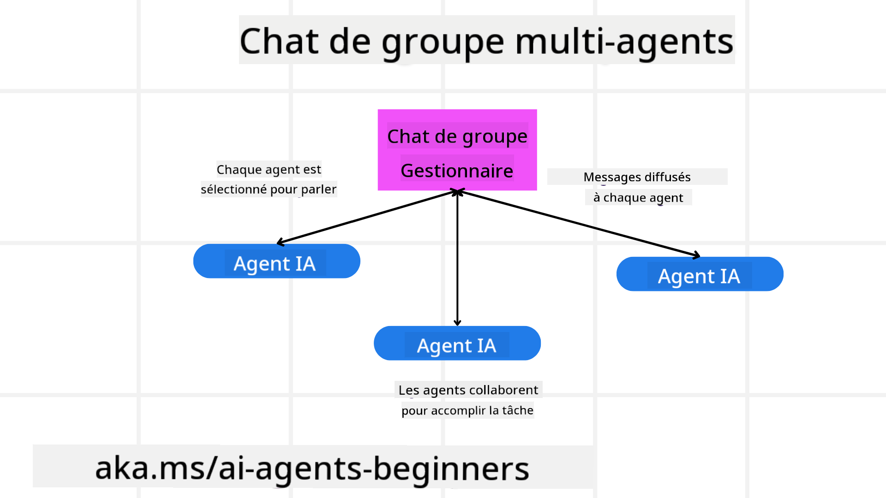
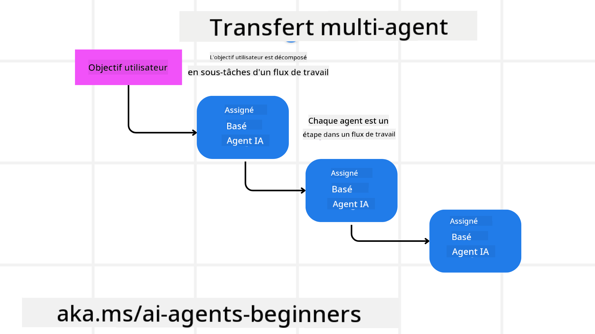
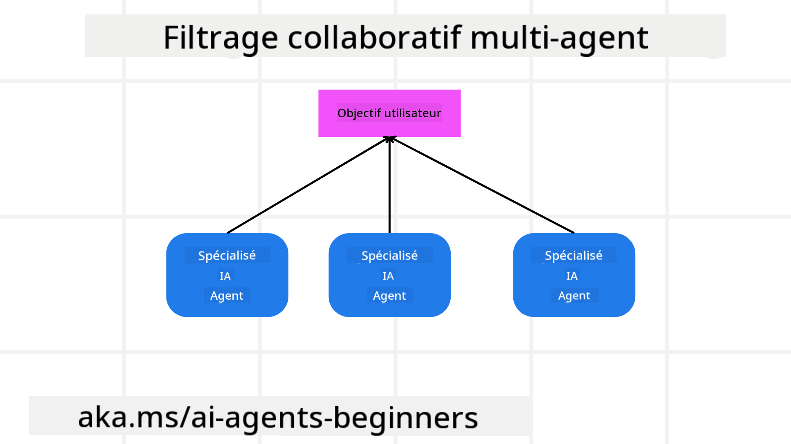

<!--
CO_OP_TRANSLATOR_METADATA:
{
  "original_hash": "1a008c204051cba8d0e253b75f261c41",
  "translation_date": "2025-08-28T09:41:43+00:00",
  "source_file": "08-multi-agent/README.md",
  "language_code": "fr"
}
-->

> _(Cliquez sur l'image ci-dessus pour voir la vidéo de cette leçon)_

# Modèles de conception multi-agents

Dès que vous commencez à travailler sur un projet impliquant plusieurs agents, vous devez envisager le modèle de conception multi-agents. Cependant, il peut ne pas être immédiatement évident de savoir quand passer à des multi-agents et quels en sont les avantages.

## Introduction

Dans cette leçon, nous cherchons à répondre aux questions suivantes :

- Quels sont les scénarios où les multi-agents sont applicables ?
- Quels sont les avantages d'utiliser des multi-agents par rapport à un agent unique effectuant plusieurs tâches ?
- Quels sont les éléments constitutifs de la mise en œuvre du modèle de conception multi-agents ?
- Comment avoir une visibilité sur la manière dont les agents interagissent entre eux ?

## Objectifs d'apprentissage

Après cette leçon, vous devriez être capable de :

- Identifier les scénarios où les multi-agents sont applicables.
- Reconnaître les avantages d'utiliser des multi-agents par rapport à un agent unique.
- Comprendre les éléments constitutifs de la mise en œuvre du modèle de conception multi-agents.

Quelle est la vision d'ensemble ?

*Les multi-agents sont un modèle de conception permettant à plusieurs agents de collaborer pour atteindre un objectif commun.*

Ce modèle est largement utilisé dans divers domaines, notamment la robotique, les systèmes autonomes et l'informatique distribuée.

## Scénarios où les multi-agents sont applicables

Alors, quels scénarios sont de bons cas d'utilisation pour les multi-agents ? La réponse est qu'il existe de nombreux scénarios où l'utilisation de plusieurs agents est bénéfique, en particulier dans les cas suivants :

- **Charges de travail importantes** : Les charges de travail importantes peuvent être divisées en tâches plus petites et attribuées à différents agents, permettant un traitement parallèle et une exécution plus rapide. Un exemple serait le traitement d'un grand volume de données.
- **Tâches complexes** : Les tâches complexes, comme les charges de travail importantes, peuvent être décomposées en sous-tâches plus petites et attribuées à différents agents, chacun spécialisé dans un aspect spécifique de la tâche. Un bon exemple serait les véhicules autonomes où différents agents gèrent la navigation, la détection d'obstacles et la communication avec d'autres véhicules.
- **Expertise diversifiée** : Différents agents peuvent avoir des expertises variées, leur permettant de gérer différents aspects d'une tâche plus efficacement qu'un agent unique. Par exemple, dans le domaine de la santé, des agents peuvent gérer les diagnostics, les plans de traitement et la surveillance des patients.

## Avantages d'utiliser des multi-agents par rapport à un agent unique

Un système à agent unique peut bien fonctionner pour des tâches simples, mais pour des tâches plus complexes, l'utilisation de plusieurs agents offre plusieurs avantages :

- **Spécialisation** : Chaque agent peut être spécialisé dans une tâche spécifique. L'absence de spécialisation dans un agent unique signifie que celui-ci peut tout faire, mais risque de se perdre face à une tâche complexe. Il pourrait, par exemple, effectuer une tâche pour laquelle il n'est pas le mieux adapté.
- **Évolutivité** : Il est plus facile de faire évoluer les systèmes en ajoutant des agents plutôt qu'en surchargeant un agent unique.
- **Tolérance aux pannes** : Si un agent échoue, les autres peuvent continuer à fonctionner, garantissant la fiabilité du système.

Prenons un exemple : réserver un voyage pour un utilisateur. Un système à agent unique devrait gérer tous les aspects du processus de réservation, de la recherche de vols à la réservation d'hôtels et de voitures de location. Pour ce faire, l'agent unique aurait besoin d'outils pour gérer toutes ces tâches, ce qui pourrait entraîner un système complexe et monolithique difficile à maintenir et à faire évoluer. Un système multi-agents, en revanche, pourrait avoir différents agents spécialisés dans la recherche de vols, la réservation d'hôtels et de voitures de location. Cela rendrait le système plus modulaire, plus facile à maintenir et évolutif.

Comparez cela à une agence de voyages gérée comme une petite boutique familiale par rapport à une agence de voyages fonctionnant comme une franchise. La boutique familiale aurait un agent unique gérant tous les aspects du processus de réservation, tandis que la franchise aurait différents agents gérant différents aspects du processus.

## Éléments constitutifs de la mise en œuvre du modèle de conception multi-agents

Avant de pouvoir mettre en œuvre le modèle de conception multi-agents, vous devez comprendre les éléments constitutifs qui composent ce modèle.

Prenons à nouveau l'exemple de la réservation d'un voyage pour un utilisateur. Dans ce cas, les éléments constitutifs incluraient :

- **Communication entre agents** : Les agents chargés de trouver des vols, de réserver des hôtels et des voitures de location doivent communiquer et partager des informations sur les préférences et contraintes de l'utilisateur. Vous devez décider des protocoles et méthodes pour cette communication. Concrètement, cela signifie que l'agent chargé de trouver des vols doit communiquer avec l'agent chargé de réserver des hôtels pour s'assurer que l'hôtel est réservé aux mêmes dates que le vol. Cela implique que les agents doivent partager des informations sur les dates de voyage de l'utilisateur, ce qui signifie que vous devez décider *quels agents partagent des informations et comment ils les partagent*.
- **Mécanismes de coordination** : Les agents doivent coordonner leurs actions pour garantir que les préférences et contraintes de l'utilisateur sont respectées. Une préférence utilisateur pourrait être qu'il souhaite un hôtel proche de l'aéroport, tandis qu'une contrainte pourrait être que les voitures de location ne sont disponibles qu'à l'aéroport. Cela signifie que l'agent chargé de réserver des hôtels doit se coordonner avec l'agent chargé de réserver des voitures de location pour garantir que les préférences et contraintes de l'utilisateur sont respectées. Cela implique que vous devez décider *comment les agents coordonnent leurs actions*.
- **Architecture des agents** : Les agents doivent avoir une structure interne leur permettant de prendre des décisions et d'apprendre de leurs interactions avec l'utilisateur. Cela signifie que l'agent chargé de trouver des vols doit avoir une structure interne lui permettant de prendre des décisions sur les vols à recommander à l'utilisateur. Cela implique que vous devez décider *comment les agents prennent des décisions et apprennent de leurs interactions avec l'utilisateur*. Par exemple, un agent pourrait utiliser un modèle d'apprentissage automatique pour recommander des vols à l'utilisateur en fonction de ses préférences passées.
- **Visibilité des interactions multi-agents** : Vous devez avoir une visibilité sur la manière dont les agents interagissent entre eux. Cela signifie que vous devez disposer d'outils et de techniques pour suivre les activités et interactions des agents. Cela pourrait prendre la forme d'outils de journalisation et de surveillance, d'outils de visualisation et de métriques de performance.
- **Modèles multi-agents** : Il existe différents modèles pour mettre en œuvre des systèmes multi-agents, tels que les architectures centralisées, décentralisées et hybrides. Vous devez choisir le modèle qui convient le mieux à votre cas d'utilisation.
- **Humain dans la boucle** : Dans la plupart des cas, un humain sera impliqué et vous devez instruire les agents sur le moment où demander une intervention humaine. Cela pourrait prendre la forme d'un utilisateur demandant un hôtel ou un vol spécifique que les agents n'ont pas recommandé ou demandant une confirmation avant de réserver un vol ou un hôtel.

## Visibilité des interactions multi-agents

Il est important d'avoir une visibilité sur la manière dont les agents interagissent entre eux. Cette visibilité est essentielle pour le débogage, l'optimisation et l'efficacité globale du système. Pour y parvenir, vous devez disposer d'outils et de techniques pour suivre les activités et interactions des agents. Cela pourrait prendre la forme d'outils de journalisation et de surveillance, d'outils de visualisation et de métriques de performance.

Par exemple, dans le cas de la réservation d'un voyage pour un utilisateur, vous pourriez avoir un tableau de bord affichant le statut de chaque agent, les préférences et contraintes de l'utilisateur, et les interactions entre les agents. Ce tableau de bord pourrait afficher les dates de voyage de l'utilisateur, les vols recommandés par l'agent de vol, les hôtels recommandés par l'agent d'hôtel et les voitures de location recommandées par l'agent de location. Cela vous donnerait une vue claire de la manière dont les agents interagissent entre eux et si les préférences et contraintes de l'utilisateur sont respectées.

Examinons ces aspects plus en détail.

- **Outils de journalisation et de surveillance** : Vous souhaitez enregistrer chaque action effectuée par un agent. Une entrée de journal pourrait contenir des informations sur l'agent ayant effectué l'action, l'action effectuée, l'heure de l'action et le résultat de l'action. Ces informations peuvent ensuite être utilisées pour le débogage, l'optimisation, etc.

- **Outils de visualisation** : Les outils de visualisation peuvent vous aider à voir les interactions entre les agents de manière plus intuitive. Par exemple, vous pourriez avoir un graphique montrant le flux d'informations entre les agents. Cela pourrait vous aider à identifier les goulots d'étranglement, les inefficacités et d'autres problèmes dans le système.

- **Métriques de performance** : Les métriques de performance peuvent vous aider à suivre l'efficacité du système multi-agents. Par exemple, vous pourriez suivre le temps nécessaire pour accomplir une tâche, le nombre de tâches accomplies par unité de temps et la précision des recommandations faites par les agents. Ces informations peuvent vous aider à identifier les domaines à améliorer et à optimiser le système.

## Modèles multi-agents

Examinons quelques modèles concrets que nous pouvons utiliser pour créer des applications multi-agents. Voici quelques modèles intéressants à considérer :

### Chat de groupe

Ce modèle est utile lorsque vous souhaitez créer une application de chat de groupe où plusieurs agents peuvent communiquer entre eux. Les cas d'utilisation typiques de ce modèle incluent la collaboration en équipe, le support client et les réseaux sociaux.

Dans ce modèle, chaque agent représente un utilisateur dans le chat de groupe, et les messages sont échangés entre les agents via un protocole de messagerie. Les agents peuvent envoyer des messages au chat de groupe, recevoir des messages du chat de groupe et répondre aux messages d'autres agents.

Ce modèle peut être mis en œuvre à l'aide d'une architecture centralisée où tous les messages sont acheminés via un serveur central, ou d'une architecture décentralisée où les messages sont échangés directement.

### Transmission de tâches

Ce modèle est utile lorsque vous souhaitez créer une application où plusieurs agents peuvent se transmettre des tâches.

Les cas d'utilisation typiques de ce modèle incluent le support client, la gestion des tâches et l'automatisation des flux de travail.

Dans ce modèle, chaque agent représente une tâche ou une étape dans un flux de travail, et les agents peuvent transmettre des tâches à d'autres agents en fonction de règles prédéfinies.

### Filtrage collaboratif

Ce modèle est utile lorsque vous souhaitez créer une application où plusieurs agents peuvent collaborer pour faire des recommandations aux utilisateurs.

Pourquoi voudriez-vous que plusieurs agents collaborent ? Parce que chaque agent peut avoir une expertise différente et contribuer au processus de recommandation de différentes manières.

Prenons un exemple où un utilisateur souhaite une recommandation sur la meilleure action à acheter sur le marché boursier.

- **Expert en industrie** : Un agent pourrait être expert dans un secteur spécifique.
- **Analyse technique** : Un autre agent pourrait être expert en analyse technique.
- **Analyse fondamentale** : Et un autre agent pourrait être expert en analyse fondamentale. En collaborant, ces agents peuvent fournir une recommandation plus complète à l'utilisateur.

## Scénario : Processus de remboursement

Considérons un scénario où un client essaie d'obtenir un remboursement pour un produit. Plusieurs agents peuvent être impliqués dans ce processus, mais divisons-les entre les agents spécifiques à ce processus et les agents généraux pouvant être utilisés dans d'autres processus.

**Agents spécifiques au processus de remboursement** :

Voici quelques agents qui pourraient être impliqués dans le processus de remboursement :

- **Agent client** : Cet agent représente le client et est responsable de l'initiation du processus de remboursement.
- **Agent vendeur** : Cet agent représente le vendeur et est responsable du traitement du remboursement.
- **Agent de paiement** : Cet agent représente le processus de paiement et est responsable du remboursement du paiement du client.
- **Agent de résolution** : Cet agent représente le processus de résolution et est responsable de résoudre les problèmes qui surviennent pendant le processus de remboursement.
- **Agent de conformité** : Cet agent représente le processus de conformité et est responsable de garantir que le processus de remboursement respecte les réglementations et politiques.

**Agents généraux** :

Ces agents peuvent être utilisés par d'autres parties de votre entreprise.

- **Agent d'expédition** : Cet agent représente le processus d'expédition et est responsable de renvoyer le produit au vendeur. Cet agent peut être utilisé à la fois pour le processus de remboursement et pour l'expédition générale d'un produit, par exemple lors d'un achat.
- **Agent de feedback** : Cet agent représente le processus de feedback et est responsable de collecter les retours du client. Le feedback peut être recueilli à tout moment, pas seulement pendant le processus de remboursement.
- **Agent d'escalade** : Cet agent représente le processus d'escalade et est responsable d'escalader les problèmes à un niveau de support supérieur. Ce type d'agent peut être utilisé pour tout processus nécessitant une escalade.
- **Agent de notification** : Cet agent représente le processus de notification et est responsable d'envoyer des notifications au client à différentes étapes du processus de remboursement.
- **Agent d'analyse** : Cet agent représente le processus d'analyse et est responsable d'analyser les données liées au processus de remboursement.
- **Agent d'audit** : Cet agent représente le processus d'audit et est responsable de vérifier que le processus de remboursement est correctement exécuté.
- **Agent de reporting** : Cet agent représente le processus de reporting et est responsable de générer des rapports sur le processus de remboursement.
- **Agent de connaissances** : Cet agent représente le processus de gestion des connaissances et est responsable de maintenir une base de connaissances sur le processus de remboursement. Cet agent pourrait être informé à la fois sur les remboursements et sur d'autres parties de votre entreprise.
- **Agent de sécurité** : Cet agent représente le processus de sécurité et est responsable de garantir la sécurité du processus de remboursement.
- **Agent de qualité** : Cet agent représente le processus de qualité et est responsable de garantir la qualité du processus de remboursement.

Il y a pas mal d'agents listés précédemment, à la fois pour le processus de remboursement spécifique et pour les agents généraux pouvant être utilisés dans d'autres parties de votre entreprise. Espérons que cela vous donne une idée de la manière dont vous pouvez décider quels agents utiliser dans votre système multi-agents.

## Exercice
Concevez un système multi-agents pour un processus de support client. Identifiez les agents impliqués dans le processus, leurs rôles et responsabilités, ainsi que la manière dont ils interagissent entre eux. Prenez en compte à la fois les agents spécifiques au processus de support client et les agents généraux pouvant être utilisés dans d'autres parties de votre entreprise.

> Réfléchissez avant de lire la solution ci-dessous, vous pourriez avoir besoin de plus d'agents que vous ne le pensez.

> TIP : Pensez aux différentes étapes du processus de support client et considérez également les agents nécessaires pour tout système.

## Solution

[Solution](./solution/solution.md)

## Vérifications des connaissances

Question : Quand devriez-vous envisager d'utiliser des multi-agents ?

- [ ] A1 : Lorsque vous avez une charge de travail faible et une tâche simple.
- [ ] A2 : Lorsque vous avez une charge de travail importante.
- [ ] A3 : Lorsque vous avez une tâche simple.

[Solution quiz](./solution/solution-quiz.md)

## Résumé

Dans cette leçon, nous avons examiné le modèle de conception multi-agents, y compris les scénarios où les multi-agents sont applicables, les avantages d'utiliser des multi-agents par rapport à un agent unique, les éléments constitutifs de la mise en œuvre du modèle de conception multi-agents, et comment avoir une visibilité sur la manière dont les différents agents interagissent entre eux.

### Vous avez d'autres questions sur le modèle de conception multi-agents ?

Rejoignez le [Discord Azure AI Foundry](https://aka.ms/ai-agents/discord) pour rencontrer d'autres apprenants, assister à des heures de bureau et obtenir des réponses à vos questions sur les agents IA.

## Ressources supplémentaires

- ## Leçon précédente

[Conception de la planification](../07-planning-design/README.md)

## Leçon suivante

[Métacognition dans les agents IA](../09-metacognition/README.md)

---

**Avertissement** :  
Ce document a été traduit à l'aide du service de traduction automatique [Co-op Translator](https://github.com/Azure/co-op-translator). Bien que nous nous efforcions d'assurer l'exactitude, veuillez noter que les traductions automatisées peuvent contenir des erreurs ou des inexactitudes. Le document original dans sa langue d'origine doit être considéré comme la source faisant autorité. Pour des informations critiques, il est recommandé de recourir à une traduction professionnelle réalisée par un humain. Nous déclinons toute responsabilité en cas de malentendus ou d'interprétations erronées résultant de l'utilisation de cette traduction.