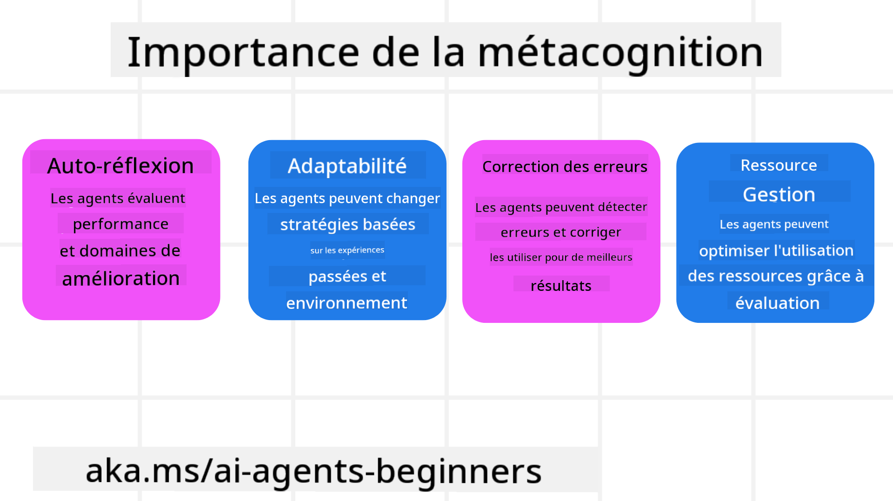
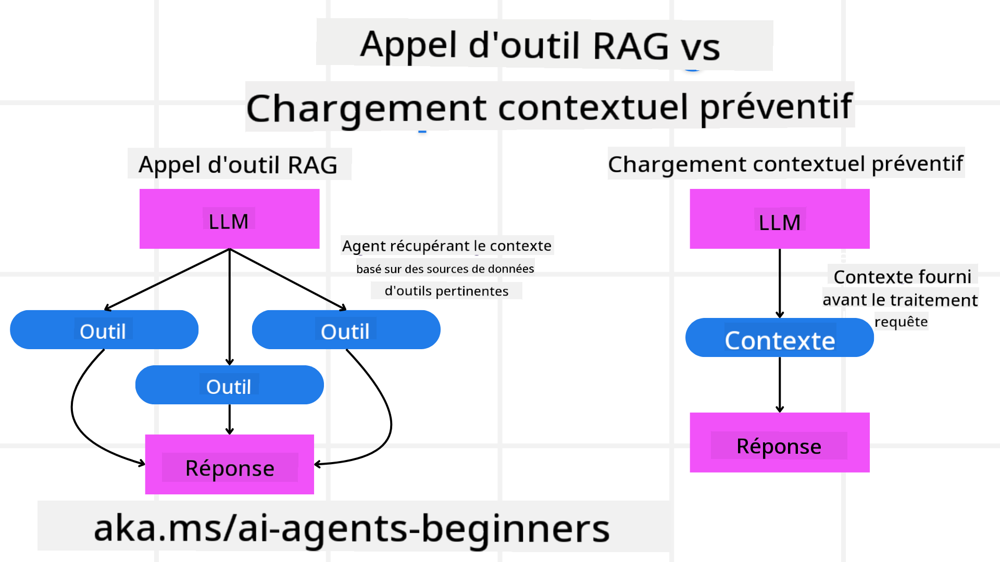

<!--
CO_OP_TRANSLATOR_METADATA:
{
  "original_hash": "5f0deef171fc3a68d5d3d770a8bfb03d",
  "translation_date": "2025-08-28T09:37:33+00:00",
  "source_file": "09-metacognition/README.md",
  "language_code": "fr"
}
-->
[](https://youtu.be/His9R6gw6Ec?si=3_RMb8VprNvdLRhX)

> _(Cliquez sur l'image ci-dessus pour voir la vidéo de cette leçon)_
# Métacognition chez les agents IA

## Introduction

Bienvenue dans la leçon sur la métacognition chez les agents IA ! Ce chapitre est conçu pour les débutants curieux de comprendre comment les agents IA peuvent réfléchir à leurs propres processus de pensée. À la fin de cette leçon, vous comprendrez les concepts clés et serez équipé d'exemples pratiques pour appliquer la métacognition dans la conception d'agents IA.

## Objectifs d'apprentissage

Après avoir terminé cette leçon, vous serez capable de :

1. Comprendre les implications des boucles de raisonnement dans les définitions d'agents.
2. Utiliser des techniques de planification et d'évaluation pour aider les agents à s'auto-corriger.
3. Créer vos propres agents capables de manipuler du code pour accomplir des tâches.

## Introduction à la métacognition

La métacognition fait référence aux processus cognitifs de haut niveau qui impliquent de réfléchir à sa propre pensée. Pour les agents IA, cela signifie être capable d'évaluer et d'ajuster leurs actions en fonction de leur conscience de soi et de leurs expériences passées. La métacognition, ou "penser à penser", est un concept important dans le développement des systèmes IA agentiques. Elle implique que les systèmes IA soient conscients de leurs propres processus internes et capables de surveiller, réguler et adapter leur comportement en conséquence. Tout comme nous le faisons lorsque nous analysons une situation ou abordons un problème. Cette conscience de soi peut aider les systèmes IA à prendre de meilleures décisions, identifier des erreurs et améliorer leurs performances au fil du temps, ce qui renvoie au test de Turing et au débat sur la prise de contrôle par l'IA.

Dans le contexte des systèmes IA agentiques, la métacognition peut aider à résoudre plusieurs défis, tels que :
- Transparence : Garantir que les systèmes IA peuvent expliquer leur raisonnement et leurs décisions.
- Raisonnement : Améliorer la capacité des systèmes IA à synthétiser des informations et à prendre des décisions éclairées.
- Adaptation : Permettre aux systèmes IA de s'ajuster à de nouveaux environnements et à des conditions changeantes.
- Perception : Améliorer la précision des systèmes IA dans la reconnaissance et l'interprétation des données de leur environnement.

### Qu'est-ce que la métacognition ?

La métacognition, ou "penser à penser", est un processus cognitif de haut niveau qui implique la conscience de soi et l'autorégulation de ses propres processus cognitifs. Dans le domaine de l'IA, la métacognition permet aux agents d'évaluer et d'adapter leurs stratégies et actions, ce qui conduit à des capacités améliorées de résolution de problèmes et de prise de décision. En comprenant la métacognition, vous pouvez concevoir des agents IA qui sont non seulement plus intelligents, mais aussi plus adaptables et efficaces. Dans une véritable métacognition, l'IA raisonne explicitement sur son propre raisonnement.

Exemple : « J'ai priorisé les vols moins chers parce que… Je pourrais manquer des vols directs, alors laissez-moi vérifier à nouveau. »
Suivre comment ou pourquoi elle a choisi une certaine option.
- Noter qu'elle a commis des erreurs parce qu'elle s'est trop appuyée sur les préférences de l'utilisateur de la dernière fois, et modifier sa stratégie de prise de décision, pas seulement la recommandation finale.
- Diagnostiquer des schémas comme : « Chaque fois que l'utilisateur mentionne "trop bondé", je devrais non seulement supprimer certaines attractions, mais aussi réfléchir au fait que ma méthode de sélection des "meilleures attractions" est défaillante si je classe toujours par popularité. »

### Importance de la métacognition chez les agents IA

La métacognition joue un rôle crucial dans la conception des agents IA pour plusieurs raisons :



- Auto-réflexion : Les agents peuvent évaluer leurs propres performances et identifier des domaines à améliorer.
- Adaptabilité : Les agents peuvent modifier leurs stratégies en fonction des expériences passées et des environnements changeants.
- Correction des erreurs : Les agents peuvent détecter et corriger des erreurs de manière autonome, ce qui conduit à des résultats plus précis.
- Gestion des ressources : Les agents peuvent optimiser l'utilisation des ressources, telles que le temps et la puissance de calcul, en planifiant et en évaluant leurs actions.

## Composants d'un agent IA

Avant de plonger dans les processus métacognitifs, il est essentiel de comprendre les composants de base d'un agent IA. Un agent IA se compose généralement de :

- Persona : La personnalité et les caractéristiques de l'agent, qui définissent comment il interagit avec les utilisateurs.
- Outils : Les capacités et fonctions que l'agent peut exécuter.
- Compétences : Les connaissances et l'expertise que l'agent possède.

Ces composants travaillent ensemble pour créer une "unité d'expertise" capable d'exécuter des tâches spécifiques.

**Exemple** :
Considérez un agent de voyage, des services d'agents qui non seulement planifient vos vacances, mais ajustent également leur chemin en fonction des données en temps réel et des expériences de voyage des clients précédents.

### Exemple : Métacognition dans un service d'agent de voyage

Imaginez que vous concevez un service d'agent de voyage alimenté par l'IA. Cet agent, "Agent de voyage", aide les utilisateurs à planifier leurs vacances. Pour intégrer la métacognition, l'agent de voyage doit évaluer et ajuster ses actions en fonction de sa conscience de soi et de ses expériences passées. Voici comment la métacognition pourrait jouer un rôle :

#### Tâche actuelle

La tâche actuelle est d'aider un utilisateur à planifier un voyage à Paris.

#### Étapes pour accomplir la tâche

1. **Recueillir les préférences de l'utilisateur** : Demander à l'utilisateur ses dates de voyage, son budget, ses centres d'intérêt (par exemple, musées, gastronomie, shopping) et ses exigences spécifiques.
2. **Récupérer des informations** : Rechercher des options de vol, des hébergements, des attractions et des restaurants correspondant aux préférences de l'utilisateur.
3. **Générer des recommandations** : Fournir un itinéraire personnalisé avec les détails des vols, les réservations d'hôtel et les activités suggérées.
4. **Ajuster en fonction des retours** : Demander à l'utilisateur des retours sur les recommandations et apporter les ajustements nécessaires.

#### Ressources nécessaires

- Accès aux bases de données de réservation de vols et d'hôtels.
- Informations sur les attractions et restaurants parisiens.
- Données de retour d'expérience des interactions précédentes avec les utilisateurs.

#### Expérience et auto-réflexion

L'agent de voyage utilise la métacognition pour évaluer ses performances et apprendre de ses expériences passées. Par exemple :

1. **Analyse des retours utilisateurs** : L'agent de voyage examine les retours des utilisateurs pour déterminer quelles recommandations ont été bien reçues et lesquelles ne l'ont pas été. Il ajuste ses suggestions futures en conséquence.
2. **Adaptabilité** : Si un utilisateur a précédemment mentionné qu'il n'aime pas les endroits bondés, l'agent de voyage évitera de recommander des lieux touristiques populaires aux heures de pointe à l'avenir.
3. **Correction des erreurs** : Si l'agent de voyage a commis une erreur lors d'une réservation précédente, comme suggérer un hôtel complet, il apprend à vérifier la disponibilité plus rigoureusement avant de faire des recommandations.

#### Exemple pratique pour les développeurs

Voici un exemple simplifié de code de l'agent de voyage intégrant la métacognition :

```python
class Travel_Agent:
    def __init__(self):
        self.user_preferences = {}
        self.experience_data = []

    def gather_preferences(self, preferences):
        self.user_preferences = preferences

    def retrieve_information(self):
        # Search for flights, hotels, and attractions based on preferences
        flights = search_flights(self.user_preferences)
        hotels = search_hotels(self.user_preferences)
        attractions = search_attractions(self.user_preferences)
        return flights, hotels, attractions

    def generate_recommendations(self):
        flights, hotels, attractions = self.retrieve_information()
        itinerary = create_itinerary(flights, hotels, attractions)
        return itinerary

    def adjust_based_on_feedback(self, feedback):
        self.experience_data.append(feedback)
        # Analyze feedback and adjust future recommendations
        self.user_preferences = adjust_preferences(self.user_preferences, feedback)

# Example usage
travel_agent = Travel_Agent()
preferences = {
    "destination": "Paris",
    "dates": "2025-04-01 to 2025-04-10",
    "budget": "moderate",
    "interests": ["museums", "cuisine"]
}
travel_agent.gather_preferences(preferences)
itinerary = travel_agent.generate_recommendations()
print("Suggested Itinerary:", itinerary)
feedback = {"liked": ["Louvre Museum"], "disliked": ["Eiffel Tower (too crowded)"]}
travel_agent.adjust_based_on_feedback(feedback)
```

#### Pourquoi la métacognition est importante

- **Auto-réflexion** : Les agents peuvent analyser leurs performances et identifier des domaines à améliorer.
- **Adaptabilité** : Les agents peuvent modifier leurs stratégies en fonction des retours et des conditions changeantes.
- **Correction des erreurs** : Les agents peuvent détecter et corriger des erreurs de manière autonome.
- **Gestion des ressources** : Les agents peuvent optimiser l'utilisation des ressources, telles que le temps et la puissance de calcul.

En intégrant la métacognition, l'agent de voyage peut fournir des recommandations de voyage plus personnalisées et précises, améliorant ainsi l'expérience utilisateur globale.

---

## 2. Planification chez les agents

La planification est un élément essentiel du comportement des agents IA. Elle consiste à définir les étapes nécessaires pour atteindre un objectif, en tenant compte de l'état actuel, des ressources et des obstacles possibles.

### Éléments de la planification

- **Tâche actuelle** : Définir clairement la tâche.
- **Étapes pour accomplir la tâche** : Décomposer la tâche en étapes gérables.
- **Ressources nécessaires** : Identifier les ressources nécessaires.
- **Expérience** : Utiliser les expériences passées pour informer la planification.

**Exemple** :
Voici les étapes que l'agent de voyage doit suivre pour aider un utilisateur à planifier son voyage efficacement :

### Étapes pour l'agent de voyage

1. **Recueillir les préférences de l'utilisateur**
   - Demander à l'utilisateur des détails sur ses dates de voyage, son budget, ses centres d'intérêt et ses exigences spécifiques.
   - Exemples : « Quand prévoyez-vous de voyager ? » « Quelle est votre fourchette de budget ? » « Quelles activités aimez-vous pendant vos vacances ? »

2. **Récupérer des informations**
   - Rechercher des options de voyage pertinentes en fonction des préférences de l'utilisateur.
   - **Vols** : Rechercher des vols disponibles dans le budget et les dates de voyage préférés de l'utilisateur.
   - **Hébergements** : Trouver des hôtels ou des propriétés locatives correspondant aux préférences de l'utilisateur en matière de localisation, de prix et d'équipements.
   - **Attractions et restaurants** : Identifier des attractions, activités et options de restauration populaires qui correspondent aux centres d'intérêt de l'utilisateur.

3. **Générer des recommandations**
   - Compiler les informations récupérées dans un itinéraire personnalisé.
   - Fournir des détails tels que les options de vol, les réservations d'hôtel et les activités suggérées, en veillant à adapter les recommandations aux préférences de l'utilisateur.

4. **Présenter l'itinéraire à l'utilisateur**
   - Partager l'itinéraire proposé avec l'utilisateur pour qu'il l'examine.
   - Exemple : « Voici un itinéraire suggéré pour votre voyage à Paris. Il inclut les détails des vols, les réservations d'hôtel et une liste d'activités et de restaurants recommandés. Faites-moi part de vos impressions ! »

5. **Recueillir des retours**
   - Demander à l'utilisateur des retours sur l'itinéraire proposé.
   - Exemples : « Aimez-vous les options de vol ? » « L'hôtel convient-il à vos besoins ? » « Y a-t-il des activités que vous souhaitez ajouter ou supprimer ? »

6. **Ajuster en fonction des retours**
   - Modifier l'itinéraire en fonction des retours de l'utilisateur.
   - Apporter les changements nécessaires aux recommandations de vol, d'hébergement et d'activités pour mieux correspondre aux préférences de l'utilisateur.

7. **Confirmation finale**
   - Présenter l'itinéraire mis à jour à l'utilisateur pour confirmation finale.
   - Exemple : « J'ai apporté les ajustements en fonction de vos retours. Voici l'itinéraire mis à jour. Tout vous convient-il ? »

8. **Réserver et confirmer les réservations**
   - Une fois l'itinéraire approuvé par l'utilisateur, procéder à la réservation des vols, des hébergements et des activités pré-planifiées.
   - Envoyer les détails de confirmation à l'utilisateur.

9. **Fournir un support continu**
   - Rester disponible pour aider l'utilisateur avec des changements ou des demandes supplémentaires avant et pendant son voyage.
   - Exemple : « Si vous avez besoin d'aide supplémentaire pendant votre voyage, n'hésitez pas à me contacter à tout moment ! »

### Exemple d'interaction

```python
class Travel_Agent:
    def __init__(self):
        self.user_preferences = {}
        self.experience_data = []

    def gather_preferences(self, preferences):
        self.user_preferences = preferences

    def retrieve_information(self):
        flights = search_flights(self.user_preferences)
        hotels = search_hotels(self.user_preferences)
        attractions = search_attractions(self.user_preferences)
        return flights, hotels, attractions

    def generate_recommendations(self):
        flights, hotels, attractions = self.retrieve_information()
        itinerary = create_itinerary(flights, hotels, attractions)
        return itinerary

    def adjust_based_on_feedback(self, feedback):
        self.experience_data.append(feedback)
        self.user_preferences = adjust_preferences(self.user_preferences, feedback)

# Example usage within a booing request
travel_agent = Travel_Agent()
preferences = {
    "destination": "Paris",
    "dates": "2025-04-01 to 2025-04-10",
    "budget": "moderate",
    "interests": ["museums", "cuisine"]
}
travel_agent.gather_preferences(preferences)
itinerary = travel_agent.generate_recommendations()
print("Suggested Itinerary:", itinerary)
feedback = {"liked": ["Louvre Museum"], "disliked": ["Eiffel Tower (too crowded)"]}
travel_agent.adjust_based_on_feedback(feedback)
```

## 3. Système RAG correctif

Commençons par comprendre la différence entre l'outil RAG et le chargement contextuel préventif.



### Génération augmentée par récupération (RAG)

RAG combine un système de récupération avec un modèle génératif. Lorsqu'une requête est effectuée, le système de récupération extrait des documents ou des données pertinents d'une source externe, et ces informations récupérées sont utilisées pour augmenter l'entrée du modèle génératif. Cela aide le modèle à générer des réponses plus précises et contextuellement pertinentes.

Dans un système RAG, l'agent récupère des informations pertinentes à partir d'une base de connaissances et les utilise pour générer des réponses ou des actions appropriées.

### Approche RAG correctif

L'approche RAG correctif se concentre sur l'utilisation des techniques RAG pour corriger les erreurs et améliorer la précision des agents IA. Cela implique :

1. **Technique de sollicitation** : Utiliser des sollicitations spécifiques pour guider l'agent dans la récupération d'informations pertinentes.
2. **Outil** : Mettre en œuvre des algorithmes et des mécanismes permettant à l'agent d'évaluer la pertinence des informations récupérées et de générer des réponses précises.
3. **Évaluation** : Évaluer en continu les performances de l'agent et apporter des ajustements pour améliorer sa précision et son efficacité.

#### Exemple : RAG correctif dans un agent de recherche

Considérons un agent de recherche qui récupère des informations sur le web pour répondre aux requêtes des utilisateurs. L'approche RAG correctif pourrait impliquer :

1. **Technique de sollicitation** : Formuler des requêtes de recherche en fonction des entrées de l'utilisateur.
2. **Outil** : Utiliser des algorithmes de traitement du langage naturel et d'apprentissage automatique pour classer et filtrer les résultats de recherche.
3. **Évaluation** : Analyser les retours des utilisateurs pour identifier et corriger les inexactitudes dans les informations récupérées.

### RAG correctif dans l'agent de voyage

Le RAG correctif (Génération augmentée par récupération) améliore la capacité d'une IA à récupérer et générer des informations tout en corrigeant les inexactitudes. Voyons comment l'agent de voyage peut utiliser l'approche RAG correctif pour fournir des recommandations de voyage plus précises et pertinentes.

Cela implique :

- **Technique de sollicitation** : Utiliser des sollicitations spécifiques pour guider l'agent dans la récupération d'informations pertinentes.
- **Outil** : Mettre en œuvre des algorithmes et des mécanismes permettant à l'agent d'évaluer la pertinence des informations récupérées et de générer des réponses précises.
- **Évaluation** : Évaluer en continu les performances de l'agent et apporter des ajustements pour améliorer sa précision et son efficacité.

#### Étapes pour mettre en œuvre le RAG correctif dans l'agent de voyage

1. **Interaction initiale avec l'utilisateur**
   - L'agent de voyage recueille les préférences initiales de l'utilisateur, telles que la destination, les dates de voyage, le budget et les centres d'intérêt.
   - Exemple :

     ```python
     preferences = {
         "destination": "Paris",
         "dates": "2025-04-01 to 2025-04-10",
         "budget": "moderate",
         "interests": ["museums", "cuisine"]
     }
     ```

2. **Récupération d'informations**
   - L'agent de voyage récupère des informations sur les vols, les hébergements, les attractions et les restaurants en fonction des préférences de l'utilisateur.
   - Exemple :

     ```python
     flights = search_flights(preferences)
     hotels = search_hotels(preferences)
     attractions = search_attractions(preferences)
     ```

3. **Génération de recommandations initiales**
   - L'agent de voyage utilise les informations récupérées pour générer un itinéraire personnalisé.
   - Exemple :

     ```python
     itinerary = create_itinerary(flights, hotels, attractions)
     print("Suggested Itinerary:", itinerary)
     ```

4. **Recueil des retours utilisateurs**
   - L'agent de voyage demande à l'utilisateur des retours sur les recommandations initiales.
   - Exemple :

     ```python
     feedback = {
         "liked": ["Louvre Museum"],
         "disliked": ["Eiffel Tower (too crowded)"]
     }
     ```

5. **Processus RAG correctif**
   - **Technique de sollicitation** : L'agent de voyage formule de nouvelles requêtes de recherche en fonction des retours de l'utilisateur.
     - Exemple :

       ```python
       if "disliked" in feedback:
           preferences["avoid"] = feedback["disliked"]
       ```

   - **Outil** : L'agent de voyage utilise des algorithmes pour classer et filtrer les nouveaux résultats de recherche, en mettant l'accent sur la pertinence en fonction des retours de l'utilisateur.
     - Exemple :

       ```python
       new_attractions = search_attractions(preferences)
       new_itinerary = create_itinerary(flights, hotels, new_attractions)
       print("Updated Itinerary:", new_itinerary)
       ```

   - **Évaluation** : L'agent de voyage évalue en continu la pertinence et la précision de ses recommandations en analysant les retours des utilisateurs et en apportant les ajustements nécessaires.
     - Exemple :

       ```python
       def adjust_preferences(preferences, feedback):
           if "liked" in feedback:
               preferences["favorites"] = feedback["liked"]
           if "disliked" in feedback:
               preferences["avoid"] = feedback["disliked"]
           return preferences

       preferences = adjust_preferences(preferences, feedback)
       ```

#### Exemple pratique

Voici un exemple simplifié de code Python intégrant l'approche RAG correctif dans l'agent de voyage :
```python
class Travel_Agent:
    def __init__(self):
        self.user_preferences = {}
        self.experience_data = []

    def gather_preferences(self, preferences):
        self.user_preferences = preferences

    def retrieve_information(self):
        flights = search_flights(self.user_preferences)
        hotels = search_hotels(self.user_preferences)
        attractions = search_attractions(self.user_preferences)
        return flights, hotels, attractions

    def generate_recommendations(self):
        flights, hotels, attractions = self.retrieve_information()
        itinerary = create_itinerary(flights, hotels, attractions)
        return itinerary

    def adjust_based_on_feedback(self, feedback):
        self.experience_data.append(feedback)
        self.user_preferences = adjust_preferences(self.user_preferences, feedback)
        new_itinerary = self.generate_recommendations()
        return new_itinerary

# Example usage
travel_agent = Travel_Agent()
preferences = {
    "destination": "Paris",
    "dates": "2025-04-01 to 2025-04-10",
    "budget": "moderate",
    "interests": ["museums", "cuisine"]
}
travel_agent.gather_preferences(preferences)
itinerary = travel_agent.generate_recommendations()
print("Suggested Itinerary:", itinerary)
feedback = {"liked": ["Louvre Museum"], "disliked": ["Eiffel Tower (too crowded)"]}
new_itinerary = travel_agent.adjust_based_on_feedback(feedback)
print("Updated Itinerary:", new_itinerary)
```

### Chargement Préventif du Contexte

Le chargement préventif du contexte consiste à intégrer des informations pertinentes ou un contexte préalable dans le modèle avant de traiter une requête. Cela signifie que le modèle dispose de ces informations dès le départ, ce qui peut l'aider à générer des réponses plus éclairées sans avoir besoin de récupérer des données supplémentaires pendant le processus.

Voici un exemple simplifié de ce à quoi pourrait ressembler un chargement préventif du contexte pour une application d'agent de voyage en Python :

```python
class TravelAgent:
    def __init__(self):
        # Pre-load popular destinations and their information
        self.context = {
            "Paris": {"country": "France", "currency": "Euro", "language": "French", "attractions": ["Eiffel Tower", "Louvre Museum"]},
            "Tokyo": {"country": "Japan", "currency": "Yen", "language": "Japanese", "attractions": ["Tokyo Tower", "Shibuya Crossing"]},
            "New York": {"country": "USA", "currency": "Dollar", "language": "English", "attractions": ["Statue of Liberty", "Times Square"]},
            "Sydney": {"country": "Australia", "currency": "Dollar", "language": "English", "attractions": ["Sydney Opera House", "Bondi Beach"]}
        }

    def get_destination_info(self, destination):
        # Fetch destination information from pre-loaded context
        info = self.context.get(destination)
        if info:
            return f"{destination}:\nCountry: {info['country']}\nCurrency: {info['currency']}\nLanguage: {info['language']}\nAttractions: {', '.join(info['attractions'])}"
        else:
            return f"Sorry, we don't have information on {destination}."

# Example usage
travel_agent = TravelAgent()
print(travel_agent.get_destination_info("Paris"))
print(travel_agent.get_destination_info("Tokyo"))
```

#### Explication

1. **Initialisation (méthode `__init__`)** : La classe `TravelAgent` précharge un dictionnaire contenant des informations sur des destinations populaires comme Paris, Tokyo, New York et Sydney. Ce dictionnaire inclut des détails tels que le pays, la devise, la langue et les principales attractions de chaque destination.

2. **Récupération des informations (méthode `get_destination_info`)** : Lorsqu'un utilisateur interroge une destination spécifique, la méthode `get_destination_info` extrait les informations pertinentes du dictionnaire de contexte préchargé.

En préchargeant le contexte, l'application d'agent de voyage peut répondre rapidement aux requêtes des utilisateurs sans avoir à récupérer ces informations depuis une source externe en temps réel. Cela rend l'application plus efficace et réactive.

### Amorçage d’un Plan avec un Objectif Avant d’Itérer

Amorcer un plan avec un objectif consiste à commencer avec une vision claire du résultat ou de la cible à atteindre. En définissant cet objectif dès le départ, le modèle peut l'utiliser comme principe directeur tout au long du processus itératif. Cela permet de s'assurer que chaque itération rapproche de l'objectif souhaité, rendant le processus plus efficace et ciblé.

Voici un exemple d'amorçage d'un plan de voyage avec un objectif avant d'itérer pour un agent de voyage en Python :

### Scénario

Un agent de voyage souhaite planifier des vacances personnalisées pour un client. L'objectif est de créer un itinéraire de voyage qui maximise la satisfaction du client en fonction de ses préférences et de son budget.

### Étapes

1. Définir les préférences et le budget du client.
2. Amorcer un plan initial basé sur ces préférences.
3. Itérer pour affiner le plan, en optimisant la satisfaction du client.

#### Code Python

```python
class TravelAgent:
    def __init__(self, destinations):
        self.destinations = destinations

    def bootstrap_plan(self, preferences, budget):
        plan = []
        total_cost = 0

        for destination in self.destinations:
            if total_cost + destination['cost'] <= budget and self.match_preferences(destination, preferences):
                plan.append(destination)
                total_cost += destination['cost']

        return plan

    def match_preferences(self, destination, preferences):
        for key, value in preferences.items():
            if destination.get(key) != value:
                return False
        return True

    def iterate_plan(self, plan, preferences, budget):
        for i in range(len(plan)):
            for destination in self.destinations:
                if destination not in plan and self.match_preferences(destination, preferences) and self.calculate_cost(plan, destination) <= budget:
                    plan[i] = destination
                    break
        return plan

    def calculate_cost(self, plan, new_destination):
        return sum(destination['cost'] for destination in plan) + new_destination['cost']

# Example usage
destinations = [
    {"name": "Paris", "cost": 1000, "activity": "sightseeing"},
    {"name": "Tokyo", "cost": 1200, "activity": "shopping"},
    {"name": "New York", "cost": 900, "activity": "sightseeing"},
    {"name": "Sydney", "cost": 1100, "activity": "beach"},
]

preferences = {"activity": "sightseeing"}
budget = 2000

travel_agent = TravelAgent(destinations)
initial_plan = travel_agent.bootstrap_plan(preferences, budget)
print("Initial Plan:", initial_plan)

refined_plan = travel_agent.iterate_plan(initial_plan, preferences, budget)
print("Refined Plan:", refined_plan)
```

#### Explication du Code

1. **Initialisation (méthode `__init__`)** : La classe `TravelAgent` est initialisée avec une liste de destinations potentielles, chacune ayant des attributs comme le nom, le coût et le type d'activité.

2. **Amorçage du Plan (méthode `bootstrap_plan`)** : Cette méthode crée un plan de voyage initial basé sur les préférences et le budget du client. Elle parcourt la liste des destinations et les ajoute au plan si elles correspondent aux préférences du client et respectent le budget.

3. **Correspondance des Préférences (méthode `match_preferences`)** : Cette méthode vérifie si une destination correspond aux préférences du client.

4. **Itération du Plan (méthode `iterate_plan`)** : Cette méthode affine le plan initial en essayant de remplacer chaque destination du plan par une meilleure correspondance, en tenant compte des préférences et des contraintes budgétaires du client.

5. **Calcul du Coût (méthode `calculate_cost`)** : Cette méthode calcule le coût total du plan actuel, y compris une éventuelle nouvelle destination.

#### Exemple d’Utilisation

- **Plan Initial** : L'agent de voyage crée un plan initial basé sur les préférences du client pour les visites touristiques et un budget de 2000 $.
- **Plan Affiné** : L'agent de voyage itère le plan, en optimisant les préférences et le budget du client.

En amorçant le plan avec un objectif clair (par exemple, maximiser la satisfaction du client) et en itérant pour affiner le plan, l'agent de voyage peut créer un itinéraire de voyage personnalisé et optimisé pour le client. Cette approche garantit que le plan de voyage est aligné sur les préférences et le budget du client dès le départ et s'améliore à chaque itération.

### Exploiter les LLM pour le Reclassement et le Scoring

Les modèles de langage de grande taille (LLM) peuvent être utilisés pour le reclassement et le scoring en évaluant la pertinence et la qualité des documents récupérés ou des réponses générées. Voici comment cela fonctionne :

**Récupération** : L'étape initiale de récupération extrait un ensemble de documents ou de réponses candidats en fonction de la requête.

**Reclassement** : Le LLM évalue ces candidats et les reclasse en fonction de leur pertinence et de leur qualité. Cette étape garantit que les informations les plus pertinentes et de haute qualité sont présentées en premier.

**Scoring** : Le LLM attribue des scores à chaque candidat, reflétant leur pertinence et leur qualité. Cela aide à sélectionner la meilleure réponse ou le meilleur document pour l'utilisateur.

En exploitant les LLM pour le reclassement et le scoring, le système peut fournir des informations plus précises et contextuellement pertinentes, améliorant ainsi l'expérience utilisateur globale.

Voici un exemple de la manière dont un agent de voyage pourrait utiliser un modèle de langage de grande taille (LLM) pour reclasser et scorer des destinations de voyage en fonction des préférences de l'utilisateur en Python :

#### Scénario - Voyage basé sur les Préférences

Un agent de voyage souhaite recommander les meilleures destinations de voyage à un client en fonction de ses préférences. Le LLM aidera à reclasser et scorer les destinations pour s'assurer que les options les plus pertinentes sont présentées.

#### Étapes :

1. Collecter les préférences de l'utilisateur.
2. Récupérer une liste de destinations de voyage potentielles.
3. Utiliser le LLM pour reclasser et scorer les destinations en fonction des préférences de l'utilisateur.

Voici comment vous pouvez mettre à jour l'exemple précédent pour utiliser les services Azure OpenAI :

#### Prérequis

1. Vous devez disposer d'un abonnement Azure.
2. Créez une ressource Azure OpenAI et obtenez votre clé API.

#### Exemple de Code Python

```python
import requests
import json

class TravelAgent:
    def __init__(self, destinations):
        self.destinations = destinations

    def get_recommendations(self, preferences, api_key, endpoint):
        # Generate a prompt for the Azure OpenAI
        prompt = self.generate_prompt(preferences)
        
        # Define headers and payload for the request
        headers = {
            'Content-Type': 'application/json',
            'Authorization': f'Bearer {api_key}'
        }
        payload = {
            "prompt": prompt,
            "max_tokens": 150,
            "temperature": 0.7
        }
        
        # Call the Azure OpenAI API to get the re-ranked and scored destinations
        response = requests.post(endpoint, headers=headers, json=payload)
        response_data = response.json()
        
        # Extract and return the recommendations
        recommendations = response_data['choices'][0]['text'].strip().split('\n')
        return recommendations

    def generate_prompt(self, preferences):
        prompt = "Here are the travel destinations ranked and scored based on the following user preferences:\n"
        for key, value in preferences.items():
            prompt += f"{key}: {value}\n"
        prompt += "\nDestinations:\n"
        for destination in self.destinations:
            prompt += f"- {destination['name']}: {destination['description']}\n"
        return prompt

# Example usage
destinations = [
    {"name": "Paris", "description": "City of lights, known for its art, fashion, and culture."},
    {"name": "Tokyo", "description": "Vibrant city, famous for its modernity and traditional temples."},
    {"name": "New York", "description": "The city that never sleeps, with iconic landmarks and diverse culture."},
    {"name": "Sydney", "description": "Beautiful harbour city, known for its opera house and stunning beaches."},
]

preferences = {"activity": "sightseeing", "culture": "diverse"}
api_key = 'your_azure_openai_api_key'
endpoint = 'https://your-endpoint.com/openai/deployments/your-deployment-name/completions?api-version=2022-12-01'

travel_agent = TravelAgent(destinations)
recommendations = travel_agent.get_recommendations(preferences, api_key, endpoint)
print("Recommended Destinations:")
for rec in recommendations:
    print(rec)
```

#### Explication du Code - Preference Booker

1. **Initialisation** : La classe `TravelAgent` est initialisée avec une liste de destinations de voyage potentielles, chacune ayant des attributs comme le nom et la description.

2. **Obtenir des Recommandations (méthode `get_recommendations`)** : Cette méthode génère une invite pour le service Azure OpenAI en fonction des préférences de l'utilisateur et effectue une requête HTTP POST à l'API Azure OpenAI pour obtenir des destinations reclassées et scorées.

3. **Génération de l'Invite (méthode `generate_prompt`)** : Cette méthode construit une invite pour Azure OpenAI, incluant les préférences de l'utilisateur et la liste des destinations. L'invite guide le modèle pour reclasser et scorer les destinations en fonction des préférences fournies.

4. **Appel API** : La bibliothèque `requests` est utilisée pour effectuer une requête HTTP POST à l'endpoint API Azure OpenAI. La réponse contient les destinations reclassées et scorées.

5. **Exemple d’Utilisation** : L'agent de voyage collecte les préférences de l'utilisateur (par exemple, intérêt pour les visites touristiques et la diversité culturelle) et utilise le service Azure OpenAI pour obtenir des recommandations reclassées et scorées pour les destinations de voyage.

Assurez-vous de remplacer `your_azure_openai_api_key` par votre clé API Azure OpenAI réelle et `https://your-endpoint.com/...` par l'URL réelle de l'endpoint de votre déploiement Azure OpenAI.

En exploitant le LLM pour le reclassement et le scoring, l'agent de voyage peut fournir des recommandations de voyage plus personnalisées et pertinentes aux clients, améliorant ainsi leur expérience globale.

### RAG : Technique de Prompting vs Outil

La génération augmentée par récupération (RAG) peut être à la fois une technique de prompting et un outil dans le développement d'agents IA. Comprendre la distinction entre les deux peut vous aider à exploiter RAG plus efficacement dans vos projets.

#### RAG comme Technique de Prompting

**Qu'est-ce que c'est ?**

- En tant que technique de prompting, RAG consiste à formuler des requêtes ou prompts spécifiques pour guider la récupération d'informations pertinentes à partir d'un large corpus ou d'une base de données. Ces informations sont ensuite utilisées pour générer des réponses ou des actions.

**Comment ça fonctionne :**

1. **Formuler des Prompts** : Créez des prompts ou requêtes bien structurés en fonction de la tâche ou de l'entrée utilisateur.
2. **Récupérer des Informations** : Utilisez les prompts pour rechercher des données pertinentes dans une base de connaissances ou un ensemble de données préexistant.
3. **Générer une Réponse** : Combinez les informations récupérées avec des modèles génératifs pour produire une réponse complète et cohérente.

**Exemple dans un Agent de Voyage** :

- Entrée Utilisateur : "Je veux visiter des musées à Paris."
- Prompt : "Trouver les meilleurs musées à Paris."
- Informations Récupérées : Détails sur le Louvre, le Musée d'Orsay, etc.
- Réponse Générée : "Voici quelques musées incontournables à Paris : le Louvre, le Musée d'Orsay et le Centre Pompidou."

#### RAG comme Outil

**Qu'est-ce que c'est ?**

- En tant qu'outil, RAG est un système intégré qui automatise le processus de récupération et de génération, facilitant la mise en œuvre de fonctionnalités IA complexes sans avoir à créer manuellement des prompts pour chaque requête.

**Comment ça fonctionne :**

1. **Intégration** : Intégrez RAG dans l'architecture de l'agent IA, lui permettant de gérer automatiquement les tâches de récupération et de génération.
2. **Automatisation** : L'outil gère l'ensemble du processus, de la réception de l'entrée utilisateur à la génération de la réponse finale, sans nécessiter de prompts explicites pour chaque étape.
3. **Efficacité** : Améliore les performances de l'agent en rationalisant le processus de récupération et de génération, permettant des réponses plus rapides et plus précises.

**Exemple dans un Agent de Voyage** :

- Entrée Utilisateur : "Je veux visiter des musées à Paris."
- Outil RAG : Récupère automatiquement des informations sur les musées et génère une réponse.
- Réponse Générée : "Voici quelques musées incontournables à Paris : le Louvre, le Musée d'Orsay et le Centre Pompidou."

### Comparaison

| Aspect                 | Technique de Prompting                                     | Outil                                                  |
|------------------------|-----------------------------------------------------------|-------------------------------------------------------|
| **Manuel vs Automatique** | Formulation manuelle des prompts pour chaque requête.     | Processus automatisé de récupération et de génération. |
| **Contrôle**            | Offre plus de contrôle sur le processus de récupération.   | Rationalise et automatise la récupération et la génération. |
| **Flexibilité**         | Permet des prompts personnalisés selon les besoins.       | Plus efficace pour les implémentations à grande échelle. |
| **Complexité**          | Nécessite la création et l'ajustement des prompts.        | Plus facile à intégrer dans l'architecture d'un agent IA. |

### Exemples Pratiques

**Exemple de Technique de Prompting :**

```python
def search_museums_in_paris():
    prompt = "Find top museums in Paris"
    search_results = search_web(prompt)
    return search_results

museums = search_museums_in_paris()
print("Top Museums in Paris:", museums)
```

**Exemple d’Outil :**

```python
class Travel_Agent:
    def __init__(self):
        self.rag_tool = RAGTool()

    def get_museums_in_paris(self):
        user_input = "I want to visit museums in Paris."
        response = self.rag_tool.retrieve_and_generate(user_input)
        return response

travel_agent = Travel_Agent()
museums = travel_agent.get_museums_in_paris()
print("Top Museums in Paris:", museums)
```

### Évaluation de la Pertinence

L'évaluation de la pertinence est un aspect crucial des performances des agents IA. Elle garantit que les informations récupérées et générées par l'agent sont appropriées, exactes et utiles pour l'utilisateur. Explorons comment évaluer la pertinence dans les agents IA, y compris des exemples pratiques et des techniques.

#### Concepts Clés dans l’Évaluation de la Pertinence

1. **Conscience du Contexte** :
   - L'agent doit comprendre le contexte de la requête utilisateur pour récupérer et générer des informations pertinentes.
   - Exemple : Si un utilisateur demande "meilleurs restaurants à Paris", l'agent doit tenir compte des préférences de l'utilisateur, comme le type de cuisine et le budget.

2. **Exactitude** :
   - Les informations fournies par l'agent doivent être factuellement correctes et à jour.
   - Exemple : Recommander des restaurants actuellement ouverts avec de bonnes critiques plutôt que des options obsolètes ou fermées.

3. **Intention de l’Utilisateur** :
   - L'agent doit déduire l'intention de l'utilisateur derrière la requête pour fournir les informations les plus pertinentes.
   - Exemple : Si un utilisateur demande "hôtels économiques", l'agent doit prioriser les options abordables.

4. **Boucle de Rétroaction** :
   - Collecter et analyser continuellement les retours des utilisateurs aide l'agent à affiner son processus d'évaluation de la pertinence.
   - Exemple : Intégrer les évaluations et retours des utilisateurs sur les recommandations précédentes pour améliorer les réponses futures.

#### Techniques Pratiques pour Évaluer la Pertinence

1. **Scoring de Pertinence** :
   - Attribuer un score de pertinence à chaque élément récupéré en fonction de sa correspondance avec la requête et les préférences de l'utilisateur.
   - Exemple :

     ```python
     def relevance_score(item, query):
         score = 0
         if item['category'] in query['interests']:
             score += 1
         if item['price'] <= query['budget']:
             score += 1
         if item['location'] == query['destination']:
             score += 1
         return score
     ```

2. **Filtrage et Classement** :
   - Filtrer les éléments non pertinents et classer les éléments restants en fonction de leurs scores de pertinence.
   - Exemple :

     ```python
     def filter_and_rank(items, query):
         ranked_items = sorted(items, key=lambda item: relevance_score(item, query), reverse=True)
         return ranked_items[:10]  # Return top 10 relevant items
     ```

3. **Traitement du Langage Naturel (NLP)** :
   - Utiliser des techniques NLP pour comprendre la requête utilisateur et récupérer des informations pertinentes.
   - Exemple :

     ```python
     def process_query(query):
         # Use NLP to extract key information from the user's query
         processed_query = nlp(query)
         return processed_query
     ```

4. **Intégration des Retours Utilisateurs** :
   - Collecter les retours des utilisateurs sur les recommandations fournies et les utiliser pour ajuster les évaluations de pertinence futures.
   - Exemple :

     ```python
     def adjust_based_on_feedback(feedback, items):
         for item in items:
             if item['name'] in feedback['liked']:
                 item['relevance'] += 1
             if item['name'] in feedback['disliked']:
                 item['relevance'] -= 1
         return items
     ```

#### Exemple : Évaluation de la Pertinence dans un Agent de Voyage

Voici un exemple pratique de la manière dont un agent de voyage peut évaluer la pertinence des recommandations de voyage :

```python
class Travel_Agent:
    def __init__(self):
        self.user_preferences = {}
        self.experience_data = []

    def gather_preferences(self, preferences):
        self.user_preferences = preferences

    def retrieve_information(self):
        flights = search_flights(self.user_preferences)
        hotels = search_hotels(self.user_preferences)
        attractions = search_attractions(self.user_preferences)
        return flights, hotels, attractions

    def generate_recommendations(self):
        flights, hotels, attractions = self.retrieve_information()
        ranked_hotels = self.filter_and_rank(hotels, self.user_preferences)
        itinerary = create_itinerary(flights, ranked_hotels, attractions)
        return itinerary

    def filter_and_rank(self, items, query):
        ranked_items = sorted(items, key=lambda item: self.relevance_score(item, query), reverse=True)
        return ranked_items[:10]  # Return top 10 relevant items

    def relevance_score(self, item, query):
        score = 0
        if item['category'] in query['interests']:
            score += 1
        if item['price'] <= query['budget']:
            score += 1
        if item['location'] == query['destination']:
            score += 1
        return score

    def adjust_based_on_feedback(self, feedback, items):
        for item in items:
            if item['name'] in feedback['liked']:
                item['relevance'] += 1
            if item['name'] in feedback['disliked']:
                item['relevance'] -= 1
        return items

# Example usage
travel_agent = Travel_Agent()
preferences = {
    "destination": "Paris",
    "dates": "2025-04-01 to 2025-04-10",
    "budget": "moderate",
    "interests": ["museums", "cuisine"]
}
travel_agent.gather_preferences(preferences)
itinerary = travel_agent.generate_recommendations()
print("Suggested Itinerary:", itinerary)
feedback = {"liked": ["Louvre Museum"], "disliked": ["Eiffel Tower (too crowded)"]}
updated_items = travel_agent.adjust_based_on_feedback(feedback, itinerary['hotels'])
print("Updated Itinerary with Feedback:", updated_items)
```

### Recherche avec Intention

La recherche avec intention consiste à comprendre et interpréter le but ou l'objectif sous-jacent derrière une requête utilisateur pour récupérer et générer les informations les plus pertinentes et utiles. Cette approche va au-delà de la simple correspondance de mots-clés et se concentre sur la compréhension des besoins réels et du contexte de l'utilisateur.

#### Concepts Clés dans la Recherche avec Intention

1. **Compréhension de l’Intention de l’Utilisateur** :
   - L'intention de l'utilisateur peut être classée en trois types principaux : informationnelle, navigationnelle et transactionnelle.
     - **Intention Informationnelle** : L'utilisateur cherche des informations sur un sujet (par exemple, "Quels sont les meilleurs musées à Paris ?").
     - **Intention Navigationnelle** : L'utilisateur souhaite accéder à un site ou une page spécifique (par exemple, "Site officiel du Louvre").
     - **Intention Transactionnelle** : L'utilisateur vise à effectuer une transaction, comme réserver un vol ou faire un achat (par exemple, "Réserver un vol pour Paris").

2. **Conscience du Contexte** :
   - Analyser le contexte de la requête utilisateur aide à identifier précisément son intention. Cela inclut la prise en compte des interactions précédentes, des préférences de l'utilisateur et des détails spécifiques de la requête actuelle.

3. **Traitement du Langage Naturel (NLP)** :
   - Les techniques NLP sont utilisées pour comprendre et interpréter les requêtes en langage naturel fournies par les utilisateurs. Cela inclut des tâches comme la reconnaissance d'entités, l'analyse des sentiments et le parsing des requêtes.

4. **Personnalisation** :
   - Personnaliser les résultats de recherche en fonction de l'historique, des préférences et des retours de l'utilisateur améliore la pertinence des informations récupérées.
#### Exemple pratique : Recherche avec intention dans Travel Agent

Prenons Travel Agent comme exemple pour voir comment la recherche avec intention peut être mise en œuvre.

1. **Collecte des préférences utilisateur**

   ```python
   class Travel_Agent:
       def __init__(self):
           self.user_preferences = {}

       def gather_preferences(self, preferences):
           self.user_preferences = preferences
   ```

2. **Compréhension de l'intention utilisateur**

   ```python
   def identify_intent(query):
       if "book" in query or "purchase" in query:
           return "transactional"
       elif "website" in query or "official" in query:
           return "navigational"
       else:
           return "informational"
   ```

3. **Conscience du contexte**

   ```python
   def analyze_context(query, user_history):
       # Combine current query with user history to understand context
       context = {
           "current_query": query,
           "user_history": user_history
       }
       return context
   ```

4. **Recherche et personnalisation des résultats**

   ```python
   def search_with_intent(query, preferences, user_history):
       intent = identify_intent(query)
       context = analyze_context(query, user_history)
       if intent == "informational":
           search_results = search_information(query, preferences)
       elif intent == "navigational":
           search_results = search_navigation(query)
       elif intent == "transactional":
           search_results = search_transaction(query, preferences)
       personalized_results = personalize_results(search_results, user_history)
       return personalized_results

   def search_information(query, preferences):
       # Example search logic for informational intent
       results = search_web(f"best {preferences['interests']} in {preferences['destination']}")
       return results

   def search_navigation(query):
       # Example search logic for navigational intent
       results = search_web(query)
       return results

   def search_transaction(query, preferences):
       # Example search logic for transactional intent
       results = search_web(f"book {query} to {preferences['destination']}")
       return results

   def personalize_results(results, user_history):
       # Example personalization logic
       personalized = [result for result in results if result not in user_history]
       return personalized[:10]  # Return top 10 personalized results
   ```

5. **Exemple d'utilisation**

   ```python
   travel_agent = Travel_Agent()
   preferences = {
       "destination": "Paris",
       "interests": ["museums", "cuisine"]
   }
   travel_agent.gather_preferences(preferences)
   user_history = ["Louvre Museum website", "Book flight to Paris"]
   query = "best museums in Paris"
   results = search_with_intent(query, preferences, user_history)
   print("Search Results:", results)
   ```

---

## 4. Génération de code comme outil

Les agents générateurs de code utilisent des modèles d'IA pour écrire et exécuter du code, résoudre des problèmes complexes et automatiser des tâches.

### Agents générateurs de code

Les agents générateurs de code utilisent des modèles d'IA générative pour écrire et exécuter du code. Ces agents peuvent résoudre des problèmes complexes, automatiser des tâches et fournir des insights précieux en générant et exécutant du code dans divers langages de programmation.

#### Applications pratiques

1. **Génération automatique de code** : Générer des extraits de code pour des tâches spécifiques, comme l'analyse de données, le web scraping ou l'apprentissage automatique.
2. **SQL comme RAG** : Utiliser des requêtes SQL pour récupérer et manipuler des données provenant de bases de données.
3. **Résolution de problèmes** : Créer et exécuter du code pour résoudre des problèmes spécifiques, comme l'optimisation d'algorithmes ou l'analyse de données.

#### Exemple : Agent générateur de code pour l'analyse de données

Imaginez que vous concevez un agent générateur de code. Voici comment il pourrait fonctionner :

1. **Tâche** : Analyser un ensemble de données pour identifier des tendances et des modèles.
2. **Étapes** :
   - Charger l'ensemble de données dans un outil d'analyse.
   - Générer des requêtes SQL pour filtrer et agréger les données.
   - Exécuter les requêtes et récupérer les résultats.
   - Utiliser les résultats pour générer des visualisations et des insights.
3. **Ressources nécessaires** : Accès à l'ensemble de données, outils d'analyse de données et capacités SQL.
4. **Expérience** : Utiliser les résultats d'analyses passées pour améliorer la précision et la pertinence des analyses futures.

### Exemple : Agent générateur de code pour Travel Agent

Dans cet exemple, nous concevrons un agent générateur de code, Travel Agent, pour aider les utilisateurs à planifier leurs voyages en générant et exécutant du code. Cet agent peut gérer des tâches telles que la recherche d'options de voyage, le filtrage des résultats et la compilation d'un itinéraire à l'aide de l'IA générative.

#### Aperçu de l'agent générateur de code

1. **Collecte des préférences utilisateur** : Recueille les informations utilisateur telles que la destination, les dates de voyage, le budget et les centres d'intérêt.
2. **Génération de code pour récupérer des données** : Génère des extraits de code pour récupérer des informations sur les vols, hôtels et attractions.
3. **Exécution du code généré** : Exécute le code généré pour obtenir des informations en temps réel.
4. **Génération d'un itinéraire** : Compile les données récupérées dans un plan de voyage personnalisé.
5. **Ajustement en fonction des retours** : Reçoit les retours utilisateur et régénère le code si nécessaire pour affiner les résultats.

#### Mise en œuvre étape par étape

1. **Collecte des préférences utilisateur**

   ```python
   class Travel_Agent:
       def __init__(self):
           self.user_preferences = {}

       def gather_preferences(self, preferences):
           self.user_preferences = preferences
   ```

2. **Génération de code pour récupérer des données**

   ```python
   def generate_code_to_fetch_data(preferences):
       # Example: Generate code to search for flights based on user preferences
       code = f"""
       def search_flights():
           import requests
           response = requests.get('https://api.example.com/flights', params={preferences})
           return response.json()
       """
       return code

   def generate_code_to_fetch_hotels(preferences):
       # Example: Generate code to search for hotels
       code = f"""
       def search_hotels():
           import requests
           response = requests.get('https://api.example.com/hotels', params={preferences})
           return response.json()
       """
       return code
   ```

3. **Exécution du code généré**

   ```python
   def execute_code(code):
       # Execute the generated code using exec
       exec(code)
       result = locals()
       return result

   travel_agent = Travel_Agent()
   preferences = {
       "destination": "Paris",
       "dates": "2025-04-01 to 2025-04-10",
       "budget": "moderate",
       "interests": ["museums", "cuisine"]
   }
   travel_agent.gather_preferences(preferences)
   
   flight_code = generate_code_to_fetch_data(preferences)
   hotel_code = generate_code_to_fetch_hotels(preferences)
   
   flights = execute_code(flight_code)
   hotels = execute_code(hotel_code)

   print("Flight Options:", flights)
   print("Hotel Options:", hotels)
   ```

4. **Génération d'un itinéraire**

   ```python
   def generate_itinerary(flights, hotels, attractions):
       itinerary = {
           "flights": flights,
           "hotels": hotels,
           "attractions": attractions
       }
       return itinerary

   attractions = search_attractions(preferences)
   itinerary = generate_itinerary(flights, hotels, attractions)
   print("Suggested Itinerary:", itinerary)
   ```

5. **Ajustement en fonction des retours**

   ```python
   def adjust_based_on_feedback(feedback, preferences):
       # Adjust preferences based on user feedback
       if "liked" in feedback:
           preferences["favorites"] = feedback["liked"]
       if "disliked" in feedback:
           preferences["avoid"] = feedback["disliked"]
       return preferences

   feedback = {"liked": ["Louvre Museum"], "disliked": ["Eiffel Tower (too crowded)"]}
   updated_preferences = adjust_based_on_feedback(feedback, preferences)
   
   # Regenerate and execute code with updated preferences
   updated_flight_code = generate_code_to_fetch_data(updated_preferences)
   updated_hotel_code = generate_code_to_fetch_hotels(updated_preferences)
   
   updated_flights = execute_code(updated_flight_code)
   updated_hotels = execute_code(updated_hotel_code)
   
   updated_itinerary = generate_itinerary(updated_flights, updated_hotels, attractions)
   print("Updated Itinerary:", updated_itinerary)
   ```

### Exploiter la conscience de l'environnement et le raisonnement

S'appuyer sur le schéma de la table peut effectivement améliorer le processus de génération de requêtes en exploitant la conscience de l'environnement et le raisonnement.

Voici un exemple de mise en œuvre :

1. **Compréhension du schéma** : Le système comprend le schéma de la table et utilise ces informations pour ancrer la génération de requêtes.
2. **Ajustement en fonction des retours** : Le système ajuste les préférences utilisateur en fonction des retours et raisonne sur les champs du schéma à mettre à jour.
3. **Génération et exécution de requêtes** : Le système génère et exécute des requêtes pour récupérer des données actualisées sur les vols et hôtels en fonction des nouvelles préférences.

Voici un exemple de code Python mis à jour qui intègre ces concepts :

```python
def adjust_based_on_feedback(feedback, preferences, schema):
    # Adjust preferences based on user feedback
    if "liked" in feedback:
        preferences["favorites"] = feedback["liked"]
    if "disliked" in feedback:
        preferences["avoid"] = feedback["disliked"]
    # Reasoning based on schema to adjust other related preferences
    for field in schema:
        if field in preferences:
            preferences[field] = adjust_based_on_environment(feedback, field, schema)
    return preferences

def adjust_based_on_environment(feedback, field, schema):
    # Custom logic to adjust preferences based on schema and feedback
    if field in feedback["liked"]:
        return schema[field]["positive_adjustment"]
    elif field in feedback["disliked"]:
        return schema[field]["negative_adjustment"]
    return schema[field]["default"]

def generate_code_to_fetch_data(preferences):
    # Generate code to fetch flight data based on updated preferences
    return f"fetch_flights(preferences={preferences})"

def generate_code_to_fetch_hotels(preferences):
    # Generate code to fetch hotel data based on updated preferences
    return f"fetch_hotels(preferences={preferences})"

def execute_code(code):
    # Simulate execution of code and return mock data
    return {"data": f"Executed: {code}"}

def generate_itinerary(flights, hotels, attractions):
    # Generate itinerary based on flights, hotels, and attractions
    return {"flights": flights, "hotels": hotels, "attractions": attractions}

# Example schema
schema = {
    "favorites": {"positive_adjustment": "increase", "negative_adjustment": "decrease", "default": "neutral"},
    "avoid": {"positive_adjustment": "decrease", "negative_adjustment": "increase", "default": "neutral"}
}

# Example usage
preferences = {"favorites": "sightseeing", "avoid": "crowded places"}
feedback = {"liked": ["Louvre Museum"], "disliked": ["Eiffel Tower (too crowded)"]}
updated_preferences = adjust_based_on_feedback(feedback, preferences, schema)

# Regenerate and execute code with updated preferences
updated_flight_code = generate_code_to_fetch_data(updated_preferences)
updated_hotel_code = generate_code_to_fetch_hotels(updated_preferences)

updated_flights = execute_code(updated_flight_code)
updated_hotels = execute_code(updated_hotel_code)

updated_itinerary = generate_itinerary(updated_flights, updated_hotels, feedback["liked"])
print("Updated Itinerary:", updated_itinerary)
```

#### Explication - Réservation basée sur les retours

1. **Conscience du schéma** : Le dictionnaire `schema` définit comment les préférences doivent être ajustées en fonction des retours. Il inclut des champs comme `favorites` et `avoid`, avec des ajustements correspondants.
2. **Ajustement des préférences (méthode `adjust_based_on_feedback`)** : Cette méthode ajuste les préférences en fonction des retours utilisateur et du schéma.
3. **Ajustements basés sur l'environnement (méthode `adjust_based_on_environment`)** : Cette méthode personnalise les ajustements en fonction du schéma et des retours.
4. **Génération et exécution de requêtes** : Le système génère du code pour récupérer des données actualisées sur les vols et hôtels en fonction des préférences ajustées et simule l'exécution de ces requêtes.
5. **Génération d'un itinéraire** : Le système crée un itinéraire actualisé basé sur les nouvelles données de vols, hôtels et attractions.

En rendant le système conscient de l'environnement et en raisonnant sur le schéma, il peut générer des requêtes plus précises et pertinentes, offrant ainsi de meilleures recommandations de voyage et une expérience utilisateur plus personnalisée.

### Utilisation de SQL comme technique de génération augmentée par la récupération (RAG)

SQL (Structured Query Language) est un outil puissant pour interagir avec les bases de données. Lorsqu'il est utilisé dans le cadre d'une approche de génération augmentée par la récupération (RAG), SQL peut récupérer des données pertinentes des bases de données pour informer et générer des réponses ou actions dans les agents d'IA. Explorons comment SQL peut être utilisé comme technique RAG dans le contexte de Travel Agent.

#### Concepts clés

1. **Interaction avec la base de données** :
   - SQL est utilisé pour interroger les bases de données, récupérer des informations pertinentes et manipuler des données.
   - Exemple : Récupérer des détails de vol, des informations sur les hôtels et des attractions à partir d'une base de données de voyage.

2. **Intégration avec RAG** :
   - Les requêtes SQL sont générées en fonction des entrées et préférences utilisateur.
   - Les données récupérées sont ensuite utilisées pour générer des recommandations ou actions personnalisées.

3. **Génération dynamique de requêtes** :
   - L'agent d'IA génère des requêtes SQL dynamiques en fonction du contexte et des besoins utilisateur.
   - Exemple : Personnaliser les requêtes SQL pour filtrer les résultats en fonction du budget, des dates et des centres d'intérêt.

#### Applications

- **Génération automatique de code** : Générer des extraits de code pour des tâches spécifiques.
- **SQL comme RAG** : Utiliser des requêtes SQL pour manipuler des données.
- **Résolution de problèmes** : Créer et exécuter du code pour résoudre des problèmes.

**Exemple** :
Un agent d'analyse de données :

1. **Tâche** : Analyser un ensemble de données pour trouver des tendances.
2. **Étapes** :
   - Charger l'ensemble de données.
   - Générer des requêtes SQL pour filtrer les données.
   - Exécuter les requêtes et récupérer les résultats.
   - Générer des visualisations et des insights.
3. **Ressources** : Accès à l'ensemble de données, capacités SQL.
4. **Expérience** : Utiliser les résultats passés pour améliorer les analyses futures.

#### Exemple pratique : Utilisation de SQL dans Travel Agent

1. **Collecte des préférences utilisateur**

   ```python
   class Travel_Agent:
       def __init__(self):
           self.user_preferences = {}

       def gather_preferences(self, preferences):
           self.user_preferences = preferences
   ```

2. **Génération de requêtes SQL**

   ```python
   def generate_sql_query(table, preferences):
       query = f"SELECT * FROM {table} WHERE "
       conditions = []
       for key, value in preferences.items():
           conditions.append(f"{key}='{value}'")
       query += " AND ".join(conditions)
       return query
   ```

3. **Exécution de requêtes SQL**

   ```python
   import sqlite3

   def execute_sql_query(query, database="travel.db"):
       connection = sqlite3.connect(database)
       cursor = connection.cursor()
       cursor.execute(query)
       results = cursor.fetchall()
       connection.close()
       return results
   ```

4. **Génération de recommandations**

   ```python
   def generate_recommendations(preferences):
       flight_query = generate_sql_query("flights", preferences)
       hotel_query = generate_sql_query("hotels", preferences)
       attraction_query = generate_sql_query("attractions", preferences)
       
       flights = execute_sql_query(flight_query)
       hotels = execute_sql_query(hotel_query)
       attractions = execute_sql_query(attraction_query)
       
       itinerary = {
           "flights": flights,
           "hotels": hotels,
           "attractions": attractions
       }
       return itinerary

   travel_agent = Travel_Agent()
   preferences = {
       "destination": "Paris",
       "dates": "2025-04-01 to 2025-04-10",
       "budget": "moderate",
       "interests": ["museums", "cuisine"]
   }
   travel_agent.gather_preferences(preferences)
   itinerary = generate_recommendations(preferences)
   print("Suggested Itinerary:", itinerary)
   ```

#### Exemples de requêtes SQL

1. **Requête pour les vols**

   ```sql
   SELECT * FROM flights WHERE destination='Paris' AND dates='2025-04-01 to 2025-04-10' AND budget='moderate';
   ```

2. **Requête pour les hôtels**

   ```sql
   SELECT * FROM hotels WHERE destination='Paris' AND budget='moderate';
   ```

3. **Requête pour les attractions**

   ```sql
   SELECT * FROM attractions WHERE destination='Paris' AND interests='museums, cuisine';
   ```

En exploitant SQL dans le cadre de la technique de génération augmentée par la récupération (RAG), des agents d'IA comme Travel Agent peuvent récupérer et utiliser dynamiquement des données pertinentes pour fournir des recommandations précises et personnalisées.

### Exemple de métacognition

Pour démontrer une mise en œuvre de la métacognition, créons un agent simple qui *réfléchit à son processus de prise de décision* tout en résolvant un problème. Dans cet exemple, nous construirons un système où un agent essaie d'optimiser le choix d'un hôtel, puis évalue son propre raisonnement et ajuste sa stratégie lorsqu'il commet des erreurs ou fait des choix sous-optimaux.

Nous simulerons cela avec un exemple de base où l'agent sélectionne des hôtels en fonction d'une combinaison de prix et de qualité, mais "réfléchira" à ses décisions et ajustera en conséquence.

#### Comment cela illustre la métacognition :

1. **Décision initiale** : L'agent choisira l'hôtel le moins cher, sans comprendre l'impact sur la qualité.
2. **Réflexion et évaluation** : Après le choix initial, l'agent vérifiera si l'hôtel est un "mauvais" choix en utilisant les retours utilisateur. S'il constate que la qualité de l'hôtel était trop basse, il réfléchit à son raisonnement.
3. **Ajustement de la stratégie** : L'agent ajuste sa stratégie en fonction de sa réflexion et passe de "moins cher" à "meilleure qualité", améliorant ainsi son processus de prise de décision pour les futures itérations.

Voici un exemple :

```python
class HotelRecommendationAgent:
    def __init__(self):
        self.previous_choices = []  # Stores the hotels chosen previously
        self.corrected_choices = []  # Stores the corrected choices
        self.recommendation_strategies = ['cheapest', 'highest_quality']  # Available strategies

    def recommend_hotel(self, hotels, strategy):
        """
        Recommend a hotel based on the chosen strategy.
        The strategy can either be 'cheapest' or 'highest_quality'.
        """
        if strategy == 'cheapest':
            recommended = min(hotels, key=lambda x: x['price'])
        elif strategy == 'highest_quality':
            recommended = max(hotels, key=lambda x: x['quality'])
        else:
            recommended = None
        self.previous_choices.append((strategy, recommended))
        return recommended

    def reflect_on_choice(self):
        """
        Reflect on the last choice made and decide if the agent should adjust its strategy.
        The agent considers if the previous choice led to a poor outcome.
        """
        if not self.previous_choices:
            return "No choices made yet."

        last_choice_strategy, last_choice = self.previous_choices[-1]
        # Let's assume we have some user feedback that tells us whether the last choice was good or not
        user_feedback = self.get_user_feedback(last_choice)

        if user_feedback == "bad":
            # Adjust strategy if the previous choice was unsatisfactory
            new_strategy = 'highest_quality' if last_choice_strategy == 'cheapest' else 'cheapest'
            self.corrected_choices.append((new_strategy, last_choice))
            return f"Reflecting on choice. Adjusting strategy to {new_strategy}."
        else:
            return "The choice was good. No need to adjust."

    def get_user_feedback(self, hotel):
        """
        Simulate user feedback based on hotel attributes.
        For simplicity, assume if the hotel is too cheap, the feedback is "bad".
        If the hotel has quality less than 7, feedback is "bad".
        """
        if hotel['price'] < 100 or hotel['quality'] < 7:
            return "bad"
        return "good"

# Simulate a list of hotels (price and quality)
hotels = [
    {'name': 'Budget Inn', 'price': 80, 'quality': 6},
    {'name': 'Comfort Suites', 'price': 120, 'quality': 8},
    {'name': 'Luxury Stay', 'price': 200, 'quality': 9}
]

# Create an agent
agent = HotelRecommendationAgent()

# Step 1: The agent recommends a hotel using the "cheapest" strategy
recommended_hotel = agent.recommend_hotel(hotels, 'cheapest')
print(f"Recommended hotel (cheapest): {recommended_hotel['name']}")

# Step 2: The agent reflects on the choice and adjusts strategy if necessary
reflection_result = agent.reflect_on_choice()
print(reflection_result)

# Step 3: The agent recommends again, this time using the adjusted strategy
adjusted_recommendation = agent.recommend_hotel(hotels, 'highest_quality')
print(f"Adjusted hotel recommendation (highest_quality): {adjusted_recommendation['name']}")
```

#### Capacités métacognitives de l'agent

L'élément clé ici est la capacité de l'agent à :
- Évaluer ses choix et son processus de prise de décision précédents.
- Ajuster sa stratégie en fonction de cette réflexion, c'est-à-dire la métacognition en action.

Ceci est une forme simple de métacognition où le système est capable d'ajuster son processus de raisonnement en fonction de retours internes.

### Conclusion

La métacognition est un outil puissant qui peut améliorer considérablement les capacités des agents d'IA. En intégrant des processus métacognitifs, vous pouvez concevoir des agents plus intelligents, adaptables et efficaces. Utilisez les ressources supplémentaires pour explorer davantage le monde fascinant de la métacognition dans les agents d'IA.

### Vous avez des questions sur le modèle de conception de la métacognition ?

Rejoignez le [Discord Azure AI Foundry](https://aka.ms/ai-agents/discord) pour rencontrer d'autres apprenants, assister à des heures de bureau et obtenir des réponses à vos questions sur les agents d'IA.

## Leçon précédente

[Modèle de conception multi-agents](../08-multi-agent/README.md)

## Leçon suivante

[Agents d'IA en production](../10-ai-agents-production/README.md)

---

**Avertissement** :  
Ce document a été traduit à l'aide du service de traduction automatique [Co-op Translator](https://github.com/Azure/co-op-translator). Bien que nous nous efforcions d'assurer l'exactitude, veuillez noter que les traductions automatisées peuvent contenir des erreurs ou des inexactitudes. Le document original dans sa langue d'origine doit être considéré comme la source faisant autorité. Pour des informations critiques, il est recommandé de faire appel à une traduction humaine professionnelle. Nous déclinons toute responsabilité en cas de malentendus ou d'interprétations erronées résultant de l'utilisation de cette traduction.