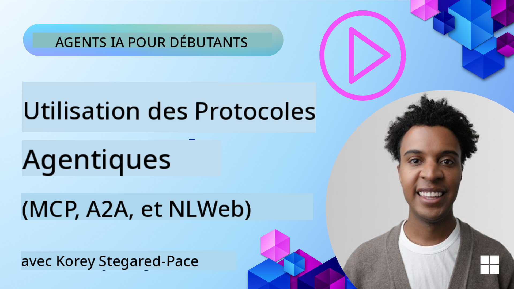
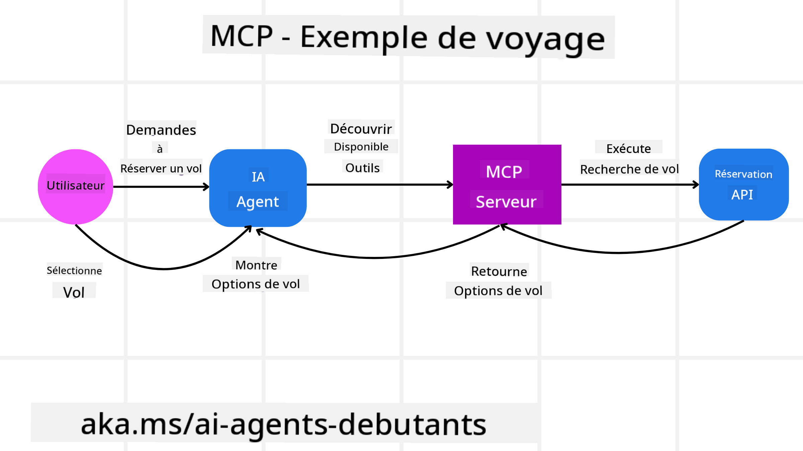
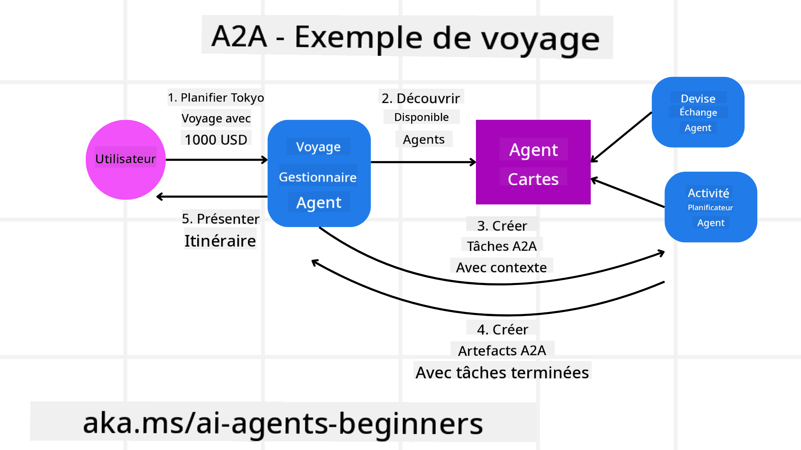
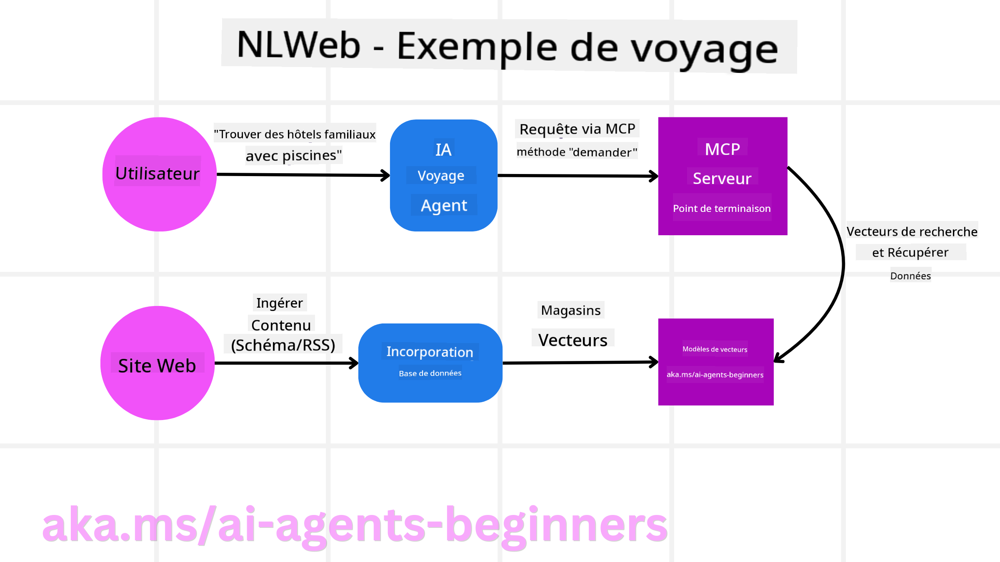

<!--
CO_OP_TRANSLATOR_METADATA:
{
  "original_hash": "5c05bcdfb163dfa2493db39dfb45ad9a",
  "translation_date": "2025-09-04T07:22:28+00:00",
  "source_file": "11-agentic-protocols/README.md",
  "language_code": "fr"
}
-->
# Utilisation des Protocoles Agentiques (MCP, A2A et NLWeb)

Avec l'augmentation de l'utilisation des agents IA, le besoin de protocoles garantissant la standardisation, la sécurité et favorisant l'innovation ouverte devient essentiel. Dans cette leçon, nous allons explorer trois protocoles répondant à ce besoin : le Model Context Protocol (MCP), l'Agent to Agent (A2A) et le Natural Language Web (NLWeb).

## Introduction

Dans cette leçon, nous allons aborder :

• Comment **MCP** permet aux agents IA d'accéder à des outils et données externes pour accomplir des tâches utilisateur.

• Comment **A2A** facilite la communication et la collaboration entre différents agents IA.

• Comment **NLWeb** apporte des interfaces en langage naturel à n'importe quel site web, permettant aux agents IA de découvrir et d'interagir avec le contenu.

## Objectifs d'apprentissage

• **Identifier** l'objectif principal et les avantages de MCP, A2A et NLWeb dans le contexte des agents IA.

• **Expliquer** comment chaque protocole facilite la communication et l'interaction entre les LLMs, les outils et les autres agents.

• **Reconnaître** les rôles distincts que chaque protocole joue dans la construction de systèmes agentiques complexes.

## Model Context Protocol

Le **Model Context Protocol (MCP)** est une norme ouverte qui fournit un moyen standardisé pour les applications de fournir un contexte et des outils aux LLMs. Cela permet un "adaptateur universel" pour différentes sources de données et outils auxquels les agents IA peuvent se connecter de manière cohérente.

Examinons les composants du MCP, ses avantages par rapport à l'utilisation directe des API, et un exemple de son utilisation par les agents IA.

### Composants principaux du MCP

MCP fonctionne sur une **architecture client-serveur**, et ses composants principaux sont :

• **Hôtes** : Ce sont des applications LLM (par exemple, un éditeur de code comme VSCode) qui initient les connexions à un serveur MCP.

• **Clients** : Ce sont des composants au sein de l'application hôte qui maintiennent des connexions individuelles avec les serveurs.

• **Serveurs** : Ce sont des programmes légers qui exposent des capacités spécifiques.

Le protocole inclut trois primitives principales qui représentent les capacités d'un serveur MCP :

• **Outils** : Ce sont des actions ou fonctions discrètes qu'un agent IA peut appeler pour effectuer une action. Par exemple, un service météo pourrait exposer un outil "obtenir la météo", ou un serveur e-commerce pourrait exposer un outil "acheter un produit". Les serveurs MCP annoncent le nom, la description et le schéma d'entrée/sortie de chaque outil dans leur liste de capacités.

• **Ressources** : Ce sont des éléments de données ou documents en lecture seule qu'un serveur MCP peut fournir, et que les clients peuvent récupérer à la demande. Les exemples incluent le contenu de fichiers, les enregistrements de bases de données ou les fichiers journaux. Les ressources peuvent être textuelles (comme du code ou du JSON) ou binaires (comme des images ou des PDF).

• **Prompts** : Ce sont des modèles prédéfinis qui fournissent des suggestions de prompts, permettant des workflows plus complexes.

### Avantages du MCP

MCP offre des avantages significatifs pour les agents IA :

• **Découverte dynamique d'outils** : Les agents peuvent recevoir dynamiquement une liste d'outils disponibles d'un serveur, accompagnée de descriptions de leurs fonctions. Cela contraste avec les API traditionnelles, qui nécessitent souvent un codage statique pour les intégrations, impliquant des mises à jour de code à chaque changement d'API. MCP propose une approche "intégrer une fois", offrant une plus grande adaptabilité.

• **Interopérabilité entre LLMs** : MCP fonctionne avec différents LLMs, offrant la flexibilité de changer de modèle principal pour évaluer de meilleures performances.

• **Sécurité standardisée** : MCP inclut une méthode d'authentification standard, simplifiant l'ajout d'accès à des serveurs MCP supplémentaires. Cela est plus simple que de gérer différentes clés et types d'authentification pour diverses API traditionnelles.

### Exemple de MCP

Imaginez qu'un utilisateur souhaite réserver un vol en utilisant un assistant IA alimenté par MCP.

1. **Connexion** : L'assistant IA (le client MCP) se connecte à un serveur MCP fourni par une compagnie aérienne.

2. **Découverte d'outils** : Le client demande au serveur MCP de la compagnie aérienne : "Quels outils avez-vous disponibles ?" Le serveur répond avec des outils comme "rechercher des vols" et "réserver des vols".

3. **Invocation d'outils** : Vous demandez ensuite à l'assistant IA : "Veuillez rechercher un vol de Portland à Honolulu." L'assistant IA, utilisant son LLM, identifie qu'il doit appeler l'outil "rechercher des vols" et transmet les paramètres pertinents (origine, destination) au serveur MCP.

4. **Exécution et réponse** : Le serveur MCP, agissant comme un wrapper, effectue l'appel réel à l'API interne de réservation de la compagnie aérienne. Il reçoit ensuite les informations sur les vols (par exemple, des données JSON) et les renvoie à l'assistant IA.

5. **Interaction supplémentaire** : L'assistant IA présente les options de vol. Une fois que vous sélectionnez un vol, l'assistant peut invoquer l'outil "réserver un vol" sur le même serveur MCP, finalisant la réservation.

## Protocole Agent-to-Agent (A2A)

Alors que MCP se concentre sur la connexion des LLMs aux outils, le **protocole Agent-to-Agent (A2A)** va plus loin en permettant la communication et la collaboration entre différents agents IA. A2A connecte des agents IA provenant de différentes organisations, environnements et piles technologiques pour accomplir une tâche commune.

Nous examinerons les composants et avantages de A2A, ainsi qu'un exemple de son application dans notre scénario de voyage.

### Composants principaux de A2A

A2A se concentre sur la communication entre agents et leur collaboration pour accomplir une sous-tâche utilisateur. Chaque composant du protocole contribue à cet objectif :

#### Carte d'Agent

De manière similaire à un serveur MCP partageant une liste d'outils, une Carte d'Agent contient :
- Le nom de l'agent.
- Une **description des tâches générales** qu'il accomplit.
- Une **liste de compétences spécifiques** avec des descriptions pour aider les autres agents (ou même les utilisateurs humains) à comprendre quand et pourquoi appeler cet agent.
- L'**URL de point de terminaison actuelle** de l'agent.
- La **version** et les **capacités** de l'agent, telles que les réponses en streaming et les notifications push.

#### Exécuteur d'Agent

L'Exécuteur d'Agent est responsable de **transmettre le contexte du chat utilisateur à l'agent distant**, afin que l'agent distant comprenne la tâche à accomplir. Dans un serveur A2A, un agent utilise son propre modèle de langage (LLM) pour analyser les requêtes entrantes et exécuter des tâches en utilisant ses propres outils internes.

#### Artefact

Une fois qu'un agent distant a accompli la tâche demandée, son produit de travail est créé sous forme d'artefact. Un artefact **contient le résultat du travail de l'agent**, une **description de ce qui a été accompli**, et le **contexte textuel** transmis via le protocole. Après l'envoi de l'artefact, la connexion avec l'agent distant est fermée jusqu'à ce qu'elle soit à nouveau nécessaire.

#### File d'Événements

Ce composant est utilisé pour **gérer les mises à jour et transmettre les messages**. Il est particulièrement important en production pour les systèmes agentiques afin d'éviter que la connexion entre agents ne soit fermée avant qu'une tâche soit terminée, surtout lorsque les temps d'exécution peuvent être longs.

### Avantages de A2A

• **Collaboration améliorée** : Il permet aux agents de différents fournisseurs et plateformes d'interagir, de partager le contexte et de travailler ensemble, facilitant une automatisation fluide entre des systèmes traditionnellement déconnectés.

• **Flexibilité dans le choix des modèles** : Chaque agent A2A peut décider quel LLM utiliser pour traiter ses requêtes, permettant des modèles optimisés ou ajustés pour chaque agent, contrairement à une connexion unique à un LLM dans certains scénarios MCP.

• **Authentification intégrée** : L'authentification est directement intégrée au protocole A2A, offrant un cadre de sécurité robuste pour les interactions entre agents.

### Exemple de A2A

Reprenons notre scénario de réservation de voyage, mais cette fois en utilisant A2A.

1. **Demande utilisateur à un multi-agent** : Un utilisateur interagit avec un "Agent de Voyage" client/agent A2A, en disant par exemple : "Veuillez réserver un voyage complet à Honolulu pour la semaine prochaine, incluant les vols, un hôtel et une voiture de location."

2. **Orchestration par l'Agent de Voyage** : L'Agent de Voyage reçoit cette demande complexe. Il utilise son LLM pour réfléchir à la tâche et déterminer qu'il doit interagir avec d'autres agents spécialisés.

3. **Communication inter-agents** : L'Agent de Voyage utilise le protocole A2A pour se connecter à des agents en aval, tels qu'un "Agent Compagnie Aérienne", un "Agent Hôtel" et un "Agent Location de Voiture" créés par différentes entreprises.

4. **Exécution des tâches déléguées** : L'Agent de Voyage envoie des tâches spécifiques à ces agents spécialisés (par exemple, "Trouver des vols pour Honolulu", "Réserver un hôtel", "Louer une voiture"). Chacun de ces agents spécialisés, utilisant ses propres LLMs et outils (qui pourraient eux-mêmes être des serveurs MCP), accomplit sa partie spécifique de la réservation.

5. **Réponse consolidée** : Une fois que tous les agents en aval ont terminé leurs tâches, l'Agent de Voyage compile les résultats (détails du vol, confirmation de l'hôtel, réservation de voiture) et envoie une réponse complète, sous forme de chat, à l'utilisateur.

## Natural Language Web (NLWeb)

Les sites web ont longtemps été le moyen principal pour les utilisateurs d'accéder à des informations et données sur Internet.

Examinons les différents composants de NLWeb, ses avantages, et un exemple de son fonctionnement dans notre application de voyage.

### Composants de NLWeb

- **Application NLWeb (Code de service principal)** : Le système qui traite les questions en langage naturel. Il connecte les différentes parties de la plateforme pour créer des réponses. Vous pouvez le considérer comme le **moteur qui alimente les fonctionnalités en langage naturel** d'un site web.

- **Protocole NLWeb** : Il s'agit d'un **ensemble de règles de base pour l'interaction en langage naturel** avec un site web. Il renvoie des réponses au format JSON (souvent en utilisant Schema.org). Son objectif est de créer une base simple pour le "Web IA", de la même manière que HTML a permis de partager des documents en ligne.

- **Serveur MCP (Point de terminaison du Model Context Protocol)** : Chaque configuration NLWeb fonctionne également comme un **serveur MCP**. Cela signifie qu'il peut **partager des outils (comme une méthode "ask") et des données** avec d'autres systèmes IA. En pratique, cela rend le contenu et les capacités du site utilisables par des agents IA, permettant au site de devenir une partie intégrante de l'écosystème des agents.

- **Modèles d'Embedding** : Ces modèles sont utilisés pour **convertir le contenu du site web en représentations numériques appelées vecteurs** (embeddings). Ces vecteurs capturent le sens d'une manière que les ordinateurs peuvent comparer et rechercher. Ils sont stockés dans une base de données spéciale, et les utilisateurs peuvent choisir le modèle d'embedding qu'ils souhaitent utiliser.

- **Base de données vectorielle (Mécanisme de récupération)** : Cette base de données **stocke les embeddings du contenu du site web**. Lorsqu'une personne pose une question, NLWeb vérifie la base de données vectorielle pour trouver rapidement les informations les plus pertinentes. Il fournit une liste rapide de réponses possibles, classées par similarité. NLWeb fonctionne avec différents systèmes de stockage vectoriel tels que Qdrant, Snowflake, Milvus, Azure AI Search et Elasticsearch.

### NLWeb par exemple

Considérons à nouveau notre site de réservation de voyage, mais cette fois alimenté par NLWeb.

1. **Ingestion de données** : Les catalogues de produits existants du site de voyage (par exemple, listes de vols, descriptions d'hôtels, forfaits touristiques) sont formatés en utilisant Schema.org ou chargés via des flux RSS. Les outils de NLWeb ingèrent ces données structurées, créent des embeddings et les stockent dans une base de données vectorielle locale ou distante.

2. **Requête en langage naturel (Humain)** : Un utilisateur visite le site et, au lieu de naviguer dans les menus, tape dans une interface de chat : "Trouvez-moi un hôtel familial à Honolulu avec une piscine pour la semaine prochaine".

3. **Traitement NLWeb** : L'application NLWeb reçoit cette requête. Elle envoie la requête à un LLM pour la comprendre et recherche simultanément dans sa base de données vectorielle les listes d'hôtels pertinents.

4. **Résultats précis** : Le LLM aide à interpréter les résultats de recherche de la base de données, identifie les meilleures correspondances basées sur les critères "familial", "piscine" et "Honolulu", puis formate une réponse en langage naturel. Essentiellement, la réponse fait référence à des hôtels réels du catalogue du site, évitant les informations inventées.

5. **Interaction avec les agents IA** : Étant donné que NLWeb fonctionne comme un serveur MCP, un agent IA externe de voyage pourrait également se connecter à l'instance NLWeb de ce site. L'agent IA pourrait alors utiliser la méthode `ask` de MCP pour interroger directement le site : `ask("Y a-t-il des restaurants vegan-friendly dans la région de Honolulu recommandés par l'hôtel ?")`. L'instance NLWeb traiterait cela, en exploitant sa base de données d'informations sur les restaurants (si chargée), et renverrait une réponse structurée en JSON.

### Vous avez des questions sur MCP/A2A/NLWeb ?

Rejoignez le [Discord Azure AI Foundry](https://aka.ms/ai-agents/discord) pour rencontrer d'autres apprenants, assister à des heures de bureau et obtenir des réponses à vos questions sur les agents IA.

## Ressources

- [MCP pour les débutants](https://aka.ms/mcp-for-beginners)  
- [Documentation MCP](https://github.com/microsoft/semantic-kernel/tree/main/python/semantic-kernel/semantic_kernel/connectors/mcp)
- [Repo NLWeb](https://github.com/nlweb-ai/NLWeb)
- [Guides Semantic Kernel](https://learn.microsoft.com/semantic-kernel/)

---

**Avertissement** :  
Ce document a été traduit à l'aide du service de traduction automatique [Co-op Translator](https://github.com/Azure/co-op-translator). Bien que nous nous efforcions d'assurer l'exactitude, veuillez noter que les traductions automatisées peuvent contenir des erreurs ou des inexactitudes. Le document original dans sa langue d'origine doit être considéré comme la source faisant autorité. Pour des informations critiques, il est recommandé de faire appel à une traduction humaine professionnelle. Nous déclinons toute responsabilité en cas de malentendus ou d'interprétations erronées résultant de l'utilisation de cette traduction.