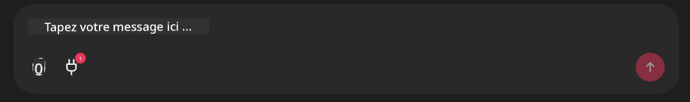

<!--
CO_OP_TRANSLATOR_METADATA:
{
  "original_hash": "9bf0395cbc541ce8db2a9699c8678dfc",
  "translation_date": "2025-08-28T09:56:18+00:00",
  "source_file": "11-agentic-protocols/code_samples/github-mcp/README.md",
  "language_code": "fr"
}
-->
# Exemple de serveur MCP Github

## Description

Ceci est une démonstration créée pour le Hackathon des Agents IA organisé par le Microsoft Reactor.

L'outil est utilisé pour recommander des projets de hackathon en fonction des dépôts Github d'un utilisateur. Cela se fait par :

1. **Agent Github** - Utilise le serveur MCP Github pour récupérer les dépôts et des informations sur ces dépôts.
2. **Agent Hackathon** - Utilise les données de l'agent Github pour proposer des idées créatives de projets de hackathon basées sur les projets, les langages utilisés par l'utilisateur et les pistes de projet du hackathon des Agents IA.
3. **Agent Événements** - Sur la base des suggestions de l'agent hackathon, l'agent événements recommandera des événements pertinents de la série de hackathons des Agents IA.

## Exécution du code 

### Variables d'environnement

Cette démonstration utilise Azure Open AI Service, Semantic Kernel, le serveur MCP Github et Azure AI Search.

Assurez-vous d'avoir défini les variables d'environnement nécessaires pour utiliser ces outils :

```python
AZURE_OPENAI_CHAT_DEPLOYMENT_NAME=""
AZURE_OPENAI_EMBEDDING_DEPLOYMENT_NAME=""
AZURE_OPENAI_ENDPOINT=""
AZURE_OPENAI_API_KEY=""
AZURE_OPENAI_API_VERSION=""
AZURE_SEARCH_SERVICE_ENDPOINT=""
AZURE_SEARCH_API_KEY=""
``` 

## Exécution du serveur Chainlit

Pour se connecter au serveur MCP, cette démonstration utilise Chainlit comme interface de chat.

Pour exécuter le serveur, utilisez la commande suivante dans votre terminal :

```bash
chainlit run app.py -w
```

Cela devrait démarrer votre serveur Chainlit sur `localhost:8000` et également remplir votre index Azure AI Search avec le contenu de `event-descriptions.md`.

## Connexion au serveur MCP

Pour se connecter au serveur MCP Github, sélectionnez l'icône "prise" sous la boîte de dialogue "Tapez votre message ici...":



À partir de là, vous pouvez cliquer sur "Connecter un MCP" pour ajouter la commande permettant de se connecter au serveur MCP Github :

```bash
npx -y @modelcontextprotocol/server-github --env GITHUB_PERSONAL_ACCESS_TOKEN=[YOUR PERSONAL ACCESS TOKEN]
```

Remplacez "[YOUR PERSONAL ACCESS TOKEN]" par votre véritable jeton d'accès personnel.

Après la connexion, vous devriez voir un (1) à côté de l'icône de prise pour confirmer que la connexion est établie. Si ce n'est pas le cas, essayez de redémarrer le serveur Chainlit avec `chainlit run app.py -w`.

## Utilisation de la démonstration 

Pour démarrer le workflow de l'agent qui recommande des projets de hackathon, vous pouvez taper un message comme :

"Recommander des projets de hackathon pour l'utilisateur Github koreyspace"

L'Agent Routeur analysera votre demande et déterminera quelle combinaison d'agents (GitHub, Hackathon et Événements) est la mieux adaptée pour traiter votre requête. Les agents travaillent ensemble pour fournir des recommandations complètes basées sur l'analyse des dépôts Github, la génération d'idées de projets et les événements technologiques pertinents.

---

**Avertissement** :  
Ce document a été traduit à l'aide du service de traduction automatique [Co-op Translator](https://github.com/Azure/co-op-translator). Bien que nous nous efforcions d'assurer l'exactitude, veuillez noter que les traductions automatisées peuvent contenir des erreurs ou des inexactitudes. Le document original dans sa langue d'origine doit être considéré comme la source faisant autorité. Pour des informations critiques, il est recommandé de faire appel à une traduction professionnelle réalisée par un humain. Nous déclinons toute responsabilité en cas de malentendus ou d'interprétations erronées résultant de l'utilisation de cette traduction.