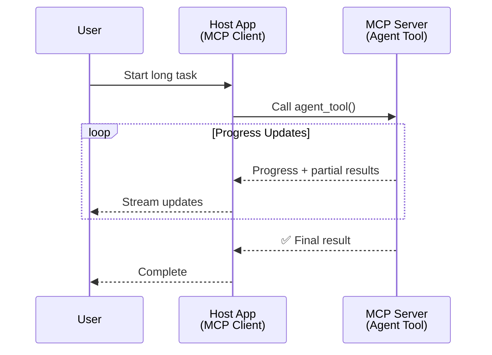
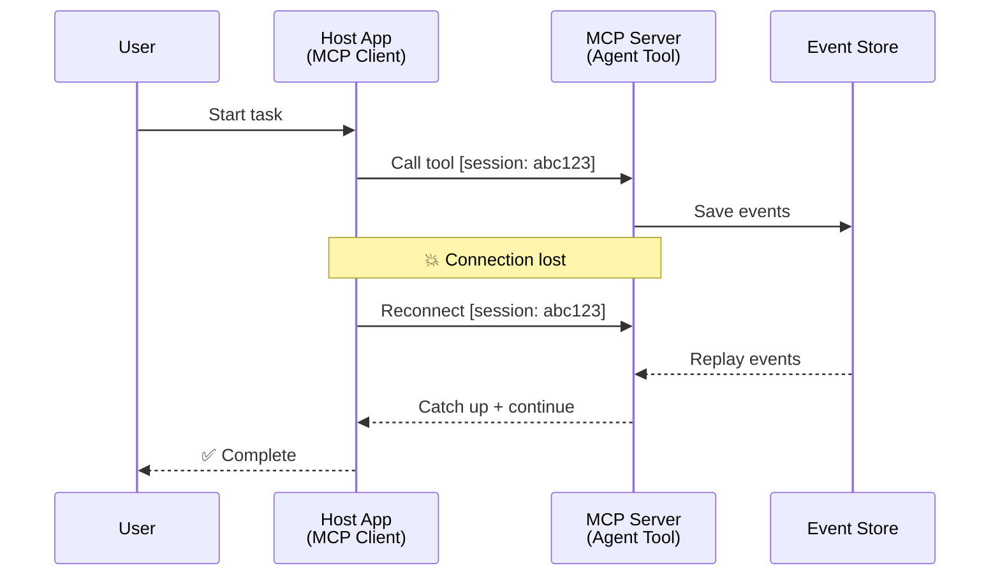
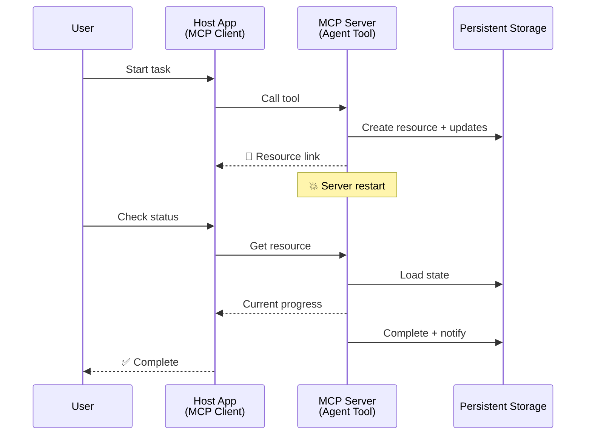
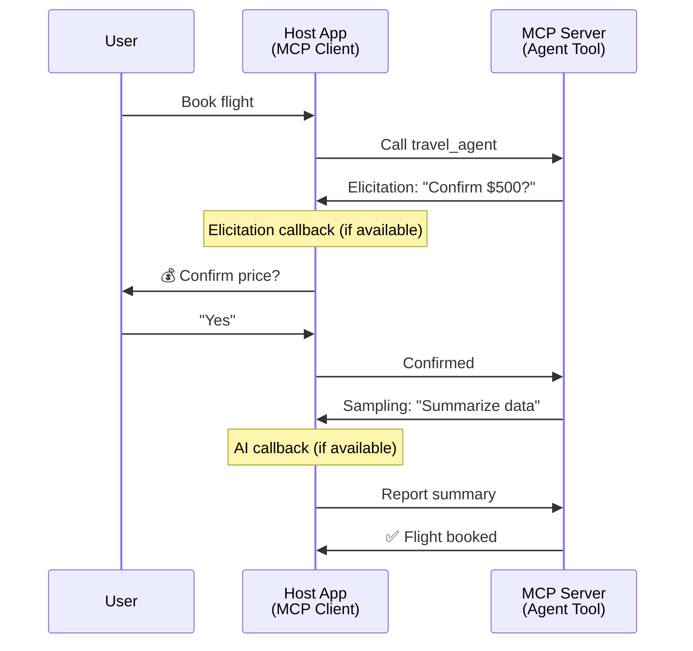
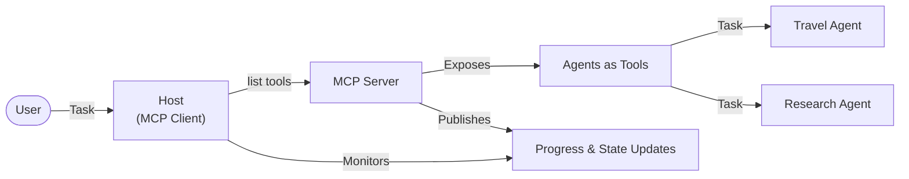

<!--
CO_OP_TRANSLATOR_METADATA:
{
  "original_hash": "5cc6836626047aa055e8960c8484a7d0",
  "translation_date": "2025-08-28T09:54:46+00:00",
  "source_file": "11-agentic-protocols/code_samples/mcp-agents/README.md",
  "language_code": "fr"
}
-->
# Construire des systèmes de communication entre agents avec MCP

> TL;DR - Peut-on construire une communication Agent2Agent avec MCP ? Oui !

MCP a considérablement évolué au-delà de son objectif initial de "fournir un contexte aux LLMs". Avec des améliorations récentes telles que les [flux reprenables](https://modelcontextprotocol.io/docs/concepts/transports#resumability-and-redelivery), [l'élucidation](https://modelcontextprotocol.io/specification/2025-06-18/client/elicitation), [l'échantillonnage](https://modelcontextprotocol.io/specification/2025-06-18/client/sampling), et les notifications ([progrès](https://modelcontextprotocol.io/specification/2025-06-18/basic/utilities/progress) et [ressources](https://modelcontextprotocol.io/specification/2025-06-18/schema#resourceupdatednotification)), MCP offre désormais une base solide pour construire des systèmes complexes de communication entre agents.

## La confusion entre Agent et Outil

À mesure que de plus en plus de développeurs explorent des outils avec des comportements agentiques (fonctionnement sur de longues périodes, nécessitant éventuellement des entrées supplémentaires en cours d'exécution, etc.), une idée reçue fréquente est que MCP ne convient pas, principalement parce que les premiers exemples de son concept d'outil se concentraient sur des modèles simples de requête-réponse.

Cette perception est dépassée. La spécification MCP a été considérablement enrichie ces derniers mois avec des fonctionnalités qui comblent les lacunes pour construire des comportements agentiques de longue durée :

- **Streaming et résultats partiels** : Mises à jour en temps réel pendant l'exécution
- **Reprise** : Les clients peuvent se reconnecter et continuer après une déconnexion
- **Durabilité** : Les résultats survivent aux redémarrages du serveur (par exemple, via des liens de ressources)
- **Multi-tours** : Entrées interactives en cours d'exécution via l'élucidation et l'échantillonnage

Ces fonctionnalités peuvent être combinées pour permettre des applications agentiques et multi-agents complexes, toutes déployées sur le protocole MCP.

Pour référence, nous désignerons un agent comme un "outil" disponible sur un serveur MCP. Cela implique l'existence d'une application hôte qui implémente un client MCP établissant une session avec le serveur MCP et pouvant appeler l'agent.

## Qu'est-ce qui rend un outil MCP "agentique" ?

Avant de plonger dans l'implémentation, définissons les capacités d'infrastructure nécessaires pour prendre en charge des agents de longue durée.

> Nous définirons un agent comme une entité capable de fonctionner de manière autonome sur de longues périodes, capable de gérer des tâches complexes nécessitant plusieurs interactions ou ajustements basés sur des retours en temps réel.

### 1. Streaming et résultats partiels

Les modèles traditionnels de requête-réponse ne fonctionnent pas pour les tâches de longue durée. Les agents doivent fournir :

- Des mises à jour en temps réel sur les progrès
- Des résultats intermédiaires

**Support MCP** : Les notifications de mise à jour des ressources permettent de diffuser des résultats partiels, bien que cela nécessite une conception minutieuse pour éviter les conflits avec le modèle 1:1 de requête/réponse de JSON-RPC.

| Fonctionnalité             | Cas d'utilisation                                                                                                                                                              | Support MCP                                                                                 |
| -------------------------- | ------------------------------------------------------------------------------------------------------------------------------------------------------------------------------ | ------------------------------------------------------------------------------------------ |
| Mises à jour en temps réel | L'utilisateur demande une tâche de migration de code. L'agent diffuse les progrès : "10 % - Analyse des dépendances... 25 % - Conversion des fichiers TypeScript... 50 %..." | ✅ Notifications de progrès                                                                 |
| Résultats partiels         | Une tâche "Générer un livre" diffuse des résultats partiels, par exemple : 1) Plan de l'intrigue, 2) Liste des chapitres, 3) Chaque chapitre au fur et à mesure de sa création. | ✅ Notifications pouvant inclure des résultats partiels (voir propositions PR 383, 776)    |

<div align="center" style="font-style: italic; font-size: 0.95em; margin-bottom: 0.5em;">
<strong>Figure 1 :</strong> Ce diagramme illustre comment un agent MCP diffuse des mises à jour en temps réel et des résultats partiels à l'application hôte pendant une tâche de longue durée, permettant à l'utilisateur de suivre l'exécution en temps réel.
</div>



### 2. Reprise

Les agents doivent gérer les interruptions réseau de manière fluide :

- Reconnexion après une déconnexion (client)
- Reprise à partir de l'état précédent (rediffusion des messages)

**Support MCP** : Le transport StreamableHTTP de MCP prend en charge aujourd'hui la reprise de session et la rediffusion des messages avec des identifiants de session et des identifiants de dernier événement. Il est important de noter que le serveur doit implémenter un EventStore permettant la rediffusion des événements lors de la reconnexion du client.  
Notez qu'il existe une proposition communautaire (PR #975) explorant des flux reprenables indépendants du transport.

| Fonctionnalité | Cas d'utilisation                                                                                                                                      | Support MCP                                                                |
| -------------- | ----------------------------------------------------------------------------------------------------------------------------------------------------- | -------------------------------------------------------------------------- |
| Reprise        | Le client se déconnecte pendant une tâche de longue durée. Lors de la reconnexion, la session reprend avec les événements manqués rediffusés.         | ✅ Transport StreamableHTTP avec identifiants de session, rediffusion et EventStore |

<div align="center" style="font-style: italic; font-size: 0.95em; margin-bottom: 0.5em;">
<strong>Figure 2 :</strong> Ce diagramme montre comment le transport StreamableHTTP de MCP et le stockage d'événements permettent une reprise de session fluide : si le client se déconnecte, il peut se reconnecter et rejouer les événements manqués, poursuivant la tâche sans perte de progrès.
</div>



### 3. Durabilité

Les agents de longue durée nécessitent un état persistant :

- Les résultats survivent aux redémarrages du serveur
- Le statut peut être récupéré hors ligne
- Suivi des progrès entre les sessions

**Support MCP** : MCP prend désormais en charge un type de retour de lien de ressource pour les appels d'outils. Aujourd'hui, un modèle possible consiste à concevoir un outil qui crée une ressource et renvoie immédiatement un lien de ressource. L'outil peut continuer à traiter la tâche en arrière-plan et mettre à jour la ressource. En retour, le client peut choisir de sonder l'état de cette ressource pour obtenir des résultats partiels ou complets (en fonction des mises à jour de ressources fournies par le serveur) ou de s'abonner à la ressource pour recevoir des notifications de mise à jour.

Une limitation ici est que le sondage des ressources ou l'abonnement aux mises à jour peut consommer des ressources avec des implications à grande échelle. Il existe une proposition communautaire ouverte (y compris #992) explorant la possibilité d'inclure des webhooks ou des déclencheurs que le serveur peut appeler pour notifier l'application cliente/hôte des mises à jour.

| Fonctionnalité | Cas d'utilisation                                                                                                                                      | Support MCP                                                        |
| -------------- | ----------------------------------------------------------------------------------------------------------------------------------------------------- | ------------------------------------------------------------------ |
| Durabilité     | Le serveur plante pendant une tâche de migration de données. Les résultats et les progrès survivent au redémarrage, le client peut vérifier le statut. | ✅ Liens de ressources avec stockage persistant et notifications de statut |

Aujourd'hui, un modèle courant consiste à concevoir un outil qui crée une ressource et renvoie immédiatement un lien de ressource. L'outil peut en arrière-plan traiter la tâche, émettre des notifications de ressources servant de mises à jour de progrès ou inclure des résultats partiels, et mettre à jour le contenu de la ressource selon les besoins.

<div align="center" style="font-style: italic; font-size: 0.95em; margin-bottom: 0.5em;">
<strong>Figure 3 :</strong> Ce diagramme montre comment les agents MCP utilisent des ressources persistantes et des notifications de statut pour garantir que les tâches de longue durée survivent aux redémarrages du serveur, permettant aux clients de suivre les progrès et de récupérer les résultats même après des échecs.
</div>



### 4. Interactions multi-tours

Les agents ont souvent besoin d'entrées supplémentaires en cours d'exécution :

- Clarification ou approbation humaine
- Assistance IA pour des décisions complexes
- Ajustement dynamique des paramètres

**Support MCP** : Entièrement pris en charge via l'échantillonnage (pour les entrées IA) et l'élucidation (pour les entrées humaines).

| Fonctionnalité             | Cas d'utilisation                                                                                                                         | Support MCP                                           |
| -------------------------- | ----------------------------------------------------------------------------------------------------------------------------------------- | ----------------------------------------------------- |
| Interactions multi-tours   | Un agent de réservation de voyage demande une confirmation de prix à l'utilisateur, puis demande à l'IA de résumer les données avant de finaliser. | ✅ Élucidation pour les entrées humaines, échantillonnage pour les entrées IA |

<div align="center" style="font-style: italic; font-size: 0.95em; margin-bottom: 0.5em;">
<strong>Figure 4 :</strong> Ce diagramme montre comment les agents MCP peuvent interagir de manière interactive pour obtenir des entrées humaines ou demander une assistance IA en cours d'exécution, soutenant des flux de travail complexes et multi-tours tels que les confirmations et la prise de décision dynamique.
</div>



## Implémentation d'agents de longue durée sur MCP - Aperçu du code

Dans le cadre de cet article, nous fournissons un [dépôt de code](https://github.com/victordibia/ai-tutorials/tree/main/MCP%20Agents) contenant une implémentation complète d'agents de longue durée utilisant le SDK Python MCP avec le transport StreamableHTTP pour la reprise de session et la rediffusion des messages. L'implémentation montre comment les capacités de MCP peuvent être combinées pour permettre des comportements sophistiqués de type agent.

En particulier, nous implémentons un serveur avec deux outils d'agent principaux :

- **Agent de voyage** - Simule un service de réservation de voyage avec confirmation de prix via élucidation
- **Agent de recherche** - Effectue des tâches de recherche avec des résumés assistés par IA via échantillonnage

Les deux agents démontrent des mises à jour en temps réel, des confirmations interactives et des capacités complètes de reprise de session.

### Concepts clés de l'implémentation

Les sections suivantes montrent l'implémentation côté serveur des agents et la gestion côté client hôte pour chaque capacité :

#### Streaming et mises à jour de progrès - Statut des tâches en temps réel

Le streaming permet aux agents de fournir des mises à jour en temps réel sur les progrès pendant les tâches de longue durée, tenant les utilisateurs informés du statut et des résultats intermédiaires.

**Implémentation côté serveur (l'agent envoie des notifications de progrès) :**

```python
# From server/server.py - Travel agent sending progress updates
for i, step in enumerate(steps):
    await ctx.session.send_progress_notification(
        progress_token=ctx.request_id,
        progress=i * 25,
        total=100,
        message=step,
        related_request_id=str(ctx.request_id)
    )
    await anyio.sleep(2)  # Simulate work

# Alternative: Log messages for detailed step-by-step updates
await ctx.session.send_log_message(
    level="info",
    data=f"Processing step {current_step}/{steps} ({progress_percent}%)",
    logger="long_running_agent",
    related_request_id=ctx.request_id,
)
```

**Implémentation côté client (l'hôte reçoit les mises à jour de progrès) :**

```python
# From client/client.py - Client handling real-time notifications
async def message_handler(message) -> None:
    if isinstance(message, types.ServerNotification):
        if isinstance(message.root, types.LoggingMessageNotification):
            console.print(f"📡 [dim]{message.root.params.data}[/dim]")
        elif isinstance(message.root, types.ProgressNotification):
            progress = message.root.params
            console.print(f"🔄 [yellow]{progress.message} ({progress.progress}/{progress.total})[/yellow]")

# Register message handler when creating session
async with ClientSession(
    read_stream, write_stream,
    message_handler=message_handler
) as session:
```

#### Élucidation - Demande d'entrée utilisateur

L'élucidation permet aux agents de demander des entrées utilisateur en cours d'exécution. Cela est essentiel pour les confirmations, clarifications ou approbations pendant les tâches de longue durée.

**Implémentation côté serveur (l'agent demande une confirmation) :**

```python
# From server/server.py - Travel agent requesting price confirmation
elicit_result = await ctx.session.elicit(
    message=f"Please confirm the estimated price of $1200 for your trip to {destination}",
    requestedSchema=PriceConfirmationSchema.model_json_schema(),
    related_request_id=ctx.request_id,
)

if elicit_result and elicit_result.action == "accept":
    # Continue with booking
    logger.info(f"User confirmed price: {elicit_result.content}")
elif elicit_result and elicit_result.action == "decline":
    # Cancel the booking
    booking_cancelled = True
```

**Implémentation côté client (l'hôte fournit un rappel d'élucidation) :**

```python
# From client/client.py - Client handling elicitation requests
async def elicitation_callback(context, params):
    console.print(f"💬 Server is asking for confirmation:")
    console.print(f"   {params.message}")

    response = console.input("Do you accept? (y/n): ").strip().lower()

    if response in ['y', 'yes']:
        return types.ElicitResult(
            action="accept",
            content={"confirm": True, "notes": "Confirmed by user"}
        )
    else:
        return types.ElicitResult(
            action="decline",
            content={"confirm": False, "notes": "Declined by user"}
        )

# Register the callback when creating the session
async with ClientSession(
    read_stream, write_stream,
    elicitation_callback=elicitation_callback
) as session:
```

#### Échantillonnage - Demande d'assistance IA

L'échantillonnage permet aux agents de demander une assistance LLM pour des décisions complexes ou la génération de contenu pendant l'exécution. Cela permet des flux de travail hybrides humain-IA.

**Implémentation côté serveur (l'agent demande une assistance IA) :**

```python
# From server/server.py - Research agent requesting AI summary
sampling_result = await ctx.session.create_message(
    messages=[
        SamplingMessage(
            role="user",
            content=TextContent(type="text", text=f"Please summarize the key findings for research on: {topic}")
        )
    ],
    max_tokens=100,
    related_request_id=ctx.request_id,
)

if sampling_result and sampling_result.content:
    if sampling_result.content.type == "text":
        sampling_summary = sampling_result.content.text
        logger.info(f"Received sampling summary: {sampling_summary}")
```

**Implémentation côté client (l'hôte fournit un rappel d'échantillonnage) :**

```python
# From client/client.py - Client handling sampling requests
async def sampling_callback(context, params):
    message_text = params.messages[0].content.text if params.messages else 'No message'
    console.print(f"🧠 Server requested sampling: {message_text}")

    # In a real application, this could call an LLM API
    # For demo purposes, we provide a mock response
    mock_response = "Based on current research, MCP has evolved significantly..."

    return types.CreateMessageResult(
        role="assistant",
        content=types.TextContent(type="text", text=mock_response),
        model="interactive-client",
        stopReason="endTurn"
    )

# Register the callback when creating the session
async with ClientSession(
    read_stream, write_stream,
    sampling_callback=sampling_callback,
    elicitation_callback=elicitation_callback
) as session:
```

#### Reprise - Continuité de session en cas de déconnexions

La reprise garantit que les tâches d'agent de longue durée peuvent survivre aux déconnexions du client et continuer sans interruption lors de la reconnexion. Cela est implémenté via des magasins d'événements et des jetons de reprise.

**Implémentation du magasin d'événements (le serveur conserve l'état de la session) :**

```python
# From server/event_store.py - Simple in-memory event store
class SimpleEventStore(EventStore):
    def __init__(self):
        self._events: list[tuple[StreamId, EventId, JSONRPCMessage]] = []
        self._event_id_counter = 0

    async def store_event(self, stream_id: StreamId, message: JSONRPCMessage) -> EventId:
        """Store an event and return its ID."""
        self._event_id_counter += 1
        event_id = str(self._event_id_counter)
        self._events.append((stream_id, event_id, message))
        return event_id

    async def replay_events_after(self, last_event_id: EventId, send_callback: EventCallback) -> StreamId | None:
        """Replay events after the specified ID for resumption."""
        # Find events after the last known event and replay them
        for _, event_id, message in self._events[start_index:]:
            await send_callback(EventMessage(message, event_id))

# From server/server.py - Passing event store to session manager
def create_server_app(event_store: Optional[EventStore] = None) -> Starlette:
    server = ResumableServer()

    # Create session manager with event store for resumption
    session_manager = StreamableHTTPSessionManager(
        app=server,
        event_store=event_store,  # Event store enables session resumption
        json_response=False,
        security_settings=security_settings,
    )

    return Starlette(routes=[Mount("/mcp", app=session_manager.handle_request)])

# Usage: Initialize with event store
event_store = SimpleEventStore()
app = create_server_app(event_store)
```

**Métadonnées côté client avec jeton de reprise (le client se reconnecte en utilisant l'état stocké) :**

```python
# From client/client.py - Client resumption with metadata
if existing_tokens and existing_tokens.get("resumption_token"):
    # Use existing resumption token to continue where we left off
    metadata = ClientMessageMetadata(
        resumption_token=existing_tokens["resumption_token"],
    )
else:
    # Create callback to save resumption token when received
    def enhanced_callback(token: str):
        protocol_version = getattr(session, 'protocol_version', None)
        token_manager.save_tokens(session_id, token, protocol_version, command, args)

    metadata = ClientMessageMetadata(
        on_resumption_token_update=enhanced_callback,
    )

# Send request with resumption metadata
result = await session.send_request(
    types.ClientRequest(
        types.CallToolRequest(
            method="tools/call",
            params=types.CallToolRequestParams(name=command, arguments=args)
        )
    ),
    types.CallToolResult,
    metadata=metadata,
)
```

L'application hôte maintient localement les identifiants de session et les jetons de reprise, lui permettant de se reconnecter à des sessions existantes sans perdre de progrès ou d'état.

### Organisation du code

<div align="center" style="font-style: italic; font-size: 0.95em; margin-bottom: 0.5em;">
<strong>Figure 5 :</strong> Architecture du système d'agents basé sur MCP
</div>



**Fichiers clés :**

- **`server/server.py`** - Serveur MCP reprenable avec des agents de voyage et de recherche démontrant l'élucidation, l'échantillonnage et les mises à jour de progrès
- **`client/client.py`** - Application hôte interactive avec prise en charge de la reprise, gestion des rappels et gestion des jetons
- **`server/event_store.py`** - Implémentation du magasin d'événements permettant la reprise de session et la rediffusion des messages

## Extension à la communication multi-agents sur MCP

L'implémentation ci-dessus peut être étendue à des systèmes multi-agents en enrichissant l'intelligence et la portée de l'application hôte :

- **Décomposition intelligente des tâches** : L'hôte analyse les demandes complexes des utilisateurs et les divise en sous-tâches pour différents agents spécialisés
- **Coordination multi-serveurs** : L'hôte maintient des connexions à plusieurs serveurs MCP, chacun exposant différentes capacités d'agent
- **Gestion de l'état des tâches** : L'hôte suit les progrès de plusieurs tâches d'agent simultanées, gérant les dépendances et le séquencement
- **Résilience et reprises** : L'hôte gère les échecs, implémente une logique de reprise et redirige les tâches lorsque des agents deviennent indisponibles
- **Synthèse des résultats** : L'hôte combine les sorties de plusieurs agents en résultats finaux cohérents

L'hôte évolue d'un simple client à un orchestrateur intelligent, coordonnant les capacités distribuées des agents tout en maintenant la même base protocolaire MCP.

## Conclusion

Les capacités améliorées de MCP - notifications de ressources, élucidation/échantillonnage, flux reprenables et ressources persistantes - permettent des interactions complexes entre agents tout en maintenant la simplicité du protocole.

## Premiers pas

Prêt à construire votre propre système agent2agent ? Suivez ces étapes :

### 1. Exécutez la démo

```bash
# Start the server with event store for resumption
python -m server.server --port 8006

# In another terminal, run the interactive client
python -m client.client --url http://127.0.0.1:8006/mcp
```

**Commandes disponibles en mode interactif :**

- `travel_agent` - Réserver un voyage avec confirmation de prix via élucidation
- `research_agent` - Rechercher des sujets avec des résumés assistés par IA via échantillonnage
- `list` - Afficher tous les outils disponibles
- `clean-tokens` - Effacer les jetons de reprise
- `help` - Afficher l'aide détaillée des commandes
- `quit` - Quitter le client

### 2. Testez les capacités de reprise

- Lancez un agent de longue durée (par exemple, `travel_agent`)
- Interrompez le client pendant l'exécution (Ctrl+C)
- Redémarrez le client - il reprendra automatiquement là où il s'était arrêté

### 3. Explorez et étendez

- **Explorez les exemples** : Consultez ce [mcp-agents](https://github.com/victordibia/ai-tutorials/tree/main/MCP%20Agents)
- **Rejoignez la communauté** : Participez aux discussions MCP sur GitHub
- **Expérimentez** : Commencez par une tâche simple de longue durée et ajoutez progressivement le streaming, la reprise et la coordination multi-agents

Cela démontre comment MCP permet des comportements intelligents d'agent tout en maintenant la simplicité basée sur les outils.

Dans l'ensemble, la spécification du protocole MCP évolue rapidement ; le lecteur est encouragé à consulter le site officiel de documentation pour les mises à jour les plus récentes - https://modelcontextprotocol.io/introduction

---

**Avertissement** :  
Ce document a été traduit à l'aide du service de traduction automatique [Co-op Translator](https://github.com/Azure/co-op-translator). Bien que nous nous efforcions d'assurer l'exactitude, veuillez noter que les traductions automatisées peuvent contenir des erreurs ou des inexactitudes. Le document original dans sa langue d'origine doit être considéré comme la source faisant autorité. Pour des informations critiques, il est recommandé de recourir à une traduction professionnelle réalisée par un humain. Nous déclinons toute responsabilité en cas de malentendus ou d'interprétations erronées résultant de l'utilisation de cette traduction.