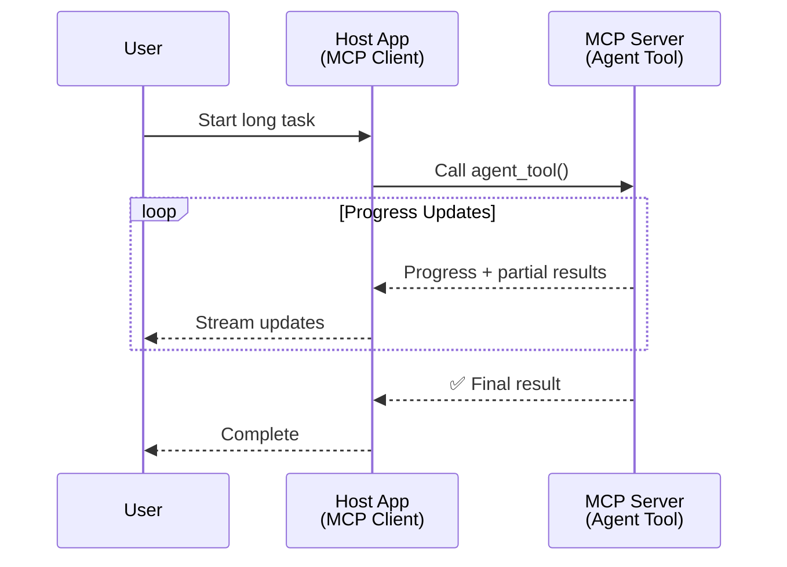
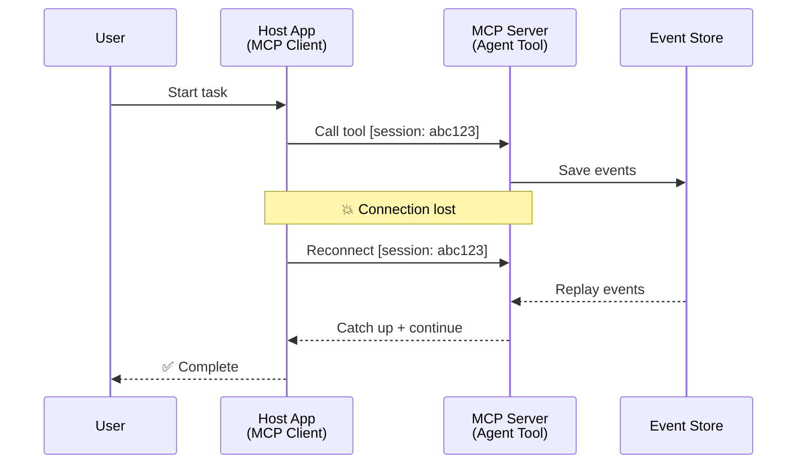
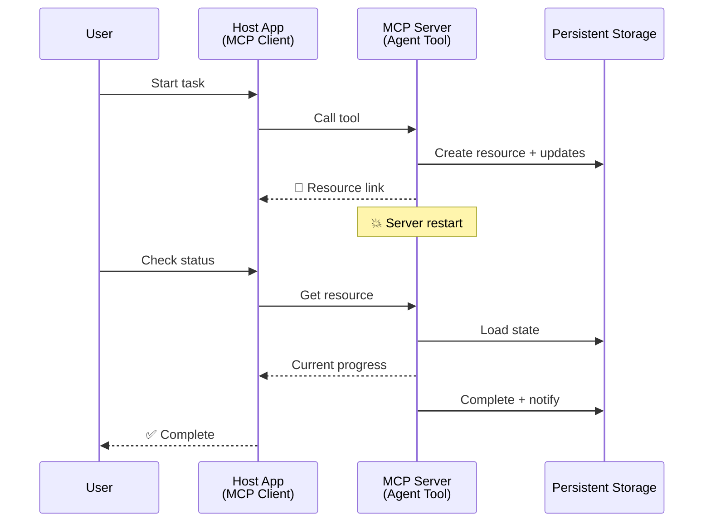
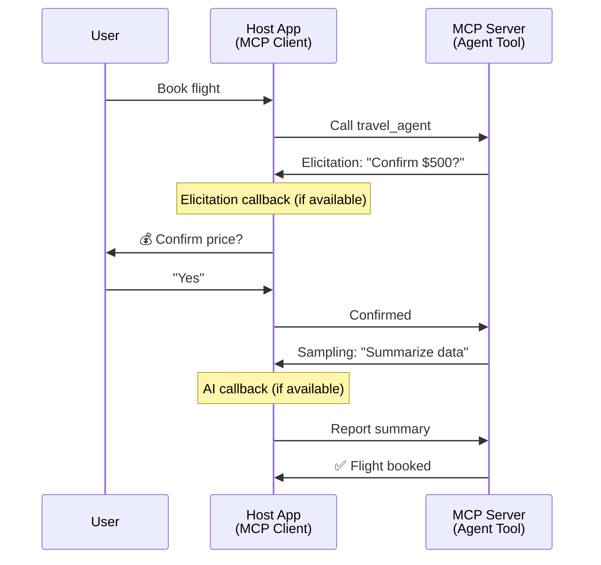

<!--
CO_OP_TRANSLATOR_METADATA:
{
  "original_hash": "5cc6836626047aa055e8960c8484a7d0",
  "translation_date": "2025-08-21T14:13:20+00:00",
  "source_file": "11-mcp/code_samples/mcp-agents/README.md",
  "language_code": "fr"
}
-->
# Construire des systèmes de communication entre agents avec MCP

> TL;DR - Peut-on construire une communication Agent2Agent avec MCP ? Oui !

MCP a considérablement évolué au-delà de son objectif initial de "fournir un contexte aux LLMs". Avec des améliorations récentes telles que les [flux reprenables](https://modelcontextprotocol.io/docs/concepts/transports#resumability-and-redelivery), [l'élucidation](https://modelcontextprotocol.io/specification/2025-06-18/client/elicitation), [l'échantillonnage](https://modelcontextprotocol.io/specification/2025-06-18/client/sampling) et les notifications ([progrès](https://modelcontextprotocol.io/specification/2025-06-18/basic/utilities/progress) et [ressources](https://modelcontextprotocol.io/specification/2025-06-18/schema#resourceupdatednotification)), MCP offre désormais une base robuste pour construire des systèmes complexes de communication entre agents.

## La confusion entre agent et outil

À mesure que de plus en plus de développeurs explorent des outils avec des comportements agentiques (fonctionnement sur de longues périodes, nécessitant parfois des entrées supplémentaires en cours d'exécution, etc.), une idée reçue fréquente est que MCP ne convient pas, principalement parce que les premiers exemples de son outil primitif se concentraient sur des modèles simples de requête-réponse.

Cette perception est dépassée. La spécification MCP a été considérablement enrichie ces derniers mois avec des fonctionnalités qui comblent les lacunes pour construire des comportements agentiques de longue durée :

- **Streaming et résultats partiels** : Mises à jour en temps réel pendant l'exécution
- **Reprise** : Les clients peuvent se reconnecter et continuer après une déconnexion
- **Durabilité** : Les résultats survivent aux redémarrages du serveur (par exemple, via des liens de ressources)
- **Multi-tours** : Entrées interactives en cours d'exécution via l'élucidation et l'échantillonnage

Ces fonctionnalités peuvent être combinées pour permettre des applications complexes agentiques et multi-agents, toutes déployées sur le protocole MCP.

Pour référence, nous désignerons un agent comme un "outil" disponible sur un serveur MCP. Cela implique l'existence d'une application hôte qui implémente un client MCP établissant une session avec le serveur MCP et pouvant appeler l'agent.

## Qu'est-ce qui rend un outil MCP "agentique" ?

Avant de plonger dans l'implémentation, définissons les capacités d'infrastructure nécessaires pour prendre en charge des agents de longue durée.

> Nous définirons un agent comme une entité capable de fonctionner de manière autonome sur de longues périodes, capable de gérer des tâches complexes nécessitant plusieurs interactions ou ajustements basés sur des retours en temps réel.

### 1. Streaming et résultats partiels

Les modèles traditionnels de requête-réponse ne fonctionnent pas pour les tâches de longue durée. Les agents doivent fournir :

- Des mises à jour en temps réel sur les progrès
- Des résultats intermédiaires

**Support MCP** : Les notifications de mise à jour des ressources permettent de diffuser des résultats partiels, bien que cela nécessite une conception minutieuse pour éviter les conflits avec le modèle 1:1 de requête/réponse de JSON-RPC.

| Fonctionnalité             | Cas d'utilisation                                                                                                                                                              | Support MCP                                                                                |
| -------------------------- | ------------------------------------------------------------------------------------------------------------------------------------------------------------------------------ | ------------------------------------------------------------------------------------------ |
| Mises à jour en temps réel | L'utilisateur demande une migration de code. L'agent diffuse les progrès : "10 % - Analyse des dépendances... 25 % - Conversion des fichiers TypeScript... 50 % - Mise à jour des imports..." | ✅ Notifications de progrès                                                                  |
| Résultats partiels         | Une tâche "Générer un livre" diffuse des résultats partiels, par exemple : 1) Plan de l'intrigue, 2) Liste des chapitres, 3) Chaque chapitre au fur et à mesure de leur achèvement. L'hôte peut inspecter, annuler ou rediriger à tout moment. | ✅ Notifications pouvant inclure des résultats partiels (voir propositions PR 383, 776)     |

<strong>Figure 1 :</strong> Ce diagramme illustre comment un agent MCP diffuse des mises à jour en temps réel et des résultats partiels à l'application hôte pendant une tâche de longue durée, permettant à l'utilisateur de suivre l'exécution en temps réel.

### 2. Reprise

Les agents doivent gérer les interruptions réseau de manière fluide :

- Reconnexion après une déconnexion (client)
- Reprise à partir de l'état précédent (rediffusion des messages)

**Support MCP** : Le transport StreamableHTTP de MCP prend en charge aujourd'hui la reprise de session et la rediffusion des messages avec des identifiants de session et des identifiants de dernier événement. Il est important de noter que le serveur doit implémenter un EventStore permettant la rediffusion des événements lors de la reconnexion du client.  
Notez qu'il existe une proposition communautaire (PR #975) explorant des flux reprenables indépendants du transport.

| Fonctionnalité | Cas d'utilisation                                                                                                                                                   | Support MCP                                                                |
| -------------- | ------------------------------------------------------------------------------------------------------------------------------------------------------------------ | -------------------------------------------------------------------------- |
| Reprise        | Le client se déconnecte pendant une tâche de longue durée. Lors de la reconnexion, la session reprend avec rediffusion des événements manqués, continuant sans interruption. | ✅ Transport StreamableHTTP avec identifiants de session, rediffusion des événements et EventStore |

<strong>Figure 2 :</strong> Ce diagramme montre comment le transport StreamableHTTP de MCP et l'EventStore permettent une reprise de session fluide : si le client se déconnecte, il peut se reconnecter et rediffuser les événements manqués, poursuivant la tâche sans perte de progrès.

### 3. Durabilité

Les agents de longue durée nécessitent un état persistant :

- Les résultats survivent aux redémarrages du serveur
- Le statut peut être récupéré hors bande
- Suivi des progrès entre les sessions

**Support MCP** : MCP prend désormais en charge un type de retour de lien de ressource pour les appels d'outils. Aujourd'hui, un modèle possible consiste à concevoir un outil qui crée une ressource et renvoie immédiatement un lien de ressource. L'outil peut continuer à traiter la tâche en arrière-plan et mettre à jour la ressource. À son tour, le client peut choisir de sonder l'état de cette ressource pour obtenir des résultats partiels ou complets (en fonction des mises à jour de ressources fournies par le serveur) ou de s'abonner à la ressource pour recevoir des notifications de mise à jour.

Une limitation ici est que le sondage des ressources ou l'abonnement aux mises à jour peut consommer des ressources avec des implications à grande échelle. Il existe une proposition communautaire ouverte (y compris #992) explorant la possibilité d'inclure des webhooks ou des déclencheurs que le serveur peut appeler pour notifier le client/l'application hôte des mises à jour.

| Fonctionnalité | Cas d'utilisation                                                                                                                                        | Support MCP                                                        |
| -------------- | ------------------------------------------------------------------------------------------------------------------------------------------------------- | ------------------------------------------------------------------ |
| Durabilité     | Le serveur plante pendant une tâche de migration de données. Les résultats et les progrès survivent au redémarrage, le client peut vérifier le statut et continuer à partir de la ressource persistante. | ✅ Liens de ressources avec stockage persistant et notifications de statut |

Aujourd'hui, un modèle courant consiste à concevoir un outil qui crée une ressource et renvoie immédiatement un lien de ressource. L'outil peut en arrière-plan traiter la tâche, émettre des notifications de ressources servant de mises à jour de progrès ou inclure des résultats partiels, et mettre à jour le contenu de la ressource selon les besoins.

<strong>Figure 3 :</strong> Ce diagramme montre comment les agents MCP utilisent des ressources persistantes et des notifications de statut pour garantir que les tâches de longue durée survivent aux redémarrages du serveur, permettant aux clients de suivre les progrès et de récupérer les résultats même après des échecs.

### 4. Interactions multi-tours

Les agents ont souvent besoin d'entrées supplémentaires en cours d'exécution :

- Clarification ou approbation humaine
- Assistance IA pour des décisions complexes
- Ajustement dynamique des paramètres

**Support MCP** : Entièrement pris en charge via l'échantillonnage (pour les entrées IA) et l'élucidation (pour les entrées humaines).

| Fonctionnalité             | Cas d'utilisation                                                                                                                                     | Support MCP                                           |
| -------------------------- | ----------------------------------------------------------------------------------------------------------------------------------------------------- | ----------------------------------------------------- |
| Interactions multi-tours   | Un agent de réservation de voyage demande une confirmation de prix à l'utilisateur, puis demande à l'IA de résumer les données de voyage avant de finaliser la transaction. | ✅ Élucidation pour les entrées humaines, échantillonnage pour les entrées IA |

<strong>Figure 4 :</strong> Ce diagramme montre comment les agents MCP peuvent interagir de manière interactive pour obtenir des entrées humaines ou demander une assistance IA en cours d'exécution, soutenant des flux de travail complexes et multi-tours tels que les confirmations et la prise de décision dynamique.

## Implémentation d'agents de longue durée sur MCP - Aperçu du code

Dans le cadre de cet article, nous fournissons un [dépôt de code](https://github.com/victordibia/ai-tutorials/tree/main/MCP%20Agents) contenant une implémentation complète d'agents de longue durée utilisant le SDK Python MCP avec le transport StreamableHTTP pour la reprise de session et la rediffusion des messages. L'implémentation démontre comment les capacités de MCP peuvent être combinées pour permettre des comportements sophistiqués de type agent.

...

**Avertissement** :  
Ce document a été traduit à l'aide du service de traduction automatique [Co-op Translator](https://github.com/Azure/co-op-translator). Bien que nous nous efforcions d'assurer l'exactitude, veuillez noter que les traductions automatisées peuvent contenir des erreurs ou des inexactitudes. Le document original dans sa langue d'origine doit être considéré comme la source faisant autorité. Pour des informations critiques, il est recommandé de faire appel à une traduction humaine professionnelle. Nous déclinons toute responsabilité en cas de malentendus ou d'interprétations erronées résultant de l'utilisation de cette traduction.