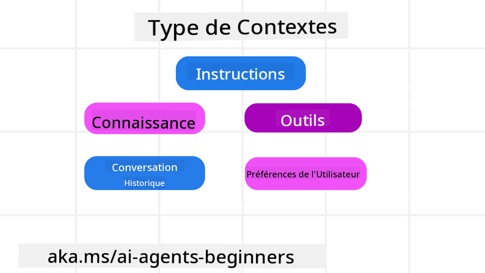
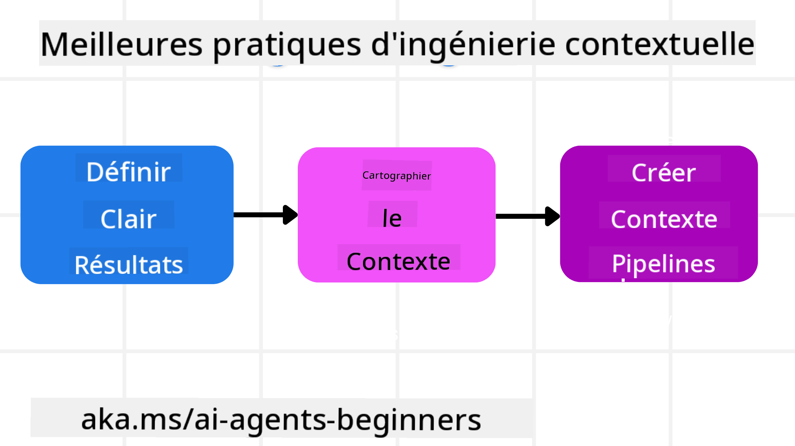

<!--
CO_OP_TRANSLATOR_METADATA:
{
  "original_hash": "cb7e50f471905ce6fdb92a30269a7a98",
  "translation_date": "2025-09-04T09:34:44+00:00",
  "source_file": "12-context-engineering/README.md",
  "language_code": "fr"
}
-->
# Ingénierie du contexte pour les agents IA

> _(Cliquez sur l'image ci-dessus pour visionner la vidéo de cette leçon)_

Comprendre la complexité de l'application pour laquelle vous développez un agent IA est essentiel pour en créer un fiable. Nous devons concevoir des agents IA capables de gérer efficacement les informations afin de répondre à des besoins complexes, au-delà de l'ingénierie des prompts.

Dans cette leçon, nous examinerons ce qu'est l'ingénierie du contexte et son rôle dans la création d'agents IA.

## Introduction

Cette leçon couvrira :

• **Ce qu'est l'ingénierie du contexte** et pourquoi elle diffère de l'ingénierie des prompts.

• **Stratégies pour une ingénierie du contexte efficace**, notamment comment rédiger, sélectionner, compresser et isoler les informations.

• **Défaillances courantes du contexte** qui peuvent perturber votre agent IA et comment les corriger.

## Objectifs d'apprentissage

Après avoir terminé cette leçon, vous serez capable de :

• **Définir l'ingénierie du contexte** et la différencier de l'ingénierie des prompts.

• **Identifier les composants clés du contexte** dans les applications utilisant des modèles de langage étendu (LLM).

• **Appliquer des stratégies pour rédiger, sélectionner, compresser et isoler le contexte** afin d'améliorer les performances de l'agent.

• **Reconnaître les défaillances courantes du contexte** telles que l'empoisonnement, la distraction, la confusion et les conflits, et mettre en œuvre des techniques d'atténuation.

## Qu'est-ce que l'ingénierie du contexte ?

Pour les agents IA, le contexte est ce qui guide la planification des actions de l'agent IA. L'ingénierie du contexte consiste à s'assurer que l'agent IA dispose des bonnes informations pour accomplir la prochaine étape de la tâche. La fenêtre de contexte est limitée en taille, donc en tant que concepteurs d'agents, nous devons créer des systèmes et des processus pour gérer l'ajout, la suppression et la condensation des informations dans cette fenêtre.

### Ingénierie des prompts vs ingénierie du contexte

L'ingénierie des prompts se concentre sur un ensemble d'instructions statiques pour guider efficacement les agents IA avec un ensemble de règles. L'ingénierie du contexte, en revanche, consiste à gérer un ensemble dynamique d'informations, y compris le prompt initial, afin de garantir que l'agent IA dispose de ce dont il a besoin au fil du temps. L'idée principale de l'ingénierie du contexte est de rendre ce processus répétable et fiable.

### Types de contexte

Il est important de se rappeler que le contexte n'est pas une seule entité. Les informations dont l'agent IA a besoin peuvent provenir de diverses sources, et c'est à nous de nous assurer que l'agent a accès à ces sources :

Les types de contexte qu'un agent IA pourrait devoir gérer incluent :

• **Instructions :** Ce sont les "règles" de l'agent – prompts, messages système, exemples few-shot (montrant à l'IA comment faire quelque chose) et descriptions des outils qu'il peut utiliser. C'est là que l'ingénierie des prompts se combine avec l'ingénierie du contexte.

• **Connaissances :** Cela inclut des faits, des informations récupérées dans des bases de données ou des mémoires à long terme accumulées par l'agent. Cela peut inclure l'intégration d'un système de génération augmentée par récupération (RAG) si un agent doit accéder à différents magasins de connaissances et bases de données.

• **Outils :** Ce sont les définitions de fonctions externes, d'API et de serveurs MCP que l'agent peut appeler, ainsi que les retours (résultats) qu'il obtient en les utilisant.

• **Historique des conversations :** Le dialogue en cours avec un utilisateur. Avec le temps, ces conversations deviennent plus longues et complexes, ce qui signifie qu'elles occupent de l'espace dans la fenêtre de contexte.

• **Préférences utilisateur :** Informations apprises sur les goûts ou aversions d'un utilisateur au fil du temps. Ces données peuvent être stockées et utilisées pour prendre des décisions clés afin d'aider l'utilisateur.

## Stratégies pour une ingénierie du contexte efficace

### Stratégies de planification

Une bonne ingénierie du contexte commence par une bonne planification. Voici une approche qui vous aidera à réfléchir à la manière d'appliquer le concept d'ingénierie du contexte :

1. **Définir des résultats clairs** - Les résultats des tâches assignées aux agents IA doivent être clairement définis. Répondez à la question : "À quoi ressemblera le monde une fois que l'agent IA aura terminé sa tâche ?" En d'autres termes, quel changement, quelle information ou quelle réponse l'utilisateur devrait-il avoir après avoir interagi avec l'agent IA ?

2. **Cartographier le contexte** - Une fois que vous avez défini les résultats de l'agent IA, vous devez répondre à la question : "Quelles informations l'agent IA doit-il avoir pour accomplir cette tâche ?" Cela vous permettra de commencer à cartographier le contexte et de localiser où ces informations peuvent être trouvées.

3. **Créer des pipelines de contexte** - Maintenant que vous savez où se trouvent les informations, vous devez répondre à la question : "Comment l'agent obtiendra-t-il ces informations ?" Cela peut être fait de diverses manières, notamment via RAG, l'utilisation de serveurs MCP et d'autres outils.

### Stratégies pratiques

La planification est importante, mais une fois que les informations commencent à affluer dans la fenêtre de contexte de notre agent, nous devons avoir des stratégies pratiques pour les gérer :

#### Gestion du contexte

Bien que certaines informations soient ajoutées automatiquement à la fenêtre de contexte, l'ingénierie du contexte consiste à jouer un rôle plus actif dans la gestion de ces informations, ce qui peut être fait par plusieurs stratégies :

1. **Bloc-notes de l'agent**  
   Cela permet à un agent IA de prendre des notes sur les informations pertinentes concernant les tâches en cours et les interactions avec l'utilisateur au cours d'une session unique. Ces notes devraient exister en dehors de la fenêtre de contexte, dans un fichier ou un objet runtime que l'agent peut récupérer ultérieurement pendant cette session si nécessaire.

2. **Mémoires**  
   Les bloc-notes sont utiles pour gérer les informations en dehors de la fenêtre de contexte d'une session unique. Les mémoires permettent aux agents de stocker et de récupérer des informations pertinentes sur plusieurs sessions. Cela peut inclure des résumés, des préférences utilisateur et des retours pour des améliorations futures.

3. **Compression du contexte**  
   Lorsque la fenêtre de contexte devient trop grande et approche de sa limite, des techniques telles que la synthèse et le découpage peuvent être utilisées. Cela inclut soit de conserver uniquement les informations les plus pertinentes, soit de supprimer les messages plus anciens.

4. **Systèmes multi-agents**  
   Développer un système multi-agents est une forme d'ingénierie du contexte, car chaque agent dispose de sa propre fenêtre de contexte. La manière dont ce contexte est partagé et transmis entre différents agents est un autre aspect à planifier lors de la création de ces systèmes.

5. **Environnements sandbox**  
   Si un agent doit exécuter du code ou traiter de grandes quantités d'informations dans un document, cela peut nécessiter un grand nombre de tokens pour traiter les résultats. Au lieu de tout stocker dans la fenêtre de contexte, l'agent peut utiliser un environnement sandbox capable d'exécuter ce code et de ne lire que les résultats et autres informations pertinentes.

6. **Objets d'état runtime**  
   Cela consiste à créer des conteneurs d'informations pour gérer les situations où l'agent doit avoir accès à certaines données. Pour une tâche complexe, cela permet à un agent de stocker les résultats de chaque sous-tâche étape par étape, permettant au contexte de rester connecté uniquement à cette sous-tâche spécifique.

### Exemple d'ingénierie du contexte

Imaginons que nous souhaitions qu'un agent IA **"Réserve un voyage à Paris."**

• Un agent simple utilisant uniquement l'ingénierie des prompts pourrait simplement répondre : **"D'accord, quand souhaitez-vous partir à Paris ?"**. Il ne traite que votre question directe au moment où elle est posée.

• Un agent utilisant les stratégies d'ingénierie du contexte abordées ferait bien plus. Avant même de répondre, son système pourrait :

  ◦ **Vérifier votre calendrier** pour les dates disponibles (en récupérant des données en temps réel).

 ◦ **Se souvenir de vos préférences de voyage passées** (issues de la mémoire à long terme), comme votre compagnie aérienne préférée, votre budget ou si vous préférez les vols directs.

 ◦ **Identifier les outils disponibles** pour la réservation de vols et d'hôtels.

- Ensuite, une réponse exemple pourrait être : **"Bonjour [Votre Nom] ! Je vois que vous êtes libre la première semaine d'octobre. Dois-je chercher des vols directs pour Paris sur [Compagnie aérienne préférée] dans votre budget habituel de [Budget] ?"**. Cette réponse riche et consciente du contexte démontre la puissance de l'ingénierie du contexte.

## Défaillances courantes du contexte

### Empoisonnement du contexte

**Ce que c'est :** Lorsqu'une hallucination (fausse information générée par le LLM) ou une erreur entre dans le contexte et est référencée à plusieurs reprises, cela peut pousser l'agent à poursuivre des objectifs impossibles ou à développer des stratégies absurdes.

**Que faire :** Mettre en œuvre une **validation du contexte** et une **mise en quarantaine**. Valider les informations avant qu'elles ne soient ajoutées à la mémoire à long terme. Si un empoisonnement potentiel est détecté, démarrer de nouveaux fils de contexte pour empêcher la propagation des mauvaises informations.

**Exemple de réservation de voyage :** Votre agent hallucine un **vol direct depuis un petit aéroport local vers une grande ville internationale** qui n'offre pas de vols internationaux. Ce détail de vol inexistant est enregistré dans le contexte. Plus tard, lorsque vous demandez à l'agent de réserver, il continue de chercher des billets pour cet itinéraire impossible, entraînant des erreurs répétées.

**Solution :** Mettre en œuvre une étape qui **valide l'existence des vols et des itinéraires via une API en temps réel** _avant_ d'ajouter le détail du vol au contexte de travail de l'agent. Si la validation échoue, l'information erronée est "mise en quarantaine" et n'est pas utilisée davantage.

### Distraction du contexte

**Ce que c'est :** Lorsque le contexte devient si volumineux que le modèle se concentre trop sur l'historique accumulé au lieu d'utiliser ce qu'il a appris pendant l'entraînement, ce qui entraîne des actions répétitives ou inutiles. Les modèles peuvent commencer à faire des erreurs même avant que la fenêtre de contexte ne soit pleine.

**Que faire :** Utiliser la **synthèse du contexte**. Compresser périodiquement les informations accumulées en résumés plus courts, en conservant les détails importants tout en supprimant l'historique redondant. Cela aide à "réinitialiser" la concentration.

**Exemple de réservation de voyage :** Vous discutez depuis longtemps de divers destinations de rêve, y compris un récit détaillé de votre voyage en sac à dos il y a deux ans. Lorsque vous demandez finalement **"trouve-moi un vol pas cher pour le mois prochain"**, l'agent est submergé par les anciens détails inutiles et continue de poser des questions sur votre équipement de randonnée ou vos itinéraires passés, négligeant votre demande actuelle.

**Solution :** Après un certain nombre de tours ou lorsque le contexte devient trop volumineux, l'agent devrait **résumer les parties les plus récentes et pertinentes de la conversation** – en se concentrant sur vos dates de voyage et destination actuelles – et utiliser ce résumé condensé pour le prochain appel au LLM, en supprimant le chat historique moins pertinent.

### Confusion du contexte

**Ce que c'est :** Lorsque le contexte inutile, souvent sous forme de trop nombreux outils disponibles, pousse le modèle à générer de mauvaises réponses ou à appeler des outils non pertinents. Les modèles plus petits sont particulièrement sujets à cela.

**Que faire :** Mettre en œuvre une **gestion des outils** en utilisant des techniques RAG. Stocker les descriptions des outils dans une base de données vectorielle et sélectionner _uniquement_ les outils les plus pertinents pour chaque tâche spécifique. Les recherches montrent qu'il est préférable de limiter les sélections d'outils à moins de 30.

**Exemple de réservation de voyage :** Votre agent a accès à des dizaines d'outils : `book_flight`, `book_hotel`, `rent_car`, `find_tours`, `currency_converter`, `weather_forecast`, `restaurant_reservations`, etc. Vous demandez, **"Quel est le meilleur moyen de se déplacer à Paris ?"** En raison du grand nombre d'outils, l'agent est confus et tente d'appeler `book_flight` _dans_ Paris, ou `rent_car` alors que vous préférez les transports en commun, car les descriptions des outils peuvent se chevaucher ou il ne peut tout simplement pas discerner le meilleur.

**Solution :** Utiliser **RAG sur les descriptions des outils**. Lorsque vous demandez comment vous déplacer à Paris, le système récupère dynamiquement _uniquement_ les outils les plus pertinents comme `rent_car` ou `public_transport_info` en fonction de votre requête, en présentant une sélection ciblée d'outils au LLM.

### Conflit de contexte

**Ce que c'est :** Lorsque des informations contradictoires existent dans le contexte, entraînant un raisonnement incohérent ou de mauvaises réponses finales. Cela se produit souvent lorsque les informations arrivent par étapes et que des hypothèses incorrectes initiales restent dans le contexte.

**Que faire :** Utiliser la **taille du contexte** et le **déchargement**. La taille consiste à supprimer les informations obsolètes ou contradictoires à mesure que de nouveaux détails arrivent. Le déchargement permet au modèle d'utiliser un espace de travail séparé pour traiter les informations sans encombrer le contexte principal.

**Exemple de réservation de voyage :** Vous dites initialement à votre agent, **"Je veux voyager en classe économique."** Plus tard dans la conversation, vous changez d'avis et dites, **"En fait, pour ce voyage, optons pour la classe affaires."** Si les deux instructions restent dans le contexte, l'agent pourrait recevoir des résultats de recherche contradictoires ou être confus sur la préférence à prioriser.

**Solution :** Mettre en œuvre la **taille du contexte**. Lorsqu'une nouvelle instruction contredit une ancienne, l'ancienne instruction est supprimée ou explicitement remplacée dans le contexte. Alternativement, l'agent peut utiliser un **bloc-notes** pour concilier les préférences contradictoires avant de décider, garantissant que seule l'instruction finale et cohérente guide ses actions.

## Vous avez d'autres questions sur l'ingénierie du contexte ?

Rejoignez le [Discord Azure AI Foundry](https://aka.ms/ai-agents/discord) pour rencontrer d'autres apprenants, assister à des heures de bureau et obtenir des réponses à vos questions sur les agents IA.

---

**Avertissement** :  
Ce document a été traduit à l'aide du service de traduction automatique [Co-op Translator](https://github.com/Azure/co-op-translator). Bien que nous nous efforcions d'assurer l'exactitude, veuillez noter que les traductions automatisées peuvent contenir des erreurs ou des inexactitudes. Le document original dans sa langue d'origine doit être considéré comme la source faisant autorité. Pour des informations critiques, il est recommandé de recourir à une traduction professionnelle réalisée par un humain. Nous déclinons toute responsabilité en cas de malentendus ou d'interprétations erronées résultant de l'utilisation de cette traduction.