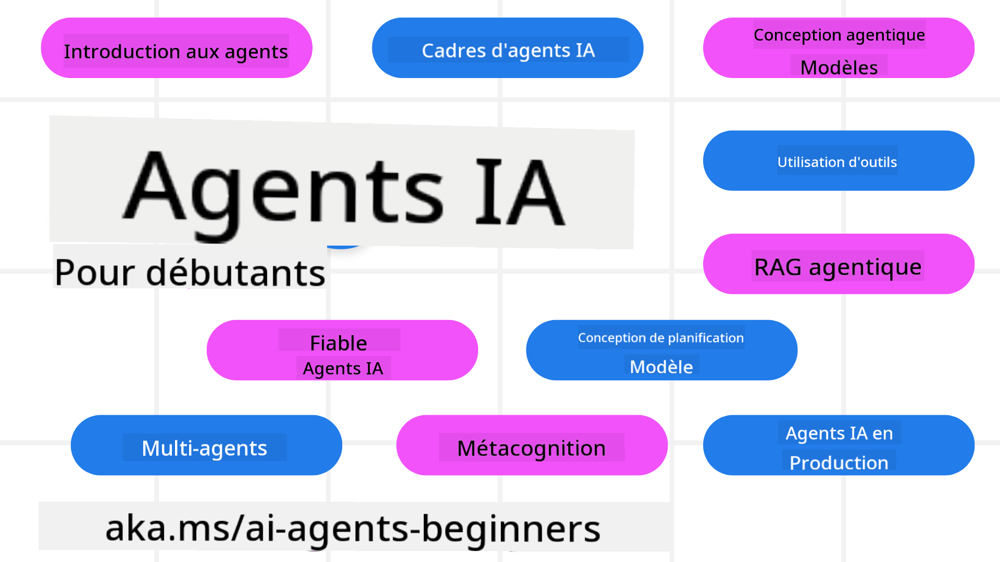

<!--
CO_OP_TRANSLATOR_METADATA:
{
  "original_hash": "6b07046397366e6f6f4524c9ddeba1e1",
  "translation_date": "2025-07-12T14:39:36+00:00",
  "source_file": "README.md",
  "language_code": "fr"
}
-->
# Agents IA pour débutants - Un cours

## 11 leçons qui vous enseignent tout ce qu’il faut savoir pour commencer à créer des Agents IA

  
  
  
  

### 🌐 Support multilingue

#### Pris en charge via GitHub Action (Automatisé & Toujours à jour)

[French](./README.md) | [Spanish](../es/README.md) | [German](../de/README.md) | [Russian](../ru/README.md) | [Arabic](../ar/README.md) | [Persian (Farsi)](../fa/README.md) | [Urdu](../ur/README.md) | [Chinese (Simplified)](../zh/README.md) | [Chinese (Traditional, Macau)](../mo/README.md) | [Chinese (Traditional, Hong Kong)](../hk/README.md) | [Chinese (Traditional, Taiwan)](../tw/README.md) | [Japanese](../ja/README.md) | [Korean](../ko/README.md) | [Hindi](../hi/README.md) | [Bengali](../bn/README.md) | [Marathi](../mr/README.md) | [Nepali](../ne/README.md) | [Punjabi (Gurmukhi)](../pa/README.md) | [Portuguese (Portugal)](../pt/README.md) | [Portuguese (Brazil)](../br/README.md) | [Italian](../it/README.md) | [Polish](../pl/README.md) | [Turkish](../tr/README.md) | [Greek](../el/README.md) | [Thai](../th/README.md) | [Swedish](../sv/README.md) | [Danish](../da/README.md) | [Norwegian](../no/README.md) | [Finnish](../fi/README.md) | [Dutch](../nl/README.md) | [Hebrew](../he/README.md) | [Vietnamese](../vi/README.md) | [Indonesian](../id/README.md) | [Malay](../ms/README.md) | [Tagalog (Filipino)](../tl/README.md) | [Swahili](../sw/README.md) | [Hungarian](../hu/README.md) | [Czech](../cs/README.md) | [Slovak](../sk/README.md) | [Romanian](../ro/README.md) | [Bulgarian](../bg/README.md) | [Serbian (Cyrillic)](../sr/README.md) | [Croatian](../hr/README.md) | [Slovenian](../sl/README.md) | [Ukrainian](../uk/README.md) | [Burmese (Myanmar)](../my/README.md)

**Si vous souhaitez que d’autres langues soient prises en charge, elles sont listées [ici](https://github.com/Azure/co-op-translator/blob/main/getting_started/supported-languages.md)**

  
  

## 🌱 Pour bien commencer

Ce cours comprend 11 leçons qui couvrent les bases de la création d’Agents IA. Chaque leçon aborde un sujet spécifique, vous pouvez donc commencer où vous voulez !

Ce cours bénéficie d’un support multilingue. Consultez nos [langues disponibles ici](../..).

Si c’est la première fois que vous travaillez avec des modèles d’IA générative, découvrez notre cours [Generative AI For Beginners](https://aka.ms/genai-beginners), qui comprend 21 leçons sur la création avec GenAI.

N’oubliez pas de [mettre une étoile (🌟) à ce repo](https://docs.github.com/en/get-started/exploring-projects-on-github/saving-repositories-with-stars?WT.mc_id=academic-105485-koreyst) et de [forker ce repo](https://github.com/microsoft/ai-agents-for-beginners/fork) pour exécuter le code.

### Ce dont vous avez besoin

Chaque leçon de ce cours inclut des exemples de code, disponibles dans le dossier code_samples. Vous pouvez [forker ce repo](https://github.com/microsoft/ai-agents-for-beginners/fork) pour créer votre propre copie.

Les exemples de code dans ces exercices utilisent Azure AI Foundry et les catalogues de modèles GitHub pour interagir avec les modèles de langage :

- [Github Models](https://aka.ms/ai-agents-beginners/github-models) - Gratuit / Limité  
- [Azure AI Foundry](https://aka.ms/ai-agents-beginners/ai-foundry) - Compte Azure requis

Ce cours utilise également les frameworks et services d’Agents IA suivants de Microsoft :

- [Azure AI Agent Service](https://aka.ms/ai-agents-beginners/ai-agent-service)  
- [Semantic Kernel](https://aka.ms/ai-agents-beginners/semantic-kernel)  
- [AutoGen](https://aka.ms/ai-agents/autogen)

Pour plus d’informations sur l’exécution du code de ce cours, consultez la [configuration du cours](./00-course-setup/README.md).

## 🙏 Vous voulez aider ?

Vous avez des suggestions ou avez trouvé des fautes d’orthographe ou des erreurs dans le code ? [Ouvrez une issue](https://github.com/microsoft/ai-agents-for-beginners/issues?WT.mc_id=academic-105485-koreyst) ou [créez une pull request](https://github.com/microsoft/ai-agents-for-beginners/pulls?WT.mc_id=academic-105485-koreyst).

Si vous êtes bloqué ou avez des questions sur la création d’Agents IA, rejoignez notre [communauté Azure AI Foundry sur Discord](https://discord.gg/kzRShWzttr).

Si vous avez des retours produits ou des erreurs lors de la création, rendez-vous sur notre [forum développeurs Azure AI Foundry](https://aka.ms/azureaifoundry/forum).

## 📂 Chaque leçon comprend

- Une leçon écrite dans le README et une courte vidéo  
- Des exemples de code Python supportant Azure AI Foundry et Github Models (Gratuit)  
- Des liens vers des ressources supplémentaires pour continuer votre apprentissage

## 🗃️ Leçons

| **Leçon**                                | **Texte & Code**                                   | **Vidéo**                                                  | **Ressources supplémentaires**                                                        |
|------------------------------------------|----------------------------------------------------|------------------------------------------------------------|----------------------------------------------------------------------------------------|
| Introduction aux Agents IA et cas d’usage | [Lien](./01-intro-to-ai-agents/README.md)          | [Vidéo](https://youtu.be/3zgm60bXmQk?si=z8QygFvYQv-9WtO1)  | [Lien](https://aka.ms/ai-agents-beginners/collection?WT.mc_id=academic-105485-koreyst) |
| Exploration des frameworks agentiques    | [Lien](./02-explore-agentic-frameworks/README.md)  | [Vidéo](https://youtu.be/ODwF-EZo_O8?si=Vawth4hzVaHv-u0H)  | [Lien](https://aka.ms/ai-agents-beginners/collection?WT.mc_id=academic-105485-koreyst) |
| Comprendre les design patterns agentiques | [Lien](./03-agentic-design-patterns/README.md)     | [Vidéo](https://youtu.be/m9lM8qqoOEA?si=BIzHwzstTPL8o9GF)  | [Lien](https://aka.ms/ai-agents-beginners/collection?WT.mc_id=academic-105485-koreyst) |
| Design pattern d’utilisation d’outils   | [Lien](./04-tool-use/README.md)                    | [Vidéo](https://youtu.be/vieRiPRx-gI?si=2z6O2Xu2cu_Jz46N)  | [Lien](https://aka.ms/ai-agents-beginners/collection?WT.mc_id=academic-105485-koreyst) |
| Agentic RAG                             | [Lien](./05-agentic-rag/README.md)                 | [Vidéo](https://youtu.be/WcjAARvdL7I?si=gKPWsQpKiIlDH9A3)  | [Lien](https://aka.ms/ai-agents-beginners/collection?WT.mc_id=academic-105485-koreyst) |
| Construire des Agents IA dignes de confiance | [Lien](./06-building-trustworthy-agents/README.md) | [Vidéo](https://youtu.be/iZKkMEGBCUQ?si=jZjpiMnGFOE9L8OK ) | [Lien](https://aka.ms/ai-agents-beginners/collection?WT.mc_id=academic-105485-koreyst) |
| Design pattern de planification          | [Lien](./07-planning-design/README.md)             | [Vidéo](https://youtu.be/kPfJ2BrBCMY?si=6SC_iv_E5-mzucnC)  | [Lien](https://aka.ms/ai-agents-beginners/collection?WT.mc_id=academic-105485-koreyst) |
| Design pattern multi-agent               | [Lien](./08-multi-agent/README.md)                 | [Vidéo](https://youtu.be/V6HpE9hZEx0?si=rMgDhEu7wXo2uo6g)  | [Lien](https://aka.ms/ai-agents-beginners/collection?WT.mc_id=academic-105485-koreyst) |
| Design pattern de métacognition          | [Lien](./09-metacognition/README.md)               | [Vidéo](https://youtu.be/His9R6gw6Ec?si=8gck6vvdSNCt6OcF)  | [Lien](https://aka.ms/ai-agents-beginners/collection?WT.mc_id=academic-105485-koreyst) |
| Agents IA en production                  | [Lien](./10-ai-agents-production/README.md)        | [Vidéo](https://youtu.be/l4TP6IyJxmQ?si=31dnhexRo6yLRJDl)  | [Lien](https://aka.ms/ai-agents-beginners/collection?WT.mc_id=academic-105485-koreyst) |
| Agents IA avec MCP                       | [Lien](./11-mcp/README.md)                         |                                                            | [Lien](https://aka.ms/mcp-for-beginners)                                               |

## 🎒 Autres cours

Notre équipe propose d’autres cours ! Découvrez :
- [**NOUVEAU** Model Context Protocol (MCP) pour débutants](https://github.com/microsoft/mcp-for-beginners?WT.mc_id=academic-105485-koreyst)
- [IA générative pour débutants avec .NET](https://github.com/microsoft/Generative-AI-for-beginners-dotnet?WT.mc_id=academic-105485-koreyst)
- [IA générative pour débutants](https://github.com/microsoft/generative-ai-for-beginners?WT.mc_id=academic-105485-koreyst)
- [ML pour débutants](https://aka.ms/ml-beginners?WT.mc_id=academic-105485-koreyst)
- [Data Science pour débutants](https://aka.ms/datascience-beginners?WT.mc_id=academic-105485-koreyst)
- [IA pour débutants](https://aka.ms/ai-beginners?WT.mc_id=academic-105485-koreyst)
- [Cybersécurité pour débutants](https://github.com/microsoft/Security-101??WT.mc_id=academic-96948-sayoung)
- [Développement Web pour débutants](https://aka.ms/webdev-beginners?WT.mc_id=academic-105485-koreyst)
- [IoT pour débutants](https://aka.ms/iot-beginners?WT.mc_id=academic-105485-koreyst)
- [Développement XR pour débutants](https://github.com/microsoft/xr-development-for-beginners?WT.mc_id=academic-105485-koreyst)
- [Maîtriser GitHub Copilot pour la programmation assistée par IA](https://aka.ms/GitHubCopilotAI?WT.mc_id=academic-105485-koreyst)
- [Maîtriser GitHub Copilot pour les développeurs C#/.NET](https://github.com/microsoft/mastering-github-copilot-for-dotnet-csharp-developers?WT.mc_id=academic-105485-koreyst)
- [Choisissez votre propre aventure Copilot](https://github.com/microsoft/CopilotAdventures?WT.mc_id=academic-105485-koreyst)

## 🌟 Remerciements à la communauté

Merci à [Shivam Goyal](https://www.linkedin.com/in/shivam2003/) pour sa contribution avec des exemples de code importants démontrant Agentic RAG.

## Contribution

Ce projet accueille volontiers contributions et suggestions. La plupart des contributions nécessitent que vous acceptiez un
Contributor License Agreement (CLA) déclarant que vous avez le droit, et que vous accordez effectivement,
les droits d’utiliser votre contribution. Pour plus de détails, consultez 
<https://cla.opensource.microsoft.com>.

Lorsque vous soumettez une pull request, un bot CLA déterminera automatiquement si vous devez fournir
un CLA et annotera la PR en conséquence (par exemple, vérification de statut, commentaire). Suivez simplement les instructions
données par le bot. Vous n’aurez à le faire qu’une seule fois pour tous les dépôts utilisant notre CLA.

Ce projet a adopté le [Microsoft Open Source Code of Conduct](https://opensource.microsoft.com/codeofconduct/).
Pour plus d’informations, consultez la [FAQ du Code de Conduite](https://opensource.microsoft.com/codeofconduct/faq/) ou
contactez [opencode@microsoft.com](mailto:opencode@microsoft.com) pour toute question ou remarque supplémentaire.

## Marques déposées

Ce projet peut contenir des marques ou logos de projets, produits ou services. L’utilisation autorisée des marques ou logos Microsoft est soumise et doit respecter
[les directives sur les marques et la marque de Microsoft](https://www.microsoft.com/legal/intellectualproperty/trademarks/usage/general).
L’utilisation des marques ou logos Microsoft dans des versions modifiées de ce projet ne doit pas prêter à confusion ni laisser entendre un parrainage par Microsoft.
Toute utilisation de marques ou logos tiers est soumise aux politiques de ces tiers.

**Avertissement** :  
Ce document a été traduit à l’aide du service de traduction automatique [Co-op Translator](https://github.com/Azure/co-op-translator). Bien que nous nous efforcions d’assurer l’exactitude, veuillez noter que les traductions automatiques peuvent contenir des erreurs ou des inexactitudes. Le document original dans sa langue d’origine doit être considéré comme la source faisant foi. Pour les informations critiques, une traduction professionnelle réalisée par un humain est recommandée. Nous déclinons toute responsabilité en cas de malentendus ou de mauvaises interprétations résultant de l’utilisation de cette traduction.