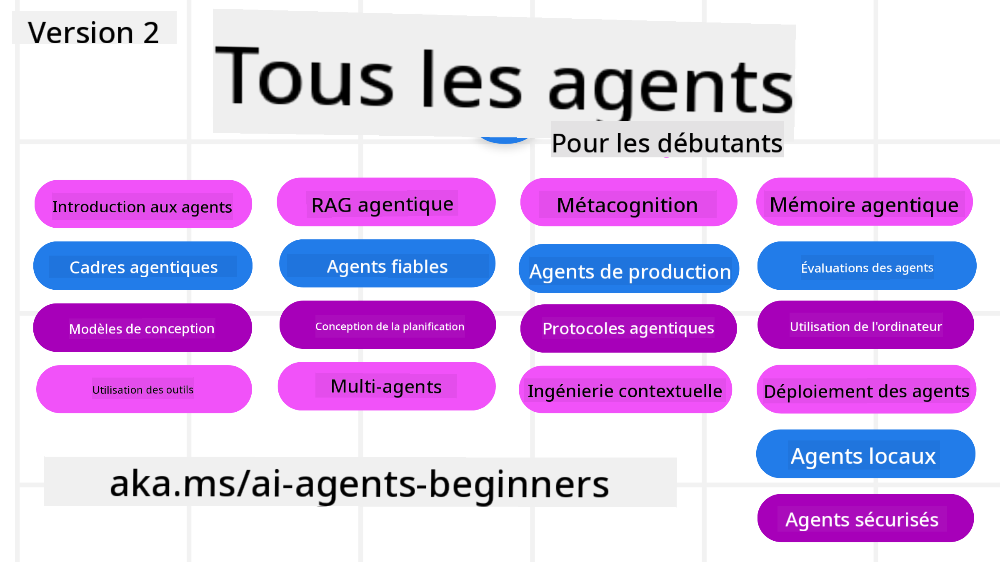

<!--
CO_OP_TRANSLATOR_METADATA:
{
  "original_hash": "4177db6b3602dfa8c609d78df1f0f21b",
  "translation_date": "2025-08-28T11:52:43+00:00",
  "source_file": "README.md",
  "language_code": "fr"
}
-->
# Agents IA pour Débutants - Un Cours

## 11 Leçons pour tout apprendre et commencer à créer des Agents IA

  
  
  
  
  

### 🌐 Support Multilingue

#### Pris en charge via GitHub Action (Automatisé & Toujours à jour)

[Français](./README.md) | [Espagnol](../es/README.md) | [Allemand](../de/README.md) | [Russe](../ru/README.md) | [Arabe](../ar/README.md) | [Persan (Farsi)](../fa/README.md) | [Ourdou](../ur/README.md) | [Chinois (Simplifié)](../zh/README.md) | [Chinois (Traditionnel, Macao)](../mo/README.md) | [Chinois (Traditionnel, Hong Kong)](../hk/README.md) | [Chinois (Traditionnel, Taïwan)](../tw/README.md) | [Japonais](../ja/README.md) | [Coréen](../ko/README.md) | [Hindi](../hi/README.md) | [Bengali](../bn/README.md) | [Marathi](../mr/README.md) | [Népalais](../ne/README.md) | [Punjabi (Gurmukhi)](../pa/README.md) | [Portugais (Portugal)](../pt/README.md) | [Portugais (Brésil)](../br/README.md) | [Italien](../it/README.md) | [Polonais](../pl/README.md) | [Turc](../tr/README.md) | [Grec](../el/README.md) | [Thaï](../th/README.md) | [Suédois](../sv/README.md) | [Danois](../da/README.md) | [Norvégien](../no/README.md) | [Finnois](../fi/README.md) | [Néerlandais](../nl/README.md) | [Hébreu](../he/README.md) | [Vietnamien](../vi/README.md) | [Indonésien](../id/README.md) | [Malais](../ms/README.md) | [Tagalog (Filipino)](../tl/README.md) | [Swahili](../sw/README.md) | [Hongrois](../hu/README.md) | [Tchèque](../cs/README.md) | [Slovaque](../sk/README.md) | [Roumain](../ro/README.md) | [Bulgare](../bg/README.md) | [Serbe (Cyrillique)](../sr/README.md) | [Croate](../hr/README.md) | [Slovène](../sl/README.md) | [Ukrainien](../uk/README.md) | [Birman (Myanmar)](../my/README.md)

**Si vous souhaitez ajouter d'autres langues, les langues prises en charge sont listées [ici](https://github.com/Azure/co-op-translator/blob/main/getting_started/supported-languages.md)**

  
  
  

## 🌱 Pour Commencer

Ce cours comprend 11 leçons couvrant les bases de la création d'Agents IA. Chaque leçon aborde un sujet spécifique, alors commencez où vous voulez !

Ce cours est disponible en plusieurs langues. Consultez nos [langues disponibles ici](../..).  

Si c'est votre première fois avec des modèles d'IA générative, découvrez notre cours [Generative AI For Beginners](https://aka.ms/genai-beginners), qui comprend 21 leçons sur la création avec GenAI.

N'oubliez pas de [mettre une étoile (🌟) à ce dépôt](https://docs.github.com/en/get-started/exploring-projects-on-github/saving-repositories-with-stars?WT.mc_id=academic-105485-koreyst) et de [forker ce dépôt](https://github.com/microsoft/ai-agents-for-beginners/fork) pour exécuter le code.

### Rencontrez d'autres apprenants, obtenez des réponses à vos questions

Si vous êtes bloqué ou avez des questions sur la création d'Agents IA, rejoignez notre canal Discord dédié dans la [Communauté Azure AI Foundry Discord](https://aka.ms/ai-agents/discord).

### Ce dont vous avez besoin

Chaque leçon de ce cours comprend des exemples de code, disponibles dans le dossier code_samples. Vous pouvez [forker ce dépôt](https://github.com/microsoft/ai-agents-for-beginners/fork) pour créer votre propre copie.  

Les exemples de code dans ces exercices utilisent Azure AI Foundry et les catalogues de modèles GitHub pour interagir avec les modèles de langage :

- [Github Models](https://aka.ms/ai-agents-beginners/github-models) - Gratuit / Limité  
- [Azure AI Foundry](https://aka.ms/ai-agents-beginners/ai-foundry) - Compte Azure requis  

Ce cours utilise également les frameworks et services d'Agents IA suivants de Microsoft :

- [Azure AI Agent Service](https://aka.ms/ai-agents-beginners/ai-agent-service)  
- [Semantic Kernel](https://aka.ms/ai-agents-beginners/semantic-kernel)  
- [AutoGen](https://aka.ms/ai-agents/autogen)  

Pour plus d'informations sur l'exécution du code de ce cours, consultez la [Configuration du Cours](./00-course-setup/README.md).

## 🙏 Vous voulez aider ?

Vous avez des suggestions ou avez trouvé des erreurs dans le code ou l'orthographe ? [Soumettez un problème](https://github.com/microsoft/ai-agents-for-beginners/issues?WT.mc_id=academic-105485-koreyst) ou [Créez une pull request](https://github.com/microsoft/ai-agents-for-beginners/pulls?WT.mc_id=academic-105485-koreyst).

## 📂 Chaque leçon comprend

- Une leçon écrite dans le README et une courte vidéo  
- Des exemples de code Python prenant en charge Azure AI Foundry et Github Models (Gratuit)  
- Des liens vers des ressources supplémentaires pour continuer votre apprentissage  

## 🗃️ Leçons

| **Leçon**                                    | **Texte & Code**                                  | **Vidéo**                                                  | **Apprentissage Supplémentaire**                                                        |
|----------------------------------------------|--------------------------------------------------|------------------------------------------------------------|-----------------------------------------------------------------------------------------|
| Introduction aux Agents IA et Cas d'Utilisation | [Lien](./01-intro-to-ai-agents/README.md)        | [Vidéo](https://youtu.be/3zgm60bXmQk?si=z8QygFvYQv-9WtO1)  | [Lien](https://aka.ms/ai-agents-beginners/collection?WT.mc_id=academic-105485-koreyst)  |
| Exploration des Frameworks Agentiques        | [Lien](./02-explore-agentic-frameworks/README.md)| [Vidéo](https://youtu.be/ODwF-EZo_O8?si=Vawth4hzVaHv-u0H)  | [Lien](https://aka.ms/ai-agents-beginners/collection?WT.mc_id=academic-105485-koreyst)  |
| Comprendre les Modèles de Conception Agentique | [Lien](./03-agentic-design-patterns/README.md)   | [Vidéo](https://youtu.be/m9lM8qqoOEA?si=BIzHwzstTPL8o9GF)  | [Lien](https://aka.ms/ai-agents-beginners/collection?WT.mc_id=academic-105485-koreyst)  |
| Modèle de Conception d'Utilisation d'Outils  | [Lien](./04-tool-use/README.md)                  | [Vidéo](https://youtu.be/vieRiPRx-gI?si=2z6O2Xu2cu_Jz46N)  | [Lien](https://aka.ms/ai-agents-beginners/collection?WT.mc_id=academic-105485-koreyst)  |
| Agentic RAG                                  | [Lien](./05-agentic-rag/README.md)               | [Vidéo](https://youtu.be/WcjAARvdL7I?si=gKPWsQpKiIlDH9A3)  | [Lien](https://aka.ms/ai-agents-beginners/collection?WT.mc_id=academic-105485-koreyst)  |
| Construire des Agents IA Fiables             | [Lien](./06-building-trustworthy-agents/README.md)| [Vidéo](https://youtu.be/iZKkMEGBCUQ?si=jZjpiMnGFOE9L8OK ) | [Lien](https://aka.ms/ai-agents-beginners/collection?WT.mc_id=academic-105485-koreyst)  |
| Modèle de Conception de Planification        | [Lien](./07-planning-design/README.md)           | [Vidéo](https://youtu.be/kPfJ2BrBCMY?si=6SC_iv_E5-mzucnC)  | [Lien](https://aka.ms/ai-agents-beginners/collection?WT.mc_id=academic-105485-koreyst)  |
| Modèle de Conception Multi-Agent             | [Lien](./08-multi-agent/README.md)               | [Vidéo](https://youtu.be/V6HpE9hZEx0?si=rMgDhEu7wXo2uo6g)  | [Lien](https://aka.ms/ai-agents-beginners/collection?WT.mc_id=academic-105485-koreyst)  |
| Modèle de Conception Métacognition           | [Lien](./09-metacognition/README.md)             | [Vidéo](https://youtu.be/His9R6gw6Ec?si=8gck6vvdSNCt6OcF)  | [Lien](https://aka.ms/ai-agents-beginners/collection?WT.mc_id=academic-105485-koreyst)  |
| Agents IA en Production                      | [Lien](./10-ai-agents-production/README.md)      | [Vidéo](https://youtu.be/l4TP6IyJxmQ?si=31dnhexRo6yLRJDl)  | [Lien](https://aka.ms/ai-agents-beginners/collection?WT.mc_id=academic-105485-koreyst)  |
| Utilisation des Protocoles Agentiques (MCP, A2A et NLWeb) | [Lien](./11-agentic-protocols/README.md)         | [Vidéo](https://youtu.be/X-Dh9R3Opn8)                      | [Lien](https://aka.ms/ai-agents-beginners/collection?WT.mc_id=academic-105485-koreyst)  |
| Ingénierie Contextuelle pour les Agents IA   | À venir - 3 septembre                            |                                                            |                                                                                         |
| Gestion de la mémoire agentique              | À venir - 10 septembre                             |                                                            |                                                                                        |
| Évaluation des agents IA                     | À venir - 17 septembre                             |                                                            |                                                                                        |
| Création d'agents d'utilisation informatique (CUA) | À venir - 24 septembre                             |                                                            |                                                                                        |
| Déploiement d'agents évolutifs               | À venir - 25 septembre                             |                                                            |                                                                                        |
| Création d'agents IA locaux                  | À venir - 2 octobre                                |                                                            |                                                                                        |
| Sécurisation des agents IA                   | À venir - 9 octobre                                |                                                            |                                                                                        |

## 🎒 Autres cours

Notre équipe propose d'autres cours ! Découvrez :

- [**NOUVEAU** Protocole de contexte de modèle (MCP) pour débutants](https://github.com/microsoft/mcp-for-beginners?WT.mc_id=academic-105485-koreyst)
- [IA générative pour débutants avec .NET](https://github.com/microsoft/Generative-AI-for-beginners-dotnet?WT.mc_id=academic-105485-koreyst)
- [IA générative pour débutants](https://github.com/microsoft/generative-ai-for-beginners?WT.mc_id=academic-105485-koreyst)
- [IA générative pour débutants avec Java](https://github.com/microsoft/generative-ai-for-beginners-java?WT.mc_id=academic-105485-koreyst)
- [ML pour débutants](https://aka.ms/ml-beginners?WT.mc_id=academic-105485-koreyst)
- [Science des données pour débutants](https://aka.ms/datascience-beginners?WT.mc_id=academic-105485-koreyst)
- [IA pour débutants](https://aka.ms/ai-beginners?WT.mc_id=academic-105485-koreyst)
- [Cybersécurité pour débutants](https://github.com/microsoft/Security-101??WT.mc_id=academic-96948-sayoung)
- [Développement web pour débutants](https://aka.ms/webdev-beginners?WT.mc_id=academic-105485-koreyst)
- [IoT pour débutants](https://aka.ms/iot-beginners?WT.mc_id=academic-105485-koreyst)
- [Développement XR pour débutants](https://github.com/microsoft/xr-development-for-beginners?WT.mc_id=academic-105485-koreyst)
- [Maîtriser GitHub Copilot pour la programmation assistée par IA](https://aka.ms/GitHubCopilotAI?WT.mc_id=academic-105485-koreyst)
- [Maîtriser GitHub Copilot pour les développeurs C#/.NET](https://github.com/microsoft/mastering-github-copilot-for-dotnet-csharp-developers?WT.mc_id=academic-105485-koreyst)
- [Choisissez votre propre aventure avec Copilot](https://github.com/microsoft/CopilotAdventures?WT.mc_id=academic-105485-koreyst)

## 🌟 Remerciements à la communauté

Merci à [Shivam Goyal](https://www.linkedin.com/in/shivam2003/) pour avoir contribué d'importants exemples de code démontrant Agentic RAG.

## Contribution

Ce projet accueille les contributions et suggestions. La plupart des contributions nécessitent que vous acceptiez un
Accord de Licence de Contributeur (CLA) déclarant que vous avez le droit, et que vous accordez effectivement, les droits nécessaires pour utiliser votre contribution. Pour plus de détails, visitez 
<https://cla.opensource.microsoft.com>.

Lorsque vous soumettez une pull request, un bot CLA déterminera automatiquement si vous devez fournir
un CLA et annotera la PR en conséquence (par exemple, vérification de statut, commentaire). Suivez simplement les instructions
fournies par le bot. Vous n'aurez à le faire qu'une seule fois pour tous les dépôts utilisant notre CLA.

Ce projet a adopté le [Code de conduite Open Source de Microsoft](https://opensource.microsoft.com/codeofconduct/).
Pour plus d'informations, consultez la [FAQ sur le Code de conduite](https://opensource.microsoft.com/codeofconduct/faq/) ou
contactez [opencode@microsoft.com](mailto:opencode@microsoft.com) pour toute question ou commentaire supplémentaire.

## Marques déposées

Ce projet peut contenir des marques ou logos pour des projets, produits ou services. L'utilisation autorisée des marques ou logos Microsoft est soumise aux
[Directives sur les marques et la marque de Microsoft](https://www.microsoft.com/legal/intellectualproperty/trademarks/usage/general).
L'utilisation des marques ou logos Microsoft dans des versions modifiées de ce projet ne doit pas entraîner de confusion ou impliquer un parrainage de Microsoft.
Toute utilisation de marques ou logos de tiers est soumise aux politiques de ces tiers.

---

**Avertissement** :  
Ce document a été traduit à l'aide du service de traduction automatique [Co-op Translator](https://github.com/Azure/co-op-translator). Bien que nous nous efforcions d'assurer l'exactitude, veuillez noter que les traductions automatisées peuvent contenir des erreurs ou des inexactitudes. Le document original dans sa langue d'origine doit être considéré comme la source faisant autorité. Pour des informations critiques, il est recommandé de recourir à une traduction professionnelle réalisée par un humain. Nous déclinons toute responsabilité en cas de malentendus ou d'interprétations erronées résultant de l'utilisation de cette traduction.