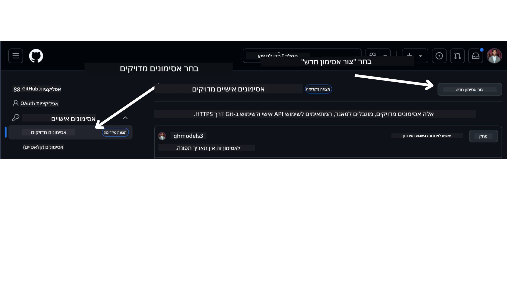

<!--
CO_OP_TRANSLATOR_METADATA:
{
  "original_hash": "76945069b52a49cd0432ae3e0b0ba22e",
  "translation_date": "2025-07-12T07:53:23+00:00",
  "source_file": "00-course-setup/README.md",
  "language_code": "he"
}
-->
בחשבון ה-GitHub שלך.

בחר באפשרות `Fine-grained tokens` בצד השמאלי של המסך.

לאחר מכן בחר ב-`Generate new token`.



תתבקש להזין שם לטוקן שלך, לבחור תאריך תפוגה (מומלץ: 30 ימים), ולבחור את ההרשאות לטוקן (מאגרי קוד ציבוריים).

כמו כן, יש לערוך את ההרשאות של הטוקן הזה: Permissions -> Models -> מאפשר גישה למודלים של GitHub

העתק את הטוקן החדש שיצרת. כעת תוסיף אותו לקובץ `.env` הכלול בקורס זה.


### שלב 2: צור את קובץ ה-`.env` שלך

כדי ליצור את קובץ ה-`.env` שלך, הרץ את הפקודה הבאה בטרמינל שלך.

```bash
cp .env.example .env
```

זה יעתיק את קובץ הדוגמה וייצור קובץ `.env` בתיקייה שלך, שם תוכל למלא את הערכים של משתני הסביבה.

לאחר שהעתקת את הטוקן, פתח את קובץ ה-`.env` בעורך הטקסט האהוב עליך והדבק את הטוקן בשדה `GITHUB_TOKEN`.

כעת אמור להיות באפשרותך להריץ את דוגמאות הקוד של הקורס הזה.

## הגדרה לדוגמאות המשתמשות ב-Azure AI Foundry ושירות Azure AI Agent

### שלב 1: קבל את נקודת הקצה של פרויקט ה-Azure שלך

עקוב אחר השלבים ליצירת מרכז ופרויקט ב-Azure AI Foundry שנמצאים כאן: [סקירת משאבי Hub](https://learn.microsoft.com/en-us/azure/ai-foundry/concepts/ai-resources)

לאחר שיצרת את הפרויקט, תצטרך לקבל את מחרוזת החיבור של הפרויקט שלך.

ניתן לעשות זאת על ידי כניסה לעמוד **Overview** של הפרויקט בפורטל Azure AI Foundry.


### שלב 2: צור את קובץ ה-`.env` שלך

כדי ליצור את קובץ ה-`.env` שלך, הרץ את הפקודה הבאה בטרמינל שלך.

```bash
cp .env.example .env
```

זה יעתיק את קובץ הדוגמה וייצור קובץ `.env` בתיקייה שלך, שם תוכל למלא את הערכים של משתני הסביבה.

לאחר שהעתקת את הטוקן, פתח את קובץ ה-`.env` בעורך הטקסט האהוב עליך והדבק את הטוקן בשדה `PROJECT_ENDPOINT`.

### שלב 3: התחבר ל-Azure

כפרקטיקה בטיחותית מומלצת, נשתמש ב-[אימות ללא מפתח](https://learn.microsoft.com/azure/developer/ai/keyless-connections?tabs=csharp%2Cazure-cli?WT.mc_id=academic-105485-koreyst) כדי לאמת ל-Azure OpenAI עם Microsoft Entra ID. לפני שתוכל לעשות זאת, תצטרך להתקין את **Azure CLI** לפי [הוראות ההתקנה](https://learn.microsoft.com/cli/azure/install-azure-cli?WT.mc_id=academic-105485-koreyst) למערכת ההפעלה שלך.

לאחר מכן, פתח טרמינל והריץ `az login --use-device-code` כדי להתחבר לחשבון ה-Azure שלך.

לאחר ההתחברות, בחר את המנוי שלך בטרמינל.


## משתני סביבה נוספים - Azure Search ו-Azure OpenAI

לשיעור Agentic RAG - שיעור 5 - יש דוגמאות המשתמשות ב-Azure Search ו-Azure OpenAI.

אם ברצונך להריץ דוגמאות אלו, תצטרך להוסיף את משתני הסביבה הבאים לקובץ ה-`.env` שלך:

### עמוד סקירה (פרויקט)

- `AZURE_SUBSCRIPTION_ID` - בדוק את **פרטי הפרויקט** בעמוד **Overview** של הפרויקט שלך.

- `AZURE_AI_PROJECT_NAME` - הסתכל בראש עמוד ה-**Overview** של הפרויקט שלך.

- `AZURE_OPENAI_SERVICE` - מצא זאת בכרטיסיית **Included capabilities** עבור **Azure OpenAI Service** בעמוד ה-**Overview**.

### מרכז ניהול

- `AZURE_OPENAI_RESOURCE_GROUP` - עבור ל-**Project properties** בעמוד ה-**Overview** של מרכז הניהול.

- `GLOBAL_LLM_SERVICE` - תחת **Connected resources**, מצא את שם החיבור של **Azure AI Services**. אם לא מופיע, בדוק בפורטל Azure תחת קבוצת המשאבים שלך את שם משאב שירותי ה-AI.

### עמוד מודלים ונקודות קצה

- `AZURE_OPENAI_EMBEDDING_DEPLOYMENT_NAME` - בחר את מודל ההטמעה שלך (למשל, `text-embedding-ada-002`) ורשום את **שם הפריסה** מפרטי המודל.

- `AZURE_OPENAI_CHAT_DEPLOYMENT_NAME` - בחר את מודל הצ'אט שלך (למשל, `gpt-4o-mini`) ורשום את **שם הפריסה** מפרטי המודל.

### פורטל Azure

- `AZURE_OPENAI_ENDPOINT` - חפש **Azure AI services**, לחץ עליו, עבור ל-**Resource Management**, **Keys and Endpoint**, גלול למטה ל-"Azure OpenAI endpoints", והעתק את זה שכתוב "Language APIs".

- `AZURE_OPENAI_API_KEY` - מאותו מסך, העתק את KEY 1 או KEY 2.

- `AZURE_SEARCH_SERVICE_ENDPOINT` - מצא את משאב **Azure AI Search** שלך, לחץ עליו, וצפה ב-**Overview**.

- `AZURE_SEARCH_API_KEY` - לאחר מכן עבור ל-**Settings** ואז ל-**Keys** כדי להעתיק את מפתח המנהל הראשי או המשני.

### דף אינטרנט חיצוני

- `AZURE_OPENAI_API_VERSION` - בקר בעמוד [מחזור חיי גרסת ה-API](https://learn.microsoft.com/en-us/azure/ai-services/openai/api-version-deprecation#latest-ga-api-release) תחת **Latest GA API release**.

### הגדרת אימות ללא מפתח

במקום לקבוע את האישורים שלך בקוד, נשתמש בחיבור ללא מפתח עם Azure OpenAI. לשם כך, נייבא את `DefaultAzureCredential` ולאחר מכן נקרא לפונקציית `DefaultAzureCredential` כדי לקבל את האישורים.

```python
from azure.identity import DefaultAzureCredential, InteractiveBrowserCredential
```

## תקוע איפשהו?

אם יש לך בעיות בהרצת ההגדרה הזו, הצטרף ל-

**כתב ויתור**:  
מסמך זה תורגם באמצעות שירות תרגום מבוסס בינה מלאכותית [Co-op Translator](https://github.com/Azure/co-op-translator). למרות שאנו שואפים לדיוק, יש לקחת בחשבון כי תרגומים אוטומטיים עלולים להכיל שגיאות או אי-דיוקים. המסמך המקורי בשפת המקור שלו נחשב למקור הסמכותי. למידע קריטי מומלץ להשתמש בתרגום מקצועי על ידי מתרגם אנושי. אנו לא נושאים באחריות לכל אי-הבנה או פרשנות שגויה הנובעת משימוש בתרגום זה.