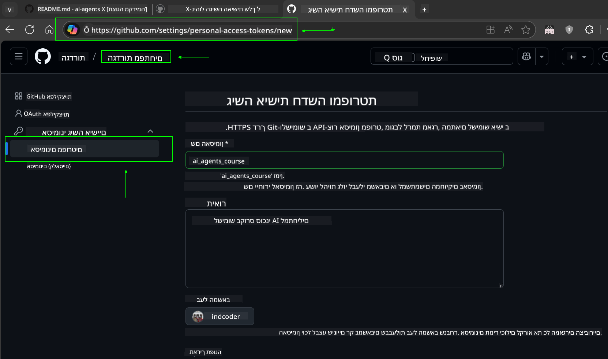
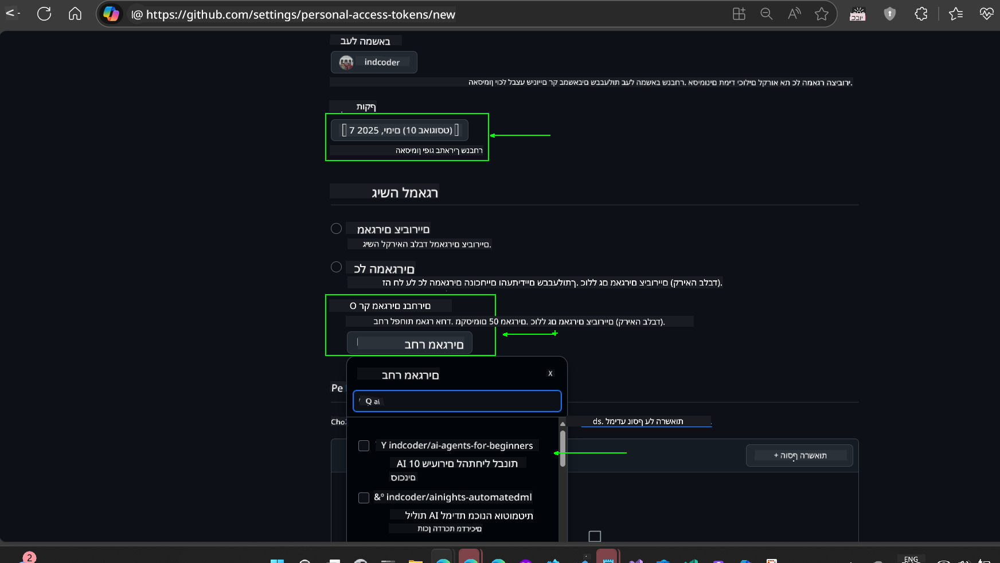
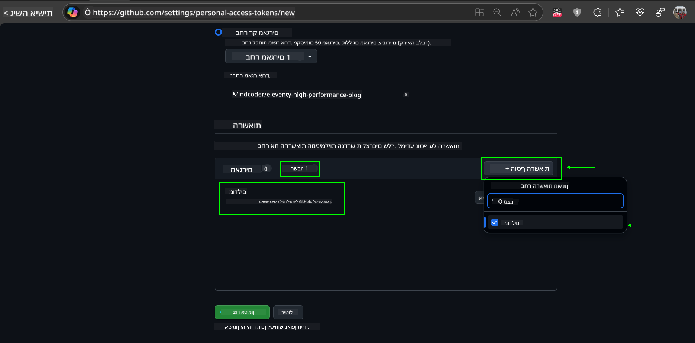
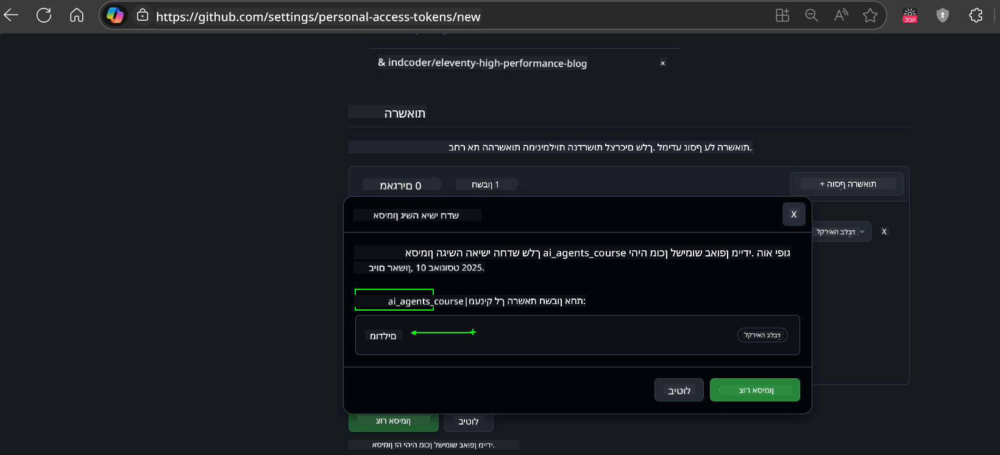
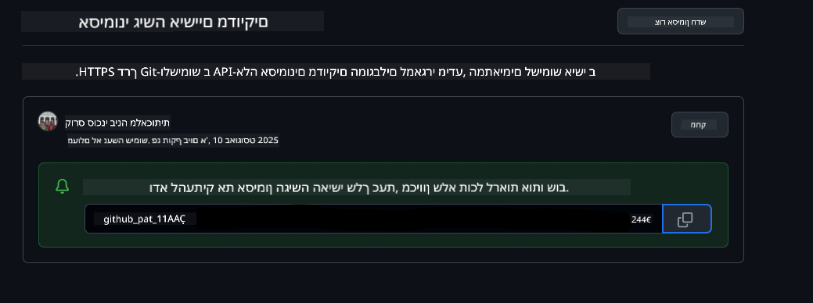
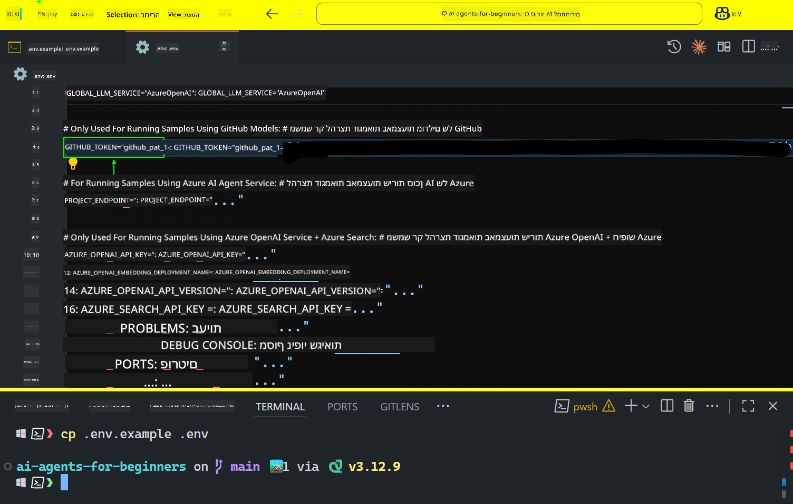

<!--
CO_OP_TRANSLATOR_METADATA:
{
  "original_hash": "8693a24942b670e3cb8def77f92513f9",
  "translation_date": "2025-08-21T13:27:04+00:00",
  "source_file": "00-course-setup/README.md",
  "language_code": "he"
}
-->
# הגדרת הקורס

## הקדמה

בשיעור זה נלמד כיצד להפעיל את דוגמאות הקוד של הקורס.

## שיבוט או יצירת Fork למאגר זה

כדי להתחיל, יש לשבט או ליצור Fork למאגר ה-GitHub. פעולה זו תיצור גרסה משלכם של חומרי הקורס, כך שתוכלו להפעיל, לבדוק ולשנות את הקוד!

ניתן לעשות זאת על ידי לחיצה על הקישור ל-


## הפעלת הקוד

הקורס מציע סדרת מחברות Jupyter שתוכלו להפעיל כדי לקבל ניסיון מעשי בבניית סוכני AI.

דוגמאות הקוד משתמשות באחת מהאפשרויות הבאות:

**דורש חשבון GitHub - חינם**:

1) Semantic Kernel Agent Framework + GitHub Models Marketplace. מסומן כ-(semantic-kernel.ipynb)
2) AutoGen Framework + GitHub Models Marketplace. מסומן כ-(autogen.ipynb)

**דורש מנוי Azure**:
3) Azure AI Foundry + Azure AI Agent Service. מסומן כ-(azureaiagent.ipynb)

אנו ממליצים לנסות את כל שלושת סוגי הדוגמאות כדי לראות איזו מהן מתאימה לכם ביותר.

האפשרות שתבחרו תקבע אילו שלבי הגדרה תצטרכו לבצע בהמשך:

## דרישות

- Python 3.12+
  - **NOTE**: אם אין לכם Python3.12 מותקן, ודאו שאתם מתקינים אותו. לאחר מכן צרו את ה-venv שלכם באמצעות python3.12 כדי להבטיח שהגרסאות הנכונות יותקנו מקובץ requirements.txt.
- חשבון GitHub - לגישה ל-GitHub Models Marketplace
- מנוי Azure - לגישה ל-Azure AI Foundry
- חשבון Azure AI Foundry - לגישה ל-Azure AI Agent Service

הכללנו קובץ `requirements.txt` בתיקיית השורש של מאגר זה, המכיל את כל חבילות ה-Python הנדרשות להפעלת דוגמאות הקוד.

ניתן להתקין אותן על ידי הרצת הפקודה הבאה בטרמינל בתיקיית השורש של המאגר:

```bash
pip install -r requirements.txt
```
אנו ממליצים ליצור סביבה וירטואלית של Python כדי להימנע מקונפליקטים ובעיות.

## הגדרת VSCode
ודאו שאתם משתמשים בגרסת Python הנכונה ב-VSCode.


## הגדרה לדוגמאות באמצעות GitHub Models 

### שלב 1: קבלת GitHub Personal Access Token (PAT)

הקורס משתמש ב-GitHub Models Marketplace, המספק גישה חינמית למודלים של שפה גדולה (LLMs) שתשתמשו בהם לבניית סוכני AI.

כדי להשתמש ב-GitHub Models, תצטרכו ליצור [GitHub Personal Access Token](https://docs.github.com/en/authentication/keeping-your-account-and-data-secure/managing-your-personal-access-tokens).

ניתן לעשות זאת על ידי מעבר ל-



1. בחרו באפשרות `Fine-grained tokens` בצד שמאל של המסך תחת **Developer settings**.

2. הזינו שם תיאורי עבור הטוקן שלכם שמשקף את מטרתו, כך שיהיה קל לזהות אותו מאוחר יותר.

    🔐 המלצה על משך הטוקן

    משך מומלץ: 30 ימים  
    למען אבטחה גבוהה יותר, ניתן לבחור תקופה קצרה יותר—כמו 7 ימים 🛡️  
    זו דרך מצוינת להציב יעד אישי ולהשלים את הקורס בזמן שהמומנטום הלימודי שלכם גבוה 🚀.

    

3. הגבילו את תחום הטוקן ל-Fork של מאגר זה.

    

4. הגבלות הרשאות הטוקן: תחת **Permissions**, לחצו על לשונית **Account**, ואז לחצו על כפתור "+ Add permissions". יופיע תפריט נפתח. חפשו **Models** וסמנו את התיבה עבורו.
    

5. ודאו את ההרשאות הנדרשות לפני יצירת הטוקן. 

6. לפני יצירת הטוקן, ודאו שאתם מוכנים לשמור את הטוקן במקום מאובטח כמו כספת מנהל סיסמאות, שכן הוא לא יוצג שוב לאחר יצירתו. 

העתיקו את הטוקן החדש שיצרתם. כעת תוסיפו אותו לקובץ `.env` הכלול בקורס זה.

### שלב 2: יצירת קובץ `.env`

כדי ליצור את קובץ `.env`, הריצו את הפקודה הבאה בטרמינל.

```bash
cp .env.example .env
```

פעולה זו תעתיק את קובץ הדוגמה ותיצור `.env` בתיקייה שלכם, שם תמלאו את הערכים עבור משתני הסביבה.

עם הטוקן שהעתקתם, פתחו את קובץ `.env` בעורך הטקסט המועדף עליכם והדביקו את הטוקן בשדה `GITHUB_TOKEN`.


כעת תוכלו להפעיל את דוגמאות הקוד של הקורס.

## הגדרה לדוגמאות באמצעות Azure AI Foundry ו-Azure AI Agent Service

### שלב 1: קבלת נקודת הקצה של פרויקט Azure שלכם

עקבו אחר השלבים ליצירת hub ופרויקט ב-Azure AI Foundry כאן: [Hub resources overview](https://learn.microsoft.com/en-us/azure/ai-foundry/concepts/ai-resources)

לאחר שיצרתם את הפרויקט שלכם, תצטרכו לקבל את מחרוזת החיבור עבור הפרויקט.

ניתן לעשות זאת על ידי מעבר לדף **Overview** של הפרויקט שלכם בפורטל Azure AI Foundry.


### שלב 2: יצירת קובץ `.env`

כדי ליצור את קובץ `.env`, הריצו את הפקודה הבאה בטרמינל.

```bash
cp .env.example .env
```

פעולה זו תעתיק את קובץ הדוגמה ותיצור `.env` בתיקייה שלכם, שם תמלאו את הערכים עבור משתני הסביבה.

עם הטוקן שהעתקתם, פתחו את קובץ `.env` בעורך הטקסט המועדף עליכם והדביקו את הטוקן בשדה `PROJECT_ENDPOINT`.

### שלב 3: התחברות ל-Azure

כחלק מהמלצות אבטחה, נשתמש ב-[keyless authentication](https://learn.microsoft.com/azure/developer/ai/keyless-connections?tabs=csharp%2Cazure-cli?WT.mc_id=academic-105485-koreyst) כדי להתחבר ל-Azure OpenAI עם Microsoft Entra ID.

לאחר מכן, פתחו טרמינל והריצו `az login --use-device-code` כדי להתחבר לחשבון Azure שלכם.

לאחר שהתחברתם, בחרו את המנוי שלכם בטרמינל.

## משתני סביבה נוספים - Azure Search ו-Azure OpenAI 

לשיעור Agentic RAG - שיעור 5 - יש דוגמאות שמשתמשות ב-Azure Search וב-Azure OpenAI.

אם תרצו להפעיל את הדוגמאות הללו, תצטרכו להוסיף את משתני הסביבה הבאים לקובץ `.env` שלכם:

### דף סקירה (פרויקט)

- `AZURE_SUBSCRIPTION_ID` - בדקו **Project details** בדף **Overview** של הפרויקט שלכם.

- `AZURE_AI_PROJECT_NAME` - הסתכלו בראש דף **Overview** של הפרויקט שלכם.

- `AZURE_OPENAI_SERVICE` - מצאו זאת בלשונית **Included capabilities** עבור **Azure OpenAI Service** בדף **Overview**.

### מרכז ניהול

- `AZURE_OPENAI_RESOURCE_GROUP` - עברו ל-**Project properties** בדף **Overview** של **Management Center**.

- `GLOBAL_LLM_SERVICE` - תחת **Connected resources**, מצאו את שם החיבור של **Azure AI Services**. אם לא מופיע, בדקו את **Azure portal** תחת קבוצת המשאבים שלכם עבור שם משאבי AI Services.

### דף מודלים + נקודות קצה

- `AZURE_OPENAI_EMBEDDING_DEPLOYMENT_NAME` - בחרו את מודל ההטמעה שלכם (לדוגמה, `text-embedding-ada-002`) ורשמו את **Deployment name** מפרטי המודל.

- `AZURE_OPENAI_CHAT_DEPLOYMENT_NAME` - בחרו את מודל הצ'אט שלכם (לדוגמה, `gpt-4o-mini`) ורשמו את **Deployment name** מפרטי המודל.

### פורטל Azure

- `AZURE_OPENAI_ENDPOINT` - חפשו **Azure AI services**, לחצו עליו, ואז עברו ל-**Resource Management**, **Keys and Endpoint**, גללו למטה ל-"Azure OpenAI endpoints", והעתיקו את זה שאומר "Language APIs".

- `AZURE_OPENAI_API_KEY` - מאותו מסך, העתיקו KEY 1 או KEY 2.

- `AZURE_SEARCH_SERVICE_ENDPOINT` - מצאו את משאב **Azure AI Search** שלכם, לחצו עליו, וראו **Overview**.

- `AZURE_SEARCH_API_KEY` - לאחר מכן עברו ל-**Settings** ואז ל-**Keys** כדי להעתיק את המפתח הראשי או המשני של המנהל.

### דף חיצוני

- `AZURE_OPENAI_API_VERSION` - בקרו בדף [API version lifecycle](https://learn.microsoft.com/en-us/azure/ai-services/openai/api-version-deprecation#latest-ga-api-release) תחת **Latest GA API release**.

### הגדרת keyless authentication

במקום להקשיח את האישורים שלכם, נשתמש בחיבור ללא מפתח עם Azure OpenAI. לשם כך, נייבא `DefaultAzureCredential` ולאחר מכן נקרא לפונקציה `DefaultAzureCredential` כדי לקבל את האישורים.

```python
from azure.identity import DefaultAzureCredential, InteractiveBrowserCredential
```

## נתקעתם איפשהו?

אם יש לכם בעיות בהפעלת ההגדרה, הצטרפו ל-

## השיעור הבא

כעת אתם מוכנים להפעיל את הקוד של הקורס. למידה מהנה על עולם סוכני ה-AI!

[מבוא לסוכני AI ושימושים בסוכנים](../01-intro-to-ai-agents/README.md)

**כתב ויתור**:  
מסמך זה תורגם באמצעות שירות תרגום מבוסס בינה מלאכותית [Co-op Translator](https://github.com/Azure/co-op-translator). בעוד שאנו שואפים לדיוק, יש לקחת בחשבון שתרגומים אוטומטיים עשויים להכיל שגיאות או אי-דיוקים. המסמך המקורי בשפתו המקורית נחשב למקור הסמכותי. למידע קריטי, מומלץ להשתמש בתרגום מקצועי על ידי בני אדם. איננו נושאים באחריות לכל אי-הבנה או פרשנות שגויה הנובעת משימוש בתרגום זה.