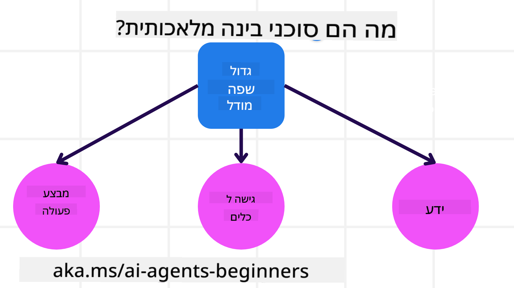
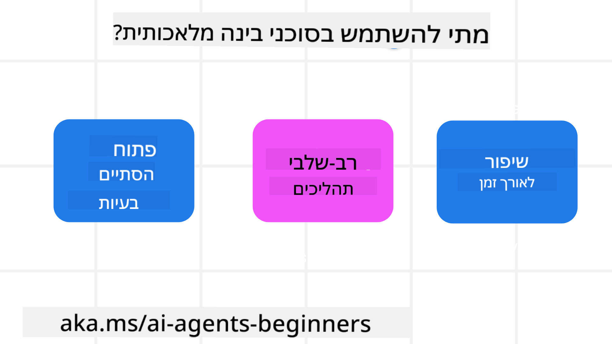

<!--
CO_OP_TRANSLATOR_METADATA:
{
  "original_hash": "d84943abc8f001ad4670418d32c2d899",
  "translation_date": "2025-07-12T08:09:14+00:00",
  "source_file": "01-intro-to-ai-agents/README.md",
  "language_code": "he"
}
-->
להיפגש עם לומדים אחרים ובוני סוכני AI ולשאול כל שאלה שיש לכם לגבי הקורס הזה.

כדי להתחיל את הקורס, נתחיל בהבנה טובה יותר של מה הם סוכני AI ואיך נוכל להשתמש בהם באפליקציות ובזרימות עבודה שאנחנו בונים.

## מבוא

השיעור הזה מכסה:

- מה הם סוכני AI ומהם סוגי הסוכנים השונים?
- באילו מקרים שימוש סוכני AI הם הטובים ביותר ואיך הם יכולים לעזור לנו?
- מהם חלקי הבסיס בתכנון פתרונות סוכניים?

## מטרות הלמידה
לאחר סיום השיעור, תצטרכו להיות מסוגלים:

- להבין את מושגי סוכני AI ואיך הם שונים מפתרונות AI אחרים.
- ליישם סוכני AI בצורה היעילה ביותר.
- לתכנן פתרונות סוכניים בצורה פרודוקטיבית הן למשתמשים והן ללקוחות.

## הגדרת סוכני AI וסוגי סוכני AI

### מה הם סוכני AI?

סוכני AI הם **מערכות** שמאפשרות ל**מודלים שפתיים גדולים (LLMs)** **לבצע פעולות** על ידי הרחבת היכולות שלהם באמצעות מתן גישה ל-LLMs ל**כלים** ו**ידע**.

בואו נפרק את ההגדרה לחלקים קטנים יותר:

- **מערכת** - חשוב לחשוב על סוכנים לא רק כרכיב יחיד אלא כמערכת של רכיבים רבים. ברמה הבסיסית, רכיבי סוכן AI הם:
  - **סביבה** - המרחב המוגדר שבו הסוכן פועל. לדוגמה, אם יש לנו סוכן AI להזמנת טיסות, הסביבה יכולה להיות מערכת ההזמנות שהסוכן משתמש בה כדי להשלים משימות.
  - **חיישנים** - לסביבות יש מידע והן מספקות משוב. סוכני AI משתמשים בחיישנים כדי לאסוף ולפרש את המידע על מצב הסביבה הנוכחי. בדוגמת סוכן ההזמנות, מערכת ההזמנות יכולה לספק מידע כמו זמינות מלונות או מחירי טיסות.
  - **מפעילים** - לאחר שהסוכן מקבל את מצב הסביבה הנוכחי, עבור המשימה הנוכחית הסוכן קובע איזו פעולה לבצע כדי לשנות את הסביבה. עבור סוכן ההזמנות, זה יכול להיות להזמין חדר פנוי למשתמש.

**מודלים שפתיים גדולים** - המושג של סוכנים התקיים לפני יצירת ה-LLMs. היתרון בבניית סוכני AI עם LLMs הוא היכולת שלהם לפרש שפה אנושית ונתונים. יכולת זו מאפשרת ל-LLMs לפרש מידע סביבתי ולהגדיר תוכנית לשינוי הסביבה.

**ביצוע פעולות** - מחוץ למערכות סוכני AI, ה-LLMs מוגבלים למצבים שבהם הפעולה היא יצירת תוכן או מידע על בסיס בקשת המשתמש. בתוך מערכות סוכני AI, ה-LLMs יכולים להשלים משימות על ידי פרשנות בקשת המשתמש ושימוש בכלים הזמינים בסביבתם.

**גישה לכלים** - אילו כלים ה-LLM יכול לגשת אליהם מוגדרים על ידי 1) הסביבה שבה הוא פועל ו-2) מפתח הסוכן. בדוגמת סוכן הנסיעות שלנו, הכלים של הסוכן מוגבלים על ידי הפעולות הזמינות במערכת ההזמנות, ו/או המפתח יכול להגביל את גישת הסוכן לכלים לטיסות בלבד.

**זיכרון + ידע** - הזיכרון יכול להיות קצר טווח בהקשר של השיחה בין המשתמש לסוכן. בטווח הארוך, מעבר למידע שמספקת הסביבה, סוכני AI יכולים גם לשלוף ידע ממערכות, שירותים, כלים ואפילו סוכנים אחרים. בדוגמת סוכן הנסיעות, הידע הזה יכול להיות מידע על העדפות הנסיעה של המשתמש המאוחסן במאגר נתוני לקוחות.

### סוגי הסוכנים השונים

כעת כשיש לנו הגדרה כללית של סוכני AI, נבחן כמה סוגי סוכנים ספציפיים ואיך הם היו מיושמים בסוכן AI להזמנת נסיעות.

| **סוג סוכן**                 | **תיאור**                                                                                                                          | **דוגמה**                                                                                                                                                                                                                   |
| ----------------------------- | ---------------------------------------------------------------------------------------------------------------------------------- | ----------------------------------------------------------------------------------------------------------------------------------------------------------------------------------------------------------------------------- |
| **סוכני רפלקס פשוטים**       | מבצעים פעולות מיידיות על בסיס חוקים מוגדרים מראש.                                                                              | סוכן הנסיעות מפרש את ההקשר של האימייל ומעביר תלונות נסיעה לשירות הלקוחות.                                                                                                                                                   |
| **סוכני רפלקס מבוססי מודל**  | מבצעים פעולות על בסיס מודל של העולם ושינויים במודל זה.                                                                          | סוכן הנסיעות מעדיף מסלולים עם שינויים משמעותיים במחירים בהתבסס על גישה לנתוני מחירים היסטוריים.                                                                                                                          |
| **סוכני מבוססי מטרה**        | יוצרים תוכניות להשגת מטרות ספציפיות על ידי פרשנות המטרה וקביעת פעולות להשגתה.                                                  | סוכן הנסיעות מזמין מסע על ידי קביעת סידורי נסיעה נדרשים (רכב, תחבורה ציבורית, טיסות) מהמיקום הנוכחי ליעד.                                                                                                                  |
| **סוכני מבוססי תועלת**       | שוקלים העדפות ומשקללים פשרות מספריות כדי לקבוע איך להשיג מטרות.                                                                 | סוכן הנסיעות ממקסם תועלת על ידי שקלול נוחות מול עלות בעת הזמנת הנסיעה.                                                                                                                                                      |
| **סוכני למידה**              | משתפרים עם הזמן על ידי תגובה למשוב והתאמת פעולות בהתאם.                                                                          | סוכן הנסיעות משתפר באמצעות שימוש במשוב לקוחות מסקרים לאחר הנסיעה כדי לבצע התאמות להזמנות עתידיות.                                                                                                                         |
| **סוכנים היררכיים**          | כוללים מספר סוכנים במערכת מדורגת, כאשר סוכנים ברמה גבוהה מחלקים משימות לתת-משימות לסוכנים ברמה נמוכה להשלים.                  | סוכן הנסיעות מבטל טיול על ידי חלוקת המשימה לתת-משימות (למשל ביטול הזמנות ספציפיות) וסוכנים ברמה נמוכה משלימים אותן, ומדווחים חזרה לסוכן ברמה גבוהה.                                                                     |
| **מערכות רב-סוכניות (MAS)**  | סוכנים משלימים משימות באופן עצמאי, בשיתוף פעולה או בתחרות.                                                                      | שיתופי: מספר סוכנים מזמינים שירותי נסיעה ספציפיים כמו מלונות, טיסות ובידור. תחרותי: מספר סוכנים מנהלים ומתחרים על לוח הזמנות משותף במלון כדי להזמין לקוחות למלון.                                                        |

## מתי להשתמש בסוכני AI

בחלק הקודם השתמשנו בדוגמת סוכן הנסיעות כדי להסביר איך סוגי הסוכנים השונים יכולים לשמש בתרחישים שונים של הזמנת נסיעות. נמשיך להשתמש באפליקציה זו לאורך כל הקורס.

בואו נבחן את סוגי המקרים שבהם סוכני AI הם הטובים ביותר:

- **בעיות פתוחות** - מאפשרים ל-LLM לקבוע את השלבים הנדרשים להשלמת משימה כי לא תמיד ניתן לקודד זאת מראש בזרימת עבודה.
- **תהליכים מרובי שלבים** - משימות שדורשות רמת מורכבות שבה הסוכן צריך להשתמש בכלים או במידע לאורך מספר סבבים ולא בשליפה חד-פעמית.
- **שיפור לאורך זמן** - משימות שבהן הסוכן יכול להשתפר עם הזמן על ידי קבלת משוב מהסביבה או מהמשתמשים כדי לספק תועלת טובה יותר.

נכסה שיקולים נוספים לשימוש בסוכני AI בשיעור בניית סוכני AI אמינים.

## יסודות פתרונות סוכניים

### פיתוח סוכן

השלב הראשון בתכנון מערכת סוכן AI הוא להגדיר את הכלים, הפעולות וההתנהגויות. בקורס זה, אנו מתמקדים בשימוש ב**שירות סוכני AI של Azure** להגדרת הסוכנים שלנו. השירות מציע תכונות כמו:

- בחירת מודלים פתוחים כגון OpenAI, Mistral ו-Llama
- שימוש בנתונים מורשים דרך ספקים כמו Tripadvisor
- שימוש בכלי OpenAPI 3.0 סטנדרטיים

### דפוסי סוכנות

התקשורת עם LLMs מתבצעת דרך פרומפטים. בהתחשב באופי החצי-אוטונומי של סוכני AI, לא תמיד אפשרי או נדרש להפעיל מחדש את ה-LLM ידנית לאחר שינוי בסביבה. אנו משתמשים ב**דפוסי סוכנות** שמאפשרים לנו להפעיל את ה-LLM במספר שלבים בצורה ניתנת להרחבה.

הקורס מחולק לכמה מהדפוסים הפופולריים הנוכחיים של סוכנות.

### מסגרות סוכנות

מסגרות סוכנות מאפשרות למפתחים ליישם דפוסי סוכנות דרך קוד. מסגרות אלו מציעות תבניות, תוספים וכלים לשיתוף פעולה טוב יותר עם סוכני AI. יתרונות אלו מספקים יכולות תצפית ופתרון בעיות משופרות במערכות סוכני AI.

בקורס זה נחקור את מסגרת AutoGen המחקרית ואת מסגרת Agent המוכנה לייצור מ-Semantic Kernel.

## שיעור קודם

[הגדרת הקורס](../00-course-setup/README.md)

## שיעור הבא

[חקירת מסגרות סוכנות](../02-explore-agentic-frameworks/README.md)

**כתב ויתור**:  
מסמך זה תורגם באמצעות שירות תרגום מבוסס בינה מלאכותית [Co-op Translator](https://github.com/Azure/co-op-translator). למרות שאנו שואפים לדיוק, יש לקחת בחשבון כי תרגומים אוטומטיים עלולים להכיל שגיאות או אי-דיוקים. המסמך המקורי בשפת המקור שלו נחשב למקור הסמכותי. למידע קריטי מומלץ להשתמש בתרגום מקצועי על ידי מתרגם אנושי. אנו לא נושאים באחריות לכל אי-הבנה או פרשנות שגויה הנובעת משימוש בתרגום זה.