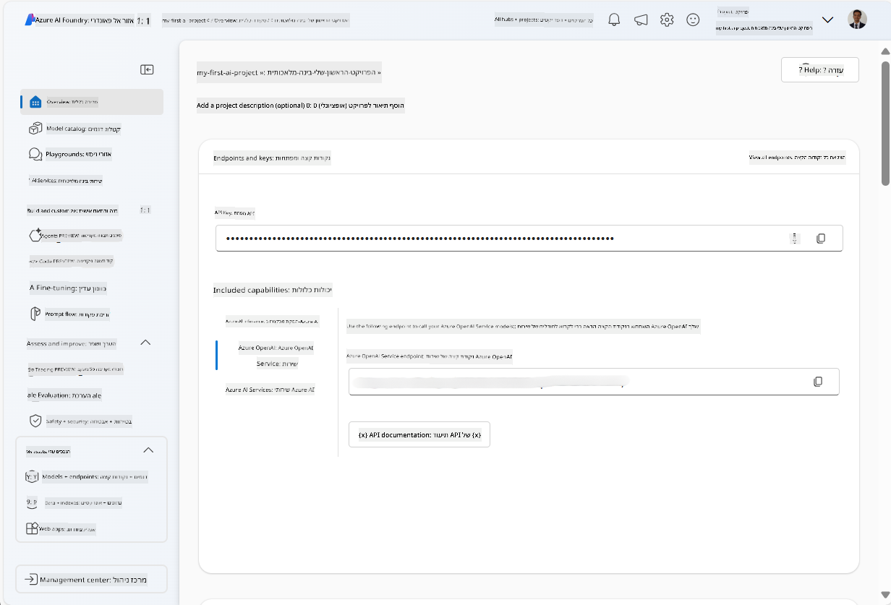
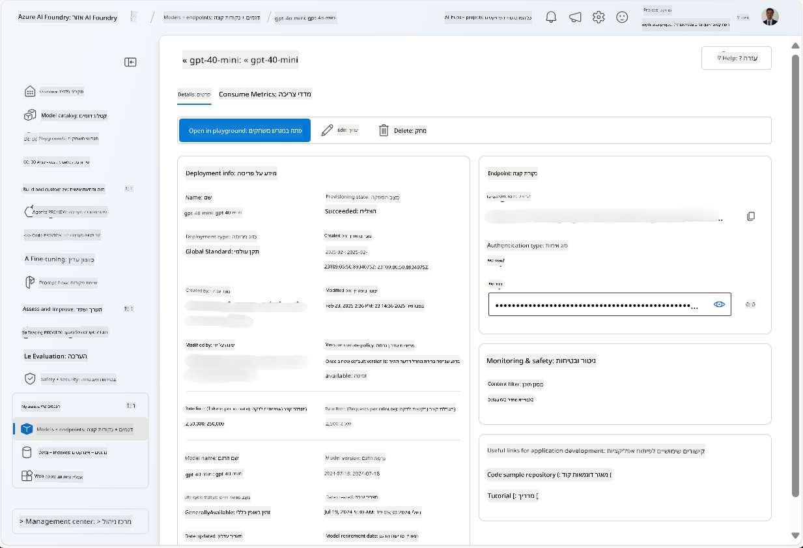
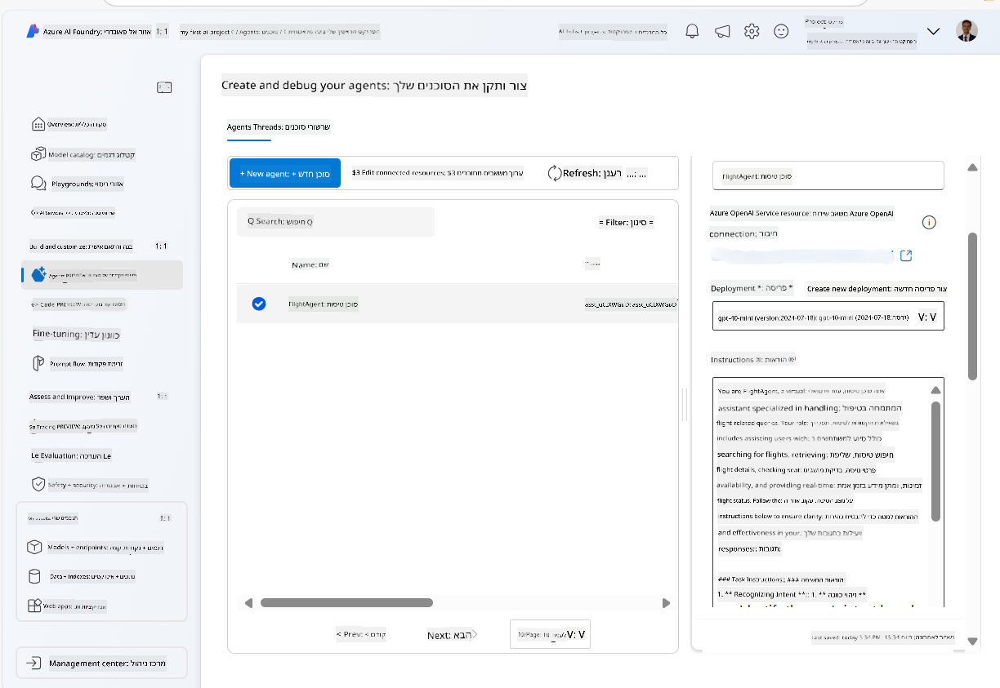
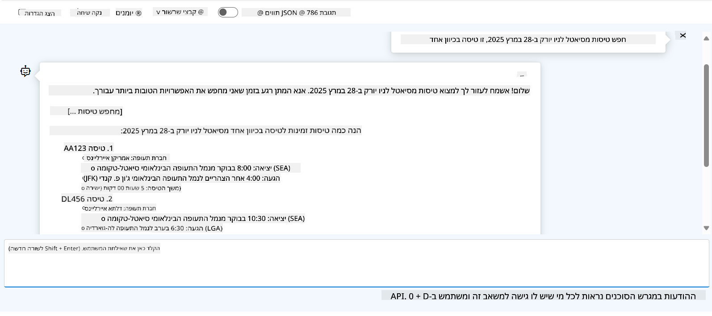

<!--
CO_OP_TRANSLATOR_METADATA:
{
  "original_hash": "7e92870dc0843e13d4dabc620c09d2d9",
  "translation_date": "2025-07-12T08:20:37+00:00",
  "source_file": "02-explore-agentic-frameworks/azure-ai-foundry-agent-creation.md",
  "language_code": "he"
}
-->
# פיתוח שירות Azure AI Agent

בתרגיל זה, תשתמש בכלי שירות Azure AI Agent ב-[פורטל Azure AI Foundry](https://ai.azure.com/?WT.mc_id=academic-105485-koreyst) כדי ליצור סוכן להזמנת טיסות. הסוכן יוכל לתקשר עם משתמשים ולספק מידע על טיסות.

## דרישות מוקדמות

כדי להשלים את התרגיל, תזדקק לדברים הבאים:
1. חשבון Azure עם מנוי פעיל. [צור חשבון בחינם](https://azure.microsoft.com/free/?WT.mc_id=academic-105485-koreyst).
2. הרשאות ליצירת Azure AI Foundry hub או שיש לך אחד שנוצר עבורך.
    - אם התפקיד שלך הוא Contributor או Owner, תוכל לעקוב אחר השלבים במדריך זה.

## יצירת Azure AI Foundry hub

> **Note:** Azure AI Foundry נקרא בעבר Azure AI Studio.

1. עקוב אחר ההנחיות בפוסט הבלוג של [Azure AI Foundry](https://learn.microsoft.com/en-us/azure/ai-studio/?WT.mc_id=academic-105485-koreyst) ליצירת Azure AI Foundry hub.
2. כאשר הפרויקט שלך נוצר, סגור את כל הטיפים שמוצגים ובדוק את דף הפרויקט בפורטל Azure AI Foundry, שצריך להיראות דומה לתמונה הבאה:

    

## פריסת מודל

1. בפאנל השמאלי של הפרויקט שלך, בקטגוריית **My assets**, בחר בדף **Models + endpoints**.
2. בדף **Models + endpoints**, בכרטיסיית **Model deployments**, בתפריט **+ Deploy model**, בחר **Deploy base model**.
3. חפש את המודל `gpt-4o-mini` ברשימה, ואז בחר ואשר אותו.

    > **Note**: הפחתת TPM עוזרת למנוע שימוש יתר במכסת המנוי שבשימושך.

    

## יצירת סוכן

כעת כשפרסת מודל, תוכל ליצור סוכן. סוכן הוא מודל AI שיחה שניתן להשתמש בו לתקשורת עם משתמשים.

1. בפאנל השמאלי של הפרויקט שלך, בקטגוריית **Build & Customize**, בחר בדף **Agents**.
2. לחץ על **+ Create agent** כדי ליצור סוכן חדש. בתיבת הדו-שיח **Agent Setup**:
    - הזן שם לסוכן, לדוגמה `FlightAgent`.
    - ודא שהפריסה של מודל `gpt-4o-mini` שיצרת קודם נבחרה.
    - הגדר את ה**Instructions** בהתאם להנחיות שברצונך שהסוכן יעקוב אחריהן. הנה דוגמה:
    ```
    You are FlightAgent, a virtual assistant specialized in handling flight-related queries. Your role includes assisting users with searching for flights, retrieving flight details, checking seat availability, and providing real-time flight status. Follow the instructions below to ensure clarity and effectiveness in your responses:

    ### Task Instructions:
    1. **Recognizing Intent**:
       - Identify the user's intent based on their request, focusing on one of the following categories:
         - Searching for flights
         - Retrieving flight details using a flight ID
         - Checking seat availability for a specified flight
         - Providing real-time flight status using a flight number
       - If the intent is unclear, politely ask users to clarify or provide more details.
        
    2. **Processing Requests**:
        - Depending on the identified intent, perform the required task:
        - For flight searches: Request details such as origin, destination, departure date, and optionally return date.
        - For flight details: Request a valid flight ID.
        - For seat availability: Request the flight ID and date and validate inputs.
        - For flight status: Request a valid flight number.
        - Perform validations on provided data (e.g., formats of dates, flight numbers, or IDs). If the information is incomplete or invalid, return a friendly request for clarification.

    3. **Generating Responses**:
    - Use a tone that is friendly, concise, and supportive.
    - Provide clear and actionable suggestions based on the output of each task.
    - If no data is found or an error occurs, explain it to the user gently and offer alternative actions (e.g., refine search, try another query).
    
    ```
> [!NOTE]
> לפרומפט מפורט, תוכל לבדוק את [מאגר זה](https://github.com/ShivamGoyal03/RoamMind) למידע נוסף.
    
> בנוסף, ניתן להוסיף **Knowledge Base** ו-**Actions** כדי לשפר את יכולות הסוכן לספק מידע נוסף ולבצע משימות אוטומטיות על פי בקשות המשתמש. בתרגיל זה ניתן לדלג על שלבים אלה.
    


3. כדי ליצור סוכן רב-מודלי חדש, פשוט לחץ על **New Agent**. הסוכן החדש יוצג בדף Agents.

## בדיקת הסוכן

לאחר יצירת הסוכן, תוכל לבדוק כיצד הוא מגיב לשאילתות משתמש בפורטל Azure AI Foundry playground.

1. בראש פאנל ה**Setup** של הסוכן, בחר **Try in playground**.
2. בפאנל ה**Playground**, תוכל לתקשר עם הסוכן על ידי הקלדת שאילתות בחלון הצ'אט. לדוגמה, תוכל לבקש מהסוכן לחפש טיסות מסיאטל לניו יורק בתאריך 28.

    > **Note**: ייתכן שהסוכן לא יספק תגובות מדויקות, מאחר שבתרגיל זה לא נעשה שימוש בנתונים בזמן אמת. המטרה היא לבדוק את יכולת הסוכן להבין ולהגיב לשאילתות המשתמש בהתאם להנחיות שניתנו.

    

3. לאחר הבדיקה, תוכל להתאים את הסוכן עוד יותר על ידי הוספת כוונות, נתוני אימון ופעולות לשיפור יכולותיו.

## ניקוי משאבים

כאשר סיימת לבדוק את הסוכן, תוכל למחוק אותו כדי למנוע חיובים נוספים.
1. פתח את [פורטל Azure](https://portal.azure.com) וצפה בתכולת קבוצת המשאבים שבה פרסת את משאבי ה-hub ששימשו בתרגיל זה.
2. בסרגל הכלים, בחר **Delete resource group**.
3. הזן את שם קבוצת המשאבים ואשר שברצונך למחוק אותה.

## משאבים

- [תיעוד Azure AI Foundry](https://learn.microsoft.com/en-us/azure/ai-studio/?WT.mc_id=academic-105485-koreyst)
- [פורטל Azure AI Foundry](https://ai.azure.com/?WT.mc_id=academic-105485-koreyst)
- [התחלה עם Azure AI Studio](https://techcommunity.microsoft.com/blog/educatordeveloperblog/getting-started-with-azure-ai-studio/4095602?WT.mc_id=academic-105485-koreyst)
- [יסודות סוכני AI ב-Azure](https://learn.microsoft.com/en-us/training/modules/ai-agent-fundamentals/?WT.mc_id=academic-105485-koreyst)
- [Azure AI Discord](https://aka.ms/AzureAI/Discord)

**כתב ויתור**:  
מסמך זה תורגם באמצעות שירות תרגום מבוסס בינה מלאכותית [Co-op Translator](https://github.com/Azure/co-op-translator). למרות שאנו שואפים לדיוק, יש לקחת בחשבון כי תרגומים אוטומטיים עלולים להכיל שגיאות או אי-דיוקים. המסמך המקורי בשפת המקור שלו נחשב למקור הסמכותי. למידע קריטי מומלץ להשתמש בתרגום מקצועי על ידי אדם. אנו לא נושאים באחריות לכל אי-הבנה או פרשנות שגויה הנובעת משימוש בתרגום זה.