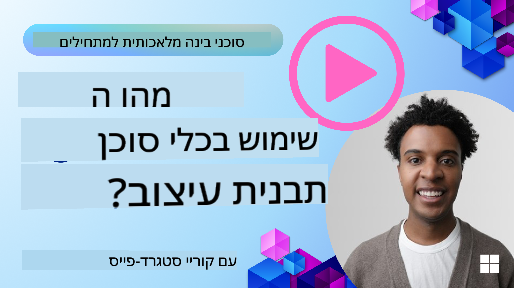
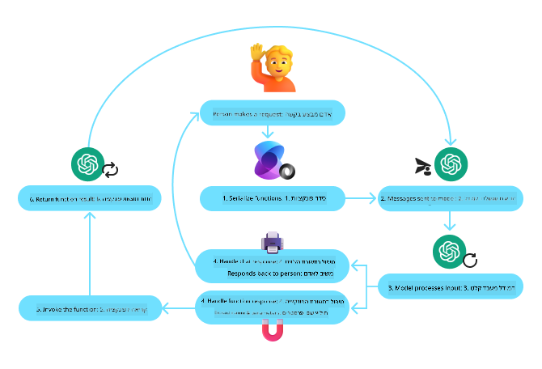
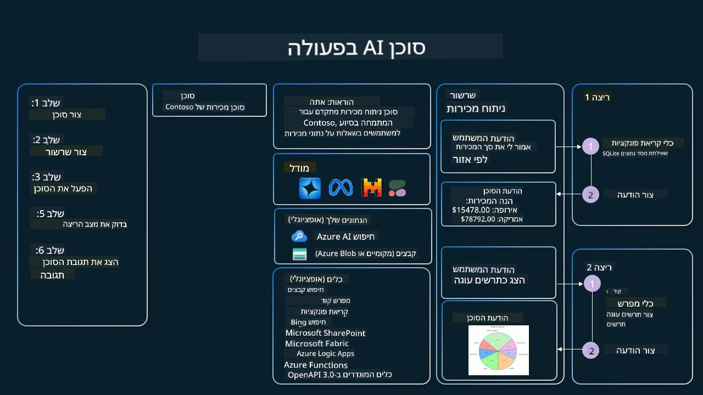

<!--
CO_OP_TRANSLATOR_METADATA:
{
  "original_hash": "88258b03f2893aa2e69eb8fb24baabbc",
  "translation_date": "2025-07-12T09:38:33+00:00",
  "source_file": "04-tool-use/README.md",
  "language_code": "he"
}
-->
[](https://youtu.be/vieRiPRx-gI?si=cEZ8ApnT6Sus9rhn)

> _(לחצו על התמונה למעלה לצפייה בסרטון של השיעור)_

# תבנית עיצוב לשימוש בכלים

כלים מעניינים כי הם מאפשרים לסוכני AI להרחיב את מגוון היכולות שלהם. במקום שהסוכן יוכל לבצע רק סט מוגבל של פעולות, על ידי הוספת כלי, הסוכן יכול לבצע מגוון רחב של פעולות. בפרק זה נבחן את תבנית העיצוב לשימוש בכלים, שמתארת כיצד סוכני AI יכולים להשתמש בכלים ספציפיים כדי להשיג את מטרותיהם.

## מבוא

בשיעור זה ננסה לענות על השאלות הבאות:

- מהי תבנית העיצוב לשימוש בכלים?
- באילו מקרים ניתן ליישם אותה?
- מהם המרכיבים/אבני הבניין הדרושים ליישום תבנית העיצוב?
- אילו שיקולים מיוחדים יש לשים לב אליהם כשמשתמשים בתבנית העיצוב לשימוש בכלים כדי לבנות סוכני AI אמינים?

## מטרות הלמידה

בסיום השיעור תוכלו:

- להגדיר את תבנית העיצוב לשימוש בכלים ואת מטרתה.
- לזהות מקרים בהם תבנית העיצוב לשימוש בכלים רלוונטית.
- להבין את המרכיבים המרכזיים הדרושים ליישום התבנית.
- להכיר שיקולים להבטחת אמינות בסוכני AI המשתמשים בתבנית זו.

## מהי תבנית העיצוב לשימוש בכלים?

**תבנית העיצוב לשימוש בכלים** מתמקדת במתן היכולת ל-LLMs (מודלים לשוניים גדולים) לתקשר עם כלים חיצוניים כדי להשיג מטרות ספציפיות. כלים הם קוד שניתן להפעיל על ידי סוכן כדי לבצע פעולות. כלי יכול להיות פונקציה פשוטה כמו מחשבון, או קריאת API לשירות צד שלישי כמו בדיקת מחירי מניות או תחזית מזג אוויר. בהקשר של סוכני AI, כלים מתוכננים להיות מופעלים על ידי סוכנים בתגובה ל**קריאות פונקציה שנוצרות על ידי המודל**.

## באילו מקרים ניתן ליישם אותה?

סוכני AI יכולים לנצל כלים כדי להשלים משימות מורכבות, לאחזר מידע או לקבל החלטות. תבנית העיצוב לשימוש בכלים משמשת לעיתים קרובות בתרחישים שדורשים אינטראקציה דינמית עם מערכות חיצוניות, כמו מסדי נתונים, שירותי רשת או מפרשי קוד. יכולת זו שימושית למגוון מקרים, ביניהם:

- **אחזור מידע דינמי:** סוכנים יכולים לשאול APIs חיצוניים או מסדי נתונים כדי לקבל נתונים מעודכנים (למשל, שאילתא למסד SQLite לניתוח נתונים, קבלת מחירי מניות או מידע על מזג האוויר).
- **הרצת קוד ופרשנות:** סוכנים יכולים להריץ קוד או סקריפטים לפתרון בעיות מתמטיות, יצירת דוחות או ביצוע סימולציות.
- **אוטומציה של תהליכים:** אוטומציה של תהליכים חוזרים או מרובי שלבים באמצעות שילוב כלים כמו מתזמנים, שירותי דואר אלקטרוני או צינורות נתונים.
- **תמיכת לקוחות:** סוכנים יכולים לתקשר עם מערכות CRM, פלטפורמות ניהול פניות או מאגרי ידע כדי לפתור שאלות משתמשים.
- **יצירה ועריכת תוכן:** סוכנים יכולים להשתמש בכלים כמו בודקי דקדוק, מסכמי טקסט או מעריכי בטיחות תוכן כדי לסייע במשימות יצירת תוכן.

## מהם המרכיבים/אבני הבניין הדרושים ליישום תבנית העיצוב לשימוש בכלים?

אבני הבניין הללו מאפשרות לסוכן AI לבצע מגוון רחב של משימות. נבחן את המרכיבים המרכזיים הדרושים ליישום תבנית העיצוב לשימוש בכלים:

- **סכמות פונקציה/כלי**: הגדרות מפורטות של הכלים הזמינים, כולל שם הפונקציה, מטרתה, הפרמטרים הנדרשים והתוצאות הצפויות. סכמות אלו מאפשרות ל-LLM להבין אילו כלים זמינים וכיצד לבנות בקשות תקפות.

- **לוגיקת ביצוע פונקציה**: מגדירה מתי ואיך הכלים מופעלים בהתבסס על כוונת המשתמש והקשר השיחה. זה יכול לכלול מודולים לתכנון, מנגנוני ניתוב או זרימות מותנות שקובעות שימוש דינמי בכלים.

- **מערכת ניהול הודעות**: רכיבים שמנהלים את זרימת השיחה בין קלטי המשתמש, תגובות ה-LLM, קריאות לכלים ותוצאותיהם.

- **מסגרת אינטגרציה של כלים**: תשתית שמחברת את הסוכן לכלים שונים, בין אם פונקציות פשוטות או שירותים חיצוניים מורכבים.

- **טיפול בשגיאות ואימות**: מנגנונים לטיפול בכשלים בהרצת כלים, אימות פרמטרים וניהול תגובות בלתי צפויות.

- **ניהול מצב**: עוקב אחרי הקשר השיחה, אינטראקציות קודמות עם כלים ונתונים מתמשכים כדי להבטיח עקביות בשיחות מרובות סבבים.

נעבור כעת לפרטים נוספים על קריאת פונקציות/כלים.

### קריאת פונקציה/כלי

קריאת פונקציה היא הדרך העיקרית לאפשר ל-LLMs לתקשר עם כלים. לעיתים קרובות תראו את המונחים 'פונקציה' ו'כלי' משמשים לסירוגין, כי 'פונקציות' (בלוקים של קוד שניתן להשתמש בהם מחדש) הן ה'כלים' שהסוכנים משתמשים בהם לביצוע משימות. כדי להפעיל קוד של פונקציה, ה-LLM צריך להשוות את בקשת המשתמש לתיאור הפונקציות. לשם כך נשלחת ל-LLM סכימה המכילה את תיאורי כל הפונקציות הזמינות. ה-LLM בוחר את הפונקציה המתאימה ביותר למשימה ומחזיר את שמה ואת הפרמטרים שלה. הפונקציה שנבחרה מופעלת, התגובה שלה נשלחת חזרה ל-LLM, שמשתמש במידע כדי להגיב לבקשת המשתמש.

כדי שמפתחים יוכלו ליישם קריאת פונקציה לסוכנים, תצטרכו:

1. מודל LLM שתומך בקריאת פונקציות  
2. סכימה המכילה תיאורי פונקציות  
3. הקוד של כל פונקציה המתוארת

נשתמש בדוגמה של קבלת השעה הנוכחית בעיר כדי להמחיש:

1. **אתחול מודל LLM שתומך בקריאת פונקציות:**

    לא כל המודלים תומכים בקריאת פונקציות, לכן חשוב לוודא שה-LLM שבו אתם משתמשים אכן תומך בכך.  
    <a href="https://learn.microsoft.com/azure/ai-services/openai/how-to/function-calling" target="_blank">Azure OpenAI</a> תומך בקריאת פונקציות. נתחיל ביצירת לקוח Azure OpenAI.

    ```python
    # Initialize the Azure OpenAI client
    client = AzureOpenAI(
        azure_endpoint = os.getenv("AZURE_OPENAI_ENDPOINT"), 
        api_key=os.getenv("AZURE_OPENAI_API_KEY"),  
        api_version="2024-05-01-preview"
    )
    ```

1. **יצירת סכמת פונקציה:**

    נגדיר סכמת JSON שמכילה את שם הפונקציה, תיאור מה היא עושה, ושמות ותיאורים של הפרמטרים שלה.  
    לאחר מכן נעביר סכימה זו ללקוח שיצרנו קודם, יחד עם בקשת המשתמש למצוא את השעה בסן פרנסיסקו. חשוב לציין ש**קריאת כלי** היא מה שמוחזר, **ולא** התשובה הסופית לשאלה. כפי שצוין קודם, ה-LLM מחזיר את שם הפונקציה שנבחרה למשימה ואת הפרמטרים שיועברו אליה.

    ```python
    # Function description for the model to read
    tools = [
        {
            "type": "function",
            "function": {
                "name": "get_current_time",
                "description": "Get the current time in a given location",
                "parameters": {
                    "type": "object",
                    "properties": {
                        "location": {
                            "type": "string",
                            "description": "The city name, e.g. San Francisco",
                        },
                    },
                    "required": ["location"],
                },
            }
        }
    ]
    ```
   
    ```python
  
    # Initial user message
    messages = [{"role": "user", "content": "What's the current time in San Francisco"}] 
  
    # First API call: Ask the model to use the function
      response = client.chat.completions.create(
          model=deployment_name,
          messages=messages,
          tools=tools,
          tool_choice="auto",
      )
  
      # Process the model's response
      response_message = response.choices[0].message
      messages.append(response_message)
  
      print("Model's response:")  

      print(response_message)
  
    ```

    ```bash
    Model's response:
    ChatCompletionMessage(content=None, role='assistant', function_call=None, tool_calls=[ChatCompletionMessageToolCall(id='call_pOsKdUlqvdyttYB67MOj434b', function=Function(arguments='{"location":"San Francisco"}', name='get_current_time'), type='function')])
    ```
  
1. **קוד הפונקציה הדרוש לביצוע המשימה:**

    כעת, לאחר שה-LLM בחר איזו פונקציה יש להריץ, יש ליישם ולהריץ את הקוד שמבצע את המשימה.  
    נוכל לכתוב את הקוד לקבלת השעה הנוכחית בפייתון. בנוסף, נצטרך לכתוב קוד לחילוץ השם והארגומנטים מתוך response_message כדי לקבל את התוצאה הסופית.

    ```python
      def get_current_time(location):
        """Get the current time for a given location"""
        print(f"get_current_time called with location: {location}")  
        location_lower = location.lower()
        
        for key, timezone in TIMEZONE_DATA.items():
            if key in location_lower:
                print(f"Timezone found for {key}")  
                current_time = datetime.now(ZoneInfo(timezone)).strftime("%I:%M %p")
                return json.dumps({
                    "location": location,
                    "current_time": current_time
                })
      
        print(f"No timezone data found for {location_lower}")  
        return json.dumps({"location": location, "current_time": "unknown"})
    ```

    ```python
     # Handle function calls
      if response_message.tool_calls:
          for tool_call in response_message.tool_calls:
              if tool_call.function.name == "get_current_time":
     
                  function_args = json.loads(tool_call.function.arguments)
     
                  time_response = get_current_time(
                      location=function_args.get("location")
                  )
     
                  messages.append({
                      "tool_call_id": tool_call.id,
                      "role": "tool",
                      "name": "get_current_time",
                      "content": time_response,
                  })
      else:
          print("No tool calls were made by the model.")  
  
      # Second API call: Get the final response from the model
      final_response = client.chat.completions.create(
          model=deployment_name,
          messages=messages,
      )
  
      return final_response.choices[0].message.content
     ```

    ```bash
      get_current_time called with location: San Francisco
      Timezone found for san francisco
      The current time in San Francisco is 09:24 AM.
     ```

קריאת פונקציות היא בלב רוב, אם לא כל, תבניות העיצוב לשימוש בכלים בסוכנים, אך יישום שלה מאפס יכול להיות מאתגר לפעמים.  
כפי שלמדנו ב-[שיעור 2](../../../02-explore-agentic-frameworks), מסגרות agentic מספקות לנו אבני בניין מוכנות ליישום שימוש בכלים.

## דוגמאות לשימוש בכלים עם מסגרות Agentic

להלן כמה דוגמאות כיצד ניתן ליישם את תבנית העיצוב לשימוש בכלים באמצעות מסגרות agentic שונות:

### Semantic Kernel

<a href="https://learn.microsoft.com/azure/ai-services/agents/overview" target="_blank">Semantic Kernel</a> היא מסגרת AI בקוד פתוח למפתחי .NET, Python ו-Java העובדים עם מודלים לשוניים גדולים (LLMs). היא מפשטת את תהליך קריאת הפונקציות על ידי תיאור אוטומטי של הפונקציות והפרמטרים שלהן למודל בתהליך שנקרא <a href="https://learn.microsoft.com/semantic-kernel/concepts/ai-services/chat-completion/function-calling/?pivots=programming-language-python#1-serializing-the-functions" target="_blank">סיריאליזציה</a>. היא גם מנהלת את התקשורת ההדדית בין המודל לקוד שלכם. יתרון נוסף בשימוש במסגרת agentic כמו Semantic Kernel הוא שהיא מאפשרת גישה לכלים מוכנים מראש כמו <a href="https://github.com/microsoft/semantic-kernel/blob/main/python/samples/getting_started_with_agents/openai_assistant/step4_assistant_tool_file_search.py" target="_blank">חיפוש קבצים</a> ו-<a href="https://github.com/microsoft/semantic-kernel/blob/main/python/samples/getting_started_with_agents/openai_assistant/step3_assistant_tool_code_interpreter.py" target="_blank">מפרש קוד</a>.

הדיאגרמה הבאה ממחישה את תהליך קריאת הפונקציות עם Semantic Kernel:



ב-Semantic Kernel פונקציות/כלים נקראים <a href="https://learn.microsoft.com/semantic-kernel/concepts/plugins/?pivots=programming-language-python" target="_blank">תוספים (Plugins)</a>. ניתן להמיר את הפונקציה `get_current_time` שראינו קודם לתוסף על ידי הפיכתה למחלקה עם הפונקציה בתוכה. ניתן גם לייבא את הדקורטור `kernel_function`, שלוקח את תיאור הפונקציה. כאשר יוצרים kernel עם GetCurrentTimePlugin, ה-kernel יסיריאליז את הפונקציה ואת הפרמטרים שלה אוטומטית, וייצור את הסכימה שתישלח ל-LLM בתהליך.

```python
from semantic_kernel.functions import kernel_function

class GetCurrentTimePlugin:
    async def __init__(self, location):
        self.location = location

    @kernel_function(
        description="Get the current time for a given location"
    )
    def get_current_time(location: str = ""):
        ...

```

```python 
from semantic_kernel import Kernel

# Create the kernel
kernel = Kernel()

# Create the plugin
get_current_time_plugin = GetCurrentTimePlugin(location)

# Add the plugin to the kernel
kernel.add_plugin(get_current_time_plugin)
```
  
### Azure AI Agent Service

<a href="https://learn.microsoft.com/azure/ai-services/agents/overview" target="_blank">Azure AI Agent Service</a> היא מסגרת agentic חדשה שנועדה לאפשר למפתחים לבנות, לפרוס ולהרחיב סוכני AI איכותיים ובטוחים ללא צורך בניהול משאבי מחשוב ואחסון. היא שימושית במיוחד לאפליקציות ארגוניות, שכן מדובר בשירות מנוהל מלא עם אבטחה ברמת ארגון.

בהשוואה לפיתוח ישיר עם API של LLM, Azure AI Agent Service מציעה יתרונות כגון:

- קריאת כלים אוטומטית – אין צורך לנתח קריאת כלי, להפעיל את הכלי ולטפל בתגובה; כל זה נעשה בצד השרת  
- ניהול מאובטח של נתונים – במקום לנהל את מצב השיחה בעצמכם, ניתן להסתמך על threads לאחסון כל המידע הדרוש  
- כלים מוכנים לשימוש – כלים המאפשרים אינטראקציה עם מקורות הנתונים שלכם, כמו Bing, Azure AI Search ו-Azure Functions

הכלים הזמינים ב-Azure AI Agent Service מתחלקים לשתי קטגוריות:

1. כלים ידע:  
    - <a href="https://learn.microsoft.com/azure/ai-services/agents/how-to/tools/bing-grounding?tabs=python&pivots=overview" target="_blank">עיגון עם Bing Search</a>  
    - <a href="https://learn.microsoft.com/azure/ai-services/agents/how-to/tools/file-search?tabs=python&pivots=overview" target="_blank">חיפוש קבצים</a>  
    - <a href="https://learn.microsoft.com/azure/ai-services/agents/how-to/tools/azure-ai-search?tabs=azurecli%2Cpython&pivots=overview-azure-ai-search" target="_blank">Azure AI Search</a>

2. כלים לפעולה:  
    - <a href="https://learn.microsoft.com/azure/ai-services/agents/how-to/tools/function-calling?tabs=python&pivots=overview" target="_blank">קריאת פונקציות</a>  
    - <a href="https://learn.microsoft.com/azure/ai-services/agents/how-to/tools/code-interpreter?tabs=python&pivots=overview" target="_blank">מפרש קוד</a>  
    - <a href="https://learn.microsoft.com/azure/ai-services/agents/how-to/tools/openapi-spec?tabs=python&pivots=overview" target="_blank">כלים מוגדרים על ידי OpenAI</a>  
    - <a href="https://learn.microsoft.com/azure/ai-services/agents/how-to/tools/azure-functions?pivots=overview" target="_blank">Azure Functions</a>

שירות הסוכנים מאפשר לנו להשתמש בכלים אלו יחד כ`toolset`. הוא גם משתמש ב`threads` שמנהלים את היסטוריית ההודעות משיחה מסוימת.

דמיינו שאתם סוכן מכירות בחברה בשם Contoso. אתם רוצים לפתח סוכן שיחה שיכול לענות על שאלות לגבי נתוני המכירות שלכם.

התמונה הבאה ממחישה כיצד ניתן להשתמש ב-Azure AI Agent Service לניתוח נתוני המכירות:



כדי להשתמש בכלים אלו עם השירות, ניתן ליצור לקוח ולהגדיר כלי או toolset. ליישום מעשי נשתמש בקוד פייתון הבא. ה-LLM יוכל להסתכל על ה-toolset ולהחליט האם להשתמש בפונקציה שיצר המשתמש, `fetch_sales_data_using_sqlite_query`, או במפרש הקוד המובנה, בהתאם לבקשת המשתמש.

```python 
import os
from azure.ai.projects import AIProjectClient
from azure.identity import DefaultAzureCredential
from fecth_sales_data_functions import fetch_sales_data_using_sqlite_query # fetch_sales_data_using_sqlite_query function which can be found in a fetch_sales_data_functions.py file.
from azure.ai.projects.models import ToolSet, FunctionTool, CodeInterpreterTool

project_client = AIProjectClient.from_connection_string(
    credential=DefaultAzureCredential(),
    conn_str=os.environ["PROJECT_CONNECTION_STRING"],
)

# Initialize function calling agent with the fetch_sales_data_using_sqlite_query function and adding it to the toolset
fetch_data_function = FunctionTool(fetch_sales_data_using_sqlite_query)
toolset = ToolSet()
toolset.add(fetch_data_function)

# Initialize Code Interpreter tool and adding it to the toolset. 
code_interpreter = code_interpreter = CodeInterpreterTool()
toolset = ToolSet()
toolset.add(code_interpreter)

agent = project_client.agents.create_agent(
    model="gpt-4o-mini", name="my-agent", instructions="You are helpful agent", 
    toolset=toolset
)
```

## אילו שיקולים מיוחדים יש לשים לב אליהם כשמשתמשים בתבנית העיצוב לשימוש בכלים כדי לבנות סוכני AI אמינים?

חשש נפוץ לגבי SQL שנוצר דינמית על ידי LLMs הוא אבטחה, במיוחד הסיכון להזרקת SQL או פעולות זדוניות כמו מחיקה או שינוי במסד הנתונים. למרות שהחששות הללו מוצדקים, ניתן למזערם ביעילות על ידי קביעת הרשאות גישה מתאימות למסד הנתונים. ברוב מסדי הנתונים זה כולל הגדרת מסד הנתונים לקריאה בלבד. בשירותי מסד נתונים כמו PostgreSQL או Azure SQL, יש להקצות לאפליקציה תפקיד קריאה בלבד (SELECT).

הרצת האפליקציה בסביבה מאובטחת מחזקת את ההגנה. בתרחישים ארגוניים, הנתונים בדרך כלל מופקים ומעובדים ממערכות תפעוליות אל מסד נתונים או מחסן נתונים לקריאה בלבד עם סכימה נוחה למשתמש. גישה זו מבטיחה שהנתונים מאובטחים, מותאמים לביצועים ונגישים, ושהאפליקציה מוגבלת לגישה לקריאה בלבד.

## משאבים נוספים

-
<a href="https://microsoft.github.io/build-your-first-agent-with-azure-ai-agent-service-workshop/" target="_blank">
סדנת שירות סוכני AI של Azure</a>
- <a href="https://github.com/Azure-Samples/contoso-creative-writer/tree/main/docs/workshop" target="_blank">סדנת סוכנים מרובים של Contoso Creative Writer</a>
- <a href="https://learn.microsoft.com/semantic-kernel/concepts/ai-services/chat-completion/function-calling/?pivots=programming-language-python#1-serializing-the-functions" target="_blank">מדריך קריאת פונקציות ב-Semantic Kernel</a>
- <a href="https://github.com/microsoft/semantic-kernel/blob/main/python/samples/getting_started_with_agents/openai_assistant/step3_assistant_tool_code_interpreter.py" target="_blank">מתרגם קוד של Semantic Kernel</a>
- <a href="https://microsoft.github.io/autogen/dev/user-guide/core-user-guide/components/tools.html" target="_blank">כלי Autogen</a>

## השיעור הקודם

[הבנת תבניות עיצוב סוכניות](../03-agentic-design-patterns/README.md)

## השיעור הבא

[Agentic RAG](../05-agentic-rag/README.md)

**כתב ויתור**:  
מסמך זה תורגם באמצעות שירות תרגום מבוסס בינה מלאכותית [Co-op Translator](https://github.com/Azure/co-op-translator). למרות שאנו שואפים לדיוק, יש לקחת בחשבון כי תרגומים אוטומטיים עלולים להכיל שגיאות או אי-דיוקים. המסמך המקורי בשפת המקור שלו נחשב למקור הסמכותי. למידע קריטי מומלץ להשתמש בתרגום מקצועי על ידי מתרגם אנושי. אנו לא נושאים באחריות לכל אי-הבנה או פרשנות שגויה הנובעת משימוש בתרגום זה.