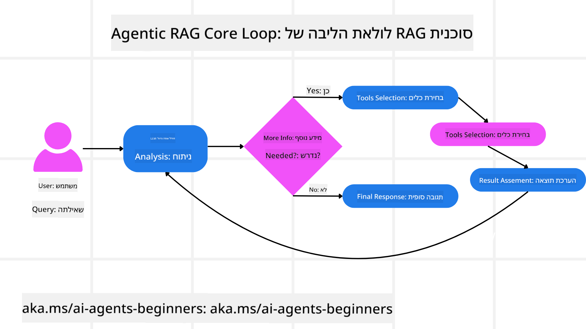
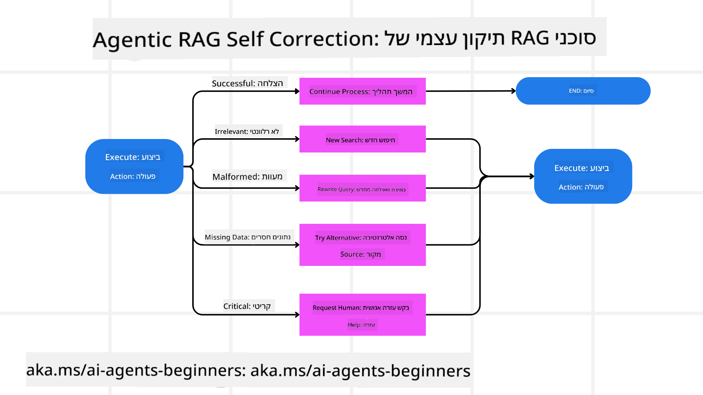
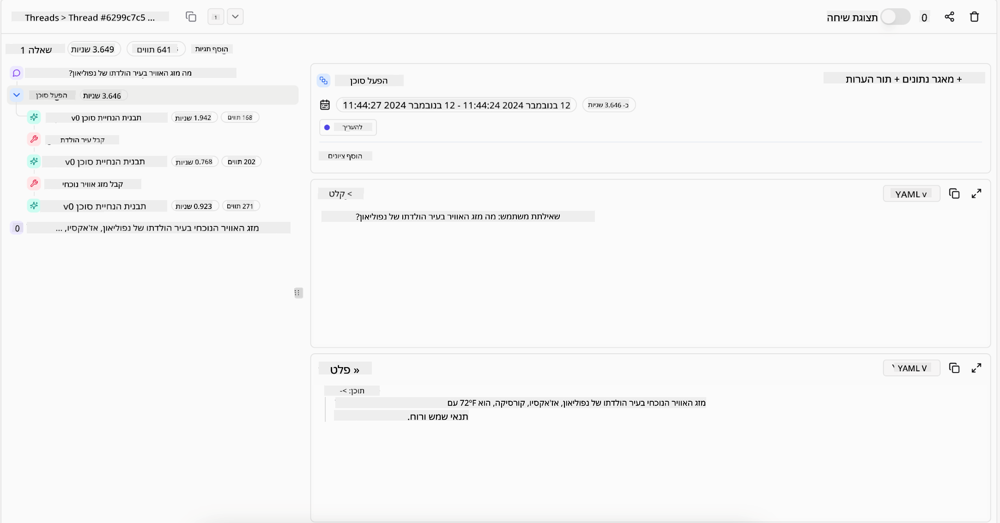
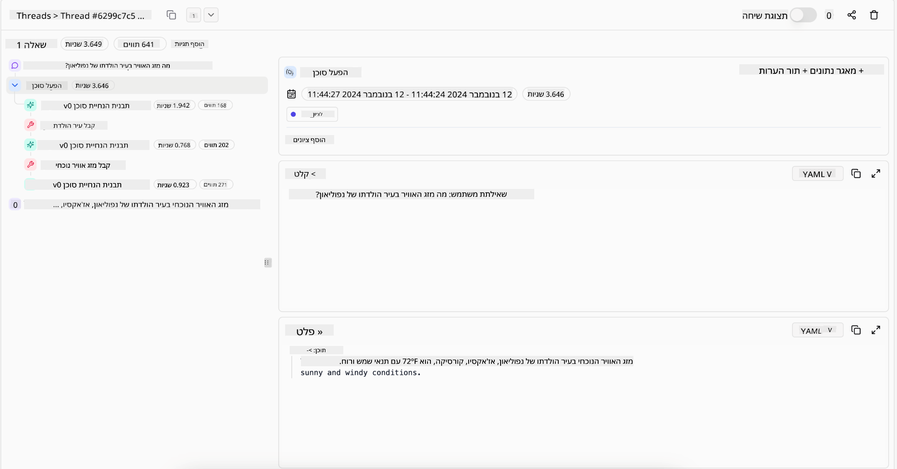

<!--
CO_OP_TRANSLATOR_METADATA:
{
  "original_hash": "7622aa72f9e676e593339f5f694ecd7d",
  "translation_date": "2025-07-12T10:07:01+00:00",
  "source_file": "05-agentic-rag/README.md",
  "language_code": "he"
}
-->

> _(לחצו על התמונה למעלה לצפייה בסרטון של השיעור)_

# Agentic RAG

השיעור הזה מספק סקירה מקיפה של Agentic Retrieval-Augmented Generation (Agentic RAG), פרדיגמה מתפתחת בבינה מלאכותית שבה מודלים גדולים של שפה (LLMs) מתכננים באופן עצמאי את הצעדים הבאים שלהם תוך כדי שליפת מידע ממקורות חיצוניים. בניגוד לדפוסי שליפה-ואז-קריאה סטטיים, Agentic RAG כולל קריאות איטרטיביות ל-LLM, המלוות בקריאות לכלים או פונקציות ופלטים מובנים. המערכת מעריכה תוצאות, משפרת שאילתות, מפעילה כלים נוספים במידת הצורך וממשיכה במחזור זה עד להשגת פתרון מספק.

## מבוא

בשיעור זה נלמד על

- **הבנת Agentic RAG:** הכרת הפרדיגמה המתפתחת בבינה מלאכותית שבה מודלים גדולים של שפה (LLMs) מתכננים באופן עצמאי את הצעדים הבאים שלהם תוך כדי שליפת מידע ממקורות חיצוניים.
- **הבנת סגנון Maker-Checker איטרטיבי:** הבנת הלולאה של קריאות איטרטיביות ל-LLM, המלוות בקריאות לכלים או פונקציות ופלטים מובנים, שנועדו לשפר את הדיוק ולטפל בשאילתות שגויות.
- **חקירת יישומים מעשיים:** זיהוי תרחישים שבהם Agentic RAG מצטיין, כגון סביבות שמדגישות דיוק, אינטראקציות מורכבות עם מסדי נתונים, וזרימות עבודה מורחבות.

## מטרות הלמידה

בסיום השיעור תדעו כיצד/תבינו:

- **הבנת Agentic RAG:** הכרת הפרדיגמה המתפתחת בבינה מלאכותית שבה מודלים גדולים של שפה (LLMs) מתכננים באופן עצמאי את הצעדים הבאים שלהם תוך כדי שליפת מידע ממקורות חיצוניים.
- **סגנון Maker-Checker איטרטיבי:** הבנת מושג הלולאה של קריאות איטרטיביות ל-LLM, המלוות בקריאות לכלים או פונקציות ופלטים מובנים, שנועדו לשפר את הדיוק ולטפל בשאילתות שגויות.
- **שליטה בתהליך ההסקה:** הבנת יכולת המערכת לשלוט בתהליך ההסקה שלה, לקבל החלטות כיצד לגשת לבעיות ללא תלות בנתיבים מוגדרים מראש.
- **זרימת עבודה:** הבנת האופן שבו מודל agentic מחליט באופן עצמאי לשלוף דוחות מגמות שוק, לזהות נתוני מתחרים, לקשר מדדי מכירות פנימיים, לסנתז ממצאים ולהעריך את האסטרטגיה.
- **לולאות איטרטיביות, אינטגרציית כלים וזיכרון:** הכרת התלות של המערכת בדפוס אינטראקציה מחזורי, שמירה על מצב וזיכרון לאורך השלבים כדי למנוע לולאות חוזרות ולקבל החלטות מושכלות.
- **טיפול במצבי כשל ותיקון עצמי:** חקירת מנגנוני התיקון העצמי החזקים של המערכת, כולל איטרציה ושאילתות חוזרות, שימוש בכלים דיאגנוסטיים, ופנייה לפיקוח אנושי.
- **גבולות הסוכנות:** הבנת המגבלות של Agentic RAG, עם דגש על אוטונומיה תחומית, תלות בתשתיות וכיבוד מגבלות.
- **מקרי שימוש מעשיים וערך:** זיהוי תרחישים שבהם Agentic RAG מצטיין, כגון סביבות שמדגישות דיוק, אינטראקציות מורכבות עם מסדי נתונים, וזרימות עבודה מורחבות.
- **ממשל, שקיפות ואמון:** הכרת חשיבות הממשל והשקיפות, כולל הסבריות ההסקה, בקרת הטיות ופיקוח אנושי.

## מהו Agentic RAG?

Agentic Retrieval-Augmented Generation (Agentic RAG) היא פרדיגמה מתפתחת בבינה מלאכותית שבה מודלים גדולים של שפה (LLMs) מתכננים באופן עצמאי את הצעדים הבאים שלהם תוך כדי שליפת מידע ממקורות חיצוניים. בניגוד לדפוסי שליפה-ואז-קריאה סטטיים, Agentic RAG כולל קריאות איטרטיביות ל-LLM, המלוות בקריאות לכלים או פונקציות ופלטים מובנים. המערכת מעריכה תוצאות, משפרת שאילתות, מפעילה כלים נוספים במידת הצורך וממשיכה במחזור זה עד להשגת פתרון מספק. סגנון "maker-checker" האיטרטיבי הזה משפר את הדיוק, מטפל בשאילתות שגויות ומבטיח תוצאות איכותיות.

המערכת שולטת באופן פעיל בתהליך ההסקה שלה, כותבת מחדש שאילתות שנכשלו, בוחרת שיטות שליפה שונות ומשלבת כלים מרובים — כגון חיפוש וקטורי ב-Azure AI Search, מסדי נתונים SQL או APIs מותאמים — לפני סיום התשובה. התכונה המבדילה של מערכת agentic היא היכולת לשלוט בתהליך ההסקה שלה. יישומי RAG מסורתיים מסתמכים על נתיבים מוגדרים מראש, אך מערכת agentic קובעת באופן עצמאי את רצף הצעדים בהתאם לאיכות המידע שהיא מוצאת.

## הגדרת Agentic Retrieval-Augmented Generation (Agentic RAG)

Agentic Retrieval-Augmented Generation (Agentic RAG) היא פרדיגמה מתפתחת בפיתוח בינה מלאכותית שבה מודלים גדולים של שפה לא רק שולפים מידע ממקורות חיצוניים, אלא גם מתכננים באופן עצמאי את הצעדים הבאים שלהם. בניגוד לדפוסי שליפה-ואז-קריאה סטטיים או רצפי פרומפטים מתוכננים בקפידה, Agentic RAG כולל לולאה של קריאות איטרטיביות ל-LLM, המלוות בקריאות לכלים או פונקציות ופלטים מובנים. בכל שלב, המערכת מעריכה את התוצאות שהשיגה, מחליטה אם לשפר את השאילתות, מפעילה כלים נוספים במידת הצורך וממשיכה במחזור זה עד להשגת פתרון מספק.

סגנון הפעולה האיטרטיבי הזה של "maker-checker" נועד לשפר את הדיוק, לטפל בשאילתות שגויות למסדי נתונים מובנים (כגון NL2SQL), ולהבטיח תוצאות מאוזנות ואיכותיות. במקום להסתמך רק על שרשראות פרומפטים מהונדסים בקפידה, המערכת שולטת באופן פעיל בתהליך ההסקה שלה. היא יכולה לכתוב מחדש שאילתות שנכשלו, לבחור שיטות שליפה שונות, ולשלב כלים מרובים — כגון חיפוש וקטורי ב-Azure AI Search, מסדי נתונים SQL או APIs מותאמים — לפני סיום התשובה. זה מבטל את הצורך במסגרת תזמור מורכבת מדי. במקום זאת, לולאה פשוטה יחסית של "קריאת LLM → שימוש בכלי → קריאת LLM → ..." יכולה להניב פלטים מתוחכמים ומבוססים היטב.

## שליטה בתהליך ההסקה

התכונה המבדילה שהופכת מערכת ל"agentic" היא היכולת לשלוט בתהליך ההסקה שלה. יישומי RAG מסורתיים לעיתים קרובות תלויים בכך שבני אדם מגדירים מראש נתיב למודל: שרשרת מחשבה שמפרטת מה לשלוף ומתי.  
אבל כאשר מערכת היא באמת agentic, היא מחליטה פנימית כיצד לגשת לבעיה. היא לא רק מבצעת סקריפט; היא קובעת באופן עצמאי את רצף הצעדים בהתאם לאיכות המידע שהיא מוצאת.  
לדוגמה, אם מבקשים ממנה ליצור אסטרטגיית השקה למוצר, היא לא מסתמכת רק על פרומפט שמפרט את כל תהליך המחקר וקבלת ההחלטות. במקום זאת, המודל agentic מחליט באופן עצמאי:

1. לשלוף דוחות מגמות שוק עדכניים באמצעות Bing Web Grounding  
2. לזהות נתוני מתחרים רלוונטיים באמצעות Azure AI Search  
3. לקשר מדדי מכירות פנימיים היסטוריים באמצעות Azure SQL Database  
4. לסנתז את הממצאים לאסטרטגיה מגובשת המנוהלת דרך Azure OpenAI Service  
5. להעריך את האסטרטגיה לאיתור פערים או אי-התאמות, ולבצע סבב שליפה נוסף במידת הצורך  

כל הצעדים האלה — שיפור שאילתות, בחירת מקורות, איטרציה עד להגעה ל"תשובה מספקת" — נקבעים על ידי המודל, לא כתובים מראש על ידי אדם.

## לולאות איטרטיביות, אינטגרציית כלים וזיכרון

מערכת agentic מתבססת על דפוס אינטראקציה מחזורי:

- **קריאה ראשונית:** המטרה של המשתמש (הפרומפט) מוצגת ל-LLM.  
- **הפעלת כלי:** אם המודל מזהה מידע חסר או הוראות לא ברורות, הוא בוחר כלי או שיטת שליפה — כמו שאילתה למסד נתונים וקטורי (למשל חיפוש היברידי ב-Azure AI Search על נתונים פרטיים) או קריאה מובנית ל-SQL — כדי לאסוף הקשר נוסף.  
- **הערכה ושיפור:** לאחר סקירת הנתונים שהוחזרו, המודל מחליט אם המידע מספיק. אם לא, הוא משפר את השאילתה, מנסה כלי אחר או משנה את הגישה שלו.  
- **חזרה עד לסיפוק:** מחזור זה נמשך עד שהמודל קובע שיש לו מספיק בהירות והוכחות כדי לספק תשובה סופית ומנומקת היטב.  
- **זיכרון ומצב:** מאחר שהמערכת שומרת על מצב וזיכרון לאורך השלבים, היא יכולה לזכור ניסיונות קודמים ותוצאותיהם, להימנע מלולאות חוזרות ולקבל החלטות מושכלות יותר ככל שהיא מתקדמת.

עם הזמן, זה יוצר תחושה של הבנה מתפתחת, שמאפשרת למודל לנווט במשימות מורכבות רב-שלביות מבלי צורך בהתערבות אנושית מתמדת או שינוי הפרומפט.

## טיפול במצבי כשל ותיקון עצמי

האוטונומיה של Agentic RAG כוללת גם מנגנוני תיקון עצמי חזקים. כאשר המערכת נתקלת במבוי סתום — כמו שליפת מסמכים לא רלוונטיים או שאילתות שגויות — היא יכולה:

- **לאיטרציה ושאילתות חוזרות:** במקום להחזיר תשובות בעלות ערך נמוך, המודל מנסה אסטרטגיות חיפוש חדשות, כותב מחדש שאילתות למסד הנתונים או בוחן מערכי נתונים חלופיים.  
- **שימוש בכלים דיאגנוסטיים:** המערכת עשויה להפעיל פונקציות נוספות שנועדו לעזור לה לאבחן את שלבי ההסקה או לאשר את נכונות הנתונים שנשלפו. כלים כמו Azure AI Tracing יהיו חשובים לאפשר נראות ומעקב חזקים.  
- **פנייה לפיקוח אנושי:** במצבים בעלי סיכון גבוה או כשיש כשל חוזר, המודל עשוי לסמן חוסר וודאות ולבקש הנחיה אנושית. לאחר שהאדם מספק משוב מתקנן, המודל יכול לשלב את הלקח להמשך.

גישה איטרטיבית ודינמית זו מאפשרת למודל להשתפר באופן רציף, ומבטיחה שהוא לא רק מערכת חד-פעמית אלא מערכת שלומדת מטעויותיה במהלך סשן נתון.

## גבולות הסוכנות

למרות האוטונומיה בתוך משימה, Agentic RAG אינו שקול ל-AI כללי מלא. יכולות ה"סוכנות" שלו מוגבלות לכלים, למקורות הנתונים ולמדיניות שמספקים המפתחים האנושיים. הוא לא יכול להמציא כלים משלו או לצאת מגבולות התחום שהוגדרו. במקום זאת, הוא מצטיין בתזמור דינמי של המשאבים הקיימים.  
הבדלים מרכזיים מצורות AI מתקדמות יותר כוללים:

1. **אוטונומיה תחומית ספציפית:** מערכות Agentic RAG מתמקדות בהשגת מטרות שהוגדרו על ידי המשתמש בתוך תחום מוכר, תוך שימוש באסטרטגיות כמו כתיבת שאילתות מחדש או בחירת כלים לשיפור התוצאות.  
2. **תלות בתשתית:** היכולות של המערכת תלויות בכלים ובנתונים שמשולבים על ידי המפתחים. היא לא יכולה לחרוג מגבולות אלה ללא התערבות אנושית.  
3. **כיבוד מגבלות:** הנחיות אתיות, כללי ציות ומדיניות עסקית נשארים חשובים מאוד. חופש הפעולה של הסוכן תמיד מוגבל על ידי אמצעי בטיחות ומנגנוני פיקוח (במידה ויש).

## מקרי שימוש מעשיים וערך

Agentic RAG מצטיין בתרחישים שדורשים שיפור איטרטיבי ודיוק:

1. **סביבות שמדגישות דיוק:** בבדיקות ציות, ניתוח רגולטורי או מחקר משפטי, המודל agentic יכול לאמת עובדות שוב ושוב, להתייעץ במקורות מרובים ולכתוב מחדש שאילתות עד לקבלת תשובה מבוקרת היטב.  
2. **אינטראקציות מורכבות עם מסדי נתונים:** כאשר עובדים עם נתונים מובנים שבהם שאילתות עלולות להיכשל או לדרוש התאמה, המערכת יכולה לשפר באופן עצמאי את השאילתות באמצעות Azure SQL או Microsoft Fabric OneLake, ולהבטיח שהשליפה הסופית תואמת את כוונת המשתמש.  
3. **זרימות עבודה מורחבות:** סשנים ארוכים עשויים להתפתח ככל שמידע חדש מתגלה. Agentic RAG יכול לשלב נתונים חדשים באופן רציף, לשנות אסטרטגיות ככל שהוא לומד יותר על תחום הבעיה.

## ממשל, שקיפות ואמון

ככל שמערכות אלו הופכות לאוטונומיות יותר בתהליך ההסקה, ממשל ושקיפות הם קריטיים:

- **הסקה מוסברת:** המודל יכול לספק מסלול ביקורת של השאילתות שביצע, המקורות שהתייעץ בהם ושלבי ההסקה שעבר כדי להגיע למסקנה. כלים כמו Azure AI Content Safety ו-Azure AI Tracing / GenAIOps יכולים לסייע בשמירה על שקיפות והפחתת סיכונים.  
- **בקרת הטיות ושליפה מאוזנת:** מפתחים יכולים לכוונן אסטרטגיות שליפה כדי להבטיח התחשבות במקורות נתונים מאוזנים וייצוגיים, ולבצע ביקורות שוטפות על הפלטים לזיהוי הטיות או דפוסים מעוותים באמצעות מודלים מותאמים לארגוני מדע נתונים מתקדמים המשתמשים ב-Azure Machine Learning.  
- **פיקוח אנושי וציות:** במשימות רגישות, סקירה אנושית נשארת חיונית. Agentic RAG לא מחליף שיקול דעת אנושי בהחלטות בעלות סיכון גבוה — הוא משלים אותו על ידי אספקת אפשרויות מבוקרות יותר.

קיום כלים המספקים תיעוד ברור של הפעולות הוא חיוני. בלעדיהם, איתור תקלות בתהליך רב-שלבי יכול להיות קשה מאוד. ראה את הדוגמה הבאה מ-Literal AI (החברה מאחורי Chainlit) עבור ריצת Agent:

## סיכום

Agentic RAG מייצג אבולוציה טבעית באופן שבו מערכות AI מטפלות במשימות מורכבות ועשירות בנתונים. על ידי אימוץ דפוס אינטראקציה מחזורי, בחירה אוטונומית של כלים ושיפור שאילתות עד להשגת תוצאה איכותית, המערכת חורגת מהתנהגות סטטית של ביצוע פרומפטים לכיוון מקבל החלטות אדפטיבי ומודע להקשר. למרות שהיא עדיין מוגבלת על ידי תשתיות והנחיות אתיות שהוגדרו על ידי בני אדם, יכולות ה-agentic מאפשרות אינטראקציות AI עשירות, דינמיות ושימושיות יותר הן לארגונים והן למשתמשי קצה.

## משאבים נוספים

- <a href="https://learn.microsoft.com/training/modules/use-own-data-azure-openai" target="_blank">יישום Retrieval Augmented Generation (RAG) עם Azure OpenAI Service: למדו כיצד להשתמש בנתונים שלכם עם Azure OpenAI Service. מודול Microsoft Learn זה מספק מדריך מקיף ליישום RAG</a>
</a>
- <a href="https://learn.microsoft.com/azure/ai-studio/concepts/evaluation-approach-gen-ai" target="_blank">הערכת יישומי בינה מלאכותית יוצרת עם Azure AI Foundry: מאמר זה עוסק בהערכת והשוואת מודלים על מערכי נתונים זמינים לציבור, כולל יישומי Agentic AI וארכיטקטורות RAG</a>
- <a href="https://weaviate.io/blog/what-is-agentic-rag" target="_blank">מהו Agentic RAG | Weaviate</a>
- <a href="https://ragaboutit.com/agentic-rag-a-complete-guide-to-agent-based-retrieval-augmented-generation/" target="_blank">Agentic RAG: מדריך מלא ל- Retrieval Augmented Generation מבוסס סוכנים – חדשות מ- generation RAG</a>
- <a href="https://huggingface.co/learn/cookbook/agent_rag" target="_blank">Agentic RAG: האץ את ה-RAG שלך עם ניסוח מחדש של שאילתות ושאילתות עצמאיות! ספר הבישול של Hugging Face לבינה מלאכותית בקוד פתוח</a>
- <a href="https://youtu.be/aQ4yQXeB1Ss?si=2HUqBzHoeB5tR04U" target="_blank">הוספת שכבות Agentic ל-RAG</a>
- <a href="https://www.youtube.com/watch?v=zeAyuLc_f3Q&t=244s" target="_blank">עתיד העוזרים הידעיים: Jerry Liu</a>
- <a href="https://www.youtube.com/watch?v=AOSjiXP1jmQ" target="_blank">כיצד לבנות מערכות Agentic RAG</a>
- <a href="https://ignite.microsoft.com/sessions/BRK102?source=sessions" target="_blank">שימוש בשירות Azure AI Foundry Agent להרחבת סוכני ה-AI שלך</a>

### מאמרים אקדמיים

- <a href="https://arxiv.org/abs/2303.17651" target="_blank">2303.17651 Self-Refine: שיפור איטרטיבי עם משוב עצמי</a>
- <a href="https://arxiv.org/abs/2303.11366" target="_blank">2303.11366 Reflexion: סוכני שפה עם למידה מחזקת מילולית</a>
- <a href="https://arxiv.org/abs/2305.11738" target="_blank">2305.11738 CRITIC: מודלים גדולים של שפה יכולים לתקן את עצמם באמצעות ביקורת אינטראקטיבית עם כלים</a>
- <a href="https://arxiv.org/abs/2501.09136" target="_blank">2501.09136 Agentic Retrieval-Augmented Generation: סקירה על Agentic RAG</a>

## השיעור הקודם

[תבנית עיצוב לשימוש בכלים](../04-tool-use/README.md)

## השיעור הבא

[בניית סוכני AI אמינים](../06-building-trustworthy-agents/README.md)

**כתב ויתור**:  
מסמך זה תורגם באמצעות שירות תרגום מבוסס בינה מלאכותית [Co-op Translator](https://github.com/Azure/co-op-translator). למרות שאנו שואפים לדיוק, יש לקחת בחשבון כי תרגומים אוטומטיים עלולים להכיל שגיאות או אי-דיוקים. המסמך המקורי בשפת המקור שלו נחשב למקור הסמכותי. למידע קריטי מומלץ להשתמש בתרגום מקצועי על ידי מתרגם אנושי. אנו לא נושאים באחריות לכל אי-הבנה או פרשנות שגויה הנובעת משימוש בתרגום זה.