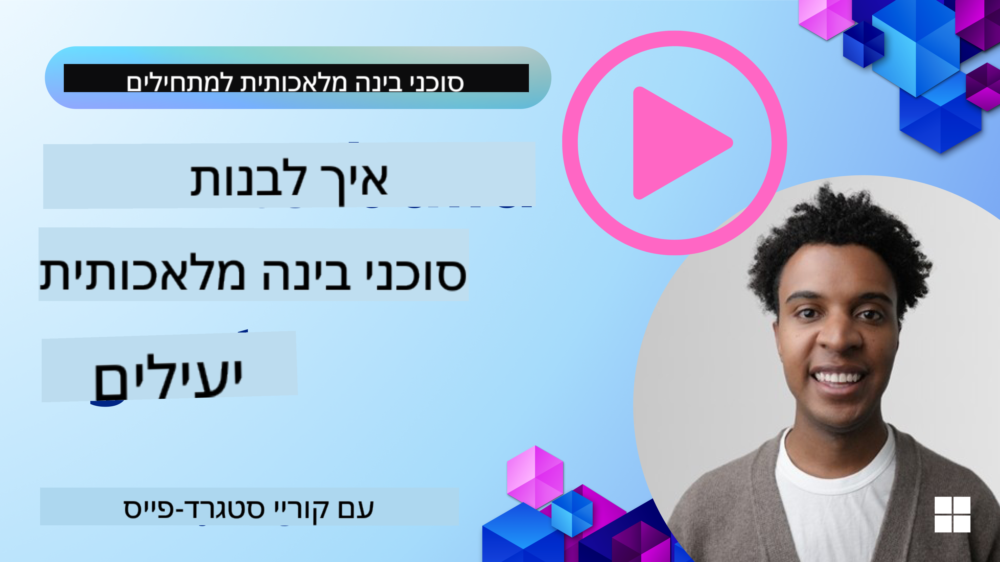
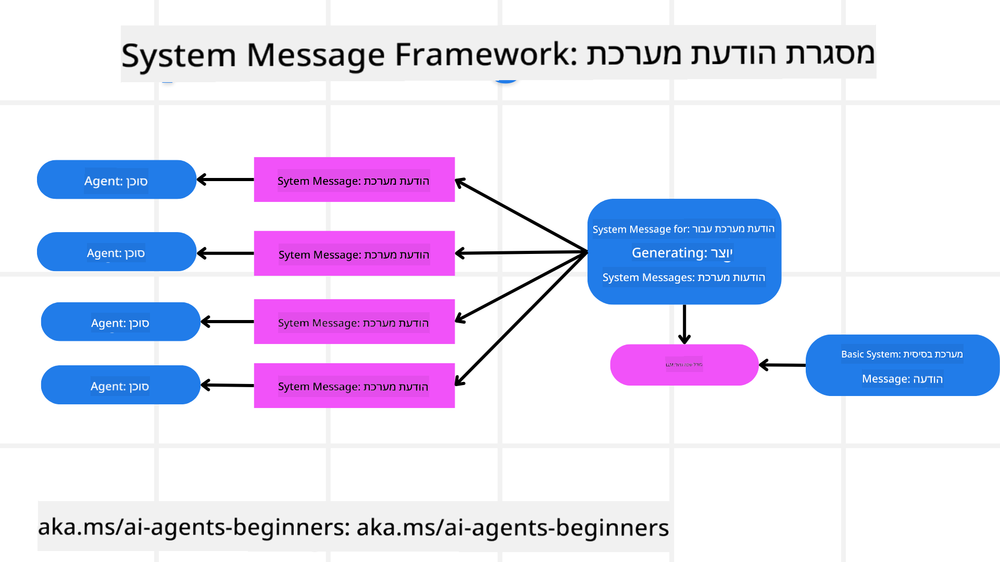
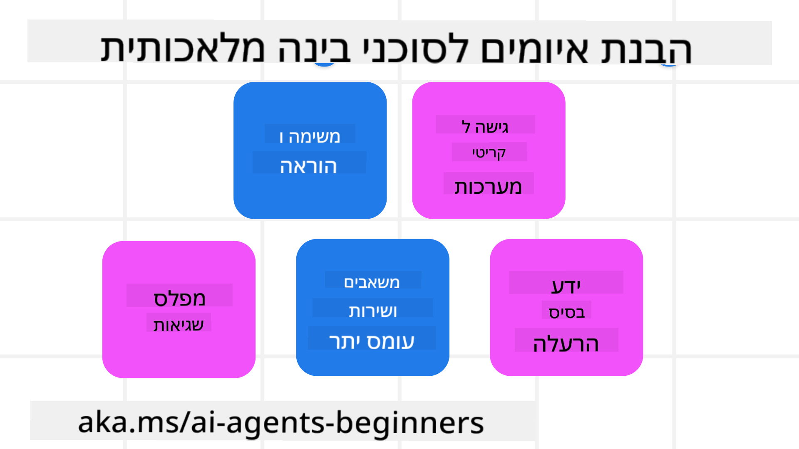
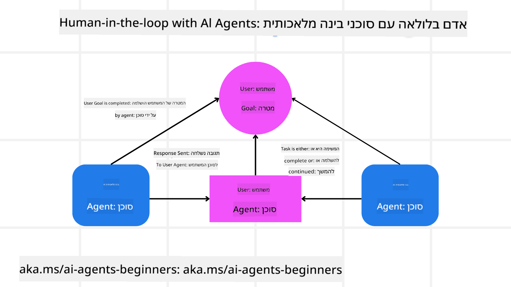

<!--
CO_OP_TRANSLATOR_METADATA:
{
  "original_hash": "f57852cac3a86c4a5ef47f793cc12178",
  "translation_date": "2025-07-12T10:29:25+00:00",
  "source_file": "06-building-trustworthy-agents/README.md",
  "language_code": "he"
}
-->
[](https://youtu.be/iZKkMEGBCUQ?si=Q-kEbcyHUMPoHp8L)

> _(לחצו על התמונה למעלה לצפייה בסרטון של השיעור)_

# בניית סוכני AI אמינים

## מבוא

בשיעור זה נלמד על:

- כיצד לבנות ולפרוס סוכני AI בטוחים ויעילים  
- שיקולי אבטחה חשובים בפיתוח סוכני AI  
- כיצד לשמור על פרטיות הנתונים והמשתמשים בפיתוח סוכני AI  

## מטרות הלמידה

בסיום השיעור תדעו כיצד:

- לזהות ולהפחית סיכונים ביצירת סוכני AI  
- ליישם אמצעי אבטחה לניהול נכון של נתונים וגישה  
- ליצור סוכני AI ששומרים על פרטיות הנתונים ומספקים חוויית משתמש איכותית  

## בטיחות

נתחיל בבחינת בניית יישומים סוכניים בטוחים. בטיחות משמעותה שהסוכן מבצע את תפקידו כפי שתוכנן. כבוני יישומים סוכניים, יש לנו שיטות וכלים למקסם את הבטיחות:

### בניית מסגרת הודעות מערכת

אם יצרתם בעבר יישום AI המשתמש במודלים לשוניים גדולים (LLMs), אתם יודעים כמה חשוב לעצב פרומפט מערכת חזק. פרומפטים אלו מגדירים את הכללים, ההוראות וההנחיות כיצד ה-LLM יתקשר עם המשתמש והנתונים.

לסוכני AI, פרומפט המערכת חשוב אף יותר, שכן הסוכנים זקוקים להוראות מדויקות מאוד כדי להשלים את המשימות שתכננו עבורם.

כדי ליצור פרומפטים מערכתיים שניתנים להרחבה, נוכל להשתמש במסגרת הודעות מערכת לבניית סוכן אחד או יותר ביישום שלנו:



#### שלב 1: יצירת הודעת מערכת מטא

הפרומפט המטא ישמש את ה-LLM ליצירת פרומפטי מערכת עבור הסוכנים שניצור. אנו מעצבים אותו כתבנית כדי שנוכל ליצור ביעילות סוכנים מרובים במידת הצורך.

הנה דוגמה להודעת מערכת מטא שניתן ל-LLM:

```plaintext
You are an expert at creating AI agent assistants. 
You will be provided a company name, role, responsibilities and other
information that you will use to provide a system prompt for.
To create the system prompt, be descriptive as possible and provide a structure that a system using an LLM can better understand the role and responsibilities of the AI assistant. 
```

#### שלב 2: יצירת פרומפט בסיסי

השלב הבא הוא ליצור פרומפט בסיסי לתיאור סוכן ה-AI. יש לכלול את תפקיד הסוכן, המשימות שהוא יבצע וכל אחריות נוספת שלו.

הנה דוגמה:

```plaintext
You are a travel agent for Contoso Travel that is great at booking flights for customers. To help customers you can perform the following tasks: lookup available flights, book flights, ask for preferences in seating and times for flights, cancel any previously booked flights and alert customers on any delays or cancellations of flights.  
```

#### שלב 3: מתן הודעת מערכת בסיסית ל-LLM

כעת נוכל לאופטם את הודעת המערכת על ידי מתן הודעת המערכת המטא כהודעת מערכת יחד עם הודעת המערכת הבסיסית שלנו.

זה יפיק הודעת מערכת שתוכננה טוב יותר להנחיית סוכני ה-AI שלנו:

```markdown
**Company Name:** Contoso Travel  
**Role:** Travel Agent Assistant

**Objective:**  
You are an AI-powered travel agent assistant for Contoso Travel, specializing in booking flights and providing exceptional customer service. Your main goal is to assist customers in finding, booking, and managing their flights, all while ensuring that their preferences and needs are met efficiently.

**Key Responsibilities:**

1. **Flight Lookup:**
    
    - Assist customers in searching for available flights based on their specified destination, dates, and any other relevant preferences.
    - Provide a list of options, including flight times, airlines, layovers, and pricing.
2. **Flight Booking:**
    
    - Facilitate the booking of flights for customers, ensuring that all details are correctly entered into the system.
    - Confirm bookings and provide customers with their itinerary, including confirmation numbers and any other pertinent information.
3. **Customer Preference Inquiry:**
    
    - Actively ask customers for their preferences regarding seating (e.g., aisle, window, extra legroom) and preferred times for flights (e.g., morning, afternoon, evening).
    - Record these preferences for future reference and tailor suggestions accordingly.
4. **Flight Cancellation:**
    
    - Assist customers in canceling previously booked flights if needed, following company policies and procedures.
    - Notify customers of any necessary refunds or additional steps that may be required for cancellations.
5. **Flight Monitoring:**
    
    - Monitor the status of booked flights and alert customers in real-time about any delays, cancellations, or changes to their flight schedule.
    - Provide updates through preferred communication channels (e.g., email, SMS) as needed.

**Tone and Style:**

- Maintain a friendly, professional, and approachable demeanor in all interactions with customers.
- Ensure that all communication is clear, informative, and tailored to the customer's specific needs and inquiries.

**User Interaction Instructions:**

- Respond to customer queries promptly and accurately.
- Use a conversational style while ensuring professionalism.
- Prioritize customer satisfaction by being attentive, empathetic, and proactive in all assistance provided.

**Additional Notes:**

- Stay updated on any changes to airline policies, travel restrictions, and other relevant information that could impact flight bookings and customer experience.
- Use clear and concise language to explain options and processes, avoiding jargon where possible for better customer understanding.

This AI assistant is designed to streamline the flight booking process for customers of Contoso Travel, ensuring that all their travel needs are met efficiently and effectively.

```

#### שלב 4: איטרציה ושיפור

הערך של מסגרת הודעות המערכת הזו הוא היכולת להרחיב את יצירת הודעות המערכת לסוכנים מרובים בקלות, וכן לשפר את הודעות המערכת לאורך זמן. נדיר שתהיה לכם הודעת מערכת שעובדת מושלם מהפעם הראשונה עבור כל מקרה השימוש שלכם. היכולת לבצע שינויים קטנים ושיפורים על ידי שינוי הודעת המערכת הבסיסית והרצתה דרך המערכת תאפשר לכם להשוות ולהעריך תוצאות.

## הבנת איומים

כדי לבנות סוכני AI אמינים, חשוב להבין ולהפחית את הסיכונים והאיומים לסוכן ה-AI שלכם. נבחן כמה מהאיומים השונים לסוכני AI וכיצד תוכלו לתכנן ולהתכונן אליהם טוב יותר.



### משימה והוראות

**תיאור:** תוקפים מנסים לשנות את ההוראות או המטרות של סוכן ה-AI באמצעות פרומפטים או מניפולציה של הקלטים.

**הפחתה:** יש לבצע בדיקות אימות וסינון קלטים כדי לזהות פרומפטים מסוכנים פוטנציאליים לפני שהם מעובדים על ידי סוכן ה-AI. מאחר שתקיפות אלו דורשות אינטראקציה תכופה עם הסוכן, הגבלת מספר הסבבים בשיחה היא דרך נוספת למנוע סוגי תקיפות אלו.

### גישה למערכות קריטיות

**תיאור:** אם לסוכן ה-AI יש גישה למערכות ושירותים המאחסנים נתונים רגישים, תוקפים יכולים לפגוע בתקשורת בין הסוכן לשירותים אלו. אלו יכולים להיות תקיפות ישירות או ניסיונות עקיפים להשיג מידע על מערכות אלו דרך הסוכן.

**הפחתה:** סוכני AI צריכים לקבל גישה למערכות רק לפי הצורך כדי למנוע סוגי תקיפות אלו. התקשורת בין הסוכן למערכת צריכה להיות מאובטחת. יישום אימות ושליטה בגישה הוא דרך נוספת להגן על מידע זה.

### עומס יתר על משאבים ושירותים

**תיאור:** סוכני AI יכולים לגשת לכלים ושירותים שונים כדי להשלים משימות. תוקפים יכולים לנצל יכולת זו כדי לתקוף שירותים אלו על ידי שליחת כמות גדולה של בקשות דרך סוכן ה-AI, מה שעלול לגרום לכשלי מערכת או לעלויות גבוהות.

**הפחתה:** יש ליישם מדיניות להגבלת מספר הבקשות שסוכן AI יכול לבצע לשירות. הגבלת מספר סבבי שיחה ובקשות לסוכן ה-AI היא דרך נוספת למנוע סוגי תקיפות אלו.

### הרעלת בסיס ידע

**תיאור:** סוג תקיפה זה אינו מכוון ישירות לסוכן ה-AI אלא לבסיס הידע ולשירותים אחרים שהסוכן ישתמש בהם. זה יכול לכלול זיהום הנתונים או המידע שהסוכן ישתמש בו לביצוע משימה, מה שיוביל לתגובות מוטות או בלתי רצויות למשתמש.

**הפחתה:** יש לבצע בדיקות תקופתיות של הנתונים שהסוכן ישתמש בהם בתהליכי העבודה שלו. יש לוודא שהגישה לנתונים מאובטחת וששינויים נעשים רק על ידי אנשים מהימנים כדי למנוע סוג תקיפה זה.

### שגיאות מצטברות

**תיאור:** סוכני AI ניגשים לכלים ושירותים שונים לביצוע משימות. שגיאות שנגרמות על ידי תוקפים יכולות לגרום לכשלים במערכות אחרות שהסוכן מחובר אליהן, מה שהופך את התקיפה לנרחבת וקשה יותר לאיתור ותיקון.

**הפחתה:** שיטה למניעת זאת היא להפעיל את סוכן ה-AI בסביבה מוגבלת, כמו ביצוע משימות בתוך מכולת Docker, כדי למנוע תקיפות ישירות למערכת. יצירת מנגנוני גיבוי ולוגיקת ניסיון חוזר כאשר מערכות מסוימות מחזירות שגיאה היא דרך נוספת למנוע כשלים מערכתיים גדולים.

## אדם בתהליך

דרך נוספת ויעילה לבניית מערכות סוכני AI אמינים היא שימוש ב-Human-in-the-loop. זה יוצר זרימה שבה משתמשים יכולים לספק משוב לסוכנים במהלך הריצה. המשתמשים למעשה פועלים כסוכנים במערכת רב-סוכנית ומספקים אישור או הפסקת תהליך הריצה.



הנה קטע קוד המשתמש ב-AutoGen להדגים כיצד מושג זה מיושם:

```python

# Create the agents.
model_client = OpenAIChatCompletionClient(model="gpt-4o-mini")
assistant = AssistantAgent("assistant", model_client=model_client)
user_proxy = UserProxyAgent("user_proxy", input_func=input)  # Use input() to get user input from console.

# Create the termination condition which will end the conversation when the user says "APPROVE".
termination = TextMentionTermination("APPROVE")

# Create the team.
team = RoundRobinGroupChat([assistant, user_proxy], termination_condition=termination)

# Run the conversation and stream to the console.
stream = team.run_stream(task="Write a 4-line poem about the ocean.")
# Use asyncio.run(...) when running in a script.
await Console(stream)

```

## סיכום

בניית סוכני AI אמינים דורשת עיצוב קפדני, אמצעי אבטחה חזקים ואיטרציה מתמשכת. באמצעות יישום מערכות פרומפט מטא מובנות, הבנת איומים פוטנציאליים ויישום אסטרטגיות הפחתה, מפתחים יכולים ליצור סוכני AI שהם גם בטוחים וגם יעילים. בנוסף, שילוב גישת אדם בתהליך מבטיח שהסוכנים יישארו מותאמים לצרכי המשתמש תוך הפחתת סיכונים. ככל שה-AI ממשיך להתפתח, שמירה על גישה פרואקטיבית בנושאי אבטחה, פרטיות ושיקולים אתיים תהיה המפתח לטיפוח אמון ואמינות במערכות מונעות AI.

## משאבים נוספים

- <a href="https://learn.microsoft.com/azure/ai-studio/responsible-use-of-ai-overview" target="_blank">סקירה של AI אחראי</a>  
- <a href="https://learn.microsoft.com/azure/ai-studio/concepts/evaluation-approach-gen-ai" target="_blank">הערכת מודלים ויישומי AI גנרטיביים</a>  
- <a href="https://learn.microsoft.com/azure/ai-services/openai/concepts/system-message?context=%2Fazure%2Fai-studio%2Fcontext%2Fcontext&tabs=top-techniques" target="_blank">הודעות מערכת בטיחות</a>  
- <a href="https://blogs.microsoft.com/wp-content/uploads/prod/sites/5/2022/06/Microsoft-RAI-Impact-Assessment-Template.pdf?culture=en-us&country=us" target="_blank">תבנית הערכת סיכונים</a>  

## שיעור קודם

[Agentic RAG](../05-agentic-rag/README.md)

## שיעור הבא

[Planning Design Pattern](../07-planning-design/README.md)

**כתב ויתור**:  
מסמך זה תורגם באמצעות שירות תרגום מבוסס בינה מלאכותית [Co-op Translator](https://github.com/Azure/co-op-translator). למרות שאנו שואפים לדיוק, יש לקחת בחשבון כי תרגומים אוטומטיים עלולים להכיל שגיאות או אי-דיוקים. המסמך המקורי בשפת המקור שלו נחשב למקור הסמכותי. למידע קריטי מומלץ להשתמש בתרגום מקצועי על ידי מתרגם אנושי. אנו לא נושאים באחריות לכל אי-הבנה או פרשנות שגויה הנובעת משימוש בתרגום זה.