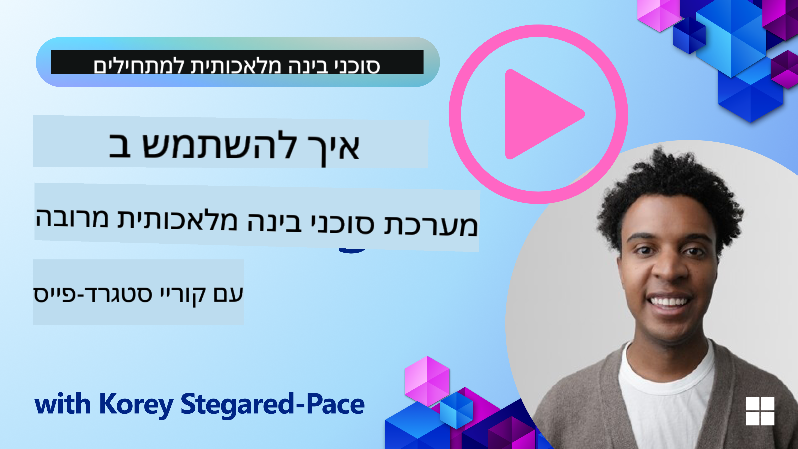
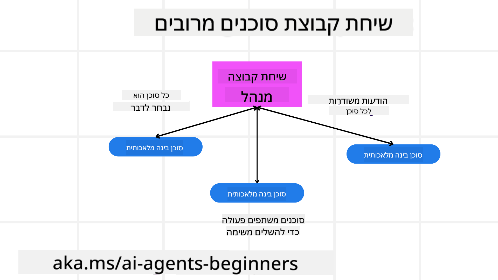
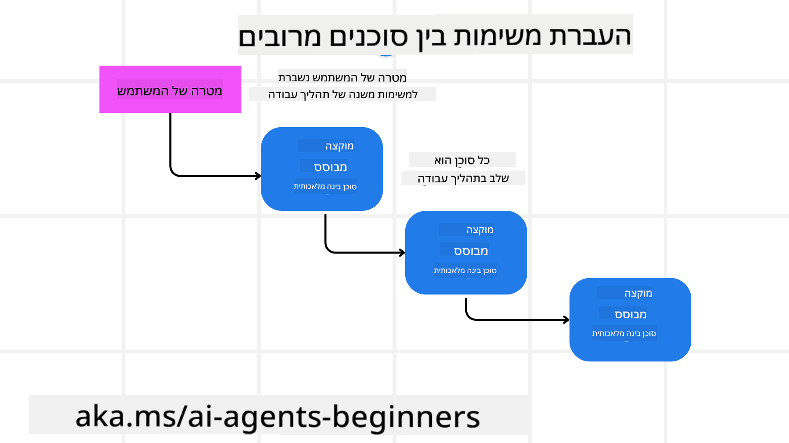
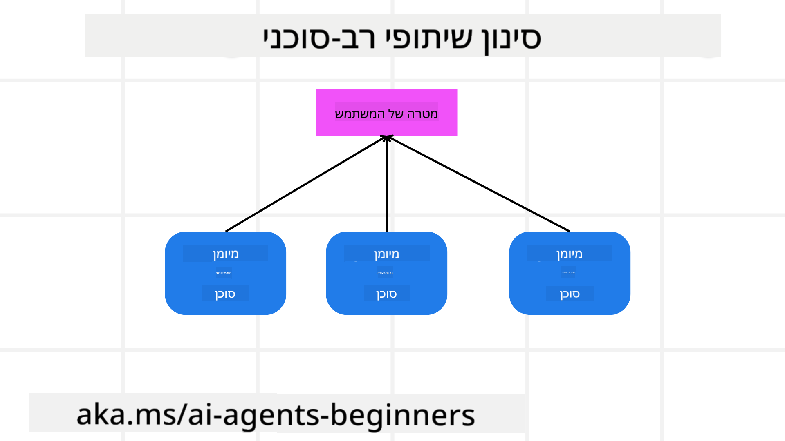

<!--
CO_OP_TRANSLATOR_METADATA:
{
  "original_hash": "c692a8975d7d5b99575a553de1c5e8a7",
  "translation_date": "2025-07-12T11:17:35+00:00",
  "source_file": "08-multi-agent/README.md",
  "language_code": "he"
}
-->

> _(לחצו על התמונה למעלה כדי לצפות בסרטון של השיעור)_

# תבניות עיצוב רב-סוכניות

ברגע שתתחילו לעבוד על פרויקט הכולל מספר סוכנים, תצטרכו לקחת בחשבון את תבנית העיצוב הרב-סוכנית. עם זאת, ייתכן שלא יהיה מייד ברור מתי לעבור לשימוש ברב-סוכנים ומה היתרונות בכך.

## מבוא

בשיעור זה ננסה לענות על השאלות הבאות:

- באילו תרחישים מתאים להשתמש ברב-סוכנים?
- מהם היתרונות של שימוש ברב-סוכנים לעומת סוכן יחיד שמבצע מספר משימות?
- מהם אבני הבניין ליישום תבנית העיצוב הרב-סוכנית?
- איך ניתן לקבל תובנה על האינטראקציה בין הסוכנים השונים?

## מטרות הלמידה

בסיום השיעור, תוכלו:

- לזהות תרחישים בהם מתאים להשתמש ברב-סוכנים
- להכיר את היתרונות של שימוש ברב-סוכנים לעומת סוכן יחיד
- להבין את אבני הבניין ליישום תבנית העיצוב הרב-סוכנית

מה התמונה הגדולה?

*רב-סוכנים הם תבנית עיצוב שמאפשרת למספר סוכנים לעבוד יחד להשגת מטרה משותפת*.

תבנית זו נפוצה בתחומים שונים, כולל רובוטיקה, מערכות אוטונומיות ומחשוב מבוזר.

## תרחישים בהם מתאים להשתמש ברב-סוכנים

אז באילו תרחישים כדאי להשתמש ברב-סוכנים? התשובה היא שישנם תרחישים רבים שבהם השימוש במספר סוכנים הוא מועיל, במיוחד במקרים הבאים:

- **עומסי עבודה גדולים**: עומסי עבודה גדולים יכולים להתחלק למשימות קטנות יותר ולהיות מוקצים לסוכנים שונים, מה שמאפשר עיבוד מקבילי והשלמה מהירה יותר. דוגמה לכך היא משימת עיבוד נתונים גדולה.
- **משימות מורכבות**: משימות מורכבות, בדומה לעומסי עבודה גדולים, יכולות להתחלק לתת-משימות קטנות יותר ולהיות מוקצות לסוכנים שונים, שכל אחד מתמחה בהיבט מסוים של המשימה. דוגמה טובה לכך היא במכוניות אוטונומיות, שבהן סוכנים שונים מנהלים ניווט, זיהוי מכשולים ותקשורת עם רכבים אחרים.
- **מומחיות מגוונת**: סוכנים שונים יכולים להחזיק במומחיות מגוונת, מה שמאפשר להם לטפל בהיבטים שונים של המשימה בצורה יעילה יותר מסוכן יחיד. דוגמה לכך היא בתחום הבריאות, שבו סוכנים יכולים לנהל אבחונים, תוכניות טיפול ומעקב אחר מטופלים.

## יתרונות השימוש ברב-סוכנים לעומת סוכן יחיד

מערכת עם סוכן יחיד יכולה להתאים למשימות פשוטות, אך במשימות מורכבות יותר, שימוש במספר סוכנים יכול להציע מספר יתרונות:

- **התמחות**: כל סוכן יכול להתמחות במשימה מסוימת. חוסר התמחות בסוכן יחיד אומר שיש סוכן שיכול לעשות הכל, אך עלול להתבלבל כשמתמודד עם משימה מורכבת. למשל, הוא עלול לבצע משימה שאינה מתאימה לו במיוחד.
- **יכולת התרחבות**: קל יותר להרחיב מערכות על ידי הוספת סוכנים נוספים מאשר להעמיס על סוכן יחיד.
- **עמידות לתקלות**: אם סוכן אחד נכשל, אחרים יכולים להמשיך לפעול, מה שמבטיח אמינות מערכתית.

ניקח דוגמה: נרצה להזמין טיול למשתמש. מערכת עם סוכן יחיד תצטרך לטפל בכל היבטי תהליך ההזמנה, החל מחיפוש טיסות ועד הזמנת מלונות ורכבי שכירות. כדי להשיג זאת עם סוכן יחיד, הסוכן יצטרך כלים לטיפול בכל המשימות הללו, מה שעלול להוביל למערכת מורכבת ומונוליטית שקשה לתחזק ולהרחיב. לעומת זאת, מערכת רב-סוכנית יכולה לכלול סוכנים שונים המתמחים בחיפוש טיסות, הזמנת מלונות ורכבי שכירות. זה יהפוך את המערכת למודולרית יותר, קלה לתחזוקה ולהרחבה.

השוו זאת למשרד נסיעות קטן שמנוהל על ידי משפחה לעומת משרד נסיעות שמנוהל כזיכיון. המשרד המשפחתי יכלול סוכן יחיד שמטפל בכל היבטי ההזמנה, בעוד שהזיכיון יכלול סוכנים שונים שמטפלים בהיבטים שונים של ההזמנה.

## אבני הבניין ליישום תבנית העיצוב הרב-סוכנית

לפני שתוכלו ליישם את תבנית העיצוב הרב-סוכנית, עליכם להבין את אבני הבניין שמרכיבות את התבנית.

נמחיש זאת שוב בדוגמה של הזמנת טיול למשתמש. במקרה זה, אבני הבניין יכללו:

- **תקשורת בין סוכנים**: סוכנים האחראים על חיפוש טיסות, הזמנת מלונות ורכבי שכירות צריכים לתקשר ולשתף מידע על העדפות ומגבלות המשתמש. עליכם להחליט על הפרוטוקולים והשיטות לתקשורת זו. באופן קונקרטי, הסוכן לחיפוש טיסות צריך לתקשר עם הסוכן להזמנת מלונות כדי לוודא שהמלון מוזמן לאותם תאריכים כמו הטיסה. משמעות הדבר היא שהסוכנים צריכים לשתף מידע על תאריכי הנסיעה של המשתמש, ולכן עליכם להחליט *אילו סוכנים משתפים מידע ואיך הם משתפים אותו*.
- **מנגנוני תיאום**: הסוכנים צריכים לתאם את פעולותיהם כדי לוודא שהעדפות ומגבלות המשתמש מתקיימות. לדוגמה, העדפת משתמש יכולה להיות מלון קרוב לשדה התעופה, בעוד שמגבלה יכולה להיות שרכבי השכרה זמינים רק בשדה התעופה. משמעות הדבר היא שהסוכן להזמנת מלונות צריך לתאם עם הסוכן להזמנת רכבי השכרה כדי לעמוד בהעדפות ובמגבלות המשתמש. עליכם להחליט *איך הסוכנים מתאמים את פעולותיהם*.
- **ארכיטקטורת סוכן**: הסוכנים צריכים להיות בעלי מבנה פנימי שיאפשר קבלת החלטות ולמידה מהאינטראקציות עם המשתמש. לדוגמה, הסוכן לחיפוש טיסות צריך להיות בעל מבנה פנימי שיאפשר לו לקבל החלטות לגבי אילו טיסות להמליץ למשתמש. עליכם להחליט *איך הסוכנים מקבלים החלטות ולומדים מהאינטראקציות עם המשתמש*. דוגמה ללמידה ושיפור יכולה להיות שימוש במודל למידת מכונה על ידי הסוכן לחיפוש טיסות כדי להמליץ על טיסות בהתבסס על העדפות עבר של המשתמש.
- **תצפית על אינטראקציות רב-סוכניות**: עליכם לקבל תצפית על האופן שבו הסוכנים השונים מתקשרים זה עם זה. משמעות הדבר היא שתצטרכו כלים וטכניקות למעקב אחר פעילויות ואינטראקציות של הסוכנים. זה יכול להיות בצורה של כלים לרישום ומעקב, כלים להמחשה ומדדי ביצועים.
- **תבניות רב-סוכניות**: קיימות תבניות שונות ליישום מערכות רב-סוכניות, כגון ארכיטקטורות מרכזיות, מבוזרות והיברידיות. עליכם להחליט איזו תבנית מתאימה ביותר למקרה השימוש שלכם.
- **אדם בתהליך**: ברוב המקרים יהיה אדם בתהליך, ועליכם להנחות את הסוכנים מתי לבקש התערבות אנושית. זה יכול להיות בצורה של בקשת משתמש למלון או טיסה ספציפיים שהסוכנים לא המליצו עליהם, או בקשת אישור לפני הזמנת טיסה או מלון.

## תצפית על אינטראקציות רב-סוכניות

חשוב שתהיה לכם תצפית על האופן שבו הסוכנים השונים מתקשרים זה עם זה. תצפית זו חיונית לאיתור תקלות, אופטימיזציה ולהבטחת יעילות המערכת הכוללת. כדי להשיג זאת, עליכם להחזיק בכלים ובטכניקות למעקב אחר פעילויות ואינטראקציות של הסוכנים. זה יכול להיות בצורה של כלים לרישום ומעקב, כלים להמחשה ומדדי ביצועים.

לדוגמה, במקרה של הזמנת טיול למשתמש, תוכלו להחזיק בלוח בקרה שמציג את מצב כל סוכן, העדפות ומגבלות המשתמש, והאינטראקציות בין הסוכנים. לוח הבקרה יכול להציג את תאריכי הנסיעה של המשתמש, את הטיסות שהומלצו על ידי סוכן הטיסות, את המלונות שהומלצו על ידי סוכן המלונות, ואת רכבי השכרה שהומלצו על ידי סוכן רכבי ההשכרה. זה ייתן לכם תמונה ברורה של האופן שבו הסוכנים מתקשרים זה עם זה והאם העדפות ומגבלות המשתמש מתקיימות.

נבחן כל אחד מההיבטים הללו ביתר פירוט.

- **כלי רישום ומעקב**: רצוי לבצע רישום עבור כל פעולה שננקטת על ידי סוכן. רשומת רישום יכולה לכלול מידע על הסוכן שביצע את הפעולה, הפעולה שננקטה, זמן ביצוע הפעולה ותוצאתה. מידע זה יכול לשמש לאיתור תקלות, אופטימיזציה ועוד.
- **כלי המחשה**: כלים להמחשה יכולים לעזור לכם לראות את האינטראקציות בין הסוכנים בצורה אינטואיטיבית יותר. לדוגמה, תוכלו להחזיק בגרף שמציג את זרימת המידע בין הסוכנים. זה יכול לעזור לזהות צווארי בקבוק, חוסר יעילות ובעיות אחרות במערכת.
- **מדדי ביצועים**: מדדי ביצועים יכולים לעזור לכם לעקוב אחר יעילות מערכת הרב-סוכנים. לדוגמה, תוכלו לעקוב אחר הזמן שנדרש להשלמת משימה, מספר המשימות שהושלמו ליחידת זמן, ודיוק ההמלצות שהסוכנים מספקים. מידע זה יכול לעזור לזהות תחומים לשיפור ולאופטימיזציה של המערכת.

## תבניות רב-סוכניות

בואו נצלול לכמה תבניות קונקרטיות שניתן להשתמש בהן ליצירת אפליקציות רב-סוכניות. הנה כמה תבניות מעניינות שכדאי לשקול:

### שיחת קבוצתית

תבנית זו שימושית כאשר רוצים ליצור אפליקציית שיחת קבוצתית שבה מספר סוכנים יכולים לתקשר זה עם זה. מקרים טיפוסיים לשימוש בתבנית זו כוללים שיתוף פעולה בצוות, תמיכת לקוחות ורשתות חברתיות.

בתבנית זו, כל סוכן מייצג משתמש בשיחת הקבוצה, והודעות מוחלפות בין הסוכנים באמצעות פרוטוקול הודעות. הסוכנים יכולים לשלוח הודעות לשיחת הקבוצה, לקבל הודעות מהקבוצה ולהגיב להודעות מסוכנים אחרים.

ניתן ליישם תבנית זו באמצעות ארכיטקטורה מרכזית שבה כל ההודעות מנותבות דרך שרת מרכזי, או ארכיטקטורה מבוזרת שבה ההודעות מוחלפות ישירות.

### העברת משימות

תבנית זו שימושית כאשר רוצים ליצור אפליקציה שבה מספר סוכנים יכולים להעביר משימות זה לזה.

מקרים טיפוסיים לשימוש בתבנית זו כוללים תמיכת לקוחות, ניהול משימות ואוטומציה של תהליכי עבודה.

בתבנית זו, כל סוכן מייצג משימה או שלב בתהליך עבודה, והסוכנים יכולים להעביר משימות לסוכנים אחרים על פי כללים מוגדרים מראש.

### סינון שיתופי

תבנית זו שימושית כאשר רוצים ליצור אפליקציה שבה מספר סוכנים משתפים פעולה כדי להמליץ למשתמשים.

הסיבה לרצון בשיתוף פעולה בין סוכנים היא שכל סוכן יכול להחזיק במומחיות שונה ולתרום לתהליך ההמלצה בדרכים שונות.

ניקח דוגמה שבה משתמש רוצה המלצה על המניה הטובה ביותר לקנייה בשוק ההון.

- **מומחה תעשייה**: סוכן אחד יכול להיות מומחה בתחום תעשייה מסוים.
- **ניתוח טכני**: סוכן נוסף יכול להיות מומחה בניתוח טכני.
- **ניתוח יסודי**: וסוכן נוסף יכול להיות מומחה בניתוח יסודי. באמצעות שיתוף פעולה, סוכנים אלו יכולים לספק המלצה מקיפה יותר למשתמש.

## תרחיש: תהליך החזר כספי

נחשוב על תרחיש שבו לקוח מנסה לקבל החזר עבור מוצר. בתהליך זה יכולים להיות מעורבים מספר סוכנים, אך נחלק אותם לסוכנים ספציפיים לתהליך זה ולסוכנים כלליים שניתן להשתמש בהם בתהליכים אחרים.

**סוכנים ספציפיים לתהליך ההחזר**:

להלן כמה סוכנים שעשויים להיות מעורבים בתהליך ההחזר:

- **סוכן לקוח**: סוכן זה מייצג את הלקוח ואחראי על ייזום תהליך ההחזר.
- **סוכן מוכר**: סוכן זה מייצג את המוכר ואחראי על עיבוד ההחזר.
- **סוכן תשלום**: סוכן זה מייצג את תהליך התשלום ואחראי על החזרת התשלום ללקוח.
- **סוכן פתרון בעיות**: סוכן זה מייצג את תהליך הפתרון ואחראי על פתרון בעיות שעולות במהלך תהליך ההחזר.
- **סוכן ציות**: סוכן זה מייצג את תהליך הציות ואחראי לוודא שתהליך ההחזר עומד בתקנות ובמדיניות.

**סוכנים כלליים**:

סוכנים אלה יכולים לשמש חלקים אחרים בעסק שלכם.

- **סוכן משלוחים**: סוכן זה מייצג את תהליך המשלוחים ואחראי על החזרת המוצר למוכר. סוכן זה יכול לשמש הן בתהליך ההחזר והן למשלוחים כלליים של מוצר במסגרת רכישה, למשל.
- **סוכן משוב**: סוכן זה מייצג את תהליך המשוב ואחראי על איסוף משוב מהלקוח. משוב יכול להינתן בכל זמן, לא רק במהלך תהליך ההחזר.
- **סוכן הסלמה**: סוכן זה מייצג את תהליך ההסלמה ואחראי על הסלמת בעיות לרמת תמיכה גבוהה יותר. ניתן להשתמש בסוכן מסוג זה בכל תהליך שבו יש צורך בהסלמה.
- **סוכן התראות**: סוכן זה מייצג את תהליך ההתראות ואחראי על שליחת התראות ללקוח בשלבים שונים של תהליך ההחזר.
- **סוכן אנליטיקה**: סוכן זה מייצג את תהליך האנליטיקה ואחראי על ניתוח נתונים הקשורים לתהליך ההחזר.
- **סוכן ביקורת**: סוכן זה מייצג את תהליך הביקורת ואחראי על ביקורת תהליך ההחזר כדי לוודא שהוא מתבצע כראוי.
- **סוכן דיווח**: סוכן זה מייצג את תהליך הדיווח ואחראי על יצירת דוחות על תהליך ההחזר.
- **סוכן ידע**: סוכן זה מייצג את תהליך הידע ואחראי על תחזוקת בסיס ידע של מידע הקשור לתהליך ההחזר. סוכן זה יכול להיות בקיא הן בהחזרים והן בחלקים אחרים בעסק שלכם.
- **סוכן אבטחה**: סוכן זה מייצג את תהליך האבטחה ואחראי על הבטחת אבטחת תהליך ההחזר.
- **סוכן איכות**: סוכן זה מייצג את תהליך האיכות ואחראי על הבטחת איכות תהליך ההחזר.

רשימת הסוכנים שהוצגה כאן כוללת סוכנים ספציפיים לתהליך ההחזר וגם סוכנים כלליים שניתן להשתמש בהם בחלקים אחרים בעסק שלכם. מקווים שזה נותן לכם מושג כיצד להחליט אילו סוכנים להשתמש במערכת הרב-סוכנית שלכם.

## מטלה
## השיעור הקודם

[תכנון ועיצוב](../07-planning-design/README.md)

## השיעור הבא

[מטה-קוגניציה בסוכני AI](../09-metacognition/README.md)

**כתב ויתור**:  
מסמך זה תורגם באמצעות שירות תרגום מבוסס בינה מלאכותית [Co-op Translator](https://github.com/Azure/co-op-translator). למרות שאנו שואפים לדיוק, יש לקחת בחשבון כי תרגומים אוטומטיים עלולים להכיל שגיאות או אי-דיוקים. המסמך המקורי בשפת המקור שלו נחשב למקור הסמכותי. למידע קריטי מומלץ להשתמש בתרגום מקצועי על ידי מתרגם אנושי. אנו לא נושאים באחריות לכל אי-הבנה או פרשנות שגויה הנובעת משימוש בתרגום זה.