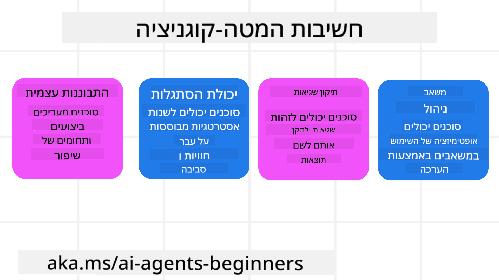
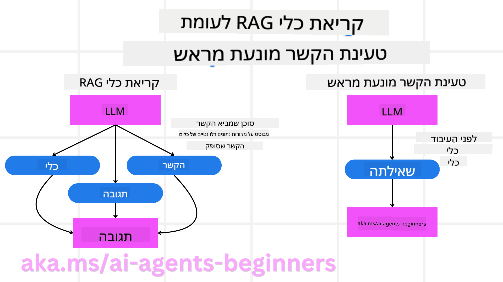

<!--
CO_OP_TRANSLATOR_METADATA:
{
  "original_hash": "8cbf460468c802c7994aa62e0e0779c9",
  "translation_date": "2025-07-12T12:54:53+00:00",
  "source_file": "09-metacognition/README.md",
  "language_code": "he"
}
-->
[](https://youtu.be/His9R6gw6Ec?si=3_RMb8VprNvdLRhX)

> _(לחצו על התמונה למעלה לצפייה בסרטון של השיעור)_
# מטה-קוגניציה בסוכני בינה מלאכותית

## מבוא

ברוכים הבאים לשיעור על מטה-קוגניציה בסוכני בינה מלאכותית! פרק זה מיועד למתחילים הסקרנים כיצד סוכני AI יכולים לחשוב על תהליכי החשיבה שלהם עצמם. בסיום השיעור תבינו מושגים מרכזיים ותהיו מצוידים בדוגמאות מעשיות ליישום מטה-קוגניציה בעיצוב סוכני AI.

## מטרות הלמידה

בסיום השיעור תוכלו:

1. להבין את ההשלכות של לולאות הסקה בהגדרות סוכנים.
2. להשתמש בטכניקות תכנון והערכה כדי לסייע לסוכנים המתוקנים בעצמם.
3. ליצור סוכנים משלכם המסוגלים לתמרן קוד כדי להשלים משימות.

## מבוא למטה-קוגניציה

מטה-קוגניציה מתייחסת לתהליכים קוגניטיביים ברמה גבוהה הכוללים חשיבה על החשיבה עצמה. עבור סוכני AI, זה אומר היכולת להעריך ולהתאים את פעולותיהם בהתבסס על מודעות עצמית וניסיון עבר. מטה-קוגניציה, או "חשיבה על חשיבה", היא מושג חשוב בפיתוח מערכות AI סוכניות. היא כוללת מודעות של מערכות AI לתהליכים הפנימיים שלהן ויכולת לנטר, לווסת ולהתאים את ההתנהגות בהתאם. ממש כמו שאנחנו עושים כשאנחנו "קוראים את החדר" או מסתכלים על בעיה. מודעות עצמית זו יכולה לסייע למערכות AI לקבל החלטות טובות יותר, לזהות טעויות ולשפר את הביצועים שלהן לאורך זמן – שוב מקשרת לבחינת טיורינג ולדיון האם AI ישתלט בעתיד.

בהקשר של מערכות AI סוכניות, מטה-קוגניציה יכולה לסייע בהתמודדות עם אתגרים שונים, כגון:
- שקיפות: הבטחת יכולת הסבר של מערכות AI לגבי ההסקות וההחלטות שלהן.
- הסקה: שיפור היכולת של מערכות AI לסנתז מידע ולקבל החלטות מושכלות.
- התאמה: מתן אפשרות למערכות AI להסתגל לסביבות חדשות ולתנאים משתנים.
- תפיסה: שיפור הדיוק בזיהוי ופרשנות של נתונים מהסביבה.

### מהי מטה-קוגניציה?

מטה-קוגניציה, או "חשיבה על חשיבה", היא תהליך קוגניטיבי ברמה גבוהה הכולל מודעות עצמית וויסות עצמי של תהליכי החשיבה. בתחום ה-AI, מטה-קוגניציה מאפשרת לסוכנים להעריך ולהתאים את האסטרטגיות והפעולות שלהם, מה שמוביל לשיפור בפתרון בעיות ובקבלת החלטות. בהבנת מטה-קוגניציה תוכלו לעצב סוכני AI שהם לא רק חכמים יותר, אלא גם גמישים ויעילים יותר. במטה-קוגניציה אמיתית, תראו את ה-AI מסביר במפורש את ההסקות שלו על ההסקות שלו.

דוגמה: "עדפתי טיסות זולות יותר כי... אולי אני מפספס טיסות ישירות, אז אני אבדוק שוב."
מעקב אחרי איך או למה נבחר מסלול מסוים.
- זיהוי טעויות שנעשו כי הסתמך יותר מדי על העדפות המשתמש מהפעם הקודמת, ולכן משנה את אסטרטגיית קבלת ההחלטות ולא רק את ההמלצה הסופית.
- אבחון דפוסים כמו: "כשאני רואה שהמשתמש מזכיר 'עמוס מדי', אני לא רק מסיר אטרקציות מסוימות אלא גם משקף שהשיטה שלי לבחירת 'אטרקציות מובילות' פגומה אם אני תמיד מדרג לפי פופולריות."

### חשיבות המטה-קוגניציה בסוכני AI

מטה-קוגניציה ממלאת תפקיד מרכזי בעיצוב סוכני AI ממספר סיבות:



- התבוננות עצמית: סוכנים יכולים להעריך את ביצועיהם ולזהות תחומים לשיפור.
- גמישות: סוכנים יכולים לשנות את האסטרטגיות שלהם בהתבסס על ניסיון עבר וסביבות משתנות.
- תיקון טעויות: סוכנים יכולים לזהות ולתקן טעויות באופן עצמאי, מה שמוביל לתוצאות מדויקות יותר.
- ניהול משאבים: סוכנים יכולים לייעל את השימוש במשאבים, כמו זמן וכוח חישוב, באמצעות תכנון והערכה של פעולותיהם.

## רכיבי סוכן AI

לפני שנצלול לתהליכים מטה-קוגניטיביים, חשוב להבין את הרכיבים הבסיסיים של סוכן AI. סוכן AI מורכב בדרך כלל מ:

- פרסונה: האישיות והתכונות של הסוכן, המגדירות כיצד הוא מתקשר עם המשתמשים.
- כלים: היכולות והפונקציות שהסוכן יכול לבצע.
- מיומנויות: הידע והמומחיות שהסוכן מחזיק.

רכיבים אלו פועלים יחד ליצירת "יחידת מומחיות" המסוגלת לבצע משימות ספציפיות.

**דוגמה**:
תחשבו על סוכן נסיעות, שירות סוכנים שמתכנן לא רק את החופשה שלכם אלא גם מתאים את המסלול שלו בהתבסס על נתונים בזמן אמת וניסיון מסעות קודמים של לקוחות.

### דוגמה: מטה-קוגניציה בשירות סוכן נסיעות

דמיינו שאתם מעצבים שירות סוכן נסיעות מבוסס AI. סוכן זה, "Travel Agent", מסייע למשתמשים בתכנון חופשותיהם. כדי לשלב מטה-קוגניציה, Travel Agent צריך להעריך ולהתאים את פעולותיו בהתבסס על מודעות עצמית וניסיון עבר. כך מטה-קוגניציה יכולה לשחק תפקיד:

#### המשימה הנוכחית

המשימה הנוכחית היא לעזור למשתמש לתכנן טיול לפריז.

#### שלבים להשלמת המשימה

1. **איסוף העדפות המשתמש**: לשאול את המשתמש לגבי תאריכי הנסיעה, התקציב, תחומי העניין (למשל מוזיאונים, קולינריה, קניות) וכל דרישה ספציפית.
2. **שליפת מידע**: לחפש אפשרויות טיסה, לינה, אטרקציות ומסעדות התואמות את העדפות המשתמש.
3. **יצירת המלצות**: לספק מסלול מותאם אישית עם פרטי טיסות, הזמנות מלון ופעילויות מוצעות.
4. **התאמה על בסיס משוב**: לבקש מהמשתמש משוב על ההמלצות ולבצע התאמות נדרשות.

#### משאבים נדרשים

- גישה למסדי נתונים של טיסות והזמנות מלון.
- מידע על אטרקציות ומסעדות בפריז.
- נתוני משוב ממשתמשים מקשרים קודמים.

#### ניסיון והתבוננות עצמית

Travel Agent משתמש במטה-קוגניציה כדי להעריך את ביצועיו וללמוד מניסיון עבר. לדוגמה:

1. **ניתוח משוב משתמש**: Travel Agent בוחן את המשוב כדי לקבוע אילו המלצות התקבלו היטב ואילו לא, ומתאים את ההצעות העתידיות בהתאם.
2. **גמישות**: אם משתמש ציין בעבר שהוא לא אוהב מקומות צפופים, Travel Agent ימנע מהמלצת אתרי תיירות פופולריים בשעות שיא בעתיד.
3. **תיקון טעויות**: אם Travel Agent עשה טעות בהזמנה קודמת, כמו הצעת מלון שהיה מלא, הוא ילמד לבדוק זמינות ביתר קפדנות לפני מתן המלצות.

#### דוגמה מעשית למפתח

הנה דוגמה מפושטת של קוד Travel Agent שמשלב מטה-קוגניציה:

```python
class Travel_Agent:
    def __init__(self):
        self.user_preferences = {}
        self.experience_data = []

    def gather_preferences(self, preferences):
        self.user_preferences = preferences

    def retrieve_information(self):
        # Search for flights, hotels, and attractions based on preferences
        flights = search_flights(self.user_preferences)
        hotels = search_hotels(self.user_preferences)
        attractions = search_attractions(self.user_preferences)
        return flights, hotels, attractions

    def generate_recommendations(self):
        flights, hotels, attractions = self.retrieve_information()
        itinerary = create_itinerary(flights, hotels, attractions)
        return itinerary

    def adjust_based_on_feedback(self, feedback):
        self.experience_data.append(feedback)
        # Analyze feedback and adjust future recommendations
        self.user_preferences = adjust_preferences(self.user_preferences, feedback)

# Example usage
travel_agent = Travel_Agent()
preferences = {
    "destination": "Paris",
    "dates": "2025-04-01 to 2025-04-10",
    "budget": "moderate",
    "interests": ["museums", "cuisine"]
}
travel_agent.gather_preferences(preferences)
itinerary = travel_agent.generate_recommendations()
print("Suggested Itinerary:", itinerary)
feedback = {"liked": ["Louvre Museum"], "disliked": ["Eiffel Tower (too crowded)"]}
travel_agent.adjust_based_on_feedback(feedback)
```

#### למה מטה-קוגניציה חשובה

- **התבוננות עצמית**: סוכנים יכולים לנתח את ביצועיהם ולזהות נקודות לשיפור.
- **גמישות**: סוכנים יכולים לשנות אסטרטגיות בהתבסס על משוב ותנאים משתנים.
- **תיקון טעויות**: סוכנים יכולים לזהות ולתקן טעויות באופן עצמאי.
- **ניהול משאבים**: סוכנים יכולים לייעל את השימוש במשאבים, כמו זמן וכוח חישוב.

באמצעות שילוב מטה-קוגניציה, Travel Agent יכול לספק המלצות נסיעה מדויקות ואישיות יותר, ולשפר את חוויית המשתמש הכוללת.

---

## 2. תכנון בסוכנים

תכנון הוא רכיב קריטי בהתנהגות סוכן AI. הוא כולל תכנון של השלבים הדרושים להשגת מטרה, תוך התחשבות במצב הנוכחי, במשאבים ובמכשולים אפשריים.

### מרכיבי התכנון

- **המשימה הנוכחית**: הגדרת המשימה בצורה ברורה.
- **שלבים להשלמת המשימה**: פירוק המשימה לשלבים ניתנים לניהול.
- **משאבים נדרשים**: זיהוי המשאבים הדרושים.
- **ניסיון**: שימוש בניסיון עבר להכוונת התכנון.

**דוגמה**:
הנה השלבים ש-Travel Agent צריך לבצע כדי לסייע למשתמש בתכנון הטיול בצורה יעילה:

### שלבים עבור Travel Agent

1. **איסוף העדפות המשתמש**
   - לשאול את המשתמש לגבי תאריכי הנסיעה, התקציב, תחומי העניין וכל דרישה ספציפית.
   - דוגמאות: "מתי אתה מתכנן לנסוע?" "מה טווח התקציב שלך?" "אילו פעילויות אתה נהנה לעשות בחופשה?"

2. **שליפת מידע**
   - לחפש אפשרויות נסיעה רלוונטיות בהתבסס על העדפות המשתמש.
   - **טיסות**: לחפש טיסות זמינות במסגרת התקציב ותאריכי הנסיעה המועדפים.
   - **לינה**: למצוא מלונות או נכסים להשכרה התואמים את העדפות המשתמש למיקום, מחיר ושירותים.
   - **אטרקציות ומסעדות**: לזהות אטרקציות, פעילויות ואפשרויות אוכל פופולריות התואמות את תחומי העניין.

3. **יצירת המלצות**
   - לאסוף את המידע שנשלף למסלול מותאם אישית.
   - לספק פרטים כמו אפשרויות טיסה, הזמנות מלון ופעילויות מוצעות, בהתאמה להעדפות המשתמש.

4. **הצגת המסלול למשתמש**
   - לשתף את המסלול המוצע עם המשתמש לסקירה.
   - דוגמה: "הנה מסלול מוצע לטיול שלך לפריז. הוא כולל פרטי טיסות, הזמנות מלון ורשימת פעילויות ומסעדות מומלצות. אשמח לשמוע את דעתך!"

5. **איסוף משוב**
   - לבקש מהמשתמש משוב על המסלול המוצע.
   - דוגמאות: "האם אתה מרוצה מאפשרויות הטיסה?" "האם המלון מתאים לצרכיך?" "האם יש פעילויות שברצונך להוסיף או להסיר?"

6. **התאמה על בסיס המשוב**
   - לשנות את המסלול בהתאם למשוב המשתמש.
   - לבצע שינויים נדרשים בהמלצות הטיסה, הלינה והפעילויות כדי להתאים טוב יותר להעדפות.

7. **אישור סופי**
   - להציג את המסלול המעודכן לאישור סופי.
   - דוגמה: "ביצעתי את השינויים בהתאם למשוב שלך. הנה המסלול המעודכן. האם הכל נראה טוב?"

8. **הזמנה ואישור**
   - לאחר אישור המשתמש, לבצע הזמנות טיסות, לינה ופעילויות מתוכננות.
   - לשלוח פרטי אישור למשתמש.

9. **תמיכה שוטפת**
   - להישאר זמין לסייע בשינויים או בקשות נוספות לפני ובמהלך הטיול.
   - דוגמה: "אם תזדקק לעזרה נוספת במהלך הטיול, אל תהסס לפנות אליי בכל עת!"

### דוגמת אינטראקציה

```python
class Travel_Agent:
    def __init__(self):
        self.user_preferences = {}
        self.experience_data = []

    def gather_preferences(self, preferences):
        self.user_preferences = preferences

    def retrieve_information(self):
        flights = search_flights(self.user_preferences)
        hotels = search_hotels(self.user_preferences)
        attractions = search_attractions(self.user_preferences)
        return flights, hotels, attractions

    def generate_recommendations(self):
        flights, hotels, attractions = self.retrieve_information()
        itinerary = create_itinerary(flights, hotels, attractions)
        return itinerary

    def adjust_based_on_feedback(self, feedback):
        self.experience_data.append(feedback)
        self.user_preferences = adjust_preferences(self.user_preferences, feedback)

# Example usage within a booing request
travel_agent = Travel_Agent()
preferences = {
    "destination": "Paris",
    "dates": "2025-04-01 to 2025-04-10",
    "budget": "moderate",
    "interests": ["museums", "cuisine"]
}
travel_agent.gather_preferences(preferences)
itinerary = travel_agent.generate_recommendations()
print("Suggested Itinerary:", itinerary)
feedback = {"liked": ["Louvre Museum"], "disliked": ["Eiffel Tower (too crowded)"]}
travel_agent.adjust_based_on_feedback(feedback)
```

## 3. מערכת RAG מתקנת

נתחיל בהבנת ההבדל בין כלי RAG לטעינת הקשר מוקדמת



### Retrieval-Augmented Generation (RAG)

RAG משלב מערכת שליפה עם מודל גנרטיבי. כאשר מתקבלת שאילתה, מערכת השליפה מביאה מסמכים או נתונים רלוונטיים ממקור חיצוני, ומידע זה משמש להרחבת הקלט למודל הגנרטיבי. זה עוזר למודל לייצר תגובות מדויקות ורלוונטיות יותר להקשר.

במערכת RAG, הסוכן מושך מידע רלוונטי מבסיס ידע ומשתמש בו ליצירת תגובות או פעולות מתאימות.

### גישת RAG מתקנת

גישת RAG מתקנת מתמקדת בשימוש בטכניקות RAG לתיקון טעויות ושיפור הדיוק של סוכני AI. זה כולל:

1. **טכניקת הנחיה**: שימוש בהנחיות ספציפיות להכוונת הסוכן בשליפת מידע רלוונטי.
2. **כלי**: יישום אלגוריתמים ומנגנונים המאפשרים לסוכן להעריך את הרלוונטיות של המידע שנשלף ולייצר תגובות מדויקות.
3. **הערכה**: הערכה מתמשכת של ביצועי הסוכן וביצוע התאמות לשיפור הדיוק והיעילות.

#### דוגמה: RAG מתקנת בסוכן חיפוש

תחשבו על סוכן חיפוש שמושך מידע מהאינטרנט כדי לענות על שאילתות משתמש. גישת RAG מתקנת עשויה לכלול:

1. **טכניקת הנחיה**: ניסוח שאילתות חיפוש בהתבסס על קלט המשתמש.
2. **כלי**: שימוש בעיבוד שפה טבעית ואלגוריתמי למידה חישובית לדירוג וסינון תוצאות החיפוש.
3. **הערכה**: ניתוח משוב משתמש לזיהוי ותיקון אי-דיוקים במידע שנשלף.

### RAG מתקנת ב-Travel Agent

RAG מתקנת (Retrieval-Augmented Generation) משפרת את יכולת ה-AI לשלוף וליצור מידע תוך תיקון אי-דיוקים. נבחן כיצד Travel Agent יכול להשתמש בגישת RAG מתקנת כדי לספק המלצות נסיעה מדויקות ורלוונטיות יותר.

זה כולל:

- **טכניקת הנחיה:** שימוש בהנחיות ספציפיות להכוונת הסוכן בשליפת מידע רלוונטי.
- **כלי:** יישום אלגוריתמים ומנגנונים המאפשרים לסוכן להעריך את הרלוונטיות של המידע שנשלף ולייצר תגובות מדויקות.
- **הערכה:** הערכה מתמשכת של ביצועי הסוכן וביצוע התאמות לשיפור הדיוק והיעילות.

#### שלבים ליישום RAG מתקנת ב-Travel Agent

1. **אינטראקציה ראשונית עם המשתמש**
   - Travel Agent אוסף העדפות ראשוניות מהמשתמש, כגון יעד, תאריכי נסיעה, תקציב ותחומי עניין.
   - דוגמה:

     ```python
     preferences = {
         "destination": "Paris",
         "dates": "2025-04-01 to 2025-04-10",
         "budget": "moderate",
         "interests": ["museums", "cuisine"]
     }
     ```

2. **שליפת מידע**
   - Travel Agent מושך מידע על טיסות, לינה, אטרקציות ומסעדות בהתבסס על העדפות המשתמש.
   - דוגמה:

     ```python
     flights = search_flights(preferences)
     hotels = search_hotels(preferences)
     attractions = search_attractions(preferences)
     ```

3. **יצירת המלצות ראשוניות**
   - Travel Agent משתמש במידע שנשלף ליצירת מסלול מותאם אישית.
   - דוגמה:

     ```python
     itinerary = create_itinerary(flights, hotels, attractions)
     print("Suggested Itinerary:", itinerary)
     ```

4. **איסוף משוב מהמשתמש**
   - Travel Agent מבקש מהמשתמש משוב על ההמלצות הראשוניות.
   - דוגמה:

     ```python
     feedback = {
         "liked": ["Louvre Museum"],
         "disliked": ["Eiffel Tower (too crowded)"]
     }
     ```

5. **תהליך RAG מתקנת**
   - **טכניקת הנחיה**: Travel Agent מנסח שאילתות חיפוש חדשות בהתבסס על משוב המשתמש.
     - דוגמה:

       ```python
       if "disliked" in feedback:
           preferences["avoid"] = feedback["disliked"]
       ```

   - **כלי**: Travel Agent משתמש באלגוריתמים לדירוג וסינון תוצאות חיפוש חדשות, תוך הדגשת הרלוונטיות בהתבסס על המשוב.
     - דוגמה:

       ```python
       new_attractions = search_attractions(preferences)
       new_itinerary = create_itinerary(flights, hotels, new_attractions)
       print("Updated Itinerary:", new_itinerary)
       ```

   - **הערכה**: Travel Agent מעריך באופן מתמשך את הרלוונטיות והדיוק של ההמלצות על ידי ניתוח משוב המשתמש וביצוע התאמות נדרשות.
     - דוגמה:

       ```python
       def adjust_preferences(preferences, feedback):
           if "liked" in feedback:
               preferences["favorites"] = feedback["liked"]
           if "disliked" in feedback:
               preferences["avoid"] = feedback["disliked"]
           return preferences

       preferences = adjust_preferences(preferences, feedback)
       ```

#### דוגמה מעשית

הנה דוגמת קוד פייתון מפושטת המשולבת בגישת RAG מתקנת ב-Travel Agent:
### טעינת הקשר מונעת מראש

טעינת הקשר מונעת מראש כוללת טעינת מידע רלוונטי או רקע לתוך המודל לפני עיבוד השאילתה. משמעות הדבר היא שהמודל מקבל גישה למידע זה מההתחלה, מה שיכול לסייע לו לייצר תגובות מושכלות יותר מבלי הצורך לאחזר נתונים נוספים במהלך התהליך.

הנה דוגמה פשוטה לאופן שבו טעינת הקשר מונעת מראש עשויה להיראות עבור אפליקציית סוכן נסיעות בפייתון:

#### הסבר

1. **אתחול (`__init__` method)**: מחלקת `TravelAgent` טוענת מראש מילון המכיל מידע על יעדים פופולריים כמו פריז, טוקיו, ניו יורק וסידני. מילון זה כולל פרטים כמו מדינה, מטבע, שפה ואטרקציות מרכזיות לכל יעד.

2. **שליפת מידע (`get_destination_info` method)**: כאשר משתמש שואל על יעד מסוים, השיטה `get_destination_info` מושכת את המידע הרלוונטי מהמילון הטעון מראש.

על ידי טעינת ההקשר מראש, אפליקציית סוכן הנסיעות יכולה להגיב במהירות לשאילתות המשתמש מבלי הצורך לאחזר מידע ממקור חיצוני בזמן אמת. זה הופך את האפליקציה ליעילה ותגובתית יותר.

### אתחול התוכנית עם מטרה לפני איטרציה

אתחול תוכנית עם מטרה כולל התחלה עם מטרה ברורה או תוצאה רצויה. על ידי הגדרת המטרה מראש, המודל יכול להשתמש בה כעיקרון מנחה לאורך תהליך האיטרציה. זה מסייע להבטיח שכל איטרציה מתקרבת להשגת התוצאה הרצויה, מה שהופך את התהליך ליעיל וממוקד יותר.

הנה דוגמה לאופן שבו ניתן לאתחל תוכנית נסיעה עם מטרה לפני איטרציה עבור סוכן נסיעות בפייתון:

### תרחיש

סוכן נסיעות רוצה לתכנן חופשה מותאמת אישית ללקוח. המטרה היא ליצור מסלול נסיעה שממקסם את שביעות רצון הלקוח בהתבסס על ההעדפות והתקציב שלו.

### שלבים

1. הגדרת העדפות הלקוח והתקציב.
2. אתחול התוכנית הראשונית בהתבסס על ההעדפות.
3. איטרציה לשיפור התוכנית, תוך אופטימיזציה לשביעות רצון הלקוח.

#### קוד בפייתון

#### הסבר הקוד

1. **אתחול (`__init__` method)**: מחלקת `TravelAgent` מאותחלת עם רשימת יעדים פוטנציאליים, שכל אחד מהם כולל מאפיינים כמו שם, עלות וסוג פעילות.

2. **אתחול התוכנית (`bootstrap_plan` method)**: שיטה זו יוצרת תוכנית נסיעה ראשונית בהתבסס על העדפות הלקוח והתקציב. היא עוברת על רשימת היעדים ומוסיפה אותם לתוכנית אם הם מתאימים להעדפות הלקוח ונמצאים במסגרת התקציב.

3. **התאמת העדפות (`match_preferences` method)**: שיטה זו בודקת אם יעד מסוים מתאים להעדפות הלקוח.

4. **איטרציה על התוכנית (`iterate_plan` method)**: שיטה זו משפרת את התוכנית הראשונית על ידי ניסיון להחליף כל יעד בתוכנית בהתאמה טובה יותר, בהתחשב בהעדפות הלקוח ומגבלות התקציב.

5. **חישוב עלות (`calculate_cost` method)**: שיטה זו מחשבת את העלות הכוללת של התוכנית הנוכחית, כולל יעד חדש פוטנציאלי.

#### דוגמת שימוש

- **תוכנית ראשונית**: סוכן הנסיעות יוצר תוכנית ראשונית בהתבסס על העדפות הלקוח לסיורים ותקציב של 2000$.
- **תוכנית משופרת**: סוכן הנסיעות מבצע איטרציה על התוכנית, תוך אופטימיזציה להעדפות הלקוח והתקציב.

על ידי אתחול התוכנית עם מטרה ברורה (למשל, מקסום שביעות רצון הלקוח) ואיטרציה לשיפור התוכנית, סוכן הנסיעות יכול ליצור מסלול מותאם ואופטימלי ללקוח. גישה זו מבטיחה שהתוכנית תתאים להעדפות ולתקציב הלקוח מההתחלה ותשתפר בכל איטרציה.

### ניצול מודלים שפתיים גדולים (LLM) למיון מחדש ולדירוג

מודלים שפתיים גדולים (LLMs) יכולים לשמש למיון מחדש ולדירוג על ידי הערכת הרלוונטיות והאיכות של מסמכים שנשלפו או תגובות שנוצרו. כך זה עובד:

**שליפת מידע:** שלב השליפה הראשוני מושך סט של מסמכים או תגובות מועמדות בהתבסס על השאילתה.

**מיון מחדש:** ה-LLM מעריך את המועמדים וממיין אותם מחדש לפי רלוונטיות ואיכות. שלב זה מבטיח שהמידע הרלוונטי והאיכותי ביותר יוצג ראשון.

**דירוג:** ה-LLM מעניק ציונים לכל מועמד, המשקפים את רלוונטיותו ואיכותו. זה מסייע בבחירת התגובה או המסמך הטוב ביותר למשתמש.

על ידי ניצול ה-LLM למיון מחדש ולדירוג, המערכת יכולה לספק מידע מדויק ורלוונטי יותר להקשר, ולשפר את חוויית המשתמש הכוללת.

הנה דוגמה לאופן שבו סוכן נסיעות עשוי להשתמש במודל שפה גדול (LLM) למיון מחדש ולדירוג יעדי נסיעה בהתבסס על העדפות המשתמש בפייתון:

#### תרחיש - נסיעה בהתבסס על העדפות

סוכן נסיעות רוצה להמליץ על היעדים הטובים ביותר ללקוח בהתבסס על העדפותיו. ה-LLM יסייע למיין מחדש ולדרג את היעדים כדי להבטיח שהאפשרויות הרלוונטיות ביותר יוצגו.

#### שלבים:

1. איסוף העדפות המשתמש.
2. שליפת רשימת יעדי נסיעה פוטנציאליים.
3. שימוש ב-LLM למיון מחדש ולדירוג היעדים בהתבסס על העדפות המשתמש.

כך ניתן לעדכן את הדוגמה הקודמת לשימוש בשירותי Azure OpenAI:

#### דרישות

1. יש להחזיק במנוי Azure.
2. ליצור משאב Azure OpenAI ולקבל את מפתח ה-API.

#### קוד דוגמה בפייתון

#### הסבר הקוד - מחבר העדפות

1. **אתחול**: מחלקת `TravelAgent` מאותחלת עם רשימת יעדי נסיעה פוטנציאליים, שכל אחד מהם כולל מאפיינים כמו שם ותיאור.

2. **קבלת המלצות (`get_recommendations` method)**: שיטה זו יוצרת פרומפט לשירות Azure OpenAI בהתבסס על העדפות המשתמש ומבצעת בקשת HTTP POST ל-API של Azure OpenAI לקבלת יעדים ממודרגים ומדורגים מחדש.

3. **יצירת פרומפט (`generate_prompt` method)**: שיטה זו בונה פרומפט עבור Azure OpenAI, הכולל את העדפות המשתמש ורשימת היעדים. הפרומפט מנחה את המודל למיין מחדש ולדרג את היעדים בהתבסס על ההעדפות שסופקו.

4. **קריאת API**: ספריית `requests` משמשת לביצוע בקשת HTTP POST לנקודת הקצה של Azure OpenAI. התגובה מכילה את היעדים הממוינים ומדורגים מחדש.

5. **דוגמת שימוש**: סוכן הנסיעות אוסף את העדפות המשתמש (למשל, עניין בסיורים ותרבות מגוונת) ומשתמש בשירות Azure OpenAI לקבלת המלצות ממודרגות ומדורגות מחדש ליעדי נסיעה.

יש לוודא להחליף את `your_azure_openai_api_key` במפתח ה-API האמיתי שלך ואת `https://your-endpoint.com/...` בכתובת הנקודת הקצה האמיתית של פריסת Azure OpenAI שלך.

על ידי ניצול ה-LLM למיון מחדש ולדירוג, סוכן הנסיעות יכול לספק המלצות נסיעה מותאמות אישית ורלוונטיות יותר ללקוחות, ולשפר את חווייתם הכוללת.

### RAG: טכניקת פרומפטינג מול כלי

Retrieval-Augmented Generation (RAG) יכול להיות גם טכניקת פרומפטינג וגם כלי בפיתוח סוכני AI. הבנת ההבדל בין השניים יכולה לסייע לך לנצל את RAG בצורה יעילה יותר בפרויקטים שלך.

#### RAG כטכניקת פרומפטינג

**מה זה?**

- כטכניקת פרומפטינג, RAG כולל ניסוח שאילתות או פרומפטים ספציפיים להנחיית שליפת מידע רלוונטי מתוך מאגר מידע גדול או בסיס נתונים. מידע זה משמש לאחר מכן ליצירת תגובות או פעולות.

**איך זה עובד:**

1. **ניסוח פרומפטים**: יצירת פרומפטים או שאילתות מובנות היטב בהתבסס על המשימה או קלט המשתמש.
2. **שליפת מידע**: שימוש בפרומפטים לחיפוש מידע רלוונטי מתוך בסיס ידע או מאגר נתונים קיים.
3. **יצירת תגובה**: שילוב המידע שנשלף עם מודלים גנרטיביים ליצירת תגובה מקיפה וקוהרנטית.

**דוגמה בסוכן נסיעות**:

- קלט משתמש: "אני רוצה לבקר במוזיאונים בפריז."
- פרומפט: "מצא את המוזיאונים המובילים בפריז."
- מידע שנשלף: פרטים על מוזיאון הלובר, מוזיאון ד'אורסה וכו'.
- תגובה שנוצרה: "הנה כמה מהמוזיאונים המובילים בפריז: מוזיאון הלובר, מוזיאון ד'אורסה, ומרכז פומפידו."

#### RAG ככלי

**מה זה?**

- ככלי, RAG הוא מערכת משולבת שמאוטומטת את תהליך השליפה והיצירה, ומקלה על מפתחים ליישם פונקציות AI מורכבות מבלי לנסח פרומפטים ידנית לכל שאילתה.

**איך זה עובד:**

1. **אינטגרציה**: הטמעת RAG בתוך ארכיטקטורת סוכן ה-AI, המאפשרת לו לטפל אוטומטית במשימות השליפה והיצירה.
2. **אוטומציה**: הכלי מנהל את כל התהליך, מקבלת קלט המשתמש ועד יצירת התגובה הסופית, ללא צורך בפרומפטים מפורשים בכל שלב.
3. **יעילות**: משפר את ביצועי הסוכן על ידי ייעול תהליך השליפה והיצירה, ומאפשר תגובות מהירות ומדויקות יותר.

**דוגמה בסוכן נסיעות**:

- קלט משתמש: "אני רוצה לבקר במוזיאונים בפריז."
- כלי RAG: שולף אוטומטית מידע על מוזיאונים ויוצר תגובה.
- תגובה שנוצרה: "הנה כמה מהמוזיאונים המובילים בפריז: מוזיאון הלובר, מוזיאון ד'אורסה, ומרכז פומפידו."

### השוואה

| היבט                   | טכניקת פרומפטינג                                      | כלי                                                  |
|------------------------|-------------------------------------------------------|-------------------------------------------------------|
| **ידני מול אוטומטי**   | ניסוח ידני של פרומפטים לכל שאילתה.                   | תהליך אוטומטי לשליפה ויצירה.                         |
| **שליטה**              | מאפשר שליטה רבה יותר על תהליך השליפה.                | מייעל ומאוטומט את תהליך השליפה והיצירה.             |
| **גמישות**             | מאפשר פרומפטים מותאמים אישית לפי הצרכים הספציפיים.   | יעיל יותר ליישומים בקנה מידה גדול.                    |
| **מורכבות**            | דורש ניסוח וטיוב של פרומפטים.                         | קל יותר לשילוב בארכיטקטורת סוכן AI.                  |

### דוגמאות מעשיות

**דוגמה לטכניקת פרומפטינג:**

**דוגמה לכלי:**

### הערכת רלוונטיות

הערכת רלוונטיות היא היבט קריטי בביצועי סוכן AI. היא מבטיחה שהמידע שנשלף ונוצר על ידי הסוכן מתאים, מדויק ושימושי למשתמש. נבחן כיצד להעריך רלוונטיות בסוכני AI, כולל דוגמאות מעשיות וטכניקות.

#### מושגים מרכזיים בהערכת רלוונטיות

1. **מודעות להקשר**:
   - הסוכן חייב להבין את ההקשר של שאילתת המשתמש כדי לשלוף וליצור מידע רלוונטי.
   - דוגמה: אם משתמש מבקש "המסעדות הטובות ביותר בפריז", הסוכן צריך לקחת בחשבון את העדפות המשתמש, כמו סוג המטבח והתקציב.

2. **דיוק**:
   - המידע שמספק הסוכן צריך להיות נכון ועדכני.
   - דוגמה: המלצה על מסעדות פתוחות כיום עם ביקורות טובות במקום אפשרויות מיושנות או סגורות.

3. **כוונת המשתמש**:
   - הסוכן צריך להסיק את כוונת המשתמש מאחורי השאילתה כדי לספק את המידע הרלוונטי ביותר.
   - דוגמה: אם משתמש מבקש "מלונות בתקציב נמוך", הסוכן צריך להעדיף אפשרויות זולות.

4. **לולאת משוב**:
   - איסוף וניתוח מתמיד של משוב משתמשים מסייע לסוכן לשפר את תהליך הערכת הרלוונטיות.
   - דוגמה: שילוב דירוגים ומשוב על המלצות קודמות לשיפור תגובות עתידיות.

#### טכניקות מעשיות להערכת רלוונטיות

1. **דירוג רלוונטיות**:
   - הענקת ציון רלוונטיות לכל פריט שנשלף בהתבסס על מידת ההתאמה לשאילתת המשתמש ולהעדפותיו.
   - דוגמה:

2. **סינון ומיון**:
   - סינון פריטים לא רלוונטיים ומיון השאר לפי ציוני הרלוונטיות.
   - דוגמה:

3. **עיבוד שפה טבעית (NLP)**:
   - שימוש בטכניקות NLP להבנת שאילתת המשתמש ולשליפת מידע רלוונטי.
   - דוגמה:

4. **שילוב משוב משתמש**:
   - איסוף משוב על ההמלצות שניתנו ושימוש בו להתאמת הערכות הרלוונטיות בעתיד.
   - דוגמה:

#### דוגמה: הערכת רלוונטיות בסוכן נסיעות

הנה דוגמה מעשית לאופן שבו סוכן הנסיעות יכול להעריך את רלוונטיות ההמלצות לנסיעות:

### חיפוש עם כוונה

חיפוש עם כוונה כולל הבנה ופרשנות של המטרה או היעד שמאחורי שאילתת המשתמש, כדי לשלוף וליצור את המידע הרלוונטי והשימושי ביותר. גישה זו חורגת מהתאמת מילות מפתח בלבד ומתמקדת בהבנת הצרכים וההקשר האמיתיים של המשתמש.

#### מושגים מרכזיים בחיפוש עם כוונה

1. **הבנת כוונת המשתמש**:
   - כוונת המשתמש יכולה להתחלק לשלושה סוגים עיקריים: אינפורמטיבית, ניווטית וטרנזקציונית.
     - **כוונה אינפורמטיבית**: המשתמש מחפש מידע בנושא מסוים (למשל, "מהם המוזיאונים הטובים ביותר בפריז?").
     - **כוונה ניווטית**: המשתמש רוצה לנווט לאתר או דף מסוים (למשל, "אתר רשמי של מוזיאון הלובר").
     - **כוונה טרנזקציונית**: המשתמש שואף לבצע פעולה מסחרית, כמו הזמנת טיסה או רכישה (למשל, "הזמן טיסה לפריז").

2. **מודעות להקשר**:
   - ניתוח ההקשר של שאילתת המשתמש מסייע בזיהוי מדויק של הכוונה. זה כולל התחשבות באינטראקציות קודמות, העדפות המשתמש ופרטי השאילתה הנוכחית.

3. **עיבוד שפה טבעית (NLP)**:
   - טכניקות NLP משמשות להבנת ופרשנות השאילתות בשפה טבעית שמספקים המשתמשים. זה כולל זיהוי ישויות, ניתוח סנטימנט וניתוח השאילתה.

4. **התאמה אישית**:
   - התאמת תוצאות החיפוש בהתבסס על היסטוריית המשתמש, העדפותיו ומשובו משפרת את רלוונטיות המידע שנשלף.
#### דוגמה מעשית: חיפוש עם כוונה בסוכן נסיעות

ניקח את Travel Agent כדוגמה כדי לראות כיצד ניתן ליישם חיפוש עם כוונה.

1. **איסוף העדפות המשתמש**

   ```python
   class Travel_Agent:
       def __init__(self):
           self.user_preferences = {}

       def gather_preferences(self, preferences):
           self.user_preferences = preferences
   ```

2. **הבנת כוונת המשתמש**

   ```python
   def identify_intent(query):
       if "book" in query or "purchase" in query:
           return "transactional"
       elif "website" in query or "official" in query:
           return "navigational"
       else:
           return "informational"
   ```

3. **מודעות להקשר**

   ```python
   def analyze_context(query, user_history):
       # Combine current query with user history to understand context
       context = {
           "current_query": query,
           "user_history": user_history
       }
       return context
   ```

4. **חיפוש והתאמת תוצאות אישית**

   ```python
   def search_with_intent(query, preferences, user_history):
       intent = identify_intent(query)
       context = analyze_context(query, user_history)
       if intent == "informational":
           search_results = search_information(query, preferences)
       elif intent == "navigational":
           search_results = search_navigation(query)
       elif intent == "transactional":
           search_results = search_transaction(query, preferences)
       personalized_results = personalize_results(search_results, user_history)
       return personalized_results

   def search_information(query, preferences):
       # Example search logic for informational intent
       results = search_web(f"best {preferences['interests']} in {preferences['destination']}")
       return results

   def search_navigation(query):
       # Example search logic for navigational intent
       results = search_web(query)
       return results

   def search_transaction(query, preferences):
       # Example search logic for transactional intent
       results = search_web(f"book {query} to {preferences['destination']}")
       return results

   def personalize_results(results, user_history):
       # Example personalization logic
       personalized = [result for result in results if result not in user_history]
       return personalized[:10]  # Return top 10 personalized results
   ```

5. **שימוש לדוגמה**

   ```python
   travel_agent = Travel_Agent()
   preferences = {
       "destination": "Paris",
       "interests": ["museums", "cuisine"]
   }
   travel_agent.gather_preferences(preferences)
   user_history = ["Louvre Museum website", "Book flight to Paris"]
   query = "best museums in Paris"
   results = search_with_intent(query, preferences, user_history)
   print("Search Results:", results)
   ```

---

## 4. יצירת קוד ככלי

סוכני יצירת קוד משתמשים במודלים של בינה מלאכותית כדי לכתוב ולהריץ קוד, לפתור בעיות מורכבות ולאוטומט משימות.

### סוכני יצירת קוד

סוכני יצירת קוד משתמשים במודלים גנרטיביים של בינה מלאכותית כדי לכתוב ולהריץ קוד. סוכנים אלו יכולים לפתור בעיות מורכבות, לאוטומט משימות ולספק תובנות חשובות על ידי יצירה והרצה של קוד בשפות תכנות שונות.

#### יישומים מעשיים

1. **יצירת קוד אוטומטית**: יצירת קטעי קוד למשימות ספציפיות, כמו ניתוח נתונים, גרידת אתרים או למידת מכונה.
2. **SQL כ-RAG**: שימוש בשאילתות SQL לשליפת נתונים ועיבודם מבסיסי נתונים.
3. **פתרון בעיות**: יצירה והרצה של קוד לפתרון בעיות ספציפיות, כמו אופטימיזציה של אלגוריתמים או ניתוח נתונים.

#### דוגמה: סוכן יצירת קוד לניתוח נתונים

דמיינו שאתם מעצבים סוכן יצירת קוד. כך הוא עשוי לפעול:

1. **משימה**: לנתח מערך נתונים כדי לזהות מגמות ודפוסים.
2. **שלבים**:
   - טעינת מערך הנתונים לכלי ניתוח.
   - יצירת שאילתות SQL לסינון ואגרגציה של הנתונים.
   - הרצת השאילתות ושליפת התוצאות.
   - שימוש בתוצאות ליצירת ויזואליזציות ותובנות.
3. **משאבים נדרשים**: גישה למערך הנתונים, כלי ניתוח נתונים ויכולות SQL.
4. **ניסיון**: שימוש בתוצאות ניתוח קודמות לשיפור הדיוק והרלוונטיות של ניתוחים עתידיים.

### דוגמה: סוכן יצירת קוד ל-Travel Agent

בדוגמה זו, נעצב סוכן יצירת קוד, Travel Agent, שיעזור למשתמשים בתכנון נסיעות על ידי יצירה והרצה של קוד. סוכן זה יכול לטפל במשימות כמו שליפת אפשרויות נסיעה, סינון תוצאות והרכבת מסלול באמצעות בינה מלאכותית גנרטיבית.

#### סקירה כללית של סוכן יצירת הקוד

1. **איסוף העדפות המשתמש**: אוסף קלט מהמשתמש כמו יעד, תאריכי נסיעה, תקציב ותחומי עניין.
2. **יצירת קוד לשליפת נתונים**: יוצר קטעי קוד לשליפת מידע על טיסות, מלונות ואטרקציות.
3. **הרצת הקוד שנוצר**: מריץ את הקוד כדי לקבל מידע בזמן אמת.
4. **יצירת מסלול נסיעה**: מרכיב את הנתונים שנשלפו לתוכנית נסיעה מותאמת אישית.
5. **התאמה על בסיס משוב**: מקבל משוב מהמשתמש ומחדש את הקוד במידת הצורך לשיפור התוצאות.

#### יישום שלב אחר שלב

1. **איסוף העדפות המשתמש**

   ```python
   class Travel_Agent:
       def __init__(self):
           self.user_preferences = {}

       def gather_preferences(self, preferences):
           self.user_preferences = preferences
   ```

2. **יצירת קוד לשליפת נתונים**

   ```python
   def generate_code_to_fetch_data(preferences):
       # Example: Generate code to search for flights based on user preferences
       code = f"""
       def search_flights():
           import requests
           response = requests.get('https://api.example.com/flights', params={preferences})
           return response.json()
       """
       return code

   def generate_code_to_fetch_hotels(preferences):
       # Example: Generate code to search for hotels
       code = f"""
       def search_hotels():
           import requests
           response = requests.get('https://api.example.com/hotels', params={preferences})
           return response.json()
       """
       return code
   ```

3. **הרצת הקוד שנוצר**

   ```python
   def execute_code(code):
       # Execute the generated code using exec
       exec(code)
       result = locals()
       return result

   travel_agent = Travel_Agent()
   preferences = {
       "destination": "Paris",
       "dates": "2025-04-01 to 2025-04-10",
       "budget": "moderate",
       "interests": ["museums", "cuisine"]
   }
   travel_agent.gather_preferences(preferences)
   
   flight_code = generate_code_to_fetch_data(preferences)
   hotel_code = generate_code_to_fetch_hotels(preferences)
   
   flights = execute_code(flight_code)
   hotels = execute_code(hotel_code)

   print("Flight Options:", flights)
   print("Hotel Options:", hotels)
   ```

4. **יצירת מסלול נסיעה**

   ```python
   def generate_itinerary(flights, hotels, attractions):
       itinerary = {
           "flights": flights,
           "hotels": hotels,
           "attractions": attractions
       }
       return itinerary

   attractions = search_attractions(preferences)
   itinerary = generate_itinerary(flights, hotels, attractions)
   print("Suggested Itinerary:", itinerary)
   ```

5. **התאמה על בסיס משוב**

   ```python
   def adjust_based_on_feedback(feedback, preferences):
       # Adjust preferences based on user feedback
       if "liked" in feedback:
           preferences["favorites"] = feedback["liked"]
       if "disliked" in feedback:
           preferences["avoid"] = feedback["disliked"]
       return preferences

   feedback = {"liked": ["Louvre Museum"], "disliked": ["Eiffel Tower (too crowded)"]}
   updated_preferences = adjust_based_on_feedback(feedback, preferences)
   
   # Regenerate and execute code with updated preferences
   updated_flight_code = generate_code_to_fetch_data(updated_preferences)
   updated_hotel_code = generate_code_to_fetch_hotels(updated_preferences)
   
   updated_flights = execute_code(updated_flight_code)
   updated_hotels = execute_code(updated_hotel_code)
   
   updated_itinerary = generate_itinerary(updated_flights, updated_hotels, attractions)
   print("Updated Itinerary:", updated_itinerary)
   ```

### ניצול מודעות סביבתית והסקת מסקנות

בהתבסס על סכימת הטבלה ניתן לשפר את תהליך יצירת השאילתות על ידי ניצול מודעות סביבתית והסקת מסקנות.

הנה דוגמה לאופן שבו זה יכול להתבצע:

1. **הבנת הסכימה**: המערכת תבין את סכימת הטבלה ותשתמש במידע זה כדי לייצב את יצירת השאילתות.
2. **התאמה על בסיס משוב**: המערכת תתאים את העדפות המשתמש בהתבסס על משוב ותשקול אילו שדות בסכימה יש לעדכן.
3. **יצירה והרצת שאילתות**: המערכת תיצור ותבצע שאילתות לשליפת נתוני טיסות ומלונות מעודכנים בהתבסס על ההעדפות החדשות.

להלן דוגמת קוד Python מעודכנת שמשלבת את הרעיונות הללו:

```python
def adjust_based_on_feedback(feedback, preferences, schema):
    # Adjust preferences based on user feedback
    if "liked" in feedback:
        preferences["favorites"] = feedback["liked"]
    if "disliked" in feedback:
        preferences["avoid"] = feedback["disliked"]
    # Reasoning based on schema to adjust other related preferences
    for field in schema:
        if field in preferences:
            preferences[field] = adjust_based_on_environment(feedback, field, schema)
    return preferences

def adjust_based_on_environment(feedback, field, schema):
    # Custom logic to adjust preferences based on schema and feedback
    if field in feedback["liked"]:
        return schema[field]["positive_adjustment"]
    elif field in feedback["disliked"]:
        return schema[field]["negative_adjustment"]
    return schema[field]["default"]

def generate_code_to_fetch_data(preferences):
    # Generate code to fetch flight data based on updated preferences
    return f"fetch_flights(preferences={preferences})"

def generate_code_to_fetch_hotels(preferences):
    # Generate code to fetch hotel data based on updated preferences
    return f"fetch_hotels(preferences={preferences})"

def execute_code(code):
    # Simulate execution of code and return mock data
    return {"data": f"Executed: {code}"}

def generate_itinerary(flights, hotels, attractions):
    # Generate itinerary based on flights, hotels, and attractions
    return {"flights": flights, "hotels": hotels, "attractions": attractions}

# Example schema
schema = {
    "favorites": {"positive_adjustment": "increase", "negative_adjustment": "decrease", "default": "neutral"},
    "avoid": {"positive_adjustment": "decrease", "negative_adjustment": "increase", "default": "neutral"}
}

# Example usage
preferences = {"favorites": "sightseeing", "avoid": "crowded places"}
feedback = {"liked": ["Louvre Museum"], "disliked": ["Eiffel Tower (too crowded)"]}
updated_preferences = adjust_based_on_feedback(feedback, preferences, schema)

# Regenerate and execute code with updated preferences
updated_flight_code = generate_code_to_fetch_data(updated_preferences)
updated_hotel_code = generate_code_to_fetch_hotels(updated_preferences)

updated_flights = execute_code(updated_flight_code)
updated_hotels = execute_code(updated_hotel_code)

updated_itinerary = generate_itinerary(updated_flights, updated_hotels, feedback["liked"])
print("Updated Itinerary:", updated_itinerary)
```

#### הסבר - הזמנה בהתבסס על משוב

1. **מודעות לסכימה**: המילון `schema` מגדיר כיצד יש להתאים את ההעדפות בהתבסס על משוב. הוא כולל שדות כמו `favorites` ו-`avoid` עם ההתאמות המתאימות.
2. **התאמת העדפות (`adjust_based_on_feedback` method)**: שיטה זו מתאימה את ההעדפות בהתבסס על משוב המשתמש והסכימה.
3. **התאמות מבוססות סביבה (`adjust_based_on_environment` method)**: שיטה זו מבצעת התאמות בהתבסס על הסכימה והמשוב.
4. **יצירה והרצת שאילתות**: המערכת יוצרת קוד לשליפת נתוני טיסות ומלונות מעודכנים בהתבסס על ההעדפות המותאמות ומדמה את הרצת השאילתות.
5. **יצירת מסלול נסיעה**: המערכת יוצרת מסלול מעודכן בהתבסס על נתוני טיסות, מלונות ואטרקציות חדשים.

על ידי הפיכת המערכת למודעת סביבה והסקת מסקנות בהתבסס על הסכימה, היא יכולה ליצור שאילתות מדויקות ורלוונטיות יותר, מה שמוביל להמלצות טיול טובות יותר ולחוויה אישית יותר למשתמש.

### שימוש ב-SQL כטכניקת Retrieval-Augmented Generation (RAG)

SQL (Structured Query Language) הוא כלי עוצמתי לאינטראקציה עם בסיסי נתונים. כאשר משתמשים בו כחלק מגישת Retrieval-Augmented Generation (RAG), SQL יכול לשלוף נתונים רלוונטיים מבסיסי נתונים כדי ליידע וליצור תגובות או פעולות בסוכני בינה מלאכותית. בואו נבחן כיצד ניתן להשתמש ב-SQL כטכניקת RAG בהקשר של Travel Agent.

#### מושגים מרכזיים

1. **אינטראקציה עם בסיס נתונים**:
   - SQL משמש לשאילת בסיסי נתונים, שליפת מידע רלוונטי ועיבוד נתונים.
   - דוגמה: שליפת פרטי טיסות, מידע על מלונות ואטרקציות מבסיס נתונים של נסיעות.

2. **שילוב עם RAG**:
   - שאילתות SQL נוצרות בהתבסס על קלט והעדפות המשתמש.
   - הנתונים שנשלפו משמשים ליצירת המלצות או פעולות מותאמות אישית.

3. **יצירת שאילתות דינמיות**:
   - סוכן ה-AI יוצר שאילתות SQL דינמיות בהתבסס על ההקשר וצרכי המשתמש.
   - דוגמה: התאמת שאילתות SQL לסינון תוצאות לפי תקציב, תאריכים ותחומי עניין.

#### יישומים

- **יצירת קוד אוטומטית**: יצירת קטעי קוד למשימות ספציפיות.
- **SQL כ-RAG**: שימוש בשאילתות SQL לעיבוד נתונים.
- **פתרון בעיות**: יצירה והרצה של קוד לפתרון בעיות.

**דוגמה**: סוכן לניתוח נתונים:

1. **משימה**: לנתח מערך נתונים כדי למצוא מגמות.
2. **שלבים**:
   - טעינת מערך הנתונים.
   - יצירת שאילתות SQL לסינון הנתונים.
   - הרצת השאילתות ושליפת התוצאות.
   - יצירת ויזואליזציות ותובנות.
3. **משאבים**: גישה למערך הנתונים, יכולות SQL.
4. **ניסיון**: שימוש בתוצאות קודמות לשיפור ניתוחים עתידיים.

#### דוגמה מעשית: שימוש ב-SQL ב-Travel Agent

1. **איסוף העדפות המשתמש**

   ```python
   class Travel_Agent:
       def __init__(self):
           self.user_preferences = {}

       def gather_preferences(self, preferences):
           self.user_preferences = preferences
   ```

2. **יצירת שאילתות SQL**

   ```python
   def generate_sql_query(table, preferences):
       query = f"SELECT * FROM {table} WHERE "
       conditions = []
       for key, value in preferences.items():
           conditions.append(f"{key}='{value}'")
       query += " AND ".join(conditions)
       return query
   ```

3. **הרצת שאילתות SQL**

   ```python
   import sqlite3

   def execute_sql_query(query, database="travel.db"):
       connection = sqlite3.connect(database)
       cursor = connection.cursor()
       cursor.execute(query)
       results = cursor.fetchall()
       connection.close()
       return results
   ```

4. **יצירת המלצות**

   ```python
   def generate_recommendations(preferences):
       flight_query = generate_sql_query("flights", preferences)
       hotel_query = generate_sql_query("hotels", preferences)
       attraction_query = generate_sql_query("attractions", preferences)
       
       flights = execute_sql_query(flight_query)
       hotels = execute_sql_query(hotel_query)
       attractions = execute_sql_query(attraction_query)
       
       itinerary = {
           "flights": flights,
           "hotels": hotels,
           "attractions": attractions
       }
       return itinerary

   travel_agent = Travel_Agent()
   preferences = {
       "destination": "Paris",
       "dates": "2025-04-01 to 2025-04-10",
       "budget": "moderate",
       "interests": ["museums", "cuisine"]
   }
   travel_agent.gather_preferences(preferences)
   itinerary = generate_recommendations(preferences)
   print("Suggested Itinerary:", itinerary)
   ```

#### דוגמת שאילתות SQL

1. **שאילתת טיסה**

   ```sql
   SELECT * FROM flights WHERE destination='Paris' AND dates='2025-04-01 to 2025-04-10' AND budget='moderate';
   ```

2. **שאילתת מלון**

   ```sql
   SELECT * FROM hotels WHERE destination='Paris' AND budget='moderate';
   ```

3. **שאילתת אטרקציה**

   ```sql
   SELECT * FROM attractions WHERE destination='Paris' AND interests='museums, cuisine';
   ```

על ידי ניצול SQL כחלק מטכניקת Retrieval-Augmented Generation (RAG), סוכני AI כמו Travel Agent יכולים לשלוף ולהשתמש בנתונים רלוונטיים בצורה דינמית כדי לספק המלצות מדויקות ואישיות.

### דוגמה למטאקוגניציה

כדי להדגים יישום של מטאקוגניציה, ניצור סוכן פשוט שמבצע *הרהור על תהליך קבלת ההחלטות שלו* תוך כדי פתרון בעיה. בדוגמה זו, נבנה מערכת שבה סוכן מנסה לאופטם את בחירת המלון, אך לאחר מכן מעריך את ההיגיון שלו ומותאם את האסטרטגיה שלו כאשר הוא עושה טעויות או בחירות לא אופטימליות.

נחקה זאת באמצעות דוגמה בסיסית שבה הסוכן בוחר מלונות על בסיס שילוב של מחיר ואיכות, אך "מהרהר" בהחלטותיו ומתאים את עצמו בהתאם.

#### כיצד זה ממחיש מטאקוגניציה:

1. **החלטה ראשונית**: הסוכן יבחר את המלון הזול ביותר, מבלי להבין את השפעת האיכות.
2. **הרהור והערכה**: לאחר הבחירה הראשונית, הסוכן יבדוק האם המלון הוא בחירה "רעה" באמצעות משוב מהמשתמש. אם ימצא שאיכות המלון הייתה נמוכה מדי, הוא ירהר בהיגיון שלו.
3. **התאמת אסטרטגיה**: הסוכן מתאים את האסטרטגיה שלו בהתבסס על ההרהור ועובר מ"בחירת הזול ביותר" ל"בחירת האיכות הגבוהה ביותר", ובכך משפר את תהליך קבלת ההחלטות שלו בסבבים הבאים.

הנה דוגמה:

```python
class HotelRecommendationAgent:
    def __init__(self):
        self.previous_choices = []  # Stores the hotels chosen previously
        self.corrected_choices = []  # Stores the corrected choices
        self.recommendation_strategies = ['cheapest', 'highest_quality']  # Available strategies

    def recommend_hotel(self, hotels, strategy):
        """
        Recommend a hotel based on the chosen strategy.
        The strategy can either be 'cheapest' or 'highest_quality'.
        """
        if strategy == 'cheapest':
            recommended = min(hotels, key=lambda x: x['price'])
        elif strategy == 'highest_quality':
            recommended = max(hotels, key=lambda x: x['quality'])
        else:
            recommended = None
        self.previous_choices.append((strategy, recommended))
        return recommended

    def reflect_on_choice(self):
        """
        Reflect on the last choice made and decide if the agent should adjust its strategy.
        The agent considers if the previous choice led to a poor outcome.
        """
        if not self.previous_choices:
            return "No choices made yet."

        last_choice_strategy, last_choice = self.previous_choices[-1]
        # Let's assume we have some user feedback that tells us whether the last choice was good or not
        user_feedback = self.get_user_feedback(last_choice)

        if user_feedback == "bad":
            # Adjust strategy if the previous choice was unsatisfactory
            new_strategy = 'highest_quality' if last_choice_strategy == 'cheapest' else 'cheapest'
            self.corrected_choices.append((new_strategy, last_choice))
            return f"Reflecting on choice. Adjusting strategy to {new_strategy}."
        else:
            return "The choice was good. No need to adjust."

    def get_user_feedback(self, hotel):
        """
        Simulate user feedback based on hotel attributes.
        For simplicity, assume if the hotel is too cheap, the feedback is "bad".
        If the hotel has quality less than 7, feedback is "bad".
        """
        if hotel['price'] < 100 or hotel['quality'] < 7:
            return "bad"
        return "good"

# Simulate a list of hotels (price and quality)
hotels = [
    {'name': 'Budget Inn', 'price': 80, 'quality': 6},
    {'name': 'Comfort Suites', 'price': 120, 'quality': 8},
    {'name': 'Luxury Stay', 'price': 200, 'quality': 9}
]

# Create an agent
agent = HotelRecommendationAgent()

# Step 1: The agent recommends a hotel using the "cheapest" strategy
recommended_hotel = agent.recommend_hotel(hotels, 'cheapest')
print(f"Recommended hotel (cheapest): {recommended_hotel['name']}")

# Step 2: The agent reflects on the choice and adjusts strategy if necessary
reflection_result = agent.reflect_on_choice()
print(reflection_result)

# Step 3: The agent recommends again, this time using the adjusted strategy
adjusted_recommendation = agent.recommend_hotel(hotels, 'highest_quality')
print(f"Adjusted hotel recommendation (highest_quality): {adjusted_recommendation['name']}")
```

#### יכולות מטאקוגניציה של הסוכן

הנקודה המרכזית כאן היא יכולתו של הסוכן:
- להעריך את הבחירות הקודמות ותהליך קבלת ההחלטות שלו.
- להתאים את האסטרטגיה שלו בהתבסס על ההרהור, כלומר מטאקוגניציה בפעולה.

זו צורה פשוטה של מטאקוגניציה שבה המערכת מסוגלת להתאים את תהליך ההסקה שלה בהתבסס על משוב פנימי.

### סיכום

מטאקוגניציה היא כלי עוצמתי שיכול לשפר משמעותית את יכולות סוכני ה-AI. על ידי שילוב תהליכים מטאקוגניטיביים, ניתן לעצב סוכנים חכמים, גמישים ויעילים יותר. השתמשו במשאבים הנוספים כדי להעמיק בעולם המרתק של מטאקוגניציה בסוכני AI.

## השיעור הקודם

[Multi-Agent Design Pattern](../08-multi-agent/README.md)

## השיעור הבא

[AI Agents in Production](../10-ai-agents-production/README.md)

**כתב ויתור**:  
מסמך זה תורגם באמצעות שירות תרגום מבוסס בינה מלאכותית [Co-op Translator](https://github.com/Azure/co-op-translator). למרות שאנו שואפים לדיוק, יש לקחת בחשבון כי תרגומים אוטומטיים עלולים להכיל שגיאות או אי-דיוקים. המסמך המקורי בשפת המקור שלו נחשב למקור הסמכותי. למידע קריטי מומלץ להשתמש בתרגום מקצועי על ידי מתרגם אנושי. אנו לא נושאים באחריות לכל אי-הבנה או פרשנות שגויה הנובעת משימוש בתרגום זה.