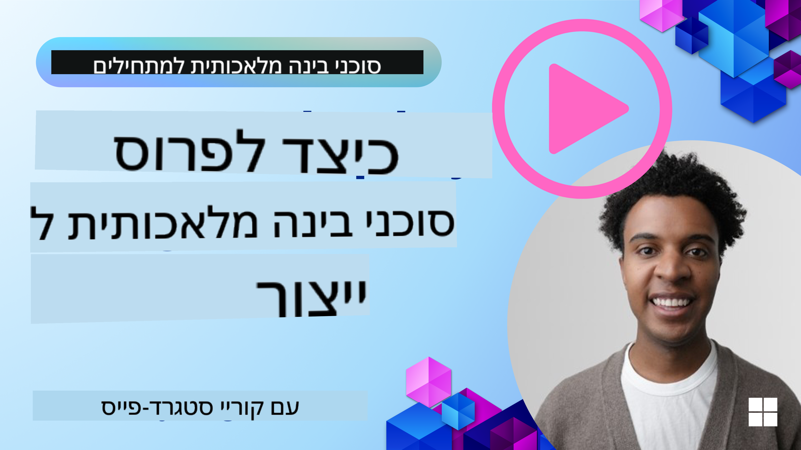

<!--
CO_OP_TRANSLATOR_METADATA:
{
  "original_hash": "cdfd0acc8592c1af14f8637833450375",
  "translation_date": "2025-08-29T17:36:14+00:00",
  "source_file": "10-ai-agents-production/README.md",
  "language_code": "he"
}
-->
# סוכני AI בסביבת ייצור: תצפיתיות והערכה

[](https://youtu.be/l4TP6IyJxmQ?si=reGOyeqjxFevyDq9)

כאשר סוכני AI עוברים מפרוטוטיפים ניסיוניים ליישומים בעולם האמיתי, היכולת להבין את התנהגותם, לעקוב אחר ביצועיהם ולהעריך את תוצאותיהם באופן שיטתי הופכת לחשובה.

## מטרות למידה

לאחר השלמת השיעור, תדעו כיצד/תבינו:
- מושגים מרכזיים בתצפיתיות והערכה של סוכנים
- טכניקות לשיפור ביצועים, עלויות ויעילות של סוכנים
- מה ואיך להעריך את סוכני ה-AI שלכם באופן שיטתי
- כיצד לשלוט בעלויות בעת פריסת סוכני AI בסביבת ייצור
- כיצד להוסיף כלי תצפית לסוכנים שנבנו עם AutoGen

המטרה היא לצייד אתכם בידע שיאפשר להפוך את הסוכנים שלכם מ"קופסה שחורה" למערכות שקופות, ניתנות לניהול ואמינות.

_**הערה:** חשוב לפרוס סוכני AI בטוחים ואמינים. עיינו בשיעור [בניית סוכני AI אמינים](./06-building-trustworthy-agents/README.md) למידע נוסף._

## עקבות ומקטעים

כלי תצפיתיות כמו [Langfuse](https://langfuse.com/) או [Azure AI Foundry](https://learn.microsoft.com/en-us/azure/ai-foundry/what-is-azure-ai-foundry) בדרך כלל מייצגים את הרצת הסוכנים כעקבות ומקטעים.

- **עקבה** מייצגת משימה שלמה של סוכן מתחילתה ועד סופה (כמו טיפול בשאילתת משתמש).
- **מקטעים** הם שלבים בודדים בתוך העקבה (כמו קריאה למודל שפה או שליפת נתונים).


ללא תצפיתיות, סוכן AI יכול להרגיש כמו "קופסה שחורה" - מצבו הפנימי וההיגיון שלו אינם ברורים, מה שמקשה על אבחון בעיות או אופטימיזציה של ביצועים. עם תצפיתיות, הסוכנים הופכים ל"קופסאות זכוכית", ומספקים שקיפות חיונית לבניית אמון ולהבטחת פעולה תקינה.

## מדוע תצפיתיות חשובה בסביבות ייצור

מעבר סוכני AI לסביבות ייצור מציב אתגרים ודרישות חדשות. תצפיתיות כבר אינה "נחמד שיהיה" אלא יכולת קריטית:

*   **איתור באגים וניתוח שורש הבעיה**: כאשר סוכן נכשל או מספק תוצאה בלתי צפויה, כלי תצפיתיות מספקים את העקבות הדרושות לזיהוי מקור השגיאה. זה חשוב במיוחד בסוכנים מורכבים שעשויים לכלול קריאות רבות ל-LLM, אינטראקציות עם כלים ולוגיקה מותנית.
*   **ניהול זמן תגובה ועלויות**: סוכני AI לעיתים קרובות מסתמכים על LLMs ו-APIs חיצוניים המחויבים לפי טוקן או קריאה. תצפיתיות מאפשרת מעקב מדויק אחר קריאות אלו, ועוזרת לזהות פעולות איטיות או יקרות מדי. זה מאפשר לצוותים לייעל הנחיות, לבחור מודלים יעילים יותר או לעצב מחדש תהליכים לניהול עלויות תפעול ולהבטחת חוויית משתמש טובה.
*   **אמון, בטיחות וציות**: בהרבה יישומים, חשוב להבטיח שהסוכנים מתנהגים בצורה בטוחה ואתית. תצפיתיות מספקת תיעוד של פעולות והחלטות הסוכן. ניתן להשתמש בזה לזיהוי וטיפול בבעיות כמו הזרקת הנחיות, יצירת תוכן מזיק או טיפול שגוי במידע אישי (PII). לדוגמה, ניתן לבדוק עקבות כדי להבין מדוע סוכן סיפק תגובה מסוימת או השתמש בכלי מסוים.
*   **מעגלי שיפור מתמשכים**: נתוני תצפיתיות הם הבסיס לתהליך פיתוח איטרטיבי. על ידי מעקב אחר ביצועי הסוכנים בעולם האמיתי, צוותים יכולים לזהות תחומים לשיפור, לאסוף נתונים לכיול מודלים ולאמת את השפעת השינויים. זה יוצר מעגל משוב שבו תובנות ייצור מהערכה מקוונת מנחות ניסויים ושיפורים לא מקוונים, מה שמוביל לביצועים טובים יותר של הסוכן.

## מדדים מרכזיים למעקב

כדי לעקוב ולהבין את התנהגות הסוכן, יש לעקוב אחר מגוון מדדים ואותות. למרות שהמדדים הספציפיים עשויים להשתנות בהתאם למטרת הסוכן, ישנם כמה מדדים חשובים באופן אוניברסלי.

להלן כמה מהמדדים הנפוצים שכלי תצפיתיות עוקבים אחריהם:

**זמן תגובה:** כמה מהר הסוכן מגיב? זמני המתנה ארוכים משפיעים לרעה על חוויית המשתמש. יש למדוד את זמן התגובה עבור משימות ושלבים בודדים על ידי מעקב אחר הרצת הסוכן. לדוגמה, סוכן שלוקח 20 שניות לכל קריאות המודל יכול להיות מואץ על ידי שימוש במודל מהיר יותר או על ידי הרצת קריאות המודל במקביל.

**עלויות:** מהי העלות לכל הרצת סוכן? סוכני AI מסתמכים על קריאות LLM המחויבות לפי טוקן או APIs חיצוניים. שימוש תכוף בכלים או הנחיות מרובות יכול להגדיל במהירות את העלויות. לדוגמה, אם סוכן קורא ל-LLM חמש פעמים לשיפור איכות שולי, יש להעריך אם העלות מוצדקת או אם ניתן להפחית את מספר הקריאות או להשתמש במודל זול יותר. מעקב בזמן אמת יכול גם לעזור לזהות עליות בלתי צפויות (למשל, באגים שגורמים ללולאות API מיותרות).

**שגיאות בקשות:** כמה בקשות נכשלו? זה יכול לכלול שגיאות API או קריאות כלים שנכשלו. כדי להפוך את הסוכן לעמיד יותר נגד אלו בסביבת ייצור, ניתן להגדיר מנגנוני גיבוי או ניסיונות חוזרים. לדוגמה, אם ספק LLM A אינו זמין, ניתן לעבור לספק LLM B כגיבוי.

**משוב משתמשים:** הערכות ישירות של משתמשים מספקות תובנות חשובות. זה יכול לכלול דירוגים מפורשים (👍אצבע למעלה/👎למטה, ⭐1-5 כוכבים) או הערות טקסטואליות. משוב שלילי עקבי צריך להתריע על כך שהסוכן אינו פועל כמצופה.

**משוב משתמשים עקיף:** התנהגויות משתמש מספקות משוב עקיף גם ללא דירוגים מפורשים. זה יכול לכלול ניסוח מחדש של שאלות מידי, שאילתות חוזרות או לחיצה על כפתור ניסיון חוזר. לדוגמה, אם רואים שמשתמשים שואלים שוב ושוב את אותה שאלה, זהו סימן לכך שהסוכן אינו פועל כמצופה.

**דיוק:** באיזו תדירות הסוכן מספק תוצאות נכונות או רצויות? הגדרות דיוק משתנות (למשל, נכונות פתרון בעיות, דיוק שליפת מידע, שביעות רצון משתמשים). הצעד הראשון הוא להגדיר מהו הצלחה עבור הסוכן. ניתן לעקוב אחר דיוק באמצעות בדיקות אוטומטיות, ציוני הערכה או תוויות השלמת משימות. לדוגמה, סימון עקבות כ"הצליח" או "נכשל".

**מדדי הערכה אוטומטיים:** ניתן גם להגדיר הערכות אוטומטיות. לדוגמה, ניתן להשתמש ב-LLM כדי לדרג את תוצאות הסוכן, למשל אם הן מועילות, מדויקות או לא. יש גם כמה ספריות קוד פתוח שעוזרות לדרג היבטים שונים של הסוכן. לדוגמה, [RAGAS](https://docs.ragas.io/) עבור סוכני RAG או [LLM Guard](https://llm-guard.com/) לזיהוי שפה מזיקה או הזרקת הנחיות.

בפועל, שילוב של מדדים אלו מספק את הכיסוי הטוב ביותר לבריאות סוכן AI. במחברת [הדוגמה בפרק זה](./code_samples/10_autogen_evaluation.ipynb), נראה כיצד מדדים אלו נראים בדוגמאות אמיתיות, אך קודם נלמד כיצד נראה תהליך הערכה טיפוסי.

## הוספת כלי תצפית לסוכן

כדי לאסוף נתוני עקבות, יש להוסיף כלי תצפית לקוד. המטרה היא להוסיף כלי תצפית לקוד הסוכן כדי להפיק עקבות ומדדים שניתן ללכוד, לעבד ולהציג בפלטפורמת תצפיתיות.

**OpenTelemetry (OTel):** [OpenTelemetry](https://opentelemetry.io/) הפך לסטנדרט בתעשייה לתצפיתיות של LLM. הוא מספק סט APIs, SDKs וכלים ליצירה, איסוף וייצוא של נתוני טלמטריה.

ישנן ספריות כלי תצפית רבות שעוטפות מסגרות סוכנים קיימות ומקלות על ייצוא מקטעי OpenTelemetry לכלי תצפיתיות. להלן דוגמה להוספת כלי תצפית לסוכן AutoGen עם ספריית [OpenLit](https://github.com/openlit/openlit):

```python
import openlit

openlit.init(tracer = langfuse._otel_tracer, disable_batch = True)
```

המחברת [בדוגמה בפרק זה](./code_samples/10_autogen_evaluation.ipynb) תדגים כיצד להוסיף כלי תצפית לסוכן AutoGen שלכם.

**יצירת מקטעים ידנית:** בעוד שספריות כלי תצפית מספקות בסיס טוב, ישנם מקרים שבהם נדרש מידע מפורט או מותאם אישית. ניתן ליצור מקטעים ידנית כדי להוסיף לוגיקה יישומית מותאמת אישית. חשוב יותר, ניתן להעשיר מקטעים שנוצרו אוטומטית או ידנית עם תכונות מותאמות אישית (המכונות גם תגיות או מטא-נתונים). תכונות אלו יכולות לכלול נתונים עסקיים, חישובים ביניים או כל הקשר שעשוי להיות שימושי לאיתור באגים או ניתוח, כמו `user_id`, `session_id`, או `model_version`.

דוגמה ליצירת עקבות ומקטעים ידנית עם [Langfuse Python SDK](https://langfuse.com/docs/sdk/python/sdk-v3):

```python
from langfuse import get_client
 
langfuse = get_client()
 
span = langfuse.start_span(name="my-span")
 
span.end()
```

## הערכת סוכן

תצפיתיות מספקת לנו מדדים, אך הערכה היא תהליך ניתוח הנתונים (וביצוע בדיקות) כדי לקבוע עד כמה סוכן AI מתפקד וכיצד ניתן לשפר אותו. במילים אחרות, לאחר שיש לכם את העקבות והמדדים, כיצד משתמשים בהם כדי לשפוט את הסוכן ולקבל החלטות?

הערכה שוטפת חשובה מכיוון שסוכני AI לעיתים קרובות אינם דטרמיניסטיים ויכולים להשתנות (דרך עדכונים או שינוי התנהגות מודל) – ללא הערכה, לא תדעו אם "הסוכן החכם" שלכם באמת עושה את עבודתו היטב או אם הוא נסוג.

ישנן שתי קטגוריות של הערכות עבור סוכני AI: **הערכה לא מקוונת** ו**הערכה מקוונת**. שתיהן חשובות ומשלימות זו את זו. בדרך כלל מתחילים בהערכה לא מקוונת, שכן זהו הצעד המינימלי הנדרש לפני פריסת כל סוכן.

### הערכה לא מקוונת


הערכה זו כוללת בדיקת הסוכן בסביבה מבוקרת, בדרך כלל באמצעות מערכי נתונים לבדיקה, ולא שאילתות משתמשים חיות. משתמשים במערכי נתונים מובנים שבהם ידוע מהי התוצאה הצפויה או ההתנהגות הנכונה, ואז מריצים את הסוכן עליהם.

לדוגמה, אם בניתם סוכן לבעיות מילוליות במתמטיקה, ייתכן שיש לכם [מערך נתונים לבדיקה](https://huggingface.co/datasets/gsm8k) של 100 בעיות עם תשובות ידועות. הערכה לא מקוונת נעשית לעיתים קרובות במהלך הפיתוח (ויכולה להיות חלק מצינורות CI/CD) כדי לבדוק שיפורים או להגן מפני נסיגות. היתרון הוא שזו **חוזרת על עצמה וניתן לקבל מדדי דיוק ברורים מכיוון שיש לכם אמת מידה**. ניתן גם לדמות שאילתות משתמשים ולמדוד את תגובות הסוכן מול תשובות אידיאליות או להשתמש במדדים אוטומטיים כפי שתואר לעיל.

האתגר המרכזי בהערכה לא מקוונת הוא להבטיח שמערך הנתונים לבדיקה יהיה מקיף וישאר רלוונטי – הסוכן עשוי לתפקד היטב על מערך בדיקה קבוע אך להיתקל בשאילתות שונות מאוד בסביבת ייצור. לכן, יש לעדכן מערכי בדיקה עם מקרים חדשים ודוגמאות שמשקפות תרחישים בעולם האמיתי​. שילוב של מקרים קטנים "בדיקות עשן" ומערכי בדיקה גדולים יותר הוא שימושי: מערכים קטנים לבדיקות מהירות ומערכים גדולים יותר למדדי ביצועים רחבים​.

### הערכה מקוונת


הערכה זו מתייחסת לבדיקת הסוכן בסביבה חיה, בעולם האמיתי, כלומר במהלך שימוש בפועל בסביבת ייצור. הערכה מקוונת כוללת מעקב אחר ביצועי הסוכן באינטראקציות משתמשים אמיתיות וניתוח תוצאות באופן שוטף.

לדוגמה, ניתן לעקוב אחר שיעורי הצלחה, ציוני שביעות רצון משתמשים או מדדים אחרים בתנועה חיה. היתרון של הערכה מקוונת הוא שהיא **לוכדת דברים שאולי לא צפיתם בסביבה מבוקרת** – ניתן לצפות בשינוי מודל לאורך זמן (אם יעילות הסוכן מתדרדרת כאשר דפוסי הקלט משתנים) ולתפוס שאילתות או מצבים בלתי צפויים שלא היו במערך הבדיקה​. היא מספקת תמונה אמיתית של איך הסוכן מתנהג בשטח.

הערכה מקוונת כוללת לעיתים קרובות איסוף משוב משתמשים עקיף ומפורש, כפי שנדון, ואולי גם הרצת בדיקות צללים או בדיקות A/B (שבהן גרסה חדשה של הסוכן פועלת במקביל להשוואה מול הישנה). האתגר הוא שקשה לעיתים לקבל תוויות או ציונים אמינים לאינטראקציות חיות – ייתכן שתסתמכו על משוב משתמשים או מדדים במורד הזרם (כמו האם המשתמש לחץ על התוצאה).

### שילוב בין השניים

הערכות מקוונות ולא מקוונות אינן סותרות זו את זו; הן משלימות מאוד. תובנות ממעקב מקוון (למשל, סוגים חדשים של שאילתות משתמשים שבהן הסוכן מתפקד בצורה גרועה) יכולות לשמש להרחבה ושיפור מערכי בדיקה לא מקוונים. לעומת זאת, סוכנים שמבצעים היטב בדיקות לא מקוונות יכולים להיות פרוסים בביטחון רב יותר ומנוטרים באופן מקוון.

למעשה, צוותים רבים מאמצים לולאה:

_הערכה לא מקוונת -> פריסה -> מעקב מקוון -> איסוף מקרים חדשים של כשל -> הוספה למערך בדיקה לא מקוון -> שיפור הסוכן -> חזרה_.

## בעיות נפוצות

כאשר אתם פורסים סוכני AI בסביבת ייצור, ייתכן שתיתקלו באתגרים שונים. להלן כמה בעיות נפוצות ופתרונות אפשריים:

| **בעיה**    | **פתרון אפשרי**   |
| ------------- | ------------------ |
| סוכן AI אינו מבצע משימות באופן עקבי | - לחדד את ההנחיה שניתנת לסוכן ה-AI; להיות ברורים לגבי המטרות.<br>- לזהות היכן חלוקת המשימות לתת-משימות וטיפול בהן על ידי סוכנים מרובים יכולה לעזור. |
| סוכן AI נכנס ללולאות מתמשכות  | - לוודא שיש תנאי סיום ברורים כך שהסוכן יודע מתי להפסיק את התהליך. |
<br>
## מבוא

במדריך זה, נחקור כיצד לנהל ולשפר את ביצועי סוכני AI בסביבת ייצור. נסקור בעיות נפוצות, אסטרטגיות לפתרון, ונלמד כיצד לנהל עלויות בצורה יעילה.

## בעיות נפוצות בסוכני AI

### בעיות ביצועים

| בעיה | פתרון |
|------|-------|
| סוכן AI לא מצליח לפתור משימות מורכבות | - השתמשו במודל גדול יותר שמתמחה במשימות הדורשות חשיבה מורכבת. |
| קריאות לכלי סוכן AI אינן מבוצעות היטב | - בדקו ואמתו את תוצאות הכלי מחוץ למערכת הסוכן.<br>- שפרו את הפרמטרים, ההנחיות ושמות הכלים שהוגדרו. |
| מערכת רב-סוכנים אינה מתפקדת באופן עקבי | - שפרו את ההנחיות שניתנות לכל סוכן כדי לוודא שהן ספציפיות ונבדלות זו מזו.<br>- בנו מערכת היררכית עם סוכן "ניתוב" או סוכן בקרה שיקבע איזה סוכן מתאים למשימה. |

רבות מהבעיות הללו ניתן לזהות בצורה יעילה יותר כאשר יש מערכת תצפית במקום. המעקב והמדדים שדנו בהם קודם עוזרים לזהות בדיוק היכן מתרחשות הבעיות בתהליך העבודה של הסוכן, מה שהופך את תהליך הדיבוג והאופטימיזציה ליעיל יותר.

## ניהול עלויות

להלן כמה אסטרטגיות לניהול עלויות של פריסת סוכני AI בסביבת ייצור:

**שימוש במודלים קטנים יותר:** מודלים שפתיים קטנים (SLMs) יכולים לתפקד היטב במקרים שימושיים מסוימים של סוכנים ולהפחית עלויות באופן משמעותי. כפי שצוין קודם, בניית מערכת הערכה שתשווה ביצועים מול מודלים גדולים יותר היא הדרך הטובה ביותר להבין עד כמה SLM מתאים למקרה השימוש שלכם. שקלו להשתמש ב-SLM למשימות פשוטות כמו סיווג כוונות או חילוץ פרמטרים, תוך שמירת המודלים הגדולים למשימות מורכבות יותר.

**שימוש במודל ניתוב:** אסטרטגיה דומה היא להשתמש במגוון מודלים וגדלים. ניתן להשתמש ב-LLM/SLM או בפונקציה ללא שרת כדי לנתב בקשות לפי רמת המורכבות למודלים המתאימים ביותר. זה יעזור להפחית עלויות תוך שמירה על ביצועים במשימות הנכונות. לדוגמה, ניתוב שאילתות פשוטות למודלים קטנים ומהירים, ושימוש במודלים גדולים ויקרים רק למשימות חשיבה מורכבות.

**שמירת תגובות במטמון:** זיהוי בקשות ומשימות נפוצות ומתן תגובות מראש לפני שהן עוברות דרך מערכת הסוכן היא דרך טובה להפחית את נפח הבקשות הדומות. ניתן אפילו ליישם תהליך לזיהוי עד כמה בקשה דומה לבקשות שמורות במטמון באמצעות מודלים AI בסיסיים יותר. אסטרטגיה זו יכולה להפחית עלויות באופן משמעותי עבור שאלות נפוצות או תהליכים חוזרים.

## בואו נראה איך זה עובד בפועל

ב-[מחברת הדוגמה של חלק זה](./code_samples/10_autogen_evaluation.ipynb), נראה דוגמאות כיצד ניתן להשתמש בכלי תצפית כדי לנטר ולהעריך את הסוכן.

### יש לכם עוד שאלות על סוכני AI בסביבת ייצור?

הצטרפו ל-[Discord של Azure AI Foundry](https://aka.ms/ai-agents/discord) כדי לפגוש לומדים נוספים, להשתתף בשעות קבלה ולקבל תשובות לשאלות שלכם על סוכני AI.

## שיעור קודם

[תבנית עיצוב מטה-קוגניציה](../09-metacognition/README.md)

## שיעור הבא

[פרוטוקולים סוכניים](../11-agentic-protocols/README.md)

---

**כתב ויתור**:  
מסמך זה תורגם באמצעות שירות תרגום מבוסס בינה מלאכותית [Co-op Translator](https://github.com/Azure/co-op-translator). למרות שאנו שואפים לדיוק, יש לקחת בחשבון שתרגומים אוטומטיים עשויים להכיל שגיאות או אי דיוקים. המסמך המקורי בשפתו המקורית צריך להיחשב כמקור סמכותי. עבור מידע קריטי, מומלץ להשתמש בתרגום מקצועי על ידי אדם. איננו נושאים באחריות לאי הבנות או לפרשנויות שגויות הנובעות משימוש בתרגום זה.