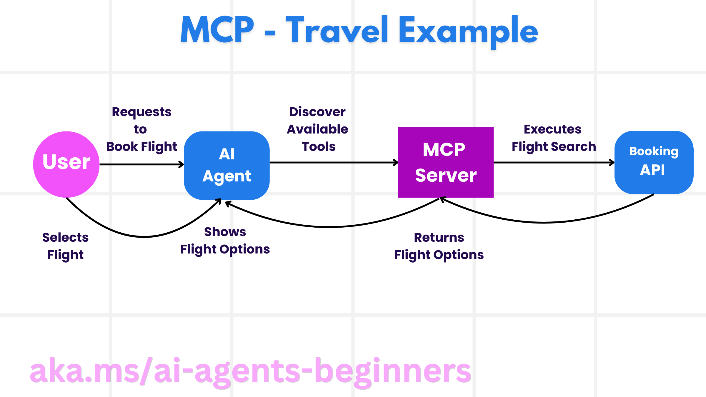

<!--
CO_OP_TRANSLATOR_METADATA:
{
  "original_hash": "5c05bcdfb163dfa2493db39dfb45ad9a",
  "translation_date": "2025-09-04T08:46:26+00:00",
  "source_file": "11-agentic-protocols/README.md",
  "language_code": "he"
}
-->
# שימוש בפרוטוקולים סוכניים (MCP, A2A ו-NLWeb)

עם התרחבות השימוש בסוכני AI, עולה הצורך בפרוטוקולים שמבטיחים סטנדרטיזציה, אבטחה ותמיכה בחדשנות פתוחה. בשיעור זה נסקור שלושה פרוטוקולים שמטרתם לענות על צורך זה - Model Context Protocol (MCP), Agent to Agent (A2A) ו-Natural Language Web (NLWeb).

## מבוא

בשיעור זה נלמד:

• כיצד **MCP** מאפשר לסוכני AI לגשת לכלים ולנתונים חיצוניים כדי להשלים משימות משתמש.

• כיצד **A2A** מאפשר תקשורת ושיתוף פעולה בין סוכני AI שונים.

• כיצד **NLWeb** מביא ממשקי שפה טבעית לכל אתר, ומאפשר לסוכני AI לגלות ולתקשר עם התוכן.

## מטרות למידה

• **לזהות** את המטרה המרכזית והיתרונות של MCP, A2A ו-NLWeb בהקשר של סוכני AI.

• **להסביר** כיצד כל פרוטוקול מקל על תקשורת ואינטראקציה בין LLMs, כלים וסוכנים אחרים.

• **להכיר** את התפקידים הייחודיים שכל פרוטוקול ממלא בבניית מערכות סוכניות מורכבות.

## פרוטוקול הקשר מודל (MCP)

**Model Context Protocol (MCP)** הוא תקן פתוח שמספק דרך סטנדרטית ליישומים להציע הקשר וכלים ל-LLMs. זה מאפשר "מתאם אוניברסלי" למקורות נתונים וכלים שונים שסוכני AI יכולים להתחבר אליהם בצורה עקבית.

בואו נבחן את רכיבי MCP, היתרונות בהשוואה לשימוש ישיר ב-API, ודוגמה כיצד סוכני AI עשויים להשתמש בשרת MCP.

### רכיבי הליבה של MCP

MCP פועל על ארכיטקטורת **לקוח-שרת**, והרכיבים המרכזיים הם:

• **Hosts** הם יישומי LLM (לדוגמה, עורך קוד כמו VSCode) שמתחילים את החיבורים לשרת MCP.

• **Clients** הם רכיבים בתוך יישום ה-host שמתחזקים חיבורים אחד-על-אחד עם שרתים.

• **Servers** הם תוכנות קלות משקל שמציעות יכולות ספציפיות.

הפרוטוקול כולל שלושה פרימיטיבים מרכזיים שהם יכולות של שרת MCP:

• **Tools**: פעולות או פונקציות נפרדות שסוכן AI יכול לקרוא כדי לבצע פעולה. לדוגמה, שירות מזג אוויר עשוי להציע כלי "קבל מזג אוויר", או ששרת מסחר אלקטרוני עשוי להציע כלי "רכוש מוצר". שרתי MCP מפרסמים את שם הכלי, תיאורו וסכמת הקלט/פלט ברשימת היכולות שלהם.

• **Resources**: פריטי נתונים או מסמכים לקריאה בלבד ששרת MCP יכול לספק, ולקוחות יכולים לשלוף אותם לפי דרישה. דוגמאות כוללות תוכן קבצים, רשומות מסד נתונים או קבצי לוג. משאבים יכולים להיות טקסט (כמו קוד או JSON) או בינאריים (כמו תמונות או PDFs).

• **Prompts**: תבניות מוגדרות מראש שמספקות הצעות להנחיות, ומאפשרות זרימות עבודה מורכבות יותר.

### יתרונות MCP

MCP מציע יתרונות משמעותיים לסוכני AI:

• **גילוי כלים דינמי**: סוכנים יכולים לקבל באופן דינמי רשימה של כלים זמינים משרת יחד עם תיאורים של מה הם עושים. זה שונה מ-APIs מסורתיים, שדורשים לעיתים קרובות קידוד סטטי לאינטגרציות, כלומר כל שינוי ב-API מחייב עדכוני קוד. MCP מציע גישה של "אינטגרציה אחת", שמובילה להתאמה רבה יותר.

• **אינטרופרביליות בין LLMs**: MCP פועל בין LLMs שונים, ומספק גמישות להחלפת מודלים מרכזיים כדי להעריך ביצועים טובים יותר.

• **אבטחה סטנדרטית**: MCP כולל שיטת אימות סטנדרטית, שמשפרת את הסקלביליות בעת הוספת גישה לשרתים נוספים של MCP. זה פשוט יותר מניהול מפתחות וסוגי אימות שונים עבור APIs מסורתיים.

### דוגמת MCP

דמיינו שמשתמש רוצה להזמין טיסה באמצעות עוזר AI שמופעל על ידי MCP.

1. **חיבור**: עוזר ה-AI (לקוח MCP) מתחבר לשרת MCP שמסופק על ידי חברת תעופה.

2. **גילוי כלים**: הלקוח שואל את שרת MCP של חברת התעופה, "אילו כלים זמינים לך?" השרת משיב עם כלים כמו "חפש טיסות" ו"הזמן טיסות".

3. **הפעלת כלי**: המשתמש מבקש מהעוזר, "אנא חפש טיסה מפורטלנד להונולולו." עוזר ה-AI, באמצעות ה-LLM שלו, מזהה שהוא צריך לקרוא לכלי "חפש טיסות" ומעביר את הפרמטרים הרלוונטיים (מוצא, יעד) לשרת MCP.

4. **ביצוע ותגובה**: שרת MCP, שפועל כעטיפה, מבצע את הקריאה בפועל ל-API הפנימי של חברת התעופה. הוא מקבל את פרטי הטיסה (למשל, נתוני JSON) ושולח אותם בחזרה לעוזר ה-AI.

5. **אינטראקציה נוספת**: עוזר ה-AI מציג את אפשרויות הטיסה. לאחר שהמשתמש בוחר טיסה, העוזר עשוי להפעיל את כלי "הזמן טיסה" באותו שרת MCP, ומשלים את ההזמנה.

## פרוטוקול סוכן-לסוכן (A2A)

בעוד MCP מתמקד בחיבור LLMs לכלים, **Agent-to-Agent (A2A) protocol** לוקח את זה צעד קדימה על ידי אפשרות לתקשורת ושיתוף פעולה בין סוכני AI שונים. A2A מחבר סוכני AI בין ארגונים, סביבות וערימות טכנולוגיות שונות כדי להשלים משימה משותפת.

נבחן את רכיבי A2A והיתרונות שלו, יחד עם דוגמה כיצד ניתן ליישם אותו באפליקציית הנסיעות שלנו.

### רכיבי הליבה של A2A

A2A מתמקד באפשרות לתקשורת בין סוכנים ובכך שהם יעבדו יחד כדי להשלים תת-משימה של המשתמש. כל רכיב בפרוטוקול תורם לכך:

#### כרטיס סוכן

בדומה לאופן שבו שרת MCP משתף רשימת כלים, כרטיס סוכן כולל:
- שם הסוכן.
- **תיאור המשימות הכלליות** שהוא משלים.
- **רשימת מיומנויות ספציפיות** עם תיאורים כדי לעזור לסוכנים אחרים (או אפילו משתמשים אנושיים) להבין מתי ולמה הם ירצו לקרוא לסוכן זה.
- **כתובת ה-URL הנוכחית של נקודת הקצה** של הסוכן.
- **גרסה** ו**יכולות** של הסוכן כמו תגובות סטרימינג והתראות דחיפה.

#### מבצע סוכן

מבצע הסוכן אחראי על **העברת הקשר השיחה של המשתמש לסוכן מרוחק**, הסוכן המרוחק זקוק לכך כדי להבין את המשימה שיש להשלים. בשרת A2A, סוכן משתמש ב-LLM שלו כדי לנתח בקשות נכנסות ולבצע משימות באמצעות הכלים הפנימיים שלו.

#### ארטיפקט

לאחר שסוכן מרוחק השלים את המשימה המבוקשת, תוצר העבודה שלו נוצר כארטיפקט. ארטיפקט **מכיל את תוצאת העבודה של הסוכן**, **תיאור של מה הושלם**, ו**הקשר טקסט** שנשלח דרך הפרוטוקול. לאחר שליחת הארטיפקט, החיבור עם הסוכן המרוחק נסגר עד שיהיה צורך בו שוב.

#### תור אירועים

רכיב זה משמש ל**ניהול עדכונים והעברת הודעות**. הוא חשוב במיוחד בסביבות ייצור למערכות סוכניות כדי למנוע סגירת החיבור בין סוכנים לפני שמשימה הושלמה, במיוחד כאשר זמני השלמת משימות עשויים להיות ארוכים יותר.

### יתרונות A2A

• **שיתוף פעולה משופר**: מאפשר לסוכנים מספקים ופלטפורמות שונות לתקשר, לשתף הקשר ולעבוד יחד, ומקל על אוטומציה חלקה בין מערכות שבדרך כלל אינן מחוברות.

• **גמישות בבחירת מודלים**: כל סוכן A2A יכול להחליט איזה LLM הוא משתמש כדי לשרת את בקשותיו, ומאפשר מודלים מותאמים או משופרים לכל סוכן, בניגוד לחיבור LLM יחיד בכמה תרחישי MCP.

• **אימות מובנה**: אימות משולב ישירות בפרוטוקול A2A, ומספק מסגרת אבטחה חזקה לאינטראקציות בין סוכנים.

### דוגמת A2A

בואו נרחיב את תרחיש הזמנת הנסיעות שלנו, אך הפעם באמצעות A2A.

1. **בקשת משתמש לסוכן רב-משימתי**: משתמש מתקשר עם סוכן "נסיעות" A2A, אולי באומרו, "אנא הזמן לי טיול שלם להונולולו לשבוע הבא, כולל טיסות, מלון ורכב שכור".

2. **תזמור על ידי סוכן נסיעות**: סוכן הנסיעות מקבל את הבקשה המורכבת. הוא משתמש ב-LLM שלו כדי להבין את המשימה ולקבוע שהוא צריך לתקשר עם סוכנים מתמחים אחרים.

3. **תקשורת בין סוכנים**: סוכן הנסיעות משתמש בפרוטוקול A2A כדי להתחבר לסוכנים מתמחים, כמו "סוכן חברת תעופה", "סוכן מלון" ו"סוכן השכרת רכב" שנוצרו על ידי חברות שונות.

4. **ביצוע משימות מואצלות**: סוכן הנסיעות שולח משימות ספציפיות לסוכנים המתמחים (למשל, "מצא טיסות להונולולו", "הזמן מלון", "השכר רכב"). כל אחד מהסוכנים המתמחים, שמפעילים את ה-LLM שלהם ומשתמשים בכלים שלהם (שיכולים להיות שרתי MCP בעצמם), מבצע את חלקו הספציפי בהזמנה.

5. **תגובה מאוחדת**: לאחר שכל הסוכנים המתמחים משלימים את משימותיהם, סוכן הנסיעות מאגד את התוצאות (פרטי טיסה, אישור מלון, הזמנת רכב שכור) ושולח תגובה מקיפה בסגנון שיחה חזרה למשתמש.

## Natural Language Web (NLWeb)

אתרים היו במשך זמן רב הדרך המרכזית שבה משתמשים ניגשים למידע ולנתונים ברחבי האינטרנט.

בואו נבחן את הרכיבים השונים של NLWeb, היתרונות של NLWeb ודוגמה כיצד NLWeb עובד באמצעות אפליקציית הנסיעות שלנו.

### רכיבי NLWeb

- **אפליקציית NLWeb (קוד שירות ליבה)**: המערכת שמעבדת שאלות בשפה טבעית. היא מחברת את החלקים השונים של הפלטפורמה כדי ליצור תגובות. ניתן לחשוב עליה כ**מנוע שמפעיל את תכונות השפה הטבעית** של אתר.

- **פרוטוקול NLWeb**: זהו **סט בסיסי של כללים לאינטראקציה בשפה טבעית** עם אתר. הוא שולח תגובות בפורמט JSON (לעיתים באמצעות Schema.org). מטרתו ליצור בסיס פשוט ל"AI Web", בדומה לאופן שבו HTML הפך את שיתוף המסמכים באינטרנט לאפשרי.

- **שרת MCP (נקודת קצה של Model Context Protocol)**: כל הגדרת NLWeb פועלת גם כ**שרת MCP**. משמעות הדבר היא שהיא יכולה **לשתף כלים (כמו שיטת "שאל") ונתונים** עם מערכות AI אחרות. בפועל, זה הופך את התוכן והיכולות של האתר לשימושיים על ידי סוכני AI, ומאפשר לאתר להפוך לחלק מ"אקוסיסטם הסוכנים" הרחב יותר.

- **מודלי הטמעה**: מודלים אלה משמשים ל**המרת תוכן האתר לייצוגים מספריים הנקראים וקטורים** (הטמעות). וקטורים אלה לוכדים משמעות בצורה שהמחשב יכול להשוות ולחפש. הם נשמרים במסד נתונים מיוחד, ומשתמשים יכולים לבחור איזה מודל הטמעה הם רוצים להשתמש.

- **מסד נתונים וקטורי (מנגנון אחזור)**: מסד נתונים זה **שומר את ההטמעות של תוכן האתר**. כאשר מישהו שואל שאלה, NLWeb בודק את מסד הנתונים הווקטורי כדי למצוא במהירות את המידע הרלוונטי ביותר. הוא מספק רשימה מהירה של תשובות אפשריות, מדורגות לפי דמיון. NLWeb עובד עם מערכות אחסון וקטוריות שונות כמו Qdrant, Snowflake, Milvus, Azure AI Search ו-Elasticsearch.

### דוגמת NLWeb

שקלו את אתר הזמנת הנסיעות שלנו שוב, אך הפעם הוא מופעל על ידי NLWeb.

1. **קליטת נתונים**: קטלוגי המוצרים הקיימים של אתר הנסיעות (למשל, רשימות טיסות, תיאורי מלונות, חבילות טיולים) מעוצבים באמצעות Schema.org או נטענים דרך RSS. הכלים של NLWeb קולטים את הנתונים המובנים הללו, יוצרים הטמעות ושומרים אותם במסד נתונים וקטורי מקומי או מרוחק.

2. **שאילתה בשפה טבעית (אנושית)**: משתמש מבקר באתר ובמקום לנווט בתפריטים, מקליד בממשק שיחה: "מצא לי מלון ידידותי למשפחות בהונולולו עם בריכה לשבוע הבא".

3. **עיבוד NLWeb**: אפליקציית NLWeb מקבלת את השאילתה. היא שולחת את השאילתה ל-LLM להבנה ובמקביל מחפשת במסד הנתונים הווקטורי שלה רשימות מלונות רלוונטיות.

4. **תוצאות מדויקות**: ה-LLM עוזר לפרש את תוצאות החיפוש ממסד הנתונים, לזהות את ההתאמות הטובות ביותר על סמך קריטריונים של "ידידותי למשפחות", "בריכה" ו"הונולולו", ואז מעצב תגובה בשפה טבעית. חשוב לציין, התגובה מתייחסת למלונות בפועל מקטלוג האתר, ומונעת מידע מומצא.

5. **אינטראקציה עם סוכן AI**: מכיוון ש-NLWeb משמש כשרת MCP, סוכן נסיעות AI חיצוני יכול גם להתחבר למופע NLWeb של האתר הזה. סוכן ה-AI יכול להשתמש בשיטת `ask` של MCP כדי לשאול את האתר ישירות: `ask("האם יש מסעדות ידידותיות לטבעונים באזור הונולולו שמומלצות על ידי המלון?")`. מופע NLWeb יעבד זאת, תוך ניצול מסד הנתונים של מידע על מסעדות (אם נטען), ויחזיר תגובת JSON מובנית.

### יש לכם שאלות נוספות על MCP/A2A/NLWeb?

הצטרפו ל-[Azure AI Foundry Discord](https://aka.ms/ai-agents/discord) כדי לפגוש לומדים אחרים, להשתתף בשעות קבלה ולקבל תשובות לשאלות על סוכני AI.

## משאבים

- [MCP למתחילים](https://aka.ms/mcp-for-beginners)  
- [תיעוד MCP](https://github.com/microsoft/semantic-kernel/tree/main/python/semantic-kernel/semantic_kernel/connectors/mcp)
- [מאגר NLWeb](https://github.com/nlweb-ai/NLWeb)
- [מדריכי Semantic Kernel](https://learn.microsoft.com/semantic-kernel/)

---

**כתב ויתור**:  
מסמך זה תורגם באמצעות שירות תרגום מבוסס בינה מלאכותית [Co-op Translator](https://github.com/Azure/co-op-translator). בעוד שאנו שואפים לדיוק, יש לקחת בחשבון שתרגומים אוטומטיים עשויים להכיל שגיאות או אי-דיוקים. המסמך המקורי בשפתו המקורית נחשב למקור הסמכותי. למידע קריטי, מומלץ להשתמש בתרגום מקצועי על ידי בני אדם. איננו נושאים באחריות לכל אי-הבנה או פרשנות שגויה הנובעת משימוש בתרגום זה.