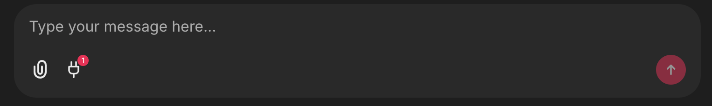

<!--
CO_OP_TRANSLATOR_METADATA:
{
  "original_hash": "9bf0395cbc541ce8db2a9699c8678dfc",
  "translation_date": "2025-08-29T18:33:33+00:00",
  "source_file": "11-agentic-protocols/code_samples/github-mcp/README.md",
  "language_code": "he"
}
-->
# דוגמה לשרת MCP של Github

## תיאור

זהו דמו שנוצר עבור האקתון סוכני AI שאורגן על ידי Microsoft Reactor.

הכלי משמש להמלצה על פרויקטים להאקתון בהתבסס על מאגרי Github של המשתמש. 
הפעולה מתבצעת באמצעות:

1. **סוכן Github** - שימוש בשרת Github MCP כדי לשלוף מאגרים ומידע עליהם.
2. **סוכן האקתון** - לוקח את הנתונים מהסוכן של Github ומציע רעיונות יצירתיים לפרויקטים להאקתון בהתבסס על הפרויקטים, השפות שבהן המשתמש השתמש ומסלולי הפרויקטים של האקתון סוכני AI.
3. **סוכן אירועים** - בהתבסס על ההצעות של סוכן האקתון, סוכן האירועים ימליץ על אירועים רלוונטיים מסדרת האקתון סוכני AI.

## הפעלת הקוד

### משתני סביבה

הדמו הזה משתמש ב-Azure Open AI Service, Semantic Kernel, שרת Github MCP ו-Azure AI Search.

וודאו שיש לכם את משתני הסביבה הנכונים כדי להשתמש בכלים הללו:

```python
AZURE_OPENAI_CHAT_DEPLOYMENT_NAME=""
AZURE_OPENAI_EMBEDDING_DEPLOYMENT_NAME=""
AZURE_OPENAI_ENDPOINT=""
AZURE_OPENAI_API_KEY=""
AZURE_OPENAI_API_VERSION=""
AZURE_SEARCH_SERVICE_ENDPOINT=""
AZURE_SEARCH_API_KEY=""
``` 

## הפעלת שרת Chainlit

כדי להתחבר לשרת MCP, הדמו הזה משתמש ב-Chainlit כממשק צ'אט.

כדי להפעיל את השרת, השתמשו בפקודה הבאה בטרמינל שלכם:

```bash
chainlit run app.py -w
```

הפקודה הזו תפעיל את שרת Chainlit ב-`localhost:8000` וגם תעדכן את אינדקס החיפוש של Azure AI עם התוכן של `event-descriptions.md`.

## התחברות לשרת MCP

כדי להתחבר לשרת Github MCP, לחצו על סמל "התקע" מתחת לתיבת הצ'אט "Type your message here..":



משם תוכלו ללחוץ על "Connect an MCP" כדי להוסיף את הפקודה להתחבר לשרת Github MCP:

```bash
npx -y @modelcontextprotocol/server-github --env GITHUB_PERSONAL_ACCESS_TOKEN=[YOUR PERSONAL ACCESS TOKEN]
```

החליפו את "[YOUR PERSONAL ACCESS TOKEN]" עם הטוקן האישי שלכם.

לאחר ההתחברות, אמור להופיע (1) ליד סמל התקע כדי לאשר שהחיבור הצליח. אם לא, נסו להפעיל מחדש את שרת Chainlit עם `chainlit run app.py -w`.

## שימוש בדמו

כדי להתחיל את תהליך העבודה של הסוכנים להמלצה על פרויקטים להאקתון, תוכלו להקליד הודעה כמו:

"Recommend hackathon projects for the Github user koreyspace"

סוכן הנתבים ינתח את הבקשה שלכם ויקבע איזו שילוב של סוכנים (Github, האקתון ואירועים) מתאים ביותר לטיפול בשאילתה שלכם. הסוכנים יעבדו יחד כדי לספק המלצות מקיפות בהתבסס על ניתוח מאגרי Github, יצירת רעיונות לפרויקטים ואירועים טכנולוגיים רלוונטיים.

---

**כתב ויתור**:  
מסמך זה תורגם באמצעות שירות תרגום מבוסס בינה מלאכותית [Co-op Translator](https://github.com/Azure/co-op-translator). בעוד שאנו שואפים לדיוק, יש להיות מודעים לכך שתרגומים אוטומטיים עשויים להכיל שגיאות או אי-דיוקים. המסמך המקורי בשפתו המקורית נחשב למקור הסמכותי. למידע קריטי, מומלץ להשתמש בתרגום מקצועי על ידי מתרגם אנושי. איננו נושאים באחריות לכל אי-הבנה או פרשנות שגויה הנובעת משימוש בתרגום זה.