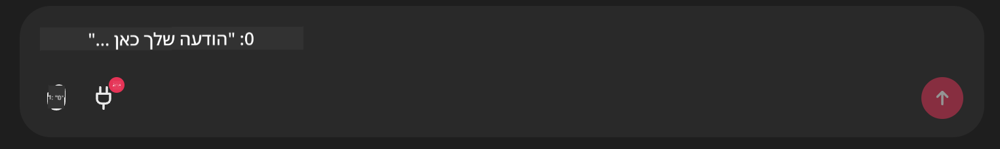

<!--
CO_OP_TRANSLATOR_METADATA:
{
  "original_hash": "9bf0395cbc541ce8db2a9699c8678dfc",
  "translation_date": "2025-07-12T14:23:26+00:00",
  "source_file": "11-mcp/code_samples/github-mcp/README.md",
  "language_code": "he"
}
-->
# דוגמת שרת Github MCP

## תיאור

זו הייתה הדגמה שנוצרה עבור האקתון סוכני ה-AI שהתקיים דרך Microsoft Reactor.

הכלי משמש להמלצה על פרויקטים להאקתון בהתבסס על מאגרי הקוד של המשתמש ב-Github.  
זה נעשה על ידי:

1. **Github Agent** - שימוש ב-Github MCP Server כדי לשלוף מאגרים ומידע עליהם.  
2. **Hackathon Agent** - מקבל את הנתונים מ-Github Agent ומציע רעיונות יצירתיים לפרויקטים להאקתון בהתבסס על הפרויקטים, השפות שבהן משתמש המשתמש וקטגוריות הפרויקטים של האקתון סוכני ה-AI.  
3. **Events Agent** - בהתבסס על ההצעות של Hackathon Agent, Events Agent ימליץ על אירועים רלוונטיים מסדרת האקתון סוכני ה-AI.  

## הרצת הקוד

### משתני סביבה

ההדגמה משתמשת ב-Azure Open AI Service, Semantic Kernel, ב-Github MCP Server וב-Azure AI Search.

ודאו כי משתני הסביבה הנכונים מוגדרים לשימוש בכלים אלו:

```python
AZURE_OPENAI_CHAT_DEPLOYMENT_NAME=""
AZURE_OPENAI_EMBEDDING_DEPLOYMENT_NAME=""
AZURE_OPENAI_ENDPOINT=""
AZURE_OPENAI_API_KEY=""
AZURE_OPENAI_API_VERSION=""
AZURE_SEARCH_SERVICE_ENDPOINT=""
AZURE_SEARCH_API_KEY=""
```

## הרצת שרת Chainlit

כדי להתחבר לשרת MCP, ההדגמה משתמשת ב-Chainlit כממשק שיחה.

להרצת השרת, השתמשו בפקודה הבאה בטרמינל שלכם:

```bash
chainlit run app.py -w
```

זה יפעיל את שרת Chainlit ב-`localhost:8000` וגם ימלא את אינדקס Azure AI Search שלכם עם תוכן הקובץ `event-descriptions.md`.

## התחברות לשרת MCP

כדי להתחבר ל-Github MCP Server, בחרו באייקון "התקע" שמתחת לתיבת השיחה "Type your message here..":



משם תוכלו ללחוץ על "Connect an MCP" כדי להוסיף את הפקודה להתחברות ל-Github MCP Server:

```bash
npx -y @modelcontextprotocol/server-github --env GITHUB_PERSONAL_ACCESS_TOKEN=[YOUR PERSONAL ACCESS TOKEN]
```

החליפו את "[YOUR PERSONAL ACCESS TOKEN]" בטוקן הגישה האישי שלכם.

לאחר ההתחברות, אמור להופיע (1) ליד אייקון התקע לאישור שהחיבור בוצע. אם לא, נסו להפעיל מחדש את שרת chainlit עם הפקודה `chainlit run app.py -w`.

## שימוש בהדגמה

כדי להתחיל את תהליך ההמלצה לפרויקטים להאקתון, תוכלו להקליד הודעה כמו:

"Recommend hackathon projects for the Github user koreyspace"

ה-Router Agent ינתח את הבקשה שלכם ויקבע איזו שילוב של סוכנים (GitHub, Hackathon ו-Events) מתאים ביותר לטיפול בשאילתה. הסוכנים עובדים יחד כדי לספק המלצות מקיפות בהתבסס על ניתוח מאגרי הקוד ב-Github, יצירת רעיונות לפרויקטים ואירועי טכנולוגיה רלוונטיים.

**כתב ויתור**:  
מסמך זה תורגם באמצעות שירות תרגום מבוסס בינה מלאכותית [Co-op Translator](https://github.com/Azure/co-op-translator). למרות שאנו שואפים לדיוק, יש לקחת בחשבון כי תרגומים אוטומטיים עלולים להכיל שגיאות או אי-דיוקים. המסמך המקורי בשפת המקור שלו נחשב למקור הסמכותי. למידע קריטי מומלץ להשתמש בתרגום מקצועי על ידי מתרגם אנושי. אנו לא נושאים באחריות לכל אי-הבנה או פרשנות שגויה הנובעת משימוש בתרגום זה.