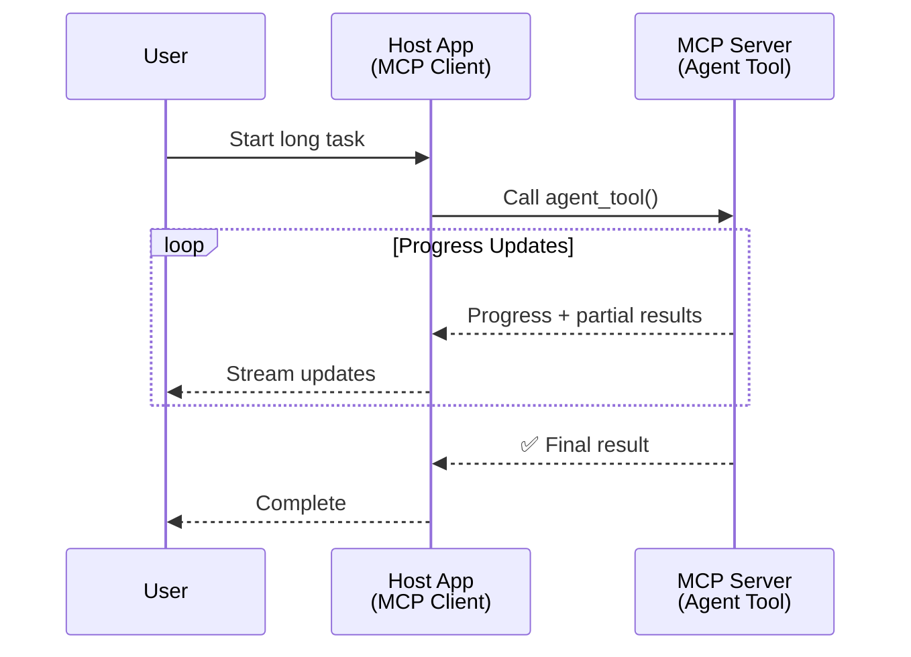
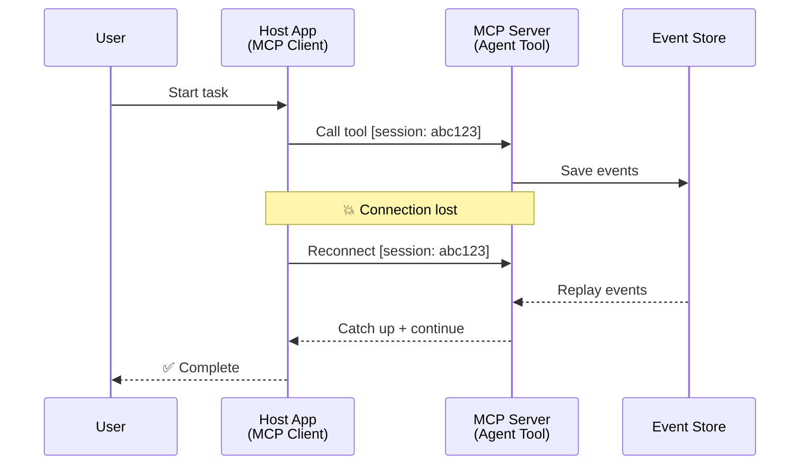
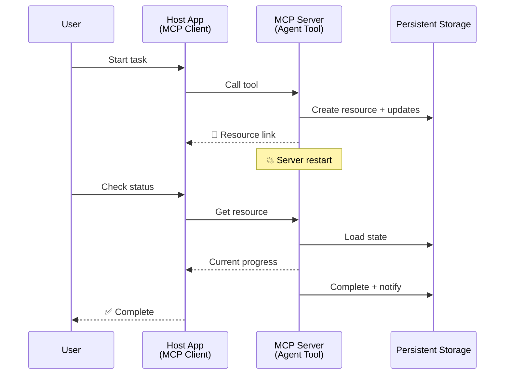
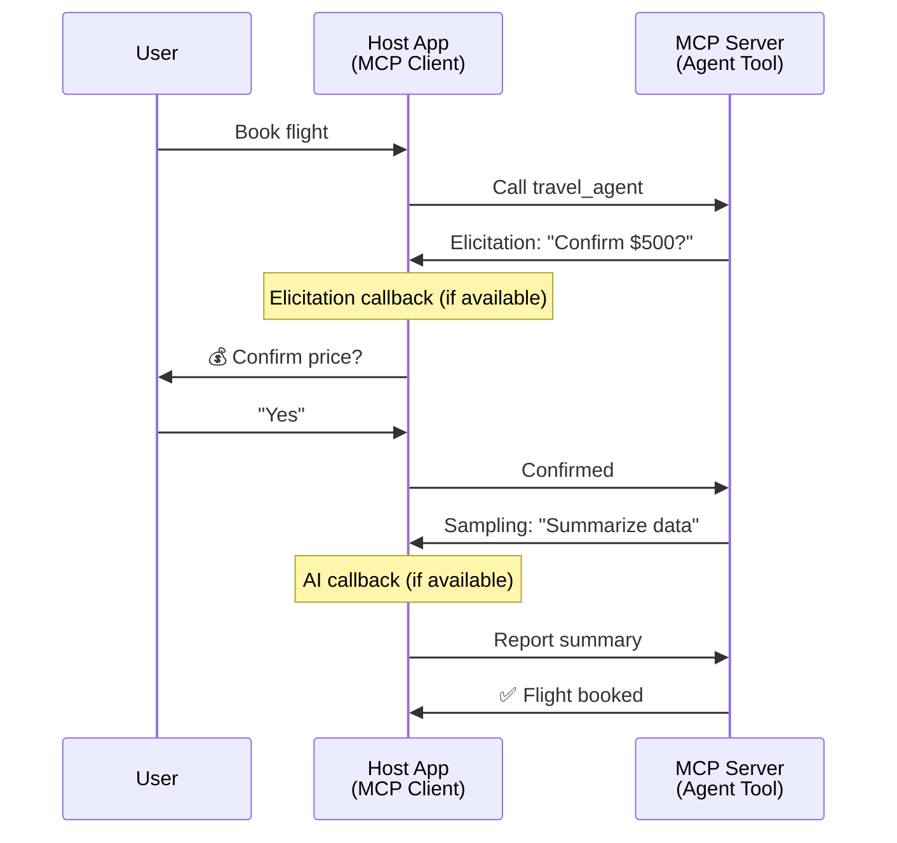

<!--
CO_OP_TRANSLATOR_METADATA:
{
  "original_hash": "5cc6836626047aa055e8960c8484a7d0",
  "translation_date": "2025-08-21T14:46:48+00:00",
  "source_file": "11-mcp/code_samples/mcp-agents/README.md",
  "language_code": "he"
}
-->
# בניית מערכות תקשורת בין סוכנים עם MCP

> בקצרה - האם אפשר לבנות תקשורת בין סוכנים עם MCP? כן!

MCP התפתח משמעותית מעבר למטרתו המקורית של "מתן הקשר ל-LLMs". עם שיפורים עדכניים כמו [זרמים ניתנים לחידוש](https://modelcontextprotocol.io/docs/concepts/transports#resumability-and-redelivery), [הזמנה](https://modelcontextprotocol.io/specification/2025-06-18/client/elicitation), [דגימה](https://modelcontextprotocol.io/specification/2025-06-18/client/sampling), והתראות ([התקדמות](https://modelcontextprotocol.io/specification/2025-06-18/basic/utilities/progress) ו-[משאבים](https://modelcontextprotocol.io/specification/2025-06-18/schema#resourceupdatednotification)), MCP מספק כיום תשתית חזקה לבניית מערכות תקשורת מורכבות בין סוכנים.

## תפיסת השגיאה לגבי סוכן/כלי

ככל שיותר מפתחים חוקרים כלים עם התנהגות סוכנית (פועלים לאורך זמן ממושך, עשויים לדרוש קלט נוסף במהלך הביצוע וכו'), קיימת תפיסה שגויה נפוצה ש-MCP אינו מתאים, בעיקר משום שדוגמאות מוקדמות של הכלים שלו התמקדו בדפוסי בקשה-תגובה פשוטים.

תפיסה זו כבר אינה רלוונטית. מפרט MCP שודרג משמעותית בחודשים האחרונים עם יכולות שמאפשרות בניית התנהגות סוכנית ממושכת:

- **זרימה ותוצאות חלקיות**: עדכוני התקדמות בזמן אמת במהלך הביצוע  
- **יכולת חידוש**: לקוחות יכולים להתחבר מחדש ולהמשיך לאחר ניתוק  
- **עמידות**: תוצאות שורדות הפעלה מחדש של השרת (לדוגמה, באמצעות קישורי משאבים)  
- **רב-שלביות**: קלט אינטראקטיבי במהלך הביצוע באמצעות הזמנה ודגימה  

יכולות אלו ניתנות לשילוב כדי לאפשר יישומים סוכניים מורכבים ורב-סוכניים, כולם מבוססים על פרוטוקול MCP.

לצורך הדיון, נתייחס לסוכן כ"כלי" הזמין בשרת MCP. הדבר מרמז על קיומה של אפליקציית מארחת שמיישמת לקוח MCP, יוצרת חיבור עם שרת MCP ויכולה לקרוא לסוכן.

## מה הופך כלי MCP ל"סוכני"?

לפני שנצלול ליישום, נבהיר אילו יכולות תשתית נדרשות לתמיכה בסוכנים הפועלים לאורך זמן ממושך.

> נגדיר סוכן כישות שיכולה לפעול באופן עצמאי לאורך זמן ממושך, המסוגלת להתמודד עם משימות מורכבות שעשויות לדרוש אינטראקציות או התאמות מרובות בהתבסס על משוב בזמן אמת.

### 1. זרימה ותוצאות חלקיות

דפוסי בקשה-תגובה מסורתיים אינם מתאימים למשימות ממושכות. סוכנים צריכים לספק:

- עדכוני התקדמות בזמן אמת  
- תוצאות ביניים  

**תמיכת MCP**: התראות עדכון משאבים מאפשרות זרימה של תוצאות חלקיות, אם כי הדבר דורש עיצוב זהיר כדי להימנע מקונפליקטים עם מודל הבקשה/תגובה של JSON-RPC.

| תכונה                     | מקרה שימוש                                                                                                                                                                       | תמיכת MCP                                                                                 |
| -------------------------- | ------------------------------------------------------------------------------------------------------------------------------------------------------------------------------ | ------------------------------------------------------------------------------------------ |
| עדכוני התקדמות בזמן אמת   | משתמש מבקש משימת מיגרציה של בסיס קוד. הסוכן מזרים התקדמות: "10% - ניתוח תלות... 25% - המרת קבצי TypeScript... 50% - עדכון ייבואים..."                                        | ✅ התראות התקדמות                                                                          |
| תוצאות חלקיות             | משימת "יצירת ספר" מזרים תוצאות חלקיות, לדוגמה: 1) מתווה עלילת הסיפור, 2) רשימת פרקים, 3) כל פרק כשהוא מוכן. המארח יכול לבדוק, לבטל או להפנות מחדש בכל שלב.                | ✅ התראות ניתנות להרחבה לכלול תוצאות חלקיות, ראו הצעות ב-PR 383, 776                      |

<strong>איור 1:</strong> תרשים זה ממחיש כיצד סוכן MCP מזרים עדכוני התקדמות בזמן אמת ותוצאות חלקיות לאפליקציית המארח במהלך משימה ממושכת, ומאפשר למשתמש לעקוב אחר הביצוע בזמן אמת.

### 2. יכולת חידוש

סוכנים חייבים להתמודד עם הפרעות ברשת בצורה חלקה:

- התחברות מחדש לאחר ניתוק (של הלקוח)  
- המשך מהמקום שבו הפסיקו (שידור מחדש של הודעות)  

**תמיכת MCP**: פרוטוקול StreamableHTTP של MCP תומך כיום בחידוש חיבורים ושידור מחדש של הודעות באמצעות מזהי חיבור ומזהי אירועים אחרונים. חשוב לציין שהשרת חייב ליישם EventStore שמאפשר שידור חוזר של אירועים כאשר הלקוח מתחבר מחדש.  
ישנה הצעת קהילה (PR #975) שחוקרת זרמים ניתנים לחידוש שאינם תלויי פרוטוקול.

| תכונה       | מקרה שימוש                                                                                                                                                   | תמיכת MCP                                                                |
| ------------ | ---------------------------------------------------------------------------------------------------------------------------------------------------------- | -------------------------------------------------------------------------- |
| יכולת חידוש | הלקוח מתנתק במהלך משימה ממושכת. עם התחברות מחדש, החיבור מתחדש עם שידור חוזר של אירועים שהוחמצו, והמשימה ממשיכה ללא הפרעה.                                   | ✅ פרוטוקול StreamableHTTP עם מזהי חיבור, שידור חוזר של אירועים ו-EventStore |

<strong>איור 2:</strong> תרשים זה מציג כיצד פרוטוקול StreamableHTTP של MCP ו-EventStore מאפשרים חידוש חיבור חלק: אם הלקוח מתנתק, הוא יכול להתחבר מחדש ולשדר מחדש אירועים שהוחמצו, ולהמשיך במשימה ללא אובדן התקדמות.

### 3. עמידות

סוכנים הפועלים לאורך זמן זקוקים למצב מתמשך:

- תוצאות שורדות הפעלה מחדש של השרת  
- ניתן לאחזר סטטוס מחוץ לחיבור  
- מעקב התקדמות בין חיבורים  

**תמיכת MCP**: MCP תומך כיום בסוג החזרה של קישור משאבים לקריאות לכלים. כיום, דפוס אפשרי הוא לעצב כלי שיוצר משאב ומחזיר מיד קישור למשאב. הכלי יכול להמשיך לטפל במשימה ברקע ולעדכן את המשאב. בתורו, הלקוח יכול לבחור לבדוק את מצב המשאב כדי לקבל תוצאות חלקיות או מלאות (בהתבסס על עדכוני המשאב שהשרת מספק) או להירשם לעדכונים מהמשאב.

מגבלה אחת כאן היא שבדיקת משאבים או הרשמה לעדכונים עשויות לצרוך משאבים עם השלכות בקנה מידה גדול. ישנה הצעת קהילה פתוחה (כולל #992) שחוקרת את האפשרות לכלול Webhooks או טריגרים שהשרת יכול לקרוא להם כדי להודיע לאפליקציית המארח על עדכונים.

| תכונה     | מקרה שימוש                                                                                                                                        | תמיכת MCP                                                        |
| ---------- | ----------------------------------------------------------------------------------------------------------------------------------------------- | ------------------------------------------------------------------ |
| עמידות    | השרת קורס במהלך משימת מיגרציית נתונים. תוצאות והתקדמות שורדות הפעלה מחדש, הלקוח יכול לבדוק סטטוס ולהמשיך ממשאב מתמשך.                           | ✅ קישורי משאבים עם אחסון מתמשך והתראות סטטוס                     |

כיום, דפוס נפוץ הוא לעצב כלי שיוצר משאב ומחזיר מיד קישור למשאב. הכלי יכול לטפל במשימה ברקע, להוציא התראות משאב שמשמשות כעדכוני התקדמות או כוללות תוצאות חלקיות, ולעדכן את התוכן במשאב לפי הצורך.

<strong>איור 3:</strong> תרשים זה מדגים כיצד סוכני MCP משתמשים במשאבים מתמשכים ובהתראות סטטוס כדי להבטיח שמשימות ממושכות שורדות הפעלה מחדש של השרת, ומאפשרים ללקוחות לבדוק התקדמות ולאחזר תוצאות גם לאחר כשלונות.

### 4. אינטראקציות רב-שלביות

סוכנים לעיתים קרובות זקוקים לקלט נוסף במהלך הביצוע:

- הבהרה או אישור מצד אדם  
- עזרה מצד AI להחלטות מורכבות  
- התאמה דינמית של פרמטרים  

**תמיכת MCP**: נתמך במלואו באמצעות דגימה (לקלט AI) והזמנה (לקלט אנושי).

| תכונה                  | מקרה שימוש                                                                                                                                     | תמיכת MCP                                           |
| ----------------------- | -------------------------------------------------------------------------------------------------------------------------------------------- | ----------------------------------------------------- |
| אינטראקציות רב-שלביות  | סוכן הזמנת נסיעות מבקש אישור מחיר מהמשתמש, ואז מבקש מ-AI לסכם נתוני נסיעה לפני השלמת העסקה.                                                  | ✅ הזמנה לקלט אנושי, דגימה לקלט AI                   |

<strong>איור 4:</strong> תרשים זה מתאר כיצד סוכני MCP יכולים לבקש קלט אנושי או עזרה מ-AI במהלך הביצוע, תומכים בתהליכי עבודה מורכבים ורב-שלביים כמו אישורים וקבלת החלטות דינמית.

## יישום סוכנים ממושכים על MCP - סקירת קוד

כחלק ממאמר זה, אנו מספקים [מאגר קוד](https://github.com/victordibia/ai-tutorials/tree/main/MCP%20Agents) שמכיל יישום מלא של סוכנים ממושכים באמצעות MCP SDK של Python עם פרוטוקול StreamableHTTP לחידוש חיבורים ושידור מחדש של הודעות. היישום מדגים כיצד ניתן לשלב יכולות MCP כדי לאפשר התנהגות סוכנית מתקדמת.

...

**כתב ויתור**:  
מסמך זה תורגם באמצעות שירות תרגום מבוסס בינה מלאכותית [Co-op Translator](https://github.com/Azure/co-op-translator). בעוד שאנו שואפים לדיוק, יש לקחת בחשבון שתרגומים אוטומטיים עשויים להכיל שגיאות או אי-דיוקים. המסמך המקורי בשפתו המקורית נחשב למקור הסמכותי. למידע קריטי, מומלץ להשתמש בתרגום מקצועי על ידי בני אדם. איננו נושאים באחריות לכל אי-הבנה או פרשנות שגויה הנובעת משימוש בתרגום זה.