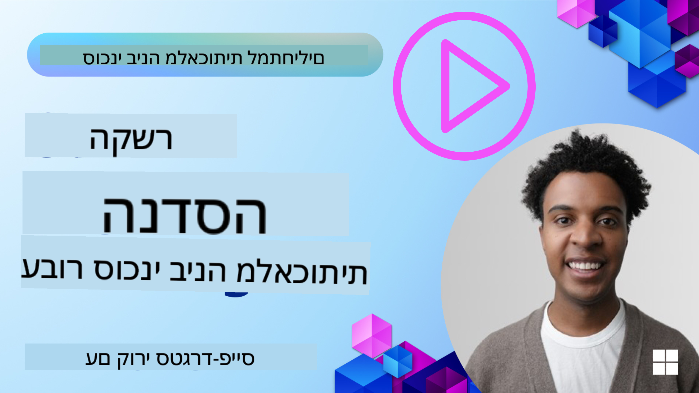
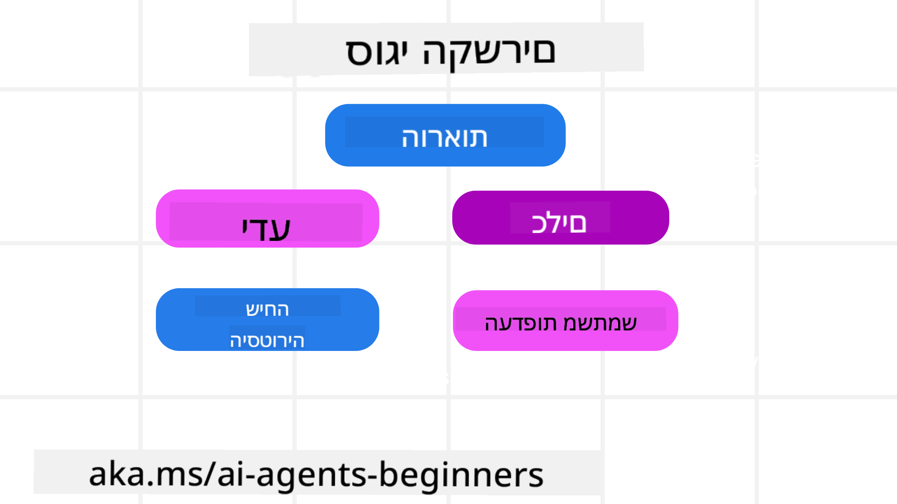
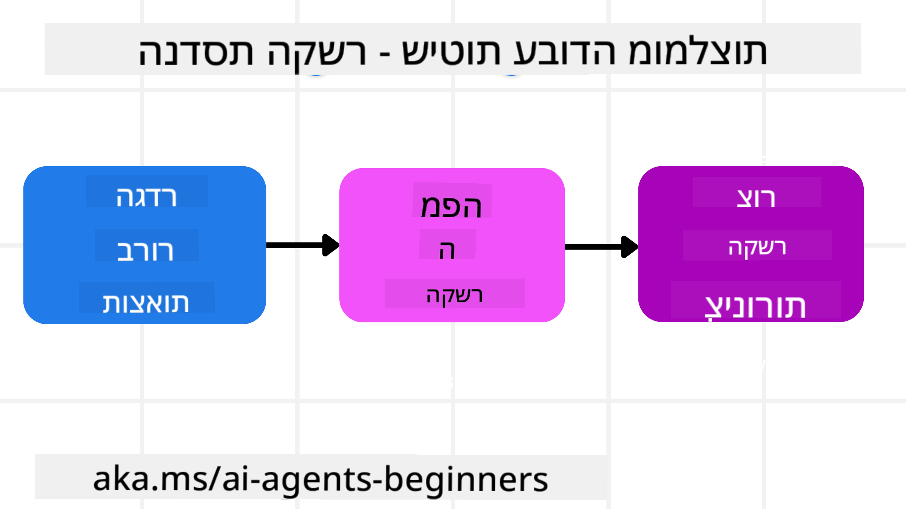

<!--
CO_OP_TRANSLATOR_METADATA:
{
  "original_hash": "cb7e50f471905ce6fdb92a30269a7a98",
  "translation_date": "2025-09-04T10:15:40+00:00",
  "source_file": "12-context-engineering/README.md",
  "language_code": "he"
}
-->
# הנדסת הקשר לסוכני AI

> _(לחצו על התמונה למעלה לצפייה בסרטון של השיעור)_

הבנת המורכבות של היישום שאתם בונים עבורו סוכן AI היא קריטית ליצירת סוכן אמין. עלינו לבנות סוכני AI שמנהלים מידע בצורה יעילה כדי להתמודד עם צרכים מורכבים מעבר להנדסת הנחיות.

בשיעור זה, נבחן מהי הנדסת הקשר ותפקידה בבניית סוכני AI.

## מבוא

השיעור יעסוק ב:

• **מהי הנדסת הקשר** ולמה היא שונה מהנדסת הנחיות.

• **אסטרטגיות להנדסת הקשר יעילה**, כולל איך לכתוב, לבחור, לדחוס ולבודד מידע.

• **כשלים נפוצים בהקשר** שיכולים להכשיל את סוכן ה-AI ואיך לתקן אותם.

## מטרות למידה

לאחר השלמת השיעור, תדעו:

• **להגדיר הנדסת הקשר** ולהבדיל אותה מהנדסת הנחיות.

• **לזהות את המרכיבים המרכזיים של הקשר** ביישומי מודלים שפתיים גדולים (LLM).

• **ליישם אסטרטגיות לכתיבה, בחירה, דחיסה ובידוד הקשר** כדי לשפר את ביצועי הסוכן.

• **להכיר כשלים נפוצים בהקשר** כמו הרעלה, הסחת דעת, בלבול והתנגשות, וליישם טכניקות למניעתם.

## מהי הנדסת הקשר?

עבור סוכני AI, ההקשר הוא מה שמניע את תכנון הפעולות של הסוכן. הנדסת הקשר היא הפרקטיקה של הבטחת המידע הנכון לסוכן כדי להשלים את השלב הבא במשימה. חלון ההקשר מוגבל בגודלו, ולכן כמתכנני סוכנים עלינו לבנות מערכות ותהליכים לניהול הוספה, הסרה ודחיסה של מידע בחלון ההקשר.

### הנדסת הנחיות לעומת הנדסת הקשר

הנדסת הנחיות מתמקדת בערכת הוראות סטטית אחת כדי להנחות את סוכני ה-AI בצורה יעילה עם סט של כללים. הנדסת הקשר עוסקת בניהול מערך דינמי של מידע, כולל ההנחיה הראשונית, כדי להבטיח שלסוכן ה-AI יהיה את מה שהוא צריך לאורך זמן. הרעיון המרכזי בהנדסת הקשר הוא להפוך את התהליך לחוזר ואמין.

### סוגי הקשר

חשוב לזכור שהקשר אינו דבר אחד בלבד. המידע שהסוכן צריך יכול להגיע ממגוון מקורות שונים, ועלינו להבטיח שלסוכן תהיה גישה למקורות אלו:

סוגי ההקשר שסוכן AI עשוי לנהל כוללים:

• **הוראות:** אלו כמו "החוקים" של הסוכן – הנחיות, הודעות מערכת, דוגמאות few-shot (שמראות ל-AI איך לבצע משהו) ותיאורים של כלים שהוא יכול להשתמש בהם. כאן מתמזגת הנדסת הנחיות עם הנדסת הקשר.

• **ידע:** זה כולל עובדות, מידע שנשלף ממאגרי נתונים או זיכרונות ארוכי טווח שהסוכן צבר. זה כולל שילוב מערכת RAG (Retrieval Augmented Generation) אם הסוכן צריך גישה למאגרי ידע שונים.

• **כלים:** אלו ההגדרות של פונקציות חיצוניות, APIs ושרתי MCP שהסוכן יכול לקרוא להם, יחד עם המשוב (תוצאות) שהוא מקבל משימוש בהם.

• **היסטוריית שיחה:** הדיאלוג המתמשך עם המשתמש. ככל שהזמן עובר, השיחות הופכות ארוכות ומורכבות יותר, מה שאומר שהן תופסות מקום בחלון ההקשר.

• **העדפות משתמש:** מידע שנלמד על העדפות המשתמש לאורך זמן. אלו יכולים להישמר ולהיקרא בעת קבלת החלטות חשובות כדי לעזור למשתמש.

## אסטרטגיות להנדסת הקשר יעילה

### אסטרטגיות תכנון

הנדסת הקשר טובה מתחילה בתכנון טוב. הנה גישה שתעזור לכם להתחיל לחשוב איך ליישם את הרעיון של הנדסת הקשר:

1. **הגדירו תוצאות ברורות** - התוצאות של המשימות שהסוכנים יוקצו להן צריכות להיות מוגדרות בבירור. ענו על השאלה - "איך ייראה העולם כשהסוכן יסיים את המשימה שלו?" במילים אחרות, איזה שינוי, מידע או תגובה המשתמש צריך לקבל לאחר האינטראקציה עם הסוכן.

2. **מפו את ההקשר** - לאחר שהגדרתם את תוצאות הסוכן, עליכם לענות על השאלה "איזה מידע הסוכן צריך כדי להשלים את המשימה הזו?". כך תוכלו להתחיל למפות את ההקשר של איפה המידע הזה נמצא.

3. **צרו צינורות הקשר** - עכשיו כשאתם יודעים איפה המידע נמצא, עליכם לענות על השאלה "איך הסוכן יקבל את המידע הזה?". זה יכול להיעשות בדרכים שונות כולל RAG, שימוש בשרתי MCP וכלים אחרים.

### אסטרטגיות מעשיות

תכנון הוא חשוב, אבל ברגע שהמידע מתחיל לזרום לחלון ההקשר של הסוכן, עלינו ליישם אסטרטגיות מעשיות לניהולו:

#### ניהול הקשר

בעוד שחלק מהמידע יתווסף לחלון ההקשר באופן אוטומטי, הנדסת הקשר עוסקת בלקיחת תפקיד פעיל יותר במידע הזה, מה שניתן לעשות בכמה אסטרטגיות:

1. **מחברת סוכן**  
מאפשרת לסוכן לרשום הערות על מידע רלוונטי לגבי המשימות הנוכחיות ואינטראקציות עם המשתמש במהלך סשן יחיד. זה צריך להתקיים מחוץ לחלון ההקשר בקובץ או אובייקט ריצה שהסוכן יכול לשלוף מאוחר יותר במהלך הסשן אם צריך.

2. **זיכרונות**  
מחברות טובות לניהול מידע מחוץ לחלון ההקשר של סשן יחיד. זיכרונות מאפשרים לסוכנים לאחסן ולשלוף מידע רלוונטי על פני סשנים מרובים. זה יכול לכלול סיכומים, העדפות משתמש ומשוב לשיפור בעתיד.

3. **דחיסת הקשר**  
כאשר חלון ההקשר גדל ומתקרב לגבולו, ניתן להשתמש בטכניקות כמו סיכום וגיזום. זה כולל שמירה רק על המידע הרלוונטי ביותר או הסרת הודעות ישנות.

4. **מערכות רב-סוכנים**  
פיתוח מערכת רב-סוכנים הוא סוג של הנדסת הקשר מכיוון שלכל סוכן יש חלון הקשר משלו. איך ההקשר הזה משותף ומועבר בין סוכנים הוא דבר נוסף שצריך לתכנן בעת בניית מערכות אלו.

5. **סביבות Sandbox**  
אם סוכן צריך להריץ קוד או לעבד כמויות גדולות של מידע במסמך, זה יכול לקחת כמות גדולה של טוקנים לעיבוד התוצאות. במקום לאחסן את כל זה בחלון ההקשר, הסוכן יכול להשתמש בסביבת Sandbox שמסוגלת להריץ את הקוד ולקרוא רק את התוצאות ומידע רלוונטי אחר.

6. **אובייקטי מצב ריצה**  
זה נעשה על ידי יצירת מכולות מידע לניהול מצבים שבהם הסוכן צריך גישה למידע מסוים. עבור משימה מורכבת, זה יאפשר לסוכן לאחסן את תוצאות כל תת-משימה שלב אחר שלב, תוך שמירה על הקשר מחובר רק לתת-המשימה הספציפית.

### דוגמה להנדסת הקשר

נניח שאנחנו רוצים שסוכן AI **"יזמין לי טיול לפריז."**

• סוכן פשוט שמשתמש רק בהנדסת הנחיות עשוי פשוט להגיב: **"בסדר, מתי תרצה לנסוע לפריז?"**. הוא רק עיבד את השאלה הישירה שלכם בזמן שהמשתמש שאל.

• סוכן שמשתמש באסטרטגיות הנדסת הקשר שנלמדו יעשה הרבה יותר. לפני שהוא מגיב, המערכת שלו עשויה:

  ◦ **לבדוק את לוח השנה שלכם** לתאריכים פנויים (שליפת נתונים בזמן אמת).

 ◦ **לזכור העדפות נסיעה קודמות** (מזיכרון ארוך טווח) כמו חברת התעופה המועדפת, תקציב, או אם אתם מעדיפים טיסות ישירות.

 ◦ **לזהות כלים זמינים** להזמנת טיסות ובתי מלון.

- ואז, תגובה לדוגמה יכולה להיות: **"היי [שם שלכם]! אני רואה שאתם פנויים בשבוע הראשון של אוקטובר. האם לחפש טיסות ישירות לפריז עם [חברת התעופה המועדפת] במסגרת התקציב הרגיל שלכם של [תקציב]?"**. תגובה עשירה ומודעת להקשר זה מדגימה את כוח הנדסת ההקשר.

## כשלים נפוצים בהקשר

### הרעלת הקשר

**מה זה:** כאשר הזיה (מידע שגוי שנוצר על ידי ה-LLM) או טעות נכנסים להקשר ומוזכרים שוב ושוב, מה שגורם לסוכן לרדוף אחרי מטרות בלתי אפשריות או לפתח אסטרטגיות חסרות היגיון.

**מה לעשות:** יישמו **אימות הקשר** ו**הסגר**. אימתו מידע לפני שהוא נוסף לזיכרון ארוך טווח. אם מתגלה הרעלה פוטנציאלית, התחילו שרשורי הקשר חדשים כדי למנוע את התפשטות המידע השגוי.

**דוגמת הזמנת נסיעות:** הסוכן שלכם מזייף **טיסה ישירה משדה תעופה מקומי קטן לעיר בינלאומית רחוקה** שאינה מציעה טיסות בינלאומיות. פרט הטיסה הלא קיים נשמר בהקשר. מאוחר יותר, כשאתם מבקשים מהסוכן להזמין, הוא ממשיך לנסות למצוא כרטיסים למסלול בלתי אפשרי זה, מה שמוביל לשגיאות חוזרות.

**פתרון:** יישמו שלב שמאמת **קיום טיסות ומסלולים עם API בזמן אמת** _לפני_ הוספת פרט הטיסה להקשר הפעיל של הסוכן. אם האימות נכשל, המידע השגוי "מוסגר" ולא נעשה בו שימוש נוסף.

### הסחת דעת בהקשר

**מה זה:** כאשר ההקשר הופך להיות גדול מדי, המודל מתמקד יותר מדי בהיסטוריה המצטברת במקום להשתמש במה שלמד במהלך האימון, מה שמוביל לפעולות חוזרות או לא מועילות. מודלים עשויים להתחיל לעשות טעויות אפילו לפני שהחלון מלא.

**מה לעשות:** השתמשו ב**סיכום הקשר**. דחסו באופן תקופתי מידע מצטבר לסיכומים קצרים יותר, שמרו על פרטים חשובים תוך הסרת היסטוריה מיותרת. זה עוזר "לאפס" את המיקוד.

**דוגמת הזמנת נסיעות:** דיברתם על יעדי טיול חלומיים שונים במשך זמן רב, כולל תיאור מפורט של טיול התרמילאים שלכם מלפני שנתיים. כשאתם סוף סוף מבקשים **"מצא לי טיסה זולה לחודש הבא"**, הסוכן מתמקד בפרטים הישנים והלא רלוונטיים ושואל על ציוד התרמילאים שלכם או מסלולים קודמים, במקום להתמקד בבקשה הנוכחית.

**פתרון:** לאחר מספר מסוים של פניות או כשההקשר גדל מדי, הסוכן צריך **לסכם את החלקים האחרונים והרלוונטיים ביותר של השיחה** – להתמקד בתאריכי הנסיעה והיעד הנוכחיים שלכם – ולהשתמש בסיכום הדחוס הזה לקריאה הבאה של ה-LLM, תוך הסרת השיחה ההיסטורית הפחות רלוונטית.

### בלבול בהקשר

**מה זה:** כאשר הקשר מיותר, לעיתים בצורה של יותר מדי כלים זמינים, גורם למודל לייצר תגובות גרועות או לקרוא לכלים לא רלוונטיים. מודלים קטנים במיוחד רגישים לכך.

**מה לעשות:** יישמו **ניהול כלי עבודה** באמצעות טכניקות RAG. אחסנו תיאורי כלים במסד נתונים וקטורי ובחרו _רק_ את הכלים הרלוונטיים ביותר לכל משימה ספציפית. מחקרים מראים שמומלץ להגביל את בחירת הכלים לפחות מ-30.

**דוגמת הזמנת נסיעות:** לסוכן שלכם יש גישה לעשרות כלים: `book_flight`, `book_hotel`, `rent_car`, `find_tours`, `currency_converter`, `weather_forecast`, `restaurant_reservations` וכו'. אתם מבקשים, **"מה הדרך הטובה ביותר להתנייד בפריז?"** בשל כמות הכלים, הסוכן מתבלבל ומנסה לקרוא ל-`book_flight` _בתוך_ פריז, או ל-`rent_car` למרות שאתם מעדיפים תחבורה ציבורית, כי תיאורי הכלים עשויים לחפוף או שהוא פשוט לא מצליח להבחין בין הכלי הטוב ביותר.

**פתרון:** השתמשו ב**RAG על תיאורי כלים**. כשאתם שואלים על התניידות בפריז, המערכת שולפת באופן דינמי _רק_ את הכלים הרלוונטיים ביותר כמו `rent_car` או `public_transport_info` בהתבסס על השאילתה שלכם, ומציגה "ערכת כלים" ממוקדת ל-LLM.

### התנגשות בהקשר

**מה זה:** כאשר מידע סותר קיים בתוך ההקשר, מה שמוביל להיגיון לא עקבי או תגובות סופיות גרועות. זה קורה לעיתים קרובות כאשר מידע מגיע בשלבים, והנחות מוקדמות שגויות נשארות בהקשר.

**מה לעשות:** השתמשו ב**גיזום הקשר** ו**העברה**. גיזום פירושו הסרת מידע מיושן או סותר כאשר פרטים חדשים מגיעים. העברה נותנת למודל "מחברת" נפרדת לעיבוד מידע מבלי להעמיס את ההקשר הראשי.

**דוגמת הזמנת נסיעות:** בתחילה אתם אומרים לסוכן, **"אני רוצה לטוס במחלקת תיירים."** מאוחר יותר בשיחה, אתם משנים את דעתכם ואומרים, **"למעשה, לטיול הזה, בוא נלך על מחלקת עסקים."** אם שתי ההוראות נשארות בהקשר, הסוכן עשוי לקבל תוצאות חיפוש סותרות או להתבלבל לגבי איזו העדפה להעדיף.

**פתרון:** יישמו **גיזום הקשר**. כאשר הוראה חדשה סותרת הוראה ישנה, ההוראה הישנה מוסרת או מבוטלת במפורש בהקשר. לחלופין, הסוכן יכול להשתמש ב**מחברת** כדי ליישב העדפות סותרות לפני קבלת החלטה, ולהבטיח שרק ההוראה הסופית והעקבית תדריך את פעולותיו.

## יש לכם עוד שאלות על הנדסת הקשר?

הצטרפו ל-[Azure AI Foundry Discord](https://aka.ms/ai-agents/discord) כדי לפגוש לומדים אחרים, להשתתף בשעות קבלה ולקבל תשובות לשאלות שלכם על סוכני AI.

---

**כתב ויתור**:  
מסמך זה תורגם באמצעות שירות תרגום מבוסס בינה מלאכותית [Co-op Translator](https://github.com/Azure/co-op-translator). בעוד שאנו שואפים לדיוק, יש לקחת בחשבון שתרגומים אוטומטיים עשויים להכיל שגיאות או אי-דיוקים. המסמך המקורי בשפתו המקורית נחשב למקור הסמכותי. למידע קריטי, מומלץ להשתמש בתרגום מקצועי על ידי מתרגם אנושי. איננו נושאים באחריות לכל אי-הבנה או פרשנות שגויה הנובעת משימוש בתרגום זה.