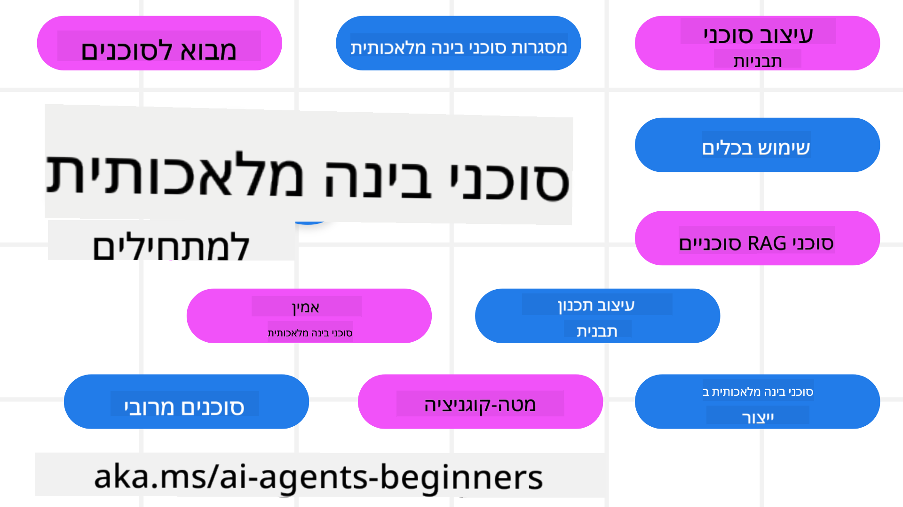

<!--
CO_OP_TRANSLATOR_METADATA:
{
  "original_hash": "6b07046397366e6f6f4524c9ddeba1e1",
  "translation_date": "2025-07-12T14:55:14+00:00",
  "source_file": "README.md",
  "language_code": "he"
}
-->
# סוכני AI למתחילים - קורס

## 11 שיעורים המלמדים את כל מה שצריך לדעת כדי להתחיל לבנות סוכני AI

  
  
  
  

### 🌐 תמיכה בריבוי שפות

#### נתמך באמצעות GitHub Action (אוטומטי ותמיד מעודכן)

[צרפתית](../fr/README.md) | [ספרדית](../es/README.md) | [גרמנית](../de/README.md) | [רוסית](../ru/README.md) | [ערבית](../ar/README.md) | [פרסית (פארסי)](../fa/README.md) | [אורדו](../ur/README.md) | [סינית (מפושטת)](../zh/README.md) | [סינית (מסורתית, מקאו)](../mo/README.md) | [סינית (מסורתית, הונג קונג)](../hk/README.md) | [סינית (מסורתית, טייוואן)](../tw/README.md) | [יפנית](../ja/README.md) | [קוריאנית](../ko/README.md) | [הינדי](../hi/README.md) | [בנגלית](../bn/README.md) | [מרטהי](../mr/README.md) | [נפאלית](../ne/README.md) | [פונג'אבית (גורמוכי)](../pa/README.md) | [פורטוגזית (פורטוגל)](../pt/README.md) | [פורטוגזית (ברזיל)](../br/README.md) | [איטלקית](../it/README.md) | [פולנית](../pl/README.md) | [טורקית](../tr/README.md) | [יוונית](../el/README.md) | [תאית](../th/README.md) | [שוודית](../sv/README.md) | [דנית](../da/README.md) | [נורווגית](../no/README.md) | [פינית](../fi/README.md) | [הולנדית](../nl/README.md) | [עברית](./README.md) | [וייטנאמית](../vi/README.md) | [אינדונזית](../id/README.md) | [מלאית](../ms/README.md) | [טגלוג (פיליפינית)](../tl/README.md) | [סווהילי](../sw/README.md) | [הונגרית](../hu/README.md) | [צ'כית](../cs/README.md) | [סלובקית](../sk/README.md) | [רומנית](../ro/README.md) | [בולגרית](../bg/README.md) | [סרבית (קירילית)](../sr/README.md) | [קרואטית](../hr/README.md) | [סלובנית](../sl/README.md) | [אוקראינית](../uk/README.md) | [בורמזית (מיאנמר)](../my/README.md)

**אם ברצונכם לתמוך בשפות נוספות, הרשימה נמצאת [כאן](https://github.com/Azure/co-op-translator/blob/main/getting_started/supported-languages.md)**

  
  

## 🌱 התחלה

קורס זה כולל 11 שיעורים המכסים את היסודות של בניית סוכני AI. כל שיעור עוסק בנושא משלו, אז אפשר להתחיל מכל מקום שנוח לכם!

יש תמיכה בריבוי שפות לקורס הזה. עברו ל[השפות הזמינות כאן](../..).

אם זו הפעם הראשונה שלכם בבנייה עם מודלים של Generative AI, מומלץ לעבור על הקורס שלנו [Generative AI For Beginners](https://aka.ms/genai-beginners), הכולל 21 שיעורים על בנייה עם GenAI.

אל תשכחו [להעניק כוכב (🌟) לריפוזיטורי הזה](https://docs.github.com/en/get-started/exploring-projects-on-github/saving-repositories-with-stars?WT.mc_id=academic-105485-koreyst) ו[לעשות fork לריפוזיטורי](https://github.com/microsoft/ai-agents-for-beginners/fork) כדי להריץ את הקוד.

### מה צריך

כל שיעור בקורס כולל דוגמאות קוד, שנמצאות בתיקיית code_samples. ניתן [לעשות fork לריפוזיטורי](https://github.com/microsoft/ai-agents-for-beginners/fork) כדי ליצור עותק משלכם.

דוגמאות הקוד בתרגילים האלה משתמשות ב-Azure AI Foundry וב-GitHub Model Catalogs כדי לתקשר עם מודלי שפה:

- [Github Models](https://aka.ms/ai-agents-beginners/github-models) - חינמי / מוגבל  
- [Azure AI Foundry](https://aka.ms/ai-agents-beginners/ai-foundry) - נדרש חשבון Azure

הקורס משתמש גם במסגרת ושירותים של סוכני AI מבית Microsoft:

- [Azure AI Agent Service](https://aka.ms/ai-agents-beginners/ai-agent-service)  
- [Semantic Kernel](https://aka.ms/ai-agents-beginners/semantic-kernel)  
- [AutoGen](https://aka.ms/ai-agents/autogen)

למידע נוסף על הרצת הקוד לקורס, עברו ל[הגדרת הקורס](./00-course-setup/README.md).

## 🙏 רוצים לעזור?

יש לכם הצעות או מצאתם שגיאות כתיב או בקוד? [פתחו issue](https://github.com/microsoft/ai-agents-for-beginners/issues?WT.mc_id=academic-105485-koreyst) או [צרו pull request](https://github.com/microsoft/ai-agents-for-beginners/pulls?WT.mc_id=academic-105485-koreyst)

אם נתקעתם או יש לכם שאלות לגבי בניית סוכני AI, הצטרפו ל[קהילת Azure AI Foundry ב-Discord](https://discord.gg/kzRShWzttr)

אם יש לכם משוב על המוצר או שגיאות בזמן הבנייה, בקרו ב[פורום המפתחים של Azure AI Foundry](https://aka.ms/azureaifoundry/forum)

## 📂 כל שיעור כולל

- שיעור כתוב ב-README וסרטון קצר  
- דוגמאות קוד בפייתון התומכות ב-Azure AI Foundry וב-Github Models (חינמי)  
- קישורים למשאבים נוספים להמשך הלמידה  

## 🗃️ שיעורים

| **שיעור**                                | **טקסט וקוד**                                     | **סרטון**                                                  | **למידה נוספת**                                                                       |
|------------------------------------------|----------------------------------------------------|------------------------------------------------------------|----------------------------------------------------------------------------------------|
| מבוא לסוכני AI ומקרי שימוש בסוכנים       | [קישור](./01-intro-to-ai-agents/README.md)          | [סרטון](https://youtu.be/3zgm60bXmQk?si=z8QygFvYQv-9WtO1)  | [קישור](https://aka.ms/ai-agents-beginners/collection?WT.mc_id=academic-105485-koreyst) |
| חקר מסגרות Agentic AI                    | [קישור](./02-explore-agentic-frameworks/README.md)  | [סרטון](https://youtu.be/ODwF-EZo_O8?si=Vawth4hzVaHv-u0H)  | [קישור](https://aka.ms/ai-agents-beginners/collection?WT.mc_id=academic-105485-koreyst) |
| הבנת דפוסי עיצוב Agentic AI              | [קישור](./03-agentic-design-patterns/README.md)     | [סרטון](https://youtu.be/m9lM8qqoOEA?si=BIzHwzstTPL8o9GF)  | [קישור](https://aka.ms/ai-agents-beginners/collection?WT.mc_id=academic-105485-koreyst) |
| דפוס עיצוב לשימוש בכלים                  | [קישור](./04-tool-use/README.md)                    | [סרטון](https://youtu.be/vieRiPRx-gI?si=2z6O2Xu2cu_Jz46N)  | [קישור](https://aka.ms/ai-agents-beginners/collection?WT.mc_id=academic-105485-koreyst) |
| Agentic RAG                              | [קישור](./05-agentic-rag/README.md)                 | [סרטון](https://youtu.be/WcjAARvdL7I?si=gKPWsQpKiIlDH9A3)  | [קישור](https://aka.ms/ai-agents-beginners/collection?WT.mc_id=academic-105485-koreyst) |
| בניית סוכני AI אמינים                    | [קישור](./06-building-trustworthy-agents/README.md) | [סרטון](https://youtu.be/iZKkMEGBCUQ?si=jZjpiMnGFOE9L8OK ) | [קישור](https://aka.ms/ai-agents-beginners/collection?WT.mc_id=academic-105485-koreyst) |
| דפוס עיצוב לתכנון                        | [קישור](./07-planning-design/README.md)             | [סרטון](https://youtu.be/kPfJ2BrBCMY?si=6SC_iv_E5-mzucnC)  | [קישור](https://aka.ms/ai-agents-beginners/collection?WT.mc_id=academic-105485-koreyst) |
| דפוס עיצוב רב-סוכני                     | [קישור](./08-multi-agent/README.md)                 | [סרטון](https://youtu.be/V6HpE9hZEx0?si=rMgDhEu7wXo2uo6g)  | [קישור](https://aka.ms/ai-agents-beginners/collection?WT.mc_id=academic-105485-koreyst) |
| דפוס עיצוב מטה-קוגניציה                  | [קישור](./09-metacognition/README.md)               | [סרטון](https://youtu.be/His9R6gw6Ec?si=8gck6vvdSNCt6OcF)  | [קישור](https://aka.ms/ai-agents-beginners/collection?WT.mc_id=academic-105485-koreyst) |
| סוכני AI בפרודקשן                       | [קישור](./10-ai-agents-production/README.md)        | [סרטון](https://youtu.be/l4TP6IyJxmQ?si=31dnhexRo6yLRJDl)  | [קישור](https://aka.ms/ai-agents-beginners/collection?WT.mc_id=academic-105485-koreyst) |
| סוכני AI עם MCP                         | [קישור](./11-mcp/README.md)                         |                                                            | [קישור](https://aka.ms/mcp-for-beginners)                                               |

## 🎒 קורסים נוספים

הצוות שלנו מייצר קורסים נוספים! בדקו:
- [**חדש** פרוטוקול Model Context (MCP) למתחילים](https://github.com/microsoft/mcp-for-beginners?WT.mc_id=academic-105485-koreyst)
- [בינה מלאכותית גנרטיבית למתחילים עם .NET](https://github.com/microsoft/Generative-AI-for-beginners-dotnet?WT.mc_id=academic-105485-koreyst)
- [בינה מלאכותית גנרטיבית למתחילים](https://github.com/microsoft/generative-ai-for-beginners?WT.mc_id=academic-105485-koreyst)
- [למידת מכונה למתחילים](https://aka.ms/ml-beginners?WT.mc_id=academic-105485-koreyst)
- [מדעי הנתונים למתחילים](https://aka.ms/datascience-beginners?WT.mc_id=academic-105485-koreyst)
- [בינה מלאכותית למתחילים](https://aka.ms/ai-beginners?WT.mc_id=academic-105485-koreyst)
- [סייברסקיוריטי למתחילים](https://github.com/microsoft/Security-101??WT.mc_id=academic-96948-sayoung)
- [פיתוח ווב למתחילים](https://aka.ms/webdev-beginners?WT.mc_id=academic-105485-koreyst)
- [אינטרנט של הדברים למתחילים](https://aka.ms/iot-beginners?WT.mc_id=academic-105485-koreyst)
- [פיתוח XR למתחילים](https://github.com/microsoft/xr-development-for-beginners?WT.mc_id=academic-105485-koreyst)
- [שליטה ב-GitHub Copilot לתכנות משותף עם AI](https://aka.ms/GitHubCopilotAI?WT.mc_id=academic-105485-koreyst)
- [שליטה ב-GitHub Copilot למפתחי C#/.NET](https://github.com/microsoft/mastering-github-copilot-for-dotnet-csharp-developers?WT.mc_id=academic-105485-koreyst)
- [בחר את ההרפתקה שלך עם Copilot](https://github.com/microsoft/CopilotAdventures?WT.mc_id=academic-105485-koreyst)

## 🌟 תודה לקהילה

תודה ל-[Shivam Goyal](https://www.linkedin.com/in/shivam2003/) על תרומתו בדוגמאות קוד חשובות המדגימות Agentic RAG.

## תרומה

הפרויקט הזה מקבל בברכה תרומות והצעות. רוב התרומות מחייבות הסכמה ל-
Contributor License Agreement (CLA) המצהיר שיש לך את הזכות, וכי אתה אכן מעניק לנו
את הזכויות להשתמש בתרומתך. לפרטים, בקר ב-
<https://cla.opensource.microsoft.com>.

כאשר אתה מגיש pull request, בוט CLA יקבע אוטומטית אם עליך לספק
CLA ויעטר את ה-PR בהתאם (למשל, בדיקת סטטוס, תגובה). פשוט פעל לפי ההוראות
של הבוט. תצטרך לעשות זאת רק פעם אחת בכל הרפוזיטוריות שמשתמשות ב-CLA שלנו.

הפרויקט אימץ את [Microsoft Open Source Code of Conduct](https://opensource.microsoft.com/codeofconduct/).
למידע נוסף ראה את [שאלות נפוצות על קוד ההתנהגות](https://opensource.microsoft.com/codeofconduct/faq/) או
צור קשר ב-[opencode@microsoft.com](mailto:opencode@microsoft.com) עם שאלות או הערות נוספות.

## סימני מסחר

פרויקט זה עשוי להכיל סימני מסחר או לוגואים של פרויקטים, מוצרים או שירותים. שימוש מורשה בסימני המסחר או בלוגואים של Microsoft כפוף וצריך לעמוד ב-
[Microsoft's Trademark & Brand Guidelines](https://www.microsoft.com/legal/intellectualproperty/trademarks/usage/general).
שימוש בסימני המסחר או בלוגואים של Microsoft בגרסאות מותאמות של פרויקט זה לא יגרום לבלבול או ייצג חסות של Microsoft.
כל שימוש בסימני מסחר או לוגואים של צד שלישי כפוף למדיניות של אותם צדדים שלישיים.

**כתב ויתור**:  
מסמך זה תורגם באמצעות שירות תרגום מבוסס בינה מלאכותית [Co-op Translator](https://github.com/Azure/co-op-translator). למרות שאנו שואפים לדיוק, יש לקחת בחשבון כי תרגומים אוטומטיים עלולים להכיל שגיאות או אי-דיוקים. המסמך המקורי בשפת המקור שלו נחשב למקור הסמכותי. למידע קריטי מומלץ להשתמש בתרגום מקצועי על ידי מתרגם אנושי. אנו לא נושאים באחריות לכל אי-הבנה או פרשנות שגויה הנובעת משימוש בתרגום זה.