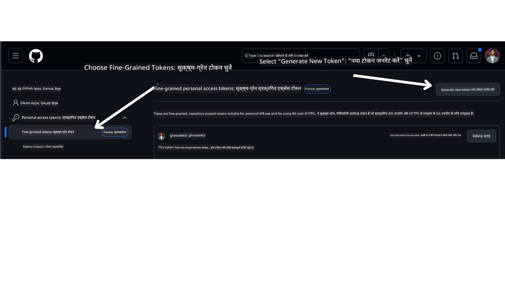

<!--
CO_OP_TRANSLATOR_METADATA:
{
  "original_hash": "76945069b52a49cd0432ae3e0b0ba22e",
  "translation_date": "2025-07-12T07:46:57+00:00",
  "source_file": "00-course-setup/README.md",
  "language_code": "hi"
}
-->
अपने GitHub अकाउंट में जाएं।

स्क्रीन के बाईं ओर `Fine-grained tokens` विकल्प चुनें।

फिर `Generate new token` चुनें।



आपसे अपने टोकन के लिए एक नाम दर्ज करने, समाप्ति तिथि चुनने (सिफारिश: 30 दिन), और टोकन के लिए स्कोप्स चुनने (Public Repositories) के लिए कहा जाएगा।

इस टोकन की अनुमतियाँ भी संपादित करना आवश्यक है: Permissions -> Models -> GitHub Models तक पहुंच की अनुमति देता है।

अपने नए बनाए गए टोकन को कॉपी करें। अब आप इसे इस कोर्स में शामिल `.env` फ़ाइल में जोड़ेंगे।

### चरण 2: अपनी `.env` फ़ाइल बनाएं

अपना `.env` फ़ाइल बनाने के लिए टर्मिनल में निम्न कमांड चलाएं।

```bash
cp .env.example .env
```

यह उदाहरण फ़ाइल की कॉपी बनाएगा और आपकी निर्देशिका में `.env` फ़ाइल बनाएगा, जहाँ आप पर्यावरण चर के मान भरेंगे।

अपने टोकन को कॉपी करने के बाद, अपनी पसंदीदा टेक्स्ट एडिटर में `.env` फ़ाइल खोलें और `GITHUB_TOKEN` फ़ील्ड में अपना टोकन पेस्ट करें।

अब आप इस कोर्स के कोड नमूनों को चला सकेंगे।

## Azure AI Foundry और Azure AI Agent Service का उपयोग करके नमूनों के लिए सेटअप

### चरण 1: अपना Azure प्रोजेक्ट एंडपॉइंट प्राप्त करें

Azure AI Foundry में हब और प्रोजेक्ट बनाने के लिए निम्न लिंक पर दिए गए चरणों का पालन करें: [Hub resources overview](https://learn.microsoft.com/en-us/azure/ai-foundry/concepts/ai-resources)

प्रोजेक्ट बनाने के बाद, आपको अपने प्रोजेक्ट के लिए कनेक्शन स्ट्रिंग प्राप्त करनी होगी।

यह Azure AI Foundry पोर्टल में अपने प्रोजेक्ट के **Overview** पेज पर जाकर किया जा सकता है।


### चरण 2: अपनी `.env` फ़ाइल बनाएं

अपना `.env` फ़ाइल बनाने के लिए टर्मिनल में निम्न कमांड चलाएं।

```bash
cp .env.example .env
```

यह उदाहरण फ़ाइल की कॉपी बनाएगा और आपकी निर्देशिका में `.env` फ़ाइल बनाएगा, जहाँ आप पर्यावरण चर के मान भरेंगे।

अपने टोकन को कॉपी करने के बाद, अपनी पसंदीदा टेक्स्ट एडिटर में `.env` फ़ाइल खोलें और `PROJECT_ENDPOINT` फ़ील्ड में अपना टोकन पेस्ट करें।

### चरण 3: Azure में साइन इन करें

सुरक्षा के सर्वोत्तम अभ्यास के रूप में, हम Microsoft Entra ID के साथ Azure OpenAI को प्रमाणित करने के लिए [keyless authentication](https://learn.microsoft.com/azure/developer/ai/keyless-connections?tabs=csharp%2Cazure-cli?WT.mc_id=academic-105485-koreyst) का उपयोग करेंगे। ऐसा करने से पहले, आपको अपने ऑपरेटिंग सिस्टम के लिए [इंस्टॉलेशन निर्देशों](https://learn.microsoft.com/cli/azure/install-azure-cli?WT.mc_id=academic-105485-koreyst) के अनुसार **Azure CLI** इंस्टॉल करना होगा।

इसके बाद, टर्मिनल खोलें और `az login --use-device-code` कमांड चलाकर अपने Azure अकाउंट में साइन इन करें।

साइन इन करने के बाद, टर्मिनल में अपनी सब्सक्रिप्शन चुनें।

## अतिरिक्त पर्यावरण चर - Azure Search और Azure OpenAI

Agentic RAG पाठ - पाठ 5 - में ऐसे नमूने हैं जो Azure Search और Azure OpenAI का उपयोग करते हैं।

यदि आप ये नमूने चलाना चाहते हैं, तो आपको अपनी `.env` फ़ाइल में निम्न पर्यावरण चर जोड़ने होंगे:

### Overview पेज (प्रोजेक्ट)

- `AZURE_SUBSCRIPTION_ID` - अपने प्रोजेक्ट के **Overview** पेज पर **Project details** देखें।

- `AZURE_AI_PROJECT_NAME` - अपने प्रोजेक्ट के **Overview** पेज के शीर्ष पर देखें।

- `AZURE_OPENAI_SERVICE` - **Overview** पेज पर **Included capabilities** टैब में **Azure OpenAI Service** देखें।

### Management Center

- `AZURE_OPENAI_RESOURCE_GROUP` - **Management Center** के **Overview** पेज पर **Project properties** देखें।

- `GLOBAL_LLM_SERVICE` - **Connected resources** के अंतर्गत **Azure AI Services** कनेक्शन नाम देखें। यदि सूचीबद्ध नहीं है, तो अपने संसाधन समूह में Azure पोर्टल में AI Services संसाधन नाम देखें।

### Models + Endpoints पेज

- `AZURE_OPENAI_EMBEDDING_DEPLOYMENT_NAME` - अपने एम्बेडिंग मॉडल (जैसे, `text-embedding-ada-002`) चुनें और मॉडल विवरण से **Deployment name** नोट करें।

- `AZURE_OPENAI_CHAT_DEPLOYMENT_NAME` - अपने चैट मॉडल (जैसे, `gpt-4o-mini`) चुनें और मॉडल विवरण से **Deployment name** नोट करें।

### Azure पोर्टल

- `AZURE_OPENAI_ENDPOINT` - **Azure AI services** खोजें, उस पर क्लिक करें, फिर **Resource Management**, **Keys and Endpoint** पर जाएं, नीचे स्क्रॉल करें और "Azure OpenAI endpoints" में "Language APIs" वाला कॉपी करें।

- `AZURE_OPENAI_API_KEY` - उसी स्क्रीन से KEY 1 या KEY 2 कॉपी करें।

- `AZURE_SEARCH_SERVICE_ENDPOINT` - अपने **Azure AI Search** संसाधन को खोजें, उस पर क्लिक करें और **Overview** देखें।

- `AZURE_SEARCH_API_KEY` - फिर **Settings** में जाकर **Keys** से प्राथमिक या द्वितीयक एडमिन की कॉपी करें।

### बाहरी वेबपेज

- `AZURE_OPENAI_API_VERSION` - [API version lifecycle](https://learn.microsoft.com/en-us/azure/ai-services/openai/api-version-deprecation#latest-ga-api-release) पेज पर **Latest GA API release** देखें।

### keyless authentication सेटअप करें

अपने क्रेडेंशियल्स को हार्डकोड करने के बजाय, हम Azure OpenAI के साथ keyless कनेक्शन का उपयोग करेंगे। इसके लिए, हम `DefaultAzureCredential` इम्पोर्ट करेंगे और बाद में क्रेडेंशियल प्राप्त करने के लिए `DefaultAzureCredential` फ़ंक्शन कॉल करेंगे।

```python
from azure.identity import DefaultAzureCredential, InteractiveBrowserCredential
```

## कहीं अटक गए हैं?

यदि इस सेटअप को चलाने में कोई समस्या हो, तो हमारे

**अस्वीकरण**:  
यह दस्तावेज़ AI अनुवाद सेवा [Co-op Translator](https://github.com/Azure/co-op-translator) का उपयोग करके अनुवादित किया गया है। जबकि हम सटीकता के लिए प्रयासरत हैं, कृपया ध्यान दें कि स्वचालित अनुवादों में त्रुटियाँ या अशुद्धियाँ हो सकती हैं। मूल दस्तावेज़ अपनी मूल भाषा में ही अधिकारिक स्रोत माना जाना चाहिए। महत्वपूर्ण जानकारी के लिए, पेशेवर मानव अनुवाद की सलाह दी जाती है। इस अनुवाद के उपयोग से उत्पन्न किसी भी गलतफहमी या गलत व्याख्या के लिए हम जिम्मेदार नहीं हैं।