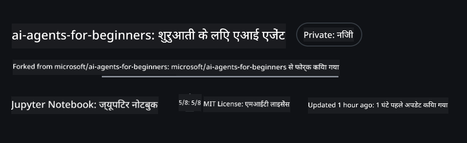
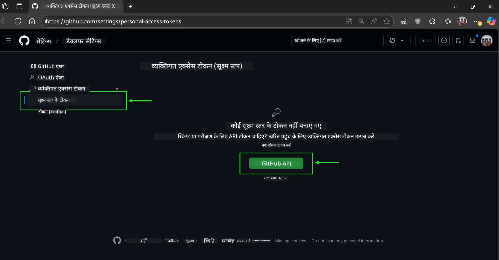
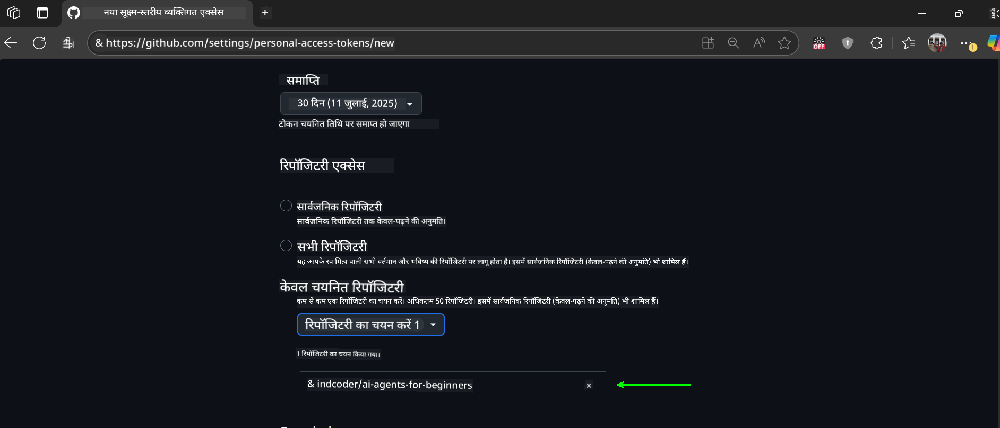
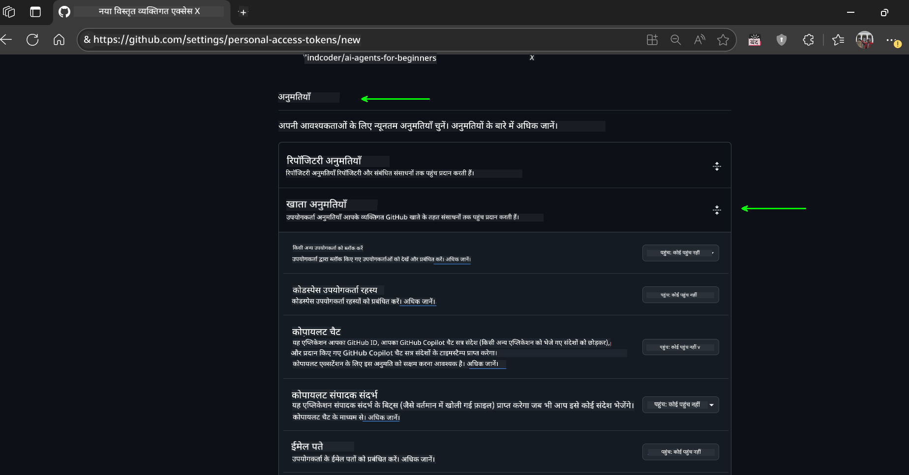
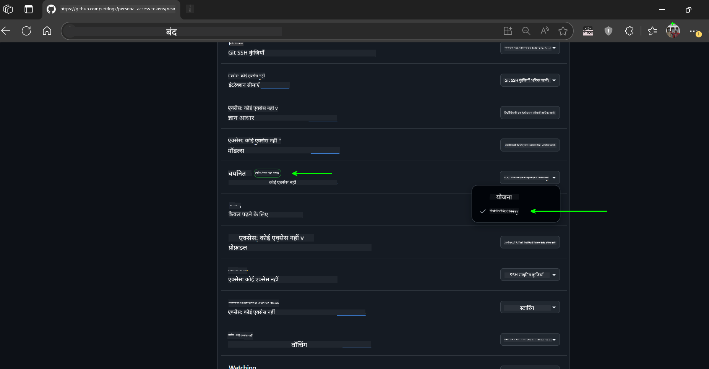
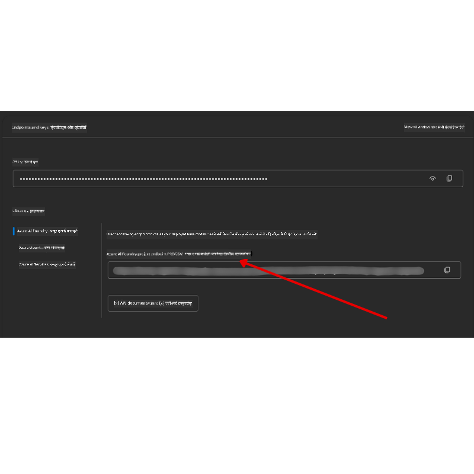

<!--
CO_OP_TRANSLATOR_METADATA:
{
  "original_hash": "c6a79c8f2b56a80370ff7e447765524f",
  "translation_date": "2025-07-23T08:26:01+00:00",
  "source_file": "00-course-setup/README.md",
  "language_code": "hi"
}
-->
# कोर्स सेटअप

## परिचय

इस पाठ में आप सीखेंगे कि इस कोर्स के कोड नमूनों को कैसे चलाना है।

## इस रिपॉजिटरी को क्लोन या फोर्क करें

शुरू करने के लिए, कृपया GitHub रिपॉजिटरी को क्लोन या फोर्क करें। इससे आपके पास कोर्स सामग्री का अपना संस्करण होगा, जिसे आप चला सकते हैं, परीक्षण कर सकते हैं और संशोधित कर सकते हैं!

यह लिंक पर क्लिक करके किया जा सकता है।

आपके पास अब इस कोर्स का अपना फोर्क किया हुआ संस्करण निम्नलिखित लिंक में होना चाहिए:



## कोड चलाना

यह कोर्स Jupyter Notebooks की एक श्रृंखला प्रदान करता है, जिन्हें चलाकर आप AI एजेंट्स बनाने का व्यावहारिक अनुभव प्राप्त कर सकते हैं।

कोड नमूने निम्नलिखित का उपयोग करते हैं:

**GitHub खाता आवश्यक - मुफ्त**:

1) Semantic Kernel Agent Framework + GitHub Models Marketplace। इसे (semantic-kernel.ipynb) के रूप में लेबल किया गया है।
2) AutoGen Framework + GitHub Models Marketplace। इसे (autogen.ipynb) के रूप में लेबल किया गया है।

**Azure सदस्यता आवश्यक**:
3) Azure AI Foundry + Azure AI Agent Service। इसे (azureaiagent.ipynb) के रूप में लेबल किया गया है।

हम आपको तीनों प्रकार के उदाहरण आज़माने के लिए प्रोत्साहित करते हैं ताकि आप देख सकें कि आपके लिए कौन सा सबसे अच्छा काम करता है।

आप जो भी विकल्प चुनते हैं, वह यह निर्धारित करेगा कि नीचे दिए गए सेटअप चरणों में से कौन से आपको पालन करने की आवश्यकता है:

## आवश्यकताएँ

- Python 3.12+
  - **NOTE**: यदि आपके पास Python3.12 इंस्टॉल नहीं है, तो सुनिश्चित करें कि आप इसे इंस्टॉल करें। फिर requirements.txt फ़ाइल से सही संस्करण इंस्टॉल करने के लिए python3.12 का उपयोग करके अपना वर्चुअल वातावरण बनाएं।
- GitHub खाता - GitHub Models Marketplace तक पहुंच के लिए
- Azure सदस्यता - Azure AI Foundry तक पहुंच के लिए
- Azure AI Foundry खाता - Azure AI Agent Service तक पहुंच के लिए

हमने इस रिपॉजिटरी की रूट में एक `requirements.txt` फ़ाइल शामिल की है, जिसमें कोड नमूनों को चलाने के लिए आवश्यक सभी Python पैकेज शामिल हैं।

आप इसे निम्नलिखित कमांड को रिपॉजिटरी की रूट में अपने टर्मिनल में चलाकर इंस्टॉल कर सकते हैं:

```bash
pip install -r requirements.txt
```
हम किसी भी संघर्ष और समस्याओं से बचने के लिए एक Python वर्चुअल वातावरण बनाने की सिफारिश करते हैं।

## VSCode सेटअप करें
सुनिश्चित करें कि आप VSCode में सही संस्करण का Python उपयोग कर रहे हैं।


## GitHub Models का उपयोग करने वाले नमूनों के लिए सेटअप 

### चरण 1: अपना GitHub Personal Access Token (PAT) प्राप्त करें

यह कोर्स GitHub Models Marketplace का उपयोग करता है, जो आपको बड़े भाषा मॉडल्स (LLMs) तक मुफ्त पहुंच प्रदान करता है, जिनका उपयोग आप AI एजेंट्स बनाने के लिए करेंगे।

GitHub Models का उपयोग करने के लिए, आपको एक [GitHub Personal Access Token](https://docs.github.com/en/authentication/keeping-your-account-and-data-secure/managing-your-personal-access-tokens) बनाना होगा।

यह आपके GitHub खाते में जाकर किया जा सकता है।

कृपया [Principle of Least Privilege](https://docs.github.com/en/get-started/learning-to-code/storing-your-secrets-safely) का पालन करें जब आप अपना टोकन बना रहे हों। इसका मतलब है कि आपको केवल वही अनुमतियाँ देनी चाहिए जो इस कोर्स के कोड नमूनों को चलाने के लिए आवश्यक हैं।

1. अपनी स्क्रीन के बाईं ओर `Fine-grained tokens` विकल्प चुनें।

    फिर `Generate new token` चुनें।

    

1. अपने टोकन के लिए एक वर्णनात्मक नाम दर्ज करें जो इसके उद्देश्य को दर्शाता हो, जिससे इसे बाद में पहचानना आसान हो। एक समाप्ति तिथि सेट करें (अनुशंसित: 30 दिन; यदि आप अधिक सुरक्षित दृष्टिकोण पसंद करते हैं तो आप 7 दिनों जैसी छोटी अवधि चुन सकते हैं।)

    

1. टोकन के स्कोप को इस रिपॉजिटरी के फोर्क तक सीमित करें।

    

1. टोकन की अनुमतियों को प्रतिबंधित करें: **Permissions** के तहत, **Account Permissions** पर जाएं, **Models** पर जाएं और केवल GitHub Models के लिए आवश्यक पढ़ने की अनुमति सक्षम करें।

    

    

अपने नए बनाए गए टोकन को कॉपी करें। अब आप इसे इस कोर्स में शामिल `.env` फ़ाइल में जोड़ेंगे।

### चरण 2: अपनी `.env` फ़ाइल बनाएं

अपनी `.env` फ़ाइल बनाने के लिए, अपने टर्मिनल में निम्नलिखित कमांड चलाएं:

```bash
cp .env.example .env
```

यह उदाहरण फ़ाइल को कॉपी करेगा और आपकी निर्देशिका में एक `.env` बनाएगा, जहाँ आप पर्यावरण चर के लिए मान भर सकते हैं।

अपने टोकन को कॉपी करने के बाद, अपनी पसंदीदा टेक्स्ट एडिटर में `.env` फ़ाइल खोलें और अपने टोकन को `GITHUB_TOKEN` फ़ील्ड में पेस्ट करें।

अब आप इस कोर्स के कोड नमूनों को चला सकते हैं।

## Azure AI Foundry और Azure AI Agent Service का उपयोग करने वाले नमूनों के लिए सेटअप

### चरण 1: अपना Azure प्रोजेक्ट एंडपॉइंट प्राप्त करें

Azure AI Foundry में एक हब और प्रोजेक्ट बनाने के चरणों का पालन करें: [Hub resources overview](https://learn.microsoft.com/en-us/azure/ai-foundry/concepts/ai-resources)

एक बार जब आप अपना प्रोजेक्ट बना लेते हैं, तो आपको अपने प्रोजेक्ट के लिए कनेक्शन स्ट्रिंग प्राप्त करनी होगी।

यह Azure AI Foundry पोर्टल में अपने प्रोजेक्ट के **Overview** पेज पर जाकर किया जा सकता है।



### चरण 2: अपनी `.env` फ़ाइल बनाएं

अपनी `.env` फ़ाइल बनाने के लिए, अपने टर्मिनल में निम्नलिखित कमांड चलाएं:

```bash
cp .env.example .env
```

यह उदाहरण फ़ाइल को कॉपी करेगा और आपकी निर्देशिका में एक `.env` बनाएगा, जहाँ आप पर्यावरण चर के लिए मान भर सकते हैं।

अपने टोकन को कॉपी करने के बाद, अपनी पसंदीदा टेक्स्ट एडिटर में `.env` फ़ाइल खोलें और अपने टोकन को `PROJECT_ENDPOINT` फ़ील्ड में पेस्ट करें।

### चरण 3: Azure में साइन इन करें

सुरक्षा के सर्वोत्तम अभ्यास के रूप में, हम [keyless authentication](https://learn.microsoft.com/azure/developer/ai/keyless-connections?tabs=csharp%2Cazure-cli?WT.mc_id=academic-105485-koreyst) का उपयोग करके Microsoft Entra ID के साथ Azure OpenAI में प्रमाणित होंगे।

इसके बाद, एक टर्मिनल खोलें और `az login --use-device-code` चलाकर अपने Azure खाते में साइन इन करें।

साइन इन करने के बाद, टर्मिनल में अपनी सदस्यता चुनें।

## अतिरिक्त पर्यावरण चर - Azure Search और Azure OpenAI 

Agentic RAG पाठ - पाठ 5 - में ऐसे नमूने हैं जो Azure Search और Azure OpenAI का उपयोग करते हैं।

यदि आप इन नमूनों को चलाना चाहते हैं, तो आपको अपनी `.env` फ़ाइल में निम्नलिखित पर्यावरण चर जोड़ने होंगे:

### Overview पेज (प्रोजेक्ट)

- `AZURE_SUBSCRIPTION_ID` - अपने प्रोजेक्ट के **Overview** पेज पर **Project details** देखें।

- `AZURE_AI_PROJECT_NAME` - अपने प्रोजेक्ट के **Overview** पेज के शीर्ष पर देखें।

- `AZURE_OPENAI_SERVICE` - **Overview** पेज पर **Azure OpenAI Service** के लिए **Included capabilities** टैब में इसे खोजें।

### Management Center

- `AZURE_OPENAI_RESOURCE_GROUP` - **Management Center** के **Overview** पेज पर **Project properties** पर जाएं।

- `GLOBAL_LLM_SERVICE` - **Connected resources** के तहत, **Azure AI Services** कनेक्शन नाम खोजें। यदि सूचीबद्ध नहीं है, तो अपने संसाधन समूह के तहत AI Services संसाधन नाम के लिए **Azure पोर्टल** देखें।

### Models + Endpoints पेज

- `AZURE_OPENAI_EMBEDDING_DEPLOYMENT_NAME` - अपना एम्बेडिंग मॉडल (जैसे, `text-embedding-ada-002`) चुनें और मॉडल विवरण से **Deployment name** नोट करें।

- `AZURE_OPENAI_CHAT_DEPLOYMENT_NAME` - अपना चैट मॉडल (जैसे, `gpt-4o-mini`) चुनें और मॉडल विवरण से **Deployment name** नोट करें।

### Azure पोर्टल

- `AZURE_OPENAI_ENDPOINT` - **Azure AI services** देखें, उस पर क्लिक करें, फिर **Resource Management**, **Keys and Endpoint** पर जाएं, "Azure OpenAI endpoints" तक स्क्रॉल करें, और "Language APIs" वाले को कॉपी करें।

- `AZURE_OPENAI_API_KEY` - उसी स्क्रीन से, KEY 1 या KEY 2 कॉपी करें।

- `AZURE_SEARCH_SERVICE_ENDPOINT` - अपने **Azure AI Search** संसाधन को खोजें, उस पर क्लिक करें, और **Overview** देखें।

- `AZURE_SEARCH_API_KEY` - फिर **Settings** और फिर **Keys** पर जाएं और प्राथमिक या द्वितीयक व्यवस्थापक कुंजी कॉपी करें।

### बाहरी वेबपेज

- `AZURE_OPENAI_API_VERSION` - [API version lifecycle](https://learn.microsoft.com/en-us/azure/ai-services/openai/api-version-deprecation#latest-ga-api-release) पेज पर **Latest GA API release** के तहत जाएं।

### Keyless Authentication सेटअप करें

अपने क्रेडेंशियल्स को हार्डकोड करने के बजाय, हम Azure OpenAI के साथ एक keyless कनेक्शन का उपयोग करेंगे। ऐसा करने के लिए, हम `DefaultAzureCredential` आयात करेंगे और बाद में `DefaultAzureCredential` फ़ंक्शन को कॉल करेंगे ताकि क्रेडेंशियल प्राप्त हो सके।

```python
from azure.identity import DefaultAzureCredential, InteractiveBrowserCredential
```

## कहीं अटक गए?

यदि आपको इस सेटअप को चलाने में कोई समस्या हो रही है, तो हमारे 

## अगला पाठ

अब आप इस कोर्स के कोड को चलाने के लिए तैयार हैं। AI एजेंट्स की दुनिया के बारे में और अधिक सीखने का आनंद लें! 

[AI एजेंट्स और उनके उपयोग के मामलों का परिचय](../01-intro-to-ai-agents/README.md)

**अस्वीकरण**:  
यह दस्तावेज़ AI अनुवाद सेवा [Co-op Translator](https://github.com/Azure/co-op-translator) का उपयोग करके अनुवादित किया गया है। जबकि हम सटीकता सुनिश्चित करने का प्रयास करते हैं, कृपया ध्यान दें कि स्वचालित अनुवाद में त्रुटियां या अशुद्धियां हो सकती हैं। मूल भाषा में उपलब्ध मूल दस्तावेज़ को प्रामाणिक स्रोत माना जाना चाहिए। महत्वपूर्ण जानकारी के लिए, पेशेवर मानव अनुवाद की सिफारिश की जाती है। इस अनुवाद के उपयोग से उत्पन्न किसी भी गलतफहमी या गलत व्याख्या के लिए हम उत्तरदायी नहीं हैं।