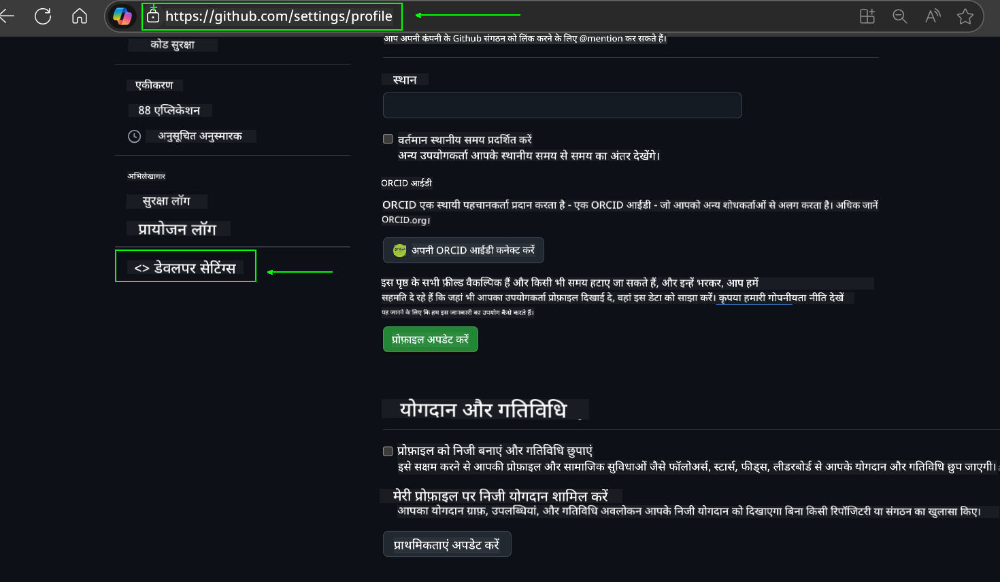
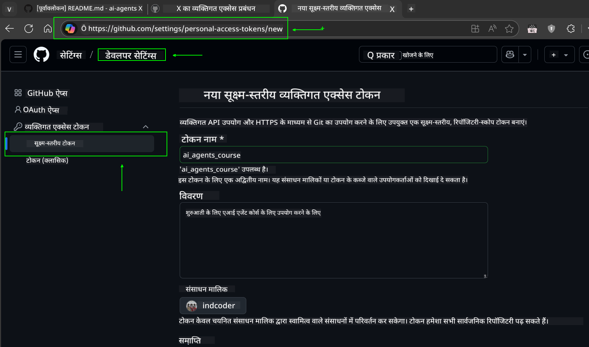
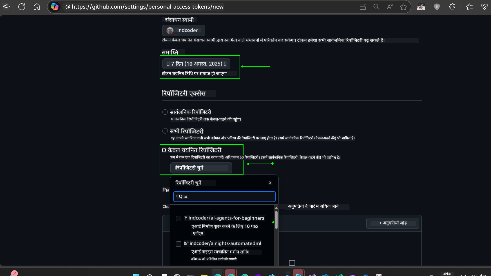
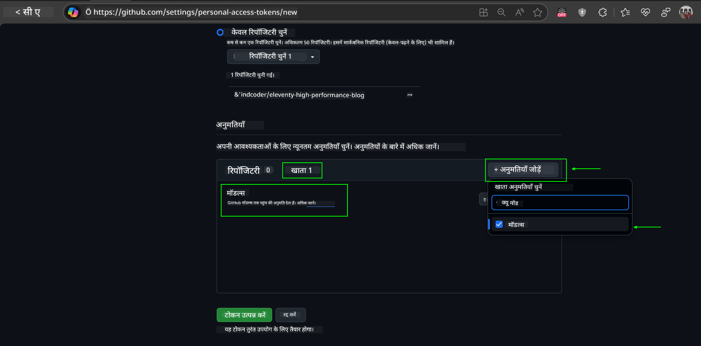
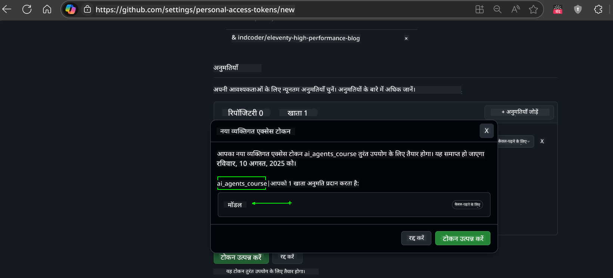
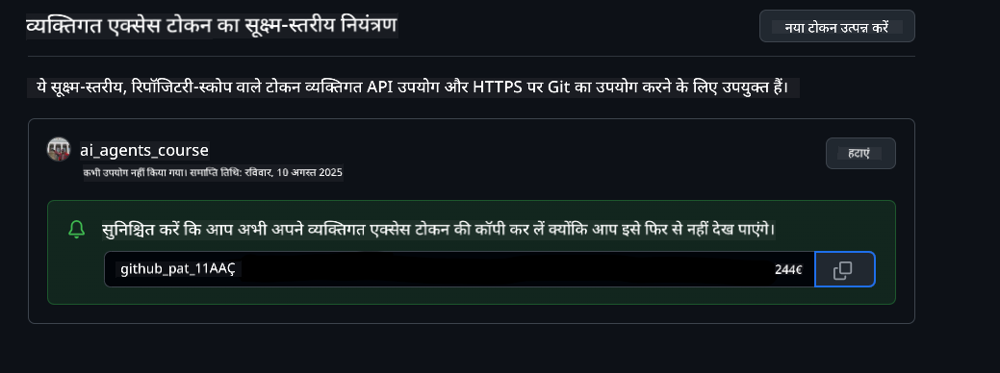
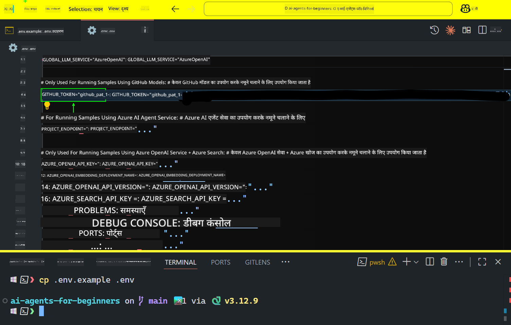

<!--
CO_OP_TRANSLATOR_METADATA:
{
  "original_hash": "c55b973b1562abf5aadf6a4028265ac5",
  "translation_date": "2025-08-30T14:00:42+00:00",
  "source_file": "00-course-setup/README.md",
  "language_code": "hi"
}
-->
# कोर्स सेटअप

## परिचय

इस पाठ में आप सीखेंगे कि इस कोर्स के कोड सैंपल्स को कैसे चलाना है।

## अन्य शिक्षार्थियों से जुड़ें और मदद प्राप्त करें

अपने रिपॉजिटरी को क्लोन करने से पहले, [AI Agents For Beginners Discord चैनल](https://aka.ms/ai-agents/discord) से जुड़ें। यहां आपको सेटअप में मदद, कोर्स से संबंधित सवालों के जवाब, और अन्य शिक्षार्थियों से जुड़ने का मौका मिलेगा।

## इस रिपॉजिटरी को क्लोन या फोर्क करें

शुरू करने के लिए, कृपया GitHub रिपॉजिटरी को क्लोन या फोर्क करें। इससे आपके पास कोर्स सामग्री का अपना संस्करण होगा, जिसे आप चला सकते हैं, टेस्ट कर सकते हैं और कोड में बदलाव कर सकते हैं।

यह लिंक पर क्लिक करके किया जा सकता है:


## कोड चलाना

इस कोर्स में Jupyter Notebooks की एक श्रृंखला दी गई है, जिन्हें चलाकर आप AI Agents बनाने का व्यावहारिक अनुभव प्राप्त कर सकते हैं।

कोड सैंपल्स निम्नलिखित का उपयोग करते हैं:

**GitHub अकाउंट आवश्यक - मुफ्त**:

1) Semantic Kernel Agent Framework + GitHub Models Marketplace। लेबल: (semantic-kernel.ipynb)
2) AutoGen Framework + GitHub Models Marketplace। लेबल: (autogen.ipynb)

**Azure सब्सक्रिप्शन आवश्यक**:
3) Azure AI Foundry + Azure AI Agent Service। लेबल: (azureaiagent.ipynb)

हम आपको तीनों प्रकार के उदाहरण आज़माने की सलाह देते हैं ताकि आप देख सकें कि आपके लिए कौन सा सबसे अच्छा काम करता है।

आप जो भी विकल्प चुनते हैं, वह नीचे दिए गए सेटअप चरणों को निर्धारित करेगा:

## आवश्यकताएँ

- Python 3.12+
  - **NOTE**: यदि आपके पास Python 3.12 इंस्टॉल नहीं है, तो इसे इंस्टॉल करें। फिर python3.12 का उपयोग करके अपना वर्चुअल एनवायरनमेंट बनाएं ताकि requirements.txt फ़ाइल से सही संस्करण इंस्टॉल हो सकें।
- GitHub अकाउंट - GitHub Models Marketplace तक पहुंच के लिए
- Azure सब्सक्रिप्शन - Azure AI Foundry तक पहुंच के लिए
- Azure AI Foundry अकाउंट - Azure AI Agent Service तक पहुंच के लिए

हमने इस रिपॉजिटरी की रूट में एक `requirements.txt` फ़ाइल शामिल की है, जिसमें कोड सैंपल्स चलाने के लिए आवश्यक सभी Python पैकेज हैं।

आप इसे निम्नलिखित कमांड को अपने टर्मिनल में रिपॉजिटरी की रूट पर चलाकर इंस्टॉल कर सकते हैं:

```bash
pip install -r requirements.txt
```

हम किसी भी संघर्ष और समस्याओं से बचने के लिए Python वर्चुअल एनवायरनमेंट बनाने की सलाह देते हैं।

## VSCode सेटअप
सुनिश्चित करें कि आप VSCode में सही Python संस्करण का उपयोग कर रहे हैं।


## GitHub Models का उपयोग करके सैंपल्स के लिए सेटअप

### चरण 1: अपना GitHub Personal Access Token (PAT) प्राप्त करें

यह कोर्स GitHub Models Marketplace का उपयोग करता है, जो आपको Large Language Models (LLMs) तक मुफ्त पहुंच प्रदान करता है, जिन्हें आप AI Agents बनाने के लिए उपयोग करेंगे।

GitHub Models का उपयोग करने के लिए, आपको [GitHub Personal Access Token](https://docs.github.com/en/authentication/keeping-your-account-and-data-secure/managing-your-personal-access-tokens) बनाना होगा।

यह आपके GitHub अकाउंट में जाकर किया जा सकता है।

कृपया [Principle of Least Privilege](https://docs.github.com/en/get-started/learning-to-code/storing-your-secrets-safely) का पालन करें जब आप अपना टोकन बना रहे हों। इसका मतलब है कि आपको टोकन को केवल उन्हीं अनुमतियों के साथ बनाना चाहिए जो इस कोर्स के कोड सैंपल्स को चलाने के लिए आवश्यक हैं।

1. **Developer settings** में जाकर बाईं ओर `Fine-grained tokens` विकल्प चुनें।
   

   फिर `Generate new token` चुनें।

   

2. अपने टोकन के लिए एक वर्णनात्मक नाम दर्ज करें जो इसके उद्देश्य को दर्शाता हो, ताकि इसे बाद में पहचानना आसान हो।

    🔐 टोकन अवधि की सिफारिश

    अनुशंसित अवधि: 30 दिन  
    अधिक सुरक्षित दृष्टिकोण के लिए, आप छोटी अवधि चुन सकते हैं—जैसे 7 दिन 🛡️  
    यह एक व्यक्तिगत लक्ष्य निर्धारित करने और कोर्स को पूरा करने का शानदार तरीका है, जबकि आपका सीखने का उत्साह उच्च है 🚀।

    

3. टोकन के स्कोप को इस रिपॉजिटरी के फोर्क तक सीमित करें।

    

4. टोकन की अनुमतियों को सीमित करें: **Permissions** के तहत **Account** टैब पर क्लिक करें और "+ Add permissions" बटन पर क्लिक करें। एक ड्रॉपडाउन दिखाई देगा। कृपया **Models** खोजें और इसके बॉक्स को चेक करें।
    

5. टोकन बनाने से पहले आवश्यक अनुमतियों की पुष्टि करें। 

6. टोकन बनाने से पहले सुनिश्चित करें कि आप इसे सुरक्षित स्थान जैसे पासवर्ड मैनेजर वॉल्ट में संग्रहीत करने के लिए तैयार हैं, क्योंकि इसे बनाने के बाद फिर से नहीं दिखाया जाएगा। 

अपने नए टोकन को कॉपी करें जिसे आपने अभी बनाया है। अब आप इसे इस कोर्स में शामिल `.env` फ़ाइल में जोड़ेंगे।

### चरण 2: अपनी `.env` फ़ाइल बनाएं

अपनी `.env` फ़ाइल बनाने के लिए अपने टर्मिनल में निम्नलिखित कमांड चलाएं:

```bash
cp .env.example .env
```

यह उदाहरण फ़ाइल को कॉपी करेगा और आपकी निर्देशिका में `.env` बनाएगा, जहां आप पर्यावरण चर के लिए मान भर सकते हैं।

अपने टोकन को कॉपी करके, अपनी पसंदीदा टेक्स्ट एडिटर में `.env` फ़ाइल खोलें और अपने टोकन को `GITHUB_TOKEN` फ़ील्ड में पेस्ट करें।  


अब आप इस कोर्स के कोड सैंपल्स को चलाने में सक्षम होंगे।

## Azure AI Foundry और Azure AI Agent Service का उपयोग करके सैंपल्स के लिए सेटअप

### चरण 1: अपना Azure प्रोजेक्ट एंडपॉइंट प्राप्त करें

Azure AI Foundry में हब और प्रोजेक्ट बनाने के चरणों का पालन करें: [Hub resources overview](https://learn.microsoft.com/en-us/azure/ai-foundry/concepts/ai-resources)

एक बार जब आप अपना प्रोजेक्ट बना लेते हैं, तो आपको अपने प्रोजेक्ट के लिए कनेक्शन स्ट्रिंग प्राप्त करनी होगी।

यह Azure AI Foundry पोर्टल में अपने प्रोजेक्ट के **Overview** पेज पर जाकर किया जा सकता है।


### चरण 2: अपनी `.env` फ़ाइल बनाएं

अपनी `.env` फ़ाइल बनाने के लिए अपने टर्मिनल में निम्नलिखित कमांड चलाएं:

```bash
cp .env.example .env
```

यह उदाहरण फ़ाइल को कॉपी करेगा और आपकी निर्देशिका में `.env` बनाएगा, जहां आप पर्यावरण चर के लिए मान भर सकते हैं।

अपने टोकन को कॉपी करके, अपनी पसंदीदा टेक्स्ट एडिटर में `.env` फ़ाइल खोलें और अपने टोकन को `PROJECT_ENDPOINT` फ़ील्ड में पेस्ट करें।

### चरण 3: Azure में साइन इन करें

सुरक्षा के सर्वोत्तम अभ्यास के रूप में, हम [keyless authentication](https://learn.microsoft.com/azure/developer/ai/keyless-connections?tabs=csharp%2Cazure-cli?WT.mc_id=academic-105485-koreyst) का उपयोग करेंगे ताकि Microsoft Entra ID के साथ Azure OpenAI में प्रमाणित हो सकें।

इसके बाद, एक टर्मिनल खोलें और `az login --use-device-code` चलाकर अपने Azure अकाउंट में साइन इन करें।

साइन इन करने के बाद, टर्मिनल में अपनी सब्सक्रिप्शन चुनें।

## अतिरिक्त पर्यावरण चर - Azure Search और Azure OpenAI

Agentic RAG पाठ - पाठ 5 - में Azure Search और Azure OpenAI का उपयोग करने वाले सैंपल्स हैं।

यदि आप इन सैंपल्स को चलाना चाहते हैं, तो आपको अपनी `.env` फ़ाइल में निम्नलिखित पर्यावरण चर जोड़ने होंगे:

### Overview Page (Project)

- `AZURE_SUBSCRIPTION_ID` - अपने प्रोजेक्ट के **Overview** पेज पर **Project details** देखें।
- `AZURE_AI_PROJECT_NAME` - अपने प्रोजेक्ट के **Overview** पेज के शीर्ष पर देखें।
- `AZURE_OPENAI_SERVICE` - **Overview** पेज पर **Azure OpenAI Service** के लिए **Included capabilities** टैब में इसे खोजें।

### Management Center

- `AZURE_OPENAI_RESOURCE_GROUP` - **Management Center** के **Overview** पेज पर **Project properties** पर जाएं।
- `GLOBAL_LLM_SERVICE` - **Connected resources** के तहत **Azure AI Services** कनेक्शन नाम खोजें। यदि सूचीबद्ध नहीं है, तो अपने संसाधन समूह के तहत Azure पोर्टल में AI Services संसाधन नाम देखें।

### Models + Endpoints Page

- `AZURE_OPENAI_EMBEDDING_DEPLOYMENT_NAME` - अपने embedding मॉडल (जैसे, `text-embedding-ada-002`) का चयन करें और मॉडल विवरण से **Deployment name** नोट करें।
- `AZURE_OPENAI_CHAT_DEPLOYMENT_NAME` - अपने चैट मॉडल (जैसे, `gpt-4o-mini`) का चयन करें और मॉडल विवरण से **Deployment name** नोट करें।

### Azure Portal

- `AZURE_OPENAI_ENDPOINT` - **Azure AI services** खोजें, उस पर क्लिक करें, फिर **Resource Management**, **Keys and Endpoint** पर जाएं, "Azure OpenAI endpoints" तक स्क्रॉल करें, और "Language APIs" वाले को कॉपी करें।
- `AZURE_OPENAI_API_KEY` - उसी स्क्रीन से KEY 1 या KEY 2 कॉपी करें।
- `AZURE_SEARCH_SERVICE_ENDPOINT` - अपने **Azure AI Search** संसाधन को खोजें, उस पर क्लिक करें, और **Overview** देखें।
- `AZURE_SEARCH_API_KEY` - फिर **Settings** और **Keys** पर जाएं और प्राथमिक या द्वितीयक एडमिन की को कॉपी करें।

### External Webpage

- `AZURE_OPENAI_API_VERSION` - [API version lifecycle](https://learn.microsoft.com/en-us/azure/ai-services/openai/api-version-deprecation#latest-ga-api-release) पेज पर **Latest GA API release** देखें।

### Keyless Authentication सेटअप

अपने क्रेडेंशियल्स को हार्डकोड करने के बजाय, हम Azure OpenAI के साथ keyless कनेक्शन का उपयोग करेंगे। ऐसा करने के लिए, हम `DefaultAzureCredential` को इंपोर्ट करेंगे और बाद में `DefaultAzureCredential` फ़ंक्शन को कॉल करेंगे ताकि क्रेडेंशियल प्राप्त हो सके।

```python
from azure.identity import DefaultAzureCredential, InteractiveBrowserCredential
```

## कहीं अटक गए?

यदि आपको इस सेटअप को चलाने में कोई समस्या हो रही है, तो हमारे Discord चैनल में शामिल हों।

## अगला पाठ

अब आप इस कोर्स के कोड को चलाने के लिए तैयार हैं। AI Agents की दुनिया के बारे में अधिक जानने का आनंद लें!  

[AI Agents और उनके उपयोग के मामलों का परिचय](../01-intro-to-ai-agents/README.md)

---

**अस्वीकरण**:  
यह दस्तावेज़ AI अनुवाद सेवा [Co-op Translator](https://github.com/Azure/co-op-translator) का उपयोग करके अनुवादित किया गया है। जबकि हम सटीकता के लिए प्रयासरत हैं, कृपया ध्यान दें कि स्वचालित अनुवाद में त्रुटियां या अशुद्धियां हो सकती हैं। मूल भाषा में उपलब्ध मूल दस्तावेज़ को आधिकारिक स्रोत माना जाना चाहिए। महत्वपूर्ण जानकारी के लिए, पेशेवर मानव अनुवाद की सिफारिश की जाती है। इस अनुवाद के उपयोग से उत्पन्न किसी भी गलतफहमी या गलत व्याख्या के लिए हम उत्तरदायी नहीं हैं।  