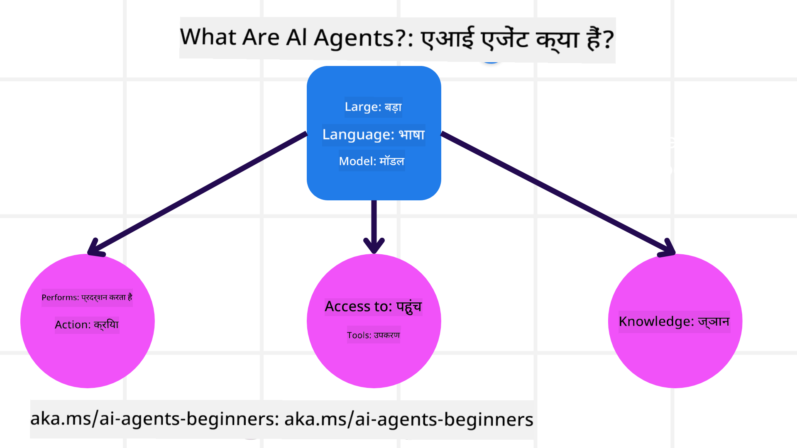
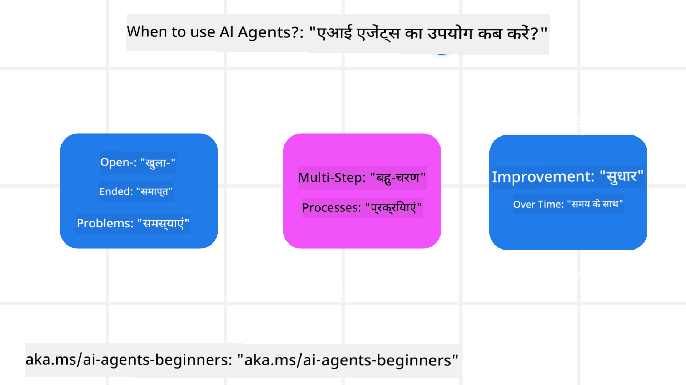

<!--
CO_OP_TRANSLATOR_METADATA:
{
  "original_hash": "d84943abc8f001ad4670418d32c2d899",
  "translation_date": "2025-07-12T08:03:51+00:00",
  "source_file": "01-intro-to-ai-agents/README.md",
  "language_code": "hi"
}
-->
अन्य शिक्षार्थियों और AI एजेंट बिल्डर्स से मिलने के लिए जुड़ें और इस कोर्स के बारे में अपने किसी भी सवाल को पूछें।

इस कोर्स को शुरू करने के लिए, हम पहले यह समझेंगे कि AI एजेंट क्या होते हैं और हम उन्हें अपने बनाए गए एप्लिकेशन और वर्कफ़्लो में कैसे उपयोग कर सकते हैं।

## परिचय

यह पाठ निम्नलिखित विषयों को कवर करता है:

- AI एजेंट क्या हैं और एजेंट के विभिन्न प्रकार कौन-कौन से हैं?
- AI एजेंट के लिए कौन से उपयोग के मामले सबसे उपयुक्त हैं और वे हमारी कैसे मदद कर सकते हैं?
- एजेंटिक समाधान डिजाइन करते समय कुछ बुनियादी निर्माण खंड क्या होते हैं?

## सीखने के लक्ष्य
इस पाठ को पूरा करने के बाद, आप सक्षम होंगे:

- AI एजेंट की अवधारणाओं को समझना और यह जानना कि वे अन्य AI समाधानों से कैसे भिन्न हैं।
- AI एजेंट्स को सबसे प्रभावी ढंग से लागू करना।
- उपयोगकर्ताओं और ग्राहकों दोनों के लिए उत्पादक रूप से एजेंटिक समाधान डिजाइन करना।

## AI एजेंट की परिभाषा और AI एजेंट के प्रकार

### AI एजेंट क्या हैं?

AI एजेंट वे **सिस्टम** हैं जो **लार्ज लैंग्वेज मॉडल्स (LLMs)** को **कार्रवाइयां करने** में सक्षम बनाते हैं, उनके कार्यक्षमता को बढ़ाते हुए LLMs को **उपकरणों** और **ज्ञान** तक पहुंच प्रदान करते हैं।

आइए इस परिभाषा को छोटे भागों में विभाजित करें:

- **सिस्टम** - एजेंट्स को केवल एक घटक के रूप में नहीं, बल्कि कई घटकों के सिस्टम के रूप में सोचना महत्वपूर्ण है। एक AI एजेंट के मूल स्तर पर घटक हैं:
  - **पर्यावरण (Environment)** - वह परिभाषित स्थान जहाँ AI एजेंट काम कर रहा होता है। उदाहरण के लिए, यदि हमारे पास एक ट्रैवल बुकिंग AI एजेंट है, तो पर्यावरण वह ट्रैवल बुकिंग सिस्टम हो सकता है जिसका उपयोग AI एजेंट कार्य पूरा करने के लिए करता है।
  - **सेंसर (Sensors)** - पर्यावरण में जानकारी होती है और यह प्रतिक्रिया प्रदान करता है। AI एजेंट सेंसर का उपयोग करके पर्यावरण की वर्तमान स्थिति के बारे में जानकारी एकत्रित और व्याख्या करता है। ट्रैवल बुकिंग एजेंट के उदाहरण में, ट्रैवल बुकिंग सिस्टम होटल की उपलब्धता या फ्लाइट की कीमत जैसी जानकारी प्रदान कर सकता है।
  - **एक्चुएटर्स (Actuators)** - जब AI एजेंट पर्यावरण की वर्तमान स्थिति प्राप्त कर लेता है, तो वह वर्तमान कार्य के लिए यह निर्धारित करता है कि पर्यावरण को बदलने के लिए कौन सी कार्रवाई करनी है। ट्रैवल बुकिंग एजेंट के लिए, यह उपयोगकर्ता के लिए उपलब्ध कमरे को बुक करना हो सकता है।

**लार्ज लैंग्वेज मॉडल्स** - एजेंट्स की अवधारणा LLMs के बनने से पहले भी मौजूद थी। LLMs के साथ AI एजेंट बनाने का लाभ उनकी मानव भाषा और डेटा को समझने की क्षमता है। यह क्षमता LLMs को पर्यावरणीय जानकारी की व्याख्या करने और पर्यावरण को बदलने की योजना बनाने में सक्षम बनाती है।

**कार्रवाइयां करना** - AI एजेंट सिस्टम के बाहर, LLMs केवल उन स्थितियों तक सीमित होते हैं जहाँ कार्रवाई उपयोगकर्ता के प्रॉम्प्ट के आधार पर सामग्री या जानकारी उत्पन्न करना होती है। AI एजेंट सिस्टम के अंदर, LLMs उपयोगकर्ता के अनुरोध की व्याख्या करके और उपलब्ध उपकरणों का उपयोग करके कार्य पूरा कर सकते हैं।

**उपकरणों तक पहुंच** - LLM को कौन से उपकरण उपलब्ध हैं, यह 1) उस पर्यावरण द्वारा निर्धारित होता है जिसमें वह काम कर रहा है और 2) AI एजेंट के डेवलपर द्वारा सीमित किया जा सकता है। हमारे ट्रैवल एजेंट उदाहरण में, एजेंट के उपकरण बुकिंग सिस्टम में उपलब्ध ऑपरेशनों तक सीमित हैं, और/या डेवलपर एजेंट की उपकरण पहुंच को उड़ानों तक सीमित कर सकता है।

**मेमोरी+ज्ञान** - मेमोरी बातचीत के संदर्भ में अल्पकालिक हो सकती है। दीर्घकालिक रूप से, पर्यावरण द्वारा प्रदान की गई जानकारी के अलावा, AI एजेंट अन्य सिस्टम, सेवाओं, उपकरणों और यहां तक कि अन्य एजेंटों से भी ज्ञान प्राप्त कर सकते हैं। ट्रैवल एजेंट उदाहरण में, यह ज्ञान उपयोगकर्ता की यात्रा प्राथमिकताओं की जानकारी हो सकती है जो ग्राहक डेटाबेस में स्थित है।

### एजेंट के विभिन्न प्रकार

अब जब हमारे पास AI एजेंट की सामान्य परिभाषा है, तो आइए कुछ विशिष्ट एजेंट प्रकारों को देखें और वे ट्रैवल बुकिंग AI एजेंट में कैसे लागू होंगे।

| **एजेंट प्रकार**                | **विवरण**                                                                                                                       | **उदाहरण**                                                                                                                                                                                                                   |
| ----------------------------- | ------------------------------------------------------------------------------------------------------------------------------------- | ----------------------------------------------------------------------------------------------------------------------------------------------------------------------------------------------------------------------------- |
| **सिंपल रिफ्लेक्स एजेंट्स**      | पूर्वनिर्धारित नियमों के आधार पर तुरंत कार्रवाई करते हैं।                                                                                  | ट्रैवल एजेंट ईमेल के संदर्भ को समझता है और यात्रा शिकायतों को ग्राहक सेवा को अग्रेषित करता है।                                                                                                                          |
| **मॉडल-आधारित रिफ्लेक्स एजेंट्स** | दुनिया के मॉडल और उस मॉडल में बदलाव के आधार पर कार्रवाई करते हैं।                                                              | ट्रैवल एजेंट ऐतिहासिक मूल्य निर्धारण डेटा तक पहुंच के आधार पर महत्वपूर्ण मूल्य परिवर्तनों वाले मार्गों को प्राथमिकता देता है।                                                                                                             |
| **गोल-आधारित एजेंट्स**         | विशिष्ट लक्ष्यों को प्राप्त करने के लिए योजना बनाते हैं, लक्ष्य की व्याख्या करते हैं और उसे प्राप्त करने के लिए कार्रवाई निर्धारित करते हैं।                                  | ट्रैवल एजेंट वर्तमान स्थान से गंतव्य तक आवश्यक यात्रा व्यवस्थाओं (कार, सार्वजनिक परिवहन, उड़ानें) को निर्धारित करके यात्रा बुक करता है।                                                                                |
| **यूटिलिटी-आधारित एजेंट्स**      | प्राथमिकताओं पर विचार करते हैं और लक्ष्यों को प्राप्त करने के लिए संख्यात्मक रूप से ट्रेडऑफ़ का मूल्यांकन करते हैं।                                               | ट्रैवल एजेंट यात्रा बुकिंग करते समय सुविधा और लागत के बीच संतुलन बनाकर यूटिलिटी को अधिकतम करता है।                                                                                                                                          |
| **लर्निंग एजेंट्स**           | प्रतिक्रिया के आधार पर समय के साथ सुधार करते हैं और तदनुसार कार्रवाई समायोजित करते हैं।                                                        | ट्रैवल एजेंट भविष्य की बुकिंग में सुधार करने के लिए यात्रा के बाद सर्वेक्षणों से ग्राहक प्रतिक्रिया का उपयोग करता है।                                                                                                               |
| **हायरार्किकल एजेंट्स**       | कई एजेंटों को एक स्तरित प्रणाली में शामिल करते हैं, जहाँ उच्च-स्तरीय एजेंट कार्यों को उप-कार्य में विभाजित करते हैं जिन्हें निम्न-स्तरीय एजेंट पूरा करते हैं। | ट्रैवल एजेंट यात्रा रद्द करने के लिए कार्य को उप-कार्य (जैसे, विशिष्ट बुकिंग रद्द करना) में विभाजित करता है और निम्न-स्तरीय एजेंट उन्हें पूरा करते हैं, फिर उच्च-स्तरीय एजेंट को रिपोर्ट करते हैं।                                     |
| **मल्टी-एजेंट सिस्टम्स (MAS)** | एजेंट स्वतंत्र रूप से कार्य पूरा करते हैं, चाहे सहयोगात्मक हों या प्रतिस्पर्धात्मक।                                                           | सहयोगात्मक: कई एजेंट होटल, उड़ानें, और मनोरंजन जैसी विशिष्ट यात्रा सेवाओं को बुक करते हैं। प्रतिस्पर्धात्मक: कई एजेंट साझा होटल बुकिंग कैलेंडर पर प्रबंधन और प्रतिस्पर्धा करते हैं ताकि ग्राहकों को होटल में बुक किया जा सके। |

## AI एजेंट कब उपयोग करें

पिछले अनुभाग में, हमने ट्रैवल एजेंट उपयोग-मामले का उपयोग करके समझाया कि विभिन्न प्रकार के एजेंट यात्रा बुकिंग के विभिन्न परिदृश्यों में कैसे उपयोग किए जा सकते हैं। हम इस एप्लिकेशन का उपयोग पूरे कोर्स में जारी रखेंगे।

आइए देखें कि AI एजेंट किन प्रकार के उपयोग मामलों के लिए सबसे उपयुक्त हैं:

- **खुले अंत वाले समस्याएं** - LLM को कार्य पूरा करने के लिए आवश्यक कदम निर्धारित करने देना क्योंकि इसे हमेशा वर्कफ़्लो में हार्डकोड नहीं किया जा सकता।
- **मल्टी-स्टेप प्रक्रियाएं** - ऐसे कार्य जिनमें जटिलता का स्तर होता है जहाँ AI एजेंट को एकल बार जानकारी प्राप्त करने के बजाय कई चरणों में उपकरणों या जानकारी का उपयोग करना पड़ता है।
- **समय के साथ सुधार** - ऐसे कार्य जहाँ एजेंट समय के साथ अपने पर्यावरण या उपयोगकर्ताओं से प्रतिक्रिया प्राप्त करके बेहतर उपयोगिता प्रदान करने के लिए सुधार कर सकता है।

हम AI एजेंट का उपयोग करते समय और विचारों को "Building Trustworthy AI Agents" पाठ में कवर करते हैं।

## एजेंटिक समाधानों के मूल बातें

### एजेंट विकास

AI एजेंट सिस्टम डिजाइन करने का पहला कदम उपकरणों, क्रियाओं और व्यवहारों को परिभाषित करना है। इस कोर्स में, हम अपने एजेंट्स को परिभाषित करने के लिए **Azure AI Agent Service** का उपयोग करते हैं। यह निम्नलिखित सुविधाएं प्रदान करता है:

- OpenAI, Mistral, और Llama जैसे खुले मॉडल का चयन
- Tripadvisor जैसे प्रदाताओं के माध्यम से लाइसेंस प्राप्त डेटा का उपयोग
- मानकीकृत OpenAPI 3.0 उपकरणों का उपयोग

### एजेंटिक पैटर्न

LLMs के साथ संचार प्रॉम्प्ट के माध्यम से होता है। AI एजेंट्स की अर्ध-स्वायत्त प्रकृति के कारण, पर्यावरण में बदलाव के बाद LLM को मैन्युअल रूप से पुनः प्रॉम्प्ट करना हमेशा संभव या आवश्यक नहीं होता। हम **एजेंटिक पैटर्न** का उपयोग करते हैं जो हमें कई चरणों में LLM को अधिक स्केलेबल तरीके से प्रॉम्प्ट करने की अनुमति देते हैं।

यह कोर्स वर्तमान लोकप्रिय एजेंटिक पैटर्न में विभाजित है।

### एजेंटिक फ्रेमवर्क

एजेंटिक फ्रेमवर्क डेवलपर्स को कोड के माध्यम से एजेंटिक पैटर्न लागू करने की अनुमति देते हैं। ये फ्रेमवर्क टेम्पलेट, प्लगइन्स, और बेहतर AI एजेंट सहयोग के लिए उपकरण प्रदान करते हैं। ये लाभ AI एजेंट सिस्टम की बेहतर अवलोकन क्षमता और समस्या निवारण की क्षमता प्रदान करते हैं।

इस कोर्स में, हम शोध-आधारित AutoGen फ्रेमवर्क और Semantic Kernel से उत्पादन-तैयार Agent फ्रेमवर्क का अन्वेषण करेंगे।

## पिछला पाठ

[Course Setup](../00-course-setup/README.md)

## अगला पाठ

[Exploring Agentic Frameworks](../02-explore-agentic-frameworks/README.md)

**अस्वीकरण**:  
यह दस्तावेज़ AI अनुवाद सेवा [Co-op Translator](https://github.com/Azure/co-op-translator) का उपयोग करके अनुवादित किया गया है। जबकि हम सटीकता के लिए प्रयासरत हैं, कृपया ध्यान दें कि स्वचालित अनुवादों में त्रुटियाँ या अशुद्धियाँ हो सकती हैं। मूल दस्तावेज़ अपनी मूल भाषा में ही अधिकारिक स्रोत माना जाना चाहिए। महत्वपूर्ण जानकारी के लिए, पेशेवर मानव अनुवाद की सलाह दी जाती है। इस अनुवाद के उपयोग से उत्पन्न किसी भी गलतफहमी या गलत व्याख्या के लिए हम जिम्मेदार नहीं हैं।