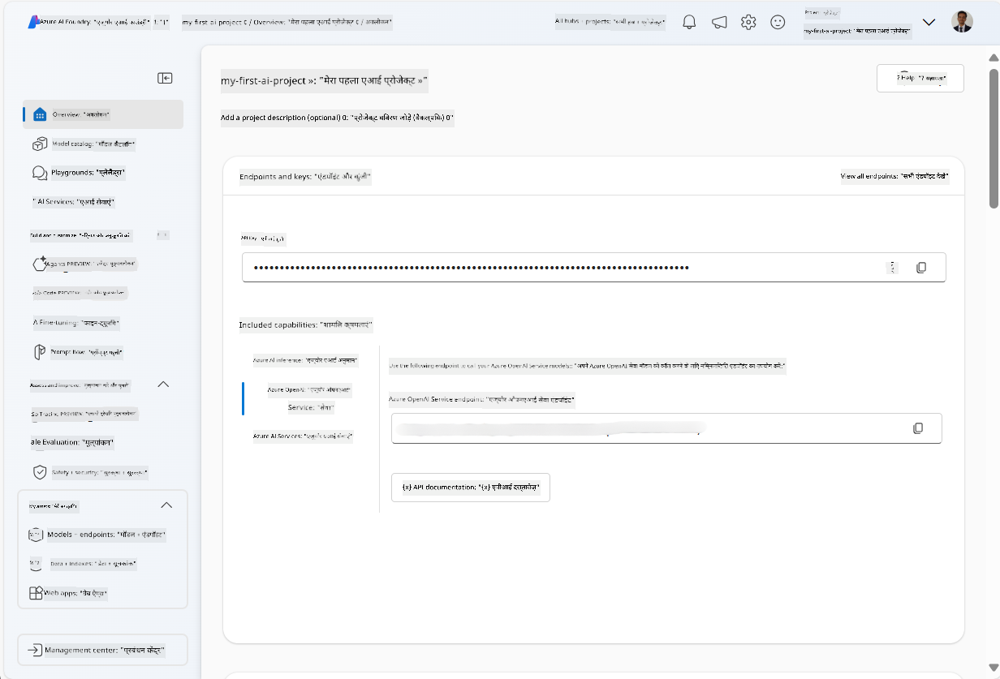
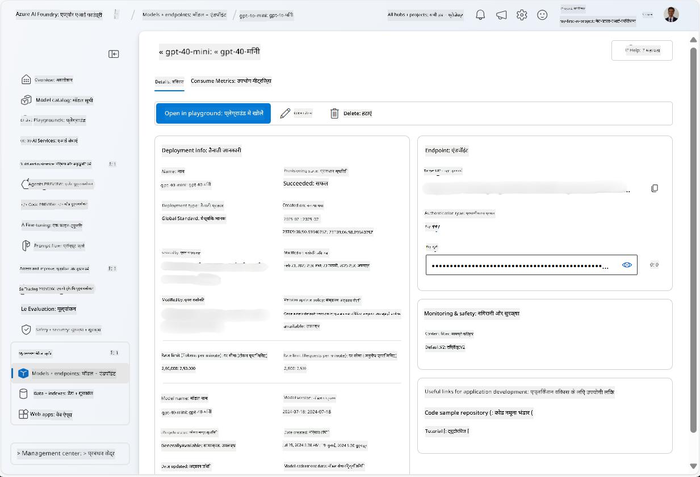
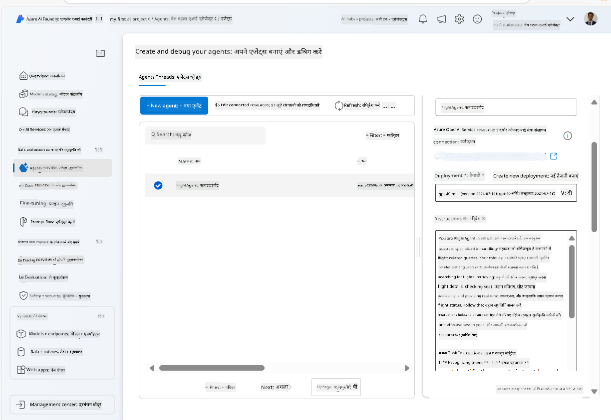
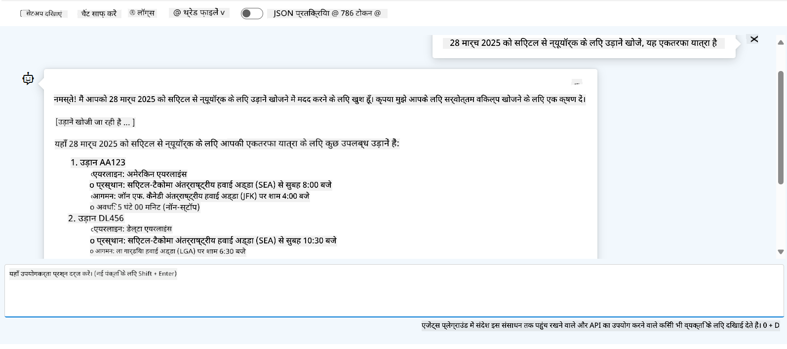

<!--
CO_OP_TRANSLATOR_METADATA:
{
  "original_hash": "7e92870dc0843e13d4dabc620c09d2d9",
  "translation_date": "2025-07-12T08:17:10+00:00",
  "source_file": "02-explore-agentic-frameworks/azure-ai-foundry-agent-creation.md",
  "language_code": "hi"
}
-->
# Azure AI Agent Service Development

इस अभ्यास में, आप [Azure AI Foundry portal](https://ai.azure.com/?WT.mc_id=academic-105485-koreyst) में Azure AI Agent सेवा उपकरणों का उपयोग करके Flight Booking के लिए एक एजेंट बनाएंगे। यह एजेंट उपयोगकर्ताओं के साथ बातचीत कर सकेगा और उड़ानों के बारे में जानकारी प्रदान करेगा।

## आवश्यकताएँ

इस अभ्यास को पूरा करने के लिए, आपके पास निम्नलिखित होना चाहिए:
1. एक Azure खाता जिसमें सक्रिय सदस्यता हो। [मुफ्त में खाता बनाएं](https://azure.microsoft.com/free/?WT.mc_id=academic-105485-koreyst)।
2. Azure AI Foundry हब बनाने की अनुमति या आपके लिए पहले से बना हुआ हब।
    - यदि आपकी भूमिका Contributor या Owner है, तो आप इस ट्यूटोरियल के चरणों का पालन कर सकते हैं।

## Azure AI Foundry हब बनाएं

> [!NOTE] Azure AI Foundry पहले Azure AI Studio के नाम से जाना जाता था।

1. Azure AI Foundry हब बनाने के लिए [Azure AI Foundry](https://learn.microsoft.com/en-us/azure/ai-studio/?WT.mc_id=academic-105485-koreyst) ब्लॉग पोस्ट में दिए गए निर्देशों का पालन करें।
2. जब आपका प्रोजेक्ट बन जाए, तो प्रदर्शित किसी भी टिप को बंद करें और Azure AI Foundry पोर्टल में प्रोजेक्ट पेज की समीक्षा करें, जो निम्नलिखित छवि जैसा दिखना चाहिए:

    

## मॉडल तैनात करें

1. अपने प्रोजेक्ट के बाएं पैन में, **My assets** सेक्शन में, **Models + endpoints** पेज चुनें।
2. **Models + endpoints** पेज में, **Model deployments** टैब में, **+ Deploy model** मेनू से **Deploy base model** चुनें।
3. सूची में `gpt-4o-mini` मॉडल खोजें, फिर उसे चुनें और पुष्टि करें।

    > [!NOTE] TPM कम करने से आपकी सदस्यता में उपलब्ध कोटा के अधिक उपयोग से बचा जा सकता है।

    

## एजेंट बनाएं

अब जब आपने मॉडल तैनात कर दिया है, तो आप एक एजेंट बना सकते हैं। एजेंट एक संवादात्मक AI मॉडल होता है जिसका उपयोग उपयोगकर्ताओं के साथ बातचीत के लिए किया जाता है।

1. अपने प्रोजेक्ट के बाएं पैन में, **Build & Customize** सेक्शन में, **Agents** पेज चुनें।
2. नया एजेंट बनाने के लिए **+ Create agent** पर क्लिक करें। **Agent Setup** डायलॉग बॉक्स में:
    - एजेंट के लिए एक नाम दर्ज करें, जैसे `FlightAgent`।
    - सुनिश्चित करें कि आपने पहले जो `gpt-4o-mini` मॉडल तैनात किया था, वह चुना हुआ हो।
    - एजेंट को दिए जाने वाले निर्देश (Instructions) सेट करें। उदाहरण के लिए:
    ```
    You are FlightAgent, a virtual assistant specialized in handling flight-related queries. Your role includes assisting users with searching for flights, retrieving flight details, checking seat availability, and providing real-time flight status. Follow the instructions below to ensure clarity and effectiveness in your responses:

    ### Task Instructions:
    1. **Recognizing Intent**:
       - Identify the user's intent based on their request, focusing on one of the following categories:
         - Searching for flights
         - Retrieving flight details using a flight ID
         - Checking seat availability for a specified flight
         - Providing real-time flight status using a flight number
       - If the intent is unclear, politely ask users to clarify or provide more details.
        
    2. **Processing Requests**:
        - Depending on the identified intent, perform the required task:
        - For flight searches: Request details such as origin, destination, departure date, and optionally return date.
        - For flight details: Request a valid flight ID.
        - For seat availability: Request the flight ID and date and validate inputs.
        - For flight status: Request a valid flight number.
        - Perform validations on provided data (e.g., formats of dates, flight numbers, or IDs). If the information is incomplete or invalid, return a friendly request for clarification.

    3. **Generating Responses**:
    - Use a tone that is friendly, concise, and supportive.
    - Provide clear and actionable suggestions based on the output of each task.
    - If no data is found or an error occurs, explain it to the user gently and offer alternative actions (e.g., refine search, try another query).
    
    ```
> [!NOTE]
> विस्तृत प्रॉम्प्ट के लिए, आप [इस रिपॉजिटरी](https://github.com/ShivamGoyal03/RoamMind) को देख सकते हैं।

> इसके अलावा, आप एजेंट की क्षमताओं को बढ़ाने के लिए **Knowledge Base** और **Actions** जोड़ सकते हैं ताकि वह उपयोगकर्ता अनुरोधों के आधार पर अधिक जानकारी प्रदान कर सके और स्वचालित कार्य कर सके। इस अभ्यास के लिए, आप इन चरणों को छोड़ सकते हैं।



3. नया मल्टी-AI एजेंट बनाने के लिए, बस **New Agent** पर क्लिक करें। नया बनाया गया एजेंट Agents पेज पर दिखेगा।

## एजेंट का परीक्षण करें

एजेंट बनाने के बाद, आप इसे Azure AI Foundry पोर्टल के प्लेग्राउंड में उपयोगकर्ता प्रश्नों के प्रति प्रतिक्रिया देने के लिए परीक्षण कर सकते हैं।

1. अपने एजेंट के **Setup** पैन के शीर्ष पर, **Try in playground** चुनें।
2. **Playground** पैन में, आप चैट विंडो में प्रश्न टाइप करके एजेंट के साथ बातचीत कर सकते हैं। उदाहरण के लिए, आप एजेंट से 28 तारीख को Seattle से New York के लिए उड़ान खोजने को कह सकते हैं।

    > [!NOTE] एजेंट सटीक उत्तर न दे सके क्योंकि इस अभ्यास में कोई वास्तविक समय डेटा उपयोग नहीं किया जा रहा है। उद्देश्य एजेंट की उपयोगकर्ता प्रश्नों को समझने और दिए गए निर्देशों के आधार पर प्रतिक्रिया देने की क्षमता का परीक्षण करना है।

    

3. एजेंट का परीक्षण करने के बाद, आप इसे और अधिक intents, प्रशिक्षण डेटा, और actions जोड़कर उसकी क्षमताओं को बढ़ा सकते हैं।

## संसाधनों को साफ़ करें

जब आप एजेंट का परीक्षण पूरा कर लें, तो अतिरिक्त लागत से बचने के लिए इसे हटा सकते हैं।
1. [Azure portal](https://portal.azure.com) खोलें और उस resource group की सामग्री देखें जहाँ आपने इस अभ्यास में हब संसाधन तैनात किए थे।
2. टूलबार में, **Delete resource group** चुनें।
3. resource group का नाम दर्ज करें और पुष्टि करें कि आप इसे हटाना चाहते हैं।

## संसाधन

- [Azure AI Foundry documentation](https://learn.microsoft.com/en-us/azure/ai-studio/?WT.mc_id=academic-105485-koreyst)
- [Azure AI Foundry portal](https://ai.azure.com/?WT.mc_id=academic-105485-koreyst)
- [Getting Started with Azure AI Studio](https://techcommunity.microsoft.com/blog/educatordeveloperblog/getting-started-with-azure-ai-studio/4095602?WT.mc_id=academic-105485-koreyst)
- [Fundamentals of AI agents on Azure](https://learn.microsoft.com/en-us/training/modules/ai-agent-fundamentals/?WT.mc_id=academic-105485-koreyst)
- [Azure AI Discord](https://aka.ms/AzureAI/Discord)

**अस्वीकरण**:  
यह दस्तावेज़ AI अनुवाद सेवा [Co-op Translator](https://github.com/Azure/co-op-translator) का उपयोग करके अनुवादित किया गया है। जबकि हम सटीकता के लिए प्रयासरत हैं, कृपया ध्यान दें कि स्वचालित अनुवादों में त्रुटियाँ या अशुद्धियाँ हो सकती हैं। मूल दस्तावेज़ अपनी मूल भाषा में ही अधिकारिक स्रोत माना जाना चाहिए। महत्वपूर्ण जानकारी के लिए, पेशेवर मानव अनुवाद की सलाह दी जाती है। इस अनुवाद के उपयोग से उत्पन्न किसी भी गलतफहमी या गलत व्याख्या के लिए हम जिम्मेदार नहीं हैं।