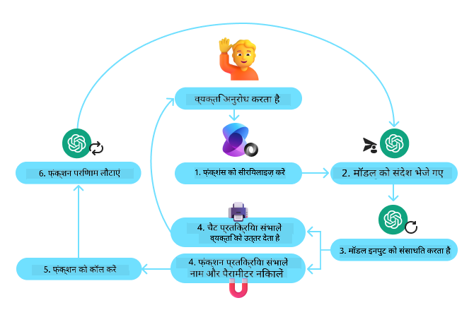
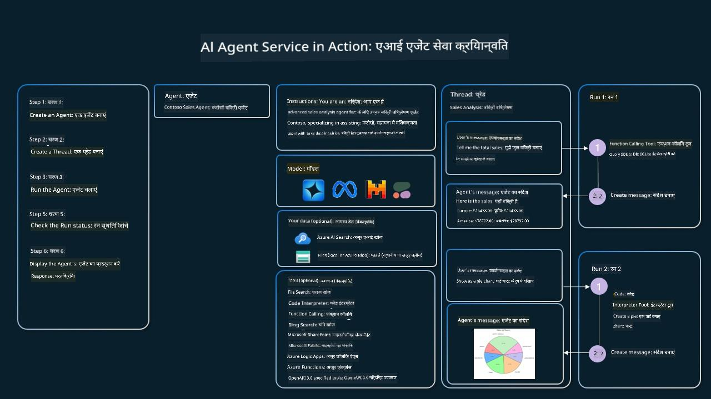

<!--
CO_OP_TRANSLATOR_METADATA:
{
  "original_hash": "88258b03f2893aa2e69eb8fb24baabbc",
  "translation_date": "2025-07-12T09:28:30+00:00",
  "source_file": "04-tool-use/README.md",
  "language_code": "hi"
}
-->
[](https://youtu.be/vieRiPRx-gI?si=cEZ8ApnT6Sus9rhn)

> _(इस पाठ का वीडियो देखने के लिए ऊपर की छवि पर क्लिक करें)_

# टूल उपयोग डिज़ाइन पैटर्न

टूल्स दिलचस्प होते हैं क्योंकि वे AI एजेंट्स को अधिक व्यापक क्षमताएँ प्रदान करते हैं। एजेंट के पास सीमित क्रियाओं का सेट होने के बजाय, एक टूल जोड़ने से एजेंट अब कई तरह की क्रियाएँ कर सकता है। इस अध्याय में, हम टूल उपयोग डिज़ाइन पैटर्न को देखेंगे, जो बताता है कि AI एजेंट्स अपने लक्ष्यों को प्राप्त करने के लिए विशिष्ट टूल्स का उपयोग कैसे कर सकते हैं।

## परिचय

इस पाठ में, हम निम्नलिखित प्रश्नों के उत्तर खोजने का प्रयास करेंगे:

- टूल उपयोग डिज़ाइन पैटर्न क्या है?
- इसे किन उपयोग मामलों में लागू किया जा सकता है?
- डिज़ाइन पैटर्न को लागू करने के लिए किन तत्वों/निर्माण खंडों की आवश्यकता होती है?
- भरोसेमंद AI एजेंट बनाने के लिए टूल उपयोग डिज़ाइन पैटर्न का उपयोग करते समय किन विशेष बातों का ध्यान रखना चाहिए?

## सीखने के लक्ष्य

इस पाठ को पूरा करने के बाद, आप सक्षम होंगे:

- टूल उपयोग डिज़ाइन पैटर्न और इसके उद्देश्य को परिभाषित करना।
- उन उपयोग मामलों की पहचान करना जहाँ टूल उपयोग डिज़ाइन पैटर्न लागू होता है।
- डिज़ाइन पैटर्न को लागू करने के लिए आवश्यक मुख्य तत्वों को समझना।
- इस डिज़ाइन पैटर्न का उपयोग करने वाले AI एजेंट्स में विश्वसनीयता सुनिश्चित करने के लिए विचारों को पहचानना।

## टूल उपयोग डिज़ाइन पैटर्न क्या है?

**टूल उपयोग डिज़ाइन पैटर्न** LLMs को बाहरी टूल्स के साथ इंटरैक्ट करने की क्षमता देने पर केंद्रित है ताकि वे विशिष्ट लक्ष्यों को प्राप्त कर सकें। टूल्स ऐसे कोड होते हैं जिन्हें एजेंट द्वारा क्रियान्वित किया जा सकता है। एक टूल एक सरल फ़ंक्शन हो सकता है जैसे कैलकुलेटर, या तीसरे पक्ष की सेवा के लिए API कॉल जैसे स्टॉक प्राइस लुकअप या मौसम पूर्वानुमान। AI एजेंट्स के संदर्भ में, टूल्स को एजेंट्स द्वारा **मॉडल-जनित फ़ंक्शन कॉल्स** के जवाब में चलाने के लिए डिज़ाइन किया जाता है।

## इसे किन उपयोग मामलों में लागू किया जा सकता है?

AI एजेंट्स टूल्स का उपयोग जटिल कार्यों को पूरा करने, जानकारी प्राप्त करने, या निर्णय लेने के लिए कर सकते हैं। टूल उपयोग डिज़ाइन पैटर्न अक्सर उन परिदृश्यों में उपयोग किया जाता है जहाँ बाहरी सिस्टम्स जैसे डेटाबेस, वेब सेवाएँ, या कोड इंटरप्रेटर के साथ गतिशील इंटरैक्शन की आवश्यकता होती है। यह कई उपयोग मामलों के लिए उपयोगी है, जिनमें शामिल हैं:

- **गतिशील सूचना प्राप्ति:** एजेंट्स बाहरी APIs या डेटाबेस से नवीनतम डेटा प्राप्त कर सकते हैं (जैसे, डेटा विश्लेषण के लिए SQLite डेटाबेस से क्वेरी करना, स्टॉक प्राइस या मौसम की जानकारी लेना)।
- **कोड निष्पादन और व्याख्या:** एजेंट्स गणितीय समस्याओं को हल करने, रिपोर्ट बनाने, या सिमुलेशन करने के लिए कोड या स्क्रिप्ट्स चला सकते हैं।
- **वर्कफ़्लो स्वचालन:** टास्क शेड्यूलर, ईमेल सेवाएँ, या डेटा पाइपलाइनों जैसे टूल्स को एकीकृत करके दोहराए जाने वाले या बहु-चरण वर्कफ़्लो को स्वचालित करना।
- **ग्राहक सहायता:** एजेंट्स CRM सिस्टम, टिकटिंग प्लेटफ़ॉर्म, या नॉलेज बेस के साथ इंटरैक्ट करके उपयोगकर्ता प्रश्नों का समाधान कर सकते हैं।
- **सामग्री निर्माण और संपादन:** एजेंट्स ग्रामर चेकर, टेक्स्ट समरी, या कंटेंट सेफ्टी इवैल्युएटर जैसे टूल्स का उपयोग सामग्री निर्माण कार्यों में सहायता के लिए कर सकते हैं।

## टूल उपयोग डिज़ाइन पैटर्न को लागू करने के लिए किन तत्वों/निर्माण खंडों की आवश्यकता होती है?

ये निर्माण खंड AI एजेंट को विभिन्न कार्यों को करने में सक्षम बनाते हैं। आइए टूल उपयोग डिज़ाइन पैटर्न को लागू करने के लिए आवश्यक मुख्य तत्वों को देखें:

- **फ़ंक्शन/टूल स्कीमाज़**: उपलब्ध टूल्स की विस्तृत परिभाषाएँ, जिनमें फ़ंक्शन का नाम, उद्देश्य, आवश्यक पैरामीटर, और अपेक्षित आउटपुट शामिल हैं। ये स्कीमाज़ LLM को यह समझने में मदद करती हैं कि कौन से टूल उपलब्ध हैं और वैध अनुरोध कैसे बनाएँ।

- **फ़ंक्शन निष्पादन लॉजिक**: यह नियंत्रित करता है कि उपयोगकर्ता की मंशा और बातचीत के संदर्भ के आधार पर टूल्स कब और कैसे कॉल किए जाएं। इसमें प्लानर मॉड्यूल, रूटिंग मैकेनिज्म, या कंडीशनल फ्लो शामिल हो सकते हैं जो टूल उपयोग को गतिशील रूप से निर्धारित करते हैं।

- **संदेश प्रबंधन प्रणाली**: ऐसे घटक जो उपयोगकर्ता इनपुट, LLM प्रतिक्रियाओं, टूल कॉल्स, और टूल आउटपुट के बीच संवाद प्रवाह को प्रबंधित करते हैं।

- **टूल एकीकरण फ्रेमवर्क**: वह इन्फ्रास्ट्रक्चर जो एजेंट को विभिन्न टूल्स से जोड़ता है, चाहे वे सरल फ़ंक्शन हों या जटिल बाहरी सेवाएँ।

- **त्रुटि प्रबंधन और सत्यापन**: टूल निष्पादन में विफलताओं को संभालने, पैरामीटरों को सत्यापित करने, और अप्रत्याशित प्रतिक्रियाओं को प्रबंधित करने के लिए तंत्र।

- **स्थिति प्रबंधन**: बातचीत के संदर्भ, पिछले टूल इंटरैक्शन, और स्थायी डेटा को ट्रैक करता है ताकि बहु-चरण इंटरैक्शन में निरंतरता बनी रहे।

अब, आइए फ़ंक्शन/टूल कॉलिंग को विस्तार से देखें।

### फ़ंक्शन/टूल कॉलिंग

फ़ंक्शन कॉलिंग वह मुख्य तरीका है जिससे हम LLMs को टूल्स के साथ इंटरैक्ट करने में सक्षम बनाते हैं। आप अक्सर 'फ़ंक्शन' और 'टूल' को एक-दूसरे के स्थान पर उपयोग करते देखेंगे क्योंकि 'फ़ंक्शन' (पुन: उपयोग योग्य कोड के ब्लॉक) वे 'टूल' हैं जिनका एजेंट कार्यों को पूरा करने के लिए उपयोग करते हैं। किसी फ़ंक्शन के कोड को कॉल करने के लिए, LLM को उपयोगकर्ता के अनुरोध की तुलना फ़ंक्शन के विवरण से करनी होती है। इसके लिए, सभी उपलब्ध फ़ंक्शन्स के विवरण वाला एक स्कीमा LLM को भेजा जाता है। LLM फिर कार्य के लिए सबसे उपयुक्त फ़ंक्शन चुनता है और उसका नाम और तर्क लौटाता है। चुना गया फ़ंक्शन कॉल किया जाता है, उसका उत्तर LLM को भेजा जाता है, जो उस जानकारी का उपयोग उपयोगकर्ता के अनुरोध का जवाब देने के लिए करता है।

डेवलपर्स के लिए एजेंट्स के लिए फ़ंक्शन कॉलिंग लागू करने के लिए आपको चाहिए:

1. एक LLM मॉडल जो फ़ंक्शन कॉलिंग का समर्थन करता हो
2. फ़ंक्शन विवरणों वाला स्कीमा
3. प्रत्येक फ़ंक्शन के लिए कोड जो वर्णित हो

आइए एक उदाहरण के रूप में किसी शहर का वर्तमान समय प्राप्त करने का उदाहरण लें:

1. **फ़ंक्शन कॉलिंग समर्थित LLM को इनिशियलाइज़ करें:**

    सभी मॉडल फ़ंक्शन कॉलिंग का समर्थन नहीं करते, इसलिए यह जांचना महत्वपूर्ण है कि आप जो LLM उपयोग कर रहे हैं वह करता है या नहीं। <a href="https://learn.microsoft.com/azure/ai-services/openai/how-to/function-calling" target="_blank">Azure OpenAI</a> फ़ंक्शन कॉलिंग का समर्थन करता है। हम Azure OpenAI क्लाइंट को इनिशियलाइज़ करके शुरू कर सकते हैं।

    ```python
    # Initialize the Azure OpenAI client
    client = AzureOpenAI(
        azure_endpoint = os.getenv("AZURE_OPENAI_ENDPOINT"), 
        api_key=os.getenv("AZURE_OPENAI_API_KEY"),  
        api_version="2024-05-01-preview"
    )
    ```

1. **फ़ंक्शन स्कीमा बनाएं:**

    अगला कदम एक JSON स्कीमा परिभाषित करना है जिसमें फ़ंक्शन का नाम, फ़ंक्शन क्या करता है इसका विवरण, और फ़ंक्शन पैरामीटर के नाम और विवरण शामिल हों। फिर हम इस स्कीमा को पहले बनाए गए क्लाइंट को उपयोगकर्ता के अनुरोध के साथ पास करेंगे, जैसे कि सैन फ्रांसिस्को में समय जानना। ध्यान देने वाली बात यह है कि **टूल कॉल** वापस किया जाता है, प्रश्न का अंतिम उत्तर नहीं। जैसा कि पहले बताया गया, LLM उस फ़ंक्शन का नाम लौटाता है जिसे उसने कार्य के लिए चुना है, और तर्क जो उसे पास किए जाएंगे।

    ```python
    # Function description for the model to read
    tools = [
        {
            "type": "function",
            "function": {
                "name": "get_current_time",
                "description": "Get the current time in a given location",
                "parameters": {
                    "type": "object",
                    "properties": {
                        "location": {
                            "type": "string",
                            "description": "The city name, e.g. San Francisco",
                        },
                    },
                    "required": ["location"],
                },
            }
        }
    ]
    ```
   
    ```python
  
    # Initial user message
    messages = [{"role": "user", "content": "What's the current time in San Francisco"}] 
  
    # First API call: Ask the model to use the function
      response = client.chat.completions.create(
          model=deployment_name,
          messages=messages,
          tools=tools,
          tool_choice="auto",
      )
  
      # Process the model's response
      response_message = response.choices[0].message
      messages.append(response_message)
  
      print("Model's response:")  

      print(response_message)
  
    ```

    ```bash
    Model's response:
    ChatCompletionMessage(content=None, role='assistant', function_call=None, tool_calls=[ChatCompletionMessageToolCall(id='call_pOsKdUlqvdyttYB67MOj434b', function=Function(arguments='{"location":"San Francisco"}', name='get_current_time'), type='function')])
    ```
  
1. **कार्य को पूरा करने के लिए आवश्यक फ़ंक्शन कोड:**

    अब जब LLM ने चुना है कि कौन सा फ़ंक्शन चलाना है, तो उस कार्य को पूरा करने वाला कोड लागू और निष्पादित किया जाना चाहिए। हम Python में वर्तमान समय प्राप्त करने के लिए कोड लिख सकते हैं। हमें response_message से नाम और तर्क निकालने के लिए भी कोड लिखना होगा ताकि अंतिम परिणाम प्राप्त हो सके।

    ```python
      def get_current_time(location):
        """Get the current time for a given location"""
        print(f"get_current_time called with location: {location}")  
        location_lower = location.lower()
        
        for key, timezone in TIMEZONE_DATA.items():
            if key in location_lower:
                print(f"Timezone found for {key}")  
                current_time = datetime.now(ZoneInfo(timezone)).strftime("%I:%M %p")
                return json.dumps({
                    "location": location,
                    "current_time": current_time
                })
      
        print(f"No timezone data found for {location_lower}")  
        return json.dumps({"location": location, "current_time": "unknown"})
    ```

    ```python
     # Handle function calls
      if response_message.tool_calls:
          for tool_call in response_message.tool_calls:
              if tool_call.function.name == "get_current_time":
     
                  function_args = json.loads(tool_call.function.arguments)
     
                  time_response = get_current_time(
                      location=function_args.get("location")
                  )
     
                  messages.append({
                      "tool_call_id": tool_call.id,
                      "role": "tool",
                      "name": "get_current_time",
                      "content": time_response,
                  })
      else:
          print("No tool calls were made by the model.")  
  
      # Second API call: Get the final response from the model
      final_response = client.chat.completions.create(
          model=deployment_name,
          messages=messages,
      )
  
      return final_response.choices[0].message.content
     ```

    ```bash
      get_current_time called with location: San Francisco
      Timezone found for san francisco
      The current time in San Francisco is 09:24 AM.
     ```

फ़ंक्शन कॉलिंग अधिकांश, यदि सभी नहीं, एजेंट टूल उपयोग डिज़ाइन का मूल है, हालांकि इसे शून्य से लागू करना कभी-कभी चुनौतीपूर्ण हो सकता है। जैसा कि हमने [Lesson 2](../../../02-explore-agentic-frameworks) में सीखा, एजेंटिक फ्रेमवर्क्स हमें टूल उपयोग को लागू करने के लिए पूर्व-निर्मित निर्माण खंड प्रदान करते हैं।

## एजेंटिक फ्रेमवर्क्स के साथ टूल उपयोग के उदाहरण

यहाँ कुछ उदाहरण हैं कि आप विभिन्न एजेंटिक फ्रेमवर्क्स का उपयोग करके टूल उपयोग डिज़ाइन पैटर्न को कैसे लागू कर सकते हैं:

### Semantic Kernel

<a href="https://learn.microsoft.com/azure/ai-services/agents/overview" target="_blank">Semantic Kernel</a> एक ओपन-सोर्स AI फ्रेमवर्क है जो .NET, Python, और Java डेवलपर्स के लिए LLMs के साथ काम करना आसान बनाता है। यह फ़ंक्शन कॉलिंग की प्रक्रिया को सरल बनाता है, अपने आप आपके फ़ंक्शन्स और उनके पैरामीटरों का मॉडल को वर्णन करता है, जिसे <a href="https://learn.microsoft.com/semantic-kernel/concepts/ai-services/chat-completion/function-calling/?pivots=programming-language-python#1-serializing-the-functions" target="_blank">सीरियलाइज़िंग</a> कहा जाता है। यह मॉडल और आपके कोड के बीच संवाद को भी संभालता है। Semantic Kernel जैसे एजेंटिक फ्रेमवर्क का एक और फायदा यह है कि यह पूर्व-निर्मित टूल्स जैसे <a href="https://github.com/microsoft/semantic-kernel/blob/main/python/samples/getting_started_with_agents/openai_assistant/step4_assistant_tool_file_search.py" target="_blank">File Search</a> और <a href="https://github.com/microsoft/semantic-kernel/blob/main/python/samples/getting_started_with_agents/openai_assistant/step3_assistant_tool_code_interpreter.py" target="_blank">Code Interpreter</a> तक पहुंच प्रदान करता है।

निम्नलिखित आरेख Semantic Kernel के साथ फ़ंक्शन कॉलिंग की प्रक्रिया को दर्शाता है:



Semantic Kernel में फ़ंक्शन्स/टूल्स को <a href="https://learn.microsoft.com/semantic-kernel/concepts/plugins/?pivots=programming-language-python" target="_blank">Plugins</a> कहा जाता है। हम पहले देखे गए `get_current_time` फ़ंक्शन को एक क्लास में बदलकर एक प्लगइन बना सकते हैं जिसमें वह फ़ंक्शन हो। हम `kernel_function` डेकोरेटर भी इम्पोर्ट कर सकते हैं, जो फ़ंक्शन के विवरण को लेता है। जब आप GetCurrentTimePlugin के साथ एक kernel बनाते हैं, तो kernel अपने आप फ़ंक्शन और उसके पैरामीटरों को सीरियलाइज़ करता है, जिससे LLM को भेजने के लिए स्कीमा बनता है।

```python
from semantic_kernel.functions import kernel_function

class GetCurrentTimePlugin:
    async def __init__(self, location):
        self.location = location

    @kernel_function(
        description="Get the current time for a given location"
    )
    def get_current_time(location: str = ""):
        ...

```

```python 
from semantic_kernel import Kernel

# Create the kernel
kernel = Kernel()

# Create the plugin
get_current_time_plugin = GetCurrentTimePlugin(location)

# Add the plugin to the kernel
kernel.add_plugin(get_current_time_plugin)
```
  
### Azure AI Agent Service

<a href="https://learn.microsoft.com/azure/ai-services/agents/overview" target="_blank">Azure AI Agent Service</a> एक नया एजेंटिक फ्रेमवर्क है जिसे डेवलपर्स को सुरक्षित रूप से उच्च गुणवत्ता वाले, विस्तार योग्य AI एजेंट्स बनाने, तैनात करने, और स्केल करने के लिए डिज़ाइन किया गया है, बिना अंतर्निहित कंप्यूट और स्टोरेज संसाधनों का प्रबंधन किए। यह विशेष रूप से एंटरप्राइज़ अनुप्रयोगों के लिए उपयोगी है क्योंकि यह एक पूर्ण प्रबंधित सेवा है जिसमें एंटरप्राइज़ स्तर की सुरक्षा होती है।

LLM API के सीधे विकास की तुलना में, Azure AI Agent Service कुछ फायदे प्रदान करता है, जिनमें शामिल हैं:

- स्वचालित टूल कॉलिंग – टूल कॉल को पार्स करने, टूल को कॉल करने, और प्रतिक्रिया को संभालने की आवश्यकता नहीं; यह सब अब सर्वर-साइड किया जाता है
- सुरक्षित रूप से प्रबंधित डेटा – अपनी बातचीत की स्थिति प्रबंधित करने के बजाय, आप थ्रेड्स पर भरोसा कर सकते हैं जो सभी आवश्यक जानकारी संग्रहीत करते हैं
- तैयार-से-उपयोग टूल्स – ऐसे टूल्स जो आपके डेटा स्रोतों के साथ इंटरैक्ट करने के लिए उपलब्ध हैं, जैसे Bing, Azure AI Search, और Azure Functions।

Azure AI Agent Service में उपलब्ध टूल्स को दो श्रेणियों में बांटा जा सकता है:

1. नॉलेज टूल्स:
    - <a href="https://learn.microsoft.com/azure/ai-services/agents/how-to/tools/bing-grounding?tabs=python&pivots=overview" target="_blank">Bing Search के साथ ग्राउंडिंग</a>
    - <a href="https://learn.microsoft.com/azure/ai-services/agents/how-to/tools/file-search?tabs=python&pivots=overview" target="_blank">File Search</a>
    - <a href="https://learn.microsoft.com/azure/ai-services/agents/how-to/tools/azure-ai-search?tabs=azurecli%2Cpython&pivots=overview-azure-ai-search" target="_blank">Azure AI Search</a>

2. एक्शन टूल्स:
    - <a href="https://learn.microsoft.com/azure/ai-services/agents/how-to/tools/function-calling?tabs=python&pivots=overview" target="_blank">Function Calling</a>
    - <a href="https://learn.microsoft.com/azure/ai-services/agents/how-to/tools/code-interpreter?tabs=python&pivots=overview" target="_blank">Code Interpreter</a>
    - <a href="https://learn.microsoft.com/azure/ai-services/agents/how-to/tools/openapi-spec?tabs=python&pivots=overview" target="_blank">OpenAI परिभाषित टूल्स</a>
    - <a href="https://learn.microsoft.com/azure/ai-services/agents/how-to/tools/azure-functions?pivots=overview" target="_blank">Azure Functions</a>

Agent Service हमें इन टूल्स को एक `toolset` के रूप में एक साथ उपयोग करने की अनुमति देता है। यह `threads` का भी उपयोग करता है जो किसी विशेष बातचीत के संदेशों के इतिहास को ट्रैक करते हैं।

कल्पना करें कि आप Contoso नामक कंपनी में एक सेल्स एजेंट हैं। आप एक संवादात्मक एजेंट विकसित करना चाहते हैं जो आपकी सेल्स डेटा के बारे में प्रश्नों का उत्तर दे सके।

निम्नलिखित छवि दिखाती है कि आप Azure AI Agent Service का उपयोग करके अपनी सेल्स डेटा का विश्लेषण कैसे कर सकते हैं:



सेवा के साथ इन टूल्स में से किसी का उपयोग करने के लिए, हम एक क्लाइंट बना सकते हैं और एक टूल या टूलसेट परिभाषित कर सकते हैं। व्यावहारिक रूप से इसे लागू करने के लिए हम निम्न Python कोड का उपयोग कर सकते हैं। LLM टूलसेट को देखकर निर्णय ले सकेगा कि उपयोगकर्ता द्वारा बनाए गए फ़ंक्शन `fetch_sales_data_using_sqlite_query` का उपयोग करना है या पूर्व-निर्मित Code Interpreter का, यह उपयोगकर्ता के अनुरोध पर निर्भर करेगा।

```python 
import os
from azure.ai.projects import AIProjectClient
from azure.identity import DefaultAzureCredential
from fecth_sales_data_functions import fetch_sales_data_using_sqlite_query # fetch_sales_data_using_sqlite_query function which can be found in a fetch_sales_data_functions.py file.
from azure.ai.projects.models import ToolSet, FunctionTool, CodeInterpreterTool

project_client = AIProjectClient.from_connection_string(
    credential=DefaultAzureCredential(),
    conn_str=os.environ["PROJECT_CONNECTION_STRING"],
)

# Initialize function calling agent with the fetch_sales_data_using_sqlite_query function and adding it to the toolset
fetch_data_function = FunctionTool(fetch_sales_data_using_sqlite_query)
toolset = ToolSet()
toolset.add(fetch_data_function)

# Initialize Code Interpreter tool and adding it to the toolset. 
code_interpreter = code_interpreter = CodeInterpreterTool()
toolset = ToolSet()
toolset.add(code_interpreter)

agent = project_client.agents.create_agent(
    model="gpt-4o-mini", name="my-agent", instructions="You are helpful agent", 
    toolset=toolset
)
```

## भरोसेमंद AI एजेंट बनाने के लिए टूल उपयोग डिज़ाइन पैटर्न का उपयोग करते समय विशेष विचार क्या हैं?

LLMs द्वारा डायनामिक रूप से जनरेट किए गए SQL के साथ एक सामान्य चिंता सुरक्षा है, विशेष रूप से SQL इंजेक्शन या दुर्भावनापूर्ण क्रियाओं का जोखिम, जैसे डेटाबेस को ड्रॉप करना या छेड़छाड़ करना। ये चिंताएँ वैध हैं, लेकिन इन्हें डेटाबेस एक्सेस अनुमतियों को सही तरीके से कॉन्फ़िगर करके प्रभावी ढंग से कम किया जा सकता है। अधिकांश डेटाबेस के लिए इसका मतलब है डेटाबेस को केवल पढ़ने योग्य (read-only) के रूप में कॉन्फ़िगर करना। PostgreSQL या Azure SQL जैसी डेटाबेस सेवाओं के लिए, ऐप को केवल पढ़ने योग्य (SELECT) भूमिका दी जानी चाहिए।

ऐप को सुरक्षित वातावरण में चलाना सुरक्षा को और बढ़ाता है। एंटरप्राइज़ परिदृश्यों में, डेटा आमतौर पर परिचालन प्रणालियों से निकाला और परिवर्तित किया जाता है और एक पढ़ने योग्य डेटाबेस या डेटा वेयरहाउस में रखा जाता है जिसमें उपयोगकर्ता के अनुकूल स्कीमा होता है। यह दृष्टिकोण सुनिश्चित करता है कि डेटा सुरक्षित है, प्रदर्शन और पहुंच के लिए अनुकूलित है, और ऐप को सीमित, केवल पढ़ने योग्य पहुंच प्राप्त है।

## अतिरिक्त संसाधन

-

Azure AI Agents Service Workshop</a>
- <a href="https://github.com/Azure-Samples/contoso-creative-writer/tree/main/docs/workshop" target="_blank">Contoso Creative Writer Multi-Agent Workshop</a>
- <a href="https://learn.microsoft.com/semantic-kernel/concepts/ai-services/chat-completion/function-calling/?pivots=programming-language-python#1-serializing-the-functions" target="_blank">Semantic Kernel Function Calling Tutorial</a>
- <a href="https://github.com/microsoft/semantic-kernel/blob/main/python/samples/getting_started_with_agents/openai_assistant/step3_assistant_tool_code_interpreter.py" target="_blank">Semantic Kernel Code Interpreter</a>
- <a href="https://microsoft.github.io/autogen/dev/user-guide/core-user-guide/components/tools.html" target="_blank">Autogen Tools</a>

## पिछला पाठ

[Agentic Design Patterns को समझना](../03-agentic-design-patterns/README.md)

## अगला पाठ

[Agentic RAG](../05-agentic-rag/README.md)

**अस्वीकरण**:  
यह दस्तावेज़ AI अनुवाद सेवा [Co-op Translator](https://github.com/Azure/co-op-translator) का उपयोग करके अनुवादित किया गया है। जबकि हम सटीकता के लिए प्रयासरत हैं, कृपया ध्यान दें कि स्वचालित अनुवादों में त्रुटियाँ या अशुद्धियाँ हो सकती हैं। मूल दस्तावेज़ अपनी मूल भाषा में ही अधिकारिक स्रोत माना जाना चाहिए। महत्वपूर्ण जानकारी के लिए, पेशेवर मानव अनुवाद की सलाह दी जाती है। इस अनुवाद के उपयोग से उत्पन्न किसी भी गलतफहमी या गलत व्याख्या के लिए हम जिम्मेदार नहीं हैं।