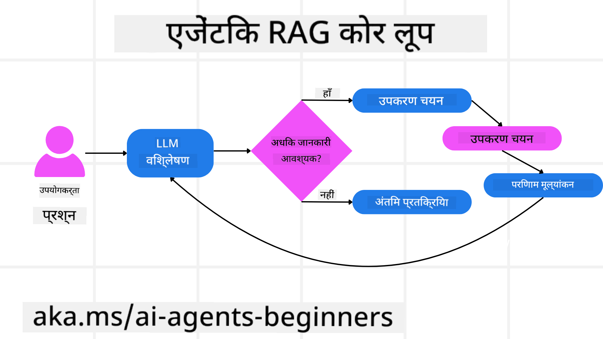
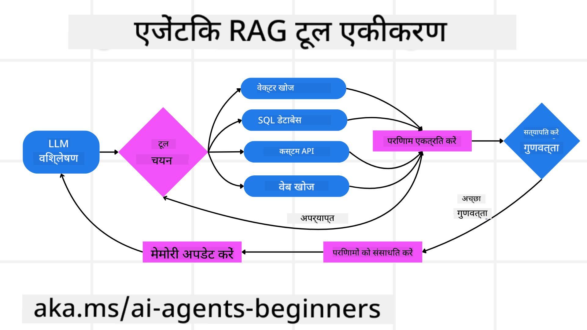
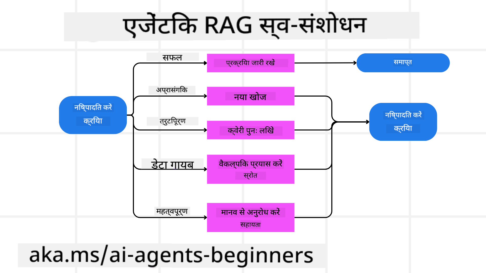
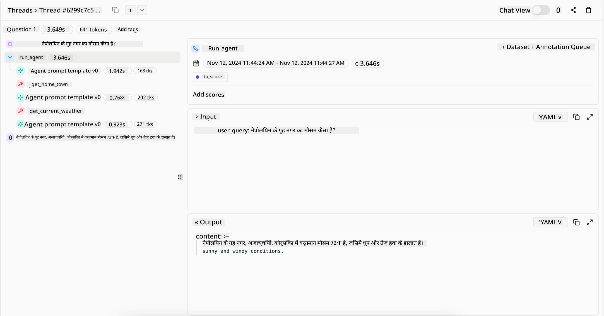
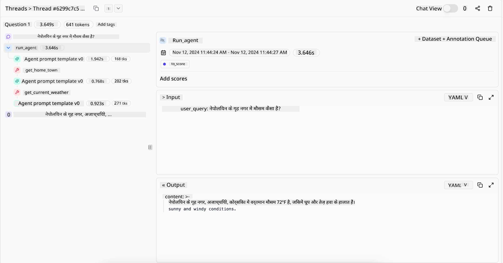

<!--
CO_OP_TRANSLATOR_METADATA:
{
  "original_hash": "7622aa72f9e676e593339f5f694ecd7d",
  "translation_date": "2025-07-12T09:56:11+00:00",
  "source_file": "05-agentic-rag/README.md",
  "language_code": "hi"
}
-->

> _(इस पाठ का वीडियो देखने के लिए ऊपर की छवि पर क्लिक करें)_

# Agentic RAG

यह पाठ Agentic Retrieval-Augmented Generation (Agentic RAG) का एक व्यापक परिचय प्रदान करता है, जो एक उभरता हुआ AI मॉडल है जहाँ बड़े भाषा मॉडल (LLMs) स्वायत्त रूप से अपने अगले कदमों की योजना बनाते हैं और बाहरी स्रोतों से जानकारी प्राप्त करते हैं। स्थिर retrieval-then-read पैटर्न के विपरीत, Agentic RAG में LLM को बार-बार कॉल किया जाता है, जिसमें टूल या फंक्शन कॉल और संरचित आउटपुट शामिल होते हैं। सिस्टम परिणामों का मूल्यांकन करता है, क्वेरी को परिष्कृत करता है, आवश्यक होने पर अतिरिक्त टूल्स को सक्रिय करता है, और तब तक यह चक्र जारी रखता है जब तक कि संतोषजनक समाधान प्राप्त न हो जाए।

## परिचय

इस पाठ में निम्नलिखित विषय शामिल होंगे:

- **Agentic RAG को समझना:** AI में उभरते हुए इस मॉडल के बारे में जानें जहाँ बड़े भाषा मॉडल (LLMs) स्वायत्त रूप से अपने अगले कदमों की योजना बनाते हैं और बाहरी डेटा स्रोतों से जानकारी प्राप्त करते हैं।
- **इटरेटिव मेकर-चेककर स्टाइल को समझना:** LLM को बार-बार कॉल करने के चक्र को समझें, जिसमें टूल या फंक्शन कॉल और संरचित आउटपुट होते हैं, जो सही परिणाम सुनिश्चित करने और गलत क्वेरी को संभालने के लिए डिज़ाइन किया गया है।
- **व्यावहारिक अनुप्रयोगों का अन्वेषण:** उन परिदृश्यों की पहचान करें जहाँ Agentic RAG प्रभावी होता है, जैसे कि सही-सही परिणाम वाले वातावरण, जटिल डेटाबेस इंटरैक्शन, और विस्तारित वर्कफ़्लो।

## सीखने के लक्ष्य

इस पाठ को पूरा करने के बाद, आप निम्नलिखित जानेंगे/समझेंगे:

- **Agentic RAG को समझना:** AI में इस उभरते हुए मॉडल के बारे में जानें जहाँ बड़े भाषा मॉडल (LLMs) स्वायत्त रूप से अपने अगले कदमों की योजना बनाते हैं और बाहरी डेटा स्रोतों से जानकारी प्राप्त करते हैं।
- **इटरेटिव मेकर-चेककर स्टाइल:** LLM को बार-बार कॉल करने के चक्र को समझें, जिसमें टूल या फंक्शन कॉल और संरचित आउटपुट होते हैं, जो सही परिणाम सुनिश्चित करने और गलत क्वेरी को संभालने के लिए डिज़ाइन किया गया है।
- **तर्क प्रक्रिया का स्वामित्व:** सिस्टम की अपनी तर्क प्रक्रिया को नियंत्रित करने की क्षमता को समझें, जो पूर्वनिर्धारित रास्तों पर निर्भर हुए बिना समस्याओं के समाधान के लिए निर्णय लेता है।
- **वर्कफ़्लो:** समझें कि एक agentic मॉडल कैसे स्वतंत्र रूप से बाजार के रुझान रिपोर्ट प्राप्त करने, प्रतिस्पर्धी डेटा की पहचान करने, आंतरिक बिक्री मेट्रिक्स को जोड़ने, निष्कर्षों को संकलित करने और रणनीति का मूल्यांकन करने का निर्णय लेता है।
- **इटरेटिव लूप्स, टूल इंटीग्रेशन, और मेमोरी:** सिस्टम के लूप्ड इंटरैक्शन पैटर्न पर निर्भरता के बारे में जानें, जो स्टेट और मेमोरी को बनाए रखता है ताकि दोहराव से बचा जा सके और सूचित निर्णय लिए जा सकें।
- **फेल्योर मोड्स और सेल्फ-करेक्शन को संभालना:** सिस्टम के मजबूत आत्म-सुधार तंत्रों का अन्वेषण करें, जिसमें पुनः प्रयास और पुनः क्वेरी करना, डायग्नोस्टिक टूल्स का उपयोग, और मानव निगरानी पर निर्भरता शामिल है।
- **एजेंसी की सीमाएं:** Agentic RAG की सीमाओं को समझें, जिसमें डोमेन-विशिष्ट स्वायत्तता, इन्फ्रास्ट्रक्चर पर निर्भरता, और गार्डरेल्स का सम्मान शामिल है।
- **व्यावहारिक उपयोग के मामले और मूल्य:** उन परिदृश्यों की पहचान करें जहाँ Agentic RAG प्रभावी होता है, जैसे कि सही-सही परिणाम वाले वातावरण, जटिल डेटाबेस इंटरैक्शन, और विस्तारित वर्कफ़्लो।
- **शासन, पारदर्शिता, और विश्वास:** शासन और पारदर्शिता के महत्व को जानें, जिसमें व्याख्यायित तर्क, पूर्वाग्रह नियंत्रण, और मानव निगरानी शामिल है।

## Agentic RAG क्या है?

Agentic Retrieval-Augmented Generation (Agentic RAG) एक उभरता हुआ AI मॉडल है जहाँ बड़े भाषा मॉडल (LLMs) स्वायत्त रूप से अपने अगले कदमों की योजना बनाते हैं और बाहरी स्रोतों से जानकारी प्राप्त करते हैं। स्थिर retrieval-then-read पैटर्न के विपरीत, Agentic RAG में LLM को बार-बार कॉल किया जाता है, जिसमें टूल या फंक्शन कॉल और संरचित आउटपुट शामिल होते हैं। सिस्टम परिणामों का मूल्यांकन करता है, क्वेरी को परिष्कृत करता है, आवश्यक होने पर अतिरिक्त टूल्स को सक्रिय करता है, और तब तक यह चक्र जारी रखता है जब तक कि संतोषजनक समाधान प्राप्त न हो जाए। यह इटरेटिव “मेकर-चेककर” स्टाइल सही परिणाम सुनिश्चित करता है, गलत क्वेरी को संभालता है, और उच्च गुणवत्ता वाले परिणाम प्रदान करता है।

सिस्टम सक्रिय रूप से अपनी तर्क प्रक्रिया का स्वामित्व रखता है, असफल क्वेरी को पुनः लिखता है, विभिन्न पुनः प्राप्ति विधियों का चयन करता है, और कई टूल्स को एकीकृत करता है—जैसे Azure AI Search में वेक्टर सर्च, SQL डेटाबेस, या कस्टम API—अपने उत्तर को अंतिम रूप देने से पहले। एक agentic सिस्टम की विशिष्टता इसकी तर्क प्रक्रिया का स्वामित्व लेने की क्षमता है। पारंपरिक RAG कार्यान्वयन पूर्वनिर्धारित रास्तों पर निर्भर करते हैं, लेकिन एक agentic सिस्टम स्वायत्त रूप से सूचना की गुणवत्ता के आधार पर कदमों का क्रम निर्धारित करता है।

## Agentic Retrieval-Augmented Generation (Agentic RAG) की परिभाषा

Agentic Retrieval-Augmented Generation (Agentic RAG) AI विकास में एक उभरता हुआ मॉडल है जहाँ LLM न केवल बाहरी डेटा स्रोतों से जानकारी प्राप्त करते हैं, बल्कि स्वायत्त रूप से अपने अगले कदमों की योजना भी बनाते हैं। स्थिर retrieval-then-read पैटर्न या सावधानीपूर्वक स्क्रिप्टेड प्रॉम्प्ट अनुक्रमों के विपरीत, Agentic RAG में LLM को बार-बार कॉल किया जाता है, जिसमें टूल या फंक्शन कॉल और संरचित आउटपुट शामिल होते हैं। हर चरण पर, सिस्टम प्राप्त परिणामों का मूल्यांकन करता है, यह तय करता है कि क्या क्वेरी को परिष्कृत करना है, आवश्यक होने पर अतिरिक्त टूल्स को सक्रिय करता है, और तब तक यह चक्र जारी रखता है जब तक कि संतोषजनक समाधान प्राप्त न हो जाए।

यह इटरेटिव “मेकर-चेककर” ऑपरेशन स्टाइल सही परिणाम सुनिश्चित करने, संरचित डेटाबेस (जैसे NL2SQL) के लिए गलत क्वेरी को संभालने, और संतुलित, उच्च गुणवत्ता वाले परिणाम प्रदान करने के लिए डिज़ाइन किया गया है। केवल सावधानीपूर्वक डिज़ाइन किए गए प्रॉम्प्ट चेन पर निर्भर रहने के बजाय, सिस्टम सक्रिय रूप से अपनी तर्क प्रक्रिया का स्वामित्व रखता है। यह असफल क्वेरी को पुनः लिख सकता है, विभिन्न पुनः प्राप्ति विधियों का चयन कर सकता है, और कई टूल्स को एकीकृत कर सकता है—जैसे Azure AI Search में वेक्टर सर्च, SQL डेटाबेस, या कस्टम API—अपने उत्तर को अंतिम रूप देने से पहले। इससे अत्यधिक जटिल ऑर्केस्ट्रेशन फ्रेमवर्क की आवश्यकता समाप्त हो जाती है। इसके बजाय, “LLM कॉल → टूल उपयोग → LLM कॉल → …” का एक सरल लूप परिष्कृत और ठोस आउटपुट दे सकता है।

## तर्क प्रक्रिया का स्वामित्व

जिस गुण के कारण कोई सिस्टम “agentic” कहलाता है, वह है अपनी तर्क प्रक्रिया का स्वामित्व लेने की क्षमता। पारंपरिक RAG कार्यान्वयन अक्सर मानव द्वारा मॉडल के लिए एक पूर्वनिर्धारित रास्ता निर्धारित करने पर निर्भर करते हैं: एक chain-of-thought जो बताता है कि क्या और कब प्राप्त करना है।  
लेकिन जब कोई सिस्टम वास्तव में agentic होता है, तो वह आंतरिक रूप से तय करता है कि समस्या को कैसे हल किया जाए। यह केवल एक स्क्रिप्ट को निष्पादित नहीं करता; यह स्वायत्त रूप से सूचना की गुणवत्ता के आधार पर कदमों का क्रम निर्धारित करता है।  
उदाहरण के लिए, यदि इसे एक उत्पाद लॉन्च रणनीति बनाने के लिए कहा जाता है, तो यह केवल एक प्रॉम्प्ट पर निर्भर नहीं करता जो पूरे शोध और निर्णय लेने के वर्कफ़्लो को बताता हो। इसके बजाय, agentic मॉडल स्वतंत्र रूप से निर्णय लेता है कि:

1. Bing Web Grounding का उपयोग करके वर्तमान बाजार रुझान रिपोर्ट प्राप्त करें  
2. Azure AI Search का उपयोग करके संबंधित प्रतिस्पर्धी डेटा की पहचान करें  
3. Azure SQL Database का उपयोग करके ऐतिहासिक आंतरिक बिक्री मेट्रिक्स को जोड़ें  
4. Azure OpenAI Service के माध्यम से निष्कर्षों को एक समेकित रणनीति में संकलित करें  
5. रणनीति का मूल्यांकन करें कि कहीं कोई कमी या असंगति तो नहीं है, और आवश्यक होने पर पुनः प्राप्ति का एक और दौर शुरू करें  

इन सभी कदमों—क्वेरी को परिष्कृत करना, स्रोत चुनना, जब तक उत्तर से “खुश” न हो जाए तब तक पुनरावृत्ति करना—का निर्णय मॉडल स्वयं करता है, न कि कोई मानव पूर्व-स्क्रिप्ट करता है।

## इटरेटिव लूप्स, टूल इंटीग्रेशन, और मेमोरी

एक agentic सिस्टम लूप्ड इंटरैक्शन पैटर्न पर निर्भर करता है:

- **प्रारंभिक कॉल:** उपयोगकर्ता का लक्ष्य (उर्फ उपयोगकर्ता प्रॉम्प्ट) LLM को प्रस्तुत किया जाता है।  
- **टूल सक्रियण:** यदि मॉडल को जानकारी की कमी या अस्पष्ट निर्देश मिलते हैं, तो यह एक टूल या पुनः प्राप्ति विधि चुनता है—जैसे वेक्टर डेटाबेस क्वेरी (जैसे Azure AI Search Hybrid search निजी डेटा पर) या संरचित SQL कॉल—अधिक संदर्भ प्राप्त करने के लिए।  
- **मूल्यांकन और परिष्करण:** प्राप्त डेटा की समीक्षा के बाद, मॉडल तय करता है कि क्या जानकारी पर्याप्त है। यदि नहीं, तो यह क्वेरी को परिष्कृत करता है, कोई अन्य टूल आजमाता है, या अपनी रणनीति समायोजित करता है।  
- **संतुष्ट होने तक पुनरावृत्ति:** यह चक्र तब तक जारी रहता है जब तक मॉडल यह निर्धारित नहीं कर लेता कि उसके पास अंतिम, सुविचारित उत्तर देने के लिए पर्याप्त स्पष्टता और प्रमाण हैं।  
- **मेमोरी और स्टेट:** चूंकि सिस्टम स्टेप्स के बीच स्टेट और मेमोरी बनाए रखता है, यह पिछले प्रयासों और उनके परिणामों को याद रख सकता है, दोहराव से बचता है, और आगे बढ़ते हुए अधिक सूचित निर्णय लेता है।  

समय के साथ, यह एक विकसित होती समझ का अनुभव बनाता है, जिससे मॉडल जटिल, बहु-चरण कार्यों को बिना मानव हस्तक्षेप या प्रॉम्प्ट को बार-बार बदलाए नेविगेट कर सकता है।

## फेल्योर मोड्स और सेल्फ-करेक्शन को संभालना

Agentic RAG की स्वायत्तता में मजबूत आत्म-सुधार तंत्र भी शामिल हैं। जब सिस्टम को मृत अंत का सामना करना पड़ता है—जैसे अप्रासंगिक दस्तावेज़ प्राप्त करना या गलत क्वेरी का सामना करना—तो यह कर सकता है:

- **पुनरावृत्ति और पुनः क्वेरी:** कम मूल्य वाले उत्तर लौटाने के बजाय, मॉडल नई खोज रणनीतियाँ आजमाता है, डेटाबेस क्वेरी को पुनः लिखता है, या वैकल्पिक डेटा सेट देखता है।  
- **डायग्नोस्टिक टूल्स का उपयोग:** सिस्टम अतिरिक्त फंक्शंस को सक्रिय कर सकता है जो तर्क के चरणों को डिबग करने या प्राप्त डेटा की शुद्धता की पुष्टि करने में मदद करते हैं। Azure AI Tracing जैसे टूल्स मजबूत अवलोकन और निगरानी सक्षम करने के लिए महत्वपूर्ण होंगे।  
- **मानव निगरानी पर निर्भरता:** उच्च जोखिम वाले या बार-बार विफल होने वाले परिदृश्यों के लिए, मॉडल अनिश्चितता को चिह्नित कर सकता है और मानव मार्गदर्शन का अनुरोध कर सकता है। जब मानव सुधारात्मक प्रतिक्रिया प्रदान करता है, तो मॉडल उस सीख को आगे के लिए शामिल कर सकता है।  

यह इटरेटिव और गतिशील दृष्टिकोण मॉडल को लगातार सुधारने की अनुमति देता है, यह सुनिश्चित करता है कि यह केवल एक बार चलने वाला सिस्टम नहीं है, बल्कि एक ऐसा सिस्टम है जो सत्र के दौरान अपनी गलतियों से सीखता है।

## एजेंसी की सीमाएं

अपने कार्य के भीतर स्वायत्त होने के बावजूद, Agentic RAG कृत्रिम सामान्य बुद्धिमत्ता (AGI) के समान नहीं है। इसकी “agentic” क्षमताएँ उन टूल्स, डेटा स्रोतों, और नीतियों तक सीमित हैं जो मानव डेवलपर्स द्वारा प्रदान की गई हैं। यह अपने टूल्स का आविष्कार नहीं कर सकता या निर्धारित डोमेन सीमाओं से बाहर नहीं जा सकता। बल्कि, यह उपलब्ध संसाधनों का गतिशील रूप से समन्वय करने में माहिर है।  
अधिक उन्नत AI रूपों से मुख्य अंतर हैं:

1. **डोमेन-विशिष्ट स्वायत्तता:** Agentic RAG सिस्टम ज्ञात डोमेन के भीतर उपयोगकर्ता-परिभाषित लक्ष्यों को प्राप्त करने पर केंद्रित होते हैं, क्वेरी पुनर्लेखन या टूल चयन जैसी रणनीतियों का उपयोग करके परिणामों में सुधार करते हैं।  
2. **इन्फ्रास्ट्रक्चर-निर्भर:** सिस्टम की क्षमताएँ डेवलपर्स द्वारा एकीकृत टूल्स और डेटा पर निर्भर करती हैं। यह मानव हस्तक्षेप के बिना इन सीमाओं को पार नहीं कर सकता।  
3. **गार्डरेल्स का सम्मान:** नैतिक दिशानिर्देश, अनुपालन नियम, और व्यावसायिक नीतियाँ अत्यंत महत्वपूर्ण हैं। एजेंट की स्वतंत्रता हमेशा सुरक्षा उपायों और निगरानी तंत्रों द्वारा सीमित होती है (आशा है)।  

## व्यावहारिक उपयोग के मामले और मूल्य

Agentic RAG उन परिदृश्यों में प्रभावी होता है जहाँ पुनरावृत्ति और सटीकता आवश्यक होती है:

1. **सही-सही परिणाम वाले वातावरण:** अनुपालन जांच, नियामक विश्लेषण, या कानूनी शोध में, agentic मॉडल बार-बार तथ्यों की पुष्टि कर सकता है, कई स्रोतों से परामर्श कर सकता है, और तब तक क्वेरी को पुनः लिख सकता है जब तक कि वह पूरी तरह से जांचा गया उत्तर न दे।  
2. **जटिल डेटाबेस इंटरैक्शन:** जब संरचित डेटा के साथ काम करते समय क्वेरी अक्सर विफल हो सकती हैं या समायोजन की आवश्यकता होती है, तो सिस्टम Azure SQL या Microsoft Fabric OneLake का उपयोग करके स्वायत्त रूप से अपनी क्वेरी को परिष्कृत कर सकता है, यह सुनिश्चित करते हुए कि अंतिम पुनः प्राप्ति उपयोगकर्ता की मंशा के अनुरूप हो।  
3. **विस्तारित वर्कफ़्लो:** लंबे समय तक चलने वाले सत्र नए डेटा के आने के साथ विकसित हो सकते हैं। Agentic RAG लगातार नए डेटा को शामिल कर सकता है, और समस्या क्षेत्र के बारे में अधिक सीखने के साथ रणनीतियाँ बदल सकता है।  

## शासन, पारदर्शिता, और विश्वास

जैसे-जैसे ये सिस्टम अपनी तर्क प्रक्रिया में अधिक स्वायत्त होते जाते हैं, शासन और पारदर्शिता अत्यंत महत्वपूर्ण हो जाते हैं:

- **व्याख्यायित तर्क:** मॉडल उन क्वेरियों का ऑडिट ट्रेल प्रदान कर सकता है जो उसने कीं, जिन स्रोतों से उसने परामर्श किया, और जिन तर्क चरणों के माध्यम से वह अपने निष्कर्ष पर पहुँचा। Azure AI Content Safety और Azure AI Tracing / GenAIOps जैसे टूल पारदर्शिता बनाए रखने और जोखिम कम करने में मदद कर सकते हैं।  
- **पूर्वाग्रह नियंत्रण और संतुलित पुनः प्राप्ति:** डेवलपर्स पुनः प्राप्ति रणनीतियों को ट्यून कर सकते हैं ताकि संतुलित, प्रतिनिधि डेटा स्रोतों पर विचार किया जाए, और नियमित रूप से आउटपुट का ऑडिट कर सकते हैं ताकि Azure Machine Learning का उपयोग करने वाले उन्नत डेटा साइंस संगठनों के लिए पूर्वाग्रह या विकृत पैटर्न का पता लगाया जा सके।  
- **मानव निगरानी और अनुपालन:** संवेदनशील कार्यों के लिए, मानव समीक्षा आवश्यक रहती है। Agentic RAG उच्च जोखिम वाले निर्णयों में मानव निर्णय को प्रतिस्थापित नहीं करता—यह इसे अधिक पूरी तरह से जांचे गए विकल्प प्रदान करके बढ़ावा देता है।  

ऐसे टूल्स का होना आवश्यक है जो क्रियाओं का स्पष्ट रिकॉर्ड प्रदान करें। इनके बिना, बहु-चरण प्रक्रिया का डिबग करना बहुत कठिन हो सकता है। नीचे Literal AI (Chainlit के पीछे कंपनी) के एक Agent रन का उदाहरण देखें:

## निष्कर्ष

Agentic RAG AI सिस्टमों के लिए एक प्राकृतिक विकास का प्रतिनिधित्व करता है जो जटिल, डेटा-गहन कार्यों को संभालते हैं। लूप्ड इंटरैक्शन पैटर्न अपनाकर, स्वायत्त रूप से टूल्स का चयन करके, और क्वेरी को तब तक परिष्कृत करके जब तक उच्च गुणवत्ता वाला परिणाम न मिल जाए, सिस्टम स्थिर प्रॉम्प्ट-फॉलोइंग से आगे बढ़कर अधिक अनुकूल, संदर्भ-सचेत निर्णय निर्माता बन जाता है। हालांकि यह अभी भी मानव-परिभाषित इन्फ्र

- <a href="https://learn.microsoft.com/azure/ai-studio/concepts/evaluation-approach-gen-ai" target="_blank">Azure AI Foundry के साथ जनरेटिव AI एप्लिकेशन का मूल्यांकन: यह लेख सार्वजनिक रूप से उपलब्ध डेटासेट्स पर मॉडल के मूल्यांकन और तुलना को कवर करता है, जिसमें Agentic AI एप्लिकेशन और RAG आर्किटेक्चर शामिल हैं</a>
- <a href="https://weaviate.io/blog/what-is-agentic-rag" target="_blank">Agentic RAG क्या है | Weaviate</a>
- <a href="https://ragaboutit.com/agentic-rag-a-complete-guide-to-agent-based-retrieval-augmented-generation/" target="_blank">Agentic RAG: एजेंट-आधारित रिट्रीवल ऑगमेंटेड जनरेशन के लिए पूर्ण मार्गदर्शिका – जनरेशन RAG से समाचार</a>
- <a href="https://huggingface.co/learn/cookbook/agent_rag" target="_blank">Agentic RAG: क्वेरी पुनःसंरचना और सेल्फ-क्वेरी के साथ अपने RAG को टर्बोचार्ज करें! Hugging Face ओपन-सोर्स AI कुकबुक</a>
- <a href="https://youtu.be/aQ4yQXeB1Ss?si=2HUqBzHoeB5tR04U" target="_blank">RAG में Agentic लेयर्स जोड़ना</a>
- <a href="https://www.youtube.com/watch?v=zeAyuLc_f3Q&t=244s" target="_blank">ज्ञान सहायक का भविष्य: जेरी लियू</a>
- <a href="https://www.youtube.com/watch?v=AOSjiXP1jmQ" target="_blank">Agentic RAG सिस्टम कैसे बनाएं</a>
- <a href="https://ignite.microsoft.com/sessions/BRK102?source=sessions" target="_blank">अपने AI एजेंट्स को स्केल करने के लिए Azure AI Foundry Agent Service का उपयोग</a>

### अकादमिक पेपर

- <a href="https://arxiv.org/abs/2303.17651" target="_blank">2303.17651 Self-Refine: सेल्फ-फीडबैक के साथ पुनरावृत्त सुधार</a>
- <a href="https://arxiv.org/abs/2303.11366" target="_blank">2303.11366 Reflexion: मौखिक सुदृढ़ीकरण सीखने के साथ भाषा एजेंट</a>
- <a href="https://arxiv.org/abs/2305.11738" target="_blank">2305.11738 CRITIC: टूल-इंटरैक्टिव क्रिटिकिंग के साथ बड़े भाषा मॉडल स्वयं सुधार सकते हैं</a>
- <a href="https://arxiv.org/abs/2501.09136" target="_blank">2501.09136 Agentic Retrieval-Augmented Generation: Agentic RAG पर सर्वेक्षण</a>

## पिछला पाठ

[Tool Use Design Pattern](../04-tool-use/README.md)

## अगला पाठ

[Building Trustworthy AI Agents](../06-building-trustworthy-agents/README.md)

**अस्वीकरण**:  
यह दस्तावेज़ AI अनुवाद सेवा [Co-op Translator](https://github.com/Azure/co-op-translator) का उपयोग करके अनुवादित किया गया है। जबकि हम सटीकता के लिए प्रयासरत हैं, कृपया ध्यान दें कि स्वचालित अनुवादों में त्रुटियाँ या अशुद्धियाँ हो सकती हैं। मूल दस्तावेज़ अपनी मूल भाषा में ही अधिकारिक स्रोत माना जाना चाहिए। महत्वपूर्ण जानकारी के लिए, पेशेवर मानव अनुवाद की सलाह दी जाती है। इस अनुवाद के उपयोग से उत्पन्न किसी भी गलतफहमी या गलत व्याख्या के लिए हम जिम्मेदार नहीं हैं।