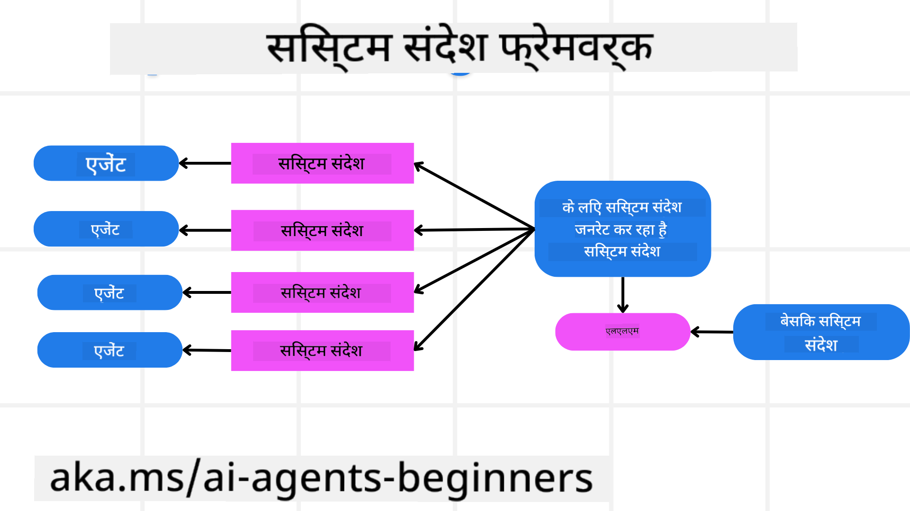
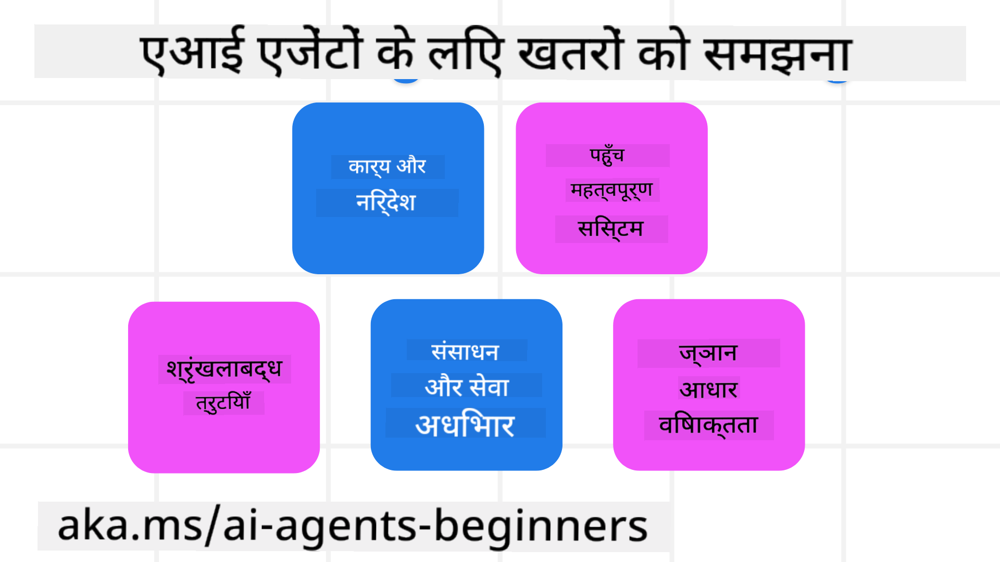
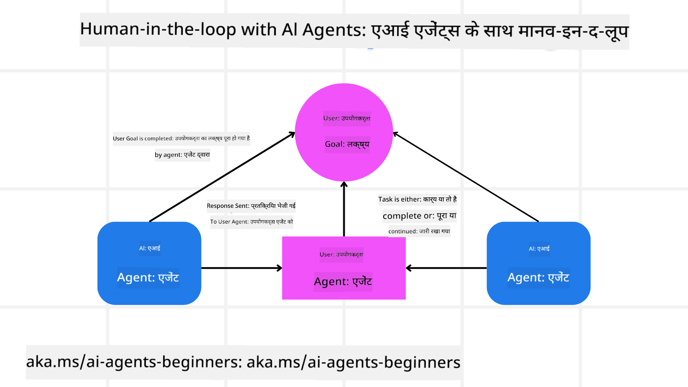

<!--
CO_OP_TRANSLATOR_METADATA:
{
  "original_hash": "f57852cac3a86c4a5ef47f793cc12178",
  "translation_date": "2025-07-12T10:24:25+00:00",
  "source_file": "06-building-trustworthy-agents/README.md",
  "language_code": "hi"
}
-->
[](https://youtu.be/iZKkMEGBCUQ?si=Q-kEbcyHUMPoHp8L)

> _(इस पाठ का वीडियो देखने के लिए ऊपर की छवि पर क्लिक करें)_

# भरोसेमंद AI एजेंट्स बनाना

## परिचय

इस पाठ में निम्नलिखित विषय शामिल होंगे:

- सुरक्षित और प्रभावी AI एजेंट्स कैसे बनाएं और तैनात करें
- AI एजेंट्स विकसित करते समय महत्वपूर्ण सुरक्षा विचार
- AI एजेंट्स विकसित करते समय डेटा और उपयोगकर्ता गोपनीयता कैसे बनाए रखें

## सीखने के लक्ष्य

इस पाठ को पूरा करने के बाद, आप जान पाएंगे कि कैसे:

- AI एजेंट्स बनाते समय जोखिमों की पहचान और उन्हें कम करें
- डेटा और एक्सेस को सही तरीके से प्रबंधित करने के लिए सुरक्षा उपाय लागू करें
- ऐसे AI एजेंट्स बनाएं जो डेटा गोपनीयता बनाए रखें और उपयोगकर्ता को उच्च गुणवत्ता का अनुभव प्रदान करें

## सुरक्षा

सबसे पहले, सुरक्षित एजेंटिक एप्लिकेशन बनाने पर ध्यान देते हैं। सुरक्षा का मतलब है कि AI एजेंट अपने डिजाइन के अनुसार काम करे। एजेंटिक एप्लिकेशन के निर्माता के रूप में, हमारे पास सुरक्षा को अधिकतम करने के लिए तरीके और उपकरण होते हैं:

### सिस्टम मैसेज फ्रेमवर्क बनाना

यदि आपने कभी बड़े भाषा मॉडल (LLMs) का उपयोग करके AI एप्लिकेशन बनाया है, तो आप जानते होंगे कि एक मजबूत सिस्टम प्रॉम्प्ट या सिस्टम मैसेज डिजाइन करना कितना महत्वपूर्ण है। ये प्रॉम्प्ट मेटा नियम, निर्देश और दिशानिर्देश स्थापित करते हैं कि LLM उपयोगकर्ता और डेटा के साथ कैसे इंटरैक्ट करेगा।

AI एजेंट्स के लिए, सिस्टम प्रॉम्प्ट और भी अधिक महत्वपूर्ण होता है क्योंकि AI एजेंट्स को उन कार्यों को पूरा करने के लिए बहुत विशिष्ट निर्देशों की आवश्यकता होती है जिन्हें हमने उनके लिए डिजाइन किया है।

स्केलेबल सिस्टम प्रॉम्प्ट बनाने के लिए, हम अपने एप्लिकेशन में एक या अधिक एजेंट्स बनाने के लिए सिस्टम मैसेज फ्रेमवर्क का उपयोग कर सकते हैं:



#### चरण 1: एक मेटा सिस्टम मैसेज बनाएं

मेटा प्रॉम्प्ट का उपयोग LLM द्वारा उन एजेंट्स के लिए सिस्टम प्रॉम्प्ट बनाने के लिए किया जाएगा जिन्हें हम बनाते हैं। इसे एक टेम्पलेट के रूप में डिजाइन किया जाता है ताकि जरूरत पड़ने पर हम आसानी से कई एजेंट्स बना सकें।

यहाँ एक मेटा सिस्टम मैसेज का उदाहरण है जो हम LLM को देंगे:

```plaintext
You are an expert at creating AI agent assistants. 
You will be provided a company name, role, responsibilities and other
information that you will use to provide a system prompt for.
To create the system prompt, be descriptive as possible and provide a structure that a system using an LLM can better understand the role and responsibilities of the AI assistant. 
```

#### चरण 2: एक बुनियादी प्रॉम्प्ट बनाएं

अगला कदम AI एजेंट का वर्णन करने के लिए एक बुनियादी प्रॉम्प्ट बनाना है। इसमें एजेंट की भूमिका, एजेंट द्वारा किए जाने वाले कार्य, और एजेंट की अन्य जिम्मेदारियां शामिल होनी चाहिए।

यहाँ एक उदाहरण है:

```plaintext
You are a travel agent for Contoso Travel that is great at booking flights for customers. To help customers you can perform the following tasks: lookup available flights, book flights, ask for preferences in seating and times for flights, cancel any previously booked flights and alert customers on any delays or cancellations of flights.  
```

#### चरण 3: LLM को बुनियादी सिस्टम मैसेज प्रदान करें

अब हम इस सिस्टम मैसेज को बेहतर बना सकते हैं, मेटा सिस्टम मैसेज को सिस्टम मैसेज के रूप में और हमारे बुनियादी सिस्टम मैसेज को प्रदान करके।

इससे एक ऐसा सिस्टम मैसेज बनेगा जो हमारे AI एजेंट्स का मार्गदर्शन करने के लिए बेहतर डिजाइन किया गया होगा:

```markdown
**Company Name:** Contoso Travel  
**Role:** Travel Agent Assistant

**Objective:**  
You are an AI-powered travel agent assistant for Contoso Travel, specializing in booking flights and providing exceptional customer service. Your main goal is to assist customers in finding, booking, and managing their flights, all while ensuring that their preferences and needs are met efficiently.

**Key Responsibilities:**

1. **Flight Lookup:**
    
    - Assist customers in searching for available flights based on their specified destination, dates, and any other relevant preferences.
    - Provide a list of options, including flight times, airlines, layovers, and pricing.
2. **Flight Booking:**
    
    - Facilitate the booking of flights for customers, ensuring that all details are correctly entered into the system.
    - Confirm bookings and provide customers with their itinerary, including confirmation numbers and any other pertinent information.
3. **Customer Preference Inquiry:**
    
    - Actively ask customers for their preferences regarding seating (e.g., aisle, window, extra legroom) and preferred times for flights (e.g., morning, afternoon, evening).
    - Record these preferences for future reference and tailor suggestions accordingly.
4. **Flight Cancellation:**
    
    - Assist customers in canceling previously booked flights if needed, following company policies and procedures.
    - Notify customers of any necessary refunds or additional steps that may be required for cancellations.
5. **Flight Monitoring:**
    
    - Monitor the status of booked flights and alert customers in real-time about any delays, cancellations, or changes to their flight schedule.
    - Provide updates through preferred communication channels (e.g., email, SMS) as needed.

**Tone and Style:**

- Maintain a friendly, professional, and approachable demeanor in all interactions with customers.
- Ensure that all communication is clear, informative, and tailored to the customer's specific needs and inquiries.

**User Interaction Instructions:**

- Respond to customer queries promptly and accurately.
- Use a conversational style while ensuring professionalism.
- Prioritize customer satisfaction by being attentive, empathetic, and proactive in all assistance provided.

**Additional Notes:**

- Stay updated on any changes to airline policies, travel restrictions, and other relevant information that could impact flight bookings and customer experience.
- Use clear and concise language to explain options and processes, avoiding jargon where possible for better customer understanding.

This AI assistant is designed to streamline the flight booking process for customers of Contoso Travel, ensuring that all their travel needs are met efficiently and effectively.

```

#### चरण 4: पुनरावृत्ति और सुधार करें

इस सिस्टम मैसेज फ्रेमवर्क का मूल्य यह है कि यह कई एजेंट्स के लिए सिस्टम मैसेज बनाना आसान बनाता है और समय के साथ आपके सिस्टम मैसेज में सुधार करने की सुविधा देता है। यह दुर्लभ है कि आपका सिस्टम मैसेज पहली बार में आपके पूरे उपयोग मामले के लिए सही काम करे। छोटे-छोटे बदलाव और सुधार करना, बुनियादी सिस्टम मैसेज को बदलकर और इसे सिस्टम के माध्यम से चलाकर, आपको परिणामों की तुलना और मूल्यांकन करने की अनुमति देगा।

## खतरों को समझना

भरोसेमंद AI एजेंट्स बनाने के लिए, आपके AI एजेंट के जोखिमों और खतरों को समझना और कम करना महत्वपूर्ण है। आइए AI एजेंट्स के कुछ अलग-अलग खतरों पर नजर डालें और देखें कि आप उनके लिए बेहतर योजना और तैयारी कैसे कर सकते हैं।



### कार्य और निर्देश

**विवरण:** हमलावर AI एजेंट के निर्देशों या लक्ष्यों को प्रॉम्प्टिंग या इनपुट को नियंत्रित करके बदलने का प्रयास करते हैं।

**निवारण:** संभावित खतरनाक प्रॉम्प्ट्स का पता लगाने के लिए सत्यापन जांच और इनपुट फिल्टर लागू करें, इससे पहले कि वे AI एजेंट द्वारा संसाधित हों। चूंकि ये हमले आमतौर पर एजेंट के साथ बार-बार इंटरैक्शन की मांग करते हैं, इसलिए बातचीत के दौरों की संख्या सीमित करना इन हमलों को रोकने का एक तरीका है।

### महत्वपूर्ण सिस्टम्स तक पहुंच

**विवरण:** यदि AI एजेंट के पास संवेदनशील डेटा संग्रहीत करने वाले सिस्टम और सेवाओं तक पहुंच है, तो हमलावर एजेंट और इन सेवाओं के बीच संचार को समझौता कर सकते हैं। ये सीधे हमले हो सकते हैं या एजेंट के माध्यम से इन सिस्टम्स के बारे में जानकारी प्राप्त करने के अप्रत्यक्ष प्रयास हो सकते हैं।

**निवारण:** AI एजेंट्स को केवल आवश्यकतानुसार सिस्टम्स तक पहुंच होनी चाहिए ताकि इस प्रकार के हमलों को रोका जा सके। एजेंट और सिस्टम के बीच संचार भी सुरक्षित होना चाहिए। प्रमाणीकरण और एक्सेस नियंत्रण लागू करना इस जानकारी की सुरक्षा का एक और तरीका है।

### संसाधन और सेवा ओवरलोडिंग

**विवरण:** AI एजेंट्स विभिन्न टूल्स और सेवाओं का उपयोग कार्यों को पूरा करने के लिए कर सकते हैं। हमलावर इस क्षमता का उपयोग करके AI एजेंट के माध्यम से उच्च मात्रा में अनुरोध भेजकर इन सेवाओं पर हमला कर सकते हैं, जिससे सिस्टम विफलताएं या उच्च लागत हो सकती है।

**निवारण:** AI एजेंट द्वारा किसी सेवा को किए जाने वाले अनुरोधों की संख्या सीमित करने के लिए नीतियां लागू करें। बातचीत के दौरों और AI एजेंट को किए जाने वाले अनुरोधों की संख्या सीमित करना इस प्रकार के हमलों को रोकने का एक और तरीका है।

### नॉलेज बेस पॉइज़निंग

**विवरण:** इस प्रकार का हमला सीधे AI एजेंट को लक्षित नहीं करता, बल्कि नॉलेज बेस और अन्य सेवाओं को निशाना बनाता है जिनका AI एजेंट कार्य पूरा करने के लिए उपयोग करेगा। इसमें डेटा या जानकारी को भ्रष्ट करना शामिल हो सकता है, जिससे AI एजेंट उपयोगकर्ता को पक्षपाती या अनपेक्षित प्रतिक्रियाएं दे सकता है।

**निवारण:** AI एजेंट के वर्कफ़्लो में उपयोग किए जाने वाले डेटा का नियमित सत्यापन करें। सुनिश्चित करें कि इस डेटा तक पहुंच सुरक्षित हो और केवल विश्वसनीय व्यक्तियों द्वारा ही इसे बदला जाए ताकि इस प्रकार के हमलों से बचा जा सके।

### कैस्केडिंग त्रुटियां

**विवरण:** AI एजेंट विभिन्न टूल्स और सेवाओं का उपयोग कार्यों को पूरा करने के लिए करता है। हमलावरों द्वारा उत्पन्न त्रुटियां उन अन्य सिस्टम्स की विफलता का कारण बन सकती हैं जिनसे AI एजेंट जुड़ा होता है, जिससे हमला व्यापक हो जाता है और समस्या का समाधान कठिन हो जाता है।

**निवारण:** इसे रोकने का एक तरीका यह है कि AI एजेंट को सीमित वातावरण में चलाया जाए, जैसे कि Docker कंटेनर में कार्य करना, ताकि सीधे सिस्टम हमलों को रोका जा सके। जब कुछ सिस्टम त्रुटि के साथ प्रतिक्रिया देते हैं, तो फॉलबैक मैकेनिज्म और पुनः प्रयास लॉजिक बनाना बड़े सिस्टम विफलताओं को रोकने का एक और तरीका है।

## मानव-इन-द-लूप

भरोसेमंद AI एजेंट सिस्टम बनाने का एक और प्रभावी तरीका है मानव-इन-द-लूप का उपयोग। यह एक ऐसा प्रवाह बनाता है जहां उपयोगकर्ता रन के दौरान एजेंट्स को प्रतिक्रिया दे सकते हैं। उपयोगकर्ता मूल रूप से एक मल्टी-एजेंट सिस्टम में एजेंट के रूप में कार्य करते हैं और चल रहे प्रक्रिया को अनुमोदन या समाप्ति प्रदान करते हैं।



यहाँ AutoGen का उपयोग करते हुए एक कोड स्निपेट है जो दिखाता है कि यह अवधारणा कैसे लागू की जाती है:

```python

# Create the agents.
model_client = OpenAIChatCompletionClient(model="gpt-4o-mini")
assistant = AssistantAgent("assistant", model_client=model_client)
user_proxy = UserProxyAgent("user_proxy", input_func=input)  # Use input() to get user input from console.

# Create the termination condition which will end the conversation when the user says "APPROVE".
termination = TextMentionTermination("APPROVE")

# Create the team.
team = RoundRobinGroupChat([assistant, user_proxy], termination_condition=termination)

# Run the conversation and stream to the console.
stream = team.run_stream(task="Write a 4-line poem about the ocean.")
# Use asyncio.run(...) when running in a script.
await Console(stream)

```

## निष्कर्ष

भरोसेमंद AI एजेंट्स बनाने के लिए सावधानीपूर्वक डिजाइन, मजबूत सुरक्षा उपाय, और निरंतर पुनरावृत्ति आवश्यक है। संरचित मेटा प्रॉम्प्टिंग सिस्टम लागू करके, संभावित खतरों को समझकर, और निवारण रणनीतियों को अपनाकर, डेवलपर्स ऐसे AI एजेंट्स बना सकते हैं जो सुरक्षित और प्रभावी दोनों हों। इसके अलावा, मानव-इन-द-लूप दृष्टिकोण को शामिल करने से यह सुनिश्चित होता है कि AI एजेंट उपयोगकर्ता की आवश्यकताओं के अनुरूप बने रहें और जोखिम कम हों। जैसे-जैसे AI विकसित होता रहेगा, सुरक्षा, गोपनीयता, और नैतिक विचारों पर सक्रिय दृष्टिकोण बनाए रखना AI-चालित सिस्टम में विश्वास और विश्वसनीयता बढ़ाने की कुंजी होगा।

## अतिरिक्त संसाधन

- <a href="https://learn.microsoft.com/azure/ai-studio/responsible-use-of-ai-overview" target="_blank">Responsible AI overview</a>
- <a href="https://learn.microsoft.com/azure/ai-studio/concepts/evaluation-approach-gen-ai" target="_blank">Evaluation of generative AI models and AI applications</a>
- <a href="https://learn.microsoft.com/azure/ai-services/openai/concepts/system-message?context=%2Fazure%2Fai-studio%2Fcontext%2Fcontext&tabs=top-techniques" target="_blank">Safety system messages</a>
- <a href="https://blogs.microsoft.com/wp-content/uploads/prod/sites/5/2022/06/Microsoft-RAI-Impact-Assessment-Template.pdf?culture=en-us&country=us" target="_blank">Risk Assessment Template</a>

## पिछला पाठ

[Agentic RAG](../05-agentic-rag/README.md)

## अगला पाठ

[Planning Design Pattern](../07-planning-design/README.md)

**अस्वीकरण**:  
यह दस्तावेज़ AI अनुवाद सेवा [Co-op Translator](https://github.com/Azure/co-op-translator) का उपयोग करके अनुवादित किया गया है। जबकि हम सटीकता के लिए प्रयासरत हैं, कृपया ध्यान दें कि स्वचालित अनुवादों में त्रुटियाँ या अशुद्धियाँ हो सकती हैं। मूल दस्तावेज़ अपनी मूल भाषा में ही अधिकारिक स्रोत माना जाना चाहिए। महत्वपूर्ण जानकारी के लिए, पेशेवर मानव अनुवाद की सलाह दी जाती है। इस अनुवाद के उपयोग से उत्पन्न किसी भी गलतफहमी या गलत व्याख्या के लिए हम जिम्मेदार नहीं हैं।