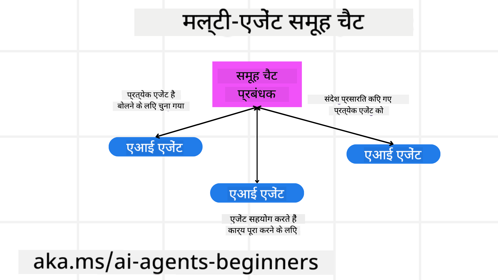
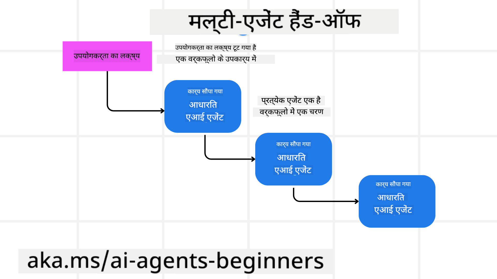
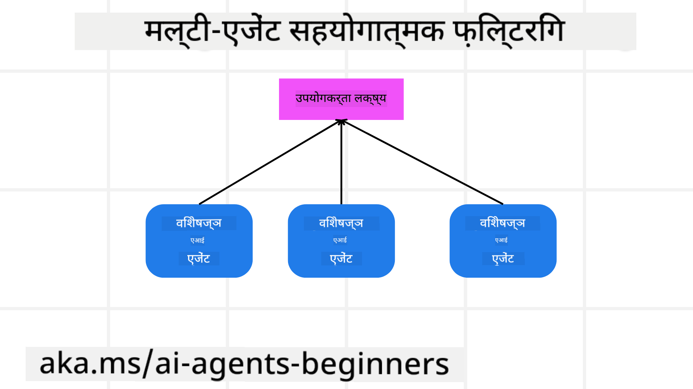

<!--
CO_OP_TRANSLATOR_METADATA:
{
  "original_hash": "c692a8975d7d5b99575a553de1c5e8a7",
  "translation_date": "2025-07-12T11:00:59+00:00",
  "source_file": "08-multi-agent/README.md",
  "language_code": "hi"
}
-->

> _(इस पाठ का वीडियो देखने के लिए ऊपर की छवि पर क्लिक करें)_

# मल्टी-एजेंट डिज़ाइन पैटर्न

जैसे ही आप किसी ऐसे प्रोजेक्ट पर काम शुरू करते हैं जिसमें कई एजेंट शामिल होते हैं, आपको मल्टी-एजेंट डिज़ाइन पैटर्न पर विचार करना होगा। हालांकि, यह तुरंत स्पष्ट नहीं हो सकता कि कब मल्टी-एजेंट्स पर स्विच करना है और इसके क्या फायदे हैं।

## परिचय

इस पाठ में, हम निम्नलिखित सवालों के जवाब खोजने की कोशिश कर रहे हैं:

- कौन से परिदृश्य ऐसे हैं जहाँ मल्टी-एजेंट्स लागू होते हैं?
- एकल एजेंट के बजाय मल्टी-एजेंट्स का उपयोग करने के क्या फायदे हैं?
- मल्टी-एजेंट डिज़ाइन पैटर्न को लागू करने के लिए कौन-कौन से मूल तत्व होते हैं?
- हम कैसे देख सकते हैं कि कई एजेंट एक-दूसरे के साथ कैसे इंटरैक्ट कर रहे हैं?

## सीखने के लक्ष्य

इस पाठ के बाद, आप सक्षम होंगे:

- उन परिदृश्यों की पहचान करना जहाँ मल्टी-एजेंट्स लागू होते हैं
- एकल एजेंट की तुलना में मल्टी-एजेंट्स के उपयोग के फायदे समझना
- मल्टी-एजेंट डिज़ाइन पैटर्न को लागू करने के मूल तत्वों को समझना

बड़ी तस्वीर क्या है?

*मल्टी एजेंट एक डिज़ाइन पैटर्न है जो कई एजेंटों को एक साथ मिलकर एक सामान्य लक्ष्य प्राप्त करने की अनुमति देता है।*

यह पैटर्न रोबोटिक्स, स्वायत्त प्रणालियों, और वितरित कंप्यूटिंग सहित विभिन्न क्षेत्रों में व्यापक रूप से उपयोग किया जाता है।

## वे परिदृश्य जहाँ मल्टी-एजेंट्स लागू होते हैं

तो कौन से परिदृश्य मल्टी-एजेंट्स के उपयोग के लिए उपयुक्त हैं? जवाब यह है कि कई परिदृश्य ऐसे हैं जहाँ कई एजेंटों को शामिल करना फायदेमंद होता है, खासकर निम्नलिखित मामलों में:

- **बड़े कार्यभार**: बड़े कार्यभार को छोटे-छोटे कार्यों में विभाजित किया जा सकता है और विभिन्न एजेंटों को सौंपा जा सकता है, जिससे समानांतर प्रसंस्करण और तेज़ पूरा होना संभव होता है। इसका उदाहरण बड़े डेटा प्रोसेसिंग कार्य में देखा जा सकता है।
- **जटिल कार्य**: जटिल कार्यों को भी छोटे उप-कार्य में विभाजित किया जा सकता है और विभिन्न एजेंटों को सौंपा जा सकता है, जो कार्य के विशिष्ट पहलुओं में विशेषज्ञ होते हैं। उदाहरण के लिए, स्वायत्त वाहनों में अलग-अलग एजेंट नेविगेशन, बाधा पहचान, और अन्य वाहनों के साथ संचार का प्रबंधन करते हैं।
- **विविध विशेषज्ञता**: विभिन्न एजेंटों के पास विभिन्न विशेषज्ञताएँ हो सकती हैं, जिससे वे एकल एजेंट की तुलना में कार्य के विभिन्न पहलुओं को अधिक प्रभावी ढंग से संभाल सकते हैं। उदाहरण के लिए, हेल्थकेयर में एजेंट डायग्नोस्टिक्स, उपचार योजनाओं, और रोगी निगरानी का प्रबंधन कर सकते हैं।

## एकल एजेंट की तुलना में मल्टी-एजेंट्स के उपयोग के फायदे

सरल कार्यों के लिए एकल एजेंट सिस्टम ठीक काम कर सकता है, लेकिन जटिल कार्यों के लिए कई एजेंटों का उपयोग कई फायदे प्रदान कर सकता है:

- **विशेषीकरण**: प्रत्येक एजेंट किसी विशिष्ट कार्य में विशेषज्ञ हो सकता है। एकल एजेंट में विशेषज्ञता की कमी का मतलब है कि एजेंट सब कुछ कर सकता है लेकिन जटिल कार्यों में भ्रमित हो सकता है। उदाहरण के लिए, वह ऐसा कार्य कर सकता है जिसके लिए वह सबसे उपयुक्त नहीं है।
- **स्केलेबिलिटी**: सिस्टम को स्केल करना अधिक एजेंट जोड़कर आसान होता है बजाय एकल एजेंट पर अधिक भार डालने के।
- **फॉल्ट टॉलरेंस**: यदि एक एजेंट विफल हो जाता है, तो अन्य एजेंट काम जारी रख सकते हैं, जिससे सिस्टम की विश्वसनीयता बनी रहती है।

आइए एक उदाहरण लेते हैं, एक उपयोगकर्ता के लिए यात्रा बुक करना। एकल एजेंट सिस्टम को यात्रा बुकिंग की सभी प्रक्रियाओं को संभालना होगा, जैसे उड़ान ढूंढना, होटल बुक करना, और कार किराए पर लेना। इसे एकल एजेंट से पूरा करने के लिए, एजेंट के पास इन सभी कार्यों को संभालने के लिए उपकरण होने चाहिए। इससे एक जटिल और मोनोलिथिक सिस्टम बन सकता है जिसे बनाए रखना और स्केल करना मुश्किल होता है। दूसरी ओर, मल्टी-एजेंट सिस्टम में अलग-अलग एजेंट उड़ान खोजने, होटल बुक करने, और कार किराए पर लेने में विशेषज्ञ हो सकते हैं। इससे सिस्टम अधिक मॉड्यूलर, बनाए रखने में आसान, और स्केलेबल बन जाता है।

इसे एक छोटे पारिवारिक ट्रैवल एजेंसी की तुलना में फ्रैंचाइज़ ट्रैवल एजेंसी से तुलना करें। पारिवारिक एजेंसी में एकल एजेंट यात्रा बुकिंग के सभी पहलुओं को संभालता है, जबकि फ्रैंचाइज़ में अलग-अलग एजेंट यात्रा के विभिन्न पहलुओं को संभालते हैं।

## मल्टी-एजेंट डिज़ाइन पैटर्न को लागू करने के मूल तत्व

मल्टी-एजेंट डिज़ाइन पैटर्न को लागू करने से पहले, आपको उन मूल तत्वों को समझना होगा जो इस पैटर्न को बनाते हैं।

आइए इसे फिर से उपयोगकर्ता के लिए यात्रा बुकिंग के उदाहरण से समझते हैं। इस मामले में, मूल तत्वों में शामिल होंगे:

- **एजेंट संचार**: उड़ान खोजने, होटल बुक करने, और कार किराए पर लेने वाले एजेंटों को उपयोगकर्ता की प्राथमिकताओं और सीमाओं के बारे में जानकारी साझा करने और संवाद करने की आवश्यकता होती है। आपको इस संचार के लिए प्रोटोकॉल और विधियाँ तय करनी होंगी। इसका मतलब है कि उड़ान खोजने वाला एजेंट होटल बुकिंग एजेंट के साथ संवाद करेगा ताकि होटल उसी तारीखों के लिए बुक हो जो उड़ान के लिए हैं। इसका मतलब है कि एजेंटों को उपयोगकर्ता की यात्रा तिथियों की जानकारी साझा करनी होगी, यानी आपको तय करना होगा *कौन से एजेंट जानकारी साझा कर रहे हैं और कैसे साझा कर रहे हैं*।
- **समन्वय तंत्र**: एजेंटों को अपने कार्यों का समन्वय करना होगा ताकि उपयोगकर्ता की प्राथमिकताएँ और सीमाएँ पूरी हों। उदाहरण के लिए, उपयोगकर्ता की प्राथमिकता हो सकती है कि होटल हवाई अड्डे के पास हो, जबकि एक सीमा हो सकती है कि कार किराए पर केवल हवाई अड्डे पर उपलब्ध हों। इसका मतलब है कि होटल बुकिंग एजेंट को कार किराए पर लेने वाले एजेंट के साथ समन्वय करना होगा ताकि उपयोगकर्ता की प्राथमिकताएँ और सीमाएँ पूरी हों। इसका मतलब है कि आपको तय करना होगा *एजेंट अपने कार्यों का समन्वय कैसे कर रहे हैं*।
- **एजेंट आर्किटेक्चर**: एजेंटों के पास निर्णय लेने और उपयोगकर्ता के साथ इंटरैक्शन से सीखने की आंतरिक संरचना होनी चाहिए। इसका मतलब है कि उड़ान खोजने वाले एजेंट के पास यह क्षमता होनी चाहिए कि वह उपयोगकर्ता को कौन सी उड़ानें सुझाए। इसका मतलब है कि आपको तय करना होगा *एजेंट कैसे निर्णय ले रहे हैं और उपयोगकर्ता के साथ इंटरैक्शन से कैसे सीख रहे हैं*। उदाहरण के लिए, उड़ान खोजने वाला एजेंट मशीन लर्निंग मॉडल का उपयोग कर सकता है ताकि उपयोगकर्ता की पिछली प्राथमिकताओं के आधार पर उड़ानें सुझा सके।
- **मल्टी-एजेंट इंटरैक्शन की दृश्यता**: आपको यह देखना होगा कि कई एजेंट एक-दूसरे के साथ कैसे इंटरैक्ट कर रहे हैं। इसके लिए आपको एजेंट गतिविधियों और इंटरैक्शन को ट्रैक करने के लिए उपकरण और तकनीकें चाहिए होंगी। यह लॉगिंग और मॉनिटरिंग टूल्स, विज़ुअलाइज़ेशन टूल्स, और प्रदर्शन मेट्रिक्स के रूप में हो सकता है।
- **मल्टी-एजेंट पैटर्न्स**: मल्टी-एजेंट सिस्टम को लागू करने के लिए विभिन्न पैटर्न होते हैं, जैसे केंद्रीकृत, विकेंद्रीकृत, और हाइब्रिड आर्किटेक्चर। आपको अपने उपयोग के मामले के लिए सबसे उपयुक्त पैटर्न चुनना होगा।
- **ह्यूमन इन द लूप**: अधिकांश मामलों में, सिस्टम में एक मानव भी शामिल होता है और आपको एजेंटों को यह निर्देश देना होगा कि कब मानव हस्तक्षेप के लिए पूछना है। यह उपयोगकर्ता द्वारा किसी विशेष होटल या उड़ान के लिए अनुरोध करने के रूप में हो सकता है जिसे एजेंटों ने सुझाया नहीं है, या बुकिंग से पहले पुष्टि मांगने के रूप में हो सकता है।

## मल्टी-एजेंट इंटरैक्शन की दृश्यता

यह महत्वपूर्ण है कि आप यह देख सकें कि कई एजेंट एक-दूसरे के साथ कैसे इंटरैक्ट कर रहे हैं। यह दृश्यता डिबगिंग, अनुकूलन, और पूरे सिस्टम की प्रभावशीलता सुनिश्चित करने के लिए आवश्यक है। इसे प्राप्त करने के लिए, आपको एजेंट गतिविधियों और इंटरैक्शन को ट्रैक करने के लिए उपकरण और तकनीकें चाहिए होंगी। यह लॉगिंग और मॉनिटरिंग टूल्स, विज़ुअलाइज़ेशन टूल्स, और प्रदर्शन मेट्रिक्स के रूप में हो सकता है।

उदाहरण के लिए, उपयोगकर्ता के लिए यात्रा बुकिंग के मामले में, आपके पास एक डैशबोर्ड हो सकता है जो प्रत्येक एजेंट की स्थिति, उपयोगकर्ता की प्राथमिकताएँ और सीमाएँ, और एजेंटों के बीच इंटरैक्शन दिखाता है। यह डैशबोर्ड उपयोगकर्ता की यात्रा तिथियाँ, उड़ान एजेंट द्वारा सुझाई गई उड़ानें, होटल एजेंट द्वारा सुझाए गए होटल, और कार एजेंट द्वारा सुझाई गई कारें दिखा सकता है। इससे आपको स्पष्ट रूप से पता चलेगा कि एजेंट एक-दूसरे के साथ कैसे इंटरैक्ट कर रहे हैं और क्या उपयोगकर्ता की प्राथमिकताएँ और सीमाएँ पूरी हो रही हैं।

आइए इन पहलुओं को और विस्तार से देखें।

- **लॉगिंग और मॉनिटरिंग टूल्स**: आप चाहते हैं कि प्रत्येक एजेंट द्वारा किए गए कार्य का लॉगिंग हो। एक लॉग एंट्री में उस एजेंट की जानकारी हो सकती है जिसने कार्य किया, किया गया कार्य, कार्य का समय, और कार्य का परिणाम। इस जानकारी का उपयोग डिबगिंग, अनुकूलन आदि के लिए किया जा सकता है।
- **विज़ुअलाइज़ेशन टूल्स**: विज़ुअलाइज़ेशन टूल्स आपको एजेंटों के बीच इंटरैक्शन को अधिक सहज तरीके से देखने में मदद कर सकते हैं। उदाहरण के लिए, आपके पास एक ग्राफ हो सकता है जो एजेंटों के बीच सूचना के प्रवाह को दिखाता है। इससे आप सिस्टम में बाधाओं, अक्षमताओं, और अन्य समस्याओं की पहचान कर सकते हैं।
- **प्रदर्शन मेट्रिक्स**: प्रदर्शन मेट्रिक्स आपको मल्टी-एजेंट सिस्टम की प्रभावशीलता को ट्रैक करने में मदद करते हैं। उदाहरण के लिए, आप किसी कार्य को पूरा करने में लगने वाला समय, प्रति समय इकाई में पूर्ण कार्यों की संख्या, और एजेंटों द्वारा दी गई सिफारिशों की सटीकता को ट्रैक कर सकते हैं। यह जानकारी सुधार के क्षेत्रों की पहचान करने और सिस्टम को अनुकूलित करने में मदद करती है।

## मल्टी-एजेंट पैटर्न्स

आइए कुछ ठोस पैटर्न्स पर नजर डालते हैं जिनका उपयोग हम मल्टी-एजेंट ऐप्स बनाने के लिए कर सकते हैं। यहाँ कुछ दिलचस्प पैटर्न हैं जिन्हें विचार करना चाहिए:

### ग्रुप चैट

यह पैटर्न तब उपयोगी होता है जब आप एक ग्रुप चैट एप्लिकेशन बनाना चाहते हैं जहाँ कई एजेंट एक-दूसरे के साथ संवाद कर सकें। इस पैटर्न के सामान्य उपयोग में टीम सहयोग, ग्राहक सहायता, और सोशल नेटवर्किंग शामिल हैं।

इस पैटर्न में, प्रत्येक एजेंट ग्रुप चैट में एक उपयोगकर्ता का प्रतिनिधित्व करता है, और संदेश एजेंटों के बीच एक मैसेजिंग प्रोटोकॉल के माध्यम से आदान-प्रदान होते हैं। एजेंट ग्रुप चैट में संदेश भेज सकते हैं, प्राप्त कर सकते हैं, और अन्य एजेंटों के संदेशों का जवाब दे सकते हैं।

यह पैटर्न केंद्रीकृत आर्किटेक्चर का उपयोग करके लागू किया जा सकता है जहाँ सभी संदेश एक केंद्रीय सर्वर के माध्यम से भेजे जाते हैं, या विकेंद्रीकृत आर्किटेक्चर जहाँ संदेश सीधे आदान-प्रदान होते हैं।

### हैंड-ऑफ

यह पैटर्न तब उपयोगी होता है जब आप एक ऐसा एप्लिकेशन बनाना चाहते हैं जहाँ कई एजेंट एक-दूसरे को कार्य सौंप सकें।

इस पैटर्न के सामान्य उपयोग में ग्राहक सहायता, कार्य प्रबंधन, और वर्कफ़्लो ऑटोमेशन शामिल हैं।

इस पैटर्न में, प्रत्येक एजेंट एक कार्य या वर्कफ़्लो के एक चरण का प्रतिनिधित्व करता है, और एजेंट पूर्वनिर्धारित नियमों के आधार पर कार्यों को अन्य एजेंटों को सौंप सकते हैं।

### सहयोगात्मक फ़िल्टरिंग

यह पैटर्न तब उपयोगी होता है जब आप एक ऐसा एप्लिकेशन बनाना चाहते हैं जहाँ कई एजेंट मिलकर उपयोगकर्ताओं को सिफारिशें दे सकें।

मल्टी-एजेंट सहयोग इसलिए जरूरी है क्योंकि प्रत्येक एजेंट की अलग विशेषज्ञता हो सकती है और वे सिफारिश प्रक्रिया में विभिन्न तरीकों से योगदान दे सकते हैं।

आइए एक उदाहरण लेते हैं जहाँ एक उपयोगकर्ता को स्टॉक मार्केट में सबसे अच्छा स्टॉक खरीदने की सिफारिश चाहिए।

- **इंडस्ट्री एक्सपर्ट**: एक एजेंट किसी विशेष उद्योग में विशेषज्ञ हो सकता है।
- **टेक्निकल एनालिसिस**: दूसरा एजेंट तकनीकी विश्लेषण में विशेषज्ञ हो सकता है।
- **फंडामेंटल एनालिसिस**: और एक एजेंट मौलिक विश्लेषण में विशेषज्ञ हो सकता है। सहयोग करके, ये एजेंट उपयोगकर्ता को अधिक व्यापक सिफारिश प्रदान कर सकते हैं।

## परिदृश्य: रिफंड प्रक्रिया

मान लीजिए एक ग्राहक किसी उत्पाद के लिए रिफंड प्राप्त करने की कोशिश कर रहा है, इस प्रक्रिया में कई एजेंट शामिल हो सकते हैं, लेकिन आइए इसे इस प्रक्रिया के लिए विशिष्ट एजेंटों और सामान्य एजेंटों में विभाजित करें जो अन्य प्रक्रियाओं में भी उपयोग किए जा सकते हैं।

**रिफंड प्रक्रिया के लिए विशिष्ट एजेंट**:

रिफंड प्रक्रिया में शामिल हो सकने वाले कुछ एजेंट निम्नलिखित हैं:

- **Customer agent**: यह एजेंट ग्राहक का प्रतिनिधित्व करता है और रिफंड प्रक्रिया शुरू करने के लिए जिम्मेदार होता है।
- **Seller agent**: यह एजेंट विक्रेता का प्रतिनिधित्व करता है और रिफंड प्रक्रिया को संभालता है।
- **Payment agent**: यह एजेंट भुगतान प्रक्रिया का प्रतिनिधित्व करता है और ग्राहक को भुगतान वापस करने के लिए जिम्मेदार होता है।
- **Resolution agent**: यह एजेंट समाधान प्रक्रिया का प्रतिनिधित्व करता है और रिफंड प्रक्रिया के दौरान उत्पन्न किसी भी समस्या को हल करने के लिए जिम्मेदार होता है।
- **Compliance agent**: यह एजेंट अनुपालन प्रक्रिया का प्रतिनिधित्व करता है और सुनिश्चित करता है कि रिफंड प्रक्रिया नियमों और नीतियों के अनुरूप हो।

**सामान्य एजेंट**:

ये एजेंट आपके व्यवसाय के अन्य हिस्सों में भी उपयोग किए जा सकते हैं।

- **Shipping agent**: यह एजेंट शिपिंग प्रक्रिया का प्रतिनिधित्व करता है और उत्पाद को विक्रेता को वापस भेजने के लिए जिम्मेदार होता है। यह एजेंट रिफंड प्रक्रिया के लिए और सामान्य शिपिंग के लिए भी उपयोग किया जा सकता है, जैसे किसी खरीद के दौरान।
- **Feedback agent**: यह एजेंट फीडबैक प्रक्रिया का प्रतिनिधित्व करता है और ग्राहक से फीडबैक एकत्र करने के लिए जिम्मेदार होता है। फीडबैक कभी भी लिया जा सकता है, केवल रिफंड प्रक्रिया के दौरान ही नहीं।
- **Escalation agent**: यह एजेंट समस्या को उच्च स्तर के समर्थन तक पहुंचाने के लिए जिम्मेदार होता है। आप इस प्रकार के एजेंट का उपयोग किसी भी प्रक्रिया में कर सकते हैं जहाँ समस्या को बढ़ाना आवश्यक हो।
- **Notification agent**: यह एजेंट सूचना प्रक्रिया का प्रतिनिधित्व करता है और रिफंड प्रक्रिया के विभिन्न चरणों में ग्राहक को सूचनाएं भेजने के लिए जिम्मेदार होता है।
- **Analytics agent**: यह एजेंट विश्लेषण प्रक्रिया का प्रतिनिधित्व करता है और रिफंड प्रक्रिया से संबंधित डेटा का विश्लेषण करता है।
- **Audit agent**: यह एजेंट ऑडिट प्रक्रिया का प्रतिनिधित्व करता है और सुनिश्चित करता है कि रिफंड प्रक्रिया सही ढंग से की जा रही है।
- **Reporting agent**: यह एजेंट रिपोर्टिंग प्रक्रिया का प्रतिनिधित्व करता है और रिफंड प्रक्रिया पर रिपोर्ट तैयार करता है।
- **Knowledge agent**: यह एजेंट ज्ञान प्रक्रिया का प्रतिनिधित्व करता है और रिफंड प्रक्रिया से संबंधित जानकारी का ज्ञान आधार बनाए रखता है। यह एजेंट रिफंड और आपके व्यवसाय के अन्य हिस्सों दोनों में ज्ञान रख सकता है।
- **Security agent**: यह एजेंट सुरक्षा प्रक्रिया का प्रतिनिधित्व करता है और रिफंड प्रक्रिया की सुरक्षा सुनिश्चित करता है।
- **Quality agent**: यह एजेंट गुणवत्ता प्रक्रिया का प्रतिनिधित्व करता है और रिफंड प्रक्रिया की गुणवत्ता सुनिश्चित करता है।

पिछले भाग में कई एजेंटों की सूची दी गई है, जो न केवल रिफंड प्रक्रिया के लिए विशिष्ट हैं बल्कि आपके व्यवसाय के अन्य हिस्सों में उपयोग किए जाने वाले सामान्य एजेंट भी हैं। उम्मीद है कि इससे आपको यह समझने में मदद मिलेगी कि आप अपने मल्टी-एजेंट सिस्टम में किन एजेंटों का उपयोग कर सकते हैं।

## असाइनमेंट
## पिछला पाठ

[Planning Design](../07-planning-design/README.md)

## अगला पाठ

[Metacognition in AI Agents](../09-metacognition/README.md)

**अस्वीकरण**:  
यह दस्तावेज़ AI अनुवाद सेवा [Co-op Translator](https://github.com/Azure/co-op-translator) का उपयोग करके अनुवादित किया गया है। जबकि हम सटीकता के लिए प्रयासरत हैं, कृपया ध्यान दें कि स्वचालित अनुवादों में त्रुटियाँ या अशुद्धियाँ हो सकती हैं। मूल दस्तावेज़ अपनी मूल भाषा में ही अधिकारिक स्रोत माना जाना चाहिए। महत्वपूर्ण जानकारी के लिए, पेशेवर मानव अनुवाद की सलाह दी जाती है। इस अनुवाद के उपयोग से उत्पन्न किसी भी गलतफहमी या गलत व्याख्या के लिए हम जिम्मेदार नहीं हैं।