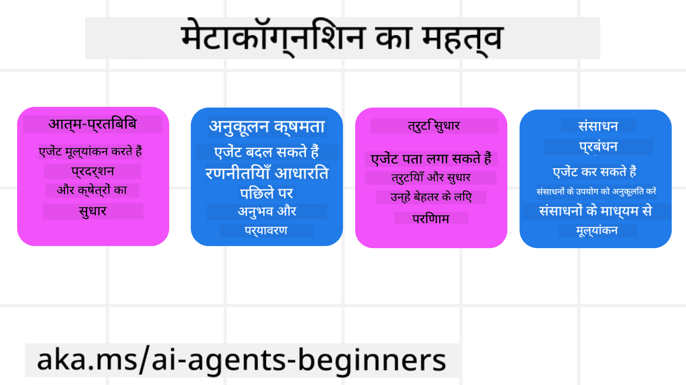
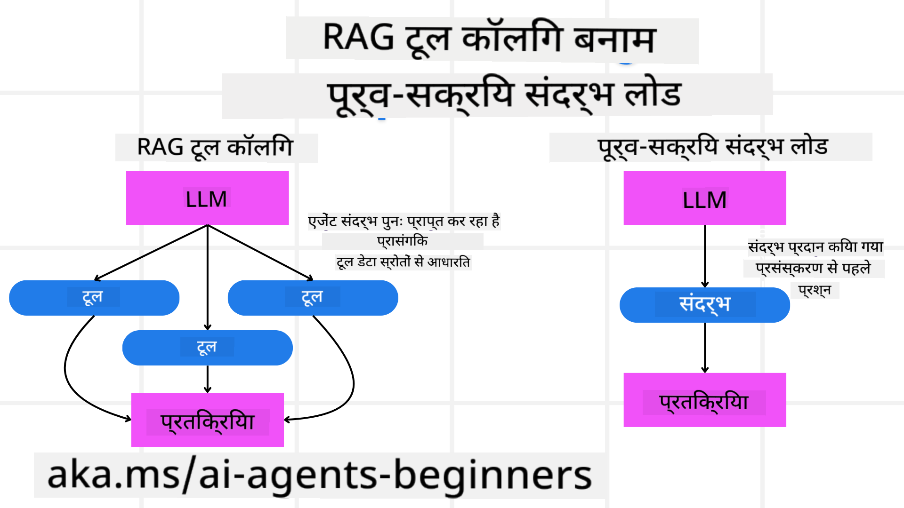

<!--
CO_OP_TRANSLATOR_METADATA:
{
  "original_hash": "5f0deef171fc3a68d5d3d770a8bfb03d",
  "translation_date": "2025-08-30T13:55:49+00:00",
  "source_file": "09-metacognition/README.md",
  "language_code": "hi"
}
-->
[](https://youtu.be/His9R6gw6Ec?si=3_RMb8VprNvdLRhX)

> _(ऊपर दी गई छवि पर क्लिक करें इस पाठ का वीडियो देखने के लिए)_
# एआई एजेंट्स में मेटाकॉग्निशन

## परिचय

एआई एजेंट्स में मेटाकॉग्निशन पर पाठ में आपका स्वागत है! यह अध्याय उन शुरुआती लोगों के लिए डिज़ाइन किया गया है जो यह जानने के लिए उत्सुक हैं कि एआई एजेंट्स अपने सोचने की प्रक्रियाओं के बारे में कैसे सोच सकते हैं। इस पाठ के अंत तक, आप प्रमुख अवधारणाओं को समझेंगे और एआई एजेंट डिज़ाइन में मेटाकॉग्निशन लागू करने के लिए व्यावहारिक उदाहरणों से लैस होंगे।

## सीखने के लक्ष्य

इस पाठ को पूरा करने के बाद, आप सक्षम होंगे:

1. एजेंट परिभाषाओं में तर्क चक्रों के प्रभावों को समझना।
2. आत्म-सुधार करने वाले एजेंट्स की मदद के लिए योजना और मूल्यांकन तकनीकों का उपयोग करना।
3. ऐसे एजेंट्स बनाना जो कोड को हेरफेर करके कार्यों को पूरा कर सकें।

## मेटाकॉग्निशन का परिचय

मेटाकॉग्निशन उच्च-स्तरीय संज्ञानात्मक प्रक्रियाओं को संदर्भित करता है जो किसी के अपने सोचने के तरीके के बारे में सोचने को शामिल करती हैं। एआई एजेंट्स के लिए, इसका मतलब है कि वे आत्म-जागरूकता और पिछले अनुभवों के आधार पर अपने कार्यों का मूल्यांकन और समायोजन कर सकते हैं। मेटाकॉग्निशन, या "सोचने के बारे में सोचना," एजेंटिक एआई सिस्टम्स के विकास में एक महत्वपूर्ण अवधारणा है। इसमें एआई सिस्टम्स को उनके आंतरिक प्रक्रियाओं के बारे में जागरूक होना और उनके व्यवहार की निगरानी, ​​नियमन और अनुकूलन करने में सक्षम होना शामिल है। ठीक वैसे ही जैसे हम किसी समस्या को समझने या स्थिति का आकलन करने के लिए करते हैं। यह आत्म-जागरूकता एआई सिस्टम्स को बेहतर निर्णय लेने, त्रुटियों की पहचान करने और समय के साथ उनके प्रदर्शन में सुधार करने में मदद कर सकती है - फिर से ट्यूरिंग टेस्ट और इस बहस से जुड़ते हुए कि क्या एआई दुनिया पर कब्जा करने जा रहा है।

एजेंटिक एआई सिस्टम्स के संदर्भ में, मेटाकॉग्निशन कई चुनौतियों को संबोधित करने में मदद कर सकता है, जैसे:
- पारदर्शिता: यह सुनिश्चित करना कि एआई सिस्टम्स अपने तर्क और निर्णयों की व्याख्या कर सकते हैं।
- तर्क: एआई सिस्टम्स की जानकारी को संश्लेषित करने और ठोस निर्णय लेने की क्षमता को बढ़ाना।
- अनुकूलन: एआई सिस्टम्स को नए वातावरण और बदलती परिस्थितियों के अनुकूल होने की अनुमति देना।
- धारणा: एआई सिस्टम्स की सटीकता में सुधार करना ताकि वे अपने परिवेश से डेटा को पहचान और व्याख्या कर सकें।

### मेटाकॉग्निशन क्या है?

मेटाकॉग्निशन, या "सोचने के बारे में सोचना," एक उच्च-स्तरीय संज्ञानात्मक प्रक्रिया है जो किसी के संज्ञानात्मक प्रक्रियाओं की आत्म-जागरूकता और आत्म-नियमन को शामिल करती है। एआई के क्षेत्र में, मेटाकॉग्निशन एजेंट्स को उनकी रणनीतियों और कार्यों का मूल्यांकन और अनुकूलन करने में सक्षम बनाता है, जिससे समस्या-समाधान और निर्णय लेने की क्षमताओं में सुधार होता है। मेटाकॉग्निशन को समझकर, आप ऐसे एआई एजेंट्स डिज़ाइन कर सकते हैं जो न केवल अधिक बुद्धिमान हों बल्कि अधिक अनुकूलनीय और कुशल भी हों। सच्चे मेटाकॉग्निशन में, आप देखेंगे कि एआई स्पष्ट रूप से अपने तर्क के बारे में तर्क कर रहा है।

उदाहरण: “मैंने सस्ते फ्लाइट्स को प्राथमिकता दी क्योंकि... हो सकता है कि मैं डायरेक्ट फ्लाइट्स को मिस कर रहा हूं, तो मुझे फिर से जांच करनी चाहिए।”
यह ट्रैक करना कि उसने एक निश्चित मार्ग क्यों चुना।
- यह नोट करना कि उसने गलतियाँ कीं क्योंकि उसने पिछली बार उपयोगकर्ता की प्राथमिकताओं पर अधिक भरोसा किया, इसलिए यह अपनी निर्णय लेने की रणनीति को संशोधित करता है न कि केवल अंतिम सिफारिश।
- पैटर्न का निदान करना जैसे, “जब भी मैं उपयोगकर्ता को 'बहुत भीड़भाड़' का उल्लेख करते हुए देखता हूं, मुझे न केवल कुछ आकर्षण हटाने चाहिए बल्कि यह भी प्रतिबिंबित करना चाहिए कि 'शीर्ष आकर्षण' चुनने की मेरी विधि त्रुटिपूर्ण है यदि मैं हमेशा लोकप्रियता के आधार पर रैंक करता हूं।”

### एआई एजेंट्स में मेटाकॉग्निशन का महत्व

एआई एजेंट डिज़ाइन में मेटाकॉग्निशन कई कारणों से महत्वपूर्ण भूमिका निभाता है:



- आत्म-चिंतन: एजेंट्स अपने प्रदर्शन का आकलन कर सकते हैं और सुधार के क्षेत्रों की पहचान कर सकते हैं।
- अनुकूलन क्षमता: एजेंट्स अपने पिछले अनुभवों और बदलते परिवेश के आधार पर अपनी रणनीतियों को संशोधित कर सकते हैं।
- त्रुटि सुधार: एजेंट्स स्वतः त्रुटियों का पता लगा सकते हैं और उन्हें सुधार सकते हैं, जिससे अधिक सटीक परिणाम प्राप्त होते हैं।
- संसाधन प्रबंधन: एजेंट्स अपने कार्यों की योजना और मूल्यांकन करके समय और कंप्यूटेशनल शक्ति जैसे संसाधनों का अनुकूलन कर सकते हैं।

## एआई एजेंट के घटक

मेटाकॉग्निटिव प्रक्रियाओं में गहराई से जाने से पहले, एआई एजेंट के बुनियादी घटकों को समझना आवश्यक है। एक एआई एजेंट में आमतौर पर निम्नलिखित शामिल होते हैं:

- व्यक्तित्व: एजेंट की व्यक्तित्व और विशेषताएँ, जो यह परिभाषित करती हैं कि वह उपयोगकर्ताओं के साथ कैसे बातचीत करता है।
- उपकरण: एजेंट द्वारा किए जा सकने वाले कार्यों और कार्यों की क्षमताएँ।
- कौशल: एजेंट के पास मौजूद ज्ञान और विशेषज्ञता।

ये घटक एक "विशेषज्ञता इकाई" बनाने के लिए मिलकर काम करते हैं जो विशिष्ट कार्यों को पूरा कर सकती है।

**उदाहरण**:
एक ट्रैवल एजेंट पर विचार करें, जो न केवल आपकी छुट्टी की योजना बनाता है बल्कि वास्तविक समय डेटा और पिछले ग्राहक यात्रा अनुभवों के आधार पर अपना मार्ग समायोजित करता है।

### उदाहरण: ट्रैवल एजेंट सेवा में मेटाकॉग्निशन

कल्पना करें कि आप एआई द्वारा संचालित एक ट्रैवल एजेंट सेवा डिज़ाइन कर रहे हैं। यह एजेंट, "ट्रैवल एजेंट," उपयोगकर्ताओं को उनकी छुट्टियों की योजना बनाने में मदद करता है। मेटाकॉग्निशन को शामिल करने के लिए, ट्रैवल एजेंट को आत्म-जागरूकता और पिछले अनुभवों के आधार पर अपने कार्यों का मूल्यांकन और समायोजन करने की आवश्यकता है। यहाँ मेटाकॉग्निशन कैसे भूमिका निभा सकता है:

#### वर्तमान कार्य

वर्तमान कार्य उपयोगकर्ता को पेरिस की यात्रा की योजना बनाने में मदद करना है।

#### कार्य पूरा करने के चरण

1. **उपयोगकर्ता प्राथमिकताएँ एकत्र करें**: उपयोगकर्ता से उनकी यात्रा की तारीखों, बजट, रुचियों (जैसे संग्रहालय, भोजन, खरीदारी), और किसी भी विशिष्ट आवश्यकताओं के बारे में पूछें।
2. **जानकारी प्राप्त करें**: उपयोगकर्ता की प्राथमिकताओं से मेल खाने वाले फ्लाइट विकल्प, आवास, आकर्षण और रेस्तरां खोजें।
3. **सिफारिशें उत्पन्न करें**: फ्लाइट विवरण, होटल आरक्षण, और सुझाई गई गतिविधियों के साथ एक व्यक्तिगत यात्रा कार्यक्रम प्रदान करें।
4. **प्रतिक्रिया के आधार पर समायोजन करें**: सिफारिशों पर उपयोगकर्ता से प्रतिक्रिया मांगें और आवश्यक समायोजन करें।

#### आवश्यक संसाधन

- फ्लाइट और होटल बुकिंग डेटाबेस तक पहुंच।
- पेरिस के आकर्षण और रेस्तरां की जानकारी।
- पिछले इंटरैक्शन से उपयोगकर्ता प्रतिक्रिया डेटा।

#### अनुभव और आत्म-चिंतन

ट्रैवल एजेंट अपने प्रदर्शन का मूल्यांकन करने और पिछले अनुभवों से सीखने के लिए मेटाकॉग्निशन का उपयोग करता है। उदाहरण के लिए:

1. **उपयोगकर्ता प्रतिक्रिया का विश्लेषण**: ट्रैवल एजेंट यह समीक्षा करता है कि कौन सी सिफारिशें अच्छी तरह से प्राप्त हुईं और कौन सी नहीं। यह अपनी भविष्य की सिफारिशों को तदनुसार समायोजित करता है।
2. **अनुकूलन क्षमता**: यदि किसी उपयोगकर्ता ने पहले भीड़भाड़ वाली जगहों के लिए नापसंदगी का उल्लेख किया है, तो ट्रैवल एजेंट भविष्य में पीक आवर्स के दौरान लोकप्रिय पर्यटक स्थलों की सिफारिश करने से बचता है।
3. **त्रुटि सुधार**: यदि ट्रैवल एजेंट ने पिछले बुकिंग में कोई त्रुटि की, जैसे कि पूरी तरह से बुक किए गए होटल का सुझाव देना, तो यह सिफारिशें करने से पहले उपलब्धता की अधिक सख्ती से जांच करना सीखता है।

#### व्यावहारिक डेवलपर उदाहरण

यहाँ ट्रैवल एजेंट के कोड का एक सरलीकृत उदाहरण है जो मेटाकॉग्निशन को शामिल करता है:

```python
class Travel_Agent:
    def __init__(self):
        self.user_preferences = {}
        self.experience_data = []

    def gather_preferences(self, preferences):
        self.user_preferences = preferences

    def retrieve_information(self):
        # Search for flights, hotels, and attractions based on preferences
        flights = search_flights(self.user_preferences)
        hotels = search_hotels(self.user_preferences)
        attractions = search_attractions(self.user_preferences)
        return flights, hotels, attractions

    def generate_recommendations(self):
        flights, hotels, attractions = self.retrieve_information()
        itinerary = create_itinerary(flights, hotels, attractions)
        return itinerary

    def adjust_based_on_feedback(self, feedback):
        self.experience_data.append(feedback)
        # Analyze feedback and adjust future recommendations
        self.user_preferences = adjust_preferences(self.user_preferences, feedback)

# Example usage
travel_agent = Travel_Agent()
preferences = {
    "destination": "Paris",
    "dates": "2025-04-01 to 2025-04-10",
    "budget": "moderate",
    "interests": ["museums", "cuisine"]
}
travel_agent.gather_preferences(preferences)
itinerary = travel_agent.generate_recommendations()
print("Suggested Itinerary:", itinerary)
feedback = {"liked": ["Louvre Museum"], "disliked": ["Eiffel Tower (too crowded)"]}
travel_agent.adjust_based_on_feedback(feedback)
```

#### मेटाकॉग्निशन क्यों महत्वपूर्ण है

- **आत्म-चिंतन**: एजेंट्स अपने प्रदर्शन का विश्लेषण कर सकते हैं और सुधार के क्षेत्रों की पहचान कर सकते हैं।
- **अनुकूलन क्षमता**: एजेंट्स प्रतिक्रिया और बदलती परिस्थितियों के आधार पर रणनीतियों को संशोधित कर सकते हैं।
- **त्रुटि सुधार**: एजेंट्स स्वतः त्रुटियों का पता लगा सकते हैं और उन्हें सुधार सकते हैं।
- **संसाधन प्रबंधन**: एजेंट्स संसाधन उपयोग को अनुकूलित कर सकते हैं, जैसे समय और कंप्यूटेशनल शक्ति।

मेटाकॉग्निशन को शामिल करके, ट्रैवल एजेंट अधिक व्यक्तिगत और सटीक यात्रा सिफारिशें प्रदान कर सकता है, जिससे समग्र उपयोगकर्ता अनुभव बढ़ता है।

---

## 2. एजेंट्स में योजना बनाना

योजना बनाना एआई एजेंट व्यवहार का एक महत्वपूर्ण घटक है। इसमें वर्तमान स्थिति, संसाधनों और संभावित बाधाओं को ध्यान में रखते हुए लक्ष्य प्राप्त करने के लिए आवश्यक चरणों को रेखांकित करना शामिल है।

### योजना के तत्व

- **वर्तमान कार्य**: कार्य को स्पष्ट रूप से परिभाषित करें।
- **कार्य पूरा करने के चरण**: कार्य को प्रबंधनीय चरणों में विभाजित करें।
- **आवश्यक संसाधन**: आवश्यक संसाधनों की पहचान करें।
- **अनुभव**: योजना बनाने के लिए पिछले अनुभवों का उपयोग करें।

**उदाहरण**:
यहाँ वे चरण हैं जो ट्रैवल एजेंट को उपयोगकर्ता की यात्रा की प्रभावी ढंग से योजना बनाने में मदद करने के लिए उठाने की आवश्यकता है:

### ट्रैवल एजेंट के चरण

1. **उपयोगकर्ता प्राथमिकताएँ एकत्र करें**
   - उपयोगकर्ता से उनकी यात्रा की तारीखों, बजट, रुचियों और किसी भी विशिष्ट आवश्यकताओं के बारे में पूछें।
   - उदाहरण: "आप यात्रा की योजना कब बना रहे हैं?" "आपका बजट रेंज क्या है?" "आप छुट्टी पर कौन सी गतिविधियाँ पसंद करते हैं?"

2. **जानकारी प्राप्त करें**
   - उपयोगकर्ता की प्राथमिकताओं के आधार पर प्रासंगिक यात्रा विकल्प खोजें।
   - **फ्लाइट्स**: उपयोगकर्ता के बजट और पसंदीदा यात्रा तिथियों के भीतर उपलब्ध फ्लाइट्स देखें।
   - **आवास**: उपयोगकर्ता की स्थान, कीमत और सुविधाओं की प्राथमिकताओं से मेल खाने वाले होटल या किराये की संपत्तियाँ खोजें।
   - **आकर्षण और रेस्तरां**: उपयोगकर्ता की रुचियों के अनुरूप लोकप्रिय आकर्षण, गतिविधियाँ और खाने के विकल्पों की पहचान करें।

3. **सिफारिशें उत्पन्न करें**
   - प्राप्त जानकारी को एक व्यक्तिगत यात्रा कार्यक्रम में संकलित करें।
   - उपयोगकर्ता की प्राथमिकताओं के अनुसार सिफारिशों को तैयार करते हुए फ्लाइट विकल्प, होटल आरक्षण और सुझाई गई गतिविधियों का विवरण प्रदान करें।

4. **यात्रा कार्यक्रम उपयोगकर्ता को प्रस्तुत करें**
   - उपयोगकर्ता को समीक्षा के लिए प्रस्तावित यात्रा कार्यक्रम साझा करें।
   - उदाहरण: "यहाँ पेरिस की आपकी यात्रा के लिए एक सुझाया गया यात्रा कार्यक्रम है। इसमें फ्लाइट विवरण, होटल बुकिंग और अनुशंसित गतिविधियों और रेस्तरां की सूची शामिल है। मुझे अपनी राय बताएं!"

5. **प्रतिक्रिया एकत्र करें**
   - प्रस्तावित यात्रा कार्यक्रम पर उपयोगकर्ता से प्रतिक्रिया मांगें।
   - उदाहरण: "क्या आपको फ्लाइट विकल्प पसंद हैं?" "क्या होटल आपकी आवश्यकताओं के लिए उपयुक्त है?" "क्या कोई गतिविधियाँ हैं जिन्हें आप जोड़ना या हटाना चाहते हैं?"

6. **प्रतिक्रिया के आधार पर समायोजन करें**
   - उपयोगकर्ता की प्रतिक्रिया के आधार पर यात्रा कार्यक्रम को संशोधित करें।
   - फ्लाइट, आवास और गतिविधि सिफारिशों को उपयोगकर्ता की प्राथमिकताओं से बेहतर मेल खाने के लिए आवश्यक परिवर्तन करें।

7. **अंतिम पुष्टि**
   - उपयोगकर्ता को अंतिम पुष्टि के लिए अद्यतन यात्रा कार्यक्रम प्रस्तुत करें।
   - उदाहरण: "मैंने आपकी प्रतिक्रिया के आधार पर समायोजन किए हैं। यहाँ अद्यतन यात्रा कार्यक्रम है। क्या सब कुछ आपको ठीक लग रहा है?"

8. **बुकिंग और आरक्षण की पुष्टि करें**
   - एक बार उपयोगकर्ता यात्रा कार्यक्रम को मंजूरी दे देता है, फ्लाइट्स, आवास और किसी भी पूर्व-योजना गतिविधियों की बुकिंग के साथ आगे बढ़ें।
   - उपयोगकर्ता को पुष्टि विवरण भेजें।

9. **चल रही सहायता प्रदान करें**
   - यात्रा से पहले और यात्रा के दौरान उपयोगकर्ता को किसी भी बदलाव या अतिरिक्त अनुरोधों में सहायता करने के लिए उपलब्ध रहें।
   - उदाहरण: "यदि आपको अपनी यात्रा के दौरान किसी भी अतिरिक्त सहायता की आवश्यकता हो, तो मुझसे कभी भी संपर्क करें!"

### उदाहरण इंटरैक्शन

```python
class Travel_Agent:
    def __init__(self):
        self.user_preferences = {}
        self.experience_data = []

    def gather_preferences(self, preferences):
        self.user_preferences = preferences

    def retrieve_information(self):
        flights = search_flights(self.user_preferences)
        hotels = search_hotels(self.user_preferences)
        attractions = search_attractions(self.user_preferences)
        return flights, hotels, attractions

    def generate_recommendations(self):
        flights, hotels, attractions = self.retrieve_information()
        itinerary = create_itinerary(flights, hotels, attractions)
        return itinerary

    def adjust_based_on_feedback(self, feedback):
        self.experience_data.append(feedback)
        self.user_preferences = adjust_preferences(self.user_preferences, feedback)

# Example usage within a booing request
travel_agent = Travel_Agent()
preferences = {
    "destination": "Paris",
    "dates": "2025-04-01 to 2025-04-10",
    "budget": "moderate",
    "interests": ["museums", "cuisine"]
}
travel_agent.gather_preferences(preferences)
itinerary = travel_agent.generate_recommendations()
print("Suggested Itinerary:", itinerary)
feedback = {"liked": ["Louvre Museum"], "disliked": ["Eiffel Tower (too crowded)"]}
travel_agent.adjust_based_on_feedback(feedback)
```

## 3. सुधारात्मक RAG प्रणाली

पहले आइए RAG टूल और प्री-एम्प्टिव कॉन्टेक्स्ट लोड के बीच अंतर को समझें।



### रिट्रीवल-ऑगमेंटेड जनरेशन (RAG)

RAG एक रिट्रीवल सिस्टम को एक जनरेटिव मॉडल के साथ जोड़ता है। जब कोई क्वेरी की जाती है, तो रिट्रीवल सिस्टम बाहरी स्रोत से प्रासंगिक दस्तावेज़ या डेटा प्राप्त करता है, और इस प्राप्त जानकारी का उपयोग जनरेटिव मॉडल के इनपुट को बढ़ाने के लिए किया जाता है। यह मॉडल को अधिक सटीक और प्रासंगिक प्रतिक्रियाएँ उत्पन्न करने में मदद करता है।

RAG प्रणाली में, एजेंट ज्ञान आधार से प्रासंगिक जानकारी प्राप्त करता है और इसका उपयोग उपयुक्त प्रतिक्रियाएँ या कार्य उत्पन्न करने के लिए करता है।

### सुधारात्मक RAG दृष्टिकोण

सुधारात्मक RAG दृष्टिकोण एआई एजेंट्स की सटीकता में सुधार करने और त्रुटियों को सुधारने के लिए RAG तकनीकों का उपयोग करने पर केंद्रित है। इसमें शामिल है:

1. **प्रॉम्प्टिंग तकनीक**: एजेंट को प्रासंगिक जानकारी प्राप्त करने में मार्गदर्शन करने के लिए विशिष्ट प्रॉम्प्ट्स का उपयोग करना।
2. **टूल**: प्राप्त जानकारी की प्रासंगिकता का मूल्यांकन करने और सटीक प्रतिक्रियाएँ उत्पन्न करने में सक्षम एल्गोरिदम और तंत्र लागू करना।
3. **मूल्यांकन**: एजेंट के प्रदर्शन का लगातार आकलन करना और इसकी सटीकता और दक्षता में सुधार के लिए समायोजन करना।

#### उदाहरण: सर्च एजेंट में सुधारात्मक RAG

एक सर्च एजेंट पर विचार करें जो उपयोगकर्ता क्वेरी का उत्तर देने के लिए वेब से जानकारी प्राप्त करता है। सुधारात्मक RAG दृष्टिकोण में शामिल हो सकता है:

1. **प्रॉम्प्टिंग तकनीक**: उपयोगकर्ता के इनपुट के आधार पर सर्च क्वेरी तैयार करना।
2. **टूल**: प्राकृतिक भाषा प्रसंस्करण और मशीन लर्निंग एल्गोरिदम का उपयोग करके सर्च परिणामों को रैंक और फ़िल्टर करना।
3. **मूल्यांकन**: उपयोगकर्ता प्रतिक्रिया का विश्लेषण करके प्राप्त जानकारी में अशुद्धियों की पहचान करना और उन्हें सुधारना।

### ट्रैवल एजेंट में सुधारात्मक RAG

सुधारात्मक RAG (रिट्रीवल-ऑगमेंटेड जनरेशन) एआई की जानकारी प्राप्त करने और उत्पन्न करने की क्षमता को बढ़ाता है, साथ ही किसी भी अशुद्धियों को सुधारता है। आइए देखें कि ट्रैवल एजेंट सुधारात्मक RAG दृष्टिकोण का उपयोग करके अधिक सटीक और प्रासंगिक यात्रा सिफारिशें कैसे प्रदान कर सकता है।

इसमें शामिल है:

- **प्रॉम्प्टिंग तकनीक:** एजेंट को प्रासंगिक जानकारी प्राप्त करने में मार्गदर्शन करने के लिए विशिष्ट प्रॉम्प्ट्स का उपयोग करना।
- **टूल:** प्राप्त जानकारी की प्रासंगिकता का मूल्यांकन करने और सटीक प्रतिक्रियाएँ उत्पन्न करने में सक्षम एल्गोरिदम और तंत्र लागू करना।
- **मूल्यांकन:** एजेंट के प्रदर्शन का लगातार आकलन करना और इसकी सटीकता और दक्षता में सुधार के लिए समायोजन करना।

#### ट्रैवल एजेंट में सुधारात्मक RAG लागू करने के चरण

1. **प्रारंभिक उपयोगकर्ता इंटरैक्शन**
   - ट्रैवल एजेंट उपयोगकर्ता से प्रारंभिक प्राथमिकताएँ एकत्र करता है, जैसे गंतव्य, यात्रा तिथियाँ, बजट और रुचियाँ।
   - उदाहरण:

     ```python
     preferences = {
         "destination": "Paris",
         "dates": "2025-04-01 to 2025-04-10",
         "budget": "moderate",
         "interests": ["museums", "cuisine"]
     }
     ```

2. **जानकारी की प्राप्ति**
   - ट्रैवल एजेंट उपयोगकर्ता की प्राथमिकताओं के आधार पर फ्लाइट्स, आवास, आकर्षण और रेस्तरां के बारे में जानकारी प्राप्त करता है।
   - उदाहरण:

     ```python
     flights = search_flights(preferences)
     hotels = search_hotels(preferences)
     attractions = search_attractions(preferences)
     ```

3. **
```python
class Travel_Agent:
    def __init__(self):
        self.user_preferences = {}
        self.experience_data = []

    def gather_preferences(self, preferences):
        self.user_preferences = preferences

    def retrieve_information(self):
        flights = search_flights(self.user_preferences)
        hotels = search_hotels(self.user_preferences)
        attractions = search_attractions(self.user_preferences)
        return flights, hotels, attractions

    def generate_recommendations(self):
        flights, hotels, attractions = self.retrieve_information()
        itinerary = create_itinerary(flights, hotels, attractions)
        return itinerary

    def adjust_based_on_feedback(self, feedback):
        self.experience_data.append(feedback)
        self.user_preferences = adjust_preferences(self.user_preferences, feedback)
        new_itinerary = self.generate_recommendations()
        return new_itinerary

# Example usage
travel_agent = Travel_Agent()
preferences = {
    "destination": "Paris",
    "dates": "2025-04-01 to 2025-04-10",
    "budget": "moderate",
    "interests": ["museums", "cuisine"]
}
travel_agent.gather_preferences(preferences)
itinerary = travel_agent.generate_recommendations()
print("Suggested Itinerary:", itinerary)
feedback = {"liked": ["Louvre Museum"], "disliked": ["Eiffel Tower (too crowded)"]}
new_itinerary = travel_agent.adjust_based_on_feedback(feedback)
print("Updated Itinerary:", new_itinerary)
```

### पूर्व-संदर्भ लोड

पूर्व-संदर्भ लोड का मतलब है कि किसी क्वेरी को प्रोसेस करने से पहले मॉडल में संबंधित संदर्भ या पृष्ठभूमि की जानकारी लोड करना। इसका मतलब है कि मॉडल को शुरुआत से ही इस जानकारी तक पहुंच होती है, जिससे वह अतिरिक्त डेटा को प्रोसेस के दौरान पुनः प्राप्त किए बिना अधिक सूचित उत्तर प्रदान कर सकता है।

यहां एक सरल उदाहरण दिया गया है कि यात्रा एजेंट एप्लिकेशन के लिए पूर्व-संदर्भ लोड कैसा दिख सकता है:

```python
class TravelAgent:
    def __init__(self):
        # Pre-load popular destinations and their information
        self.context = {
            "Paris": {"country": "France", "currency": "Euro", "language": "French", "attractions": ["Eiffel Tower", "Louvre Museum"]},
            "Tokyo": {"country": "Japan", "currency": "Yen", "language": "Japanese", "attractions": ["Tokyo Tower", "Shibuya Crossing"]},
            "New York": {"country": "USA", "currency": "Dollar", "language": "English", "attractions": ["Statue of Liberty", "Times Square"]},
            "Sydney": {"country": "Australia", "currency": "Dollar", "language": "English", "attractions": ["Sydney Opera House", "Bondi Beach"]}
        }

    def get_destination_info(self, destination):
        # Fetch destination information from pre-loaded context
        info = self.context.get(destination)
        if info:
            return f"{destination}:\nCountry: {info['country']}\nCurrency: {info['currency']}\nLanguage: {info['language']}\nAttractions: {', '.join(info['attractions'])}"
        else:
            return f"Sorry, we don't have information on {destination}."

# Example usage
travel_agent = TravelAgent()
print(travel_agent.get_destination_info("Paris"))
print(travel_agent.get_destination_info("Tokyo"))
```

#### व्याख्या

1. **प्रारंभिक सेटअप (`__init__` मेथड)**: `TravelAgent` क्लास एक डिक्शनरी को पहले से लोड करता है, जिसमें पेरिस, टोक्यो, न्यूयॉर्क और सिडनी जैसे लोकप्रिय स्थलों की जानकारी होती है। इस डिक्शनरी में प्रत्येक गंतव्य के लिए देश, मुद्रा, भाषा और प्रमुख आकर्षण जैसी जानकारी शामिल होती है।

2. **जानकारी प्राप्त करना (`get_destination_info` मेथड)**: जब कोई उपयोगकर्ता किसी विशेष गंतव्य के बारे में पूछता है, तो `get_destination_info` मेथड पहले से लोड किए गए संदर्भ डिक्शनरी से संबंधित जानकारी प्राप्त करता है।

संदर्भ को पहले से लोड करके, यात्रा एजेंट एप्लिकेशन उपयोगकर्ता की क्वेरी का तेजी से उत्तर दे सकता है, बिना इस जानकारी को वास्तविक समय में किसी बाहरी स्रोत से पुनः प्राप्त किए। यह एप्लिकेशन को अधिक कुशल और उत्तरदायी बनाता है।

### लक्ष्य के साथ योजना की शुरुआत करना और फिर उसे दोहराना

लक्ष्य के साथ योजना की शुरुआत करने का मतलब है कि प्रक्रिया शुरू करने से पहले एक स्पष्ट उद्देश्य या परिणाम को परिभाषित करना। इस लक्ष्य को पहले से परिभाषित करके, मॉडल इसे पूरी प्रक्रिया के दौरान एक मार्गदर्शक सिद्धांत के रूप में उपयोग कर सकता है। यह सुनिश्चित करता है कि प्रत्येक चरण वांछित परिणाम प्राप्त करने के करीब ले जाए, जिससे प्रक्रिया अधिक कुशल और केंद्रित हो।

यहां एक उदाहरण दिया गया है कि यात्रा एजेंट के लिए यात्रा योजना को लक्ष्य के साथ कैसे शुरू किया जा सकता है:

### परिदृश्य

एक यात्रा एजेंट ग्राहक के लिए एक अनुकूलित अवकाश योजना बनाना चाहता है। लक्ष्य है ग्राहक की प्राथमिकताओं और बजट के आधार पर एक यात्रा कार्यक्रम तैयार करना जो उनकी संतुष्टि को अधिकतम करे।

### चरण

1. ग्राहक की प्राथमिकताओं और बजट को परिभाषित करें।
2. इन प्राथमिकताओं के आधार पर प्रारंभिक योजना बनाएं।
3. योजना को परिष्कृत करने के लिए दोहराएं, ग्राहक की संतुष्टि को अनुकूलित करें।

#### पायथन कोड

```python
class TravelAgent:
    def __init__(self, destinations):
        self.destinations = destinations

    def bootstrap_plan(self, preferences, budget):
        plan = []
        total_cost = 0

        for destination in self.destinations:
            if total_cost + destination['cost'] <= budget and self.match_preferences(destination, preferences):
                plan.append(destination)
                total_cost += destination['cost']

        return plan

    def match_preferences(self, destination, preferences):
        for key, value in preferences.items():
            if destination.get(key) != value:
                return False
        return True

    def iterate_plan(self, plan, preferences, budget):
        for i in range(len(plan)):
            for destination in self.destinations:
                if destination not in plan and self.match_preferences(destination, preferences) and self.calculate_cost(plan, destination) <= budget:
                    plan[i] = destination
                    break
        return plan

    def calculate_cost(self, plan, new_destination):
        return sum(destination['cost'] for destination in plan) + new_destination['cost']

# Example usage
destinations = [
    {"name": "Paris", "cost": 1000, "activity": "sightseeing"},
    {"name": "Tokyo", "cost": 1200, "activity": "shopping"},
    {"name": "New York", "cost": 900, "activity": "sightseeing"},
    {"name": "Sydney", "cost": 1100, "activity": "beach"},
]

preferences = {"activity": "sightseeing"}
budget = 2000

travel_agent = TravelAgent(destinations)
initial_plan = travel_agent.bootstrap_plan(preferences, budget)
print("Initial Plan:", initial_plan)

refined_plan = travel_agent.iterate_plan(initial_plan, preferences, budget)
print("Refined Plan:", refined_plan)
```

#### कोड व्याख्या

1. **प्रारंभिक सेटअप (`__init__` मेथड)**: `TravelAgent` क्लास संभावित गंतव्यों की एक सूची के साथ प्रारंभ होता है, जिसमें नाम, लागत और गतिविधि प्रकार जैसे गुण होते हैं।

2. **योजना की शुरुआत (`bootstrap_plan` मेथड)**: यह मेथड ग्राहक की प्राथमिकताओं और बजट के आधार पर एक प्रारंभिक यात्रा योजना बनाता है। यह गंतव्यों की सूची के माध्यम से दोहराता है और उन्हें योजना में जोड़ता है यदि वे ग्राहक की प्राथमिकताओं से मेल खाते हैं और बजट में फिट होते हैं।

3. **प्राथमिकताओं का मिलान (`match_preferences` मेथड)**: यह मेथड जांचता है कि क्या कोई गंतव्य ग्राहक की प्राथमिकताओं से मेल खाता है।

4. **योजना को दोहराना (`iterate_plan` मेथड)**: यह मेथड प्रारंभिक योजना को परिष्कृत करता है, प्रत्येक गंतव्य को बेहतर विकल्प के साथ बदलने की कोशिश करता है, ग्राहक की प्राथमिकताओं और बजट बाधाओं को ध्यान में रखते हुए।

5. **लागत की गणना (`calculate_cost` मेथड)**: यह मेथड वर्तमान योजना की कुल लागत की गणना करता है, जिसमें संभावित नए गंतव्य भी शामिल हैं।

#### उदाहरण उपयोग

- **प्रारंभिक योजना**: यात्रा एजेंट ग्राहक की दर्शनीय स्थलों की प्राथमिकताओं और $2000 के बजट के आधार पर एक प्रारंभिक योजना बनाता है।
- **परिष्कृत योजना**: यात्रा एजेंट योजना को दोहराता है, ग्राहक की प्राथमिकताओं और बजट को अनुकूलित करता है।

योजना को एक स्पष्ट लक्ष्य (जैसे, ग्राहक की संतुष्टि को अधिकतम करना) के साथ शुरू करके और योजना को परिष्कृत करने के लिए दोहराकर, यात्रा एजेंट ग्राहक के लिए एक अनुकूलित और अनुकूलित यात्रा कार्यक्रम बना सकता है। यह दृष्टिकोण सुनिश्चित करता है कि यात्रा योजना शुरुआत से ही ग्राहक की प्राथमिकताओं और बजट के साथ मेल खाती है और प्रत्येक पुनरावृत्ति के साथ बेहतर होती जाती है।

### LLM का उपयोग पुनः रैंकिंग और स्कोरिंग के लिए

बड़े भाषा मॉडल (LLMs) का उपयोग पुनः रैंकिंग और स्कोरिंग के लिए किया जा सकता है, ताकि प्राप्त दस्तावेज़ों या उत्पन्न उत्तरों की प्रासंगिकता और गुणवत्ता का मूल्यांकन किया जा सके। यह कैसे काम करता है:

**पुनः प्राप्ति:** प्रारंभिक पुनः प्राप्ति चरण क्वेरी के आधार पर संभावित दस्तावेज़ों या उत्तरों का एक सेट प्राप्त करता है।

**पुनः रैंकिंग:** LLM इन संभावनाओं का मूल्यांकन करता है और उन्हें उनकी प्रासंगिकता और गुणवत्ता के आधार पर पुनः रैंक करता है। यह चरण सुनिश्चित करता है कि सबसे प्रासंगिक और उच्च-गुणवत्ता की जानकारी पहले प्रस्तुत की जाए।

**स्कोरिंग:** LLM प्रत्येक संभावना को स्कोर प्रदान करता है, जो उनकी प्रासंगिकता और गुणवत्ता को दर्शाता है। यह उपयोगकर्ता के लिए सबसे अच्छा उत्तर या दस्तावेज़ चुनने में मदद करता है।

LLMs का उपयोग पुनः रैंकिंग और स्कोरिंग के लिए करके, सिस्टम अधिक सटीक और प्रासंगिक जानकारी प्रदान कर सकता है, जिससे समग्र उपयोगकर्ता अनुभव में सुधार होता है।

यहां एक उदाहरण दिया गया है कि यात्रा एजेंट उपयोगकर्ता की प्राथमिकताओं के आधार पर यात्रा गंतव्यों को पुनः रैंक और स्कोर करने के लिए बड़े भाषा मॉडल (LLM) का उपयोग कैसे कर सकता है:

#### परिदृश्य - प्राथमिकताओं के आधार पर यात्रा

एक यात्रा एजेंट ग्राहक को उनकी प्राथमिकताओं के आधार पर सर्वोत्तम यात्रा गंतव्य सुझाना चाहता है। LLM गंतव्यों को पुनः रैंक और स्कोर करने में मदद करेगा ताकि सबसे प्रासंगिक विकल्प प्रस्तुत किए जा सकें।

#### चरण:

1. उपयोगकर्ता की प्राथमिकताओं को एकत्र करें।
2. संभावित यात्रा गंतव्यों की सूची पुनः प्राप्त करें।
3. उपयोगकर्ता की प्राथमिकताओं के आधार पर गंतव्यों को पुनः रैंक और स्कोर करने के लिए LLM का उपयोग करें।

यहां दिखाया गया है कि पिछले उदाहरण को Azure OpenAI सेवाओं का उपयोग करके कैसे अपडेट किया जा सकता है:

#### आवश्यकताएं

1. आपके पास एक Azure सदस्यता होनी चाहिए।
2. एक Azure OpenAI संसाधन बनाएं और अपनी API कुंजी प्राप्त करें।

#### पायथन कोड का उदाहरण

```python
import requests
import json

class TravelAgent:
    def __init__(self, destinations):
        self.destinations = destinations

    def get_recommendations(self, preferences, api_key, endpoint):
        # Generate a prompt for the Azure OpenAI
        prompt = self.generate_prompt(preferences)
        
        # Define headers and payload for the request
        headers = {
            'Content-Type': 'application/json',
            'Authorization': f'Bearer {api_key}'
        }
        payload = {
            "prompt": prompt,
            "max_tokens": 150,
            "temperature": 0.7
        }
        
        # Call the Azure OpenAI API to get the re-ranked and scored destinations
        response = requests.post(endpoint, headers=headers, json=payload)
        response_data = response.json()
        
        # Extract and return the recommendations
        recommendations = response_data['choices'][0]['text'].strip().split('\n')
        return recommendations

    def generate_prompt(self, preferences):
        prompt = "Here are the travel destinations ranked and scored based on the following user preferences:\n"
        for key, value in preferences.items():
            prompt += f"{key}: {value}\n"
        prompt += "\nDestinations:\n"
        for destination in self.destinations:
            prompt += f"- {destination['name']}: {destination['description']}\n"
        return prompt

# Example usage
destinations = [
    {"name": "Paris", "description": "City of lights, known for its art, fashion, and culture."},
    {"name": "Tokyo", "description": "Vibrant city, famous for its modernity and traditional temples."},
    {"name": "New York", "description": "The city that never sleeps, with iconic landmarks and diverse culture."},
    {"name": "Sydney", "description": "Beautiful harbour city, known for its opera house and stunning beaches."},
]

preferences = {"activity": "sightseeing", "culture": "diverse"}
api_key = 'your_azure_openai_api_key'
endpoint = 'https://your-endpoint.com/openai/deployments/your-deployment-name/completions?api-version=2022-12-01'

travel_agent = TravelAgent(destinations)
recommendations = travel_agent.get_recommendations(preferences, api_key, endpoint)
print("Recommended Destinations:")
for rec in recommendations:
    print(rec)
```

#### कोड व्याख्या - प्राथमिकता बुकिंग

1. **प्रारंभिक सेटअप**: `TravelAgent` क्लास संभावित यात्रा गंतव्यों की एक सूची के साथ प्रारंभ होता है, जिसमें नाम और विवरण जैसे गुण होते हैं।

2. **सिफारिशें प्राप्त करना (`get_recommendations` मेथड)**: यह मेथड उपयोगकर्ता की प्राथमिकताओं के आधार पर Azure OpenAI सेवा के लिए एक प्रॉम्प्ट उत्पन्न करता है और गंतव्यों को पुनः रैंक और स्कोर करने के लिए Azure OpenAI API को HTTP POST अनुरोध भेजता है।

3. **प्रॉम्प्ट उत्पन्न करना (`generate_prompt` मेथड)**: यह मेथड Azure OpenAI के लिए एक प्रॉम्प्ट तैयार करता है, जिसमें उपयोगकर्ता की प्राथमिकताएं और गंतव्यों की सूची शामिल होती है। प्रॉम्प्ट मॉडल को गंतव्यों को पुनः रैंक और स्कोर करने के लिए मार्गदर्शन करता है।

4. **API कॉल**: `requests` लाइब्रेरी का उपयोग Azure OpenAI API एंडपॉइंट पर HTTP POST अनुरोध करने के लिए किया जाता है। प्रतिक्रिया में पुनः रैंक और स्कोर किए गए गंतव्य शामिल होते हैं।

5. **उदाहरण उपयोग**: यात्रा एजेंट उपयोगकर्ता की प्राथमिकताओं (जैसे, दर्शनीय स्थलों और विविध संस्कृति में रुचि) को एकत्र करता है और यात्रा गंतव्यों के लिए पुनः रैंक और स्कोर की गई सिफारिशें प्राप्त करने के लिए Azure OpenAI सेवा का उपयोग करता है।

`your_azure_openai_api_key` को अपनी वास्तविक Azure OpenAI API कुंजी और `https://your-endpoint.com/...` को अपने Azure OpenAI परिनियोजन के वास्तविक एंडपॉइंट URL से बदलना सुनिश्चित करें।

LLM का उपयोग पुनः रैंकिंग और स्कोरिंग के लिए करके, यात्रा एजेंट ग्राहकों को अधिक व्यक्तिगत और प्रासंगिक यात्रा सिफारिशें प्रदान कर सकता है, जिससे उनका समग्र अनुभव बेहतर होता है।
#### व्यावहारिक उदाहरण: ट्रैवल एजेंट में इरादे के साथ खोज

आइए ट्रैवल एजेंट का उदाहरण लें और देखें कि इरादे के साथ खोज को कैसे लागू किया जा सकता है।

1. **उपयोगकर्ता की प्राथमिकताएँ एकत्र करना**

   ```python
   class Travel_Agent:
       def __init__(self):
           self.user_preferences = {}

       def gather_preferences(self, preferences):
           self.user_preferences = preferences
   ```

2. **उपयोगकर्ता के इरादे को समझना**

   ```python
   def identify_intent(query):
       if "book" in query or "purchase" in query:
           return "transactional"
       elif "website" in query or "official" in query:
           return "navigational"
       else:
           return "informational"
   ```

3. **संदर्भ जागरूकता**

   ```python
   def analyze_context(query, user_history):
       # Combine current query with user history to understand context
       context = {
           "current_query": query,
           "user_history": user_history
       }
       return context
   ```

4. **परिणाम खोजें और व्यक्तिगत बनाएं**

   ```python
   def search_with_intent(query, preferences, user_history):
       intent = identify_intent(query)
       context = analyze_context(query, user_history)
       if intent == "informational":
           search_results = search_information(query, preferences)
       elif intent == "navigational":
           search_results = search_navigation(query)
       elif intent == "transactional":
           search_results = search_transaction(query, preferences)
       personalized_results = personalize_results(search_results, user_history)
       return personalized_results

   def search_information(query, preferences):
       # Example search logic for informational intent
       results = search_web(f"best {preferences['interests']} in {preferences['destination']}")
       return results

   def search_navigation(query):
       # Example search logic for navigational intent
       results = search_web(query)
       return results

   def search_transaction(query, preferences):
       # Example search logic for transactional intent
       results = search_web(f"book {query} to {preferences['destination']}")
       return results

   def personalize_results(results, user_history):
       # Example personalization logic
       personalized = [result for result in results if result not in user_history]
       return personalized[:10]  # Return top 10 personalized results
   ```

5. **उदाहरण उपयोग**

   ```python
   travel_agent = Travel_Agent()
   preferences = {
       "destination": "Paris",
       "interests": ["museums", "cuisine"]
   }
   travel_agent.gather_preferences(preferences)
   user_history = ["Louvre Museum website", "Book flight to Paris"]
   query = "best museums in Paris"
   results = search_with_intent(query, preferences, user_history)
   print("Search Results:", results)
   ```

---

## 4. टूल के रूप में कोड जेनरेट करना

कोड जेनरेट करने वाले एजेंट AI मॉडल का उपयोग कोड लिखने और निष्पादित करने के लिए करते हैं, जिससे जटिल समस्याओं का समाधान और कार्यों का स्वचालन होता है।

### कोड जेनरेट करने वाले एजेंट

कोड जेनरेट करने वाले एजेंट जनरेटिव AI मॉडल का उपयोग कोड लिखने और निष्पादित करने के लिए करते हैं। ये एजेंट जटिल समस्याओं को हल कर सकते हैं, कार्यों को स्वचालित कर सकते हैं, और विभिन्न प्रोग्रामिंग भाषाओं में कोड जेनरेट और रन करके मूल्यवान अंतर्दृष्टि प्रदान कर सकते हैं।

#### व्यावहारिक अनुप्रयोग

1. **स्वचालित कोड जेनरेशन**: डेटा विश्लेषण, वेब स्क्रैपिंग, या मशीन लर्निंग जैसे विशिष्ट कार्यों के लिए कोड स्निपेट्स जेनरेट करें।
2. **SQL को RAG के रूप में उपयोग करना**: डेटाबेस से डेटा प्राप्त करने और हेरफेर करने के लिए SQL क्वेरी का उपयोग करें।
3. **समस्या समाधान**: विशिष्ट समस्याओं को हल करने के लिए कोड बनाएं और निष्पादित करें, जैसे एल्गोरिदम को अनुकूलित करना या डेटा का विश्लेषण करना।

#### उदाहरण: डेटा विश्लेषण के लिए कोड जेनरेट करने वाला एजेंट

कल्पना करें कि आप एक कोड जेनरेट करने वाले एजेंट को डिज़ाइन कर रहे हैं। यह इस प्रकार काम कर सकता है:

1. **कार्य**: डेटा सेट का विश्लेषण करना और रुझान और पैटर्न पहचानना।
2. **चरण**:
   - डेटा सेट को डेटा विश्लेषण टूल में लोड करें।
   - डेटा को फ़िल्टर और एग्रीगेट करने के लिए SQL क्वेरी जेनरेट करें।
   - क्वेरी निष्पादित करें और परिणाम प्राप्त करें।
   - परिणामों का उपयोग करके विज़ुअलाइज़ेशन और अंतर्दृष्टि उत्पन्न करें।
3. **आवश्यक संसाधन**: डेटा सेट तक पहुंच, डेटा विश्लेषण टूल, और SQL क्षमताएँ।
4. **अनुभव**: पिछले विश्लेषण के परिणामों का उपयोग करके भविष्य के विश्लेषण की सटीकता और प्रासंगिकता में सुधार करें।

### उदाहरण: ट्रैवल एजेंट के लिए कोड जेनरेट करने वाला एजेंट

इस उदाहरण में, हम एक कोड जेनरेट करने वाले एजेंट, ट्रैवल एजेंट, को डिज़ाइन करेंगे, जो उपयोगकर्ताओं को यात्रा की योजना बनाने में कोड जेनरेट और निष्पादित करके सहायता करेगा। यह एजेंट यात्रा विकल्पों को प्राप्त करने, परिणामों को फ़िल्टर करने, और जनरेटिव AI का उपयोग करके एक यात्रा कार्यक्रम तैयार करने जैसे कार्यों को संभाल सकता है।

#### कोड जेनरेट करने वाले एजेंट का अवलोकन

1. **उपयोगकर्ता की प्राथमिकताएँ एकत्र करना**: उपयोगकर्ता इनपुट जैसे गंतव्य, यात्रा की तिथियां, बजट, और रुचियां एकत्र करता है।
2. **डेटा प्राप्त करने के लिए कोड जेनरेट करना**: उड़ानों, होटलों, और आकर्षणों के बारे में डेटा प्राप्त करने के लिए कोड स्निपेट्स जेनरेट करता है।
3. **जेनरेट किए गए कोड को निष्पादित करना**: वास्तविक समय की जानकारी प्राप्त करने के लिए जेनरेट किए गए कोड को चलाता है।
4. **यात्रा कार्यक्रम तैयार करना**: प्राप्त डेटा को एक व्यक्तिगत यात्रा योजना में संकलित करता है।
5. **प्रतिक्रिया के आधार पर समायोजन करना**: उपयोगकर्ता प्रतिक्रिया प्राप्त करता है और परिणामों को परिष्कृत करने के लिए कोड को फिर से जेनरेट करता है।

#### चरण-दर-चरण कार्यान्वयन

1. **उपयोगकर्ता की प्राथमिकताएँ एकत्र करना**

   ```python
   class Travel_Agent:
       def __init__(self):
           self.user_preferences = {}

       def gather_preferences(self, preferences):
           self.user_preferences = preferences
   ```

2. **डेटा प्राप्त करने के लिए कोड जेनरेट करना**

   ```python
   def generate_code_to_fetch_data(preferences):
       # Example: Generate code to search for flights based on user preferences
       code = f"""
       def search_flights():
           import requests
           response = requests.get('https://api.example.com/flights', params={preferences})
           return response.json()
       """
       return code

   def generate_code_to_fetch_hotels(preferences):
       # Example: Generate code to search for hotels
       code = f"""
       def search_hotels():
           import requests
           response = requests.get('https://api.example.com/hotels', params={preferences})
           return response.json()
       """
       return code
   ```

3. **जेनरेट किए गए कोड को निष्पादित करना**

   ```python
   def execute_code(code):
       # Execute the generated code using exec
       exec(code)
       result = locals()
       return result

   travel_agent = Travel_Agent()
   preferences = {
       "destination": "Paris",
       "dates": "2025-04-01 to 2025-04-10",
       "budget": "moderate",
       "interests": ["museums", "cuisine"]
   }
   travel_agent.gather_preferences(preferences)
   
   flight_code = generate_code_to_fetch_data(preferences)
   hotel_code = generate_code_to_fetch_hotels(preferences)
   
   flights = execute_code(flight_code)
   hotels = execute_code(hotel_code)

   print("Flight Options:", flights)
   print("Hotel Options:", hotels)
   ```

4. **यात्रा कार्यक्रम तैयार करना**

   ```python
   def generate_itinerary(flights, hotels, attractions):
       itinerary = {
           "flights": flights,
           "hotels": hotels,
           "attractions": attractions
       }
       return itinerary

   attractions = search_attractions(preferences)
   itinerary = generate_itinerary(flights, hotels, attractions)
   print("Suggested Itinerary:", itinerary)
   ```

5. **प्रतिक्रिया के आधार पर समायोजन करना**

   ```python
   def adjust_based_on_feedback(feedback, preferences):
       # Adjust preferences based on user feedback
       if "liked" in feedback:
           preferences["favorites"] = feedback["liked"]
       if "disliked" in feedback:
           preferences["avoid"] = feedback["disliked"]
       return preferences

   feedback = {"liked": ["Louvre Museum"], "disliked": ["Eiffel Tower (too crowded)"]}
   updated_preferences = adjust_based_on_feedback(feedback, preferences)
   
   # Regenerate and execute code with updated preferences
   updated_flight_code = generate_code_to_fetch_data(updated_preferences)
   updated_hotel_code = generate_code_to_fetch_hotels(updated_preferences)
   
   updated_flights = execute_code(updated_flight_code)
   updated_hotels = execute_code(updated_hotel_code)
   
   updated_itinerary = generate_itinerary(updated_flights, updated_hotels, attractions)
   print("Updated Itinerary:", updated_itinerary)
   ```

### पर्यावरणीय जागरूकता और तर्क का उपयोग करना

टेबल की स्कीमा के आधार पर क्वेरी जेनरेशन प्रक्रिया को पर्यावरणीय जागरूकता और तर्क का उपयोग करके बेहतर बनाया जा सकता है।

यहां बताया गया है कि इसे कैसे किया जा सकता है:

1. **स्कीमा को समझना**: सिस्टम टेबल की स्कीमा को समझेगा और इस जानकारी का उपयोग क्वेरी जेनरेशन को आधार बनाने के लिए करेगा।
2. **प्रतिक्रिया के आधार पर समायोजन**: सिस्टम प्रतिक्रिया के आधार पर उपयोगकर्ता की प्राथमिकताओं को समायोजित करेगा और तर्क करेगा कि स्कीमा में किन फ़ील्ड्स को अपडेट करने की आवश्यकता है।
3. **क्वेरी जेनरेट और निष्पादित करना**: सिस्टम नई प्राथमिकताओं के आधार पर अपडेटेड फ्लाइट और होटल डेटा प्राप्त करने के लिए क्वेरी जेनरेट और निष्पादित करेगा।

यहां एक अपडेटेड Python कोड उदाहरण है जो इन अवधारणाओं को शामिल करता है:

```python
def adjust_based_on_feedback(feedback, preferences, schema):
    # Adjust preferences based on user feedback
    if "liked" in feedback:
        preferences["favorites"] = feedback["liked"]
    if "disliked" in feedback:
        preferences["avoid"] = feedback["disliked"]
    # Reasoning based on schema to adjust other related preferences
    for field in schema:
        if field in preferences:
            preferences[field] = adjust_based_on_environment(feedback, field, schema)
    return preferences

def adjust_based_on_environment(feedback, field, schema):
    # Custom logic to adjust preferences based on schema and feedback
    if field in feedback["liked"]:
        return schema[field]["positive_adjustment"]
    elif field in feedback["disliked"]:
        return schema[field]["negative_adjustment"]
    return schema[field]["default"]

def generate_code_to_fetch_data(preferences):
    # Generate code to fetch flight data based on updated preferences
    return f"fetch_flights(preferences={preferences})"

def generate_code_to_fetch_hotels(preferences):
    # Generate code to fetch hotel data based on updated preferences
    return f"fetch_hotels(preferences={preferences})"

def execute_code(code):
    # Simulate execution of code and return mock data
    return {"data": f"Executed: {code}"}

def generate_itinerary(flights, hotels, attractions):
    # Generate itinerary based on flights, hotels, and attractions
    return {"flights": flights, "hotels": hotels, "attractions": attractions}

# Example schema
schema = {
    "favorites": {"positive_adjustment": "increase", "negative_adjustment": "decrease", "default": "neutral"},
    "avoid": {"positive_adjustment": "decrease", "negative_adjustment": "increase", "default": "neutral"}
}

# Example usage
preferences = {"favorites": "sightseeing", "avoid": "crowded places"}
feedback = {"liked": ["Louvre Museum"], "disliked": ["Eiffel Tower (too crowded)"]}
updated_preferences = adjust_based_on_feedback(feedback, preferences, schema)

# Regenerate and execute code with updated preferences
updated_flight_code = generate_code_to_fetch_data(updated_preferences)
updated_hotel_code = generate_code_to_fetch_hotels(updated_preferences)

updated_flights = execute_code(updated_flight_code)
updated_hotels = execute_code(updated_hotel_code)

updated_itinerary = generate_itinerary(updated_flights, updated_hotels, feedback["liked"])
print("Updated Itinerary:", updated_itinerary)
```

#### व्याख्या - प्रतिक्रिया के आधार पर बुकिंग

1. **स्कीमा जागरूकता**: `schema` डिक्शनरी परिभाषित करती है कि प्रतिक्रिया के आधार पर प्राथमिकताओं को कैसे समायोजित किया जाना चाहिए। इसमें `favorites` और `avoid` जैसे फ़ील्ड्स शामिल हैं, जिनके लिए संबंधित समायोजन हैं।
2. **प्राथमिकताओं को समायोजित करना (`adjust_based_on_feedback` मेथड)**: यह मेथड प्रतिक्रिया और स्कीमा के आधार पर प्राथमिकताओं को समायोजित करता है।
3. **पर्यावरण-आधारित समायोजन (`adjust_based_on_environment` मेथड)**: यह मेथड स्कीमा और प्रतिक्रिया के आधार पर समायोजन को अनुकूलित करता है।
4. **क्वेरी जेनरेट और निष्पादित करना**: सिस्टम समायोजित प्राथमिकताओं के आधार पर अपडेटेड फ्लाइट और होटल डेटा प्राप्त करने के लिए कोड जेनरेट करता है और इन क्वेरी को निष्पादित करने का अनुकरण करता है।
5. **यात्रा कार्यक्रम तैयार करना**: सिस्टम नए फ्लाइट, होटल, और आकर्षण डेटा के आधार पर एक अपडेटेड यात्रा कार्यक्रम तैयार करता है।

सिस्टम को पर्यावरण-जागरूक और स्कीमा के आधार पर तर्कशील बनाकर, यह अधिक सटीक और प्रासंगिक क्वेरी जेनरेट कर सकता है, जिससे बेहतर यात्रा अनुशंसाएँ और अधिक व्यक्तिगत उपयोगकर्ता अनुभव प्राप्त होता है।

### SQL को Retrieval-Augmented Generation (RAG) तकनीक के रूप में उपयोग करना

SQL (स्ट्रक्चर्ड क्वेरी लैंग्वेज) डेटाबेस के साथ इंटरैक्ट करने के लिए एक शक्तिशाली टूल है। Retrieval-Augmented Generation (RAG) दृष्टिकोण के हिस्से के रूप में उपयोग किए जाने पर, SQL डेटाबेस से प्रासंगिक डेटा प्राप्त कर सकता है ताकि AI एजेंट्स में प्रतिक्रियाओं या कार्यों को सूचित और जेनरेट किया जा सके। आइए देखें कि ट्रैवल एजेंट के संदर्भ में SQL को RAG तकनीक के रूप में कैसे उपयोग किया जा सकता है।

#### मुख्य अवधारणाएँ

1. **डेटाबेस इंटरैक्शन**:
   - SQL का उपयोग डेटाबेस से क्वेरी करने, प्रासंगिक जानकारी प्राप्त करने, और डेटा में हेरफेर करने के लिए किया जाता है।
   - उदाहरण: यात्रा डेटाबेस से उड़ान विवरण, होटल जानकारी, और आकर्षण प्राप्त करना।

2. **RAG के साथ एकीकरण**:
   - SQL क्वेरी उपयोगकर्ता इनपुट और प्राथमिकताओं के आधार पर जेनरेट की जाती हैं।
   - प्राप्त डेटा का उपयोग व्यक्तिगत अनुशंसाएँ या कार्य जेनरेट करने के लिए किया जाता है।

3. **डायनामिक क्वेरी जेनरेशन**:
   - AI एजेंट संदर्भ और उपयोगकर्ता की आवश्यकताओं के आधार पर डायनामिक SQL क्वेरी जेनरेट करता है।
   - उदाहरण: बजट, तिथियों, और रुचियों के आधार पर परिणामों को फ़िल्टर करने के लिए SQL क्वेरी को अनुकूलित करना।

#### अनुप्रयोग

- **स्वचालित कोड जेनरेशन**: विशिष्ट कार्यों के लिए कोड स्निपेट्स जेनरेट करें।
- **SQL को RAG के रूप में उपयोग करना**: डेटा में हेरफेर करने के लिए SQL क्वेरी का उपयोग करें।
- **समस्या समाधान**: समस्याओं को हल करने के लिए कोड बनाएं और निष्पादित करें।

**उदाहरण**:
एक डेटा विश्लेषण एजेंट:

1. **कार्य**: डेटा सेट का विश्लेषण करना और रुझान खोजना।
2. **चरण**:
   - डेटा सेट लोड करें।
   - डेटा को फ़िल्टर करने के लिए SQL क्वेरी जेनरेट करें।
   - क्वेरी निष्पादित करें और परिणाम प्राप्त करें।
   - विज़ुअलाइज़ेशन और अंतर्दृष्टि उत्पन्न करें।
3. **संसाधन**: डेटा सेट तक पहुंच, SQL क्षमताएँ।
4. **अनुभव**: पिछले परिणामों का उपयोग करके भविष्य के विश्लेषण में सुधार करें।

#### व्यावहारिक उदाहरण: ट्रैवल एजेंट में SQL का उपयोग

1. **उपयोगकर्ता की प्राथमिकताएँ एकत्र करना**

   ```python
   class Travel_Agent:
       def __init__(self):
           self.user_preferences = {}

       def gather_preferences(self, preferences):
           self.user_preferences = preferences
   ```

2. **SQL क्वेरी जेनरेट करना**

   ```python
   def generate_sql_query(table, preferences):
       query = f"SELECT * FROM {table} WHERE "
       conditions = []
       for key, value in preferences.items():
           conditions.append(f"{key}='{value}'")
       query += " AND ".join(conditions)
       return query
   ```

3. **SQL क्वेरी निष्पादित करना**

   ```python
   import sqlite3

   def execute_sql_query(query, database="travel.db"):
       connection = sqlite3.connect(database)
       cursor = connection.cursor()
       cursor.execute(query)
       results = cursor.fetchall()
       connection.close()
       return results
   ```

4. **अनुशंसाएँ जेनरेट करना**

   ```python
   def generate_recommendations(preferences):
       flight_query = generate_sql_query("flights", preferences)
       hotel_query = generate_sql_query("hotels", preferences)
       attraction_query = generate_sql_query("attractions", preferences)
       
       flights = execute_sql_query(flight_query)
       hotels = execute_sql_query(hotel_query)
       attractions = execute_sql_query(attraction_query)
       
       itinerary = {
           "flights": flights,
           "hotels": hotels,
           "attractions": attractions
       }
       return itinerary

   travel_agent = Travel_Agent()
   preferences = {
       "destination": "Paris",
       "dates": "2025-04-01 to 2025-04-10",
       "budget": "moderate",
       "interests": ["museums", "cuisine"]
   }
   travel_agent.gather_preferences(preferences)
   itinerary = generate_recommendations(preferences)
   print("Suggested Itinerary:", itinerary)
   ```

#### SQL क्वेरी के उदाहरण

1. **फ्लाइट क्वेरी**

   ```sql
   SELECT * FROM flights WHERE destination='Paris' AND dates='2025-04-01 to 2025-04-10' AND budget='moderate';
   ```

2. **होटल क्वेरी**

   ```sql
   SELECT * FROM hotels WHERE destination='Paris' AND budget='moderate';
   ```

3. **आकर्षण क्वेरी**

   ```sql
   SELECT * FROM attractions WHERE destination='Paris' AND interests='museums, cuisine';
   ```

SQL को Retrieval-Augmented Generation (RAG) तकनीक के हिस्से के रूप में उपयोग करके, ट्रैवल एजेंट जैसे AI एजेंट प्रासंगिक डेटा को डायनामिक रूप से प्राप्त और उपयोग कर सकते हैं, जिससे सटीक और व्यक्तिगत अनुशंसाएँ प्रदान की जा सकती हैं।

### मेटाकॉग्निशन का उदाहरण

मेटाकॉग्निशन को लागू करने का एक उदाहरण दिखाने के लिए, आइए एक सरल एजेंट बनाएं जो *अपने निर्णय लेने की प्रक्रिया पर विचार करता है* और समस्या को हल करते समय अपनी रणनीति को समायोजित करता है। इस उदाहरण में, हम एक सिस्टम बनाएंगे जहां एक एजेंट होटल का चयन करने का प्रयास करता है, लेकिन जब यह त्रुटियाँ करता है या सबऑप्टिमल विकल्प चुनता है, तो अपनी रणनीति का मूल्यांकन करता है और इसे समायोजित करता है।

#### यह मेटाकॉग्निशन को कैसे दर्शाता है:

1. **प्रारंभिक निर्णय**: एजेंट सबसे सस्ता होटल चुनेगा, बिना गुणवत्ता के प्रभाव को समझे।
2. **विचार और मूल्यांकन**: प्रारंभिक चयन के बाद, एजेंट जांच करेगा कि होटल "खराब" विकल्प था या नहीं, उपयोगकर्ता प्रतिक्रिया का उपयोग करके। यदि यह पाता है कि होटल की गुणवत्ता बहुत कम थी, तो यह अपनी तर्क प्रक्रिया पर विचार करेगा।
3. **रणनीति समायोजित करना**: एजेंट अपनी रणनीति को समायोजित करता है और "सबसे सस्ता" से "उच्चतम गुणवत्ता" पर स्विच करता है, जिससे भविष्य में निर्णय लेने की प्रक्रिया में सुधार होता है।

यहां एक उदाहरण है:

```python
class HotelRecommendationAgent:
    def __init__(self):
        self.previous_choices = []  # Stores the hotels chosen previously
        self.corrected_choices = []  # Stores the corrected choices
        self.recommendation_strategies = ['cheapest', 'highest_quality']  # Available strategies

    def recommend_hotel(self, hotels, strategy):
        """
        Recommend a hotel based on the chosen strategy.
        The strategy can either be 'cheapest' or 'highest_quality'.
        """
        if strategy == 'cheapest':
            recommended = min(hotels, key=lambda x: x['price'])
        elif strategy == 'highest_quality':
            recommended = max(hotels, key=lambda x: x['quality'])
        else:
            recommended = None
        self.previous_choices.append((strategy, recommended))
        return recommended

    def reflect_on_choice(self):
        """
        Reflect on the last choice made and decide if the agent should adjust its strategy.
        The agent considers if the previous choice led to a poor outcome.
        """
        if not self.previous_choices:
            return "No choices made yet."

        last_choice_strategy, last_choice = self.previous_choices[-1]
        # Let's assume we have some user feedback that tells us whether the last choice was good or not
        user_feedback = self.get_user_feedback(last_choice)

        if user_feedback == "bad":
            # Adjust strategy if the previous choice was unsatisfactory
            new_strategy = 'highest_quality' if last_choice_strategy == 'cheapest' else 'cheapest'
            self.corrected_choices.append((new_strategy, last_choice))
            return f"Reflecting on choice. Adjusting strategy to {new_strategy}."
        else:
            return "The choice was good. No need to adjust."

    def get_user_feedback(self, hotel):
        """
        Simulate user feedback based on hotel attributes.
        For simplicity, assume if the hotel is too cheap, the feedback is "bad".
        If the hotel has quality less than 7, feedback is "bad".
        """
        if hotel['price'] < 100 or hotel['quality'] < 7:
            return "bad"
        return "good"

# Simulate a list of hotels (price and quality)
hotels = [
    {'name': 'Budget Inn', 'price': 80, 'quality': 6},
    {'name': 'Comfort Suites', 'price': 120, 'quality': 8},
    {'name': 'Luxury Stay', 'price': 200, 'quality': 9}
]

# Create an agent
agent = HotelRecommendationAgent()

# Step 1: The agent recommends a hotel using the "cheapest" strategy
recommended_hotel = agent.recommend_hotel(hotels, 'cheapest')
print(f"Recommended hotel (cheapest): {recommended_hotel['name']}")

# Step 2: The agent reflects on the choice and adjusts strategy if necessary
reflection_result = agent.reflect_on_choice()
print(reflection_result)

# Step 3: The agent recommends again, this time using the adjusted strategy
adjusted_recommendation = agent.recommend_hotel(hotels, 'highest_quality')
print(f"Adjusted hotel recommendation (highest_quality): {adjusted_recommendation['name']}")
```

#### एजेंट की मेटाकॉग्निशन क्षमताएँ

मुख्य बात यह है कि एजेंट की क्षमता:
- अपने पिछले विकल्पों और निर्णय लेने की प्रक्रिया का मूल्यांकन करना।
- उस विचार के आधार पर अपनी रणनीति को समायोजित करना, यानी मेटाकॉग्निशन को क्रियान्वित करना।

यह मेटाकॉग्निशन का एक सरल रूप है, जहां सिस्टम आंतरिक प्रतिक्रिया के आधार पर अपनी तर्क प्रक्रिया को समायोजित करने में सक्षम है।

### निष्कर्ष

मेटाकॉग्निशन एक शक्तिशाली उपकरण है जो AI एजेंट्स की क्षमताओं को काफी हद तक बढ़ा सकता है। मेटाकॉग्निटिव प्रक्रियाओं को शामिल करके, आप ऐसे एजेंट डिज़ाइन कर सकते हैं जो अधिक बुद्धिमान, अनुकूलनीय, और कुशल हों। अतिरिक्त संसाधनों का उपयोग करके AI एजेंट्स में मेटाकॉग्निशन की रोमांचक दुनिया का और अधिक अन्वेषण करें।

### मेटाकॉग्निशन डिज़ाइन पैटर्न के बारे में और प्रश्न हैं?

[Azure AI Foundry Discord](https://aka.ms/ai-agents/discord) से जुड़ें, अन्य शिक्षार्थियों से मिलें, ऑफिस आवर्स में भाग लें, और अपने AI एजेंट्स से संबंधित प्रश्नों के उत्तर प्राप्त करें।

## पिछला पाठ

[मल्टी-एजेंट डिज़ाइन पैटर्न](../08-multi-agent/README.md)

## अगला पाठ

[उत्पादन में AI एजेंट्स](../10-ai-agents-production/README.md)

---

**अस्वीकरण**:  
यह दस्तावेज़ AI अनुवाद सेवा [Co-op Translator](https://github.com/Azure/co-op-translator) का उपयोग करके अनुवादित किया गया है। जबकि हम सटीकता के लिए प्रयासरत हैं, कृपया ध्यान दें कि स्वचालित अनुवादों में त्रुटियां या अशुद्धियां हो सकती हैं। मूल भाषा में लिखा गया दस्तावेज़ ही आधिकारिक स्रोत माना जाना चाहिए। महत्वपूर्ण जानकारी के लिए, पेशेवर मानव अनुवाद की सिफारिश की जाती है। इस अनुवाद के उपयोग से उत्पन्न किसी भी गलतफहमी या गलत व्याख्या के लिए हम उत्तरदायी नहीं हैं।