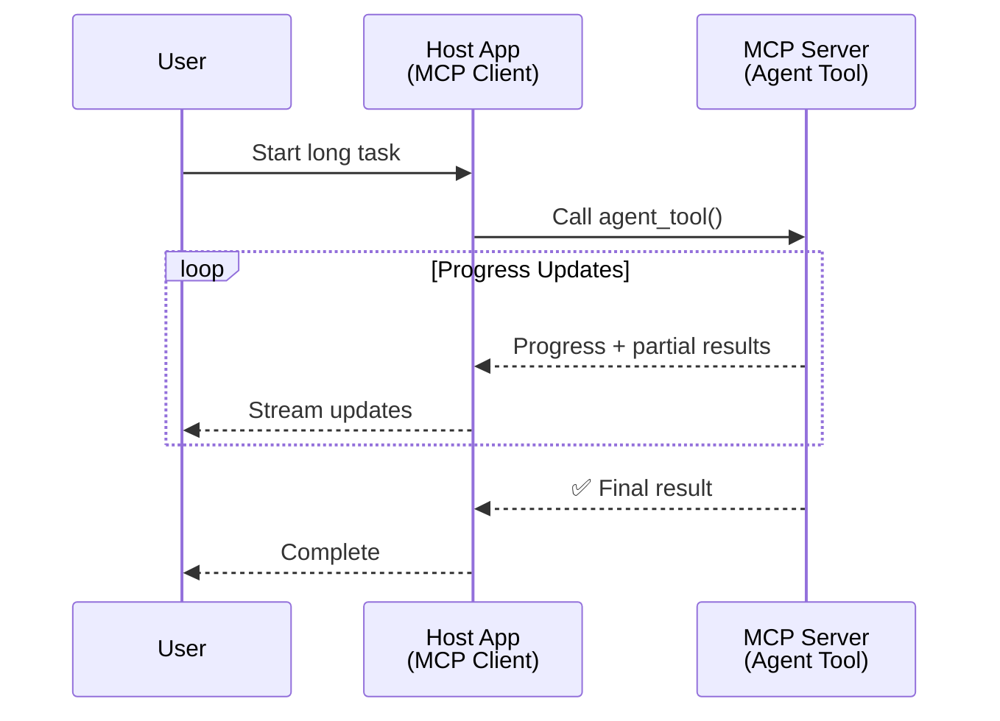
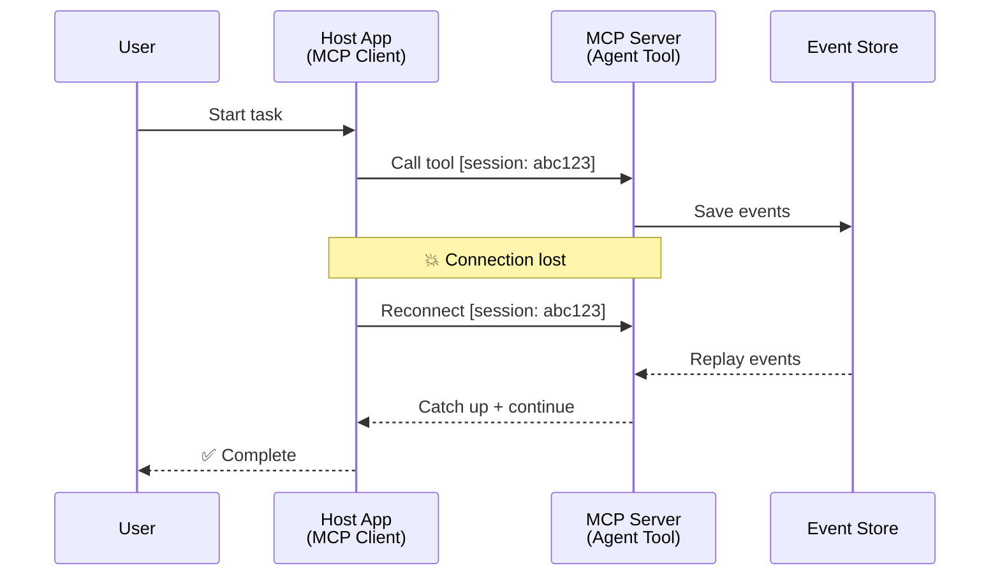
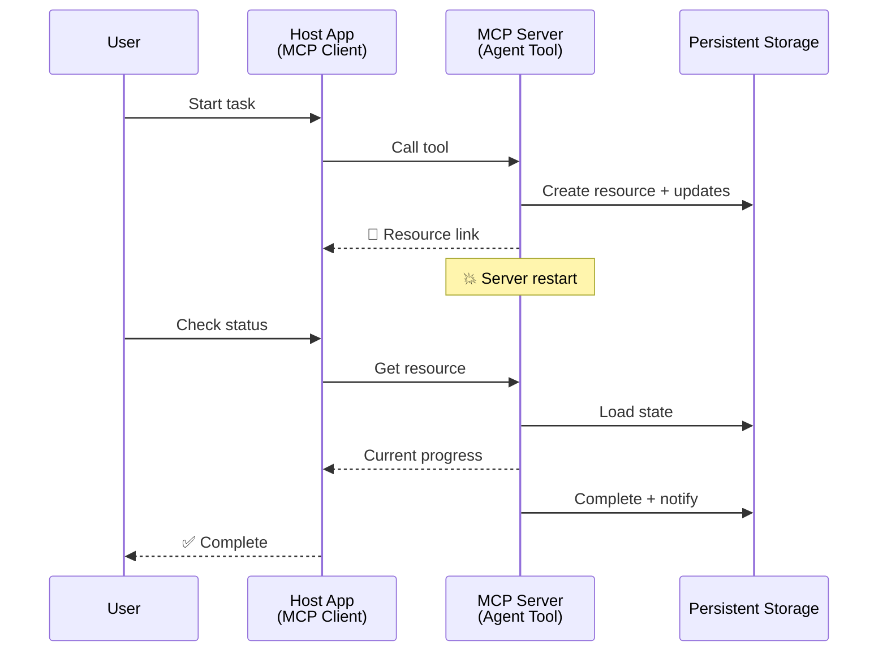
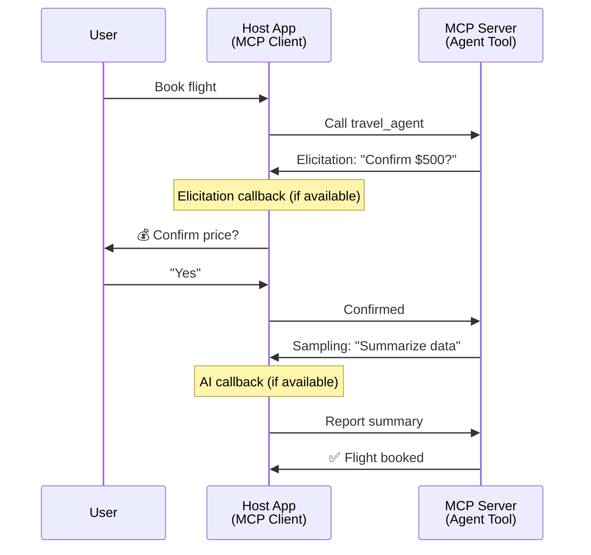
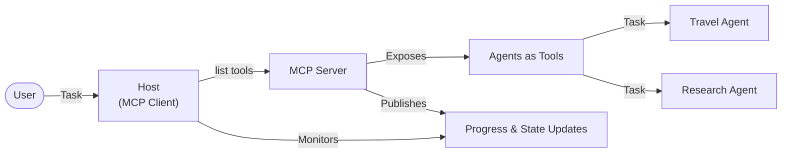

<!--
CO_OP_TRANSLATOR_METADATA:
{
  "original_hash": "5cc6836626047aa055e8960c8484a7d0",
  "translation_date": "2025-08-30T14:47:01+00:00",
  "source_file": "11-agentic-protocols/code_samples/mcp-agents/README.md",
  "language_code": "hi"
}
-->
# MCP के साथ एजेंट-से-एजेंट संचार प्रणाली बनाना

> संक्षेप में - क्या आप MCP पर Agent2Agent संचार बना सकते हैं? हां!

MCP अपने मूल उद्देश्य "LLMs को संदर्भ प्रदान करना" से काफी आगे बढ़ चुका है। हाल के सुधारों जैसे [resumable streams](https://modelcontextprotocol.io/docs/concepts/transports#resumability-and-redelivery), [elicitation](https://modelcontextprotocol.io/specification/2025-06-18/client/elicitation), [sampling](https://modelcontextprotocol.io/specification/2025-06-18/client/sampling), और सूचनाएं ([progress](https://modelcontextprotocol.io/specification/2025-06-18/basic/utilities/progress) और [resources](https://modelcontextprotocol.io/specification/2025-06-18/schema#resourceupdatednotification)) के साथ, MCP अब जटिल एजेंट-से-एजेंट संचार प्रणाली बनाने के लिए एक मजबूत आधार प्रदान करता है।

## एजेंट/टूल की गलतफहमी

जैसे-जैसे अधिक डेवलपर्स ऐसे टूल्स का उपयोग कर रहे हैं जिनमें एजेंटिक व्यवहार होता है (लंबे समय तक चलने वाले, निष्पादन के दौरान अतिरिक्त इनपुट की आवश्यकता हो सकती है, आदि), एक सामान्य गलतफहमी यह है कि MCP अनुपयुक्त है, मुख्य रूप से क्योंकि इसके शुरुआती टूल्स प्रिमिटिव के उदाहरण सरल अनुरोध-प्रतिक्रिया पैटर्न पर केंद्रित थे।

यह धारणा अब पुरानी हो चुकी है। MCP स्पेसिफिकेशन को पिछले कुछ महीनों में काफी हद तक बढ़ाया गया है, जिससे लंबे समय तक चलने वाले एजेंटिक व्यवहार के निर्माण के लिए आवश्यक क्षमताओं की कमी को पूरा किया जा सके:

- **स्ट्रीमिंग और आंशिक परिणाम**: निष्पादन के दौरान वास्तविक समय में प्रगति अपडेट
- **पुनः प्रारंभ करने की क्षमता**: क्लाइंट डिस्कनेक्शन के बाद पुनः कनेक्ट कर सकते हैं और जारी रख सकते हैं
- **टिकाऊपन**: परिणाम सर्वर पुनरारंभ के बाद भी बने रहते हैं (जैसे, resource links के माध्यम से)
- **मल्टी-टर्न**: निष्पादन के दौरान इंटरैक्टिव इनपुट elicitation और sampling के माध्यम से

इन सुविधाओं को MCP प्रोटोकॉल पर तैनात जटिल एजेंटिक और मल्टी-एजेंट एप्लिकेशन को सक्षम करने के लिए संयोजित किया जा सकता है।

संदर्भ के लिए, हम एक एजेंट को "टूल" के रूप में संदर्भित करेंगे जो MCP सर्वर पर उपलब्ध है। इसका मतलब है कि एक होस्ट एप्लिकेशन मौजूद है जो MCP क्लाइंट को लागू करता है, MCP सर्वर के साथ एक सत्र स्थापित करता है और एजेंट को कॉल कर सकता है।

## MCP टूल को "एजेंटिक" क्या बनाता है?

कार्यान्वयन में जाने से पहले, आइए यह स्थापित करें कि लंबे समय तक चलने वाले एजेंटों का समर्थन करने के लिए किस प्रकार की बुनियादी ढांचा क्षमताओं की आवश्यकता है।

> हम एक एजेंट को एक ऐसी इकाई के रूप में परिभाषित करेंगे जो लंबे समय तक स्वायत्त रूप से कार्य कर सकती है, जटिल कार्यों को संभालने में सक्षम है जिनके लिए कई इंटरैक्शन या वास्तविक समय की प्रतिक्रिया के आधार पर समायोजन की आवश्यकता हो सकती है।

### 1. स्ट्रीमिंग और आंशिक परिणाम

पारंपरिक अनुरोध-प्रतिक्रिया पैटर्न लंबे समय तक चलने वाले कार्यों के लिए काम नहीं करते। एजेंटों को प्रदान करने की आवश्यकता है:

- वास्तविक समय में प्रगति अपडेट
- मध्यवर्ती परिणाम

**MCP समर्थन**: Resource update notifications आंशिक परिणामों की स्ट्रीमिंग को सक्षम बनाती हैं, हालांकि JSON-RPC के 1:1 अनुरोध/प्रतिक्रिया मॉडल के साथ संघर्ष से बचने के लिए सावधानीपूर्वक डिज़ाइन की आवश्यकता होती है।

| सुविधा                     | उपयोग का मामला                                                                                                                                                                       | MCP समर्थन                                                                                 |
| -------------------------- | ----------------------------------------------------------------------------------------------------------------------------------------------------------------------------------- | ------------------------------------------------------------------------------------------ |
| वास्तविक समय प्रगति अपडेट | उपयोगकर्ता कोडबेस माइग्रेशन कार्य का अनुरोध करता है। एजेंट प्रगति को स्ट्रीम करता है: "10% - निर्भरता का विश्लेषण कर रहा है... 25% - टाइपस्क्रिप्ट फाइलों को परिवर्तित कर रहा है... 50% - आयात को अपडेट कर रहा है..." | ✅ प्रगति सूचनाएं                                                                          |
| आंशिक परिणाम              | "एक किताब बनाएं" कार्य आंशिक परिणामों को स्ट्रीम करता है, जैसे 1) कहानी का आर्क आउटलाइन, 2) अध्याय सूची, 3) प्रत्येक अध्याय जैसे ही पूरा होता है। होस्ट किसी भी चरण में निरीक्षण, रद्द या पुनर्निर्देशित कर सकता है। | ✅ सूचनाओं को "विस्तारित" किया जा सकता है ताकि आंशिक परिणाम शामिल हों, PR 383, 776 पर प्रस्ताव देखें |

<div align="center" style="font-style: italic; font-size: 0.95em; margin-bottom: 0.5em;">
<strong>चित्र 1:</strong> यह आरेख दिखाता है कि MCP एजेंट लंबे समय तक चलने वाले कार्य के दौरान होस्ट एप्लिकेशन को वास्तविक समय में प्रगति अपडेट और आंशिक परिणाम कैसे स्ट्रीम करता है, जिससे उपयोगकर्ता निष्पादन की निगरानी कर सकता है।
</div>



### 2. पुनः प्रारंभ करने की क्षमता

एजेंटों को नेटवर्क बाधाओं को सहजता से संभालने की आवश्यकता है:

- (क्लाइंट) डिस्कनेक्शन के बाद पुनः कनेक्ट करें
- जहां से छोड़ा था वहां से जारी रखें (संदेश पुनः वितरण)

**MCP समर्थन**: MCP StreamableHTTP transport आज सत्र पुनः प्रारंभ और संदेश पुनः वितरण को सत्र IDs और अंतिम घटना IDs के साथ समर्थन करता है। यहां महत्वपूर्ण बात यह है कि सर्वर को एक EventStore लागू करना चाहिए जो क्लाइंट पुनः कनेक्शन पर घटना पुनः चलाने को सक्षम बनाता है।  
ध्यान दें कि एक सामुदायिक प्रस्ताव (PR #975) है जो transport-agnostic पुनः प्रारंभ करने योग्य स्ट्रीम्स का पता लगाता है।

| सुविधा      | उपयोग का मामला                                                                                                                                                   | MCP समर्थन                                                                |
| ------------ | ---------------------------------------------------------------------------------------------------------------------------------------------------------- | -------------------------------------------------------------------------- |
| पुनः प्रारंभ | क्लाइंट लंबे समय तक चलने वाले कार्य के दौरान डिस्कनेक्ट हो जाता है। पुनः कनेक्शन पर, सत्र पुनः प्रारंभ होता है और छूटे हुए घटनाओं को पुनः चलाया जाता है, जहां से छोड़ा था वहां से निर्बाध रूप से जारी रहता है। | ✅ StreamableHTTP transport सत्र IDs, घटना पुनः चलाने, और EventStore के साथ |

<div align="center" style="font-style: italic; font-size: 0.95em; margin-bottom: 0.5em;">
<strong>चित्र 2:</strong> यह आरेख दिखाता है कि MCP का StreamableHTTP transport और event store कैसे सहज सत्र पुनः प्रारंभ को सक्षम बनाता है: यदि क्लाइंट डिस्कनेक्ट हो जाता है, तो यह पुनः कनेक्ट कर सकता है और छूटे हुए घटनाओं को पुनः चला सकता है, प्रगति की हानि के बिना कार्य जारी रख सकता है।
</div>



### 3. टिकाऊपन

लंबे समय तक चलने वाले एजेंटों को स्थायी स्थिति की आवश्यकता होती है:

- परिणाम सर्वर पुनरारंभ के बाद भी बने रहते हैं
- स्थिति को आउट-ऑफ-बैंड पुनः प्राप्त किया जा सकता है
- सत्रों के बीच प्रगति ट्रैकिंग

**MCP समर्थन**: MCP अब टूल कॉल के लिए Resource link return type का समर्थन करता है। आज, एक संभावित पैटर्न एक टूल डिज़ाइन करना है जो एक संसाधन बनाता है और तुरंत एक resource link लौटाता है। टूल पृष्ठभूमि में कार्य को संबोधित करना जारी रख सकता है और संसाधन को अपडेट कर सकता है। बदले में, क्लाइंट इस संसाधन की स्थिति की जांच करने के लिए चुन सकता है ताकि आंशिक या पूर्ण परिणाम प्राप्त किए जा सकें (आधारित संसाधन अपडेट जो सर्वर प्रदान करता है) या संसाधन के लिए अपडेट सूचनाओं की सदस्यता ले सकता है।

यहां एक सीमा यह है कि संसाधनों को पोल करना या अपडेट के लिए सदस्यता लेना संसाधनों का उपभोग कर सकता है, जिसका पैमाने पर प्रभाव पड़ता है। एक सामुदायिक प्रस्ताव (जिसमें #992 शामिल है) है जो वेबहुक या ट्रिगर्स को शामिल करने की संभावना का पता लगाता है जिसे सर्वर क्लाइंट/होस्ट एप्लिकेशन को अपडेट की सूचना देने के लिए कॉल कर सकता है।

| सुविधा    | उपयोग का मामला                                                                                                                                        | MCP समर्थन                                                        |
| ---------- | ----------------------------------------------------------------------------------------------------------------------------------------------- | ------------------------------------------------------------------ |
| टिकाऊपन | सर्वर डेटा माइग्रेशन कार्य के दौरान क्रैश हो जाता है। परिणाम और प्रगति पुनरारंभ के बाद भी बनी रहती है, क्लाइंट स्थिति की जांच कर सकता है और स्थायी संसाधन से जारी रख सकता है। | ✅ Resource links स्थायी स्टोरेज और स्थिति सूचनाओं के साथ |

आज, एक सामान्य पैटर्न एक टूल डिज़ाइन करना है जो एक संसाधन बनाता है और तुरंत एक resource link लौटाता है। टूल पृष्ठभूमि में कार्य को संबोधित कर सकता है, संसाधन सूचनाएं जारी कर सकता है जो प्रगति अपडेट के रूप में कार्य करती हैं या आंशिक परिणाम शामिल कर सकती हैं, और आवश्यकतानुसार संसाधन की सामग्री को अपडेट कर सकता है।

<div align="center" style="font-style: italic; font-size: 0.95em; margin-bottom: 0.5em;">
<strong>चित्र 3:</strong> यह आरेख दिखाता है कि MCP एजेंट स्थायी संसाधनों और स्थिति सूचनाओं का उपयोग करके लंबे समय तक चलने वाले कार्यों को सुनिश्चित करते हैं, जिससे सर्वर पुनरारंभ के बाद भी क्लाइंट प्रगति की जांच कर सकता है और परिणाम प्राप्त कर सकता है।
</div>



### 4. मल्टी-टर्न इंटरैक्शन

एजेंटों को अक्सर निष्पादन के दौरान अतिरिक्त इनपुट की आवश्यकता होती है:

- मानव स्पष्टीकरण या अनुमोदन
- जटिल निर्णयों के लिए AI सहायता
- गतिशील पैरामीटर समायोजन

**MCP समर्थन**: पूरी तरह से sampling (AI इनपुट के लिए) और elicitation (मानव इनपुट के लिए) के माध्यम से समर्थित।

| सुविधा                 | उपयोग का मामला                                                                                                                                     | MCP समर्थन                                           |
| ----------------------- | -------------------------------------------------------------------------------------------------------------------------------------------- | ----------------------------------------------------- |
| मल्टी-टर्न इंटरैक्शन | यात्रा बुकिंग एजेंट उपयोगकर्ता से मूल्य पुष्टि का अनुरोध करता है, फिर बुकिंग लेनदेन को पूरा करने से पहले यात्रा डेटा को संक्षेप में प्रस्तुत करने के लिए AI से अनुरोध करता है। | ✅ मानव इनपुट के लिए elicitation, AI इनपुट के लिए sampling |

<div align="center" style="font-style: italic; font-size: 0.95em; margin-bottom: 0.5em;">
<strong>चित्र 4:</strong> यह आरेख दिखाता है कि MCP एजेंट निष्पादन के दौरान इंटरैक्टिव रूप से मानव इनपुट प्राप्त कर सकते हैं या जटिल, मल्टी-टर्न वर्कफ़्लो जैसे पुष्टि और गतिशील निर्णय लेने का समर्थन करने के लिए AI सहायता का अनुरोध कर सकते हैं।
</div>



## MCP पर लंबे समय तक चलने वाले एजेंटों को लागू करना - कोड अवलोकन

इस लेख के हिस्से के रूप में, हम एक [कोड रिपॉजिटरी](https://github.com/victordibia/ai-tutorials/tree/main/MCP%20Agents) प्रदान करते हैं जिसमें MCP Python SDK के साथ StreamableHTTP transport का उपयोग करके लंबे समय तक चलने वाले एजेंटों का एक पूर्ण कार्यान्वयन शामिल है। यह कार्यान्वयन दिखाता है कि MCP क्षमताओं को कैसे संयोजित किया जा सकता है ताकि परिष्कृत एजेंट-जैसे व्यवहार सक्षम हो सकें।

विशेष रूप से, हम दो प्राथमिक एजेंट टूल्स के साथ एक सर्वर को लागू करते हैं:

- **यात्रा एजेंट** - मूल्य पुष्टि के साथ यात्रा बुकिंग सेवा का अनुकरण करता है
- **अनुसंधान एजेंट** - AI-सहायता प्राप्त सारांशों के साथ अनुसंधान कार्य करता है

दोनों एजेंट वास्तविक समय प्रगति अपडेट, इंटरैक्टिव पुष्टि, और पूर्ण सत्र पुनः प्रारंभ क्षमताओं का प्रदर्शन करते हैं।

### प्रमुख कार्यान्वयन अवधारणाएं

निम्नलिखित अनुभाग प्रत्येक क्षमता के लिए सर्वर-साइड एजेंट कार्यान्वयन और क्लाइंट-साइड होस्ट हैंडलिंग दिखाते हैं:

#### स्ट्रीमिंग और प्रगति अपडेट - वास्तविक समय कार्य स्थिति

स्ट्रीमिंग एजेंटों को लंबे समय तक चलने वाले कार्यों के दौरान वास्तविक समय प्रगति अपडेट प्रदान करने में सक्षम बनाती है, उपयोगकर्ताओं को कार्य स्थिति और मध्यवर्ती परिणामों के बारे में सूचित रखती है।

**सर्वर कार्यान्वयन (एजेंट प्रगति सूचनाएं भेजता है):**

```python
# From server/server.py - Travel agent sending progress updates
for i, step in enumerate(steps):
    await ctx.session.send_progress_notification(
        progress_token=ctx.request_id,
        progress=i * 25,
        total=100,
        message=step,
        related_request_id=str(ctx.request_id)
    )
    await anyio.sleep(2)  # Simulate work

# Alternative: Log messages for detailed step-by-step updates
await ctx.session.send_log_message(
    level="info",
    data=f"Processing step {current_step}/{steps} ({progress_percent}%)",
    logger="long_running_agent",
    related_request_id=ctx.request_id,
)
```

**क्लाइंट कार्यान्वयन (होस्ट प्रगति अपडेट प्राप्त करता है):**

```python
# From client/client.py - Client handling real-time notifications
async def message_handler(message) -> None:
    if isinstance(message, types.ServerNotification):
        if isinstance(message.root, types.LoggingMessageNotification):
            console.print(f"📡 [dim]{message.root.params.data}[/dim]")
        elif isinstance(message.root, types.ProgressNotification):
            progress = message.root.params
            console.print(f"🔄 [yellow]{progress.message} ({progress.progress}/{progress.total})[/yellow]")

# Register message handler when creating session
async with ClientSession(
    read_stream, write_stream,
    message_handler=message_handler
) as session:
```

#### Elicitation - उपयोगकर्ता इनपुट का अनुरोध करना

Elicitation एजेंटों को निष्पादन के दौरान उपयोगकर्ता इनपुट का अनुरोध करने में सक्षम बनाता है। यह लंबे समय तक चलने वाले कार्यों के दौरान पुष्टि, स्पष्टीकरण, या अनुमोदन के लिए आवश्यक है।

**सर्वर कार्यान्वयन (एजेंट पुष्टि का अनुरोध करता है):**

```python
# From server/server.py - Travel agent requesting price confirmation
elicit_result = await ctx.session.elicit(
    message=f"Please confirm the estimated price of $1200 for your trip to {destination}",
    requestedSchema=PriceConfirmationSchema.model_json_schema(),
    related_request_id=ctx.request_id,
)

if elicit_result and elicit_result.action == "accept":
    # Continue with booking
    logger.info(f"User confirmed price: {elicit_result.content}")
elif elicit_result and elicit_result.action == "decline":
    # Cancel the booking
    booking_cancelled = True
```

**क्लाइंट कार्यान्वयन (होस्ट elicitation callback प्रदान करता है):**

```python
# From client/client.py - Client handling elicitation requests
async def elicitation_callback(context, params):
    console.print(f"💬 Server is asking for confirmation:")
    console.print(f"   {params.message}")

    response = console.input("Do you accept? (y/n): ").strip().lower()

    if response in ['y', 'yes']:
        return types.ElicitResult(
            action="accept",
            content={"confirm": True, "notes": "Confirmed by user"}
        )
    else:
        return types.ElicitResult(
            action="decline",
            content={"confirm": False, "notes": "Declined by user"}
        )

# Register the callback when creating the session
async with ClientSession(
    read_stream, write_stream,
    elicitation_callback=elicitation_callback
) as session:
```

#### Sampling - AI सहायता का अनुरोध करना

Sampling एजेंटों को निष्पादन के दौरान जटिल निर्णयों या सामग्री निर्माण के लिए LLM सहायता का अनुरोध करने में सक्षम बनाता है। यह मानव-AI हाइब्रिड वर्कफ़्लो को सक्षम बनाता है।

**सर्वर कार्यान्वयन (एजेंट AI सहायता का अनुरोध करता है):**

```python
# From server/server.py - Research agent requesting AI summary
sampling_result = await ctx.session.create_message(
    messages=[
        SamplingMessage(
            role="user",
            content=TextContent(type="text", text=f"Please summarize the key findings for research on: {topic}")
        )
    ],
    max_tokens=100,
    related_request_id=ctx.request_id,
)

if sampling_result and sampling_result.content:
    if sampling_result.content.type == "text":
        sampling_summary = sampling_result.content.text
        logger.info(f"Received sampling summary: {sampling_summary}")
```

**क्लाइंट कार्यान्वयन (होस्ट sampling callback प्रदान करता है):**

```python
# From client/client.py - Client handling sampling requests
async def sampling_callback(context, params):
    message_text = params.messages[0].content.text if params.messages else 'No message'
    console.print(f"🧠 Server requested sampling: {message_text}")

    # In a real application, this could call an LLM API
    # For demo purposes, we provide a mock response
    mock_response = "Based on current research, MCP has evolved significantly..."

    return types.CreateMessageResult(
        role="assistant",
        content=types.TextContent(type="text", text=mock_response),
        model="interactive-client",
        stopReason="endTurn"
    )

# Register the callback when creating the session
async with ClientSession(
    read_stream, write_stream,
    sampling_callback=sampling_callback,
    elicitation_callback=elicitation_callback
) as session:
```

#### पुनः प्रारंभ करने की क्षमता - डिस्कनेक्शन के बाद सत्र निरंतरता

पुनः प्रारंभ करने की क्षमता सुनिश्चित करती है कि लंबे समय तक चलने वाले एजेंट कार्य क्लाइंट डिस्कनेक्शन को सहन कर सकते हैं और पुनः कनेक्शन पर निर्बाध रूप से जारी रह सकते हैं। इसे event stores और resumption tokens के माध्यम से लागू किया गया है।

**Event Store कार्यान्वयन (सर्वर सत्र स्थिति रखता है):**

```python
# From server/event_store.py - Simple in-memory event store
class SimpleEventStore(EventStore):
    def __init__(self):
        self._events: list[tuple[StreamId, EventId, JSONRPCMessage]] = []
        self._event_id_counter = 0

    async def store_event(self, stream_id: StreamId, message: JSONRPCMessage) -> EventId:
        """Store an event and return its ID."""
        self._event_id_counter += 1
        event_id = str(self._event_id_counter)
        self._events.append((stream_id, event_id, message))
        return event_id

    async def replay_events_after(self, last_event_id: EventId, send_callback: EventCallback) -> StreamId | None:
        """Replay events after the specified ID for resumption."""
        # Find events after the last known event and replay them
        for _, event_id, message in self._events[start_index:]:
            await send_callback(EventMessage(message, event_id))

# From server/server.py - Passing event store to session manager
def create_server_app(event_store: Optional[EventStore] = None) -> Starlette:
    server = ResumableServer()

    # Create session manager with event store for resumption
    session_manager = StreamableHTTPSessionManager(
        app=server,
        event_store=event_store,  # Event store enables session resumption
        json_response=False,
        security_settings=security_settings,
    )

    return Starlette(routes=[Mount("/mcp", app=session_manager.handle_request)])

# Usage: Initialize with event store
event_store = SimpleEventStore()
app = create_server_app(event_store)
```

**क्लाइंट Metadata के साथ Resumption Token (क्लाइंट संग्रहीत स्थिति का उपयोग करके पुनः कनेक्ट करता है):**

```python
# From client/client.py - Client resumption with metadata
if existing_tokens and existing_tokens.get("resumption_token"):
    # Use existing resumption token to continue where we left off
    metadata = ClientMessageMetadata(
        resumption_token=existing_tokens["resumption_token"],
    )
else:
    # Create callback to save resumption token when received
    def enhanced_callback(token: str):
        protocol_version = getattr(session, 'protocol_version', None)
        token_manager.save_tokens(session_id, token, protocol_version, command, args)

    metadata = ClientMessageMetadata(
        on_resumption_token_update=enhanced_callback,
    )

# Send request with resumption metadata
result = await session.send_request(
    types.ClientRequest(
        types.CallToolRequest(
            method="tools/call",
            params=types.CallToolRequestParams(name=command, arguments=args)
        )
    ),
    types.CallToolResult,
    metadata=metadata,
)
```

होस्ट एप्लिकेशन स्थानीय रूप से सत्र IDs और पुनः प्रारंभ टोकन बनाए रखता है, जिससे यह प्रगति या स्थिति खोए बिना मौजूदा सत्रों से पुनः कनेक्ट कर सकता है।

### कोड संगठन

<div align="center" style="font-style: italic; font-size: 0.95em; margin-bottom: 0.5em;">
<strong>चित्र 5:</strong> MCP-आधारित एजेंट प्रणाली वास्तुकला
</div>



**मुख्य फाइलें:**

- **`server/server.py`** - यात्रा और अनुसंधान एजेंटों के साथ पुनः प्रारंभ करने योग्य MCP सर्वर जो elicitation, sampling, और प्रगति अपडेट का प्रदर्शन करता है
- **`client/client.py`** - इंटरैक्टिव होस्ट एप्लिकेशन पुनः प्रारंभ समर्थन, callback हैंडलर्स, और टोकन प्रबंधन के साथ
- **`server/event_store.py`** - Event Store कार्यान्वयन जो सत्र पुनः प्रारंभ और संदेश पुनः वितरण को सक्षम बनाता है

## MCP पर मल्टी-एजेंट संचार तक विस्तार

उपरोक्त कार्यान्वयन को होस्ट एप्लिकेशन की बुद्धिमत्ता और दायरे को बढ़ाकर मल्टी-एजेंट सिस्टम तक विस्तारित किया जा सकता है:

- **बुद्धिमान कार्य विघटन**: होस्ट जटिल उपयोगकर्ता अनुरोधों का विश्लेषण करता है और उन्हें विभिन्न विशेषज्ञ एजेंटों के लिए उप-कार्य में विभाजित करता है
- **मल्टी-सर्वर समन्वय**: होस्ट कई MCP सर्वरों से कनेक्शन बनाए रखता है, प्रत्येक विभिन्न एजेंट क्षमताओं को उजागर करता है
- **कार्य स्थिति प्रबंधन**: होस्ट कई समवर्ती एजेंट कार्यों में प्रगति को ट्रैक करता है, निर्भरताओं और अनुक्रमण को संभालता है
- **लचीलापन और पुनः प्रयास**: होस्ट विफलताओं को प्रबंधित करता है, पुनः प्रयास तर्क लागू करता है, और जब एजेंट अनुपलब्ध हो जाते हैं तो कार्यों को पुनः रूट करता है
- **परिणाम संश्लेषण**: होस्ट कई एजेंटों से आउटपुट को एक सुसंगत अंतिम परिणाम में जोड़ता है

होस्ट एक साधारण क्लाइंट से एक बुद्धिमान ऑर्केस्ट्रेटर में विकसित होता है, वितरित एजेंट क्षमताओं का समन्वय करता है जबकि MCP प्रोटोकॉल नींव को बनाए रखता है।

## निष्कर्ष

MCP की उन्नत क्षमताएं - resource notifications, elicitation/sampling, resumable streams, और persistent resources - जटिल एजेंट-से-एजेंट इंटरैक्शन को सक्षम करती हैं जबकि प्रोटोकॉल की सादगी बनाए रखती हैं।

## आरंभ करना

अपना खुद का agent2agent सिस्टम बनाने के लिए तैयार हैं? इन चरणों का पालन करें:

### 1. डेमो चलाएं

```bash
# Start the server with event store for resumption
python -m server.server --port 8006

# In another terminal, run the interactive client
python -m client.client --url http://127.0.0.1:8006/mcp
```

**इंटरैक्टिव मोड में उपलब्ध कमांड:**

- `travel_agent` - मूल्य पुष्टि के साथ यात्रा

---

**अस्वीकरण**:  
यह दस्तावेज़ AI अनुवाद सेवा [Co-op Translator](https://github.com/Azure/co-op-translator) का उपयोग करके अनुवादित किया गया है। जबकि हम सटीकता के लिए प्रयास करते हैं, कृपया ध्यान दें कि स्वचालित अनुवाद में त्रुटियां या अशुद्धियां हो सकती हैं। मूल भाषा में उपलब्ध मूल दस्तावेज़ को आधिकारिक स्रोत माना जाना चाहिए। महत्वपूर्ण जानकारी के लिए, पेशेवर मानव अनुवाद की सिफारिश की जाती है। इस अनुवाद के उपयोग से उत्पन्न किसी भी गलतफहमी या गलत व्याख्या के लिए हम उत्तरदायी नहीं हैं।  